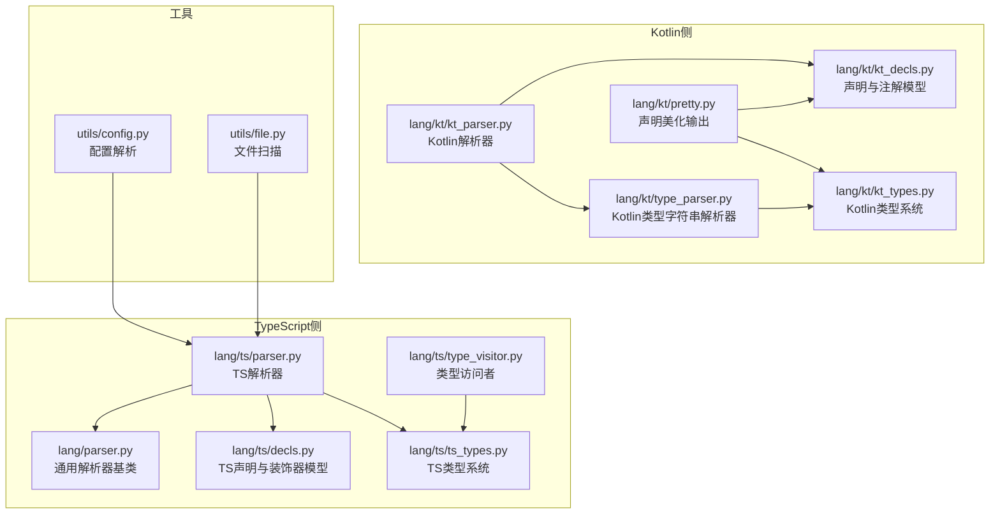
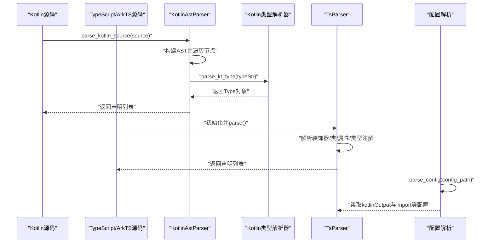
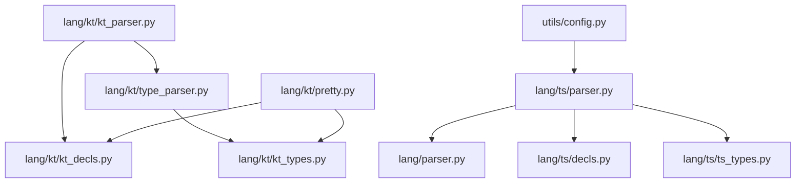

# API参考文档

<cite>
**本文档引用的文件**
- [lang/kt/kt_decls.py](file://lang/kt/kt_decls.py)
- [lang/kt/kt_parser.py](file://lang/kt/kt_parser.py)
- [lang/kt/kt_types.py](file://lang/kt/kt_types.py)
- [lang/kt/type_parser.py](file://lang/kt/type_parser.py)
- [lang/kt/pretty.py](file://lang/kt/pretty.py)
- [lang/ts/decls.py](file://lang/ts/decls.py)
- [lang/ts/parser.py](file://lang/ts/parser.py)
- [lang/ts/ts_types.py](file://lang/ts/ts_types.py)
- [lang/ts/type_visitor.py](file://lang/ts/type_visitor.py)
- [lang/parser.py](file://lang/parser.py)
- [utils/config.py](file://utils/config.py)
- [utils/file.py](file://utils/file.py)
- [pyproject.toml](file://pyproject.toml)
- [test/config.json](file://test/config.json)
- [test/cases/kt/class2.kt](file://test/cases/kt/class2.kt)
- [test/cases/class8.ts](file://test/cases/class8.ts)
</cite>

## 目录
1. [简介](#简介)
2. [项目结构](#项目结构)
3. [核心组件](#核心组件)
4. [架构总览](#架构总览)
5. [详细组件分析](#详细组件分析)
6. [依赖关系分析](#依赖关系分析)
7. [性能考虑](#性能考虑)
8. [故障排除指南](#故障排除指南)
9. [结论](#结论)
10. [附录](#附录)

## 简介
本API参考文档面向ArkTS与Kotlin之间的FFI（外部函数接口）转换工具，聚焦以下能力：
- 声明类型API：用于表示类、属性等声明及其修饰信息。
- 类型系统API：用于表示和识别Kotlin/TypeScript类型，包括原始类型、可空类型、数组、泛型应用、限定类型等。
- 解析器API：对Kotlin与TypeScript源码进行语法解析，提取声明与类型信息。
- 配置API：读取与校验配置文件，支持多包与导入项管理。
- 实用工具API：文件扫描与过滤，便于批量处理ArkTS/TS文件。

本文件以“自顶向下”的方式组织，先给出高层架构与组件职责，再深入到每个模块的类与方法定义、参数与返回值说明，并辅以流程图与时序图帮助理解。

## 项目结构
该项目采用按语言分层的模块化组织方式：
- lang/kt：Kotlin侧声明与类型系统、解析器与美化输出。
- lang/ts：TypeScript/ArkTS侧声明与类型系统、解析器与类型访问者。
- lang/parser.py：通用流式解析器基类，为TS解析器提供基础能力。
- utils：配置解析与文件扫描工具。
- test：测试样例与配置文件，用于演示API使用场景。

图表来源
- [lang/kt/kt_decls.py](file://lang/kt/kt_decls.py#L1-L51)
- [lang/kt/kt_parser.py](file://lang/kt/kt_parser.py#L1-L242)
- [lang/kt/kt_types.py](file://lang/kt/kt_types.py#L1-L191)
- [lang/kt/type_parser.py](file://lang/kt/type_parser.py#L1-L152)
- [lang/kt/pretty.py](file://lang/kt/pretty.py#L1-L97)
- [lang/ts/decls.py](file://lang/ts/decls.py#L1-L57)
- [lang/ts/parser.py](file://lang/ts/parser.py#L1-L242)
- [lang/ts/ts_types.py](file://lang/ts/ts_types.py#L1-L280)
- [lang/ts/type_visitor.py](file://lang/ts/type_visitor.py#L1-L32)
- [lang/parser.py](file://lang/parser.py#L1-L57)
- [utils/config.py](file://utils/config.py#L1-L84)
- [utils/file.py](file://utils/file.py#L1-L32)

章节来源
- [pyproject.toml](file://pyproject.toml#L1-L26)

## 核心组件
本节概述各模块提供的核心API与职责边界。

- Kotlin声明与注解模型
  - Decl抽象基类、ClassDecl、PropertyDecl、Annotations、KtValue系列等，用于承载Kotlin源码中的类、属性与注解信息。
- Kotlin类型系统
  - Type抽象基类及PrimType、NullableType、RefType、ArrayType、AppType、QualifiedType等，统一表达Kotlin类型；并提供is_map_type、is_list_type、is_array_type、is_primitive_type等判定工具。
- Kotlin类型字符串解析器
  - 将Kotlin类型字符串解析为上述类型对象，支持泛型、数组、可空等后缀。
- Kotlin解析器
  - 基于Tree-sitter Kotlin语法树，解析class/property/annotation等节点，产出声明对象列表；支持expect/actual包装场景。
- TypeScript/ArkTS解析器
  - 基于Tree-sitter ArkTS，解析装饰器、类、属性、类型注解等，产出TS声明对象列表。
- TypeScript类型系统
  - Type抽象基类及VoidType、ThisType、NullType、UndefinedType、StringType、NumberType、BooleanType、RefType、NullableType、UnionType、AppType、QualifiedType等；提供类型判定与签名生成。
- TypeScript类型访问者
  - TypeVisitor抽象类，用于遍历访问TS类型结构。
- 通用解析器基类
  - 提供流式解析的通用能力：push/push_children/push_type_children、pop、peek、eat、sep_parse等。
- 配置API
  - RootConfig/CommonConfig/PackageConfig数据模型与parse_config函数，负责解析配置文件并进行字段校验。
- 文件扫描工具
  - get_arkts_files函数，递归收集ArkTS/TS文件，支持自定义扩展名集合。

章节来源
- [lang/kt/kt_decls.py](file://lang/kt/kt_decls.py#L10-L51)
- [lang/kt/kt_types.py](file://lang/kt/kt_types.py#L52-L191)
- [lang/kt/type_parser.py](file://lang/kt/type_parser.py#L68-L151)
- [lang/kt/kt_parser.py](file://lang/kt/kt_parser.py#L16-L234)
- [lang/ts/decls.py](file://lang/ts/decls.py#L4-L57)
- [lang/ts/parser.py](file://lang/ts/parser.py#L10-L217)
- [lang/ts/ts_types.py](file://lang/ts/ts_types.py#L8-L280)
- [lang/ts/type_visitor.py](file://lang/ts/type_visitor.py#L5-L32)
- [lang/parser.py](file://lang/parser.py#L8-L57)
- [utils/config.py](file://utils/config.py#L9-L62)
- [utils/file.py](file://utils/file.py#L7-L32)

## 架构总览
下图展示从源码输入到声明/类型对象输出的整体流程，以及模块间的依赖关系。

图表来源
- [lang/kt/kt_parser.py](file://lang/kt/kt_parser.py#L209-L234)
- [lang/kt/type_parser.py](file://lang/kt/type_parser.py#L149-L151)
- [lang/ts/parser.py](file://lang/ts/parser.py#L10-L217)
- [utils/config.py](file://utils/config.py#L45-L62)

## 详细组件分析

### Kotlin声明与注解模型 API
- 抽象与实体
  - Decl：声明抽象基类。
  - KtValue：Kotlin侧值抽象，具体有IntegerValue、StringValue等。
  - Annotations：注解模型，包含名称与参数列表（KtValue）。
  - ClassDecl：类声明，包含名称、成员列表、注解列表。
  - PropertyDecl：属性声明，包含修饰符（PropertyModifier）、名称、类型、注解列表。
  - PropertyModifier：枚举，取值为VAR/VAL。
- 关键点
  - 成员与注解均为可选，便于处理不完整的源码片段。
  - 注解参数当前仅支持字符串字面量或原始文本回退。

章节来源
- [lang/kt/kt_decls.py](file://lang/kt/kt_decls.py#L10-L51)

### Kotlin类型系统 API
- 类型层次
  - Type抽象基类。
  - PrimType：原始类型封装，内部含PrimTypeEnum枚举。
  - NullableType：可空类型，包含基础类型。
  - RefType：引用类型（如类名）。
  - ArrayType：数组类型，元素类型为Type。
  - AppType：泛型应用类型，包含基础类型与类型实参列表。
  - QualifiedType：限定类型，由限定符序列与基础类型组成。
- 常量与工具
  - 内置常量：unit、boolean、byte_type、ubyte_type、short_type、ushort_type、int_type、uint_type、long_type、ulong_type、char_type、float_type、double_type、string_type、intarray、longarray。
  - 判定工具：is_map_type、is_list_type、is_array_type、is_primitive_type、is_ref_type、get_ref_type_name。
- 复杂度与性能
  - 类型判定为O(n)级（n为类型展开深度），在常见场景下开销可忽略。
  - 建议在上层缓存判定结果以减少重复计算。

章节来源
- [lang/kt/kt_types.py](file://lang/kt/kt_types.py#L34-L191)

### Kotlin类型字符串解析器 API
- 主要类与方法
  - KotlinTypeParseError：类型解析异常。
  - _Token：词法单元，包含类型、文本与位置。
  - _Parser：解析器，提供parse、_parse_type、_parse_qualified_or_simple等方法。
  - parse_kt_type(text: str) -> Type：入口函数，将字符串解析为Type对象。
- 词法规则
  - 支持标识符、点号、小于号、大于号、逗号、问号、左方括号、右方括号、空白字符。
- 解析规则
  - 先解析限定或简单类型，再处理泛型参数列表，最后处理数组与可空后缀。
- 错误处理
  - 在词法/语法阶段抛出KotlinTypeParseError，包含位置信息。

章节来源
- [lang/kt/type_parser.py](file://lang/kt/type_parser.py#L18-L151)

### Kotlin解析器 API
- 主要类与方法
  - KotlinParseError：解析异常。
  - KotlinAstParser：解析器主体。
    - __post_init__()：初始化Tree-sitter语言与解析器，构建AST。
    - parse() -> list[Decl]：遍历AST，收集class-like声明，支持expect/actual包装场景。
  - parse_kotlin_source(source_code: str) -> list[Decl]：便捷函数。
- 辅助函数
  - _text、_find_child、_find_children、_iter_descendants、_parse_string_literal、_parse_decorator_from_annotation、_parse_annotations、_parse_property_declaration、_parse_class_declaration、_parse_class_like。
- 特性
  - 支持expect/actual语法的包装节点（如annotated_expression、call_expression、lambda_literal）。
  - 注解解析仅提取装饰器名称与字符串参数（或原始文本）。

章节来源
- [lang/kt/kt_parser.py](file://lang/kt/kt_parser.py#L16-L234)

### Kotlin声明美化输出 API
- 主要函数
  - pretty_decl(decl: Decl, *, indent: int = 0) -> str：将声明对象格式化为字符串，便于调试与测试。
  - pretty_program(decls: Iterable[Decl]) -> str：批量美化输出。
- 装饰器格式化
  - _fmt_decorators(decorators: list[Annotations] | None, pre: str) -> str：将注解块格式化为多行字符串。

章节来源
- [lang/kt/pretty.py](file://lang/kt/pretty.py#L29-L87)

### TypeScript/ArkTS声明与装饰器模型 API
- 抽象与实体
  - Decl抽象基类。
  - TsValue：TS侧值抽象，具体有StringValue、NumberValue、BooleanValue、MapValue。
  - Decorator：装饰器模型，包含名称与参数列表（TsValue）。
  - ClassDecl：类声明，包含名称、成员列表、装饰器列表。
  - PropertyDecl：属性声明，包含名称、类型、装饰器列表。
  - MethodDecl：方法声明，包含名称、返回类型、参数列表、装饰器列表。
  - EnumDecl：枚举声明，包含名称与成员列表。
- 设计要点
  - 与TS语法树节点一一对应，便于解析与后续处理。

章节来源
- [lang/ts/decls.py](file://lang/ts/decls.py#L4-L57)

### TypeScript/ArkTS解析器 API
- 继承与实现
  - TsParser(Parser)：继承通用解析器基类，重写类型与声明解析逻辑。
- 关键方法
  - __init__(source_code: str)：初始化语言、解析器、AST，并构造初始流。
  - parse_type_annotation() -> Type：解析类型注解。
  - parse_type_cases()：根据节点类型选择解析分支。
  - parse_type() -> Type：核心类型解析器，支持void/this/null/undefined/string/number/bigint/boolean/identifier/generic_type/qualified_type/union_type等。
  - parse_property_declaration()：解析属性声明，跳过初始化表达式。
  - parse_class_body() -> list[Decl]：解析类体成员。
  - parse_text()/parse_identifier()：辅助解析文本与标识符。
  - parse_class_decl(decorators: list[Decorator]) -> ClassDecl：解析类声明。
  - parse_map_key_value()/parse_object_expression() -> MapValue：解析对象字面量。
  - parse_expression() -> TsValue：解析表达式，支持字符串、数值、布尔、对象字面量。
  - parse_comma_sep_expressions() -> list[TsValue]：解析逗号分隔表达式。
  - parse_decorator() -> Decorator：解析装饰器。
  - parse_decorators() -> list[Decorator]：解析多个装饰器。
  - parse_decorated_export_declaration() -> Decl：解析带装饰器的导出声明。
  - parse_class_declaration() -> ClassDecl：解析普通类声明。
  - parse()：主解析入口，遍历源码树，收集声明。
- 流式解析基类能力
  - push/push_children/push_type_children、pop、peek、skip、eat、sep_parse等。

章节来源
- [lang/ts/parser.py](file://lang/ts/parser.py#L10-L217)
- [lang/parser.py](file://lang/parser.py#L8-L57)

### TypeScript类型系统 API
- 类型层次
  - Type抽象基类，提供signature属性与accept(visitor)。
  - VoidType/ThisType/NullType/UndefinedType/StringType/NumberType/BooleanType：基础类型。
  - RefType：引用类型，支持显式名称与ref引用。
  - NullableType：可空包装。
  - UnionType：联合类型。
  - AppType：应用类型（泛型）。
  - QualifiedType：限定类型。
- 工具函数
  - unwrap_nullable(t: Type) -> Type：解包可空与null/undefined联合。
  - is_primitive_type(t: Type) -> bool：判断是否为“接近原始类型”的类型组合。
  - is_type_app(t: str, ty: Type) -> bool：判断是否为指定名称的泛型应用。
  - is_qualified_type_app(t: list[str], ty: Type) -> bool：判断是否为指定限定路径的泛型应用。
  - is_builtin_array_type/is_builtin_list_type/is_builtin_map_type/is_sendable_array_type/is_sendable_map_type：内置与自定义集合类型的判定。
  - is_ref_type(t: Type) -> bool：判断是否为引用类型。
- 性能与复杂度
  - 类型判定与签名生成为线性复杂度，适合在转换流程中频繁调用。

章节来源
- [lang/ts/ts_types.py](file://lang/ts/ts_types.py#L8-L280)

### TypeScript类型访问者 API
- 类型访问者
  - TypeVisitor抽象类，提供各类型的访问方法占位实现，便于扩展。

章节来源
- [lang/ts/type_visitor.py](file://lang/ts/type_visitor.py#L5-L32)

### 通用解析器基类 API
- 能力概览
  - 流式解析容器：Deque[T]。
  - 节点操作：pop、push、push_children、push_type_children(type_name)。
  - 语法操作：peek、skip、eat(token)、sep_parse(sep_token, parse_func)。
- 使用场景
  - TS解析器通过该基类统一管理语法树节点流，简化解析逻辑。

章节来源
- [lang/parser.py](file://lang/parser.py#L8-L57)

### 配置API
- 数据模型
  - CommonConfig：kotlin_output（输出目录）、imports（导入列表）。
  - PackageConfig：name（包名）、arkts_source_dir（源码目录列表）。
  - RootConfig：common（公共配置）、packages（包配置列表）。
- 解析函数
  - parse_config(config_path: str | Path) -> RootConfig：解析配置文件，执行字段类型校验。
- 错误处理
  - 对缺失字段、类型不符等情况抛出ValueError，并包含定位信息。
- 使用示例
  - 参考测试配置文件test/config.json，包含kotlinOutput、import与packages结构。

章节来源
- [utils/config.py](file://utils/config.py#L9-L62)
- [test/config.json](file://test/config.json#L1-L27)

### 文件扫描工具 API
- 函数
  - get_arkts_files(root: str | Path, *, exts: set[str] | None = None) -> list[Path]：递归收集ArkTS/TS文件，返回绝对路径、去重、排序。
- 默认扩展名
  - IDL_FILE_EXTS：{".taihe", ".ohidl"}
  - ARKTS_FILE_EXTS：{".ets", ".ts"}

章节来源
- [utils/file.py](file://utils/file.py#L7-L32)

## 依赖关系分析

图表来源
- [lang/kt/kt_parser.py](file://lang/kt/kt_parser.py#L10-L11)
- [lang/kt/type_parser.py](file://lang/kt/type_parser.py#L5-L16)
- [lang/kt/kt_types.py](file://lang/kt/kt_types.py#L1-L32)
- [lang/ts/parser.py](file://lang/ts/parser.py#L8-L4)
- [lang/parser.py](file://lang/parser.py#L1-L6)
- [lang/ts/decls.py](file://lang/ts/decls.py#L1-L2)
- [lang/ts/ts_types.py](file://lang/ts/ts_types.py#L1-L6)
- [utils/config.py](file://utils/config.py#L1-L7)

## 性能考虑
- 解析阶段
  - Kotlin解析器基于Tree-sitter，时间复杂度近似O(n)，其中n为源码长度；对expect/actual包装场景做了额外遍历，但通常影响有限。
  - TypeScript解析器同样基于Tree-sitter，解析过程通过流式栈管理，避免深度递归。
- 类型判定
  - Kotlin类型系统判定为线性复杂度，建议在上层缓存结果。
  - TS类型系统提供多种判定工具，注意在高频路径中复用已解包类型。
- I/O与文件扫描
  - get_arkts_files对目录进行递归扫描并去重排序，建议限制扫描范围或使用更精确的路径集合。

## 故障排除指南
- Kotlin解析错误
  - KotlinParseError：当遇到不匹配的节点类型、缺少必需子节点（如identifier、modifiers、type_node）时抛出。排查要点：确认源码语法正确、注解参数为字符串字面量或可接受的原始文本。
- Kotlin类型解析错误
  - KotlinTypeParseError：当类型字符串包含非法字符或语法不合法时抛出。排查要点：检查泛型、数组、可空后缀拼写与顺序。
- TypeScript解析错误
  - TsParser中对未知节点类型抛出SyntaxError，常见于装饰器或类型注解不符合预期。排查要点：确认装饰器语法与类型注解格式。
- 配置解析错误
  - parse_config对缺失字段或类型不符抛出ValueError，包含定位信息。排查要点：核对配置文件结构与字段类型，特别是packages下的arktsSourceDir数组。
- 文件扫描错误
  - 当传入的root既非文件也非目录时抛出FileNotFoundError。排查要点：确认路径存在且类型正确。

章节来源
- [lang/kt/kt_parser.py](file://lang/kt/kt_parser.py#L16-L18)
- [lang/kt/type_parser.py](file://lang/kt/type_parser.py#L18-L19)
- [lang/ts/parser.py](file://lang/ts/parser.py#L34-L34)
- [utils/config.py](file://utils/config.py#L27-L42)
- [utils/file.py](file://utils/file.py#L23-L24)

## 结论
本API参考文档系统性地梳理了Kotlin与TypeScript/ArkTS侧的声明与类型系统、解析器与工具模块，明确了各模块的职责边界与交互关系。通过清晰的类与方法定义、参数与返回值说明、错误处理策略与性能建议，开发者可以高效地集成与扩展该工具链，完成ArkTS与Kotlin之间的FFI转换任务。

## 附录

### API一览表（按模块）
- Kotlin声明与注解模型
  - Decl、ClassDecl、PropertyDecl、Annotations、KtValue系列、PropertyModifier
- Kotlin类型系统
  - Type、PrimType、NullableType、RefType、ArrayType、AppType、QualifiedType、PrimTypeEnum、内置常量、判定工具
- Kotlin类型字符串解析器
  - KotlinTypeParseError、_Token、_Parser、parse_kt_type
- Kotlin解析器
  - KotlinParseError、KotlinAstParser、parse_kotlin_source
- TypeScript/ArkTS声明与装饰器模型
  - Decl、TsValue、Decorator、ClassDecl、PropertyDecl、MethodDecl、EnumDecl
- TypeScript解析器
  - TsParser（继承Parser）、parse_*系列方法
- TypeScript类型系统
  - Type及其子类、unwrap_nullable、is_primitive_type、is_type_app、is_qualified_type_app、is_builtin_*、is_sendable_*、is_ref_type
- TypeScript类型访问者
  - TypeVisitor
- 通用解析器基类
  - Parser（push/push_children/push_type_children、pop、peek、skip、eat、sep_parse）
- 配置API
  - CommonConfig、PackageConfig、RootConfig、parse_config
- 文件扫描工具
  - get_arkts_files、IDL_FILE_EXTS、ARKTS_FILE_EXTS

### 使用示例（路径指引）
- Kotlin解析示例
  - 源码：[test/cases/kt/class2.kt](file://test/cases/kt/class2.kt#L1-L22)
  - 调用：[lang/kt/kt_parser.py](file://lang/kt/kt_parser.py#L233-L234)
- TypeScript解析示例
  - 源码：[test/cases/class8.ts](file://test/cases/class8.ts#L1-L13)
  - 调用：[lang/ts/parser.py](file://lang/ts/parser.py#L205-L217)
- 配置解析示例
  - 配置：[test/config.json](file://test/config.json#L1-L27)
  - 调用：[utils/config.py](file://utils/config.py#L45-L62)

### 版本兼容性与迁移指南
- Python版本
  - 项目要求Python ^3.13，确保在新版本Python上运行。
- 依赖库
  - tree-sitter与tree-sitter-kotlin/tree-sitter-arkts-open版本需与项目兼容；升级时请核对语法树节点类型与API变更。
- 迁移建议
  - 若语法树节点类型发生变化，优先修改解析器中的节点类型判断与子节点查找逻辑。
  - 类型系统新增或废弃的类型，应在判定工具与访问者中同步更新。
  - 配置文件schema如有变更，需同步更新parse_config的字段校验逻辑。

章节来源
- [pyproject.toml](file://pyproject.toml#L15-L21)