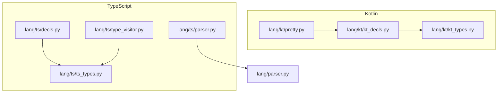
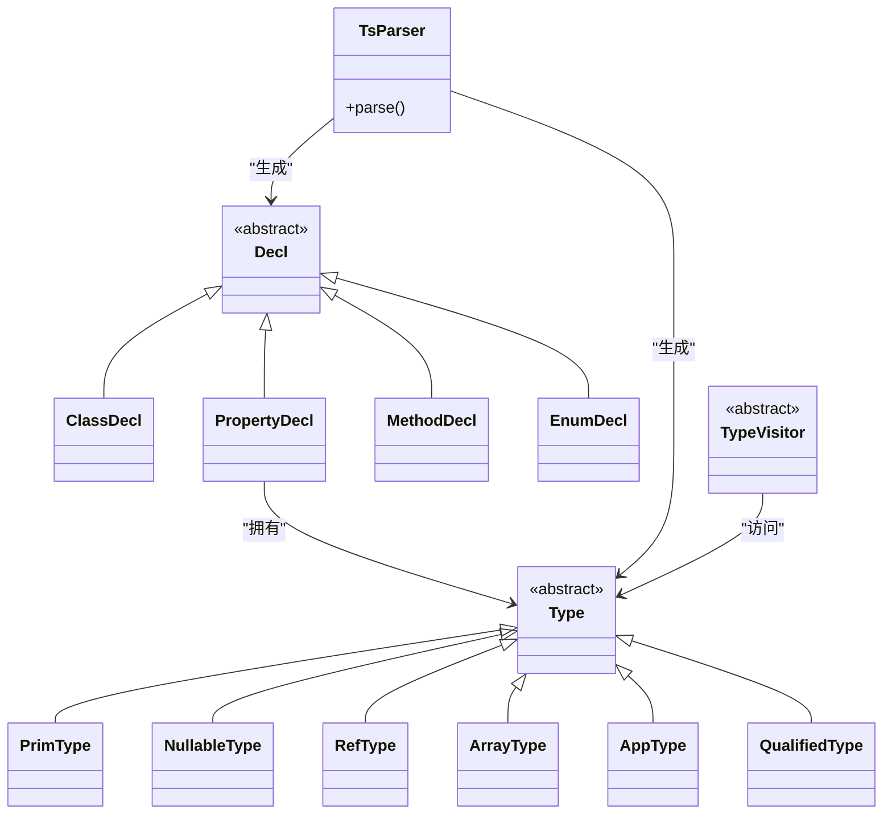
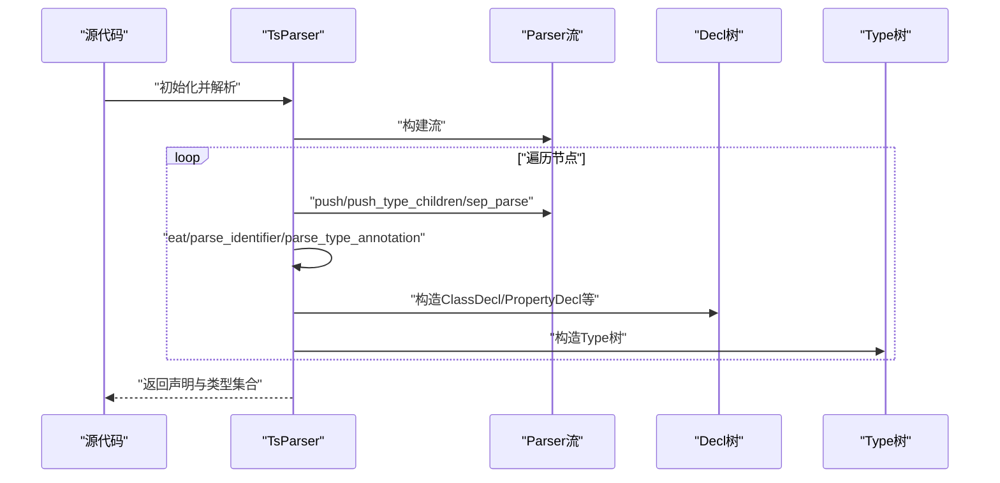
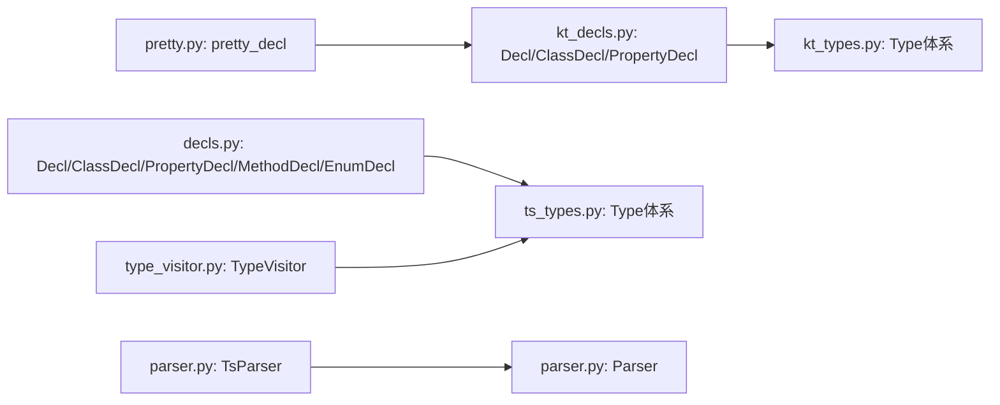

# 声明类型API

<cite>
**本文引用的文件**
- [lang/kt/kt_decls.py](file://lang/kt/kt_decls.py)
- [lang/kt/kt_types.py](file://lang/kt/kt_types.py)
- [lang/kt/pretty.py](file://lang/kt/pretty.py)
- [lang/ts/decls.py](file://lang/ts/decls.py)
- [lang/ts/ts_types.py](file://lang/ts/ts_types.py)
- [lang/ts/type_visitor.py](file://lang/ts/type_visitor.py)
- [lang/ts/parser.py](file://lang/ts/parser.py)
- [lang/parser.py](file://lang/parser.py)
- [test/cases/kt/class0.kt](file://test/cases/kt/class0.kt)
- [test/cases/class1.ts](file://test/cases/class1.ts)
- [test/cases/class2.ts](file://test/cases/class2.ts)
</cite>

## 目录
1. [简介](#简介)
2. [项目结构](#项目结构)
3. [核心组件](#核心组件)
4. [架构总览](#架构总览)
5. [组件详解](#组件详解)
6. [依赖关系分析](#依赖关系分析)
7. [性能考量](#性能考量)
8. [故障排查指南](#故障排查指南)
9. [结论](#结论)
10. [附录](#附录)

## 简介
本文件系统性梳理声明类型API，围绕抽象基类Decl及其在Kotlin与TypeScript两套语言中的实现展开，重点覆盖：
- Decl抽象基类的设计与继承体系
- 具体声明类型：ClassDecl、PropertyDecl、MethodDecl、EnumDecl 的属性与行为
- 声明类型的创建、验证与转换流程
- 访问器与遍历器API参考（以TypeVisitor为例）
- 序列化与反序列化机制（以pretty打印为代表）
- 扩展点与自定义实现指南
- 错误处理与调试信息
- 最佳实践与性能优化建议

## 项目结构
该仓库采用按语言分层的模块组织方式：
- Kotlin侧：声明与类型定义位于lang/kt目录，包含声明类、类型系统、美化打印工具等
- TypeScript侧：声明与类型定义位于lang/ts目录，包含声明类、类型系统、访问器、解析器等
- 通用解析框架：lang/parser.py提供基于流的解析器抽象，供TS解析器复用

图表来源
- [lang/kt/kt_decls.py](file://lang/kt/kt_decls.py#L10-L51)
- [lang/kt/kt_types.py](file://lang/kt/kt_types.py#L52-L98)
- [lang/kt/pretty.py](file://lang/kt/pretty.py#L50-L86)
- [lang/ts/decls.py](file://lang/ts/decls.py#L4-L57)
- [lang/ts/ts_types.py](file://lang/ts/ts_types.py#L8-L178)
- [lang/ts/type_visitor.py](file://lang/ts/type_visitor.py#L5-L32)
- [lang/ts/parser.py](file://lang/ts/parser.py#L10-L217)
- [lang/parser.py](file://lang/parser.py#L8-L57)

章节来源
- [lang/kt/kt_decls.py](file://lang/kt/kt_decls.py#L10-L51)
- [lang/ts/decls.py](file://lang/ts/decls.py#L4-L57)
- [lang/parser.py](file://lang/parser.py#L8-L57)

## 核心组件
- 抽象基类Decl：作为所有声明类型的统一抽象，不直接暴露具体字段，便于在不同语言中扩展
- Kotlin侧
  - KtValue与注解模型：用于装饰器/注解参数的值表示
  - ClassDecl、PropertyDecl：Kotlin声明的核心载体
  - Type体系：PrimType、NullableType、RefType、ArrayType、AppType、QualifiedType等
- TypeScript侧
  - Decl子类：ClassDecl、PropertyDecl、MethodDecl、EnumDecl
  - TsValue与Decorator：装饰器参数值与装饰器对象
  - Type体系：Type抽象及VoidType、ThisType、NullType、UndefinedType、StringType、NumberType、BigIntType、BooleanType、RefType、NullableType、UnionType、AppType、QualifiedType
  - TypeVisitor：类型访问器接口，支持对各类Type进行分派式访问
  - TsParser：基于Tree-sitter的解析器，负责从源码构建Decl与Type树
- 通用Parser：提供流式解析基础设施（push/push_type_children/sep_parse等）

章节来源
- [lang/kt/kt_decls.py](file://lang/kt/kt_decls.py#L10-L51)
- [lang/kt/kt_types.py](file://lang/kt/kt_types.py#L52-L98)
- [lang/ts/decls.py](file://lang/ts/decls.py#L4-L57)
- [lang/ts/ts_types.py](file://lang/ts/ts_types.py#L8-L178)
- [lang/ts/type_visitor.py](file://lang/ts/type_visitor.py#L5-L32)
- [lang/ts/parser.py](file://lang/ts/parser.py#L10-L217)
- [lang/parser.py](file://lang/parser.py#L8-L57)

## 架构总览
下图展示Kotlin与TypeScript两套声明类型系统的高层关系与交互：

图表来源
- [lang/ts/decls.py](file://lang/ts/decls.py#L4-L57)
- [lang/ts/ts_types.py](file://lang/ts/ts_types.py#L8-L178)
- [lang/ts/type_visitor.py](file://lang/ts/type_visitor.py#L5-L32)
- [lang/ts/parser.py](file://lang/ts/parser.py#L10-L217)

## 组件详解

### Decl抽象基类与继承体系
- 设计意图
  - 将“声明”抽象为统一的节点类型，屏蔽不同语言语法差异
  - 通过子类承载语言特定的成员与元数据（如修饰符、注解、装饰器、类型等）
- Kotlin侧
  - Decl为抽象基类；ClassDecl、PropertyDecl等为其具体子类
  - 注解模型Annotations与KtValue（IntegerValue、StringValue）用于表达装饰器参数
- TypeScript侧
  - Decl为抽象基类；ClassDecl、PropertyDecl、MethodDecl、EnumDecl为其具体子类
  - Decorator与TsValue用于表达装饰器与参数值

章节来源
- [lang/kt/kt_decls.py](file://lang/kt/kt_decls.py#L10-L51)
- [lang/ts/decls.py](file://lang/ts/decls.py#L4-L57)

### Kotlin声明类型：ClassDecl 与 PropertyDecl
- ClassDecl
  - 关键属性：name、members（可选）、annotations（可选）
  - 语义：表示一个类声明，可包含成员声明列表与注解
- PropertyDecl
  - 关键属性：modifier（枚举：var/val）、name、type（Type）、annotations（可选）
  - 语义：表示一个属性声明，包含可见性/可变性修饰符、名称、类型与注解
- 类型系统关联
  - PropertyDecl的type字段引用Type体系，支持基础类型、可空、数组、泛型等

章节来源
- [lang/kt/kt_decls.py](file://lang/kt/kt_decls.py#L35-L51)
- [lang/kt/kt_types.py](file://lang/kt/kt_types.py#L52-L98)

### TypeScript声明类型：ClassDecl、PropertyDecl、MethodDecl、EnumDecl
- ClassDecl
  - 关键属性：name、members（可选）、decorators（可选）
  - 语义：类声明，支持装饰器与成员列表
- PropertyDecl
  - 关键属性：name、type（Type）、decorators（可选）
  - 语义：属性声明，绑定类型与装饰器
- MethodDecl
  - 关键属性：name、return_type（可选）、params（可选，元素为(名称, 类型)元组）、decorators（可选）
  - 语义：方法声明，支持返回类型、参数列表与装饰器
- EnumDecl
  - 关键属性：name、members（可选，元素为(枚举成员名, 值)元组）
  - 语义：枚举声明，支持成员与初始值

章节来源
- [lang/ts/decls.py](file://lang/ts/decls.py#L32-L57)

### 类型系统与访问器
- Kotlin类型体系
  - Type为抽象基类；PrimType、NullableType、RefType、ArrayType、AppType、QualifiedType等
  - 提供若干工具函数：is_map_type、is_list_type、is_array_type、is_primitive_type、is_ref_type、get_ref_type_name等
- TypeScript类型体系
  - Type为抽象基类；VoidType、ThisType、NullType、UndefinedType、StringType、NumberType、BigIntType、BooleanType、RefType、NullableType、UnionType、AppType、QualifiedType
  - 提供工具函数：unwrap_nullable、is_primitive_type、is_type_app、is_qualified_type_app、is_builtin_array_type、is_builtin_list_type、is_builtin_map_type、is_sendable_array_type、is_sendable_map_type、is_ref_type等
- TypeVisitor
  - 为Type体系提供访问器接口，便于对不同类型执行分派式操作

章节来源
- [lang/kt/kt_types.py](file://lang/kt/kt_types.py#L52-L191)
- [lang/ts/ts_types.py](file://lang/ts/ts_types.py#L8-L277)
- [lang/ts/type_visitor.py](file://lang/ts/type_visitor.py#L5-L32)

### 解析与验证流程
- Kotlin解析（示例）
  - 通过树形结构节点解析，定位修饰符、注解、标识符与类型节点
  - 验证必要字段是否存在（如类名、属性类型），缺失时报错
- TypeScript解析
  - 基于Tree-sitter语言包，逐节点推进
  - 使用通用Parser提供的push/push_type_children/eat/sep_parse等能力进行流式解析
  - 对装饰器、类型注解、标识符等进行识别与构造

图表来源
- [lang/ts/parser.py](file://lang/ts/parser.py#L10-L217)
- [lang/parser.py](file://lang/parser.py#L8-L57)

章节来源
- [lang/ts/parser.py](file://lang/ts/parser.py#L10-L217)
- [lang/parser.py](file://lang/parser.py#L8-L57)

### 转换与序列化（美化打印）
- Kotlin侧
  - pretty_decl/pretty_program：将Decl树转为人类可读字符串，用于调试与测试
  - 支持注解块格式化、缩进控制、属性类型输出等
- TypeScript侧
  - 未提供专用序列化器；可通过TypeVisitor或自定义遍历器实现序列化逻辑

章节来源
- [lang/kt/pretty.py](file://lang/kt/pretty.py#L50-L86)

### 访问器与遍历器API参考
- Kotlin侧
  - 未提供专门的声明访问器；可通过递归遍历Decl树实现访问
- TypeScript侧
  - TypeVisitor：对各类Type进行访问的抽象接口，便于扩展新类型时添加对应访问方法
  - 可借鉴此模式为Decl体系设计访问器，实现对ClassDecl/PropertyDecl/MethodDecl/EnumDecl的分派式访问

章节来源
- [lang/ts/type_visitor.py](file://lang/ts/type_visitor.py#L5-L32)

### 创建、验证与转换过程
- 创建
  - Kotlin：由解析器从AST节点构造PropertyDecl/ClassDecl，并填充annotations与type
  - TypeScript：由TsParser从语法树构造Decl与Type，填充decorators与类型信息
- 验证
  - Kotlin：校验类名、属性类型等关键字段是否存在
  - TypeScript：校验标识符、类型注解、装饰器格式等
- 转换
  - Kotlin：Type字符串化（如__str__）用于显示
  - TypeScript：Type.signature属性用于字符串化

章节来源
- [lang/kt/kt_decls.py](file://lang/kt/kt_decls.py#L35-L51)
- [lang/kt/kt_types.py](file://lang/kt/kt_types.py#L59-L97)
- [lang/ts/decls.py](file://lang/ts/decls.py#L32-L57)
- [lang/ts/ts_types.py](file://lang/ts/ts_types.py#L13-L22)
- [lang/ts/parser.py](file://lang/ts/parser.py#L109-L117)

### 扩展点与自定义实现指南
- 新增声明类型
  - 在各自语言的decls.py中新增子类，遵循现有字段命名与可选性约定
  - 若涉及类型信息，同步在ts_types.py或kt_types.py中扩展Type体系
- 自定义访问器
  - TypeScript侧可仿照TypeVisitor模式，为新的Decl类型添加访问方法
- 自定义解析器
  - 复用lang/parser.py的流式解析能力，结合语言特有语法节点进行扩展

章节来源
- [lang/ts/decls.py](file://lang/ts/decls.py#L4-L57)
- [lang/ts/ts_types.py](file://lang/ts/ts_types.py#L8-L178)
- [lang/ts/type_visitor.py](file://lang/ts/type_visitor.py#L5-L32)
- [lang/parser.py](file://lang/parser.py#L8-L57)

### 错误处理与调试信息
- Kotlin解析
  - 当缺少类名或属性类型时抛出解析异常
- TypeScript解析
  - 当遇到未知节点类型或不符合预期的token时抛出语法错误
- 调试
  - Kotlin侧使用pretty打印Decl树
  - 示例输入文件位于test/cases/kt与test/cases目录，可用于快速验证

章节来源
- [lang/kt/kt_decls.py](file://lang/kt/kt_decls.py#L130-L149)
- [lang/ts/parser.py](file://lang/ts/parser.py#L36-L74)
- [lang/kt/pretty.py](file://lang/kt/pretty.py#L50-L86)
- [test/cases/kt/class0.kt](file://test/cases/kt/class0.kt#L1-L9)
- [test/cases/class1.ts](file://test/cases/class1.ts#L1-L5)
- [test/cases/class2.ts](file://test/cases/class2.ts#L1-L4)

## 依赖关系分析
- Kotlin
  - Decl依赖Type（属性类型）
  - Pretty工具依赖Decl与Type进行打印
- TypeScript
  - Decl依赖Type与Decorator/TsValue
  - TsParser依赖Parser流式解析能力
  - TypeVisitor依赖Type体系

图表来源
- [lang/kt/kt_decls.py](file://lang/kt/kt_decls.py#L10-L51)
- [lang/kt/kt_types.py](file://lang/kt/kt_types.py#L52-L98)
- [lang/kt/pretty.py](file://lang/kt/pretty.py#L50-L86)
- [lang/ts/decls.py](file://lang/ts/decls.py#L4-L57)
- [lang/ts/ts_types.py](file://lang/ts/ts_types.py#L8-L178)
- [lang/ts/parser.py](file://lang/ts/parser.py#L10-L217)
- [lang/ts/type_visitor.py](file://lang/ts/type_visitor.py#L5-L32)
- [lang/parser.py](file://lang/parser.py#L8-L57)

章节来源
- [lang/kt/kt_decls.py](file://lang/kt/kt_decls.py#L10-L51)
- [lang/kt/kt_types.py](file://lang/kt/kt_types.py#L52-L98)
- [lang/kt/pretty.py](file://lang/kt/pretty.py#L50-L86)
- [lang/ts/decls.py](file://lang/ts/decls.py#L4-L57)
- [lang/ts/ts_types.py](file://lang/ts/ts_types.py#L8-L178)
- [lang/ts/parser.py](file://lang/ts/parser.py#L10-L217)
- [lang/ts/type_visitor.py](file://lang/ts/type_visitor.py#L5-L32)
- [lang/parser.py](file://lang/parser.py#L8-L57)

## 性能考量
- 解析阶段
  - 使用流式解析与节点分派，避免重复扫描
  - 合理利用sep_parse与push_type_children减少回溯成本
- 类型判断
  - Kotlin侧is_map_type/is_list_type/is_array_type等采用递归判断，注意避免深层嵌套导致的栈深度问题
  - TypeScript侧is_primitive_type等函数对联合类型有严格约束，确保在复杂类型上保持可预测性
- 打印与序列化
  - pretty打印仅用于调试与测试，生产环境应避免频繁调用
  - 如需序列化，建议在TypeVisitor基础上扩展定制化输出

[本节为通用指导，无需列出章节来源]

## 故障排查指南
- Kotlin
  - 缺少类名或属性类型：检查解析器是否正确提取节点并传入构造函数
  - 注解/装饰器参数类型不符：确认KtValue/StringValue/IntegerValue的映射关系
- TypeScript
  - 未知节点类型：检查TsParser的节点类型分支是否覆盖完整
  - 装饰器语法错误：确认parse_decorator与parse_decorators的调用顺序
- 通用
  - 使用示例文件进行最小复现，逐步缩小问题范围
  - 利用pretty打印或TypeVisitor输出中间状态

章节来源
- [lang/kt/kt_decls.py](file://lang/kt/kt_decls.py#L130-L149)
- [lang/ts/parser.py](file://lang/ts/parser.py#L164-L184)
- [lang/kt/pretty.py](file://lang/kt/pretty.py#L50-L86)
- [test/cases/kt/class0.kt](file://test/cases/kt/class0.kt#L1-L9)
- [test/cases/class1.ts](file://test/cases/class1.ts#L1-L5)

## 结论
本声明类型API在Kotlin与TypeScript两侧分别提供了清晰的抽象与实现：
- Decl作为统一抽象，承载语言特定的成员与元数据
- Type体系与访问器模式保证了类型系统的可扩展性
- 解析器与流式基础设施为声明树的创建与验证提供了可靠支撑
- 通过示例与工具链，开发者可以快速扩展、调试与集成声明类型系统

[本节为总结性内容，无需列出章节来源]

## 附录
- 示例输入
  - Kotlin类示例：test/cases/kt/class0.kt
  - TypeScript类示例：test/cases/class1.ts、test/cases/class2.ts
- 相关API路径
  - Kotlin声明与类型：lang/kt/kt_decls.py、lang/kt/kt_types.py
  - TypeScript声明与类型：lang/ts/decls.py、lang/ts/ts_types.py
  - TypeScript访问器与解析器：lang/ts/type_visitor.py、lang/ts/parser.py
  - 通用解析器：lang/parser.py
  - Kotlin美化打印：lang/kt/pretty.py

[本节为概览性内容，无需列出章节来源]