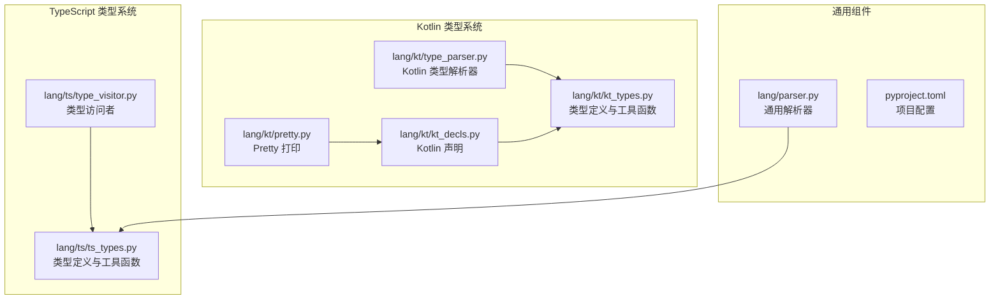
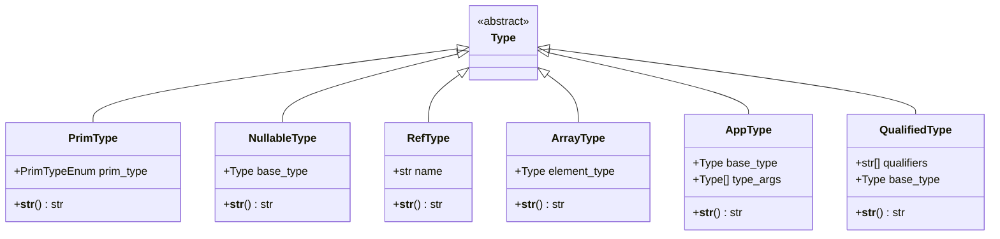
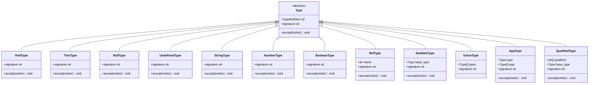
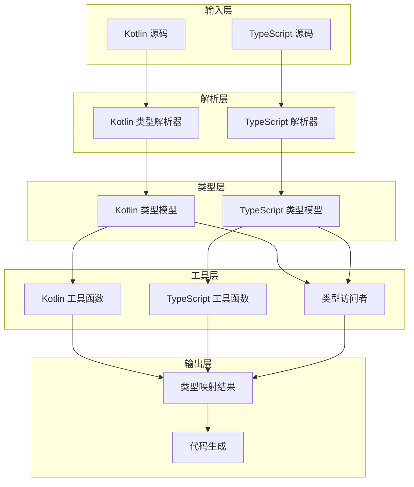
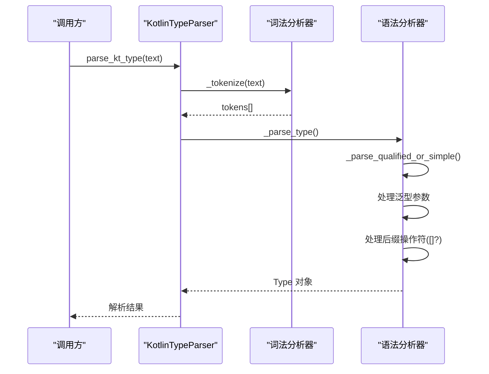
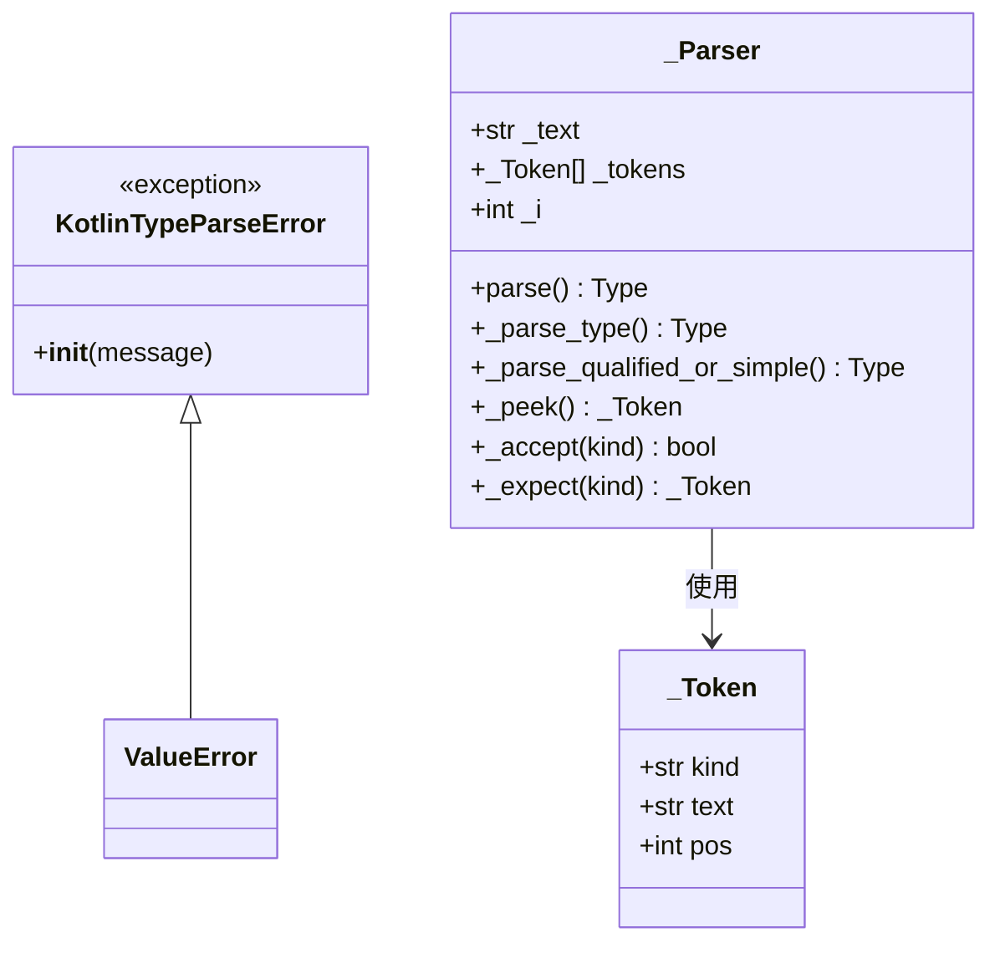
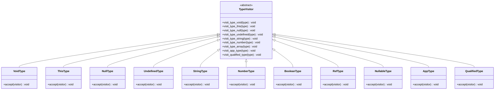
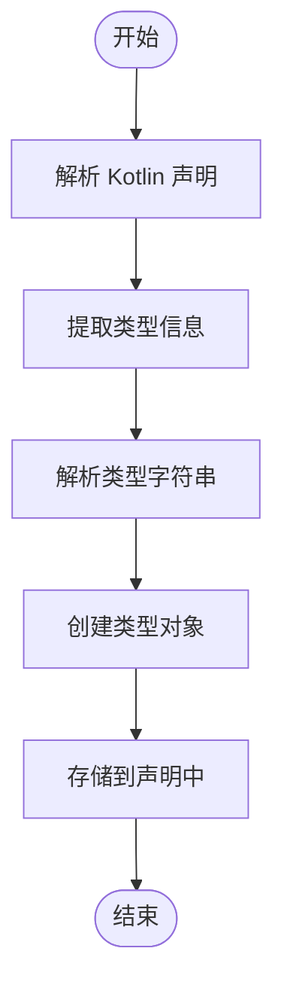
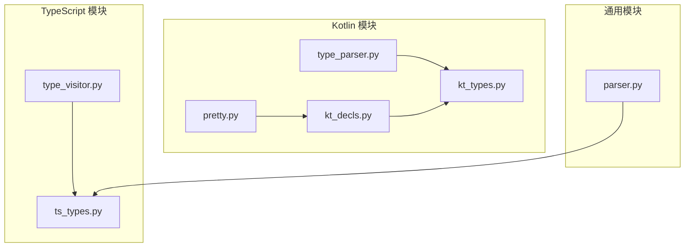
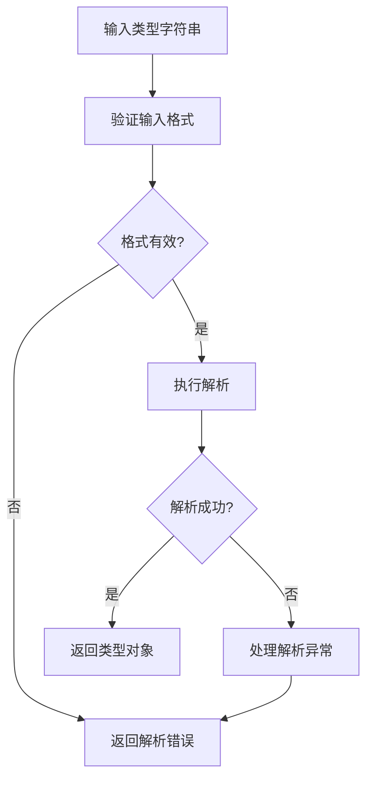

# 类型系统API

<cite>
**本文档引用的文件**
- [lang/kt/kt_types.py](file://lang/kt/kt_types.py)
- [lang/ts/ts_types.py](file://lang/ts/ts_types.py)
- [lang/kt/type_parser.py](file://lang/kt/type_parser.py)
- [lang/parser.py](file://lang/parser.py)
- [lang/kt/kt_decls.py](file://lang/kt/kt_decls.py)
- [lang/kt/pretty.py](file://lang/kt/pretty.py)
- [lang/ts/type_visitor.py](file://lang/ts/type_visitor.py)
- [pyproject.toml](file://pyproject.toml)
</cite>

## 目录
1. [简介](#简介)
2. [项目结构](#项目结构)
3. [核心组件](#核心组件)
4. [架构概览](#架构概览)
5. [详细组件分析](#详细组件分析)
6. [依赖关系分析](#依赖关系分析)
7. [性能考虑](#性能考虑)
8. [故障排除指南](#故障排除指南)
9. [结论](#结论)

## 简介

本文件详细描述了 ArkTS 类型系统与 Kotlin 类型系统的 API 设计与实现。该系统提供了类型定义、解析、验证和映射功能，支持从 Kotlin 源码中提取类型信息，并将其转换为内部统一的类型表示，以便后续的代码生成和类型检查。

## 项目结构

该项目采用分层设计，主要包含以下模块：
- Kotlin 类型系统：定义 Kotlin 的类型模型、解析器和工具函数
- TypeScript 类型系统：定义 TypeScript 的类型模型、访问者模式和工具函数
- 通用解析器：提供流式解析的基础抽象类
- Kotlin 声明：包含 Kotlin 类型在声明中的使用示例
- Pretty 打印：用于调试和测试的类型打印功能

**图表来源**
- [lang/kt/kt_types.py](file://lang/kt/kt_types.py#L1-L191)
- [lang/kt/type_parser.py](file://lang/kt/type_parser.py#L1-L152)
- [lang/ts/ts_types.py](file://lang/ts/ts_types.py#L1-L280)

**章节来源**
- [pyproject.toml](file://pyproject.toml#L1-L26)

## 核心组件

### Kotlin 类型系统

Kotlin 类型系统定义了完整的类型层次结构，包括原始类型、可空类型、引用类型、数组类型、应用类型和限定类型。

#### 主要类型类

**图表来源**
- [lang/kt/kt_types.py](file://lang/kt/kt_types.py#L52-L98)

#### 原始类型枚举

Kotlin 类型系统支持以下原始类型：
- Unit（Unit）
- Boolean（Boolean）
- Byte/UByte（Byte, UByte）
- Short/UShort（Short, UShort）
- Int/UInt（Int, UInt）
- Long/ULong（Long, ULong）
- Char（Char）
- Float（Float）
- Double（Double）
- String（String）
- IntArray（IntArray）
- LongArray（LongArray）

**章节来源**
- [lang/kt/kt_types.py](file://lang/kt/kt_types.py#L34-L51)

### TypeScript 类型系统

TypeScript 类型系统提供了更丰富的类型建模能力，包括基础类型、联合类型、可空类型等。

#### 主要类型类

**图表来源**
- [lang/ts/ts_types.py](file://lang/ts/ts_types.py#L8-L179)

**章节来源**
- [lang/ts/ts_types.py](file://lang/ts/ts_types.py#L1-L280)

## 架构概览

类型系统采用分层架构设计，通过统一的类型接口实现跨语言的类型表示。

**图表来源**
- [lang/kt/type_parser.py](file://lang/kt/type_parser.py#L68-L151)
- [lang/ts/ts_types.py](file://lang/ts/ts_types.py#L1-L280)

## 详细组件分析

### Kotlin 类型解析器

Kotlin 类型解析器实现了完整的类型字符串解析功能，支持复杂类型的嵌套解析。

#### 解析流程

**图表来源**
- [lang/kt/type_parser.py](file://lang/kt/type_parser.py#L92-L124)

#### 错误处理机制

解析器定义了专门的错误类型来处理解析异常：

**图表来源**
- [lang/kt/type_parser.py](file://lang/kt/type_parser.py#L18-L151)

**章节来源**
- [lang/kt/type_parser.py](file://lang/kt/type_parser.py#L1-L152)

### 类型工具函数

#### Kotlin 类型检测函数

Kotlin 类型系统提供了多种类型检测工具函数：

| 函数名 | 功能描述 | 参数类型 | 返回类型 |
|--------|----------|----------|----------|
| is_map_type | 检测是否为 Map 类型 | Type | bool |
| is_list_type | 检测是否为 List 类型 | Type | bool |
| is_array_type | 检测是否为 Array 类型 | Type | bool |
| is_primitive_type | 检测是否为原始类型 | Type | bool |
| is_ref_type | 检测是否为引用类型 | Type | bool |
| get_ref_type_name | 获取引用类型名称 | Type | str |

#### TypeScript 类型检测函数

TypeScript 类型系统提供了相应的类型检测工具函数：

| 函数名 | 功能描述 | 参数类型 | 返回类型 |
|--------|----------|----------|----------|
| unwrap_nullable | 展开可空类型 | Type | Type |
| is_primitive_type | 检测是否为原始类型 | Type | bool |
| is_type_app | 检测类型应用 | str, Type | bool |
| is_qualified_type_app | 检测限定类型应用 | list[str], Type | bool |
| is_builtin_array_type | 检测内置数组类型 | Type | bool |
| is_builtin_list_type | 检测内置列表类型 | Type | bool |
| is_builtin_map_type | 检测内置映射类型 | Type | bool |
| is_sendable_array_type | 检测可发送数组类型 | Type | bool |
| is_sendable_map_type | 检测可发送映射类型 | Type | bool |
| is_ref_type | 检测是否为引用类型 | Type | bool |

**章节来源**
- [lang/kt/kt_types.py](file://lang/kt/kt_types.py#L126-L191)
- [lang/ts/ts_types.py](file://lang/ts/ts_types.py#L180-L277)

### 类型访问者模式

TypeScript 类型系统实现了访问者模式，用于遍历和处理不同类型：

**图表来源**
- [lang/ts/type_visitor.py](file://lang/ts/type_visitor.py#L5-L32)

**章节来源**
- [lang/ts/type_visitor.py](file://lang/ts/type_visitor.py#L1-L32)

### 类型声明与使用

Kotlin 类型在声明中的使用展示了类型系统的实际应用场景：

**图表来源**
- [lang/kt/kt_decls.py](file://lang/kt/kt_decls.py#L35-L51)

**章节来源**
- [lang/kt/kt_decls.py](file://lang/kt/kt_decls.py#L1-L51)

## 依赖关系分析

### 组件依赖图

**图表来源**
- [lang/kt/kt_types.py](file://lang/kt/kt_types.py#L1-L32)
- [lang/ts/ts_types.py](file://lang/ts/ts_types.py#L1-L7)

### 外部依赖

项目使用以下外部依赖：
- tree-sitter-arkts-open: ArkTS 语法解析
- tree-sitter: 通用语法解析框架
- tree-sitter-kotlin: Kotlin 语法解析

**章节来源**
- [pyproject.toml](file://pyproject.toml#L15-L21)

## 性能考虑

### 类型解析性能

1. **词法分析优化**：使用单字符映射表加速字符识别
2. **递归下降解析**：避免回溯，提高解析效率
3. **类型缓存**：对于重复使用的类型可以考虑缓存解析结果

### 内存使用优化

1. **不可变数据结构**：使用 frozen dataclass 减少内存占用
2. **类型枚举**：使用 Enum 减少字符串比较开销
3. **延迟计算**：签名字符串按需计算

### 并发处理

当前实现为单线程解析，如需并发处理多个类型字符串，可考虑：
- 使用线程池管理解析任务
- 实现类型解析结果的缓存机制
- 避免共享可变状态

## 故障排除指南

### 常见错误类型

1. **KotlinTypeParseError**：Kotlin 类型解析错误
   - 字符串包含意外字符
   - 语法不匹配（如括号不匹配）
   - 未知的类型标识符

2. **SyntaxError**：通用语法错误
   - 令牌类型不匹配
   - 缺少必需的语法元素

### 调试技巧

1. **启用详细日志**：在解析过程中输出详细的令牌信息
2. **类型打印**：使用 pretty 打印功能查看类型结构
3. **单元测试**：为每个类型解析场景编写测试用例

### 错误处理最佳实践

**章节来源**
- [lang/kt/type_parser.py](file://lang/kt/type_parser.py#L18-L61)
- [lang/parser.py](file://lang/parser.py#L30-L47)

## 结论

该类型系统API提供了完整的 Kotlin 和 TypeScript 类型建模能力，具有以下特点：

1. **清晰的类型层次**：通过抽象基类和具体实现分离关注点
2. **强大的解析能力**：支持复杂的类型表达式解析
3. **完善的工具函数**：提供丰富的类型检测和操作函数
4. **可扩展的设计**：基于访问者模式和工厂模式，易于扩展新类型
5. **健壮的错误处理**：提供详细的错误信息和恢复机制

该系统为 ArkTS 与 Kotlin 之间的类型映射提供了坚实的基础，支持后续的代码生成和类型检查功能。