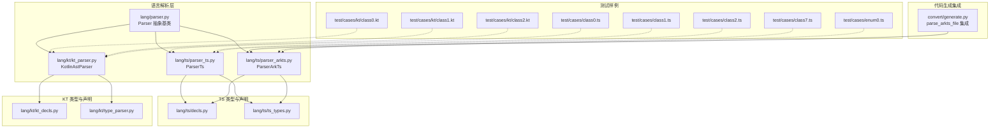
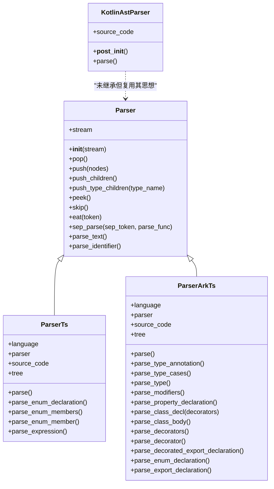
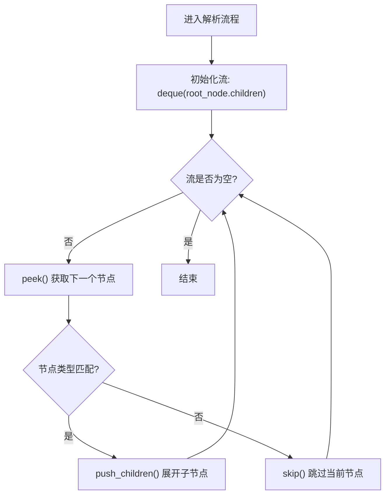
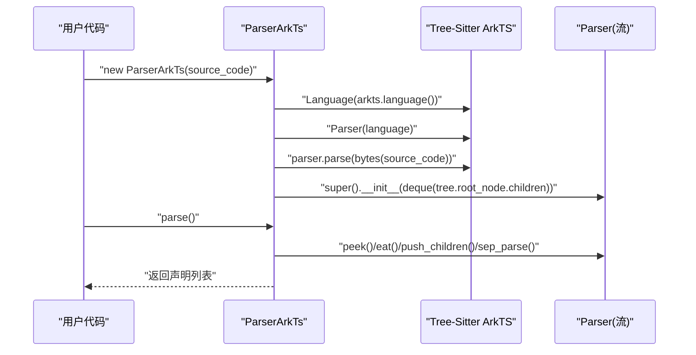

# 解析器API

<cite>
**本文引用的文件**
- [lang/parser.py](file://lang/parser.py)
- [lang/ts/parser_arkts.py](file://lang/ts/parser_arkts.py)
- [lang/ts/parser_ts.py](file://lang/ts/parser_ts.py)
- [lang/ts/decls.py](file://lang/ts/decls.py)
- [lang/ts/ts_types.py](file://lang/ts/ts_types.py)
- [lang/kt/kt_parser.py](file://lang/kt/kt_parser.py)
- [lang/kt/kt_decls.py](file://lang/kt/kt_decls.py)
- [lang/kt/type_parser.py](file://lang/kt/type_parser.py)
- [convert/generate.py](file://convert/generate.py)
- [test/cases/class0.ts](file://test/cases/class0.ts)
- [test/cases/class1.ts](file://test/cases/class1.ts)
- [test/cases/class2.ts](file://test/cases/class2.ts)
- [test/cases/class7.ts](file://test/cases/class7.ts)
- [test/cases/enum0.ts](file://test/cases/enum0.ts)
- [test/cases/kt/class0.kt](file://test/cases/kt/class0.kt)
- [test/cases/kt/class1.kt](file://test/cases/kt/class1.kt)
- [test/cases/kt/class2.kt](file://test/cases/kt/class2.kt)
</cite>

## 更新摘要
**所做更改**
- 更新了 ParserArkTs 类结构和方法签名的详细说明
- 新增了 ParserTs 类的完整API参考
- 完善了类型系统和声明结构的文档
- 更新了错误处理和异常类型的说明
- 增强了使用示例和最佳实践指导

## 目录
1. [简介](#简介)
2. [项目结构](#项目结构)
3. [核心组件](#核心组件)
4. [架构总览](#架构总览)
5. [详细组件分析](#详细组件分析)
6. [依赖分析](#依赖分析)
7. [性能考虑](#性能考虑)
8. [故障排查指南](#故障排查指南)
9. [结论](#结论)
10. [附录：API参考与最佳实践](#附录api参考与最佳实践)

## 简介
本文件系统性梳理解析器API的设计与实现，重点覆盖：
- 抽象基类 Parser 的设计模式与继承关系
- TypeScript 解析器 ParserTs 的实现与使用
- ArkTS 解析器 ParserArkTs 的实现与使用
- Kotlin 解析器 KotlinAstParser 的实现与使用
- 解析器的初始化参数、配置选项与生命周期管理
- 解析过程的完整API参考（如 parse、parse_type_annotation、parse_class_decl 等）
- 错误处理机制与异常类型
- 扩展与自定义开发指南
- 性能优化建议与调试技巧

## 项目结构
该仓库采用按语言分层的模块化组织：
- lang/parser.py 定义通用的流式解析器抽象基类
- lang/ts/* 提供 TypeScript 与 ArkTS 解析器与类型系统
- lang/kt/* 提供 Kotlin 解析器与类型系统
- convert/generate.py 集成 ArkTS 解析器用于代码生成
- test/cases 下包含示例源码，用于验证解析行为

**图表来源**
- [lang/parser.py](file://lang/parser.py#L8-L70)
- [lang/ts/parser_ts.py](file://lang/ts/parser_ts.py#L13-L94)
- [lang/ts/parser_arkts.py](file://lang/ts/parser_arkts.py#L10-L313)
- [lang/kt/kt_parser.py](file://lang/kt/kt_parser.py#L23-L284)
- [lang/ts/decls.py](file://lang/ts/decls.py#L55-L110)
- [lang/ts/ts_types.py](file://lang/ts/ts_types.py#L8-L260)
- [lang/kt/kt_decls.py](file://lang/kt/kt_decls.py#L1-L57)
- [lang/kt/type_parser.py](file://lang/kt/type_parser.py#L1-L157)
- [convert/generate.py](file://convert/generate.py#L11-L11)

**章节来源**
- [pyproject.toml](file://pyproject.toml#L1-L27)
- [main.py](file://main.py#L12-L25)

## 核心组件
- 抽象基类 Parser：提供基于双端队列的流式解析能力，支持弹出、推入、窥视、跳过、匹配标记、分隔符解析等通用操作。
- TypeScript 解析器 ParserTs：继承 Parser，封装 Tree-Sitter TypeScript 语言，负责从源码构建语法树并解析枚举等声明。
- ArkTS 解析器 ParserArkTs：继承 Parser，封装 Tree-Sitter ArkTS 语言，负责从源码构建语法树并解析类、属性、装饰器、表达式、类型注解等。
- Kotlin 解析器 KotlinAstParser：以数据类形式封装 Tree-Sitter Kotlin 语言，提供 parse 接口，解析类、属性、注解等。

**章节来源**
- [lang/parser.py](file://lang/parser.py#L8-L70)
- [lang/ts/parser_ts.py](file://lang/ts/parser_ts.py#L13-L94)
- [lang/ts/parser_arkts.py](file://lang/ts/parser_arkts.py#L10-L313)
- [lang/kt/kt_parser.py](file://lang/kt/kt_parser.py#L23-L284)

## 架构总览
解析器体系采用"抽象基类 + 具体语言实现"的分层设计：
- Parser 抽象基类统一了流式解析的基础设施（队列、窥视、匹配、分隔解析等）。
- ParserTs 在 Parser 基础上，结合 Tree-Sitter TypeScript 语言，完成 TypeScript 源码到 AST 的转换与语义抽取。
- ParserArkTs 在 Parser 基础上，结合 Tree-Sitter ArkTS 语言，完成 ArkTS 源码到 AST 的转换与语义抽取，支持装饰器、修饰符、枚举等特性。
- KotlinAstParser 直接使用 Tree-Sitter Kotlin 语言，遍历 AST 并抽取类、属性、注解等信息。

**图表来源**
- [lang/parser.py](file://lang/parser.py#L8-L70)
- [lang/ts/parser_ts.py](file://lang/ts/parser_ts.py#L13-L94)
- [lang/ts/parser_arkts.py](file://lang/ts/parser_arkts.py#L10-L313)
- [lang/kt/kt_parser.py](file://lang/kt/kt_parser.py#L23-L284)

## 详细组件分析

### 抽象基类 Parser 设计与继承关系
- 设计要点
  - 流式解析：内部维护一个双端队列，作为待消费的节点/令牌序列。
  - 通用操作：pop/push/peek/skip/eat/sep_parse 等，便于子类组合使用。
  - 类型安全：push_type_children 支持按类型名断言并展开子节点，否则抛出语法错误。
  - 文本处理：parse_text 和 parse_identifier 提供基础文本提取功能。
- 继承关系
  - ParserTs 明确继承 Parser，复用其流式能力。
  - ParserArkTs 明确继承 Parser，复用其流式能力。
  - KotlinAstParser 未显式继承 Parser，但其解析流程与 Parser 的思想一致（队列驱动）。

**图表来源**
- [lang/ts/parser_arkts.py](file://lang/ts/parser_arkts.py#L267-L313)
- [lang/parser.py](file://lang/parser.py#L15-L70)

**章节来源**
- [lang/parser.py](file://lang/parser.py#L8-L70)

### TypeScript 解析器 ParserTs
- 初始化参数与生命周期
  - 参数：source_code（字符串）
  - 生命周期：构造时加载 TypeScript 语言、解析源码为 Tree，并将根节点子节点放入流；parse() 循环消费流，产出声明列表。
- 核心接口
  - parse()：顶层解析入口，识别源文件中的枚举声明。
  - parse_enum_declaration()/parse_enum_members()/parse_enum_member()：枚举解析链路。
  - parse_expression()：表达式解析，支持字符串、数字等基础类型。
- 使用方法
  - 创建 ParserTs 实例，调用 parse() 即可得到声明列表。
- 错误处理
  - 当令牌不匹配时抛出语法错误；表达式解析遇到未知节点类型时抛出语法错误。

**章节来源**
- [lang/ts/parser_ts.py](file://lang/ts/parser_ts.py#L13-L94)
- [lang/ts/parser_ts.py](file://lang/ts/parser_ts.py#L21-L94)
- [lang/ts/parser_ts.py](file://lang/ts/parser_ts.py#L47-L74)

### ArkTS 解析器 ParserArkTs
- 初始化参数与生命周期
  - 参数：source_code（字符串）
  - 生命周期：构造时加载 ArkTS 语言、解析源码为 Tree，并将根节点子节点放入流；parse() 循环消费流，产出声明列表。
- 核心接口
  - parse()：顶层解析入口，识别源文件中的类声明、枚举声明、装饰器导出声明等。
  - parse_type_annotation()/parse_type_cases()/parse_type()：类型注解解析链路，支持基本类型、联合类型、泛型、限定类型等。
  - parse_modifiers()：修饰符解析，支持 readonly、static 等修饰符。
  - parse_property_declaration()：属性声明解析，支持可选属性、修饰符、装饰器等。
  - parse_class_decl(decorators)/parse_class_body()：类与成员解析。
  - parse_decorators()/parse_decorator()/parse_comma_sep_expressions()/parse_expression()/parse_object_expression()：装饰器与表达式解析。
  - parse_enum_declaration()/parse_enum_body()/parse_enum_member()：枚举解析。
  - parse_export_declaration()/parse_decorated_export_declaration()：导出声明解析。
- 使用方法
  - 创建 ParserArkTs 实例，调用 parse() 即可得到声明列表。
  - 也可使用 parse_arkts_file() 函数直接解析文件并返回 SourceFile。
- 错误处理
  - 当类型或令牌不匹配时抛出语法错误；表达式解析遇到未知节点类型时抛出语法错误。

**图表来源**
- [lang/ts/parser_arkts.py](file://lang/ts/parser_arkts.py#L10-L313)
- [lang/parser.py](file://lang/parser.py#L15-L70)

**章节来源**
- [lang/ts/parser_arkts.py](file://lang/ts/parser_arkts.py#L10-L313)
- [lang/ts/decls.py](file://lang/ts/decls.py#L55-L110)
- [lang/ts/ts_types.py](file://lang/ts/ts_types.py#L8-L260)

### Kotlin 解析器 KotlinAstParser
- 初始化参数与生命周期
  - 参数：source_code（字符串）
  - 生命周期：__post_init__ 中加载 Kotlin 语言、编码源码、解析为 Tree；parse() 遍历 AST，收集类声明与属性声明。
- 核心接口
  - parse()：顶层解析入口，支持普通类与 expect/actual 包装场景。
  - 辅助函数：_text/_find_child/_find_children/_iter_descendants/_parse_string_literal/_parse_annotations/_parse_property_declaration/_parse_class_declaration/_parse_class_like 等。
- 使用方法
  - 调用 parse_kotlin_source(source_code) 或直接实例化 KotlinAstParser 并调用 parse()。
- 错误处理
  - 自定义 KotlinParseError，当节点类型不匹配或缺少必要子节点时抛出。

**章节来源**
- [lang/kt/kt_parser.py](file://lang/kt/kt_parser.py#L23-L284)
- [lang/kt/kt_decls.py](file://lang/kt/kt_decls.py#L1-L57)
- [lang/kt/type_parser.py](file://lang/kt/type_parser.py#L1-L157)

## 依赖分析
- 外部依赖
  - tree-sitter-arkts-open：提供 ArkTS 语言绑定
  - tree-sitter：通用解析器框架
  - tree-sitter-kotlin：Kotlin 语言绑定
  - tree-sitter-typescript：TypeScript 语言绑定
- 内部依赖
  - ParserTs 依赖 lang.ts.decls 与 lang.ts.ts_types
  - ParserArkTs 依赖 lang.ts.decls 与 lang.ts.ts_types
  - KotlinAstParser 依赖 lang.kt.kt_decls 与 lang.kt.type_parser
  - convert.generate 依赖 lang.ts.parser_arkts

**章节来源**
- [pyproject.toml](file://pyproject.toml#L15-L21)
- [convert/generate.py](file://convert/generate.py#L11-L11)

## 性能考虑
- 流式解析的复杂度
  - Parser 的 push/pop/peek 操作均为 O(1)，整体解析复杂度取决于源码规模与节点数量。
- Tree-Sitter 解析
  - ArkTS/TypeScript/Kotlin 语言解析由 Tree-Sitter 驱动，解析效率高；建议在批量解析时避免重复创建语言与解析器实例。
- 内存与对象分配
  - ParserArkTs 的类型解析链路包含多个递归解析函数，注意在复杂类型场景下的内存使用。
  - KotlinAstParser 的辅助函数多使用迭代器与列表推导，注意在大文件场景下控制中间对象大小。
- I/O 与编码
  - ParserArkTs 在 __init__ 中进行一次编码，后续解析直接使用字节串，减少重复编码成本。
  - KotlinAstParser 在 __post_init__ 中进行一次编码，后续解析直接使用字节串，减少重复编码成本。

## 故障排查指南
- 常见异常类型
  - ParserArkTs：当类型或令牌不匹配时抛出语法错误；表达式解析遇到未知节点类型时抛出语法错误。
  - ParserTs：当令牌不匹配时抛出语法错误；表达式解析遇到未知节点类型时抛出语法错误。
  - KotlinAstParser：当节点类型不匹配或缺少必要子节点时抛出 KotlinParseError。
- 调试技巧
  - 使用测试样例快速定位问题：参考 test/cases 下的 TypeScript、ArkTS 与 Kotlin 示例。
  - 在 ParserArkTs 的类型解析链路中，逐步检查 push_type_children 与 eat 的调用顺序与节点类型。
  - 对于 ParserArkTs，优先确认装饰器、修饰符、枚举等节点类型的处理逻辑。
  - 对于 KotlinAstParser，优先确认类声明节点类型与包装节点（如 annotated_expression）的处理逻辑。

**章节来源**
- [lang/ts/parser_arkts.py](file://lang/ts/parser_arkts.py#L34-L80)
- [lang/ts/parser_ts.py](file://lang/ts/parser_ts.py#L38-L51)
- [lang/kt/kt_parser.py](file://lang/kt/kt_parser.py#L24-L25)

## 结论
本解析器API通过抽象基类 Parser 统一了流式解析范式，分别针对 TypeScript（ParserTs）、ArkTS（ParserArkTs）与 Kotlin（KotlinAstParser）提供了清晰的解析流程与类型系统。借助 Tree-Sitter 的高效解析能力，系统能够稳定地从源码中抽取类、属性、装饰器、枚举与类型信息。ParserArkTs 作为新增的 ArkTS 解析器，提供了比 ParserTs 更完整的类型解析能力，包括修饰符、属性声明、装饰器等特性。对于扩展与自定义，建议遵循现有解析器的接口风格与错误处理策略，确保一致性与可维护性。

## 附录：API参考与最佳实践

### 抽象基类 Parser API
- 初始化
  - __init__(stream=None): 初始化空队列或传入已有队列
- 流操作
  - pop(): 弹出左侧元素
  - push(nodes): 将节点序列以保持顺序的方式推入队列前端
  - push_children(): 弹出当前节点并将其 children 推入队列
  - push_type_children(type_name): 断言当前节点类型并展开 children
  - peek(): 返回队列头部元素或 None
  - skip(): 弹出当前节点（跳过），遇到 ERROR 节点时抛出语法错误
  - eat(token): 匹配并弹出指定类型的节点，否则抛出语法错误
  - sep_parse(sep_token, parse_func): 以分隔符循环解析项
- 文本处理
  - parse_text(): 提取当前节点的文本内容
  - parse_identifier(): 提取标识符文本，否则抛出语法错误

**章节来源**
- [lang/parser.py](file://lang/parser.py#L15-L70)

### TypeScript 解析器 ParserTs API
- 初始化
  - __init__(source_code: str): 构造语言、解析源码、初始化流
- 解析入口
  - parse(): 顶层解析，返回声明列表
- 枚举解析
  - parse_enum_declaration(): 解析枚举声明
  - parse_enum_members(): 解析枚举成员列表
  - parse_enum_member(): 解析单个枚举成员
- 表达式解析
  - parse_expression(): 解析表达式（字符串/数字）

**章节来源**
- [lang/ts/parser_ts.py](file://lang/ts/parser_ts.py#L13-L94)
- [lang/ts/parser_ts.py](file://lang/ts/parser_ts.py#L21-L94)
- [lang/ts/parser_ts.py](file://lang/ts/parser_ts.py#L38-L74)

### ArkTS 解析器 ParserArkTs API
- 初始化
  - __init__(source_code: str): 构造语言、解析源码、初始化流
- 解析入口
  - parse(): 顶层解析，返回声明列表
- 类型注解解析
  - parse_type_annotation(): 解析类型注解
  - parse_type_cases(): 解析类型选择分支
  - parse_type(): 解析具体类型（基本类型、联合类型、泛型、限定类型等）
- 修饰符解析
  - parse_modifiers(): 解析修饰符列表（readonly、static）
- 属性声明解析
  - parse_property_declaration(): 解析属性声明，支持可选属性、修饰符、装饰器
- 类与成员解析
  - parse_class_decl(decorators): 解析类声明
  - parse_class_body(): 解析类体成员
- 装饰器与表达式
  - parse_decorators(): 解析装饰器列表
  - parse_decorator(): 解析单个装饰器
  - parse_comma_sep_expressions(): 解析逗号分隔表达式
  - parse_expression(): 解析表达式（字符串/数字/布尔/对象）
  - parse_object_expression(): 解析对象字面量
- 枚举解析
  - parse_enum_declaration(): 解析枚举声明
  - parse_enum_body(): 解析枚举体
  - parse_enum_member(): 解析枚举成员
- 导出声明解析
  - parse_export_declaration(): 解析导出声明
  - parse_decorated_export_declaration(): 解析带装饰器的导出声明
- 文件解析
  - parse_arkts_file(file_path, module_name): 直接解析 ArkTS 文件并返回 SourceFile

**章节来源**
- [lang/ts/parser_arkts.py](file://lang/ts/parser_arkts.py#L10-L313)
- [lang/ts/decls.py](file://lang/ts/decls.py#L55-L110)
- [lang/ts/ts_types.py](file://lang/ts/ts_types.py#L8-L260)

### Kotlin 解析器 KotlinAstParser API
- 初始化
  - __post_init__(): 加载语言、编码源码、解析为 Tree
- 解析入口
  - parse(): 顶层解析，返回声明列表
- 工具与辅助
  - _text/source/node): 文本提取
  - _find_child/_find_children/_iter_descendants: 子节点查找与遍历
  - _parse_string_literal/_parse_annotations/_parse_property_declaration/_parse_class_declaration/_parse_class_like: 各类节点解析
- 快捷函数
  - parse_kotlin_source_file(source_code): 直接解析源码并返回 SourceFile
  - parse_kotlin_source(source_code): 直接解析源码并返回声明列表
  - parse_kotlin_file(path, encoding): 解析 Kotlin 文件并返回 SourceFile

**章节来源**
- [lang/kt/kt_parser.py](file://lang/kt/kt_parser.py#L23-L284)
- [lang/kt/kt_decls.py](file://lang/kt/kt_decls.py#L1-L57)
- [lang/kt/type_parser.py](file://lang/kt/type_parser.py#L1-L157)

### 使用示例与最佳实践
- TypeScript
  - 参考测试样例：test/cases/class0.ts、class1.ts、class2.ts
  - 建议先解析枚举声明，再处理其他声明类型
- ArkTS
  - 参考测试样例：test/cases/class7.ts、test/cases/enum0.ts
  - 建议先解析装饰器与修饰符，再处理属性与类声明
  - 使用 parse_arkts_file() 函数进行文件级解析
- Kotlin
  - 参考测试样例：test/cases/kt/class0.kt、class1.kt、class2.kt
  - 注意 expect/actual 包装场景，使用 _parse_class_like 进行适配
- 错误处理
  - 在调用 eat 与 push_type_children 前，先检查 peek 类型
  - 对于未知节点类型，抛出明确的语法错误或自定义异常
  - 在批量解析时，建议捕获并记录异常，避免中断整个解析流程

**章节来源**
- [test/cases/class0.ts](file://test/cases/class0.ts#L1-L4)
- [test/cases/class1.ts](file://test/cases/class1.ts#L1-L5)
- [test/cases/class2.ts](file://test/cases/class2.ts#L1-L4)
- [test/cases/class7.ts](file://test/cases/class7.ts#L1-L21)
- [test/cases/enum0.ts](file://test/cases/enum0.ts#L1-L4)
- [test/cases/kt/class0.kt](file://test/cases/kt/class0.kt#L1-L9)
- [test/cases/kt/class1.kt](file://test/cases/kt/class1.kt#L1-L18)
- [test/cases/kt/class2.kt](file://test/cases/kt/class2.kt#L1-L22)