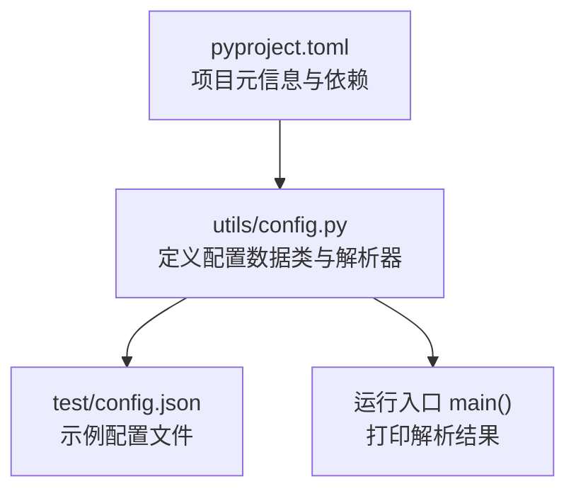
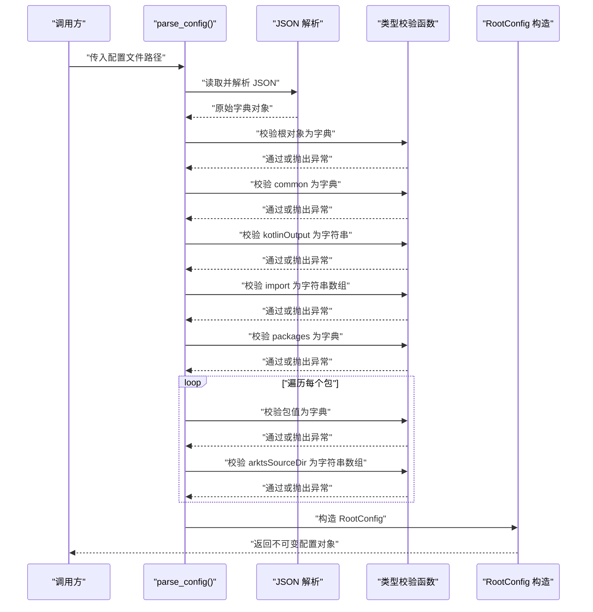
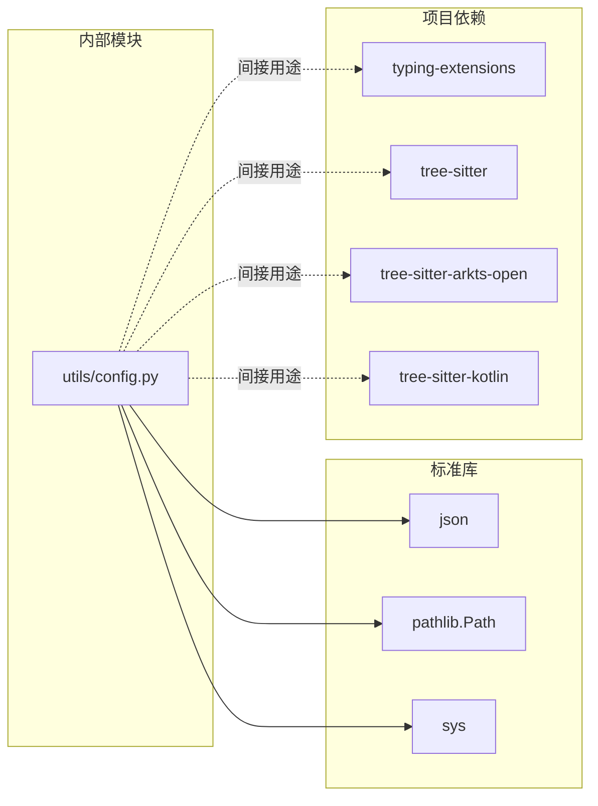

# 配置API

<cite>
**本文引用的文件**
- [utils/config.py](file://utils/config.py)
- [test/config.json](file://test/config.json)
- [pyproject.toml](file://pyproject.toml)
</cite>

## 目录
1. [简介](#简介)
2. [项目结构](#项目结构)
3. [核心组件](#核心组件)
4. [架构总览](#架构总览)
5. [详细组件分析](#详细组件分析)
6. [依赖关系分析](#依赖关系分析)
7. [性能与可靠性考虑](#性能与可靠性考虑)
8. [故障排查指南](#故障排查指南)
9. [结论](#结论)
10. [附录：配置规范与示例](#附录配置规范与示例)

## 简介
本文件系统化梳理了配置API的设计与实现，重点覆盖以下内容：
- RootConfig、CommonConfig、PackageConfig 三个核心配置类的属性与行为
- parse_config() 函数的参数、返回值、调用流程与使用示例
- 配置文件解析过程中的错误处理机制与异常类型
- 配置验证规则与约束条件
- 配置文件格式的 JSON Schema 定义与字段说明
- 常见配置场景的最佳实践
- 版本兼容性与迁移建议（基于当前仓库现状）

## 项目结构
配置API位于 utils/config.py，配套的测试配置文件为 test/config.json；项目元信息在 pyproject.toml 中声明。

图表来源
- [utils/config.py](file://utils/config.py#L1-L84)
- [test/config.json](file://test/config.json#L1-L27)
- [pyproject.toml](file://pyproject.toml#L1-L26)

章节来源
- [utils/config.py](file://utils/config.py#L1-L84)
- [test/config.json](file://test/config.json#L1-L27)
- [pyproject.toml](file://pyproject.toml#L1-L26)

## 核心组件
- RootConfig：顶层配置对象，包含通用配置 common 与包列表 packages
- CommonConfig：通用配置，包含 Kotlin 输出路径与导入列表
- PackageConfig：包级配置，包含包名与 ArkTS 源目录列表
- parse_config(config_path)：从 JSON 文件解析为 RootConfig 的主入口
- 辅助校验函数：_expect_dict、_expect_list、_expect_str，用于严格类型校验

章节来源
- [utils/config.py](file://utils/config.py#L9-L25)
- [utils/config.py](file://utils/config.py#L45-L61)

## 架构总览
配置解析采用“自顶向下”的严格校验策略：先读取 JSON 文本，再逐层断言类型，最后构造不可变的数据类对象。

图表来源
- [utils/config.py](file://utils/config.py#L45-L61)

## 详细组件分析

### 数据类定义与属性说明
- RootConfig
  - 字段
    - common: CommonConfig
    - packages: list[PackageConfig]
- CommonConfig
  - 字段
    - kotlin_output: str
    - imports: list[str]
- PackageConfig
  - 字段
    - name: str
    - arkts_source_dir: list[str]

这些数据类均使用 frozen 与 slots，确保不可变性与内存效率。

章节来源
- [utils/config.py](file://utils/config.py#L9-L25)

### 解析函数 parse_config
- 参数
  - config_path: str | Path，配置文件路径
- 返回值
  - RootConfig 实例
- 处理流程
  - 读取并解析 JSON
  - 严格校验根对象为字典
  - 校验 common 子对象为字典，并提取 kotlin_output 与 import 列表
  - 校验 packages 子对象为字典，并遍历其键值对，校验每个包的 arktsSourceDir 为字符串数组
  - 构造 RootConfig 并返回

章节来源
- [utils/config.py](file://utils/config.py#L45-L61)

### 错误处理与异常类型
- 统一异常类型
  - ValueError：当任一字段类型不符合预期时抛出，错误消息包含位置信息（如 "$.common.kotlinOutput"）
- 校验点
  - 根对象必须为字典
  - common 必须为字典
  - kotlinOutput 必须为字符串
  - import 必须为字符串数组
  - packages 必须为字典
  - 每个包值必须为字典
  - 每个包的 arktsSourceDir 必须为字符串数组

章节来源
- [utils/config.py](file://utils/config.py#L27-L42)
- [utils/config.py](file://utils/config.py#L45-L61)

### 使用示例
- 命令行运行
  - python utils/config.py [可选: 配置文件路径]
  - 默认读取 test/config.json
- 示例输出
  - 打印 kotlinOutput
  - 打印 imports 列表
  - 打印 packages 列表及其 arktsSourceDir

章节来源
- [utils/config.py](file://utils/config.py#L64-L79)
- [test/config.json](file://test/config.json#L1-L27)

## 依赖关系分析
- 内部依赖
  - utils/config.py 依赖 dataclasses（frozen、slots）、pathlib.Path、json
- 外部依赖
  - Python 标准库：json、pathlib、sys
  - 项目依赖：typing-extensions、tree-sitter、tree-sitter-arkts-open、tree-sitter-kotlin（由 pyproject.toml 声明）

图表来源
- [utils/config.py](file://utils/config.py#L1-L8)
- [pyproject.toml](file://pyproject.toml#L15-L21)

章节来源
- [utils/config.py](file://utils/config.py#L1-L8)
- [pyproject.toml](file://pyproject.toml#L15-L21)

## 性能与可靠性考虑
- 不可变性
  - 使用 frozen 数据类，避免意外修改，提升并发安全性
- 内存优化
  - 使用 slots 减少每实例的内存占用
- 解析复杂度
  - O(N) 遍历 packages 键值对，N 为包数量
- I/O 与编码
  - 以 UTF-8 读取配置文件，避免编码问题
- 异常定位
  - 错误消息包含精确位置，便于快速定位问题

[本节为通用指导，不直接分析具体文件]

## 故障排查指南
- 常见问题与定位
  - JSON 语法错误：检查 test/config.json 的语法与字符集
  - 类型不符：根据错误消息中位置信息修正字段类型（例如将非字符串改为字符串、将非数组改为数组）
  - 缺失字段：确认 common 与 packages 是否存在，以及各子字段是否齐全
- 调试建议
  - 在 parse_config 前后打印中间状态（如读取到的原始字典）
  - 分步校验：先校验根对象，再逐步深入 common、packages 及其子项

章节来源
- [utils/config.py](file://utils/config.py#L27-L42)
- [utils/config.py](file://utils/config.py#L45-L61)

## 结论
该配置API以简洁的三层数据模型与严格的类型校验为核心，提供了可靠的配置解析能力。通过不可变数据类与清晰的错误消息，既保证了易用性也提升了健壮性。后续可在保持向后兼容的前提下扩展更多字段与校验规则。

[本节为总结，不直接分析具体文件]

## 附录：配置规范与示例

### JSON Schema 定义与字段说明
- 根对象
  - 类型：object
  - 必填字段：common、packages
- common
  - 类型：object
  - kotlinOutput: string，必填
  - import: array[string]，必填且非空
- packages
  - 类型：object
  - 键：包名（字符串），值为 object
    - arktsSourceDir: array[string]，必填且非空

说明
- 以上为基于当前实现的约束归纳，未包含未实现的字段
- 若未来新增字段，请遵循现有校验风格并在 parse_config 中显式处理

章节来源
- [utils/config.py](file://utils/config.py#L45-L61)
- [test/config.json](file://test/config.json#L1-L27)

### 配置文件示例
- 示例文件：test/config.json
  - 展示了 common.kotlinOutput、common.import、packages 下多个包的 arktsSourceDir

章节来源
- [test/config.json](file://test/config.json#L1-L27)

### 最佳实践
- 保持配置文件 UTF-8 编码
- 严格遵循 JSON 语法，避免尾随逗号等语法错误
- packages 的键应为稳定标识符（如包名），值为包含 arktsSourceDir 的对象
- import 数组建议按需最小化，仅保留必要导入
- 在 CI 中加入 JSON 语法与字段完整性检查

[本节为通用指导，不直接分析具体文件]

### 版本兼容性与迁移指南
- 当前版本
  - 项目版本：0.1.0（来自 pyproject.toml）
- 兼容性原则
  - 新增字段时保持默认值或提供回退逻辑，避免破坏既有配置
  - 修改现有字段名称或类型时，提供迁移脚本与版本提示
- 迁移建议
  - 若需要引入新字段，先在解析器中添加可选读取与默认值，再在后续版本中强制要求
  - 对于字段重命名，保留旧字段一段时间并发出弃用警告，随后移除

章节来源
- [pyproject.toml](file://pyproject.toml#L2-L4)
- [utils/config.py](file://utils/config.py#L45-L61)