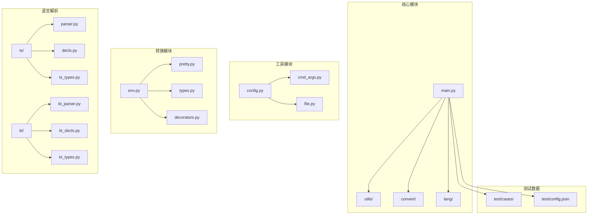
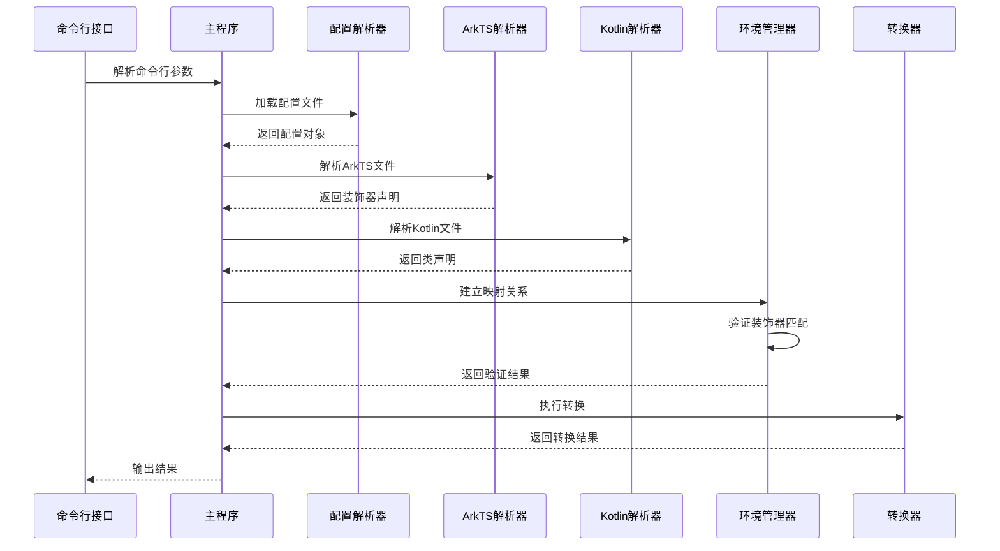
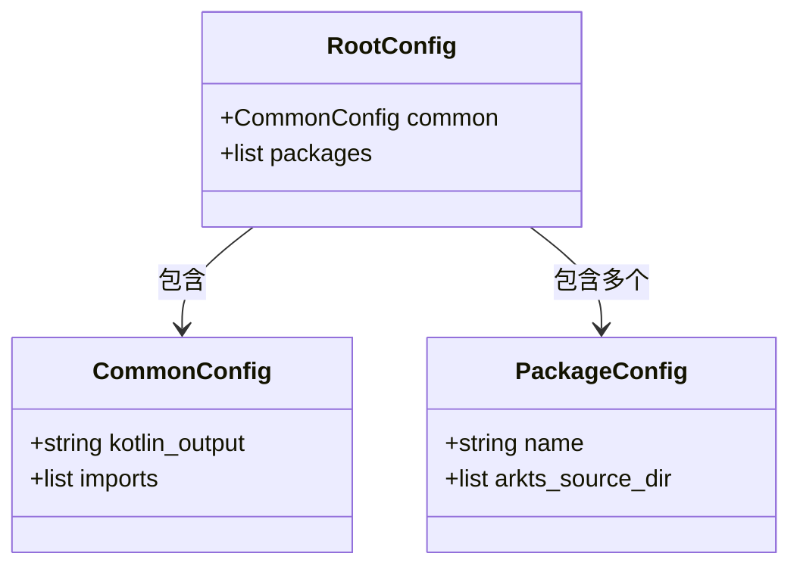
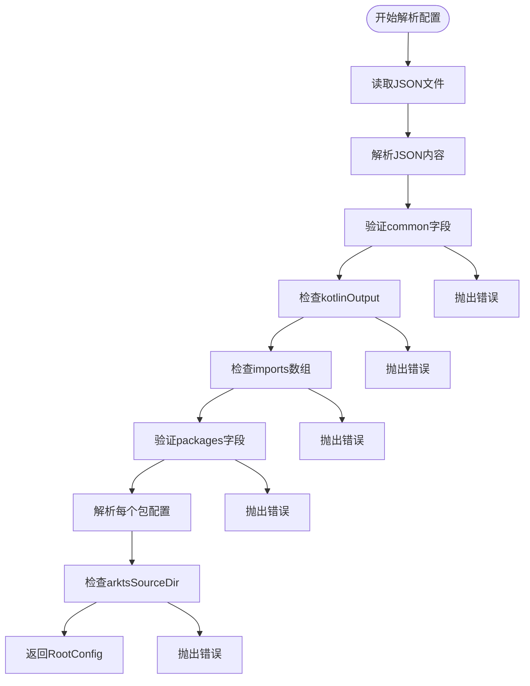
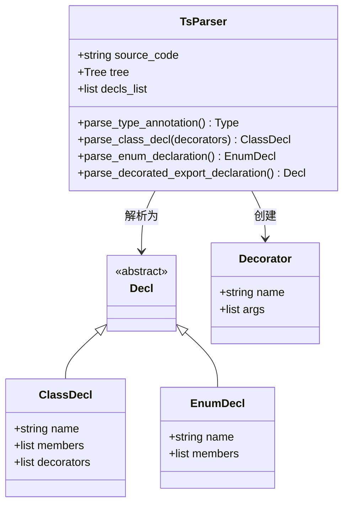
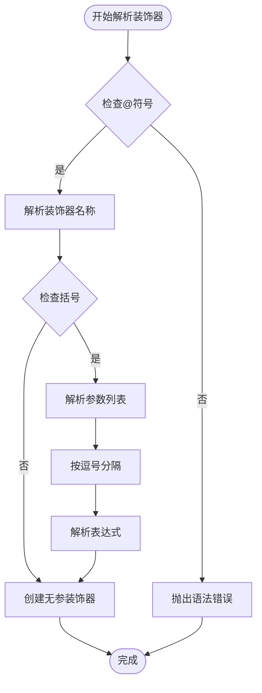
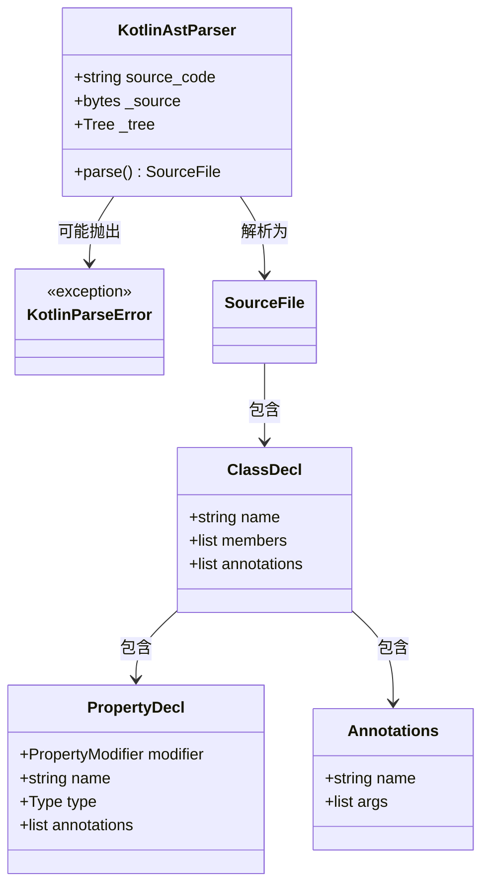
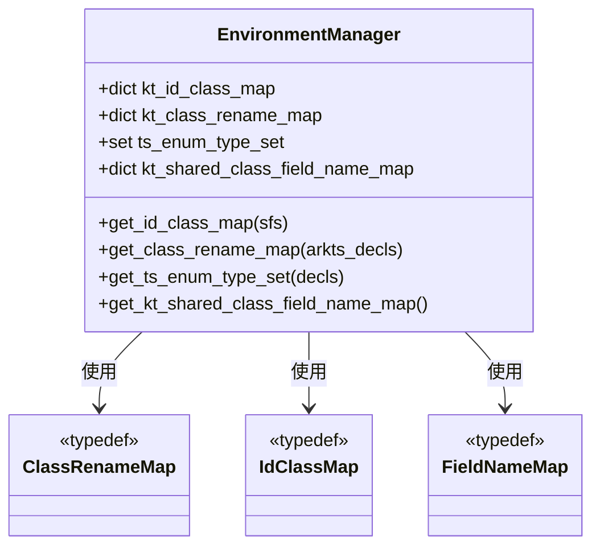
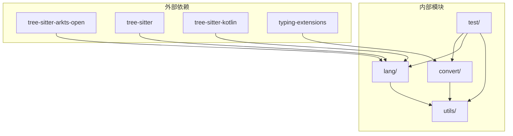

# 测试验证

<cite>
**本文档中引用的文件**
- [main.py](file://main.py)
- [test/config.json](file://test/config.json)
- [utils/config.py](file://utils/config.py)
- [utils/file.py](file://utils/file.py)
- [utils/cmd_args.py](file://utils/cmd_args.py)
- [convert/env.py](file://convert/env.py)
- [convert/pretty.py](file://convert/pretty.py)
- [lang/ts/parser.py](file://lang/ts/parser.py)
- [lang/kt/kt_parser.py](file://lang/kt/kt_parser.py)
- [test/cases/class0.ts](file://test/cases/class0.ts)
- [test/cases/kt/class0.kt](file://test/cases/kt/class0.kt)
- [test/cases/class1.ts](file://test/cases/class1.ts)
- [test/cases/kt/class1.kt](file://test/cases/kt/class1.kt)
- [test/cases/class2.ts](file://test/cases/class2.ts)
- [pyproject.toml](file://pyproject.toml)
</cite>

## 目录
1. [简介](#简介)
2. [项目结构](#项目结构)
3. [核心组件](#核心组件)
4. [架构概览](#架构概览)
5. [详细组件分析](#详细组件分析)
6. [依赖关系分析](#依赖关系分析)
7. [性能考虑](#性能考虑)
8. [故障排除指南](#故障排除指南)
9. [结论](#结论)

## 简介

这是一个基于Python的ArkTS FFI Kotlin转换工具，专门用于验证和测试ArkTS与Kotlin之间的互操作性。该工具通过解析ArkTS和Kotlin源代码文件，验证装饰器映射、类声明匹配和类型系统兼容性。

项目的核心功能包括：
- ArkTS文件解析和装饰器识别
- Kotlin文件解析和注解处理
- 跨语言类型系统验证
- 自动生成Kotlin包装器代码

## 项目结构

**图表来源**
- [main.py](file://main.py#L1-L69)
- [utils/config.py](file://utils/config.py#L1-L84)
- [convert/env.py](file://convert/env.py#L1-L85)

**章节来源**
- [main.py](file://main.py#L1-L69)
- [pyproject.toml](file://pyproject.toml#L1-L26)

## 核心组件

### 主要入口点
主程序负责协调整个转换流程，从命令行参数解析开始，到文件收集、解析和最终输出。

### 配置管理系统
提供灵活的配置解析能力，支持CommonConfig和PackageConfig两种配置模式。

### 解析器组件
包含ArkTS和Kotlin双语言解析器，能够准确提取装饰器信息和类型定义。

### 环境管理器
负责维护跨语言的映射关系，包括类名映射、枚举类型集合等。

**章节来源**
- [main.py](file://main.py#L19-L58)
- [utils/config.py](file://utils/config.py#L9-L25)
- [convert/env.py](file://convert/env.py#L11-L27)

## 架构概览

**图表来源**
- [main.py](file://main.py#L19-L58)
- [utils/cmd_args.py](file://utils/cmd_args.py#L15-L53)
- [utils/config.py](file://utils/config.py#L45-L61)

## 详细组件分析

### 配置系统分析

配置系统采用数据类设计，提供了强类型的配置管理：

**图表来源**
- [utils/config.py](file://utils/config.py#L9-L25)

配置验证流程确保了配置文件的完整性和正确性：

**图表来源**
- [utils/config.py](file://utils/config.py#L45-L61)

**章节来源**
- [utils/config.py](file://utils/config.py#L27-L61)
- [test/config.json](file://test/config.json#L1-L27)

### ArkTS解析器分析

ArkTS解析器使用Tree-Sitter库进行语法分析，支持装饰器、类声明和枚举的解析：

**图表来源**
- [lang/ts/parser.py](file://lang/ts/parser.py#L10-L323)

装饰器解析流程展示了如何处理不同类型的装饰器参数：

**图表来源**
- [lang/ts/parser.py](file://lang/ts/parser.py#L192-L212)

**章节来源**
- [lang/ts/parser.py](file://lang/ts/parser.py#L10-L323)

### Kotlin解析器分析

Kotlin解析器同样使用Tree-Sitter库，但针对Kotlin语法进行了专门优化：

**图表来源**
- [lang/kt/kt_parser.py](file://lang/kt/kt_parser.py#L229-L261)

**章节来源**
- [lang/kt/kt_parser.py](file://lang/kt/kt_parser.py#L1-L284)

### 环境管理器分析

环境管理器是整个系统的核心协调者，负责建立和维护跨语言的映射关系：

**图表来源**
- [convert/env.py](file://convert/env.py#L11-L27)

**章节来源**
- [convert/env.py](file://convert/env.py#L29-L85)

### 测试用例分析

项目包含丰富的测试用例，覆盖了各种场景：

#### 基础类测试
- [test/cases/class0.ts](file://test/cases/class0.ts#L1-L4): 最简单的ExportClass装饰器使用
- [test/cases/kt/class0.kt](file://test/cases/kt/class0.kt#L1-L9): 对应的基础Kotlin类

#### 支持expect/actual语法
- [test/cases/class1.ts](file://test/cases/class1.ts#L1-L5): 包含ExportField装饰器
- [test/cases/kt/class1.kt](file://test/cases/kt/class1.kt#L1-L18): 支持expect/actual声明

#### 接口实现测试
- [test/cases/class2.ts](file://test/cases/class2.ts#L1-L4): 实现多个接口的复杂类

**章节来源**
- [test/cases/class0.ts](file://test/cases/class0.ts#L1-L4)
- [test/cases/kt/class0.kt](file://test/cases/kt/class0.kt#L1-L9)
- [test/cases/class1.ts](file://test/cases/class1.ts#L1-L5)
- [test/cases/kt/class1.kt](file://test/cases/kt/class1.kt#L1-L18)
- [test/cases/class2.ts](file://test/cases/class2.ts#L1-L4)

## 依赖关系分析

**图表来源**
- [pyproject.toml](file://pyproject.toml#L15-L21)

**章节来源**
- [pyproject.toml](file://pyproject.toml#L1-L26)

## 性能考虑

### 并行处理策略
当前实现使用顺序处理方式，可以通过以下方式进行优化：

1. **多线程文件处理**: 对ArkTS和Kotlin文件解析可以并行执行
2. **异步I/O操作**: 文件读取和解析可以使用异步方式
3. **缓存机制**: 解析结果和映射关系可以缓存以避免重复计算

### 内存优化
- 使用生成器模式处理大型文件
- 及时释放不再使用的解析树
- 合理管理字典和集合的大小

## 故障排除指南

### 常见配置错误

1. **配置文件格式错误**
   - 检查JSON语法是否正确
   - 验证必需字段是否存在

2. **路径不存在或不可访问**
   - 确认kmp_dir和ohos_dir路径有效
   - 检查文件权限设置

### 解析错误

1. **装饰器不匹配**
   - 确认ArkTS中的装饰器名称与Kotlin注解对应
   - 检查装饰器参数格式

2. **类型系统不兼容**
   - 验证ArkTS和Kotlin类型映射
   - 检查泛型类型的处理

### 运行时错误

1. **KeyError: id not found**
   - 确保装饰器中的id在Kotlin文件中存在
   - 检查ShareClass注解的参数

**章节来源**
- [convert/env.py](file://convert/env.py#L48-L51)
- [utils/cmd_args.py](file://utils/cmd_args.py#L46-L51)

## 结论

这个ArkTS FFI Kotlin转换工具提供了一个完整的解决方案，用于验证和测试跨语言的类型系统兼容性。通过精心设计的架构和详细的测试用例，该工具能够：

1. **准确解析**ArkTS和Kotlin源代码
2. **验证装饰器映射**的正确性
3. **建立跨语言类型系统**的连接
4. **提供清晰的错误报告**帮助调试

未来可以考虑的改进方向包括：
- 添加更多的并发处理能力
- 扩展测试用例覆盖更复杂的场景
- 提供更详细的性能分析工具
- 增加对更多装饰器类型的支持