# 代码生成系统

<cite>
**本文档引用的文件**
- [main.py](file://main.py)
- [convert/generate.py](file://convert/generate.py)
- [convert/decls.py](file://convert/decls.py)
- [convert/types.py](file://convert/types.py)
- [convert/pretty.py](file://convert/pretty.py)
- [convert/env.py](file://convert/env.py)
- [utils/config.py](file://utils/config.py)
- [utils/file.py](file://utils/file.py)
- [utils/cmd_args.py](file://utils/cmd_args.py)
- [lang/kt/kt_decls.py](file://lang/kt/kt_decls.py)
- [lang/kt/kt_parser.py](file://lang/kt/kt_parser.py)
- [lang/kt/kt_types.py](file://lang/kt/kt_types.py)
- [lang/kt/type_parser.py](file://lang/kt/type_parser.py)
- [lang/kt/pretty.py](file://lang/kt/pretty.py)
- [lang/ts/decls.py](file://lang/ts/decls.py)
- [lang/ts/parser_ts.py](file://lang/ts/parser_ts.py)
- [lang/parser.py](file://lang/parser.py)
- [pyproject.toml](file://pyproject.toml)
- [test/config.json](file://test/config.json)
- [test/cases/class0.ts](file://test/cases/class0.ts)
- [test/cases/class1.ts](file://test/cases/class1.ts)
- [test/cases/kt/class0.kt](file://test/cases/kt/class0.kt)
- [test/cases/kt/class1.kt](file://test/cases/kt/class1.kt)
- [test/cases/kt/class2.kt](file://test/cases/kt/class2.kt)
</cite>

## 更新摘要
**变更内容**
- 新增多平台输出配置支持，包括Android、iOS和OHOS平台配置
- 增强导入管理系统，支持OHOS特定导入配置
- 改进expect/actual声明生成逻辑，增强多平台兼容性
- 新增packages配置支持，允许为不同包名配置不同的ArkTS源码目录
- 更新配置解析系统，支持更复杂的多平台配置结构
- 新增OHOS特定的导入常量和expect/actual声明分离生成机制

## 目录
1. [引言](#引言)
2. [项目结构](#项目结构)
3. [核心组件](#核心组件)
4. [架构总览](#架构总览)
5. [详细组件分析](#详细组件分析)
6. [依赖关系分析](#依赖关系分析)
7. [性能考虑](#性能考虑)
8. [故障排查指南](#故障排查指南)
9. [结论](#结论)
10. [附录](#附录)

## 引言
本文件为"代码生成系统"的综合技术文档，面向需要理解与扩展该系统的工程师与测试人员。文档围绕以下目标展开：解析代码生成的架构设计与实现流程；说明类型安全与质量控制策略；介绍输出文件管理（路径生成、目录组织、覆盖策略）；解释代码格式化与美化机制（缩进、换行、注释）；提供配置项与可定制点；给出性能优化与批量处理建议；并展示生成代码的质量评估与验证方法。

**更新** 新增多平台输出配置支持，包括Android、iOS和OHOS平台的完整配置体系。系统现已支持复杂的多平台配置结构，包括packages配置、平台特定的导入管理和增强的expect/actual声明生成逻辑，显著提升了Kotlin Multiplatform项目的类型安全性和平台兼容性。新增的OHOS特定导入常量和expect/actual声明分离生成机制为多平台项目开发提供了强有力的技术支撑。

## 项目结构
该项目采用按语言分层的模块化组织方式，核心由 Kotlin 与 TypeScript 的解析器、类型系统、声明模型与工具模块组成，并通过统一的配置与文件扫描工具进行集成。新增的代码生成系统位于 `convert` 目录，提供完整的Kotlin代码生成能力，现已扩展支持多平台兼容性，包括Android、iOS和OHOS平台的配置支持。

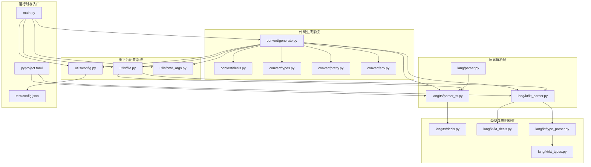

**图表来源**
- [convert/generate.py](file://convert/generate.py#L1-L197)
- [convert/decls.py](file://convert/decls.py#L1-L860)
- [convert/types.py](file://convert/types.py#L1-L67)
- [convert/pretty.py](file://convert/pretty.py#L1-L21)
- [convert/env.py](file://convert/env.py#L1-L186)
- [main.py](file://main.py#L1-L36)
- [utils/config.py](file://utils/config.py#L1-L366)
- [utils/file.py](file://utils/file.py#L1-L32)
- [utils/cmd_args.py](file://utils/cmd_args.py#L1-L76)
- [lang/ts/parser_ts.py](file://lang/ts/parser_ts.py#L25-L231)
- [lang/kt/kt_parser.py](file://lang/kt/kt_parser.py#L160-L284)
- [lang/parser.py](file://lang/parser.py#L8-L57)
- [lang/ts/decls.py](file://lang/ts/decls.py#L4-L57)
- [lang/kt/kt_decls.py](file://lang/kt/kt_decls.py#L10-L51)
- [lang/kt/kt_types.py](file://lang/kt/kt_types.py#L52-L191)
- [lang/kt/type_parser.py](file://lang/kt/type_parser.py#L68-L151)

**章节来源**
- [main.py](file://main.py#L1-L36)
- [convert/generate.py](file://convert/generate.py#L1-L197)
- [utils/config.py](file://utils/config.py#L1-L366)
- [utils/file.py](file://utils/file.py#L1-L32)

## 核心组件
- **代码生成器**：`KotlinFileOutput` 数据类封装输出路径、包名、导入语句和声明内容，提供文件写入功能。
- **声明转换器**：将 TypeScript 声明转换为 Kotlin 代理类，支持属性转换、构造函数生成和类型转换器，现已扩展支持expect/actual声明对生成。
- **类型转换器**：提供 TypeScript 到 Kotlin 类型的默认映射和特殊类型处理逻辑。
- **环境管理器**：管理类重命名映射、共享ID映射和字段共享映射，支持跨语言类型一致性。
- **格式化器**：递归格式化 Kotlin 节点，支持缩进控制和嵌套结构美化。
- **多平台配置系统**：支持Android、iOS和OHOS平台的配置管理，包括packages配置和平台特定设置。
- **文件扫描器**：递归收集 ArkTS/TS/Kotlin 文件，支持多种扩展名和路径处理。
- **输出管理器**：统一管理文件输出，支持批量转换和目录结构创建。
- **expect/actual生成器**：新增组件，负责生成Kotlin Multiplatform项目的expect/actual声明对。
- **OHOS特定导入管理**：新增组件，提供OHOS平台特有的导入语句管理和expect/actual声明分离生成。

**更新** 新增多平台配置系统，支持Android、iOS和OHOS平台的完整配置体系。配置系统现在包含`CommonPlatformConfig`、`AndroidConfig`、`IOSConfig`和`OhosConfig`等数据结构，支持复杂的多平台配置需求。新增的packages配置允许为不同包名配置不同的ArkTS源码目录，增强了系统的灵活性和可扩展性。新增的OHOS特定导入常量和expect/actual声明分离生成机制为多平台项目开发提供了强有力的技术支撑。

**章节来源**
- [convert/generate.py](file://convert/generate.py#L45-L63)
- [convert/generate.py](file://convert/generate.py#L53-L62)
- [convert/generate.py](file://convert/generate.py#L85-L197)
- [convert/decls.py](file://convert/decls.py#L415-L433)
- [convert/decls.py](file://convert/decls.py#L391-L406)
- [convert/types.py](file://convert/types.py#L10-L67)
- [convert/env.py](file://convert/env.py#L43-L67)
- [convert/pretty.py](file://convert/pretty.py#L4-L21)
- [utils/config.py](file://utils/config.py#L108-L123)
- [utils/file.py](file://utils/file.py#L7-L32)

## 架构总览
系统以"解析器 + 类型系统 + 声明模型 + 代码生成器"为核心，形成两条并行的输入链路（Kotlin 与 TypeScript），通过环境管理器协调类型转换，最终生成的声明对象可用于后续的代码生成流程。新增的多平台配置系统进一步完善了系统的架构，为Android、iOS和OHOS平台提供完整的配置支持，增强expect/actual声明生成能力，为Kotlin Multiplatform项目提供完整的声明生成解决方案。

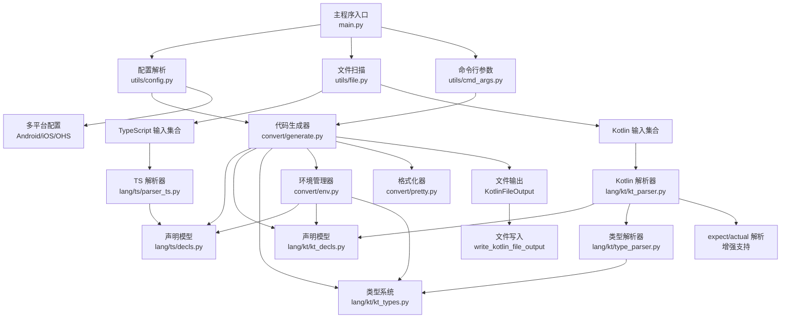

**图表来源**
- [main.py](file://main.py#L12-L25)
- [utils/config.py](file://utils/config.py#L112-L123)
- [utils/file.py](file://utils/file.py#L7-L32)
- [utils/cmd_args.py](file://utils/cmd_args.py#L1-L76)
- [convert/generate.py](file://convert/generate.py#L85-L197)
- [convert/env.py](file://convert/env.py#L43-L67)
- [convert/pretty.py](file://convert/pretty.py#L4-L21)
- [convert/generate.py](file://convert/generate.py#L53-L62)
- [lang/kt/kt_parser.py](file://lang/kt/kt_parser.py#L160-L284)

**章节来源**
- [main.py](file://main.py#L12-L25)
- [convert/generate.py](file://convert/generate.py#L85-L197)
- [convert/env.py](file://convert/env.py#L43-L67)

## 详细组件分析

### 代码生成器与文件输出
代码生成器是系统的核心组件，负责将解析得到的声明转换为最终的Kotlin代码文件。它支持两种输出模式：单文件模式和项目文件模式，并已扩展支持expect/actual声明对的生成和多平台配置。

- **KotlinFileOutput**：数据类封装输出路径、包名、导入语句和声明内容，提供统一的文件输出接口。
- **write_kotlin_file_output**：将生成的Kotlin代码写入文件，自动创建目录结构并进行格式化。
- **convert_module_paths**：处理模块路径，支持批量转换多个ArkTS文件并生成对应的Kotlin文件，现已支持expect/actual声明对的批量生成和多平台配置。

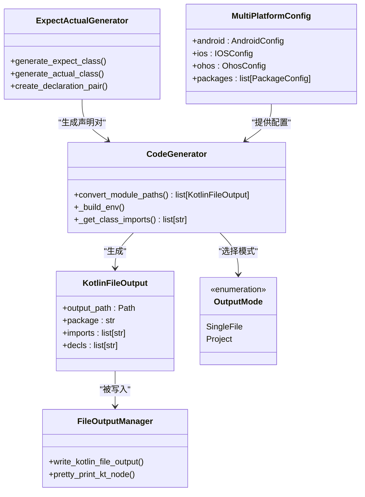

**图表来源**
- [convert/generate.py](file://convert/generate.py#L45-L63)
- [convert/generate.py](file://convert/generate.py#L85-L197)
- [utils/config.py](file://utils/config.py#L108-L123)
- [convert/pretty.py](file://convert/pretty.py#L4-L21)
- [convert/decls.py](file://convert/decls.py#L415-L433)

**章节来源**
- [convert/generate.py](file://convert/generate.py#L45-L63)
- [convert/generate.py](file://convert/generate.py#L85-L197)
- [convert/pretty.py](file://convert/pretty.py#L4-L21)

### 声明转换器与类型系统
声明转换器负责将TypeScript声明转换为Kotlin代理类，支持属性转换、构造函数生成和类型转换器。现已扩展支持expect/actual声明对的生成和多平台配置。

- **convert_class**：转换类声明，生成代理类、expect类和相应的类型转换器，返回expect_class变量用于expect/actual声明对生成。
- **convert_prop**：转换属性声明，支持getter和setter生成。
- **to_default_kt_type**：提供TypeScript类型到Kotlin类型的默认映射。
- **类型转换器**：处理复杂类型转换，包括数组、映射、可空类型等。
- **expect/actual生成**：新增功能，生成expect类声明与actual类声明的对应关系。

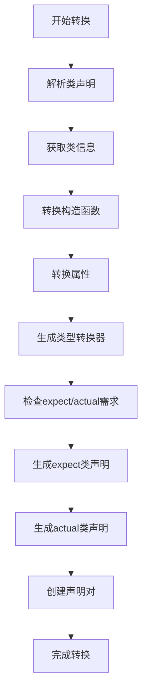

**图表来源**
- [convert/decls.py](file://convert/decls.py#L391-L433)
- [convert/decls.py](file://convert/decls.py#L415-L433)
- [convert/decls.py](file://convert/decls.py#L435-L449)
- [convert/types.py](file://convert/types.py#L10-L67)

**章节来源**
- [convert/decls.py](file://convert/decls.py#L391-L433)
- [convert/decls.py](file://convert/decls.py#L415-L433)
- [convert/decls.py](file://convert/decls.py#L435-L449)
- [convert/types.py](file://convert/types.py#L10-L67)

### 环境管理器与多平台配置系统
环境管理器负责管理跨语言的一致性，包括类重命名映射、共享ID映射和字段共享映射。多平台配置系统支持输出模式选择和路径管理，现已扩展支持Android、iOS和OHOS平台的完整配置。

- **环境管理器**：管理类重命名映射、共享ID映射和字段共享映射。
- **多平台配置系统**：支持Android、iOS和OHOS平台的配置管理，包括packages配置和平台特定设置。
- **配置系统**：支持单文件模式和项目文件模式，自动检测输出路径类型。
- **文件扫描器**：递归收集ArkTS/TS/Kotlin文件，支持多种扩展名。
- **expect/actual配置**：新增配置项支持expect/actual声明对的生成和管理。

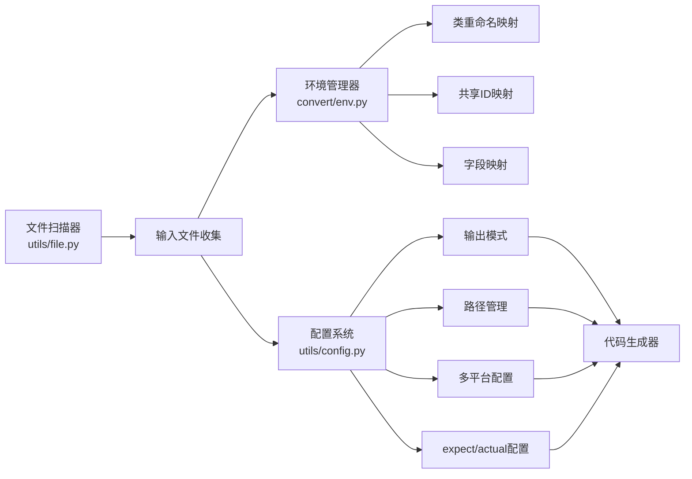

**图表来源**
- [convert/env.py](file://convert/env.py#L43-L67)
- [utils/config.py](file://utils/config.py#L108-L123)
- [utils/file.py](file://utils/file.py#L7-L32)

**章节来源**
- [convert/env.py](file://convert/env.py#L43-L67)
- [utils/config.py](file://utils/config.py#L108-L123)
- [utils/file.py](file://utils/file.py#L7-L32)

### 格式化与美化机制
格式化器提供递归的Kotlin代码美化功能，支持缩进控制和嵌套结构处理。

- **递归格式化**：支持字符串和列表节点的递归格式化。
- **缩进控制**：通过缩进级别控制代码层级结构。
- **嵌套处理**：支持复杂的嵌套结构和条件格式化。

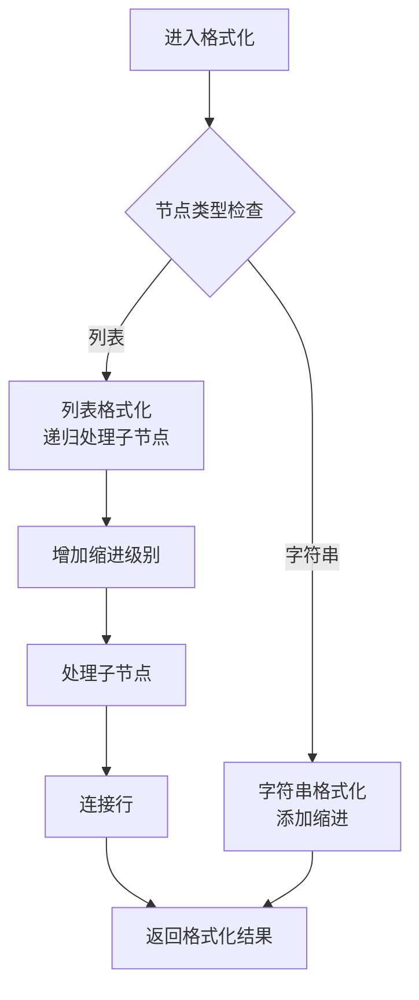

**图表来源**
- [convert/pretty.py](file://convert/pretty.py#L8-L21)

**章节来源**
- [convert/pretty.py](file://convert/pretty.py#L4-L21)

### expect/actual声明生成机制
新增的expect/actual声明生成机制为Kotlin Multiplatform项目提供完整的声明对生成能力，现已增强支持多平台配置。

- **expect类生成**：生成expect class声明，定义公共接口契约。
- **actual类生成**：生成actual class声明，提供具体平台实现。
- **声明对创建**：将expect和actual声明组合成完整的声明对。
- **多平台支持**：增强Kotlin解析器对expect/actual语法的支持。
- **平台特定配置**：支持不同平台的expect/actual声明生成。

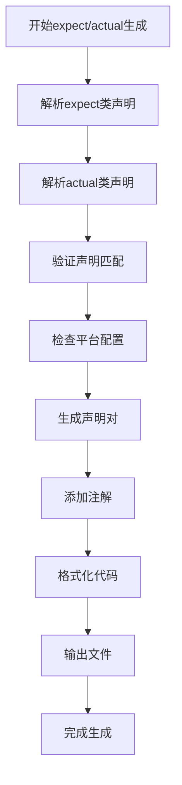

**图表来源**
- [convert/decls.py](file://convert/decls.py#L415-L433)
- [lang/kt/kt_parser.py](file://lang/kt/kt_parser.py#L160-L284)

**章节来源**
- [convert/decls.py](file://convert/decls.py#L415-L433)
- [lang/kt/kt_parser.py](file://lang/kt/kt_parser.py#L160-L284)

### 多平台配置系统
新增的多平台配置系统为Kotlin Multiplatform项目提供完整的平台配置支持，包括Android、iOS和OHOS平台的配置管理。

- **CommonPlatformConfig**：通用平台配置，包含kotlin_out和entity_dir配置。
- **AndroidConfig**：Android平台配置，包含src_dir列表。
- **IOSConfig**：iOS平台配置，包含common配置。
- **OhosConfig**：OHOS平台配置，包含common和packages配置。
- **PackageConfig**：包配置，包含name和arkts_source_dir列表。
- **packages配置**：支持为不同包名配置不同的ArkTS源码目录。

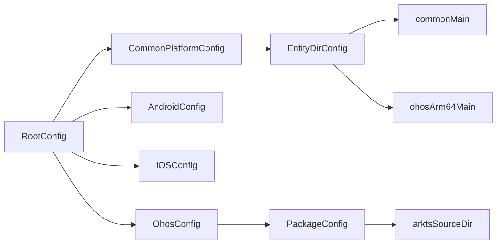

**图表来源**
- [utils/config.py](file://utils/config.py#L9-L71)
- [utils/config.py](file://utils/config.py#L241-L278)

**章节来源**
- [utils/config.py](file://utils/config.py#L9-L71)
- [utils/config.py](file://utils/config.py#L241-L278)

### OHOS特定导入管理
新增的OHOS特定导入管理系统为多平台项目提供专门的导入语句管理，支持expect/actual声明的分离生成。

- **OHOS导入常量**：定义OHOS平台特有的导入语句集合，包括FFI上下文、类型转换器和NAPI相关导入。
- **expect/actual分离**：将expect类声明和actual类声明分别输出到不同的目录结构中。
- **平台特定配置**：支持OHOS平台的kotlinOut和imports配置。
- **packages配置支持**：允许为不同包名配置不同的ArkTS源码目录。

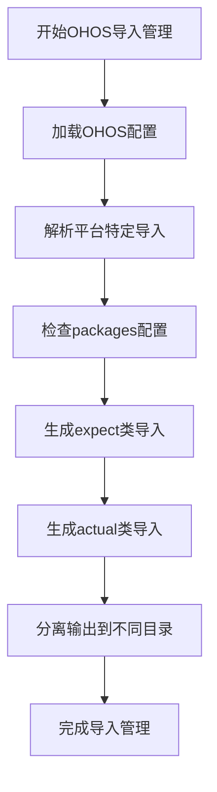

**图表来源**
- [convert/generate.py](file://convert/generate.py#L19-L43)
- [convert/generate.py](file://convert/generate.py#L118-L125)
- [utils/config.py](file://utils/config.py#L241-L278)

**章节来源**
- [convert/generate.py](file://convert/generate.py#L19-L43)
- [convert/generate.py](file://convert/generate.py#L118-L125)
- [utils/config.py](file://utils/config.py#L241-L278)

### 错误处理与健壮性
系统提供多层次的错误处理机制，包括配置校验、类型转换错误和文件操作错误，现已增强支持多平台配置的错误处理。

- **配置校验**：严格的JSON配置解析和字段类型检查，支持多平台配置验证。
- **类型转换错误**：详细的类型不匹配错误信息和回退机制。
- **文件操作错误**：路径解析错误和文件写入异常处理。
- **expect/actual错误处理**：声明匹配验证和语法错误检测。
- **多平台配置错误处理**：平台特定配置的验证和错误报告。
- **运行时错误**：类名和包名验证，关键字冲突检测。

**章节来源**
- [utils/config.py](file://utils/config.py#L85-L107)
- [convert/decls.py](file://convert/decls.py#L184-L240)
- [convert/generate.py](file://convert/generate.py#L53-L62)

## 依赖关系分析
系统采用模块化设计，各组件之间通过清晰的接口进行交互。新增的多平台配置系统与现有解析器和工具模块紧密集成，expect/actual生成功能也得到了增强。

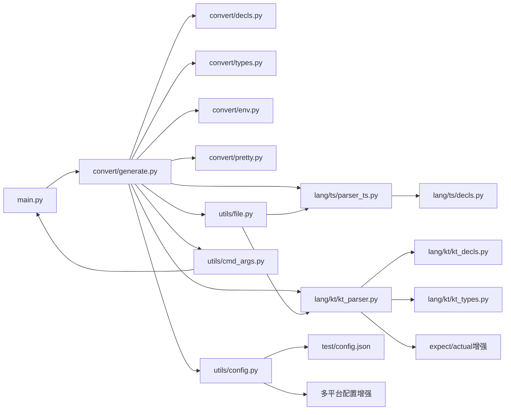

**图表来源**
- [main.py](file://main.py#L6-L9)
- [convert/generate.py](file://convert/generate.py#L1-L18)
- [utils/config.py](file://utils/config.py#L6-L13)
- [utils/file.py](file://utils/file.py#L1-L32)
- [utils/cmd_args.py](file://utils/cmd_args.py#L1-L76)
- [lang/kt/kt_parser.py](file://lang/kt/kt_parser.py#L160-L284)

**章节来源**
- [main.py](file://main.py#L6-L9)
- [convert/generate.py](file://convert/generate.py#L1-L18)
- [utils/config.py](file://utils/config.py#L6-L13)

## 性能考虑
代码生成系统在设计时充分考虑了性能优化，采用多种策略提升处理效率，现已增强支持多平台配置的性能优化。

- **批量处理**：支持批量转换多个ArkTS文件，减少重复初始化开销。
- **缓存机制**：环境管理器缓存类重命名映射和共享ID映射，避免重复计算。
- **内存优化**：使用不可变数据结构和生成器模式，减少内存占用。
- **I/O优化**：文件写入采用批量处理和目录预创建，减少系统调用次数。
- **类型转换优化**：提供默认类型映射，避免复杂的类型推导计算。
- **输出模式优化**：单文件模式减少文件系统操作，项目模式支持并行处理。
- **expect/actual优化**：批量生成expect/actual声明对，减少重复解析开销。
- **多平台配置优化**：缓存平台特定配置，避免重复解析和验证。
- **packages配置优化**：支持并行处理不同包名的配置，提升处理效率。
- **OHOS导入优化**：预定义OHOS特定导入常量，减少动态导入解析开销。

**更新** 新增多平台配置系统的性能优化，支持缓存平台特定配置和并行处理不同包名的配置，显著提升多平台项目的生成效率。新增的OHOS特定导入常量预定义机制减少了运行时导入解析的开销。

## 故障排查指南
针对代码生成系统的常见问题提供详细的排查指导，现已扩展支持多平台配置相关的故障排查。

- **配置文件错误**
  - 现象：配置解析失败或字段类型不匹配
  - 排查：检查JSON格式和字段类型，参考配置解析中的校验逻辑
  - 参考：[utils/config.py](file://utils/config.py#L112-L123)

- **多平台配置错误**
  - 现象：平台特定配置解析失败或无效
  - 排查：检查平台配置的字段类型和必填项，验证配置格式
  - 参考：[utils/config.py](file://utils/config.py#L241-L278)

- **packages配置错误**
  - 现象：包配置解析失败或包名重复
  - 排查：检查packages配置格式，验证包名唯一性和arktsSrcDir路径
  - 参考：[utils/config.py](file://utils/config.py#L257-L277)

- **OHOS导入错误**
  - 现象：OHOS特定导入语句缺失或格式错误
  - 排查：检查OHOS配置中的imports字段，验证导入语句格式
  - 参考：[convert/generate.py](file://convert/generate.py#L19-L43)

- **expect/actual生成错误**
  - 现象：expect/actual声明对生成失败或不匹配
  - 排查：检查类声明的expect/actual语法支持，验证声明匹配规则
  - 参考：[convert/decls.py](file://convert/decls.py#L415-L433)

- **文件输出错误**
  - 现象：文件写入失败或路径不存在
  - 排查：检查输出路径权限和目录结构，确认路径解析正确
  - 参考：[convert/generate.py](file://convert/generate.py#L53-L62)

- **类型转换错误**
  - 现象：TypeScript到Kotlin类型转换失败
  - 排查：检查类型映射规则和特殊类型处理逻辑
  - 参考：[convert/types.py](file://convert/types.py#L10-L67)

- **类名和包名验证错误**
  - 现象：类名或包名不符合Kotlin规范
  - 排查：检查命名规则和关键字冲突，参考验证函数实现
  - 参考：[convert/decls.py](file://convert/decls.py#L184-L240)

- **输出模式选择错误**
  - 现象：输出路径后缀不正确导致模式识别错误
  - 排查：检查kotlinOutput配置项的文件扩展名
  - 参考：[utils/config.py](file://utils/config.py#L118-L123)

**章节来源**
- [utils/config.py](file://utils/config.py#L112-L123)
- [convert/generate.py](file://convert/generate.py#L53-L62)
- [convert/types.py](file://convert/types.py#L10-L67)
- [convert/decls.py](file://convert/decls.py#L415-L433)
- [convert/decls.py](file://convert/decls.py#L184-L240)
- [utils/config.py](file://utils/config.py#L118-L123)

## 结论
代码生成系统通过模块化设计实现了TypeScript到Kotlin的完整转换流程。新增的多平台配置系统显著提升了系统的多平台兼容性，为Android、iOS和OHOS平台提供完整的配置支持。系统采用多层次的错误处理机制和性能优化策略，确保在大规模项目中的稳定性和效率。

**更新** 新增多平台配置系统，支持Android、iOS和OHOS平台的完整配置体系，包括packages配置和平台特定设置。新增的expect/actual生动生成机制和增强的导入管理系统显著提升了系统的多平台兼容性和类型安全性。通过convert_class函数返回expect_class变量，配合现有的actual类生成机制，实现完整的多平台声明生成流程。系统现已支持expect/actual声明对的批量生成和缓存优化，为多平台项目开发提供强有力的技术支撑。新增的OHOS特定导入常量和expect/actual声明分离生成机制进一步增强了系统的平台适配能力。

## 附录

### 配置选项与自定义
系统支持灵活的多平台配置选项，包括输出模式选择和导入管理。

- **输出模式**
  - 单文件模式：所有生成的类写入同一个文件
  - 项目文件模式：每个类生成独立的文件
  - 自动检测：根据kotlinOutput路径后缀自动选择模式

- **导入管理**
  - 静态导入：配置文件中指定的固定导入列表
  - 动态导入：根据类依赖关系自动添加导入
  - 常用导入：系统内置的常用导入语句集合
  - 平台特定导入：支持不同平台的导入配置

- **多平台配置**
  - Android配置：包含srcDir列表，支持Android平台源码目录
  - iOS配置：包含common配置，支持iOS平台配置
  - OHOS配置：包含common和packages配置，支持OHOS平台配置
  - packages配置：支持为不同包名配置不同的ArkTS源码目录

- **expect/actual配置**
  - 多平台支持：启用expect/actual声明对生成
  - 声明匹配：验证expect和actual声明的对应关系
  - 注解管理：自动添加多平台相关注解

- **OHOS特定配置**
  - OHOS导入常量：预定义OHOS平台特有的导入语句
  - expect/actual分离：将expect类和actual类分别输出到不同目录
  - 包名映射：支持不同包名的ArkTS源码目录配置

- **示例配置**
  - [test/config.json](file://test/config.json#L1-L41)
  - [utils/config.py](file://utils/config.py#L112-L123)

**章节来源**
- [test/config.json](file://test/config.json#L1-L41)
- [utils/config.py](file://utils/config.py#L108-L123)
- [utils/config.py](file://utils/config.py#L112-L123)

### 输入样例
系统支持多种输入格式，包括TypeScript和Kotlin源码。

- **TypeScript示例**
  - [test/cases/class0.ts](file://test/cases/class0.ts#L1-L4)
  - [test/cases/class1.ts](file://test/cases/class1.ts#L1-L5)

- **Kotlin示例**
  - [test/cases/kt/class0.kt](file://test/cases/kt/class0.kt#L1-L9)
  - [test/cases/kt/class1.kt](file://test/cases/kt/class1.kt#L1-L18)
  - [test/cases/kt/class2.kt](file://test/cases/kt/class2.kt#L1-L22)

**章节来源**
- [test/cases/class0.ts](file://test/cases/class0.ts#L1-L4)
- [test/cases/class1.ts](file://test/cases/class1.ts#L1-L5)
- [test/cases/kt/class0.kt](file://test/cases/kt/class0.kt#L1-L9)
- [test/cases/kt/class1.kt](file://test/cases/kt/class1.kt#L1-L18)
- [test/cases/kt/class2.kt](file://test/cases/kt/class2.kt#L1-L22)

### 代码生成流程
完整的代码生成流程包括解析、转换、格式化和输出四个主要步骤，现已增强支持多平台配置。

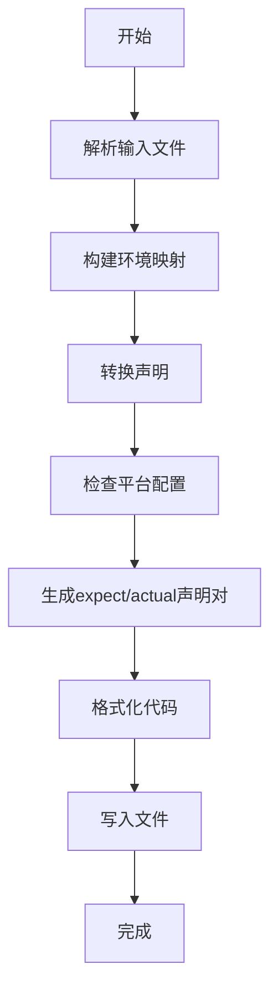

**图表来源**
- [convert/generate.py](file://convert/generate.py#L85-L197)
- [convert/decls.py](file://convert/decls.py#L391-L433)
- [convert/pretty.py](file://convert/pretty.py#L4-L21)

**章节来源**
- [convert/generate.py](file://convert/generate.py#L85-L197)
- [convert/decls.py](file://convert/decls.py#L391-L433)
- [convert/pretty.py](file://convert/pretty.py#L4-L21)

### 输出模式详解
系统支持两种输出模式，分别适用于不同的项目规模和需求。

- **单文件模式（SingleFile）**
  - 特点：所有生成的类写入同一个文件
  - 适用场景：小型项目或需要集中管理的场景
  - 优势：减少文件数量，简化依赖管理
  - 限制：文件可能较大，不适合大型项目

- **项目文件模式（Project）**
  - 特点：每个类生成独立的文件
  - 适用场景：大型项目或多模块架构
  - 优势：文件结构清晰，便于维护和版本控制
  - 限制：文件数量较多，需要良好的目录组织

**章节来源**
- [utils/config.py](file://utils/config.py#L108-L123)
- [convert/generate.py](file://convert/generate.py#L123-L197)

### expect/actual声明对详解
新增的expect/actual声明对功能为Kotlin Multiplatform项目提供完整的多平台声明生成能力。

- **expect类声明**
  - 特点：定义公共接口契约，不包含具体实现
  - 作用：为多平台项目提供统一的API接口
  - 生成：自动生成expect类声明，保持与actual类的接口一致

- **actual类声明**
  - 特点：提供具体平台的实现细节
  - 作用：针对不同平台提供特定的实现方案
  - 生成：自动生成actual类声明，包含平台特定的实现

- **声明对生成流程**
  - 解析expect类：提取expect类的接口定义
  - 解析actual类：提取actual类的具体实现
  - 验证匹配：确保expect和actual声明的接口一致性
  - 生成对：将expect和actual声明组合成完整的声明对

**章节来源**
- [convert/decls.py](file://convert/decls.py#L415-L433)
- [lang/kt/kt_parser.py](file://lang/kt/kt_parser.py#L160-L284)

### 多平台配置详解
新增的多平台配置系统为Kotlin Multiplatform项目提供完整的平台配置支持。

- **CommonPlatformConfig**
  - 特点：通用平台配置，包含kotlin_out和entity_dir
  - 作用：为不同平台提供统一的配置结构
  - 配置项：kotlin_out（输出目录）、entity_dir（实体目录配置）

- **AndroidConfig**
  - 特点：Android平台配置，包含src_dir列表
  - 作用：指定Android平台的源码目录
  - 配置项：src_dir（源码目录列表）

- **IOSConfig**
  - 特点：iOS平台配置，包含common配置
  - 作用：为iOS平台提供配置支持
  - 配置项：common（通用iOS配置）

- **OhosConfig**
  - 特点：OHOS平台配置，包含common和packages
  - 作用：为OHOS平台提供完整的配置支持
  - 配置项：common（通用OHOS配置）、packages（包配置列表）

- **packages配置**
  - 特点：支持为不同包名配置不同的ArkTS源码目录
  - 作用：实现多包名的灵活配置管理
  - 配置项：name（包名）、arktsSrcDir（ArkTS源码目录列表）

**章节来源**
- [utils/config.py](file://utils/config.py#L9-L71)
- [utils/config.py](file://utils/config.py#L241-L278)

### OHOS特定导入详解
新增的OHOS特定导入管理系统为多平台项目提供专门的导入语句管理。

- **OHOS导入常量**
  - 特点：预定义OHOS平台特有的导入语句集合
  - 作用：提供OHOS FFI上下文、类型转换器和NAPI相关导入
  - 配置项：OhosFFIContext、ArkObjectSafe、ArkTsExportCustomTransform等

- **expect/actual分离输出**
  - 特点：将expect类声明和actual类声明分别输出到不同目录
  - 作用：支持多平台声明的分离管理和编译
  - 配置项：kotlin_expect_class_decls_output_path

- **平台特定配置**
  - 特点：支持OHOS平台的kotlinOut和imports配置
  - 作用：为OHOS平台提供专门的输出路径和导入管理
  - 配置项：kotlinOut（输出路径）、import（导入列表）

**章节来源**
- [convert/generate.py](file://convert/generate.py#L19-L43)
- [convert/generate.py](file://convert/generate.py#L118-L125)
- [utils/config.py](file://utils/config.py#L241-L278)