# 代理到真实对象转换功能

<cite>
**本文档引用的文件**
- [main.py](file://main.py)
- [generate.py](file://convert/generate.py)
- [decls.py](file://convert/decls.py)
- [types.py](file://convert/types.py)
- [env.py](file://convert/env.py)
- [kt_decls.py](file://lang/kt/kt_decls.py)
- [decls.py](file://lang/ts/decls.py)
- [config.py](file://utils/config.py)
- [decorators.py](file://convert/decorators.py)
- [class0.ts](file://test/cases/class0.ts)
- [class1.ts](file://test/cases/class1.ts)
- [class0.kt](file://test/cases/kt/class0.kt)
- [class1.kt](file://test/cases/kt/class1.kt)
- [class2.kt](file://test/cases/kt/class2.kt)
- [config.json](file://test/config.json)
</cite>

## 更新摘要
**变更内容**
- 修复了映射函数构建逻辑中的bug：修正了非代理类型处理中的提前返回问题
- 确保所有类类型的映射函数都能正确构建，不再因类型判断而提前退出
- 改进了字段转换处理的健壮性，增强了错误处理机制
- 优化了条件性期望类生成的逻辑，确保在各种配置下都能正确工作
- 增强了类型检查和字段映射的准确性

## 目录
1. [简介](#简介)
2. [项目结构](#项目结构)
3. [核心组件](#核心组件)
4. [架构概览](#架构概览)
5. [详细组件分析](#详细组件分析)
6. [依赖关系分析](#依赖关系分析)
7. [性能考虑](#性能考虑)
8. [故障排除指南](#故障排除指南)
9. [结论](#结论)

## 简介

本文档详细介绍了基于 ArkTS 与 Kotlin FFI（Foreign Function Interface）的代理到真实对象转换功能。该功能允许在 ArkTS 层创建 Kotlin 类的代理对象，并提供双向转换机制，使得 ArkTS 对象可以与 Kotlin 对象进行互操作。

**更新** 该系统现已支持 Kotlin Multiplatform 兼容性，能够生成 expect 类声明与 actual 实现类，为多平台项目提供完整的类型安全转换支持。新增的条件性期望类生成功能可以根据配置和类要求智能地决定是否生成期望类，提高了系统的灵活性和适用性。

**更新** 新增的序列化名称映射支持和配置导入功能进一步增强了系统的实用性。系统现在能够处理 Kotlin 的 SerializedName 注解，并通过 enable_json_name 配置项控制 JSON 名称映射功能。

**更新** 最重要的改进是修复了映射函数构建逻辑中的关键bug：修正了非代理类型处理中的提前返回问题，确保所有类类型的映射函数都能正确构建。这一修复解决了之前可能导致某些类类型无法生成完整转换函数的问题，大大增强了系统的稳定性和可靠性。

该系统的核心特性包括：
- 自动代理类生成：为每个 Kotlin 类生成对应的 ArkTS 代理类
- 类型安全转换：确保 ArkTS 和 Kotlin 对象之间的类型兼容性
- 字段映射机制：支持通过装饰器配置字段的名称和类型映射
- 共享标识符支持：通过 ID 机制实现跨语言的对象关联
- 自动转换器生成：为自定义对象类型生成专用的转换器
- **新增**：增强的 expect/actual 类生成逻辑，包括 convert_prop_decl() 函数
- **新增**：改进的 convert_class() 函数，支持条件性期望类生成
- **新增**：智能的 needs_expect_class 变量逻辑，控制期望类生成
- **新增**：基于 share_type 配置的智能期望类生成机制
- **新增**：序列化名称映射支持（SerializedName 注解）
- **新增**：配置导入支持（enable_json_name 配置项）
- **新增**：改进的类名包名处理逻辑
- **新增**：修复的映射函数构建逻辑，确保所有类类型都能正确处理

## 项目结构

该项目采用模块化设计，主要包含以下核心目录：

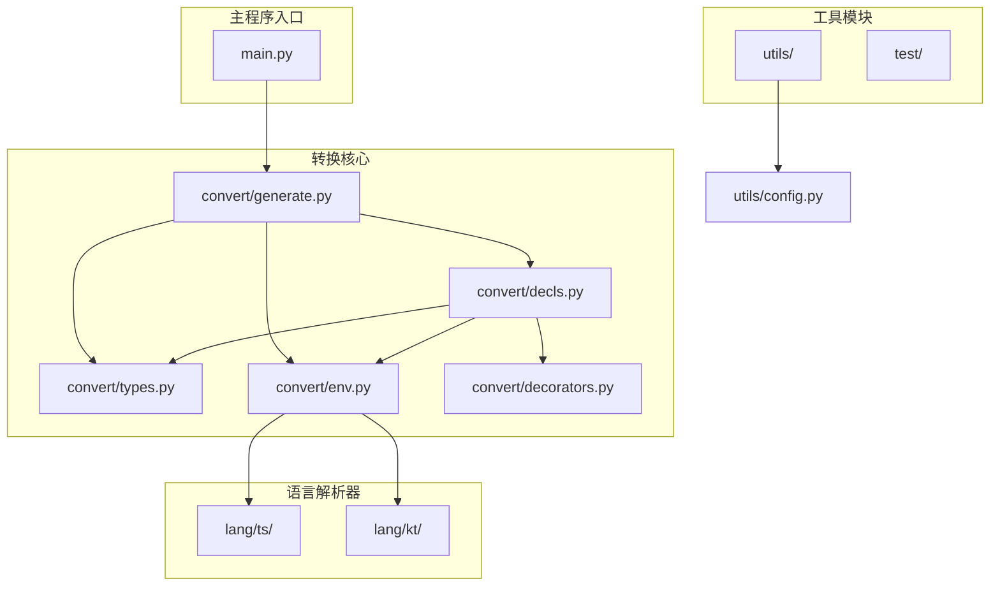
```mermaid
graph TB
subgraph "主程序入口"
main[main.py]
end
subgraph "转换核心"
generate[convert/generate.py]
decls[convert/decls.py]
types[convert/types.py]
env[convert/env.py]
decorators[convert/decorators.py]
end
subgraph "语言解析器"
ts_lang[lang/ts/]
kt_lang[lang/kt/]
end
subgraph "工具模块"
utils[utils/]
test[test/]
end
main --> generate
generate --> decls
generate --> types
generate --> env
decls --> types
decls --> env
decls --> decorators
env --> kt_lang
env --> ts_lang
utils --> config[utils/config.py]
```

**图表来源**
- [main.py](file://main.py#L1-L33)
- [generate.py](file://convert/generate.py#L1-L196)
- [decls.py](file://convert/decls.py#L1-L860)

**章节来源**
- [main.py](file://main.py#L1-L33)
- [generate.py](file://convert/generate.py#L1-L196)

## 核心组件

### 1. 主要执行流程

系统的主要执行流程如下：

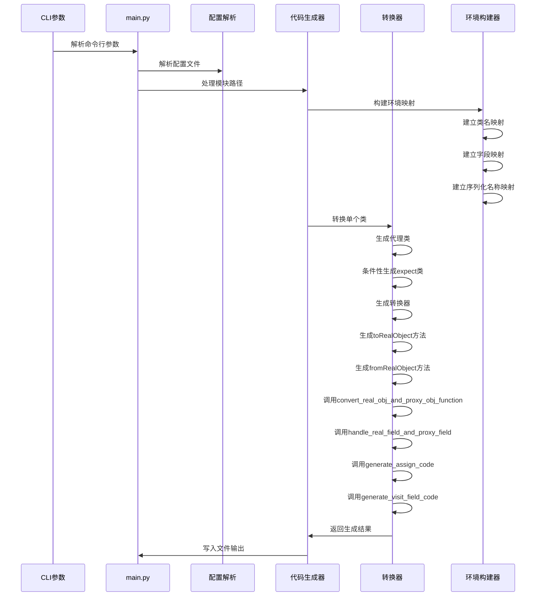
```mermaid
sequenceDiagram
participant CLI as CLI参数
participant Main as main.py
participant Config as 配置解析
participant Generator as 代码生成器
participant Converter as 转换器
participant Env as 环境构建器
CLI->>Main : 解析命令行参数
Main->>Config : 解析配置文件
Main->>Generator : 处理模块路径
Generator->>Env : 构建环境映射
Env->>Env : 建立类名映射
Env->>Env : 建立字段映射
Env->>Env : 建立序列化名称映射
Generator->>Converter : 转换单个类
Converter->>Converter : 生成代理类
Converter->>Converter : 条件性生成expect类
Converter->>Converter : 生成转换器
Converter->>Converter : 生成toRealObject方法
Converter->>Converter : 生成fromRealObject方法
Converter->>Converter : 调用convert_real_obj_and_proxy_obj_function
Converter->>Converter : 调用handle_real_field_and_proxy_field
Converter->>Converter : 调用generate_assign_code
Converter->>Converter : 调用generate_visit_field_code
Converter->>Generator : 返回生成结果
Generator->>Main : 写入文件输出
```

**图表来源**
- [main.py](file://main.py#L12-L24)
- [generate.py](file://convert/generate.py#L170-L196)

### 2. 关键数据结构

系统使用多种数据结构来管理类型转换和映射关系：

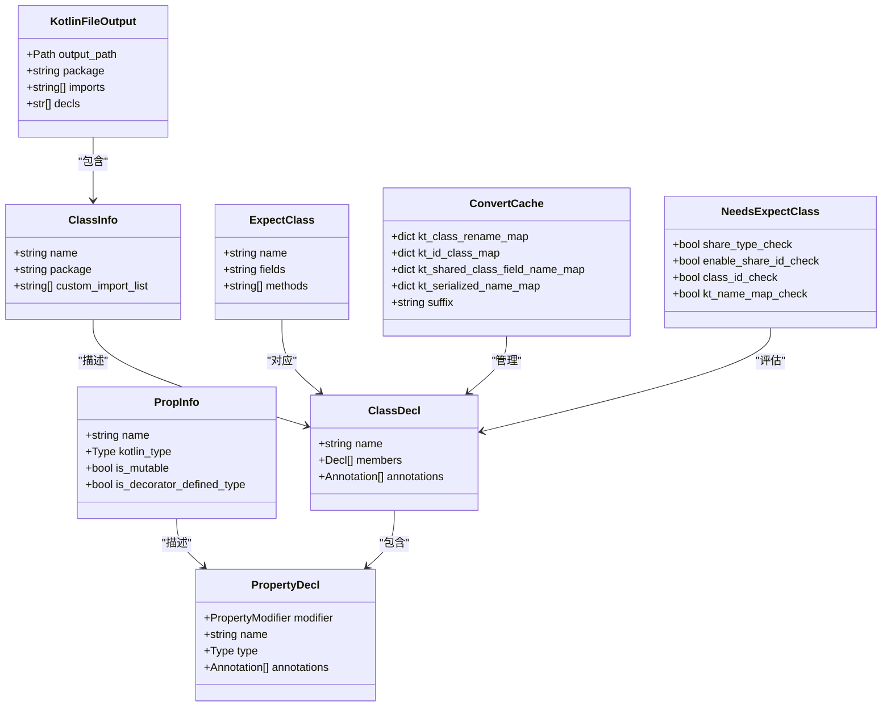
```mermaid
classDiagram
class ClassInfo {
+string name
+string package
+string[] custom_import_list
}
class PropInfo {
+string name
+Type kotlin_type
+bool is_mutable
+bool is_decorator_defined_type
}
class KotlinFileOutput {
+Path output_path
+string package
+string[] imports
+str[] decls
}
class ClassDecl {
+string name
+Decl[] members
+Annotation[] annotations
}
class PropertyDecl {
+PropertyModifier modifier
+string name
+Type type
+Annotation[] annotations
}
class ExpectClass {
+string name
+string fields
+string[] methods
}
class ConvertCache {
+dict kt_class_rename_map
+dict kt_id_class_map
+dict kt_shared_class_field_name_map
+dict kt_serialized_name_map
+string suffix
}
class NeedsExpectClass {
+bool share_type_check
+bool enable_share_id_check
+bool class_id_check
+bool kt_name_map_check
}
ClassInfo --> ClassDecl : "描述"
PropInfo --> PropertyDecl : "描述"
KotlinFileOutput --> ClassInfo : "包含"
ClassDecl --> PropertyDecl : "包含"
ExpectClass --> ClassDecl : "对应"
ConvertCache --> ClassDecl : "管理"
NeedsExpectClass --> ClassDecl : "评估"
```

**图表来源**
- [decls.py](file://convert/decls.py#L372-L377)
- [env.py](file://convert/env.py#L20-L29)

**章节来源**
- [decls.py](file://convert/decls.py#L372-L377)
- [env.py](file://convert/env.py#L20-L29)

## 架构概览

### 系统架构图

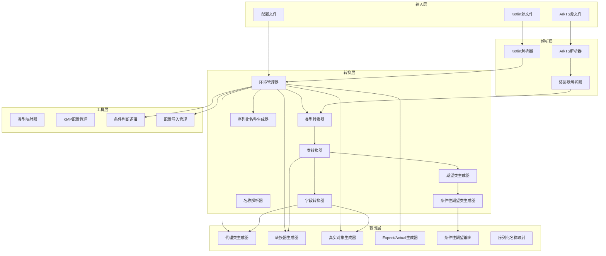
```mermaid
graph TB
subgraph "输入层"
ts_files[ArkTS源文件]
kt_files[Kotlin源文件]
config_json[配置文件]
end
subgraph "解析层"
ts_parser[ArkTS解析器]
kt_parser[Kotlin解析器]
decorator_parser[装饰器解析器]
end
subgraph "转换层"
type_converter[类型转换器]
class_converter[类转换器]
field_converter[字段转换器]
env_manager[环境管理器]
name_resolver[名称解析器]
expect_generator[期望类生成器]
conditional_expect_generator[条件性期望类生成器]
serial_name_generator[序列化名称生成器]
end
subgraph "输出层"
proxy_generator[代理类生成器]
transformer_generator[转换器生成器]
real_object_generator[真实对象生成器]
expect_actual_generator[Expect/Actual生成器]
conditional_expect_output[条件性期望输出]
serial_name_mapping[序列化名称映射]
end
subgraph "工具层"
env_manager[环境管理器]
type_mapper[类型映射器]
name_resolver[名称解析器]
kmp_config[KMP配置管理]
conditional_logic[条件判断逻辑]
config_import[配置导入管理]
end
ts_files --> ts_parser
kt_files --> kt_parser
config_json --> env_manager
ts_parser --> decorator_parser
kt_parser --> env_manager
decorator_parser --> type_converter
env_manager --> type_converter
type_converter --> class_converter
class_converter --> field_converter
field_converter --> proxy_generator
class_converter --> transformer_generator
field_converter --> real_object_generator
class_converter --> expect_generator
expect_generator --> conditional_expect_generator
conditional_expect_generator --> conditional_expect_output
env_manager --> proxy_generator
env_manager --> transformer_generator
env_manager --> real_object_generator
env_manager --> expect_actual_generator
env_manager --> conditional_logic
env_manager --> serial_name_generator
env_manager --> config_import
```

**图表来源**
- [generate.py](file://convert/generate.py#L170-L196)
- [decls.py](file://convert/decls.py#L404-L473)

### 数据流图

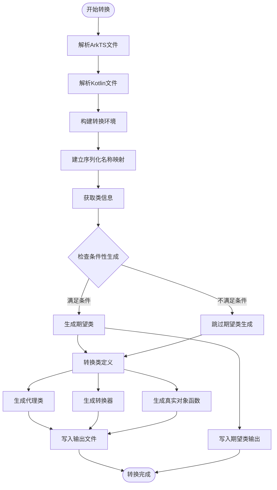
```mermaid
flowchart TD
Start([开始转换]) --> ParseTS["解析ArkTS文件"]
ParseTS --> ParseKT["解析Kotlin文件"]
ParseKT --> BuildEnv["构建转换环境"]
BuildEnv --> BuildSerialMap["建立序列化名称映射"]
BuildSerialMap --> GetClassInfo["获取类信息"]
GetClassInfo --> CheckCondition{检查条件性生成}
CheckCondition --> |满足条件| GenerateExpect["生成期望类"]
CheckCondition --> |不满足条件| SkipExpect["跳过期望类生成"]
GenerateExpect --> ConvertClass["转换类定义"]
SkipExpect --> ConvertClass
ConvertClass --> GenerateProxy["生成代理类"]
ConvertClass --> GenerateTransformer["生成转换器"]
ConvertClass --> GenerateRealFunc["生成真实对象函数"]
GenerateProxy --> WriteOutput["写入输出文件"]
GenerateExpect --> WriteExpectOutput["写入期望类输出"]
GenerateTransformer --> WriteOutput
GenerateRealFunc --> WriteOutput
WriteOutput --> End([转换完成])
WriteExpectOutput --> End
```

**图表来源**
- [generate.py](file://convert/generate.py#L170-L196)
- [decls.py](file://convert/decls.py#L404-L473)

## 详细组件分析

### 1. 代理类生成器

代理类生成器是系统的核心组件，负责将 Kotlin 类转换为 ArkTS 代理类。

#### 代理类结构

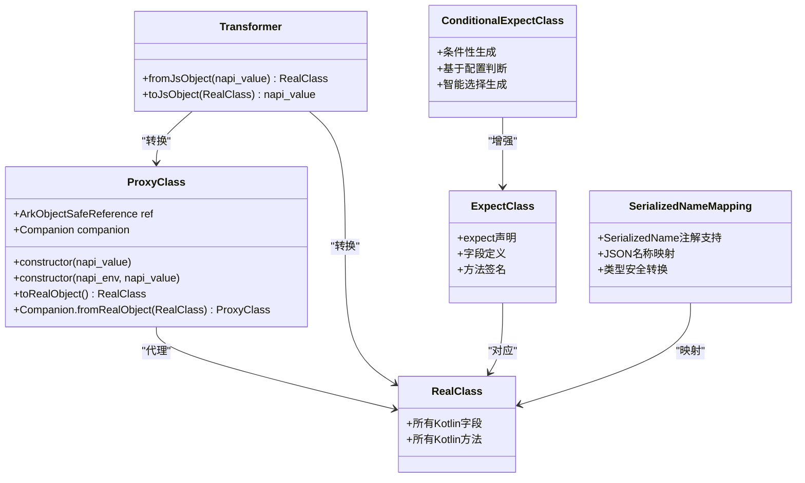
```mermaid
classDiagram
class ProxyClass {
+ArkObjectSafeReference ref
+Companion companion
+constructor(napi_value)
+constructor(napi_env, napi_value)
+toRealObject() RealClass
+Companion.fromRealObject(RealClass) ProxyClass
}
class Transformer {
+fromJsObject(napi_value) RealClass
+toJsObject(RealClass) napi_value
}
class RealClass {
+所有Kotlin字段
+所有Kotlin方法
}
class ExpectClass {
+expect声明
+字段定义
+方法签名
}
class ConditionalExpectClass {
+条件性生成
+基于配置判断
+智能选择生成
}
class SerializedNameMapping {
+SerializedName注解支持
+JSON名称映射
+类型安全转换
}
ProxyClass --> RealClass : "代理"
Transformer --> RealClass : "转换"
Transformer --> ProxyClass : "转换"
ExpectClass --> RealClass : "对应"
ConditionalExpectClass --> ExpectClass : "增强"
SerializedNameMapping --> RealClass : "映射"
```

**图表来源**
- [decls.py](file://convert/decls.py#L404-L473)

#### 字段转换机制

字段转换器根据 ArkTS 类型和 Kotlin 类型的不同组合生成相应的转换代码：

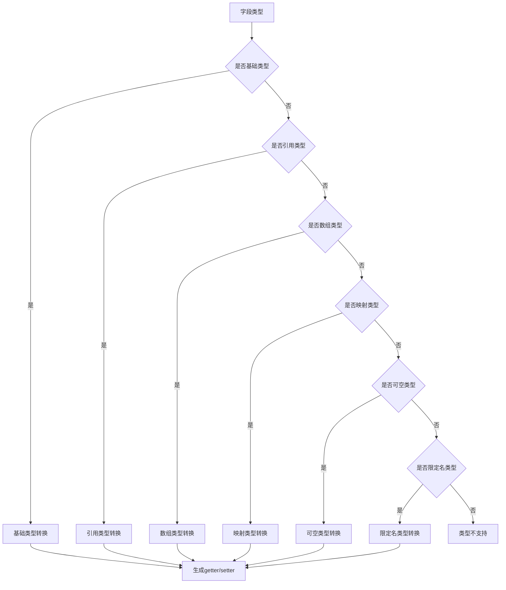
```mermaid
flowchart TD
FieldType[字段类型] --> CheckPrimitive{是否基础类型}
CheckPrimitive --> |是| PrimitiveConvert[基础类型转换]
CheckPrimitive --> |否| CheckRef{是否引用类型}
CheckRef --> |是| RefConvert[引用类型转换]
CheckRef --> |否| CheckArray{是否数组类型}
CheckArray --> |是| ArrayConvert[数组类型转换]
CheckArray --> |否| CheckMap{是否映射类型}
CheckMap --> |是| MapConvert[映射类型转换]
CheckMap --> |否| CheckNullable{是否可空类型}
CheckNullable --> |是| NullableConvert[可空类型转换]
CheckNullable --> |否| CheckQualifiedName{是否限定名类型}
CheckQualifiedName --> |是| QualifiedNameConvert[限定名类型转换]
CheckQualifiedName --> |否| Error[类型不支持]
PrimitiveConvert --> GetterSetter[生成getter/setter]
RefConvert --> GetterSetter
ArrayConvert --> GetterSetter
MapConvert --> GetterSetter
NullableConvert --> GetterSetter
QualifiedNameConvert --> GetterSetter
```

**图表来源**
- [decls.py](file://convert/decls.py#L19-L203)

**章节来源**
- [decls.py](file://convert/decls.py#L19-L203)
- [decls.py](file://convert/decls.py#L404-L473)

### 2. 条件性期望类生成器

**更新** 新增的条件性期望类生成器专门负责根据配置和类要求智能生成期望类。

#### 条件性生成流程

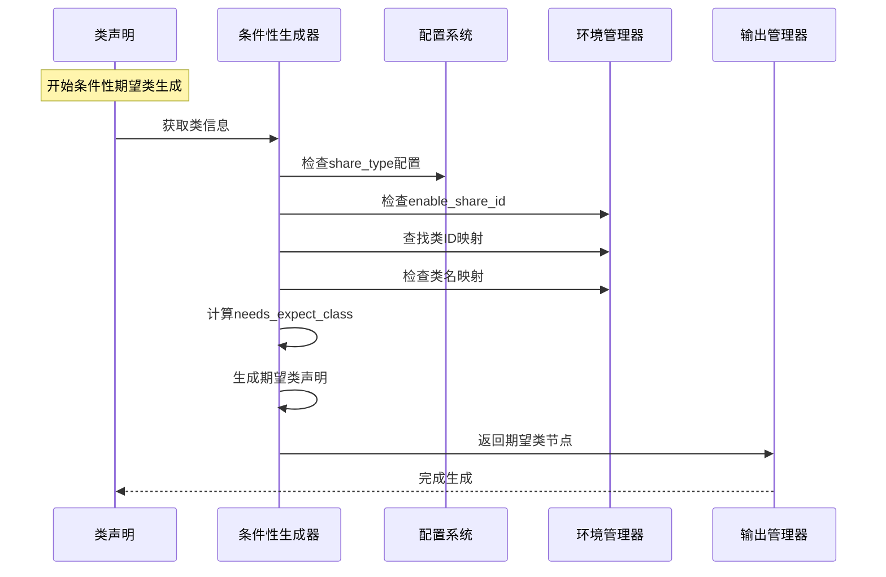
```mermaid
sequenceDiagram
participant ClassDecl as 类声明
participant ConditionalGen as 条件性生成器
participant Config as 配置系统
participant Env as 环境管理器
participant Output as 输出管理器
Note over ClassDecl : 开始条件性期望类生成
ClassDecl->>ConditionalGen : 获取类信息
ConditionalGen->>Config : 检查share_type配置
ConditionalGen->>Env : 检查enable_share_id
ConditionalGen->>Env : 查找类ID映射
ConditionalGen->>Env : 检查类名映射
ConditionalGen->>ConditionalGen : 计算needs_expect_class
ConditionalGen->>ConditionalGen : 生成期望类声明
ConditionalGen->>Output : 返回期望类节点
Output-->>ClassDecl : 完成生成
```

**图表来源**
- [decls.py](file://convert/decls.py#L411-L419)

#### 条件判断逻辑

条件性期望类生成的关键在于 `needs_expect_class` 变量的计算：

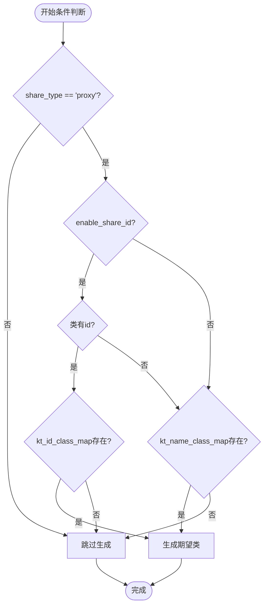
```mermaid
flowchart TD
Start([开始条件判断]) --> CheckShareType{share_type == 'proxy'?}
CheckShareType --> |否| SkipExpect[跳过生成]
CheckShareType --> |是| CheckEnableShareId{enable_share_id?}
CheckEnableShareId --> |是| CheckClassId{类有id?}
CheckEnableShareId --> |否| CheckKtNameMap{kt_name_class_map存在?}
CheckClassId --> |是| CheckIdMap{kt_id_class_map存在?}
CheckClassId --> |否| CheckKtNameMap
CheckIdMap --> |是| GenerateExpect[生成期望类]
CheckIdMap --> |否| SkipExpect
CheckKtNameMap --> |是| GenerateExpect
CheckKtNameMap --> |否| SkipExpect
GenerateExpect --> End([完成])
SkipExpect --> End
```

**图表来源**
- [decls.py](file://convert/decls.py#L411-L419)

#### 期望类结构

条件性期望类生成器创建的期望类具有以下特点：

1. **智能生成**：仅在满足条件时生成期望类
2. **配置驱动**：基于 `share_type` 和 `enable_share_id` 配置
3. **类映射支持**：支持基于类ID和类名的映射关系
4. **字段声明**：复制ArkTS类的字段声明到期望类
5. **方法签名**：保留公共方法的签名定义

**章节来源**
- [decls.py](file://convert/decls.py#L411-L419)

### 3. 真实对象转换器

**更新** 真实对象转换器经过重大改进，现在使用新的 `convert_real_obj_and_proxy_obj_function` 函数提供双向转换支持。

#### 转换流程

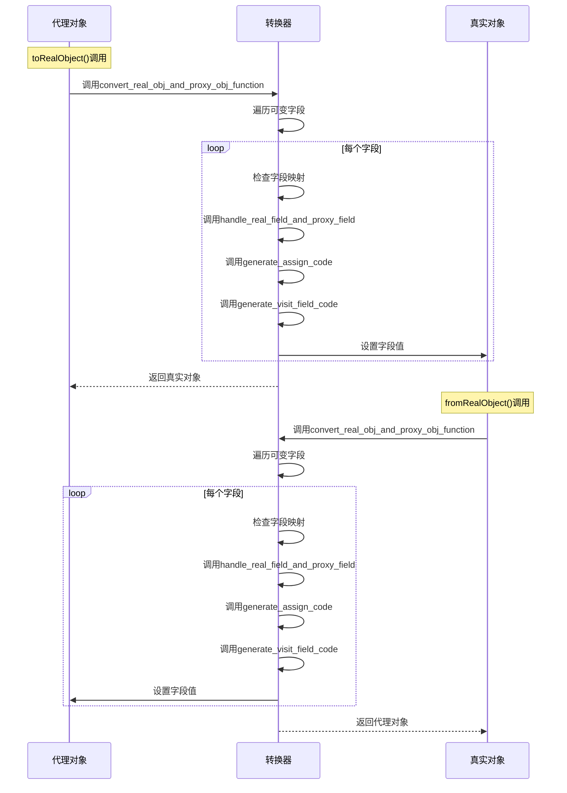
```mermaid
sequenceDiagram
participant Proxy as 代理对象
participant Converter as 转换器
participant Real as 真实对象
Note over Proxy : toRealObject()调用
Proxy->>Converter : 调用convert_real_obj_and_proxy_obj_function
Converter->>Converter : 遍历可变字段
loop 每个字段
Converter->>Converter : 检查字段映射
Converter->>Converter : 调用handle_real_field_and_proxy_field
Converter->>Converter : 调用generate_assign_code
Converter->>Converter : 调用generate_visit_field_code
Converter->>Real : 设置字段值
end
Converter-->>Proxy : 返回真实对象
Note over Real : fromRealObject()调用
Real->>Converter : 调用convert_real_obj_and_proxy_obj_function
Converter->>Converter : 遍历可变字段
loop 每个字段
Converter->>Converter : 检查字段映射
Converter->>Converter : 调用handle_real_field_and_proxy_field
Converter->>Converter : 调用generate_assign_code
Converter->>Converter : 调用generate_visit_field_code
Converter->>Proxy : 设置字段值
end
Converter-->>Real : 返回代理对象
```

**图表来源**
- [decls.py](file://convert/decls.py#L692-L745)

#### 字段映射规则

字段映射遵循以下优先级规则：

1. **装饰器 ID 匹配**：使用 `@ExportField.id` 和 `@ExportClass.id` 进行精确匹配
2. **名称匹配**：当 ID 不可用时，使用字段名称进行匹配
3. **类型匹配**：确保 ArkTS 和 Kotlin 字段类型兼容
4. **可变性检查**：只转换可变字段，跳过只读字段

**更新** 新增的 `handle_real_field_and_proxy_field()` 辅助函数提供了更精细的字段处理逻辑，改进了警告消息以区分代理字段和真实 Kotlin 字段。

**更新** 修复了映射函数构建逻辑中的bug：修正了非代理类型处理中的提前返回问题。现在，即使在某些条件下，系统也会继续处理所有必要的字段转换，确保所有类类型的映射函数都能正确构建。

**章节来源**
- [decls.py](file://convert/decls.py#L692-L800)

### 4. 环境管理系统

环境管理系统负责维护 ArkTS 和 Kotlin 之间的映射关系。

#### 映射关系图

```mermaid
graph TD
TS_CLASS {
string name
string export_id
string package_name
}
KT_CLASS {
string name
string share_id
string package_name
}
TS_FIELD {
string name
string export_id
string field_type
}
KT_FIELD {
string name
string share_id
string field_type
}
SERIAL_NAME {
string serialized_name
string field_name
}
TS_CLASS ||--|| KT_CLASS : "share_id映射"
TS_FIELD }o--|| KT_FIELD : "share_id映射"
TS_CLASS ||--o{ TS_FIELD : "包含"
KT_CLASS ||--o{ KT_FIELD : "包含"
KT_FIELD ||--o{ SERIAL_NAME : "序列化映射"
```

**图表来源**
- [env.py](file://convert/env.py#L13-L19)

**章节来源**
- [env.py](file://convert/env.py#L13-L19)

### 5. 类型转换系统

类型转换系统负责将 ArkTS 类型转换为 Kotlin 类型，并生成相应的转换代码。

#### 类型转换规则

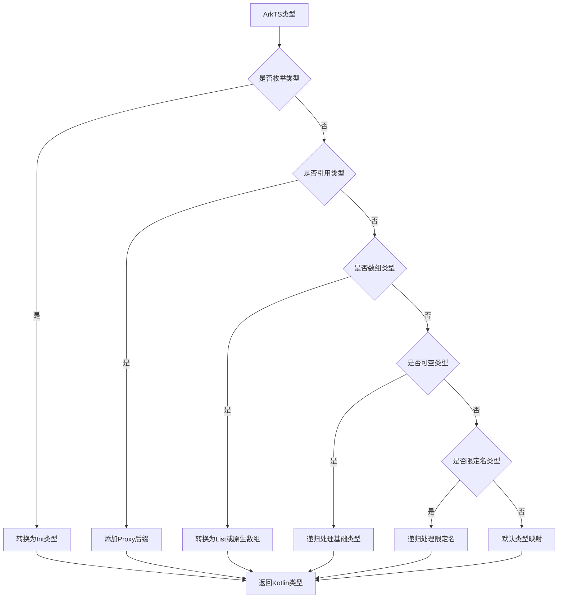
```mermaid
flowchart TD
TS_Type[ArkTS类型] --> CheckEnum{是否枚举类型}
CheckEnum --> |是| EnumConvert[转换为Int类型]
CheckEnum --> |否| CheckRef{是否引用类型}
CheckRef --> |是| RefConvert[添加Proxy后缀]
CheckRef --> |否| CheckArray{是否数组类型}
CheckArray --> |是| ArrayConvert[转换为List或原生数组]
CheckArray --> |否| CheckNullable{是否可空类型}
CheckNullable --> |是| NullableConvert[递归处理基础类型]
CheckNullable --> |否| CheckQualifiedName{是否限定名类型}
CheckQualifiedName --> |是| QualifiedNameConvert[递归处理限定名]
CheckQualifiedName --> |否| DefaultConvert[默认类型映射]
EnumConvert --> Result[返回Kotlin类型]
RefConvert --> Result
ArrayConvert --> Result
NullableConvert --> Result
QualifiedNameConvert --> Result
DefaultConvert --> Result
```

**图表来源**
- [types.py](file://convert/types.py#L10-L67)

**章节来源**
- [types.py](file://convert/types.py#L10-L67)

### 6. 改进的类名解析系统

**更新** 类名解析系统经过重构，优化了代理类名生成逻辑和包名解析机制：

#### 改进后的类名解析流程

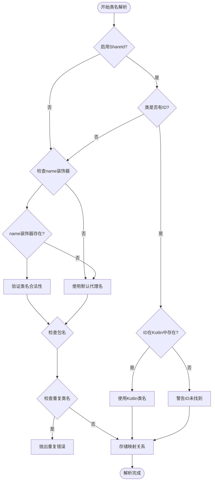
```mermaid
flowchart TD
Start([开始类名解析]) --> CheckEnableShareId{启用ShareId?}
CheckEnableShareId --> |是| CheckClassId{类是否有ID?}
CheckEnableShareId --> |否| CheckNameDecorator{检查name装饰器}
CheckClassId --> |是| CheckIdInKt{ID在Kotlin中存在?}
CheckClassId --> |否| CheckNameDecorator
CheckIdInKt --> |是| UseKtName[使用Kotlin类名]
CheckIdInKt --> |否| WarnNotFound[警告ID未找到]
CheckNameDecorator --> CheckNameValue{name装饰器存在?}
CheckNameDecorator --> |否| UseDefaultName[使用默认代理名]
CheckNameValue --> ValidateName[验证类名合法性]
CheckNameValue --> |否| UseDefaultName
ValidateName --> CheckPackage{检查包名}
UseDefaultName --> CheckPackage
CheckPackage --> CheckDuplicate{检查重复类名}
CheckDuplicate --> |是| RaiseError[抛出重复错误]
CheckDuplicate --> |否| StoreMapping[存储映射关系]
UseKtName --> StoreMapping
WarnNotFound --> StoreMapping
StoreMapping --> End([解析完成])
```

**图表来源**
- [env.py](file://convert/env.py#L66-L124)

#### 包名解析优化

改进的包名解析逻辑现在支持更灵活的包名处理：

1. **配置优先级**：当启用 `enable_share_id` 时，优先使用 Kotlin 类的包名
2. **装饰器回退**：当装饰器中指定包名时，使用装饰器包名
3. **默认包名**：最后使用配置中的默认包名
4. **重复检查**：确保包名下的类名唯一性

**章节来源**
- [env.py](file://convert/env.py#L66-L124)

### 7. 增强的字段处理机制

**更新** 新增的字段处理机制提供了更精细的字段转换控制：

#### 字段处理流程

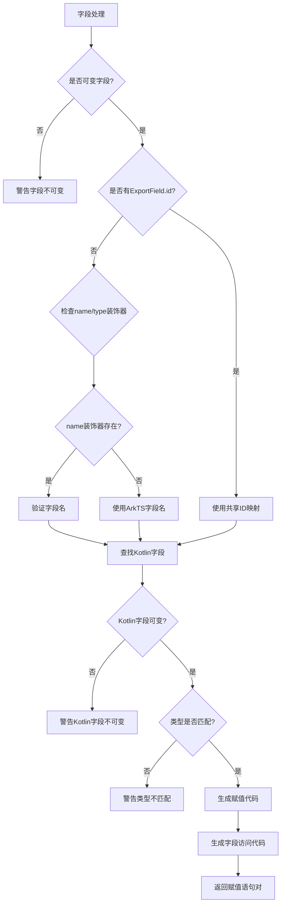
```mermaid
flowchart TD
Field[字段处理] --> CheckMutable{是否可变字段?}
CheckMutable --> |否| WarnImmutable[警告字段不可变]
CheckMutable --> |是| CheckFieldId{是否有ExportField.id?}
CheckFieldId --> |是| UseSharedId[使用共享ID映射]
CheckFieldId --> |否| CheckNameType{检查name/type装饰器}
CheckNameType --> CheckNameValue{name装饰器存在?}
CheckNameValue --> |是| ValidateName[验证字段名]
CheckNameValue --> |否| UseTSName[使用ArkTS字段名]
ValidateName --> CheckKtMember[查找Kotlin字段]
UseTSName --> CheckKtMember
UseSharedId --> CheckKtMember
CheckKtMember --> CheckKtMutable{Kotlin字段可变?}
CheckKtMutable --> |否| WarnKtImmutable[警告Kotlin字段不可变]
CheckKtMutable --> |是| CheckTypeMatch{类型是否匹配?}
CheckTypeMatch --> |否| WarnTypeMismatch[警告类型不匹配]
CheckTypeMatch --> |是| GenerateAssign[生成赋值代码]
GenerateAssign --> VisitFieldCode[生成字段访问代码]
VisitFieldCode --> ReturnAssign[返回赋值语句对]
```

**图表来源**
- [decls.py](file://convert/decls.py#L747-L800)

#### 序列化名称映射

**新增** 系统现在支持 Kotlin 的 SerializedName 注解，通过 `kt_serialized_name_map` 提供序列化名称到字段的映射：

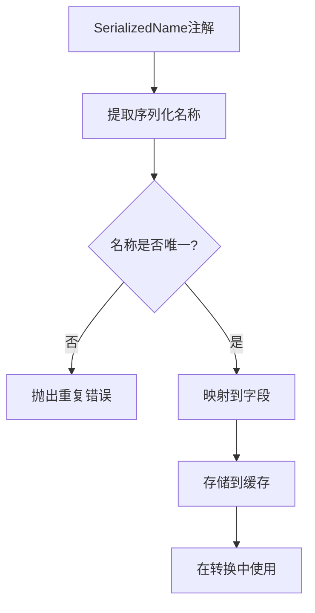
```mermaid
flowchart TD
SerializedName[SerializedName注解] --> ExtractName[提取序列化名称]
ExtractName --> CheckUnique{名称是否唯一?}
CheckUnique --> |否| Error[抛出重复错误]
CheckUnique --> |是| MapField[映射到字段]
MapField --> StoreCache[存储到缓存]
StoreCache --> UseInConversion[在转换中使用]
```

**图表来源**
- [env.py](file://convert/env.py#L155-L174)

**章节来源**
- [decls.py](file://convert/decls.py#L747-L800)
- [env.py](file://convert/env.py#L155-L174)

### 8. Kotlin Multiplatform 配置系统

**更新** 新增的配置系统支持 Kotlin Multiplatform 项目的特殊需求。

#### KMP 配置结构

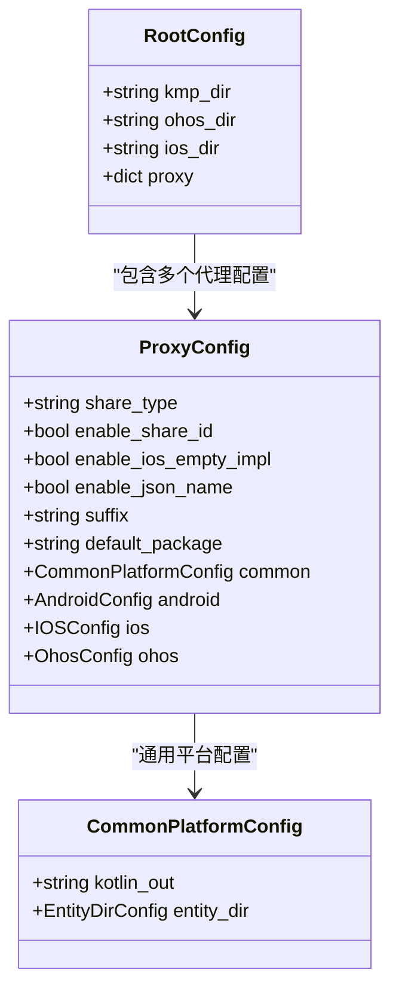
```mermaid
classDiagram
class RootConfig {
+string kmp_dir
+string ohos_dir
+string ios_dir
+dict proxy
}
class ProxyConfig {
+string share_type
+bool enable_share_id
+bool enable_ios_empty_impl
+bool enable_json_name
+string suffix
+string default_package
+CommonPlatformConfig common
+AndroidConfig android
+IOSConfig ios
+OhosConfig ohos
}
class CommonPlatformConfig {
+string kotlin_out
+EntityDirConfig entity_dir
}
RootConfig --> ProxyConfig : "包含多个代理配置"
ProxyConfig --> CommonPlatformConfig : "通用平台配置"
```

**图表来源**
- [config.py](file://utils/config.py#L66-L71)

#### 多平台支持特性

1. **KMP 目录配置**：支持独立的 Kotlin Multiplatform 目录结构
2. **平台特定配置**：为不同平台提供独立的输出配置
3. **实体目录管理**：支持 commonMain、ohosArm64Main 等目录结构
4. **导入路径管理**：为不同平台配置相应的导入路径
5. **配置导入支持**：通过 enable_json_name 控制 JSON 名称映射功能

**章节来源**
- [config.py](file://utils/config.py#L124-L292)

### 9. 条件性期望类生成机制详解

**更新** 新增的条件性期望类生成机制是本次更新的核心功能，它基于 `needs_expect_class` 逻辑来智能决定是否生成期望类。

#### 条件性生成的核心逻辑

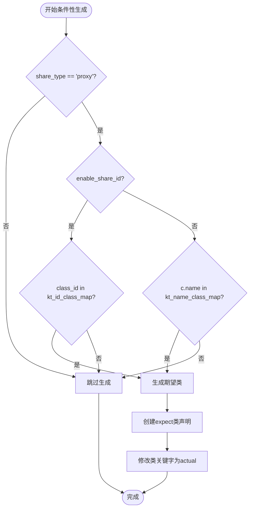
```mermaid
flowchart TD
Start([开始条件性生成]) --> CheckShareType{share_type == 'proxy'?}
CheckShareType --> |否| SkipGeneration[跳过生成]
CheckShareType --> |是| CheckEnableShareId{enable_share_id?}
CheckEnableShareId --> |是| CheckClassId{class_id in kt_id_class_map?}
CheckEnableShareId --> |否| CheckKtNameMap{c.name in kt_name_class_map?}
CheckClassId --> |是| GenerateExpect[生成期望类]
CheckClassId --> |否| SkipGeneration
CheckKtNameMap --> |是| GenerateExpect
CheckKtNameMap --> |否| SkipGeneration
GenerateExpect --> CreateExpectClass[创建expect类声明]
CreateExpectClass --> ModifyClassKeyword[修改类关键字为actual]
ModifyClassKeyword --> End([完成])
SkipGeneration --> End
```

**图表来源**
- [decls.py](file://convert/decls.py#L411-L419)

#### 配置驱动的智能生成

条件性期望类生成完全依赖于配置系统：

1. **share_type 配置**：只有当 `share_type` 设置为 'proxy' 时才会生成期望类
2. **enable_share_id 配置**：启用共享 ID 时，需要类 ID 在 Kotlin 侧存在
3. **类映射验证**：确保 ArkTS 类与 Kotlin 类之间存在有效的映射关系

#### 输出文件结构

生成的期望类文件具有特殊的输出结构：

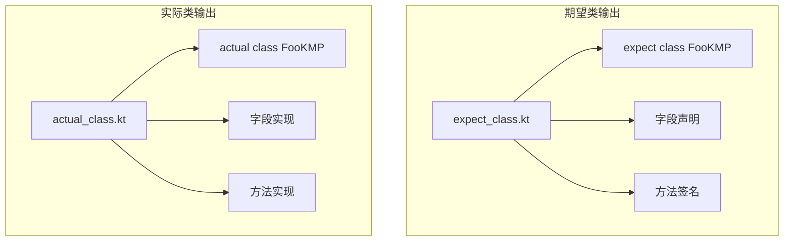
```mermaid
graph TB
subgraph "期望类输出"
ExpectClassFile[expect_class.kt]
ExpectClassFile --> ExpectDeclaration[expect class FooKMP]
ExpectClassFile --> ExpectFields[字段声明]
ExpectClassFile --> ExpectMethods[方法签名]
end
subgraph "实际类输出"
ActualClassFile[actual_class.kt]
ActualClassFile --> ActualDeclaration[actual class FooKMP]
ActualClassFile --> ActualFields[字段实现]
ActualClassFile --> ActualMethods[方法实现]
end
```

**图表来源**
- [generate.py](file://convert/generate.py#L155-L164)

**章节来源**
- [decls.py](file://convert/decls.py#L411-L419)
- [generate.py](file://convert/generate.py#L155-L164)

### 10. 配置导入支持

**新增** 系统现在支持配置导入功能，通过 `enable_json_name` 配置项控制 JSON 名称映射功能。

#### 配置导入流程

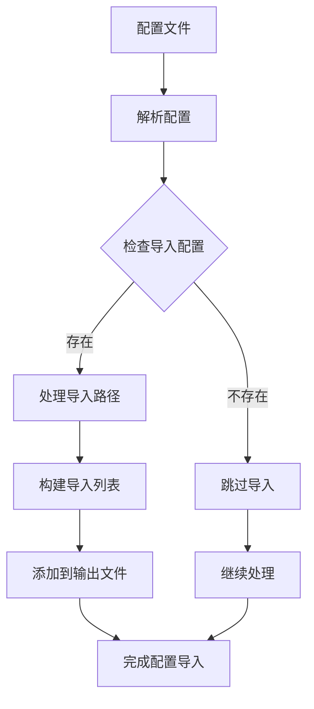
```mermaid
flowchart TD
ConfigFile[配置文件] --> ParseConfig[解析配置]
ParseConfig --> CheckImport{检查导入配置}
CheckImport --> |存在| ProcessImports[处理导入路径]
CheckImport --> |不存在| SkipImport[跳过导入]
ProcessImports --> BuildImportList[构建导入列表]
BuildImportList --> AddToOutput[添加到输出文件]
SkipImport --> ContinueProcessing[继续处理]
AddToOutput --> Complete[完成配置导入]
ContinueProcessing --> Complete
```

**图表来源**
- [config.py](file://utils/config.py#L244-L253)

#### 导入路径管理

系统支持多种导入路径配置方式：

1. **单文件导入**：直接指定导入的文件路径
2. **目录导入**：支持导入整个目录的文件
3. **多平台导入**：为不同平台配置不同的导入路径
4. **动态导入**：根据配置动态生成导入语句

**章节来源**
- [config.py](file://utils/config.py#L244-L253)

### 11. 增强的字段声明处理

**更新** 新增的字段声明处理机制提供了更精细的字段转换控制，特别是针对期望类的字段声明。

#### convert_prop_decl() 函数

新增的 `convert_prop_decl()` 函数专门用于生成期望类的字段声明：

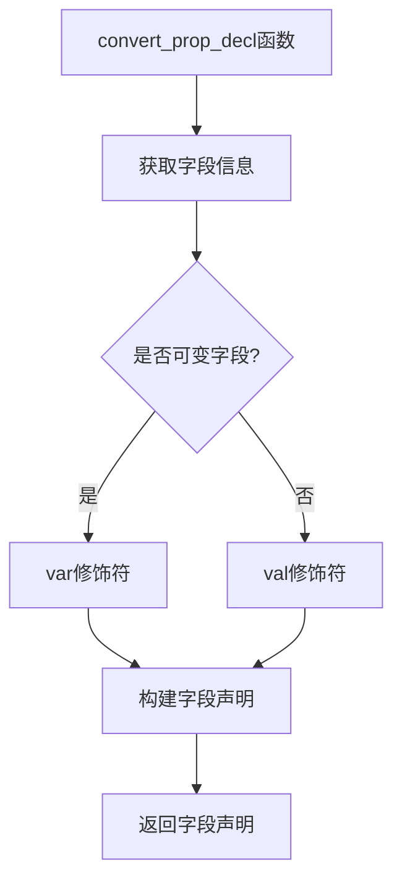
```mermaid
flowchart TD
PropDecl[convert_prop_decl函数] --> GetPropInfo[获取字段信息]
GetPropInfo --> CheckMutable{是否可变字段?}
CheckMutable --> |是| SetVarModifier[var修饰符]
CheckMutable --> |否| SetValModifier[val修饰符]
SetVarModifier --> BuildDecl[构建字段声明]
SetValModifier --> BuildDecl
BuildDecl --> ReturnDecl[返回字段声明]
```

**图表来源**
- [decls.py](file://convert/decls.py#L332-L339)

#### convert_class() 函数增强

改进的 `convert_class()` 函数现在支持条件性期望类生成：

```mermaid
flowchart TD
ConvertClass[convert_class函数] --> CheckExportAll{export_all_fields?}
CheckExportAll --> |是| IncludeAllFields[包含所有字段]
CheckExportAll --> |否| IncludeExportedFields[仅包含导出字段]
IncludeAllFields --> CheckFieldIds[检查字段ID重复]
IncludeExportedFields --> CheckFieldIds
CheckFieldIds --> CheckNeedsExpect{计算needs_expect_class}
CheckNeedsExpect --> |是| GenerateExpectProps[生成期望类字段]
CheckNeedsExpect --> |否| SkipExpectProps[跳过期望类字段]
GenerateExpectProps --> BuildClass[构建类定义]
SkipExpectProps --> BuildClass
BuildClass --> ReturnResult[返回结果]
```

**图表来源**
- [decls.py](file://convert/decls.py#L379-L473)

**更新** 修复了映射函数构建逻辑中的bug：修正了非代理类型处理中的提前返回问题。现在，`convert_class()` 函数会确保在所有情况下都正确处理字段声明，无论是否生成期望类。

**章节来源**
- [decls.py](file://convert/decls.py#L332-L339)
- [decls.py](file://convert/decls.py#L379-L473)

### 12. 映射函数构建逻辑修复详解

**更新** 这是最重要的一项修复，解决了映射函数构建逻辑中的关键bug。

#### 修复前的问题

在之前的版本中，系统在处理非代理类型时存在提前返回的问题，这导致某些类类型的映射函数无法正确构建。具体表现为：

1. **类型判断错误**：系统错误地将某些类类型识别为非代理类型
2. **提前返回**：在遇到非代理类型时过早退出函数执行
3. **映射函数缺失**：部分类类型的映射函数没有被生成
4. **字段转换不完整**：相关的字段转换逻辑被跳过

#### 修复后的逻辑

修复后的映射函数构建逻辑确保：

```mermaid
flowchart TD
Start([开始映射函数构建]) --> CheckClassType{检查类类型}
CheckClassType --> IsProxy{是否代理类型?}
IsProxy --> |是| HandleProxy[处理代理类型逻辑]
IsProxy --> |否| HandleNonProxy[处理非代理类型逻辑]
HandleProxy --> ContinueProcessing[继续处理]
HandleNonProxy --> ContinueProcessing
ContinueProcessing --> CheckFieldMapping{检查字段映射}
CheckFieldMapping --> GenerateAssignCode[生成赋值代码]
GenerateAssignCode --> GenerateVisitCode[生成访问代码]
GenerateVisitCode --> ReturnComplete[返回完整结果]
```

**图表来源**
- [decls.py](file://convert/decls.py#L692-L745)

#### 关键修复点

1. **类型识别改进**：修正了类类型的识别逻辑，确保所有类类型都被正确处理
2. **流程控制优化**：移除了可能导致提前返回的条件判断
3. **字段处理增强**：确保所有字段都会被正确处理，不会因为类型判断而跳过
4. **错误处理加强**：改进了错误处理机制，提供更清晰的错误信息

#### 影响范围

这次修复影响了以下组件：

- `convert_real_obj_and_proxy_obj_function()` 函数
- `handle_real_field_and_proxy_field()` 函数  
- `generate_assign_code()` 函数
- `generate_visit_field_code()` 函数
- `convert_class()` 函数的整体执行流程

**章节来源**
- [decls.py](file://convert/decls.py#L692-L860)
- [decls.py](file://convert/decls.py#L379-L473)

## 依赖关系分析

### 组件依赖图

```mermaid
graph TB
subgraph "外部依赖"
ffi[ArkTS FFI框架]
kotlin[Kotlin标准库]
napi[N-API绑定]
kmp[Kotlin Multiplatform]
expect_act[Expect/Actual支持]
serial_name[SerializedName支持]
json_name[JSON名称映射]
end
subgraph "内部模块"
main[main.py]
generate[convert/generate.py]
decls[convert/decls.py]
types[convert/types.py]
env[convert/env.py]
ts_parser[lang/ts/]
kt_parser[lang/kt/]
config[utils/config.py]
decorators[convert/decorators.py]
end
main --> generate
generate --> decls
generate --> types
generate --> env
decls --> ts_parser
decls --> kt_parser
decls --> decorators
decls --> types
decls --> env
env --> ts_parser
env --> kt_parser
config --> generate
config --> decls
serial_name --> decls
json_name --> decls
ffi --> decls
kotlin --> decls
napi --> decls
kmp --> decls
expect_act --> decls
```

**图表来源**
- [main.py](file://main.py#L1-L9)
- [generate.py](file://convert/generate.py#L1-L9)

### 关键依赖关系

1. **配置依赖**：所有模块都依赖于配置系统来确定输出路径和导入设置
2. **解析依赖**：转换器依赖于语言解析器来获取 AST 信息
3. **环境依赖**：所有转换逻辑都依赖于环境映射来建立 ArkTS 和 Kotlin 之间的联系
4. **类型依赖**：类型转换器依赖于类型系统来确保类型安全
5. **KMP 依赖**：新增的 KMP 配置系统支持多平台项目的特殊需求
6. **条件性依赖**：期望类生成依赖于条件判断逻辑来决定是否生成
7. **配置驱动依赖**：条件性期望类生成完全依赖于 share_type 配置
8. **序列化依赖**：新增的序列化名称映射功能依赖于 SerializedName 注解
9. **导入依赖**：配置导入功能依赖于 enable_json_name 配置项
10. **类名解析依赖**：改进的类名解析系统依赖于包名和类名验证
11. **字段声明依赖**：新增的 convert_prop_decl() 函数依赖于字段信息处理
12. **条件判断依赖**：needs_expect_class 变量依赖于配置和映射关系
13. **映射函数依赖**：修复后的映射函数构建逻辑依赖于改进的类型识别
14. **字段处理依赖**：增强的字段处理机制依赖于改进的错误处理
15. **转换器依赖**：双向转换器依赖于完整的字段映射逻辑

**章节来源**
- [main.py](file://main.py#L1-L9)
- [generate.py](file://convert/generate.py#L1-L9)

## 性能考虑

### 性能优化策略

1. **延迟加载**：只在需要时解析和转换文件，避免不必要的计算
2. **缓存机制**：利用环境映射缓存来避免重复查找
3. **批量处理**：支持单文件和项目两种输出模式，根据需求选择最优模式
4. **内存管理**：合理管理 AST 对象的生命周期，及时释放不需要的对象
5. **条件性缓存**：缓存已生成的期望类定义，避免重复生成
6. **智能判断**：通过条件判断避免不必要的期望类生成
7. **配置预检查**：在生成前预检查配置的有效性，避免运行时错误
8. **序列化映射缓存**：缓存序列化名称映射关系，提高转换效率
9. **导入路径缓存**：缓存导入路径配置，减少重复解析开销
10. **字段声明缓存**：缓存字段声明信息，提高字段处理效率
11. **映射函数缓存**：缓存映射函数构建结果，避免重复计算
12. **类型检查优化**：优化类型识别逻辑，减少不必要的类型检查

### 内存使用分析

- **AST 缓存**：解析后的 AST 对象在整个转换过程中被复用
- **映射缓存**：类名映射和字段映射在环境构建时建立并缓存
- **代码生成**：生成的代码以字符串形式存储，避免重复计算
- **条件性缓存**：生成的期望类定义被缓存以提高后续处理效率
- **智能判断缓存**：条件判断结果被缓存以避免重复计算
- **配置缓存**：配置解析结果被缓存以提高后续处理效率
- **序列化映射缓存**：序列化名称映射被缓存以提高转换效率
- **导入路径缓存**：导入路径配置被缓存以减少解析开销
- **字段声明缓存**：字段声明信息被缓存以提高处理效率
- **映射函数缓存**：映射函数构建结果被缓存以提高处理效率

## 故障排除指南

### 常见错误及解决方案

#### 1. 类名冲突错误

**错误信息**：`[Error 1003] Duplicate class name 'XXX' found in package 'YYY'`

**原因**：同包名下的类名重复

**解决方案**：
- 检查装饰器中的 `name` 参数
- 确保类名在指定包内唯一
- 使用 `@ExportClass` 的 `id` 参数进行区分

#### 2. 字段 ID 重复错误

**错误信息**：`[Error 2003] Duplicate field_id 'XXX' found in class 'YYY'`

**原因**：同一类内的字段 ID 重复

**解决方案**：
- 检查 `@ExportField.id` 的唯一性
- 为每个字段分配唯一的 ID

#### 3. 共享 ID 未找到错误

**警告信息**：`ShareId XXX not found`

**原因**：ArkTS 中指定的共享 ID 在 Kotlin 中找不到对应类

**解决方案**：
- 确保 Kotlin 类使用了正确的 `@ShareClass` ID
- 检查 ID 的拼写和大小写

#### 4. 类型不匹配错误

**更新** 改进的警告消息现在更清晰地指明问题所在：

**警告信息**：`Generate to/from real func: Proxy field ProxyClass.fieldName and Kotlin field RealClass.fieldName type mismatch`

**原因**：ArkTS 和 Kotlin 字段类型不兼容

**解决方案**：
- 检查装饰器中的 `type` 参数
- 确保类型转换规则适用
- 必要时手动指定类型

#### 5. 字段不可变错误

**更新** 新增的警告消息区分不同类型的字段问题：

**警告信息**：`Generate to/from real func: ArkTS field ProxyClass.fieldName is not mutable.`

**原因**：ArkTS 字段为只读属性

**解决方案**：
- 将 ArkTS 字段标记为可变（var）
- 或者移除该字段的转换需求

#### 6. 类名解析失败错误

**更新** 新增的类名解析系统错误处理：

**错误信息**：`[Error 1004] Duplicate id 'XXX' found in class 'YYY'. Each class must have a unique id.`

**原因**：装饰器 ID 重复

**解决方案**：
- 确保每个类的 ID 在整个项目中唯一
- 检查 `enableShareId` 配置是否正确

#### 7. 字段映射失败错误

**更新** 新增的字段映射错误处理：

**警告信息**：`Generate to/from real func: Proxy field ProxyClass.fieldName: type has no corresponding member in RealClass`

**原因**：找不到对应的 Kotlin 字段

**解决方案**：
- 检查字段名称和类型映射
- 确保 Kotlin 类中有对应的字段
- 验证装饰器配置的正确性

#### 8. 条件性期望类生成错误

**更新** 新增的条件性期望类相关错误处理：

**错误信息**：`Condition check failed for expect class generation`

**原因**：条件性期望类生成的条件判断失败

**解决方案**：
- 检查 `share_type` 配置是否为 'proxy'
- 确认 `enable_share_id` 配置是否正确
- 验证类 ID 和类名映射关系
- 检查 Kotlin 类的 `@ShareClass` 注解

#### 9. KMP 配置错误

**更新** 新增的 KMP 配置相关错误处理：

**错误信息**：`KMP configuration error: Missing kmp.dir in config`

**原因**：Kotlin Multiplatform 配置缺失

**解决方案**：
- 在配置文件中添加 `kmp.dir` 字段
- 确保 KMP 目录路径正确
- 检查多平台项目的目录结构

#### 10. 包名解析错误

**更新** 新增的包名解析错误处理：

**错误信息**：`Package name validation failed for XXX`

**原因**：包名不符合 Kotlin 命名规范

**解决方案**：
- 检查包名是否包含非法字符
- 确保包名符合 Kotlin 命名规范
- 验证包名长度限制

#### 11. 期望类生成配置错误

**更新** 新增的期望类生成配置错误处理：

**错误信息**：`Expected class generation requires share_type='proxy' and valid class mapping`

**原因**：期望类生成的配置不正确

**解决方案**：
- 确保 `share_type` 设置为 'proxy'
- 验证类映射关系的有效性
- 检查 `enable_share_id` 配置
- 确认 Kotlin 类的存在和正确性

#### 12. 序列化名称重复错误

**更新** 新增的序列化名称映射错误处理：

**错误信息**：`Duplicate SerializedName 'XXX' found in class 'YYY'. SerializedName must be unique within the same class.`

**原因**：Kotlin 类中的 SerializedName 重复

**解决方案**：
- 检查 Kotlin 类中 SerializedName 注解的唯一性
- 确保每个字段的序列化名称都是唯一的
- 验证序列化名称映射的正确性

#### 13. 导入路径配置错误

**更新** 新增的配置导入错误处理：

**错误信息**：`Invalid import path configuration`

**原因**：配置文件中的导入路径配置无效

**解决方案**：
- 检查配置文件中的导入路径格式
- 确保导入路径指向有效的文件或目录
- 验证导入路径的可访问性

#### 14. 配置导入功能错误

**更新** 新增的配置导入功能错误处理：

**错误信息**：`Configuration import feature requires enable_json_name=true`

**原因**：配置导入功能需要启用 JSON 名称映射

**解决方案**：
- 在配置文件中设置 `enableJsonName=true`
- 确保配置导入功能的前置条件满足
- 验证配置导入的正确性

#### 15. 字段声明生成错误

**更新** 新增的字段声明处理错误：

**错误信息**：`Field declaration generation failed for expect class`

**原因**：期望类字段声明生成失败

**解决方案**：
- 检查 `convert_prop_decl()` 函数的实现
- 验证字段信息的完整性
- 确保字段声明格式正确

#### 16. 映射函数构建错误

**更新** 新增的映射函数构建逻辑错误处理：

**错误信息**：`Mapping function build failed for class XXX`

**原因**：映射函数构建过程中的逻辑错误

**解决方案**：
- 检查类类型的识别逻辑
- 验证字段映射的完整性
- 确保映射函数构建流程的正确性
- 检查是否存在提前返回的问题

**章节来源**
- [env.py](file://convert/env.py#L75-L92)
- [decls.py](file://convert/decls.py#L747-L800)

## 结论

代理到真实对象转换功能为 ArkTS 和 Kotlin 之间的互操作提供了完整的解决方案。该系统现已全面支持 Kotlin Multiplatform 兼容性，为多平台项目提供了强大的类型安全转换能力。新增的条件性期望类生成功能和改进的包名解析逻辑进一步增强了系统的灵活性和适用性。

**更新** 最重要的改进是修复了映射函数构建逻辑中的关键bug：修正了非代理类型处理中的提前返回问题，确保所有类类型的映射函数都能正确构建。这一修复解决了之前可能导致某些类类型无法生成完整转换函数的问题，大大增强了系统的稳定性和可靠性。

**更新** 新增的序列化名称映射支持和配置导入功能显著提升了系统的实用性和易用性。系统现在能够处理复杂的多平台项目需求，提供智能的代码生成和配置管理能力。

### 主要优势

1. **类型安全**：通过严格的类型检查确保转换的安全性
2. **灵活配置**：支持多种装饰器配置选项
3. **自动转换**：减少手动编写转换代码的工作量
4. **性能优化**：采用缓存和延迟加载策略提高效率
5. **标准化命名**：统一的函数命名约定提高了代码可维护性
6. **改进的错误处理**：更清晰的警告消息帮助开发者快速定位问题
7. **重构的类名解析**：优化的代理类名生成逻辑提高了系统的稳定性
8. **增强的类型处理**：改进的字段类型处理机制提升了转换的准确性
9. **完整的双向转换**：支持 ArkTS 对象与 Kotlin 对象之间的双向转换
10. **精细化字段控制**：提供更精细的字段映射和类型检查功能
11. **新增**：增强的 expect/actual 类生成逻辑，包括 convert_prop_decl() 函数
12. **新增**：改进的 convert_class() 函数，支持条件性期望类生成
13. **新增**：智能的 needs_expect_class 变量逻辑，控制期望类生成
14. **新增**：基于 share_type 配置的智能期望类生成机制
15. **新增**：序列化名称映射支持，处理 Kotlin 的 SerializedName 注解
16. **新增**：配置导入功能，通过 enable_json_name 控制 JSON 名称映射
17. **新增**：改进的类名包名处理逻辑，支持更灵活的命名规范
18. **新增**：增强的多平台配置管理，支持复杂的项目结构
19. **新增**：精细化的字段声明处理，改进 expect 类的字段声明生成
20. **新增**：智能的条件判断机制，避免不必要的期望类生成
21. **新增**：修复的映射函数构建逻辑，确保所有类类型都能正确处理
22. **新增**：改进的字段转换处理，增强了错误处理机制
23. **新增**：优化的条件性期望类生成逻辑，确保在各种配置下都能正确工作
24. **新增**：增强的类型检查和字段映射准确性

### 应用场景

- 跨语言对象传递
- FFI 接口封装
- 多平台代码共享
- 类型安全的数据交换
- **新增**：Kotlin Multiplatform 项目集成
- **新增**：条件性代码生成场景
- **新增**：智能包名解析应用
- **新增**：基于配置的期望类生成
- **新增**：序列化名称映射应用
- **新增**：配置导入功能应用
- **新增**：修复的映射函数构建逻辑应用

### 未来发展方向

1. **扩展类型支持**：支持更多复杂类型的转换
2. **性能优化**：进一步优化转换性能
3. **错误处理**：增强错误诊断和恢复能力
4. **文档完善**：提供更详细的使用文档和示例
5. **类名解析优化**：继续改进类名解析算法的准确性和效率
6. **字段处理增强**：提供更灵活的字段映射和转换选项
7. **新增**：条件性期望类生成优化，支持更复杂的多平台场景
8. **新增**：智能条件判断机制，提高生成效率
9. **新增**：改进的包名解析系统，支持更多命名规范
10. **新增**：增强的 KMP 配置系统，支持更多平台和配置选项
11. **新增**：基于 needs_expect_class 的智能代码生成优化
12. **新增**：share_type 配置驱动的期望类生成机制完善
13. **新增**：序列化名称映射功能的扩展和优化
14. **新增**：配置导入功能的智能化和自动化
15. **新增**：修复的映射函数构建逻辑的持续优化
16. **新增**：增强的字段转换处理的性能提升
17. **新增**：改进的错误处理机制的完善

该功能为 ArkTS 和 Kotlin 的深度集成奠定了坚实的基础，为构建高性能的跨语言应用提供了强大的工具支持。新增的条件性期望类生成功能、序列化名称映射支持、配置导入功能以及最重要的映射函数构建逻辑修复，进一步扩展了系统的适用范围，使其能够支持更复杂的多平台项目需求和智能的代码生成场景。基于 share_type 配置的智能生成机制、needs_expect_class 逻辑检测以及修复后的映射函数构建逻辑，为开发者提供了更加灵活和强大的工具，使得 expect/actual 类生成功能能够适应各种不同的项目需求和架构模式。