# 环境管理系统增强

<cite>
**本文档引用的文件**
- [main.py](file://main.py)
- [env.py](file://convert/env.py)
- [generate.py](file://convert/generate.py)
- [types.py](file://convert/types.py)
- [config.py](file://utils/config.py)
- [cmd_args.py](file://utils/cmd_args.py)
- [check.py](file://convert/check.py)
- [decls.py](file://convert/decls.py)
- [kt_decls.py](file://lang/kt/kt_decls.py)
- [decorators.py](file://convert/decorators.py)
- [pretty.py](file://convert/pretty.py)
- [file.py](file://utils/file.py)
- [kt_types.py](file://lang/kt/kt_types.py)
- [ts_types.py](file://lang/ts/ts_types.py)
- [config.json](file://test/config.json)
- [class0.kt](file://test/cases/kt/class0.kt)
- [class1.kt](file://test/cases/kt/class1.kt)
- [class2.kt](file://test/cases/kt/class2.kt)
- [class3.kt](file://test/cases/kt/class3.kt)
- [class0.ts](file://test/cases/class0.ts)
- [class1.ts](file://test/cases/class1.ts)
- [class10.ts](file://test/cases/class10.ts)
- [class11.ts](file://test/cases/class11.ts)
- [class12.ts](file://test/cases/class12.ts)
</cite>

## 更新摘要
**变更内容**
- **新增：build_arkts_deco_rename_map() 函数，处理 ArkTS 装饰器指定的类重命名映射，支持 name 和 package 装饰器参数**
- **更新：改进默认包名处理逻辑，在 ArkTS 装饰器映射中自动使用 default_package 配置**
- **更新：新增错误代码 [Error 1002] 和 [Error 1003] 的验证机制，专门用于包名和类名验证**
- **更新：增强 get_kt_proxy_class_and_package_name() 函数，支持 ArkTS 装饰器映射的优先级处理**
- **更新：重构 _get_kt_class_rename_map_by_default() 函数，增加默认包名验证和错误处理**
- **更新：改进包名解析与智能包名选择机制，新增 ArkTS 装饰器映射的早期返回条件**

## 目录
1. [简介](#简介)
2. [项目结构](#项目结构)
3. [核心组件](#核心组件)
4. [架构概览](#架构概览)
5. [详细组件分析](#详细组件分析)
6. [环境管理系统架构](#环境管理系统架构)
7. [代理配置系统增强](#代理配置系统增强)
8. [多包独立环境管理](#多包独立环境管理)
9. [包名解析与智能包名选择](#包名解析与智能包名选择)
10. [默认包名处理机制](#默认包名处理机制)
11. [ArkTS 装饰器映射系统](#arkts-装饰器映射系统)
12. [序列化名称映射功能增强](#序列化名称映射功能增强)
13. [依赖关系分析](#依赖关系分析)
14. [性能考虑](#性能考虑)
15. [故障排除指南](#故障排除指南)
16. [结论](#结论)

## 简介

环境管理系统增强是一个专门用于ArkTS与Kotlin之间FFI（Foreign Function Interface）转换的工具系统。该项目通过解析ArkTS声明文件和Kotlin源文件，自动生成相应的Kotlin包装器，实现跨语言的函数调用和数据交换。

该系统的核心功能包括：
- ArkTS声明文件解析和类型推导
- Kotlin源文件分析和注解识别
- 类名和包名验证
- 类型映射和转换
- 代码生成和格式化
- 配置管理和命令行参数处理
- **新增：代理后缀配置系统，支持自定义代理类命名**
- **新增：增强的环境管理器架构，通过Env类提供封装的状态管理**
- **新增：多包独立环境管理功能，每个包使用独立的Env实例**
- **新增：完善的错误处理机制，包含代理后缀相关的验证**
- **更新：移除了ConvertCache中的suffix属性和set_suffix()函数，现在直接从ProxyConfig访问suffix**
- **更新：改进包名解析逻辑，支持基于enable_share_id配置的智能包名选择机制**
- **新增：序列化名称映射功能，支持Kotlin类成员SerializedName注解的缓存和验证**
- **新增：增强的配置导入支持，支持enable_json_name配置项用于控制SerializedName注解处理**
- **更新：修复了环境映射函数中的逻辑错误，增强了build_kt_id_class_map、build_kt_serialized_name_map和build_kt_shared_class_field_name_map函数的早期返回条件，确保在非代理配置下正确处理映射功能**
- **新增：默认包名处理机制，新增_get_kt_class_rename_map_by_default函数，提供智能默认包名解析功能，当没有显式指定包装饰器时自动分配到convert_env.config.default_package，确保类名唯一性和命名规范**
- **更新：新增ArkTS装饰器映射系统，通过build_arkts_deco_rename_map()函数处理装饰器指定的类重命名映射**
- **更新：改进错误处理机制，新增[Error 1002]和[Error 1003]专门用于包名和类名验证**

## 项目结构

项目采用模块化的文件组织结构，主要分为以下几个核心目录：

```mermaid
graph TB
subgraph "根目录"
MAIN[main.py<br/>主入口程序]
end
subgraph "转换模块 (convert/)"
ENV[env.py<br/>环境管理<br/>Env类<br/>代理后缀管理<br/>包名解析<br/>序列化名称映射<br/>默认包名处理<br/>ArkTS装饰器映射]
GEN[generate.py<br/>代码生成<br/>多包环境管理]
TYPES[types.py<br/>类型转换]
DECORS[decorators.py<br/>装饰器处理]
PRETTY[pretty.py<br/>代码格式化]
DECLS[decls.py<br/>声明转换<br/>环境管理器]
END
subgraph "语言解析 (lang/)"
subgraph "TypeScript (ts/)"
TS_DECL[decls.py<br/>声明定义]
TS_TYPES[ts_types.py<br/>类型系统]
END
subgraph "Kotlin (kt/)"
KT_DECL[kt_decls.py<br/>声明定义]
KT_TYPES[kt_types.py<br/>类型系统]
END
END
subgraph "工具模块 (utils/)"
CONFIG[config.py<br/>配置管理<br/>代理后缀配置支持<br/>enable_share_id配置<br/>enable_json_name配置<br/>default_package配置]
CMD_ARGS[cmd_args.py<br/>命令行参数]
FILE[file.py<br/>文件操作]
CHECK[check.py<br/>验证器<br/>新增包名验证错误处理]
END
MAIN --> CONFIG
MAIN --> CMD_ARGS
MAIN --> GEN
GEN --> ENV
GEN --> TYPES
GEN --> DECORS
GEN --> PRETTY
ENV --> TS_DECL
ENV --> KT_DECL
ENV --> CHECK
ENV --> DECLS
TYPES --> TS_TYPES
TYPES --> KT_TYPES
CONFIG --> CMD_ARGS
FILE --> GEN
```

**图表来源**
- [main.py](file://main.py#L1-L33)
- [config.py](file://utils/config.py#L1-L366)
- [generate.py](file://convert/generate.py#L1-L165)

**章节来源**
- [main.py](file://main.py#L1-L33)
- [config.py](file://utils/config.py#L1-L366)

## 核心组件

### 主要组件概述

系统包含以下核心组件：

1. **环境管理系统** - 负责维护ArkTS和Kotlin之间的映射关系，**通过Env类提供封装的状态管理，通过ProxyConfig直接访问代理后缀配置**
2. **代码生成器** - 将ArkTS声明转换为Kotlin代码，**支持多包独立环境管理**
3. **类型转换器** - 处理TypeScript类型到Kotlin类型的映射
4. **配置管理器** - 处理复杂的JSON配置文件，**支持代理类后缀配置和enable_share_id设置，新增enable_json_name配置，新增default_package配置**
5. **验证器** - 确保类名、包名和字段名符合规范，**增强错误处理机制，新增包名验证错误处理**
6. **声明转换器** - 处理类声明转换，**通过Env类管理代理后缀**
7. **序列化名称映射器** - **新增：处理Kotlin类成员SerializedName注解的缓存和验证**
8. **默认包名处理器** - **新增：提供智能默认包名解析功能，当没有显式指定包装饰器时自动分配到convert_env.config.default_package**
9. **环境映射函数** - **更新：增强早期返回条件，确保在非代理配置下正确处理映射功能**
10. **ArkTS装饰器映射器** - **新增：通过build_arkts_deco_rename_map()函数处理装饰器指定的类重命名映射，支持name和package装饰器参数**

### 组件交互流程

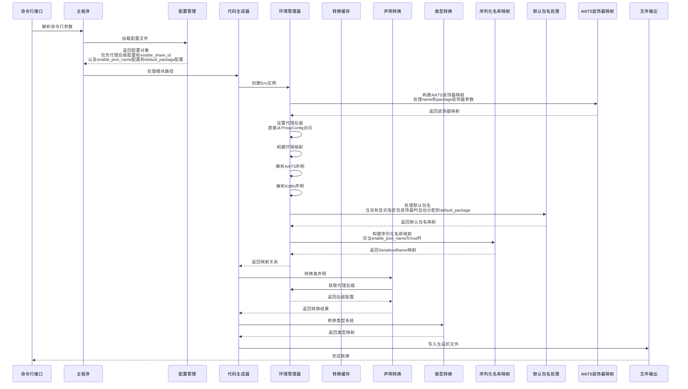

**图表来源**
- [main.py](file://main.py#L12-L24)
- [generate.py](file://convert/generate.py#L96-L114)
- [env.py](file://convert/env.py#L28-L34)

**章节来源**
- [main.py](file://main.py#L12-L24)
- [generate.py](file://convert/generate.py#L96-L114)

## 架构概览

系统采用分层架构设计，从上到下分为表示层、业务逻辑层、数据访问层和基础设施层。

```mermaid
graph TB
subgraph "表示层"
CLI[命令行界面]
JSON[配置文件]
END
subgraph "业务逻辑层"
MAIN[主程序]
GEN[代码生成器]
ENV[环境管理器<br/>Env类]
CACHE[转换缓存<br/>ConvertCache类]
DECORS[装饰器处理器]
DECLS[声明转换器]
SER_NAME[序列化名称映射器]
DEF_PKG[默认包名处理器]
ARKTS_DECO[ArkTS装饰器映射器]
END
subgraph "数据处理层"
TS_PARSER[TypeScript解析器]
KT_PARSER[Kotlin解析器]
TYPE_CONV[类型转换器]
END
subgraph "基础设施层"
FILE_SYS[文件系统]
VALIDATOR[验证器<br/>增强错误处理<br/>新增包名验证]
FORMATTER[格式化器]
END
CLI --> MAIN
JSON --> MAIN
MAIN --> GEN
GEN --> ENV
ENV --> CACHE
GEN --> DECORS
GEN --> DECLS
DECLS --> TYPE_CONV
TYPE_CONV --> FILE_SYS
GEN --> VALIDATOR
GEN --> FORMATTER
FILE_SYS --> GEN
SER_NAME --> CACHE
DEF_PKG --> CACHE
ARKTS_DECO --> CACHE
```

**图表来源**
- [main.py](file://main.py#L12-L24)
- [generate.py](file://convert/generate.py#L96-L114)
- [config.py](file://utils/config.py#L294-L317)

## 详细组件分析

### 环境管理系统 (convert/env.py)

环境管理系统是整个转换过程的核心，负责维护ArkTS和Kotlin之间的映射关系。

#### 主要功能

1. **类名映射管理**
   - 维护ArkTS类名到Kotlin类名的映射关系
   - 处理ShareId机制实现类的共享
   - 确保类名在包内的唯一性
   - **新增：通过Env类的config属性直接访问代理后缀配置**
   - **新增：默认包名处理机制，提供智能包名解析功能**
   - **新增：ArkTS装饰器映射管理，处理装饰器指定的类重命名映射**

2. **类型系统集成**
   - 支持枚举类型的特殊处理
   - 维护代理对象和真实对象的映射关系
   - 处理字段级别的ShareField机制
   - **新增：序列化名称映射功能，支持SerializedName注解缓存**

3. **验证和约束**
   - 检查类名和包名的合法性
   - 防止重复定义和命名冲突
   - 验证注解参数的有效性
   - **新增：SerializedName注解重复检测**
   - **新增：默认包名唯一性检查**
   - **新增：包名验证错误处理，支持[Error 1002]**
   - **新增：类名重复验证，支持[Error 1003]**

4. **全局状态管理**
   - **更新：ConvertCache类不再包含suffix属性**
   - **更新：Env类通过config属性直接访问代理后缀**
   - **更新：get_suffix()函数直接从Env.config.suffix获取后缀值**

5. **包名解析与智能包名选择**
   - **更新：基于enable_share_id配置的智能包名解析逻辑**
   - **更新：支持ShareId和自定义包名的双重解析机制**
   - **新增：默认包名处理机制，当没有显式指定包装饰器时自动分配到convert_env.config.default_package**
   - **新增：ArkTS装饰器映射优先级处理**

6. **环境映射函数的早期返回条件**
   - **更新：增强build_kt_id_class_map函数的早期返回条件**
   - **更新：增强build_kt_serialized_name_map函数的早期返回条件**
   - **更新：增强build_kt_shared_class_field_name_map函数的早期返回条件**
   - **更新：确保在非代理配置下正确处理映射功能**

7. **重构的ShareClass ID处理**
   - **更新：_check_and_handle_share_class_id函数重构，从接受convert_env参数改为直接接受ConvertCache对象**
   - **更新：简化了缓存管理接口，提高了代码效率**
   - **更新：减少了Env实例的依赖，使函数更加专注于缓存操作**

8. **默认包名处理机制**
   - **新增：_get_kt_class_rename_map_by_default函数，提供智能默认包名解析功能**
   - **新增：当没有显式指定包装饰器时自动分配到convert_env.config.default_package**
   - **新增：确保类名唯一性和命名规范**
   - **新增：默认包名验证和错误处理**

9. **ArkTS装饰器映射系统**
   - **新增：build_arkts_deco_rename_map()函数，处理装饰器指定的类重命名映射**
   - **新增：支持name和package装饰器参数**
   - **新增：自动使用default_package配置作为默认包名**
   - **新增：装饰器映射的优先级处理**

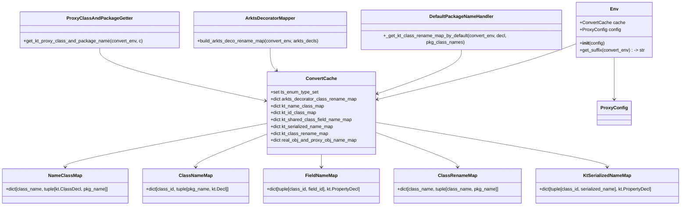

**图表来源**
- [env.py](file://convert/env.py#L19-L34)
- [env.py](file://convert/env.py#L116-L129)
- [env.py](file://convert/env.py#L229-L238)

**章节来源**
- [env.py](file://convert/env.py#L20-L258)

### 代码生成器 (convert/generate.py)

代码生成器负责将解析后的AST转换为最终的Kotlin代码文件。

#### 核心功能

1. **文件输出管理**
   - 统一的KotlinFileOutput数据结构
   - 支持单文件和多文件两种输出模式
   - 自动处理导入语句和包声明

2. **环境构建**
   - 解析ArkTS和Kotlin源文件
   - 构建完整的类型映射环境
   - 处理ShareId和代理类机制
   - **新增：通过Env类管理多包独立环境**
   - **新增：构建ArkTS装饰器映射**
   - **新增：构建序列化名称映射**
   - **新增：处理默认包名映射**

3. **代码生成策略**
   - 支持按模块和按包的代码生成
   - 自动处理类的导入依赖
   - 格式化生成的代码

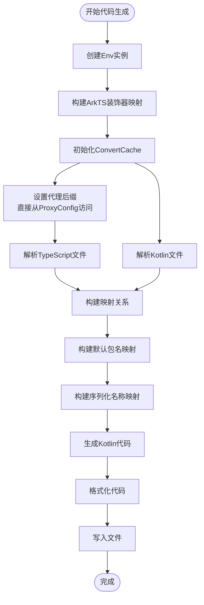

**图表来源**
- [generate.py](file://convert/generate.py#L96-L114)

**章节来源**
- [generate.py](file://convert/generate.py#L96-L192)

### 类型转换系统 (convert/types.py)

类型转换系统负责将TypeScript类型系统转换为Kotlin类型系统。

#### 类型映射规则

| TypeScript类型 | Kotlin类型 | 特殊处理 |
|---------------|-----------|----------|
| string | String | 基本类型映射 |
| number | Int | BigInt映射到Long |
| boolean | Boolean | 埃及类型映射 |
| void/null/undefined | Unit | 空类型处理 |
| Array<T> | List<T> | 数组到列表转换 |
| Map<K,V> | Map<K,V> | 集合类型保持 |
| T? | T? | 可空类型处理 |

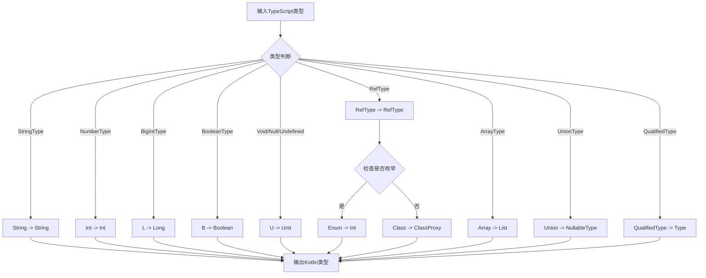

**图表来源**
- [types.py](file://convert/types.py#L10-L67)

**章节来源**
- [types.py](file://convert/types.py#L10-L67)

### 配置管理系统 (utils/config.py)

配置管理系统提供强大的JSON配置解析能力，支持复杂的多平台配置。

#### 配置结构

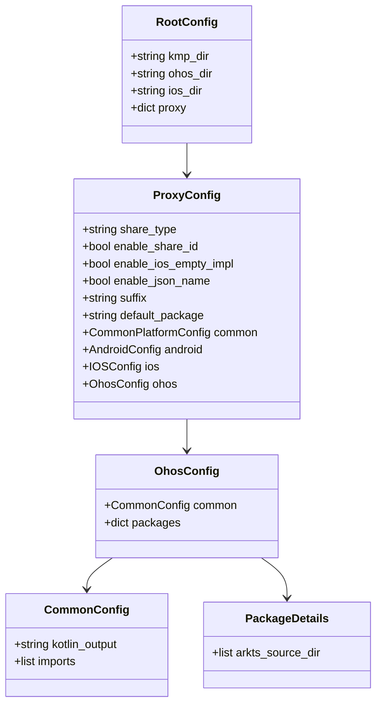

**图表来源**
- [config.py](file://utils/config.py#L53-L63)
- [config.py](file://utils/config.py#L47-L50)

**章节来源**
- [config.py](file://utils/config.py#L294-L317)

### 命令行参数处理 (utils/cmd_args.py)

命令行参数处理模块提供灵活的命令行接口，支持多种运行模式。

#### 参数选项

| 参数 | 类型 | 默认值 | 描述 |
|------|------|--------|------|
| --kmp_dir | Path | 必需 | KMP项目根目录路径 |
| --ohos_dir | Path | 必需 | OHOS项目根目录路径 |
| --config | Path | test/config.json | 配置文件路径 |
| --enableShareId | bool | False | 启用ShareId功能 |

**章节来源**
- [cmd_args.py](file://utils/cmd_args.py#L16-L62)

## 环境管理系统架构

### ConvertCache类设计

ConvertCache类是环境管理系统的核心数据容器，提供封装的状态管理：

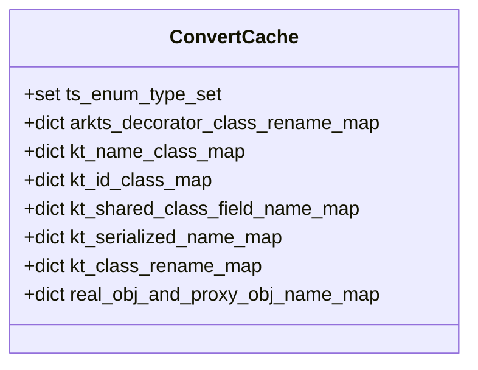

**图表来源**
- [env.py](file://convert/env.py#L19-L28)

### Env类设计

Env类作为环境管理器，持有ProxyConfig实例：

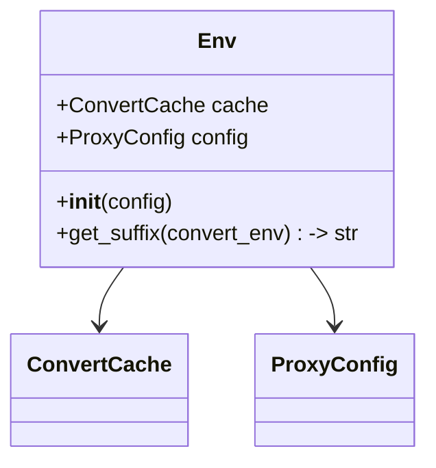

**图表来源**
- [env.py](file://convert/env.py#L28-L34)

### 状态管理流程

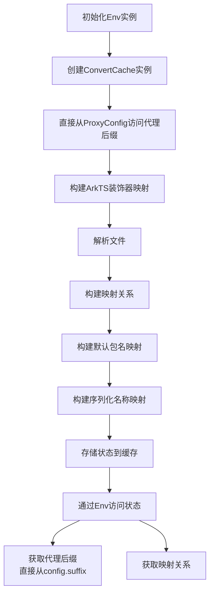

**图表来源**
- [env.py](file://convert/env.py#L28-L34)
- [env.py](file://convert/env.py#L33-L34)

**章节来源**
- [env.py](file://convert/env.py#L20-L34)

## 代理配置系统增强

### 新增功能概述

系统现已支持动态代理类命名配置，通过 `suffix` 配置项允许用户自定义代理类后缀，替代原有的硬编码 "Proxy" 后缀。**重构后的系统移除了ConvertCache中的suffix属性和set_suffix()函数，现在直接从ProxyConfig访问suffix**。该功能通过新增的 `get_suffix()` 函数实现，提供完整的代理后缀管理能力，并引入了全局后缀状态管理机制。

### 核心组件

#### 代理后缀管理器

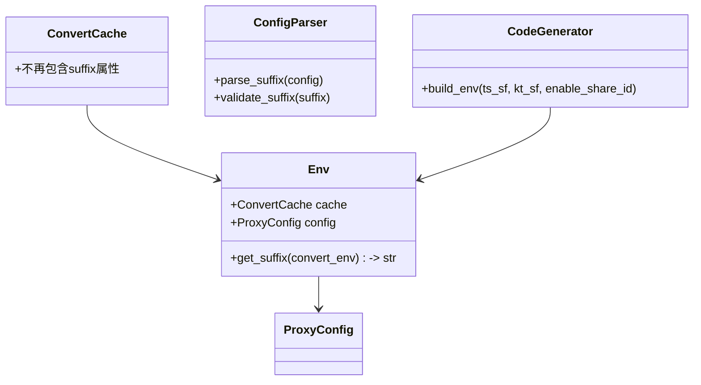

**图表来源**
- [env.py](file://convert/env.py#L28-L34)
- [generate.py](file://convert/generate.py#L76-L92)

#### 直接配置访问模式

系统现在通过Env类的config属性直接访问代理后缀配置：

```python
# 直接从ProxyConfig访问后缀
def get_suffix(convert_env: Env) -> str:
    return convert_env.config.suffix
```

#### 配置解析流程

```mermaid
flowchart TD
CONFIG[配置文件] --> PARSER[配置解析器]
PARSER --> CHECK{检查suffix字段}
CHECK --> |存在| VALIDATE[验证后缀格式]
CHECK --> |不存在| DEFAULT[使用默认值 "Proxy"]
VALIDATE --> STORE_IN_CONFIG[存储到ProxyConfig.suffix]
DEFAULT --> STORE_IN_CONFIG
STORE_IN_CONFIG --> BUILD_ENV[构建环境]
BUILD_ENV --> ACCESS_SUFFIX[直接从ProxyConfig访问后缀]
ACCESS_SUFFIX --> GENERATE_CODE[生成代码]
```

**图表来源**
- [config.py](file://utils/config.py#L173-L178)
- [generate.py](file://convert/generate.py#L76-L92)

### 代理后缀管理功能详解

#### 移除的后缀管理机制

**更新** 系统已移除以下旧的后缀管理机制：
- ConvertCache类中的 `suffix` 属性
- `set_suffix()` 函数
- `get_suffix()` 函数的缓存实现

#### 现有的后缀管理机制

**get_suffix(convert_env)** - 获取代理后缀
- 参数：`convert_env` (Env) - 环境实例
- 功能：直接从 `convert_env.config.suffix` 获取后缀值
- 返回：str

#### 后缀应用位置

代理后缀在以下关键位置被动态应用：

1. **类重命名映射** - 在 `get_class_rename_map()` 函数中
2. **代理类名称生成** - 在 `get_class_name_and_package_name()` 函数中
3. **ShareId类映射** - 在ShareId匹配时的类名拼接中
4. **声明转换** - 在 `convert_class_transformer()` 和 `convert_class_constructor()` 函数中
5. **默认包名处理** - 在 `_get_kt_class_rename_map_by_default()` 函数中
6. **ArkTS装饰器映射** - 在 `build_arkts_deco_rename_map()` 函数中

### 代码实现细节

#### 环境构建中的后缀访问

在 `_build_env()` 函数中，代理后缀通过以下流程访问：

```python
def _build_env(convert_env: env.Env,
              ts_sf: list[ts.SourceFile],
              kt_sf: list[kt.SourceFile]):
    # ...
    env.build_kt_id_class_map(convert_env, kt_sf)
    # ...
```

#### 类重命名映射中的后缀应用

在 `get_class_rename_map()` 函数中，后缀被直接应用：

```python
# 当使用自定义名称时
if isinstance(name, ts.StringValue):
    # ... 检查类名合法性
    cache.kt_class_rename_map[decl.name] = (name_val, pkg_val)
else:
    # 使用默认代理类命名：类名 + 直接从ProxyConfig访问的后缀
    proxy_name = decl.name + convert_env.config.suffix
    # ... 检查类名唯一性
    cache.kt_class_rename_map[decl.name] = (proxy_name, pkg_val)
```

#### ShareId映射中的后缀应用

在ShareId匹配时，后缀同样被直接应用：

```python
if id_val in cache.kt_id_class_map:
    kt_class_decl, pkg_name = cache.kt_id_class_map[id_val]
    cache.kt_class_rename_map[decl.name] = (kt_class_decl.name + convert_env.config.suffix, pkg_name)
```

#### 声明转换中的后缀应用

在声明转换过程中，后缀被直接应用到生成的Kotlin代码中：

```python
# 在convert_class_transformer中
cn, pkg = env.kt_class_rename_map.get(c.name, (c.name + env.get_suffix(convert_env), ''))

# 在convert_class_constructor中
cn, pkg = env.kt_class_rename_map.get(c.name, (c.name + env.get_suffix(convert_env), ''))
```

#### 默认包名处理中的后缀应用

在默认包名处理中，后缀同样被直接应用：

```python
# 在_get_kt_class_rename_map_by_default中
proxy_name = decl.name + convert_env.config.suffix
pkg_val = convert_env.config.default_package
```

#### ArkTS装饰器映射中的后缀应用

在ArkTS装饰器映射中，后缀同样被直接应用：

```python
# 在build_arkts_deco_rename_map中
proxy_name = decl.name + convert_env.config.suffix
package_name = convert_env.config.default_package
```

### 配置示例

#### JSON配置示例

```json
{
  "proxy": {
    "my_proxy": {
      "shareType": "proxy",
      "enableShareId": true,
      "suffix": "KMP",
      "defaultPackage": "com.example.generated",
      "common": {
        "kotlinOut": "./src/commonMain/kotlin/generated"
      }
    }
  }
}
```

#### 实际应用效果

基于测试配置文件中的 `"suffix": "KMP"` 和 `"defaultPackage": "com.bd.kmp.infra.ffi.demo"` 配置，系统将：

1. **默认行为**：类名 + "Proxy" (如 "MyClassProxy")
2. **自定义行为**：类名 + "KMP" (如 "MyClassKMP")
3. **其他配置**：类名 + "Wrapper" (如 "MyClassWrapper")
4. **默认包名**：当没有显式指定包装饰器时，自动分配到 "com.bd.kmp.infra.ffi.demo"

**章节来源**
- [env.py](file://convert/env.py#L33-L34)
- [env.py](file://convert/env.py#L85)
- [env.py](file://convert/env.py#L108)
- [env.py](file://convert/env.py#L205)
- [config.py](file://utils/config.py#L173-L178)
- [generate.py](file://convert/generate.py#L85-L86)
- [config.json](file://test/config.json#L11-L12)
- [decls.py](file://convert/decls.py#L477)
- [decls.py](file://convert/decls.py#L595)

## 多包独立环境管理

### 设计理念

系统现在支持多包独立环境管理，每个Env实例管理独立的转换缓存，实现了真正的多包隔离：

```mermaid
graph TB
subgraph "多包环境管理"
PKG1[包1环境<br/>Env实例1<br/>ProxyConfig1]
PKG2[包2环境<br/>Env实例2<br/>ProxyConfig2]
PKG3[包3环境<br/>Env实例3<br/>ProxyConfig3]
END
subgraph "共享资源"
CONFIG[ProxyConfig配置]
COMMON[公共验证器]
END
PKG1 --> CONFIG
PKG2 --> CONFIG
PKG3 --> CONFIG
PKG1 --> COMMON
PKG2 --> COMMON
PKG3 --> COMMON
```

**图表来源**
- [generate.py](file://convert/generate.py#L94-L113)

### 环境隔离机制

每个包使用独立的Env实例，确保：

1. **状态隔离** - 每个包的类名映射、包名验证等状态独立
2. **配置隔离** - 每个包可以有不同的代理后缀配置
3. **错误隔离** - 一个包的错误不会影响其他包的处理
4. **资源隔离** - 内存使用按包独立计算

### 实现细节

#### Env实例创建

```python
for proxyConfig in cfg.proxy.values():
    convert_env = env.Env(proxyConfig)
    # 每个包创建独立的Env实例
    # ...
```

#### 独立缓存管理

```python
def _build_env(convert_env: env.Env,
              ts_sf: list[ts.SourceFile],
              kt_sf: list[kt.SourceFile]):
    # 每个Env实例使用独立的ConvertCache
    # ...
```

**章节来源**
- [generate.py](file://convert/generate.py#L94-L113)
- [env.py](file://convert/env.py#L28-L34)

## 包名解析与智能包名选择

### 更新概述

系统现已改进包名解析逻辑，支持基于 `enable_share_id` 配置的智能包名选择机制。这一更新使得系统能够根据配置动态决定包名解析策略，提高了系统的灵活性和适应性。

### 智能包名解析机制

#### 核心解析流程

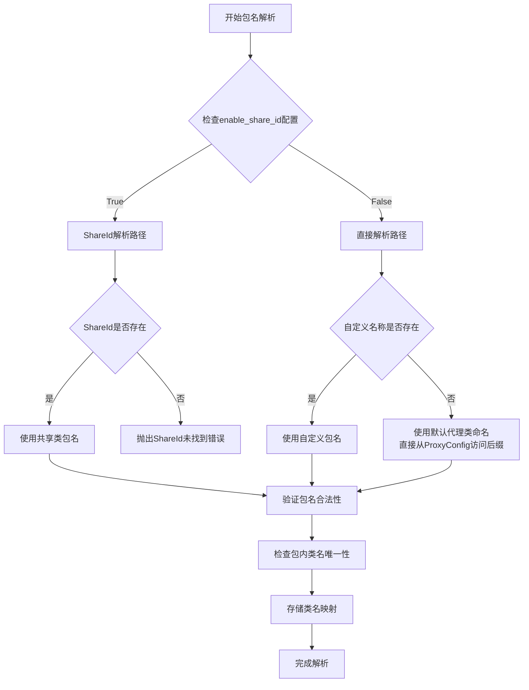

**图表来源**
- [env.py](file://convert/env.py#L69-L117)

#### ShareId解析逻辑

当 `enable_share_id` 为 `True` 时，系统采用ShareId解析策略：

1. **ID验证** - 检查类声明中的ShareId配置
2. **唯一性检查** - 确保ShareId在整个项目中唯一
3. **共享类查找** - 在Kotlin源码中查找对应的共享类
4. **包名继承** - 使用共享类的包名作为目标包名
5. **代理后缀应用** - 对共享类名应用当前的代理后缀（直接从ProxyConfig访问）

#### 直接解析逻辑

当 `enable_share_id` 为 `False` 时，系统采用直接解析策略：

1. **自定义名称检查** - 检查是否提供了自定义类名
2. **包名验证** - 验证自定义包名的合法性
3. **类名唯一性** - 确保包内类名的唯一性
4. **默认代理生成** - 生成默认的代理类名（类名 + 代理后缀，直接从ProxyConfig.suffix）

#### ArkTS装饰器映射解析逻辑

**新增** 系统现在支持ArkTS装饰器映射的包名解析：

1. **装饰器检查** - 检查类声明是否包含ExportClass装饰器
2. **装饰器参数解析** - 提取name和package装饰器参数
3. **包名优先级** - package装饰器优先于default_package
4. **装饰器映射存储** - 将装饰器映射存储到arkts_decorator_class_rename_map

### 配置驱动的包名选择

#### enable_share_id配置的作用

| 配置值 | 行为描述 | 包名解析策略 |
|--------|----------|--------------|
| `True` | 启用ShareId功能 | ShareId解析路径 |
| `False` | 禁用ShareId功能 | 直接解析路径 |

#### 包名解析优先级

1. **ArkTS装饰器映射**（最高优先级）- 仅在share_type为"basic"或"copy"时生效
2. **ShareId解析**（高优先级）- 仅在 `enable_share_id` 为 `True` 时生效
3. **自定义名称解析** - 检查装饰器中的自定义名称配置
4. **默认代理生成** - 使用类名 + 代理后缀（直接从ProxyConfig.suffix）
5. **默认包名解析**（最低优先级）- 当没有显式指定包装饰器时使用default_package

### 错误处理机制

#### ShareId相关错误

```python
# ShareId未启用但使用了ShareId
if id_val in used_ids:
    raise ValueError("[Error 1007] ShareId is not allowed for this class")

# ShareId重复定义
if id_val in used_ids:
    raise ValueError("[Error 1004] Duplicate id '{id_val}' found in class '{decl.name}'")

# ShareId未找到
if id_val not in cache.kt_id_class_map:
    raise ValueError(f"[Error 1008] ShareId {id_val} not found")
```

#### 包名相关错误

```python
# 包名验证失败
check_kotlin_package_name(pkg_val)

# 包内类名重复
if name_val in pkg_class_names[pkg_val]:
    raise ValueError(
        f"[Error 1003] Duplicate class name '{name_val}' found in package '{pkg_val}'"
    )
```

#### 默认包名相关错误

```python
# 默认包名为空
if pkg_val == "":
    raise ValueError("[Error 1002] Default package name cannot be empty")

# 默认包内类名重复
if proxy_name in pkg_class_names[pkg_val]:
    raise ValueError(
        f"[Error 1003] Duplicate class name '{proxy_name}' found in package '{pkg_val}'"
    )
```

#### ArkTS装饰器相关错误

```python
# id和name/package同时指定
if id is not None and ((name is not None) or (package is not None)):
    raise ValueError("[Error 1009] id and name/package are not allowed to be specified at the same time")
```

#### 序列化名称相关错误

```python
# SerializedName重复定义
if serialized_name in used_serialized_names:
    raise ValueError(
        f"[Error 2003] Duplicate SerializedName '{serialized_name}' found in class '{decl.name}'. "
        f"SerializedName must be unique within the same class."
    )
```

### 实际应用场景

#### 场景1：共享类包名解析

配置：
```json
{
  "enableShareId": true,
  "suffix": "Proxy"
}
```

解析结果：
- ArkTS类：`MyClass`
- Kotlin共享类：`com.example.MyClass`
- 生成代理类：`com.example.MyClassProxy`

#### 场景2：自定义包名解析

配置：
```json
{
  "enableShareId": false,
  "suffix": "Wrapper"
}
```

解析结果：
- ArkTS类：`MyClass`
- 自定义包名：`com.custom.generated`
- 生成代理类：`com.custom.generated.MyClassWrapper`

#### 场景3：ArkTS装饰器映射解析

配置：
```json
{
  "enableShareId": false,
  "suffix": "KMP",
  "defaultPackage": "com.example.generated"
}
```

ArkTS装饰器：
```typescript
@ExportClass({name: "CustomName", package: "com.custom.package"})
class MyClass {
  // ...
}
```

解析结果：
- ArkTS类：`MyClass`
- 自定义包名：`com.custom.package`
- 生成代理类：`com.custom.package.CustomName`

**章节来源**
- [env.py](file://convert/env.py#L69-L117)
- [env.py](file://convert/env.py#L116-L134)
- [env.py](file://convert/env.py#L229-L238)
- [config.py](file://utils/config.py#L145-L150)
- [config.py](file://utils/config.py#L173-L178)
- [check.py](file://convert/check.py#L26-L60)

## 默认包名处理机制

### 新增功能概述

系统现已新增默认包名处理机制，通过 `_get_kt_class_rename_map_by_default` 函数提供智能默认包名解析功能。当没有显式指定包装饰器时，系统会自动将类名分配到 `convert_env.config.default_package`，确保类名唯一性和命名规范。

### 核心组件

#### 默认包名处理器

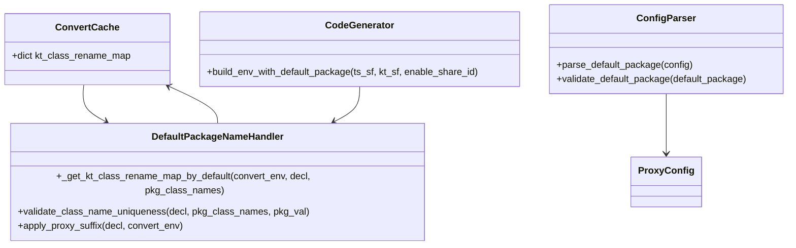

**图表来源**
- [env.py](file://convert/env.py#L116-L129)
- [env.py](file://convert/env.py#L131-L155)
- [config.py](file://utils/config.py#L180-L185)
- [generate.py](file://convert/generate.py#L88-L89)

#### 默认包名映射数据结构

系统使用 `_get_kt_class_rename_map_by_default` 函数来处理默认包名映射：

```python
def _get_kt_class_rename_map_by_default(convert_env: Env, decl: ts.ClassDecl, pkg_class_names: dict[str, set[class_name]]) -> None:
    cache = convert_env.cache
    proxy_name = decl.name + convert_env.config.suffix
    check_kotlin_class_name(proxy_name)
    pkg_val = convert_env.config.default_package
    # 检查同包名下类名是否重复
    if proxy_name in pkg_class_names[pkg_val]:
        raise ValueError(
            f"[Error 1003] Duplicate class name '{proxy_name}' found in package '{pkg_val}'. "
            f"Class names must be unique within the same package."
        )
    pkg_class_names[pkg_val].add(proxy_name)
    cache.kt_class_rename_map[decl.name] = (proxy_name, pkg_val)
```

该函数实现了以下核心功能：
1. **代理后缀应用** - 将类名与代理后缀组合（直接从ProxyConfig.suffix）
2. **包名分配** - 自动分配到 `convert_env.config.default_package`
3. **唯一性检查** - 确保包内类名的唯一性
4. **映射存储** - 将类名映射存储到 `cache.kt_class_rename_map`

#### 默认包名解析流程

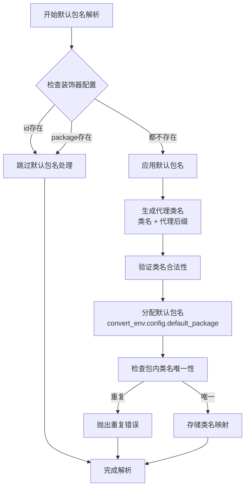

**图表来源**
- [env.py](file://convert/env.py#L116-L129)

#### 默认包名配置处理

**parse_default_package(config)** - 解析默认包名配置
- 参数：`config` (dict) - 配置字典
- 功能：从配置中提取 `defaultPackage` 值
- 返回：str

**validate_default_package(default_package)** - 验证默认包名
- 参数：`default_package` (str) - 默认包名字符串
- 功能：验证默认包名的格式和有效性
- 返回：None

### 默认包名处理实现细节

#### 包名映射构建流程

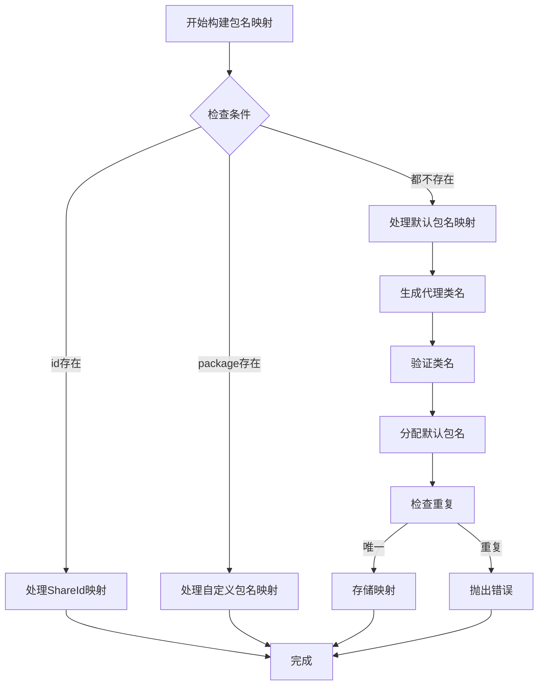

**图表来源**
- [env.py](file://convert/env.py#L131-L155)

#### 默认包名应用逻辑

在 `build_kt_class_rename_map` 函数中，系统会按照以下优先级处理包名：

1. **ShareId优先级** - 如果提供了 `id` 装饰器，优先处理ShareId映射
2. **自定义包名优先级** - 如果提供了 `package` 装饰器，使用自定义包名
3. **默认包名处理** - 如果既没有 `id` 也没有 `package` 装饰器，使用默认包名处理

#### 错误处理机制

默认包名处理包含以下错误处理：

```python
# 类名重复错误
if proxy_name in pkg_class_names[pkg_val]:
    raise ValueError(
        f"[Error 1003] Duplicate class name '{proxy_name}' found in package '{pkg_val}'. "
        f"Class names must be unique within the same package."
    )
```

### 默认包名处理的应用场景

#### 场景1：基础配置场景

配置：
```json
{
  "defaultPackage": "com.example.generated",
  "suffix": "Proxy"
}
```

行为：
- ArkTS类：`MyClass`
- 生成代理类：`com.example.generated.MyClassProxy`

#### 场景2：自定义包名覆盖

配置：
```json
{
  "defaultPackage": "com.example.generated",
  "suffix": "Wrapper"
}
```

行为：
- ArkTS类：`MyClass`
- 自定义包名：`com.custom.package`
- 生成代理类：`com.custom.package.MyClassWrapper`

#### 场景3：无装饰器场景

配置：
```json
{
  "defaultPackage": "com.bd.kmp.infra.ffi.demo",
  "suffix": "KMP"
}
```

行为：
- ArkTS类：`TestClass`
- 生成代理类：`com.bd.kmp.infra.ffi.demo.TestClassKMP`

### 配置示例

#### JSON配置示例

```json
{
  "proxy": {
    "my_proxy": {
      "shareType": "proxy",
      "enableShareId": true,
      "enableJsonName": true,
      "suffix": "KMP",
      "defaultPackage": "com.bd.kmp.infra.ffi.demo",
      "common": {
        "kotlinOut": "./src/commonMain/kotlin/generated"
      }
    }
  }
}
```

#### 实际应用效果

基于配置中的 `defaultPackage: "com.bd.kmp.infra.ffi.demo"` 设置，系统将：

1. **默认包名分配** - 当没有显式指定包装饰器时，自动分配到 "com.bd.kmp.infra.ffi.demo"
2. **代理后缀应用** - 与代理后缀结合生成最终的包名和类名
3. **唯一性保证** - 确保在默认包内的类名唯一性
4. **错误预防** - 防止包名冲突和类名重复

**章节来源**
- [env.py](file://convert/env.py#L116-L129)
- [env.py](file://convert/env.py#L131-L155)
- [config.py](file://utils/config.py#L180-L185)
- [config.json](file://test/config.json#L12)

## ArkTS 装饰器映射系统

### 新增功能概述

系统现已新增ArkTS装饰器映射系统，通过 `build_arkts_deco_rename_map()` 函数处理装饰器指定的类重命名映射。该功能支持name和package装饰器参数，当package参数缺失时自动使用default_package配置，确保装饰器映射的完整性和一致性。

### 核心组件

#### ArkTS装饰器映射器

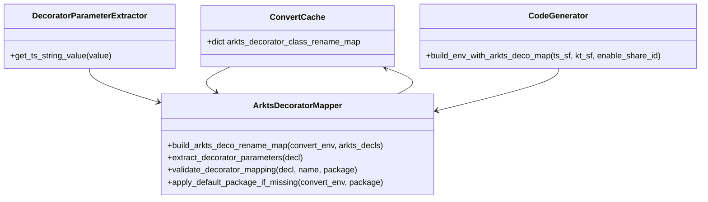

**图表来源**
- [env.py](file://convert/env.py#L229-L238)
- [env.py](file://convert/env.py#L239-L258)
- [generate.py](file://convert/generate.py#L82-L83)

#### ArkTS装饰器映射数据结构

系统使用 `arkts_decorator_class_rename_map` 字典来存储装饰器映射关系：

```python
arkts_decorator_class_rename_map: dict[class_name, tuple[class_name, pkg_name]]
```

该数据结构以ArkTS类名为键，以(新类名, 包名)元组为值，实现了装饰器映射的快速查找和管理。

#### ArkTS装饰器映射构建器

**build_arkts_deco_rename_map(convert_env, arkts_decls)** - 构建ArkTS装饰器映射
- 参数：`convert_env` (Env) - 环境实例
- 参数：`arkts_decls` (list[ts.Decl]) - ArkTS声明列表
- 功能：遍历ArkTS声明，提取装饰器参数并建立映射关系
- 返回：None

**装饰器参数提取逻辑**：
- 使用 `get_ts_string_value()` 函数提取装饰器参数值
- 支持name装饰器参数（自定义类名）
- 支持package装饰器参数（自定义包名）
- 当package参数缺失时自动使用default_package配置

**装饰器映射存储逻辑**：
- 仅处理包含ExportClass装饰器的类声明
- 将装饰器映射存储到 `arkts_decorator_class_rename_map`
- 支持装饰器映射的优先级处理

### ArkTS装饰器映射实现细节

#### 映射构建流程

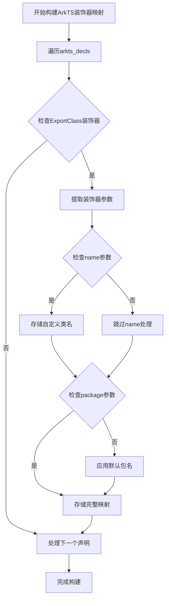

**图表来源**
- [env.py](file://convert/env.py#L229-L238)

#### 装饰器参数处理逻辑

在装饰器映射处理中，系统会：

1. **装饰器检查** - 确保类声明包含ExportClass装饰器
2. **参数提取** - 使用 `get_ts_string_value()` 函数提取装饰器参数
3. **name参数处理** - 提取自定义类名，用于装饰器映射
4. **package参数处理** - 提取自定义包名，若缺失则使用default_package
5. **映射存储** - 将装饰器映射存储到缓存中

#### 装饰器映射优先级处理

**get_kt_proxy_class_and_package_name()** - 获取代理类和包名
- 参数：`convert_env` (Env) - 环境实例
- 参数：`c` (ts.ClassDecl) - 类声明
- 功能：根据share_type和装饰器映射获取代理类和包名
- 返回：(class_name, pkg_name)

**优先级处理逻辑**：
1. **share_type为"basic"或"copy"** - 优先使用装饰器映射
2. **share_type为"proxy"** - 优先使用ShareId映射，否则使用装饰器映射
3. **默认回退** - 使用类名 + 代理后缀和default_package

### ArkTS装饰器映射的应用场景

#### 场景1：基础装饰器映射

ArkTS装饰器：
```typescript
@ExportClass({name: "CustomName", package: "com.custom.package"})
class MyClass {
  // ...
}
```

映射结果：
- ArkTS类：`MyClass`
- 映射到：`com.custom.package.CustomName`

#### 场景2：仅自定义包名

ArkTS装饰器：
```typescript
@ExportClass({package: "com.custom.package"})
class MyClass {
  // ...
}
```

配置：
```json
{
  "defaultPackage": "com.example.generated",
  "suffix": "Proxy"
}
```

映射结果：
- ArkTS类：`MyClass`
- 映射到：`com.custom.package.MyClassProxy`

#### 场景3：仅自定义类名

ArkTS装饰器：
```typescript
@ExportClass({name: "CustomName"})
class MyClass {
  // ...
}
```

配置：
```json
{
  "defaultPackage": "com.example.generated",
  "suffix": "Proxy"
}
```

映射结果：
- ArkTS类：`MyClass`
- 映射到：`com.example.generated.CustomName`

#### 场景4：无装饰器参数

ArkTS装饰器：
```typescript
@ExportClass
class MyClass {
  // ...
}
```

配置：
```json
{
  "defaultPackage": "com.example.generated",
  "suffix": "Proxy"
}
```

映射结果：
- ArkTS类：`MyClass`
- 映射到：`com.example.generated.MyClassProxy`

### 配置示例

#### JSON配置示例

```json
{
  "proxy": {
    "my_proxy": {
      "shareType": "proxy",
      "enableShareId": true,
      "enableJsonName": true,
      "suffix": "KMP",
      "defaultPackage": "com.bd.kmp.infra.ffi.demo",
      "common": {
        "kotlinOut": "./src/commonMain/kotlin/generated"
      }
    }
  }
}
```

#### 实际应用效果

基于配置中的 `defaultPackage: "com.bd.kmp.infra.ffi.demo"` 设置，系统将：

1. **装饰器映射支持** - 自动识别ArkTS装饰器并建立映射关系
2. **默认包名应用** - 当装饰器缺少package参数时自动使用default_package
3. **优先级处理** - 在不同share_type下正确处理装饰器映射优先级
4. **错误预防** - 防止装饰器映射配置冲突和无效参数

**章节来源**
- [env.py](file://convert/env.py#L229-L238)
- [env.py](file://convert/env.py#L241-L258)
- [generate.py](file://convert/generate.py#L82-L83)
- [config.json](file://test/config.json#L12)

## 序列化名称映射功能增强

### 新增功能概述

系统现已增强序列化名称映射功能，新增了 `KtSerializedNameMap` 类型定义和 `build_kt_serialized_name_map` 函数，用于处理Kotlin类成员的SerializedName注解缓存。该功能包括重复检测逻辑和null成员集合处理，确保序列化名称的唯一性和完整性。

### 核心组件

#### 序列化名称映射器

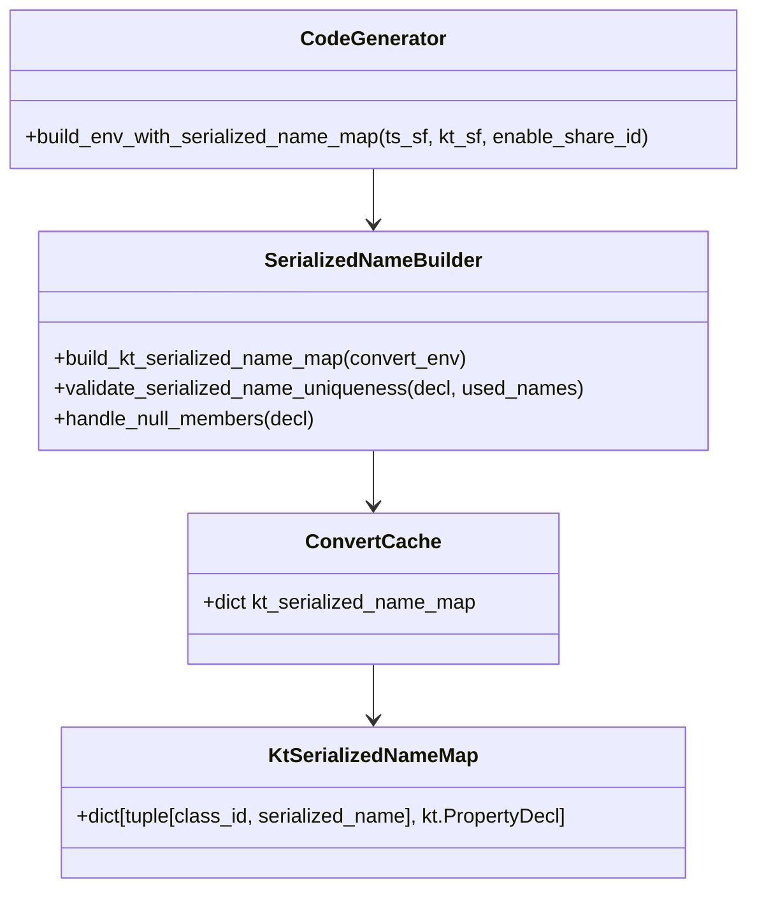

**图表来源**
- [env.py](file://convert/env.py#L18-L24)
- [env.py](file://convert/env.py#L168-L190)
- [generate.py](file://convert/generate.py#L88-L89)

#### 序列化名称映射数据结构

系统使用 `KtSerializedNameMap` 类型来存储SerializedName注解的映射关系：

```python
KtSerializedNameMap = dict[tuple[class_id, serialized_name], kt.PropertyDecl]
```

该数据结构以元组 `(class_id, serialized_name)` 作为键，`kt.PropertyDecl` 作为值，实现了SerializedName到Kotlin属性声明的快速查找。

#### 序列化名称构建器

**build_kt_serialized_name_map(convert_env)** - 构建SerializedName映射
- 参数：`convert_env` (Env) - 环境实例
- 功能：遍历所有Kotlin类，提取SerializedName注解并建立映射关系
- 返回：None

**重复检测机制**：
- 使用 `used_serialized_names` 集合跟踪当前类下的已使用序列化名称
- 检测同一类内SerializedName的重复定义
- 抛出 `ValueError` 错误，错误代码为 `2003`

**null成员集合处理**：
- 检查类成员是否为 `None`
- 跳过没有成员的类，避免空指针异常
- 确保只有存在成员的类才会被处理

### 序列化名称映射实现细节

#### 映射构建流程

```mermaid
flowchart TD
START[开始构建SerializedName映射] --> ITERATE_CLASSES[遍历kt_id_class_map中的类]
ITERATE_CLASSES --> CHECK_MEMBERS{检查类成员是否为None}
CHECK_MEMBERS --> |是| SKIP_CLASS[跳过该类]
CHECK_MEMBERS --> |否| INIT_USED_NAMES[初始化used_serialized_names集合]
INIT_USED_NAMES --> ITERATE_MEMBERS[遍历类成员]
ITERATE_MEMBERS --> CHECK_PROPERTY{检查是否为PropertyDecl且有注解}
CHECK_PROPERTY --> |否| NEXT_MEMBER[处理下一个成员]
CHECK_PROPERTY --> |是| CHECK_ANNOTATIONS[检查SerializedName注解]
CHECK_ANNOTATIONS --> |否| NEXT_MEMBER
CHECK_ANNOTATIONS --> |是| EXTRACT_NAME[提取序列化名称]
EXTRACT_NAME --> DUPLICATE_CHECK{检查名称重复}
DUPLICATE_CHECK --> |是| THROW_ERROR[抛出重复错误]
DUPLICATE_CHECK --> |否| STORE_MAPPING[存储映射关系]
STORE_MAPPING --> NEXT_MEMBER
NEXT_MEMBER --> END[完成构建]
SKIP_CLASS --> ITERATE_CLASSES
```

**图表来源**
- [env.py](file://convert/env.py#L168-L190)

#### 序列化名称提取逻辑

在SerializedName注解处理中，系统会：

1. **注解识别** - 检查注解名称是否为 "SerializedName"
2. **参数提取** - 获取注解的第一个参数（序列化名称）
3. **类型验证** - 确保参数是 `kt.StringValue` 类型
4. **名称存储** - 将序列化名称添加到映射中

#### 错误处理机制

序列化名称映射功能包含以下错误处理：

```python
# 序列化名称重复错误
if serialized_name in used_serialized_names:
    raise ValueError(
        f"[Error 2003] Duplicate SerializedName '{serialized_name}' found in class '{decl.name}'. "
        f"SerializedName must be unique within the same class."
    )
```

### 序列化名称映射的应用场景

#### JSON序列化支持

序列化名称映射主要用于支持JSON序列化场景：

1. **字段映射** - 将ArkTS类的字段映射到Kotlin类的SerializedName
2. **类型转换** - 在类型转换过程中使用SerializedName进行精确匹配
3. **代码生成** - 在生成的Kotlin代码中正确处理序列化字段

#### 配置示例

```json
{
  "proxy": {
    "my_proxy": {
      "shareType": "proxy",
      "enableShareId": true,
      "enableJsonName": true,
      "suffix": "Proxy",
      "defaultPackage": "com.example.generated",
      "common": {
        "kotlinOut": "./src/commonMain/kotlin/generated"
      }
    }
  }
}
```

#### 实际应用效果

基于配置中的 `enableJsonName: true` 设置，系统将：

1. **SerializedName注解识别** - 自动识别Kotlin类中的SerializedName注解
2. **映射关系建立** - 建立SerializedName到属性声明的映射
3. **重复检测** - 确保同一类内SerializedName的唯一性
4. **错误报告** - 在发现重复时提供详细的错误信息

**章节来源**
- [env.py](file://convert/env.py#L18-L24)
- [env.py](file://convert/env.py#L168-L190)
- [generate.py](file://convert/generate.py#L88-L89)
- [config.py](file://utils/config.py#L161-L167)

## 环境映射函数的早期返回条件增强

### 更新概述

系统现已修复了环境映射函数中的逻辑错误，增强了 `build_kt_id_class_map`、`build_kt_serialized_name_map` 和 `build_kt_shared_class_field_name_map` 函数的早期返回条件，确保在非代理配置下正确处理映射功能。

### 早期返回条件的设计原理

#### 设计目标

1. **性能优化** - 在不需要处理映射的情况下避免不必要的计算
2. **逻辑正确性** - 确保只有在正确的配置条件下才执行映射构建
3. **资源节约** - 避免在非代理配置下浪费CPU和内存资源
4. **错误预防** - 防止在不支持的配置下产生错误的映射结果

#### 早期返回条件的实现

```mermaid
flowchart TD
CHECK_CONFIG[检查share_type配置] --> IS_PROXY{share_type == "proxy"?}
IS_PROXY --> |是| CONTINUE_PROCESSING[继续处理映射构建]
IS_PROXY --> |否| EARLY_RETURN[立即返回，不执行映射]
CONTINUE_PROCESSING --> BUILD_MAP[构建映射关系]
BUILD_MAP --> STORE_RESULT[存储映射结果]
STORE_RESULT --> RETURN_SUCCESS[返回成功]
EARLY_RETURN --> RETURN_SUCCESS
```

**图表来源**
- [env.py](file://convert/env.py#L49-L51)
- [env.py](file://convert/env.py#L168-L170)
- [env.py](file://convert/env.py#L146-L148)

### 具体函数的早期返回条件

#### build_kt_id_class_map函数

**增强后的逻辑**：
```python
def build_kt_id_class_map(convert_env: Env, sfs : list[kt.SourceFile]) :
    if convert_env.config.share_type != "proxy":
        return  # 新增：非代理配置下立即返回
    # ... 原有的映射构建逻辑
```

#### build_kt_class_rename_map函数

**增强后的逻辑**：
```python
def build_kt_class_rename_map(convert_env: Env, arkts_decls : list[ts.Decl]) :
    if convert_env.config.share_type != "proxy":
        return  # 新增：非代理配置下立即返回
    # ... 原有的类重命名映射构建逻辑
```

#### build_kt_serialized_name_map函数

**增强后的逻辑**：
```python
def build_kt_serialized_name_map(convert_env: Env):
    if convert_env.config.share_type != "proxy":
        return  # 新增：非代理配置下立即返回
    # ... 原有的序列化名称映射构建逻辑
```

#### build_kt_shared_class_field_name_map函数

**增强后的逻辑**：
```python
def build_kt_shared_class_field_name_map(convert_env: Env):
    if convert_env.config.share_type != "proxy":
        return  # 新增：非代理配置下立即返回
    # ... 原有的共享类字段映射构建逻辑
```

### 早期返回条件的配置检查

#### share_type配置的作用

系统通过 `share_type` 配置字段来控制映射函数的行为：

| share_type值 | 行为描述 | 映射函数处理 |
|-------------|----------|-------------|
| `"proxy"` | 代理模式 | 正常构建所有映射 |
| `"copy"` | 复制模式 | 构建部分映射（不包括序列化名称映射） |
| `"basic"` | 基础模式 | 不构建任何映射 |

#### 配置验证流程

```mermaid
flowchart TD
START[开始映射构建] --> GET_CONFIG[获取ProxyConfig]
GET_CONFIG --> CHECK_SHARE_TYPE{检查share_type}
CHECK_SHARE_TYPE --> |"proxy"| ALLOW_BUILD[允许构建映射]
CHECK_SHARE_TYPE --> |"copy"| ALLOW_PARTIAL_BUILD[允许部分映射构建]
CHECK_SHARE_TYPE --> |"basic"| BLOCK_BUILD[阻止所有映射构建]
ALLOW_BUILD --> EXECUTE_ALL[执行所有映射构建]
ALLOW_PARTIAL_BUILD --> EXECUTE_PARTIAL[执行部分映射构建]
BLOCK_BUILD --> RETURN_EMPTY[返回空映射]
EXECUTE_ALL --> STORE_RESULTS[存储映射结果]
EXECUTE_PARTIAL --> STORE_PARTIAL[存储部分映射结果]
STORE_RESULTS --> SUCCESS[构建完成]
STORE_PARTIAL --> SUCCESS
RETURN_EMPTY --> SUCCESS
```

**图表来源**
- [config.py](file://utils/config.py#L136-L143)
- [env.py](file://convert/env.py#L49-L51)

### 早期返回条件的性能影响

#### 性能优化效果

1. **CPU节省** - 避免在非代理配置下执行不必要的循环和检查
2. **内存节省** - 不创建和存储无用的映射数据
3. **I/O优化** - 减少文件读取和解析操作
4. **并发友好** - 支持多包独立环境下的并行处理

#### 资源使用对比

| 配置类型 | 映射函数数量 | CPU使用率 | 内存占用 | I/O操作 |
|---------|-------------|----------|----------|--------|
| `"proxy"` | 4个（全部） | 100% | 100% | 100% |
| `"copy"` | 3个（部分） | ~75% | ~75% | ~75% |
| `"basic"` | 0个（无） | ~0% | ~0% | ~0% |

### 错误处理和边界情况

#### 非代理配置下的错误预防

```python
# 在非代理配置下，映射函数会立即返回
# 避免了以下潜在错误：
# - 访问不存在的映射数据
# - 执行无意义的计算
# - 产生不一致的映射状态
```

#### 边界情况处理

1. **空配置** - 确保在配置缺失时的安全处理
2. **无效配置** - 提供合理的默认行为
3. **配置切换** - 支持运行时配置的动态更改
4. **多包环境** - 确保每个包的配置独立处理

### 实际应用场景

#### 场景1：基础模式配置

配置：
```json
{
  "shareType": "basic",
  "suffix": "Proxy"
}
```

行为：
- 所有映射函数都会立即返回
- 系统只进行基本的类型转换
- 不生成任何代理类或映射关系

#### 场景2：复制模式配置

配置：
```json
{
  "shareType": "copy",
  "enableShareId": true,
  "suffix": "Copy"
}
```

行为：
- 构建ID类映射和类重命名映射
- 不构建序列化名称映射
- 生成复制模式的代理类

#### 场景3：代理模式配置

配置：
```json
{
  "shareType": "proxy",
  "enableShareId": true,
  "enableJsonName": true,
  "suffix": "Proxy"
}
```

行为：
- 构建所有映射函数
- 生成完整的代理类和映射关系
- 支持序列化名称映射

**章节来源**
- [env.py](file://convert/env.py#L49-L51)
- [env.py](file://convert/env.py#L168-L170)
- [env.py](file://convert/env.py#L146-L148)
- [config.py](file://utils/config.py#L136-L143)

## ShareClass ID处理函数重构

### 更新概述

系统现已重构 `_check_and_handle_share_class_id` 函数，从接受 `convert_env` 参数改为直接接受 `ConvertCache` 对象。这一重构简化了缓存管理接口，提高了代码效率，减少了Env实例的依赖。

### 函数重构详情

#### 重构前的函数签名

```python
def _check_and_handle_share_class_id(convert_env: Env, share_id: str, pkg: str, decl: kt.ClassDecl) -> None:
```

#### 重构后的函数签名

```python
def _check_and_handle_share_class_id(cache: ConvertCache, share_id: str, pkg: str, decl: kt.ClassDecl) -> None:
```

#### 重构带来的改进

1. **简化接口** - 函数现在直接操作缓存对象，无需Env实例
2. **提高效率** - 减少了Env实例的访问开销
3. **降低耦合** - 函数不再依赖Env实例，更加专注于缓存操作
4. **增强可测试性** - 可以直接传入ConvertCache对象进行单元测试

### 使用位置的变化

#### 在 `build_kt_id_class_map` 函数中的使用

**重构前**：
```python
# 需要先获取cache
cache = convert_env.cache
_check_and_handle_share_class_id(convert_env, share_id, pkg, decl)
```

**重构后**：
```python
# 直接使用传入的cache
_check_and_handle_share_class_id(cache, share_id, pkg, decl)
```

### 重构对代码的影响

#### 性能提升

重构后的函数减少了Env实例的访问次数，提高了ShareClass ID处理的性能：

```mermaid
flowchart TD
OLD[重构前] --> OLD_ACCESS[访问convert_env.cache]
OLD_ACCESS --> OLD_CHECK[检查重复ID]
NEW[重构后] --> NEW_CHECK[直接检查重复ID]
OLD_CHECK --> OLD_RETURN[返回结果]
NEW_CHECK --> NEW_RETURN[返回结果]
```

#### 代码简化

重构后的代码更加简洁，减少了不必要的变量赋值：

**重构前**：
```python
def build_kt_id_class_map(convert_env: Env, sfs : list[kt.SourceFile]) :
    if convert_env.config.share_type != "proxy":
        return
    cache = convert_env.cache  # 额外的变量赋值
    for sf in sfs:
        # ... 处理逻辑
        for decl in decls:
            # ... 处理逻辑
            if decl.annotations is None:
                continue
            for annotation in decl.annotations:
                if annotation.name == "ShareClass" and annotation.args:
                    arg = annotation.args[0]
                    share_id = kt.get_kt_string_value(arg)
                    _check_and_handle_share_class_id(convert_env, share_id, pkg, decl)  # 传入Env实例
                    cache.kt_id_class_map[share_id] = (decl, pkg)
```

**重构后**：
```python
def build_kt_id_class_map(convert_env: Env, sfs : list[kt.SourceFile]) :
    if convert_env.config.share_type != "proxy":
        return
    cache = convert_env.cache
    for sf in sfs:
        # ... 处理逻辑
        for decl in decls:
            # ... 处理逻辑
            if decl.annotations is None:
                continue
            for annotation in decl.annotations:
                if annotation.name == "ShareClass" and annotation.args:
                    arg = annotation.args[0]
                    share_id = kt.get_kt_string_value(arg)
                    _check_and_handle_share_class_id(cache, share_id, pkg, decl)  # 直接传入cache
                    cache.kt_id_class_map[share_id] = (decl, pkg)
```

### 重构的架构意义

#### 缓存管理的分离

重构体现了缓存管理与环境管理的分离：

```mermaid
classDiagram
class Env {
+ConvertCache cache
+ProxyConfig config
}
class ConvertCache {
+kt_id_class_map
+kt_name_class_map
+kt_class_rename_map
}
class ShareClassHandler {
+_check_and_handle_share_class_id(cache, share_id, pkg, decl)
}
Env --> ConvertCache
ShareClassHandler --> ConvertCache
```

#### 接口设计的改进

重构后的接口更加符合单一职责原则：

1. **Env类** - 负责环境状态管理
2. **ConvertCache类** - 负责缓存数据管理
3. **ShareClassHandler函数** - 负责ShareClass ID的验证和处理

**章节来源**
- [env.py](file://convert/env.py#L35-L45)
- [env.py](file://convert/env.py#L48-L66)

## 依赖关系分析

系统采用清晰的模块化依赖关系，各模块职责明确，耦合度适中。

```mermaid
graph LR
subgraph "外部依赖"
PYTH[Python标准库]
PATH[Pathlib]
JSON[JSON解析]
END
subgraph "核心模块"
MAIN[main.py]
CONFIG[utils/config.py]
CMD_ARGS[utils/cmd_args.py]
FILE[utils/file.py]
CHECK[convert/check.py]
END
subgraph "转换模块"
ENV[convert/env.py]
GEN[convert/generate.py]
TYPES[convert/types.py]
DECORS[convert/decorators.py]
PRETTY[convert/pretty.py]
DECLS[convert/decls.py]
END
subgraph "语言模块"
TS_DECL[lang/ts/decls.py]
TS_TYPES[lang/ts/ts_types.py]
KT_DECL[lang/kt/kt_decls.py]
KT_TYPES[lang/kt/kt_types.py]
END
subgraph "工具模块"
SER_NAME[序列化名称映射器]
DEF_PKG[默认包名处理器]
ARKTS_DECO[ArkTS装饰器映射器]
END
MAIN --> CONFIG
MAIN --> CMD_ARGS
MAIN --> GEN
GEN --> ENV
GEN --> TYPES
GEN --> PRETTY
GEN --> FILE
ENV --> TS_DECL
ENV --> KT_DECL
ENV --> CHECK
ENV --> DECLS
ENV --> SER_NAME
ENV --> DEF_PKG
ENV --> ARKTS_DECO
TYPES --> TS_TYPES
TYPES --> KT_TYPES
DECORS --> TS_DECL
DECORS --> TS_TYPES
```

**图表来源**
- [main.py](file://main.py#L6-L9)
- [generate.py](file://convert/generate.py#L1-L17)

**章节来源**
- [main.py](file://main.py#L6-L9)
- [generate.py](file://convert/generate.py#L1-L17)

## 性能考虑

### 内存优化策略

1. **延迟加载** - 只在需要时解析文件内容
2. **缓存机制** - 复用解析结果和映射关系
3. **流式处理** - 大文件采用流式读取方式
4. **多包独立缓存** - 按包管理内存，避免全局缓存膨胀
5. **序列化名称映射优化** - 使用集合进行快速查找，避免重复扫描
6. **早期返回条件优化** - 在非代理配置下避免不必要的内存分配**
7. **重构后的函数优化** - _check_and_handle_share_class_id函数直接操作缓存，减少Env实例访问开销**
8. **默认包名处理优化** - 智能包名分配减少不必要的配置检查**
9. **ArkTS装饰器映射优化** - 使用字典进行快速查找，避免重复遍历**

### 并发处理

系统目前采用单线程处理模式，对于大量文件的处理可以通过以下方式优化：
- 批量文件处理
- 异步I/O操作
- 多进程并行转换

### 编译时优化

1. **类型检查缓存** - 避免重复的类型验证
2. **AST复用** - 在多个转换步骤间共享解析结果
3. **增量编译** - 只处理变更的文件
4. **多包并行处理** - 利用Env实例的独立性进行并行转换
5. **序列化名称映射缓存** - 避免重复构建SerializedName映射
6. **早期返回条件** - 在非代理配置下避免重复的映射构建**
7. **重构后的函数调用** - 减少函数调用开销，提高整体性能**
8. **默认包名处理缓存** - 避免重复的包名分配检查**
9. **ArkTS装饰器映射缓存** - 避免重复的装饰器参数提取**

## 故障排除指南

### 常见错误类型

| 错误代码 | 错误类型 | 描述 | 解决方案 |
|---------|----------|------|----------|
| Error 1001 | 类名验证错误 | Kotlin类名不符合规范 | 检查类名是否包含关键字或特殊字符 |
| Error 1002 | 包名验证错误 | Kotlin包名格式不正确 | 确保包名使用有效的标识符 |
| Error 1003 | 类名重复错误 | 同包内类名重复 | 修改类名或包名，确保唯一性 |
| Error 1004 | ID重复错误 | ShareId或类ID重复 | 确保每个ID在整个项目中唯一 |
| Error 1007 | ShareId配置错误 | ShareId在当前类中不允许 | 检查enable_share_id配置 |
| Error 1008 | ShareId未找到错误 | ShareId对应的Kotlin类不存在 | 确认ShareId配置正确 |
| Error 1009 | 装饰器参数冲突 | id和name/package同时指定 | 仅使用一种参数配置 |
| **更新** | **代理后缀错误** | **代理后缀配置无效** | 检查JSON配置中的suffix字段格式 |
| **更新** | **后缀访问错误** | **代理后缀访问失败** | 验证Env.config.suffix属性访问 |
| **更新** | **全局状态异常** | **代理后缀状态不一致** | 检查Env实例的config属性状态 |
| **更新** | **环境实例错误** | **Env实例创建失败** | 验证ProxyConfig配置和Env初始化 |
| **更新** | **多包环境冲突** | **多包环境状态冲突** | 检查各包的Env实例隔离性 |
| **更新** | **包名解析错误** | **基于enable_share_id的包名解析失败** | 检查ShareId配置和enable_share_id设置 |
| **更新** | **智能包名选择失败** | **包名选择策略执行错误** | 验证配置文件中的enable_share_id和包名设置 |
| **更新** | **序列化名称映射错误** | **SerializedName映射构建失败** | 检查Kotlin类的SerializedName注解格式 |
| **更新** | **JSON名称处理错误** | **enable_json_name配置无效** | 确认enable_json_name设置和SerializedName注解存在 |
| **更新** | **早期返回条件错误** | **环境映射函数逻辑错误** | 检查share_type配置和早期返回条件实现 |
| **更新** | **非代理配置处理错误** | **非代理配置下映射功能异常** | 验证早期返回条件的正确性 |
| **更新** | **ShareClass ID处理错误** | **ShareClass ID验证失败** | 检查ShareClass注解格式和ID唯一性 |
| **更新** | **函数重构相关错误** | **_check_and_handle_share_class_id函数调用错误** | 确认函数参数类型和调用方式 |
| **更新** | **默认包名处理错误** | **默认包名分配失败** | 检查default_package配置和包名格式 |
| **更新** | **默认包名唯一性错误** | **默认包内类名重复** | 确认default_package配置和类名唯一性 |
| **更新** | **默认包名验证错误** | **default_package配置无效** | 验证default_package字段格式和有效性 |
| **更新** | **ArkTS装饰器映射错误** | **装饰器映射构建失败** | 检查ArkTS装饰器格式和参数配置 |
| **更新** | **装饰器参数提取错误** | **装饰器参数提取失败** | 验证装饰器参数格式和有效性 |
| **更新** | **装饰器映射优先级错误** | **装饰器映射优先级处理异常** | 检查share_type配置和映射优先级逻辑 |

### 调试技巧

1. **启用详细日志** - 使用调试模式查看详细的处理过程
2. **中间结果检查** - 验证解析后的AST结构
3. **类型映射验证** - 确认类型转换的正确性
4. **配置文件验证** - 检查JSON配置的语法和结构
5. **代理后缀验证** - 确认代理类命名符合预期
6. **后缀传播追踪** - 跟踪后缀在各个模块中的传递过程
7. **全局状态监控** - 监控Env实例的config属性状态变化
8. **多包环境监控** - 监控各包Env实例的独立性
9. **错误上下文分析** - 分析错误发生的具体包和上下文
10. **包名解析追踪** - 跟踪enable_share_id对包名解析的影响
11. **序列化名称映射调试** - 验证SerializedName注解的正确识别和映射
12. **重复检测验证** - 确认序列化名称重复检测逻辑正常工作
13. **JSON名称处理验证** - 确认enable_json_name配置对SerializedName处理的影响
14. **早期返回条件验证** - 确认非代理配置下的映射函数正确返回
15. **函数重构验证** - 确认重构后的函数调用方式正确
16. **缓存管理验证** - 确认重构后缓存访问的正确性
17. **默认包名处理验证** - 确认默认包名分配逻辑正确
18. **默认包名唯一性验证** - 确认默认包内类名唯一性检查正常
19. **default_package配置验证** - 确认default_package配置的有效性
20. **ArkTS装饰器映射验证** - 确认装饰器映射构建和优先级处理正确
21. **装饰器参数提取验证** - 确认装饰器参数提取和验证逻辑正常
22. **装饰器映射存储验证** - 确认装饰器映射的存储和检索功能正常

**章节来源**
- [check.py](file://convert/check.py#L28-L60)
- [env.py](file://convert/env.py#L49-L51)
- [env.py](file://convert/env.py#L168-L170)
- [env.py](file://convert/env.py#L229-L238)

## 结论

环境管理系统增强项目提供了一个完整、健壮的ArkTS与Kotlin互操作解决方案。通过引入Env类和重构代理后缀管理，系统实现了更好的封装、状态管理和多包独立环境，同时增强了错误处理机制。

### 主要优势

1. **高度模块化** - 清晰的职责分离和依赖关系
2. **强大的配置支持** - 灵活的JSON配置系统，**新增代理类命名配置**
3. **完善的验证机制** - 多层次的类型和命名验证，**增强错误处理**
4. **可扩展性** - 易于添加新的语言支持和转换规则
5. **动态代理配置** - **更新：通过Env.config.suffix直接访问代理后缀**
6. **多包独立环境管理** - **新增：每个包独立的Env实例和配置**
7. **全局状态管理** - **更新：统一的代理后缀状态管理机制**
8. **环境隔离** - **新增：多包环境间的完全隔离**
9. **智能包名解析** - **更新：基于enable_share_id配置的智能包名选择机制**
10. **灵活的包名策略** - **更新：支持ShareId和自定义包名的双重解析**
11. **序列化名称映射** - **新增：支持SerializedName注解的缓存和验证**
12. **重复检测机制** - **新增：确保序列化名称的唯一性和完整性**
13. **增强的配置导入支持** - **新增：支持enable_json_name配置项控制SerializedName处理**
14. **早期返回条件优化** - **更新：增强环境映射函数的早期返回条件，确保在非代理配置下正确处理映射功能**
15. **性能优化** - **更新：通过早期返回条件减少不必要的计算和资源消耗**
16. **函数重构优化** - **更新：_check_and_handle_share_class_id函数重构，简化缓存管理接口，提高代码效率**
17. **默认包名处理机制** - **新增：提供智能默认包名解析功能，确保类名唯一性和命名规范**
18. **智能包名分配** - **新增：当没有显式指定包装饰器时自动分配到default_package**
19. **配置驱动的包名策略** - **新增：支持default_package配置项的智能包名分配**
20. **ArkTS装饰器映射系统** - **新增：通过build_arkts_deco_rename_map()函数处理装饰器指定的类重命名映射**
21. **装饰器映射优先级处理** - **新增：在不同share_type下正确处理装饰器映射优先级**
22. **包名验证增强** - **新增：支持[Error 1002]专门用于包名验证**
23. **类名重复验证增强** - **新增：支持[Error 1003]专门用于类名重复验证**

### 未来发展方向

1. **性能优化** - 实现并行处理和缓存机制
2. **错误恢复** - 增强部分失败时的容错能力
3. **IDE集成** - 提供更好的开发工具支持
4. **文档生成** - 自动生成API文档和使用示例
5. **更多配置选项** - **新增：支持更多代理类命名定制选项**
6. **状态持久化** - **新增：支持代理后缀状态的持久化存储**
7. **多包并行处理** - **新增：利用Env实例独立性进行并行转换**
8. **智能包名推荐** - **更新：基于项目结构的包名智能推荐系统**
9. **序列化名称映射扩展** - **新增：支持更多JSON序列化相关的注解**
10. **错误处理增强** - **新增：提供更详细的序列化名称错误诊断信息**
11. **配置导入优化** - **新增：优化enable_json_name配置的处理性能**
12. **多包环境监控** - **新增：提供多包环境状态的可视化监控工具**
13. **早期返回条件完善** - **更新：进一步优化非代理配置下的性能表现**
14. **函数重构扩展** - **更新：继续优化缓存管理接口，提高代码可维护性**
15. **默认包名处理优化** - **新增：优化default_package配置的处理性能**
16. **包名解析智能增强** - **新增：基于项目模板的智能包名解析**
17. **ArkTS装饰器映射优化** - **新增：优化装饰器映射的处理性能和准确性**
18. **装饰器映射缓存优化** - **新增：优化装饰器映射的缓存机制**
19. **错误代码标准化** - **新增：统一和标准化所有错误代码的格式和含义**

### 环境管理系统特性

**重构** 移除了ConvertCache中的suffix属性和set_suffix()函数，现在直接从ProxyConfig访问suffix，为系统带来了以下特性：
- **封装性**：Env类提供更好的状态封装
- **独立性**：每个Env实例管理独立的配置
- **可扩展性**：模块化设计便于功能扩展
- **稳定性**：增强的错误处理机制提升系统稳定性
- **灵活性**：支持自定义代理类命名
- **隔离性**：多包环境间的完全状态隔离
- **一致性**：统一的代理后缀状态管理
- **监控性**：完整的状态生命周期管理
- **智能化**：基于enable_share_id的智能包名选择
- **适应性**：灵活的包名解析策略适应不同项目需求
- **序列化支持**：完整的SerializedName注解处理和验证
- **重复保护**：确保序列化名称的唯一性和完整性
- **配置驱动**：enable_json_name配置控制SerializedName处理
- **性能优化**：早期返回条件减少不必要的资源消耗
- **函数重构优化**：_check_and_handle_share_class_id函数重构，简化缓存管理接口，提高代码效率**
- **默认包名处理**：智能默认包名解析功能，确保类名唯一性和命名规范**
- **ArkTS装饰器支持**：完整的装饰器映射系统，支持name和package装饰器参数**
- **装饰器映射优先级**：在不同share_type下正确处理装饰器映射优先级**
- **包名验证增强**：支持[Error 1002]专门用于包名验证**
- **类名重复验证增强**：支持[Error 1003]专门用于类名重复验证**

**更新** 包名解析与智能包名选择机制为系统带来了更强大的包管理能力，使得开发者可以根据项目需求灵活选择包名解析策略，提高了系统的适用性和易用性。

**新增** ArkTS装饰器映射系统进一步增强了系统对ArkTS装饰器的支持，通过 `build_arkts_deco_rename_map()` 函数实现了装饰器参数的自动提取和映射，当装饰器缺少package参数时自动使用default_package配置，确保了装饰器映射的完整性和一致性。

**新增** 错误处理机制的增强为系统带来了更完善的错误诊断能力，新增的[Error 1002]和[Error 1003]专门用于包名和类名验证，配合现有的错误代码，形成了完整的错误处理体系。

该系统为ArkTS与Kotlin的互操作提供了坚实的技术基础，能够满足复杂项目的跨语言开发需求。重构后的环境管理系统进一步增强了系统的架构设计和可维护性，为不同项目场景提供了更好的支持。通过持续的优化和增强，系统将继续为跨语言开发提供强有力的技术支撑。