# 转换框架

<cite>
**本文档引用的文件**
- [pyproject.toml](file://pyproject.toml)
- [parser.py](file://lang/parser.py)
- [kt_parser.py](file://lang/kt/kt_parser.py)
- [kt_decls.py](file://lang/kt/kt_decls.py)
- [kt_types.py](file://lang/kt/kt_types.py)
- [type_parser.py](file://lang/kt/type_parser.py)
- [pretty.py](file://lang/kt/pretty.py)
- [parser_arkts.py](file://lang/ts/parser_arkts.py)
- [parser_ts.py](file://lang/ts/parser_ts.py)
- [decls.py](file://lang/ts/decls.py)
- [ts_types.py](file://lang/ts/ts_types.py)
- [config.py](file://utils/config.py)
- [config.json](file://test/config.json)
- [class0.kt](file://test/cases/kt/class0.kt)
- [class1.kt](file://test/cases/kt/class1.kt)
- [class2.kt](file://test/cases/kt/class2.kt)
- [class3.kt](file://test/cases/kt/class3.kt)
- [class4.kt](file://test/cases/kt/class4.kt)
- [class0.ts](file://test/cases/class0.ts)
- [check.py](file://convert/check.py)
- [decls.py](file://convert/decls.py)
- [env.py](file://convert/env.py)
- [generate.py](file://convert/generate.py)
- [decorators.py](file://convert/decorators.py)
- [types.py](file://convert/types.py)
- [pretty.py](file://convert/pretty.py)
- [main.py](file://main.py)
- [file.py](file://utils/file.py)
- [cmd_args.py](file://utils/cmd_args.py)
- [class_constructor.ts](file://test/cases/class_constructor.ts)
- [class8.ts](file://test/cases/class8.ts)
- [class9.ts](file://test/cases/class9.ts)
- [class10.ts](file://test/cases/class10.ts)
- [class11.ts](file://test/cases/class11.ts)
- [class12.ts](file://test/cases/class12.ts)
- [pretty.py](file://test/convert/pretty.py)
</cite>

## 更新摘要
**变更内容**
- **集成 ArkTS 装饰器处理**：在环境初始化时调用 build_arkts_deco_rename_map() 函数，专门处理带有导出装饰器的类
- **更新类转换逻辑**：类转换现在仅处理带有导出装饰器的类，通过 has_export_decorator() 方法进行筛选
- **新增装饰器类重命名映射**：引入 arkts_decorator_class_rename_map 缓存，支持装饰器级别的类名和包名映射
- **增强装饰器处理机制**：装饰器解析现在支持 name 和 package 参数的装饰器级重命名
- **改进转换管道**：convert_module_paths 函数现在使用装饰器过滤逻辑，仅转换标记为导出的类

## 目录
1. [简介](#简介)
2. [项目结构](#项目结构)
3. [核心组件](#核心组件)
4. [架构概览](#架构概览)
5. [详细组件分析](#详细组件分析)
6. [类型转换安全检查](#类型转换安全检查)
7. [增强的验证系统](#增强的验证系统)
8. [错误处理机制](#错误处理机制)
9. [依赖关系分析](#依赖关系分析)
10. [性能考虑](#性能考虑)
11. [故障排除指南](#故障排除指南)
12. [结论](#结论)

## 简介

这是一个基于Tree-Sitter的跨语言转换框架，专门用于在ArkTS（TypeScript）和Kotlin之间进行类型和声明转换。该框架的核心目标是支持TypeScript到Kotlin的双向转换，特别针对ArkTS生态系统中的FFI（Foreign Function Interface）场景。

框架的主要特性包括：
- 支持ArkTS和Kotlin的语法解析
- 类型系统转换和映射
- 装饰器（Decorator）处理
- 配置驱动的输出管理
- 扩展性设计，支持自定义转换规则
- **集成 ArkTS 装饰器处理**：在环境初始化时调用 build_arkts_deco_rename_map() 函数，专门处理带有导出装饰器的类
- **更新类转换逻辑**：类转换现在仅处理带有导出装饰器的类，通过 has_export_decorator() 方法进行筛选
- **新增装饰器类重命名映射**：引入 arkts_decorator_class_rename_map 缓存，支持装饰器级别的类名和包名映射
- **增强装饰器处理机制**：装饰器解析现在支持 name 和 package 参数的装饰器级重命名
- **改进转换管道**：convert_module_paths 函数现在使用装饰器过滤逻辑，仅转换标记为导出的类

## 项目结构

项目采用模块化设计，主要包含以下核心目录：

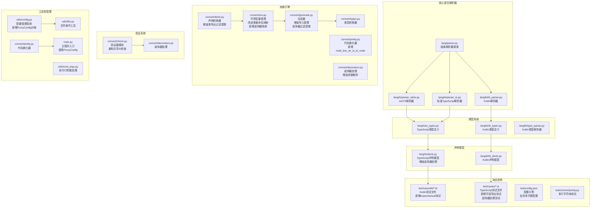

**图表来源**
- [pyproject.toml](file://pyproject.toml#L8-L12)
- [parser.py](file://lang/parser.py#L8-L59)
- [kt_parser.py](file://lang/kt/kt_parser.py#L1-L284)
- [parser_arkts.py](file://lang/ts/parser_arkts.py#L1-L313)
- [parser_ts.py](file://lang/ts/parser_ts.py#L1-L95)
- [decls.py](file://convert/decls.py#L1-L858)
- [env.py](file://convert/env.py#L1-L258)
- [check.py](file://convert/check.py#L1-L89)
- [pretty.py](file://convert/pretty.py#L1-L113)
- [decorators.py](file://convert/decorators.py#L1-L41)
- [config.py](file://utils/config.py#L52-L62)
- [generate.py](file://convert/generate.py#L92-L162)
- [main.py](file://main.py#L12-L24)
- [cmd_args.py](file://utils/cmd_args.py#L8-L36)

**章节来源**
- [pyproject.toml](file://pyproject.toml#L1-L27)

## 核心组件

### 抽象解析器基类

框架的基础是一个通用的流式解析器抽象类，提供了统一的解析接口：

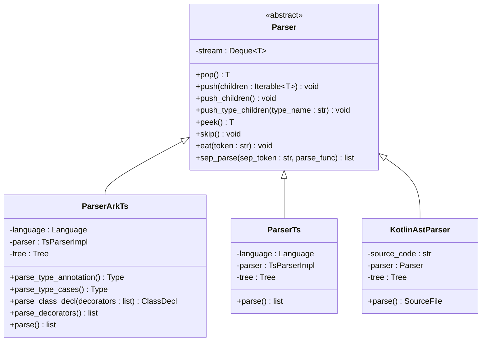

**图表来源**
- [parser.py](file://lang/parser.py#L8-L59)
- [kt_parser.py](file://lang/kt/kt_parser.py#L231-L267)
- [parser_arkts.py](file://lang/ts/parser_arkts.py#L10-L16)
- [parser_ts.py](file://lang/ts/parser_ts.py#L13-L19)

### 类型系统架构

框架实现了完整的类型系统，支持复杂的数据类型转换：

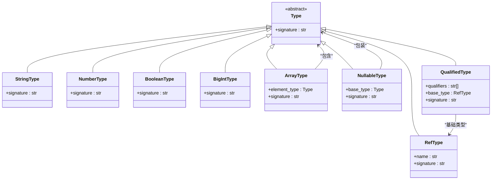

**图表来源**
- [ts_types.py](file://lang/ts/ts_types.py#L74-L78)
- [kt_types.py](file://lang/kt/kt_types.py#L51-L222)

**章节来源**
- [parser.py](file://lang/parser.py#L8-L59)
- [ts_types.py](file://lang/ts/ts_types.py#L1-L275)
- [kt_types.py](file://lang/kt/kt_types.py#L1-L283)

## 架构概览

框架采用分层架构设计，从底层的语法解析到高层的类型转换：

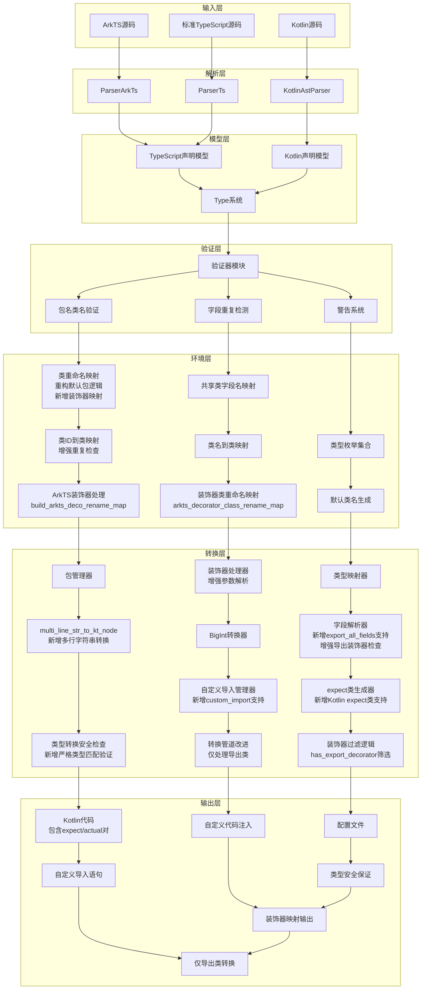

**图表来源**
- [kt_parser.py](file://lang/kt/kt_parser.py#L241-L267)
- [parser_arkts.py](file://lang/ts/parser_arkts.py#L285-L291)
- [parser_ts.py](file://lang/ts/parser_ts.py#L78-L84)
- [config.py](file://utils/config.py#L22-L83)
- [env.py](file://convert/env.py#L21-L27)
- [check.py](file://convert/check.py#L1-L89)
- [pretty.py](file://convert/pretty.py#L8-L97)
- [decls.py](file://convert/decls.py#L353-L412)
- [decls.py](file://convert/decls.py#L415-L433)
- [generate.py](file://convert/generate.py#L71-L75)

## 详细组件分析

### Kotlin 解析器组件

Kotlin解析器负责将Kotlin源码转换为内部表示：

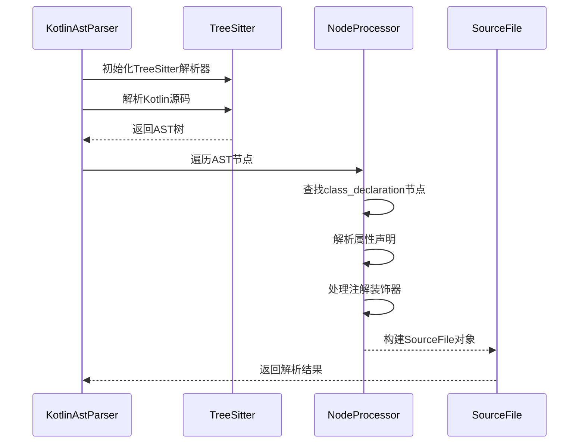

**图表来源**
- [kt_parser.py](file://lang/kt/kt_parser.py#L231-L267)
- [kt_parser.py](file://lang/kt/kt_parser.py#L140-L159)

#### 关键解析流程

Kotlin解析器支持多种类声明形式：

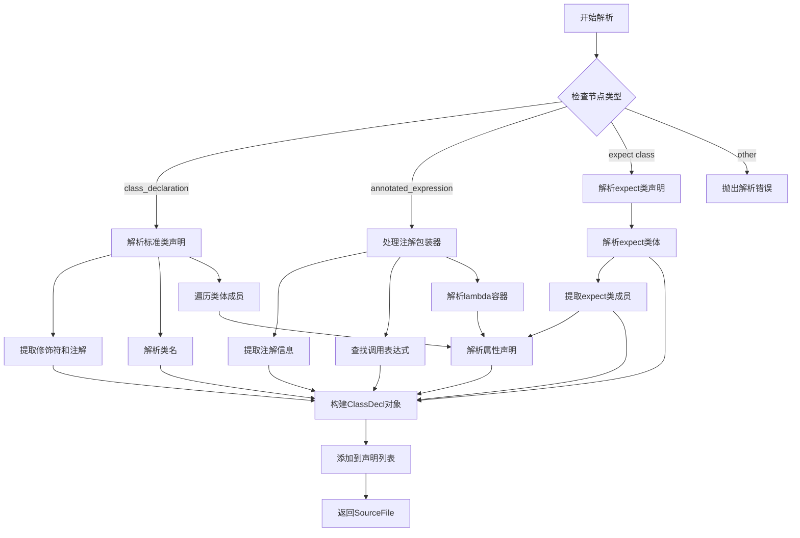

**图表来源**
- [kt_parser.py](file://lang/kt/kt_parser.py#L162-L206)
- [kt_parser.py](file://lang/kt/kt_parser.py#L104-L138)

**章节来源**
- [kt_parser.py](file://lang/kt/kt_parser.py#L1-L284)
- [kt_decls.py](file://lang/kt/kt_decls.py#L1-L57)

### TypeScript 解析器组件

TypeScript解析器包含两个版本：ArkTS专用解析器和标准TypeScript解析器。

#### ArkTS 解析器

ArkTS解析器使用继承自抽象基类的解析器实现：

```mermaid
classDiagram
class ParserArkTs {
-language : Language
-parser : TsParserImpl
-tree : Tree
-decls_list : Decl[]
+parse_type_annotation() Type
+parse_type_cases() Type
+parse_class_body() Decl[]
+parse_decorators() Decorator[]
+parse() Decl[]
}
class Parser {
<<abstract>>
-stream : Deque~Node~
+push_type_children(type_name : str) void
+sep_parse(sep_token : str, parse_func) list
+eat(token : str) void
}
Parser <|-- ParserArkTs
note for ParserArkTs : "继承流式解析模式\n支持装饰器解析\n处理类型注解\n专用于ArkTS语法"
```

**图表来源**
- [parser.py](file://lang/ts/parser_arkts.py#L10-L16)
- [parser.py](file://lang/ts/parser_arkts.py#L267-L283)

#### 标准TypeScript解析器

标准TypeScript解析器专注于基本的TypeScript语法解析：

```mermaid
classDiagram
class ParserTs {
-language : Language
-parser : TsParserImpl
-tree : Tree
+parse() list
+parse_enum_declaration() EnumDecl
+parse_enum_members() list
}
Parser <|-- ParserTs
note for ParserTs : "基础TypeScript解析\n支持枚举声明\n简化语法结构"
```

**图表来源**
- [parser_ts.py](file://lang/ts/parser_ts.py#L13-L19)
- [parser_ts.py](file://lang/ts/parser_ts.py#L21-L36)

#### 类型解析算法

ArkTS类型解析器实现了递归下降解析：

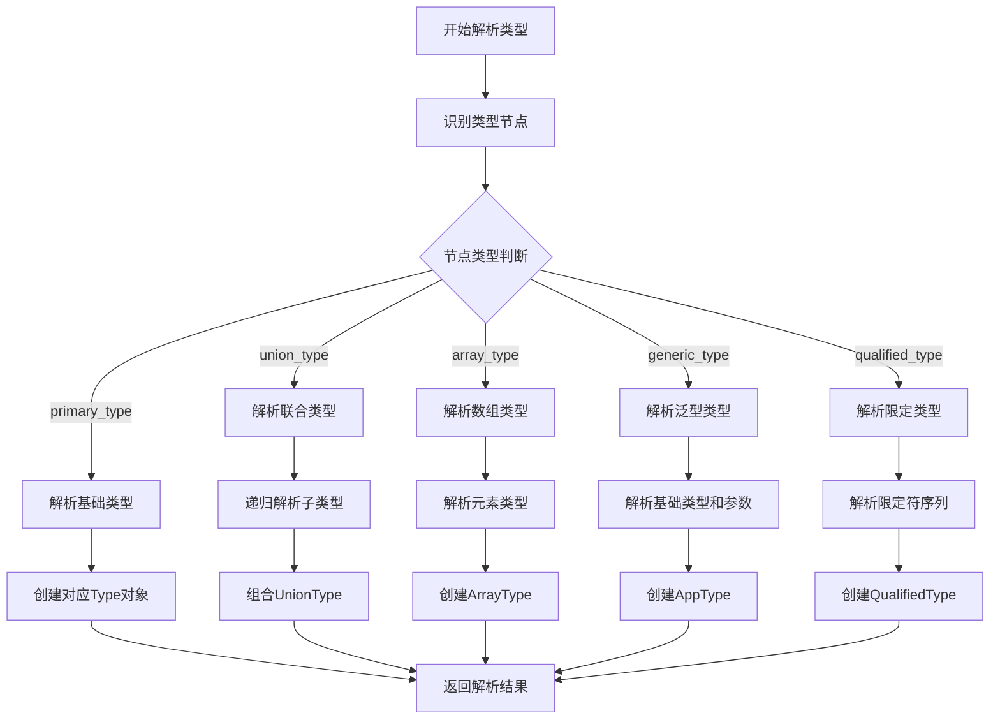

**图表来源**
- [parser_arkts.py](file://lang/ts/parser_arkts.py#L19-L80)
- [ts_types.py](file://lang/ts/ts_types.py#L106-L158)

**章节来源**
- [parser_arkts.py](file://lang/ts/parser_arkts.py#L1-L313)
- [parser_ts.py](file://lang/ts/parser_ts.py#L1-L95)
- [ts_types.py](file://lang/ts/ts_types.py#L1-L275)

### 配置管理系统

配置系统提供灵活的输出控制机制，现在通过ProxyConfig对象提供更精细的配置管理：

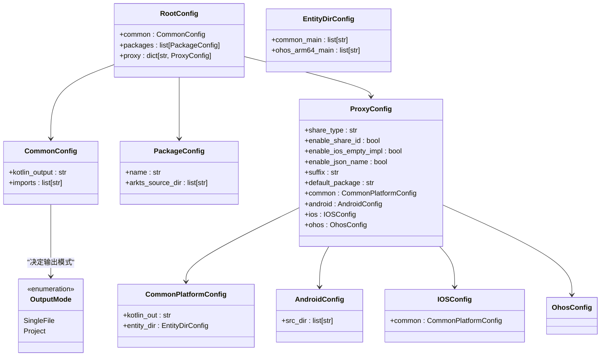

**图表来源**
- [config.py](file://utils/config.py#L9-L38)
- [config.py](file://utils/config.py#L52-L62)
- [config.py](file://utils/config.py#L123-L292)

**章节来源**
- [config.py](file://utils/config.py#L1-L367)
- [config.json](file://test/config.json#L1-L41)

### 环境管理系统

环境系统管理转换过程中的全局状态和映射关系：

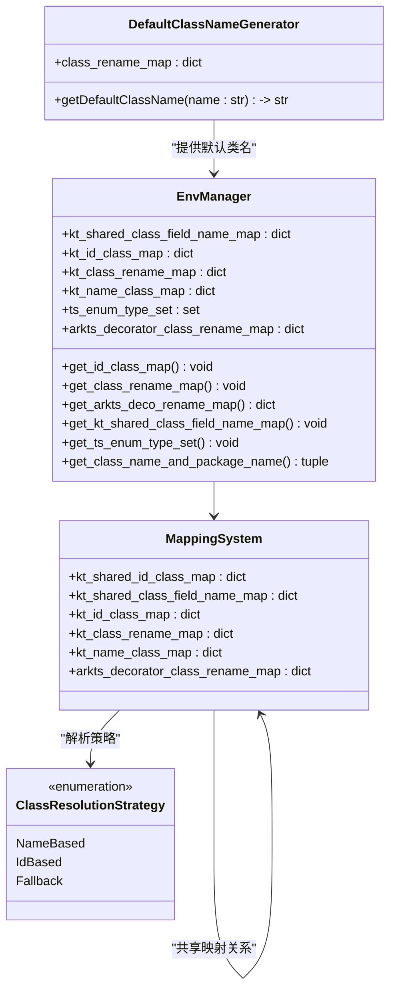

**图表来源**
- [env.py](file://convert/env.py#L21-L27)
- [env.py](file://convert/env.py#L104-L114)
- [env.py](file://convert/env.py#L140-L144)

**章节来源**
- [env.py](file://convert/env.py#L1-L258)

#### 类解析策略

环境管理系统现在支持三种类解析策略：

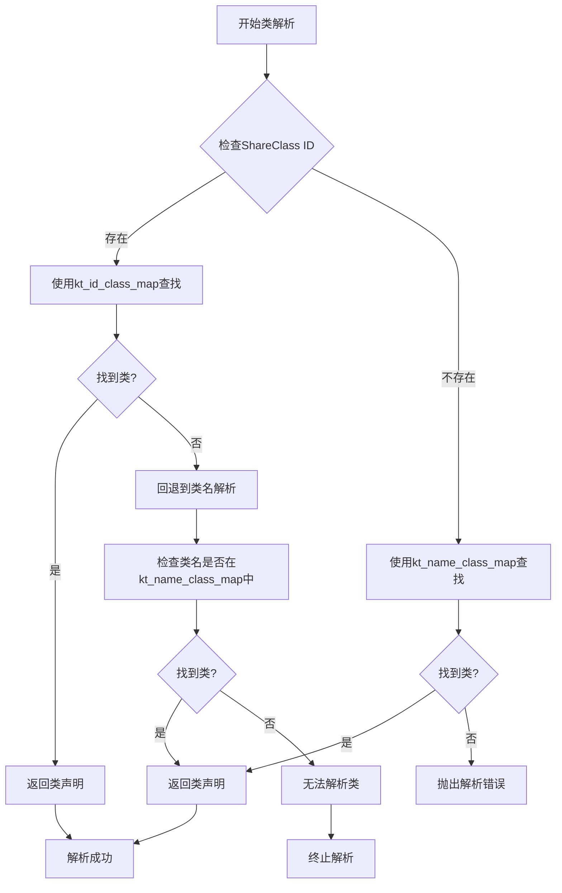

**图表来源**
- [env.py](file://convert/env.py#L33-L55)
- [decls.py](file://convert/decls.py#L448-L509)

环境管理系统现在提供统一的类名解析接口，通过`get_class_name_and_package_name`方法实现：

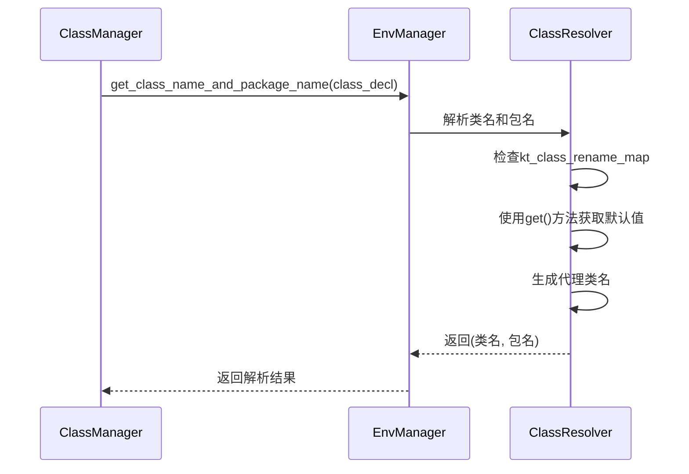

**图表来源**
- [env.py](file://convert/env.py#L221-L222)
- [decls.py](file://convert/decls.py#L324-L325)

**章节来源**
- [env.py](file://convert/env.py#L1-L258)

### 生成器组件

生成器负责协调整个转换流程，包括模块路径处理和文件输出。**更新** convert_module_paths函数现在接受ProxyConfig对象而非CliArgs，并集成了装饰器过滤逻辑：

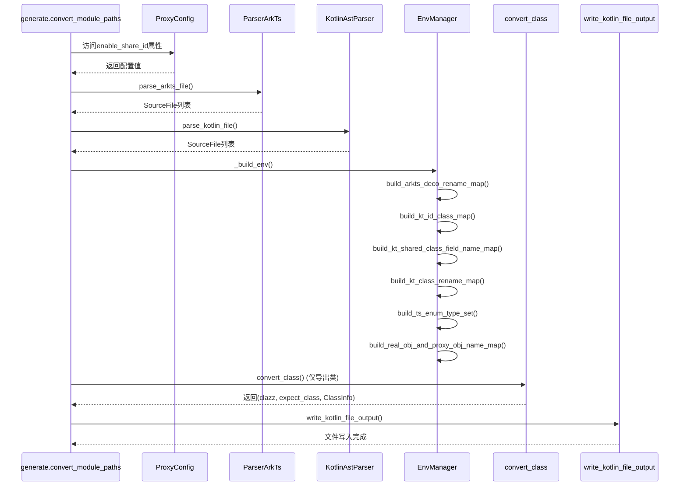

**图表来源**
- [generate.py](file://convert/generate.py#L92-L162)
- [config.py](file://utils/config.py#L52-L62)

**章节来源**
- [generate.py](file://convert/generate.py#L1-L192)

### 模块路径转换功能改进

生成器现在实现了智能的模块路径转换功能，能够正确区分和处理不同类型的TypeScript文件。**更新** 函数签名已更新为接受ProxyConfig对象，并集成了装饰器过滤逻辑：

```mermaid
flowchart TD
A[开始模块路径转换] --> B{检查文件扩展名}
B --> |.ets/.ts| C[使用ParserArkTs解析]
B --> |.ts| D[使用ParserTs解析]
C --> E[解析ArkTS文件]
D --> F[解析标准TypeScript文件]
E --> G[构建AST列表]
F --> G
G --> H[构建环境映射]
H --> I[转换类声明 (仅导出类)]
I --> J[生成Kotlin文件输出]
J --> K[写入文件系统]
```

**图表来源**
- [generate.py](file://convert/generate.py#L98-L106)
- [file.py](file://utils/file.py#L3-L4)

模块路径转换的关键实现逻辑：

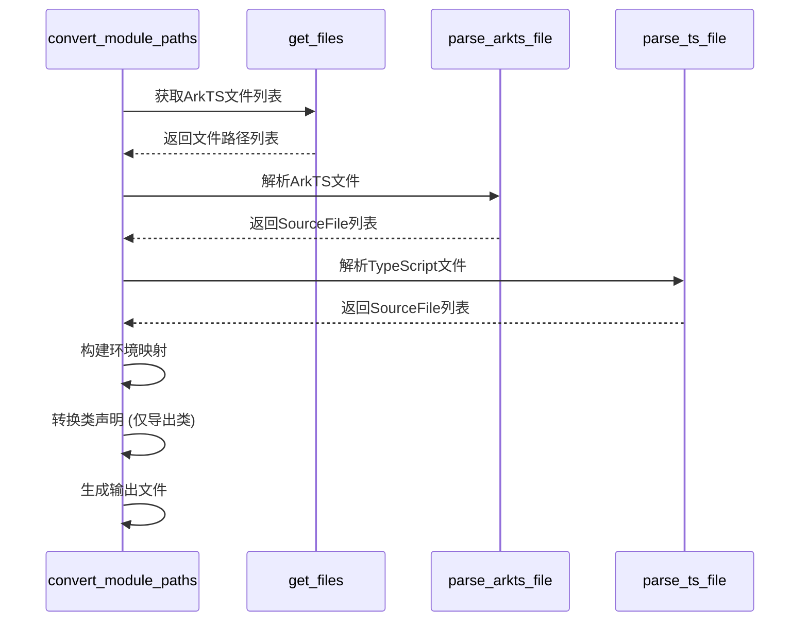

**图表来源**
- [generate.py](file://convert/generate.py#L98-L110)
- [parser_arkts.py](file://lang/ts/parser_arkts.py#L285-L291)
- [parser_ts.py](file://lang/ts/parser_ts.py#L315-L320)

**章节来源**
- [generate.py](file://convert/generate.py#L92-L192)
- [file.py](file://utils/file.py#L1-L32)

### 包声明逻辑改进

生成器现在实现了智能的包声明生成逻辑：

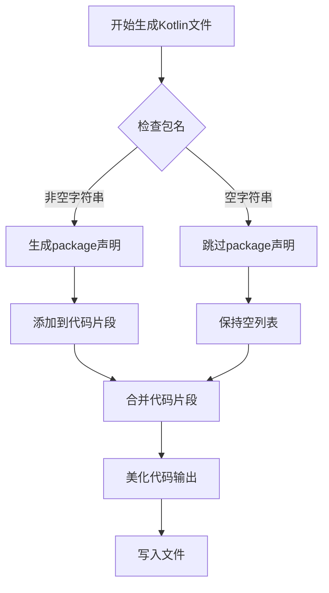

**图表来源**
- [generate.py](file://convert/generate.py#L54-L58)

包声明生成的关键实现逻辑：

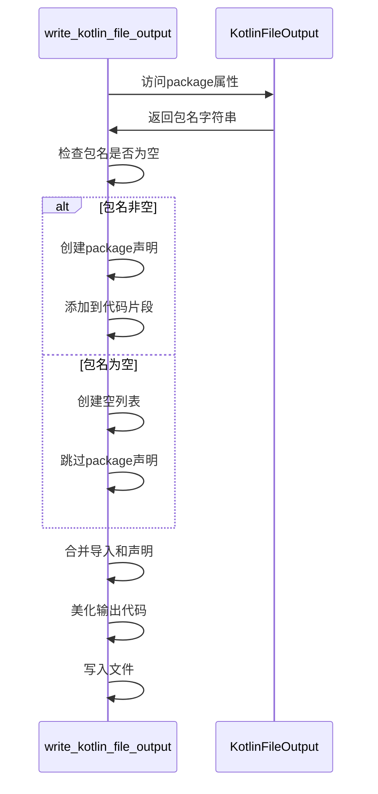

**图表来源**
- [generate.py](file://convert/generate.py#L54-L58)

**章节来源**
- [generate.py](file://convert/generate.py#L54-L58)

### BigInt类型转换系统

BigInt类型转换系统提供了完整的类型映射和转换逻辑：

```mermaid
flowchart TD
A[开始BigInt转换] --> B{检查ArkTS类型}
B --> |BigIntType| C[检查Kotlin类型]
C --> |Long类型| D[生成BigInt转换代码]
C --> |其他类型| E[抛出类型不匹配错误]
D --> F[Getter转换: toKBigInt()]
D --> G[Setter转换: toArkBigInt()]
F --> H[返回转换结果]
G --> H
E --> I[终止转换]
```

**图表来源**
- [decls.py](file://convert/decls.py#L19-L99)
- [decls.py](file://convert/decls.py#L100-L185)
- [types.py](file://convert/types.py#L20-L21)

**章节来源**
- [decls.py](file://convert/decls.py#L19-L185)
- [types.py](file://convert/types.py#L20-L21)

### multi_line_str_to_kt_node功能

**新增** multi_line_str_to_kt_node功能实现了多行字符串到KtNode的智能转换，支持缩进推断和嵌套结构生成：

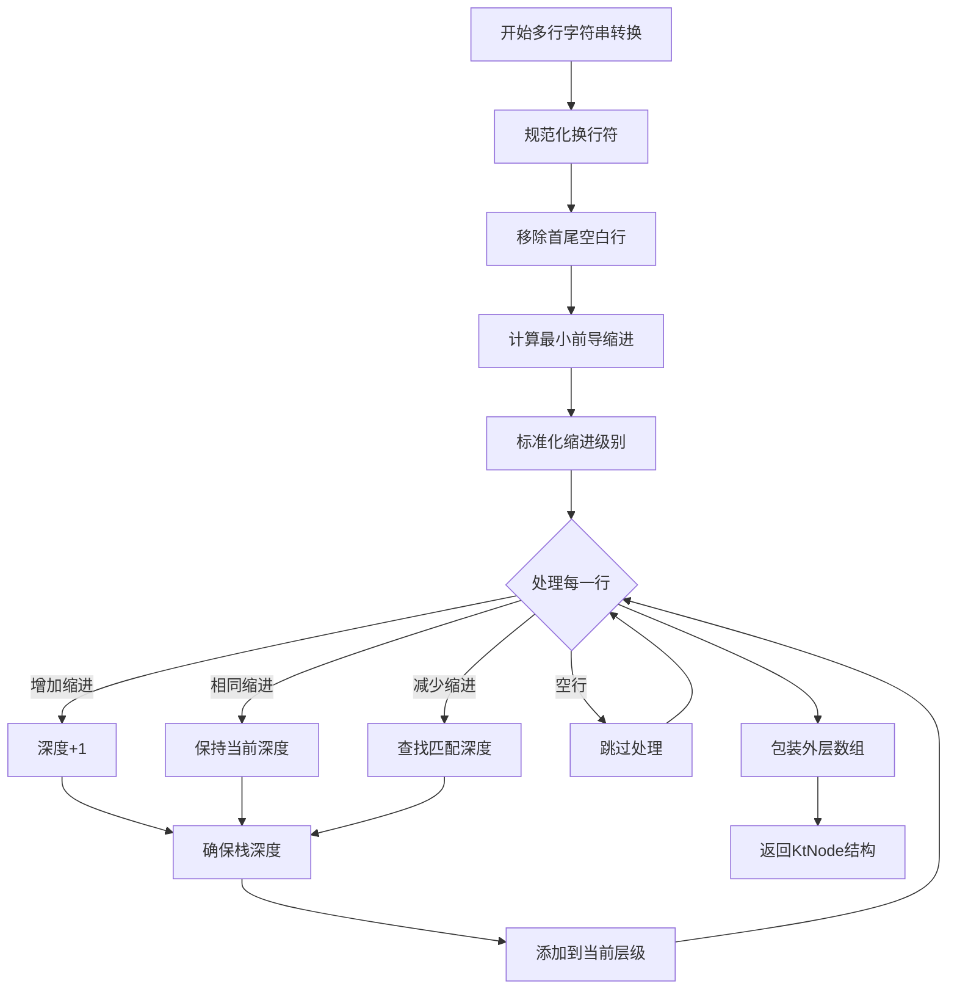

**图表来源**
- [pretty.py](file://convert/pretty.py#L8-L97)

multi_line_str_to_kt_node的关键实现逻辑：

```mermaid
sequenceDiagram
participant MLS as multi_line_str_to_kt_node
participant NL as normalize_lines
participant IL as infer_levels
MLS->>NL : 规范化换行符
NL->>IL : 计算缩进级别
IL->>MLS : 返回标准化行
MLS->>MLS : 推断嵌套深度
MLS->>MLS : 构建嵌套结构
MLS-->>MLS : 应用初始缩进包装
MLS-->>MLS : 返回KtNode
```

**图表来源**
- [pretty.py](file://convert/pretty.py#L8-L97)

**章节来源**
- [pretty.py](file://convert/pretty.py#L8-L97)
- [pretty.py](file://test/convert/pretty.py#L1-L66)

### 字段导出控制机制

**新增** 字段导出控制机制通过export_all_fields装饰器参数实现两种导出模式：

```mermaid
flowchart TD
A[开始字段导出控制] --> B{检查export_all_fields参数}
B --> |True/未设置| C[全量导出模式]
B --> |False| D[选择性导出模式]
C --> E[包含所有字段]
E --> F[排除NoExportField装饰器字段]
F --> G[生成字段声明]
D --> H[仅包含ExportField装饰器字段]
H --> I[生成字段声明]
G --> J[字段重复性检查]
I --> J
J --> K[返回字段列表]
```

**图表来源**
- [decls.py](file://convert/decls.py#L390-L401)

字段导出控制的关键实现逻辑：

```mermaid
sequenceDiagram
participant CE as convert_class
participant FC as FieldController
CE->>FC : 获取export_all_fields参数
FC->>FC : 解析装饰器键值
FC->>FC : 设置默认值(真)
FC->>FC : 执行字段过滤逻辑
FC->>FC : 执行重复性检查
FC-->>CE : 返回过滤后的字段
```

**图表来源**
- [decls.py](file://convert/decls.py#L387-L432)

**章节来源**
- [decls.py](file://convert/decls.py#L387-L432)
- [decls.py](file://lang/ts/decls.py#L76-L101)

### 自定义代码注入支持

**新增** 自定义代码注入支持通过custom_code装饰器参数实现灵活的代码注入：

```mermaid
flowchart TD
A[开始自定义代码注入] --> B{检查custom_code参数}
B --> |存在| C[获取多行字符串]
C --> D[转换为KtNode结构]
D --> E[应用缩进推断]
E --> F[插入到类定义中]
B --> |不存在| G[跳过注入]
F --> H[返回完整类定义]
G --> H
```

**图表来源**
- [decls.py](file://convert/decls.py#L438-L441)

自定义代码注入的关键实现逻辑：

```mermaid
sequenceDiagram
participant CC as convert_class
participant ML as multi_line_str_to_kt_node
participant CK as CodeInjector
CC->>CK : 检查custom_code装饰器
CK->>ML : 转换多行字符串
ML->>CK : 返回KtNode结构
CK->>CK : 插入到类定义中
CK-->>CC : 返回完整代码
```

**图表来源**
- [decls.py](file://convert/decls.py#L438-L441)
- [pretty.py](file://convert/pretty.py#L8-L97)

**章节来源**
- [decls.py](file://convert/decls.py#L438-L441)
- [class11.ts](file://test/cases/class11.ts#L2-L6)

### 新增自定义导入功能支持

**新增** 自定义导入功能支持通过custom_import装饰器参数实现灵活的导入语句生成：

```mermaid
flowchart TD
A[开始自定义导入处理] --> B{检查custom_import参数}
B --> |存在| C[解析导入列表]
C --> D[转换为import语句]
D --> E[添加到ClassInfo.custom_import_list]
E --> F[合并到最终导入列表]
B --> |不存在| G[跳过导入处理]
F --> H[返回包含自定义导入的类信息]
G --> H
```

**图表来源**
- [decls.py](file://convert/decls.py#L468-L469)
- [generate.py](file://convert/generate.py#L71-L75)

自定义导入处理的关键实现逻辑：

```mermaid
sequenceDiagram
participant CC as convert_class
participant CI as ClassInfo
participant GI as generate._get_custom_imports
CC->>CI : 创建ClassInfo实例
CI->>CI : 设置custom_import_list
CC->>GI : 调用_get_custom_imports
GI->>GI : 遍历custom_import_list
GI->>GI : 转换为import语句
GI-->>CC : 返回import语句列表
CC-->>CC : 返回(clazz, expect_class, ClassInfo)
```

**图表来源**
- [decls.py](file://convert/decls.py#L468-L469)
- [generate.py](file://convert/generate.py#L71-L75)

**章节来源**
- [decls.py](file://convert/decls.py#L468-L469)
- [generate.py](file://convert/generate.py#L71-L75)
- [class12.ts](file://test/cases/class12.ts#L1-L4)

### 增强的类转换功能

**新增** KotlinExportClass注解系统和改进的类转换逻辑：

```mermaid
flowchart TD
A[开始类转换] --> B[获取类名和包名]
B --> C[生成构造函数]
C --> D[解析字段导出模式]
D --> E{检查export_all_fields参数}
E --> |True/未设置| F[全量导出]
E --> |False| G[选择性导出]
F --> H[包含所有字段]
G --> I[仅包含ExportField字段]
H --> J[字段重复性检查]
I --> J
J --> K[生成自定义代码注入]
K --> L[生成expect类声明]
L --> M[生成转换器]
M --> N[生成代理函数]
N --> O[生成ClassInfo实例]
O --> P[返回完整类定义和expect类]
```

**图表来源**
- [decls.py](file://convert/decls.py#L377-L471)

类转换的关键实现逻辑：

```mermaid
sequenceDiagram
participant CC as convert_class
participant EC as ExportController
participant MC as MultiLineConverter
participant EL as ExpectClassGenerator
CC->>EC : 解析export_all_fields参数
EC->>MC : 转换custom_code多行字符串
MC->>EL : 生成expect类声明
EL->>CC : 返回expect_class
CC->>CC : 生成字段声明
CC->>CC : 生成转换器
CC->>CC : 生成代理函数
CC->>CC : 创建ClassInfo实例
CC-->>CC : 返回(clazz, expect_class, ClassInfo)
```

**图表来源**
- [decls.py](file://convert/decls.py#L377-L471)
- [pretty.py](file://convert/pretty.py#L8-L97)

**章节来源**
- [decls.py](file://convert/decls.py#L377-L471)
- [class11.ts](file://test/cases/class11.ts#L1-L14)

### 新增expect类生成功能

**新增** expect类生成功能支持Kotlin expect/actual模式的完整实现：

```mermaid
flowchart TD
A[开始expect类生成] --> B[提取类名和字段声明]
B --> C[生成expect class声明]
C --> D[应用字段声明到expect类]
D --> E[生成expect类体]
E --> F[返回expect类结构]
F --> G[与actual类形成完整对]
```

**图表来源**
- [decls.py](file://convert/decls.py#L448-L454)

expect类生成的关键实现逻辑：

```mermaid
sequenceDiagram
participant CC as convert_class
participant EC as ExpectClassGenerator
CC->>EC : 传入prop_decls
EC->>EC : 构建expect class头
EC->>EC : 添加字段声明
EC->>EC : 生成expect class体
EC-->>CC : 返回expect_class
```

**图表来源**
- [decls.py](file://convert/decls.py#L448-L454)

**章节来源**
- [decls.py](file://convert/decls.py#L448-L454)
- [class1.kt](file://test/cases/kt/class1.kt#L12-L17)

### 改进的构造函数处理

构造函数处理系统提供了完整的构造函数生成逻辑：

```mermaid
flowchart TD
A[开始构造函数生成] --> B{检查模块路径}
B --> |存在| C[生成带模块路径的构造函数]
B --> |不存在| D[生成基础构造函数]
C --> E[生成参数化构造函数]
E --> F[生成无参数构造函数]
F --> G[添加tryCreate调用]
G --> H[返回构造函数列表]
D --> I[生成基础参数化构造函数]
I --> J[返回构造函数列表]
H --> K[合并构造函数]
K --> L[返回完整构造函数]
```

**图表来源**
- [decls.py](file://convert/decls.py#L590-L688)

构造函数生成的关键实现逻辑：

```mermaid
sequenceDiagram
participant CF as convert_class_constructor
participant CN as ConstructorGenerator
CF->>CN : 生成基础构造函数
CN->>CN : 创建参数化构造函数
CN->>CN : 创建无参数构造函数
CN->>CN : 添加tryCreate调用
CN-->>CF : 返回构造函数列表
CF->>CF : 合并构造函数
CF-->>CF : 返回完整构造函数
```

**图表来源**
- [decls.py](file://convert/decls.py#L590-L688)

**章节来源**
- [decls.py](file://convert/decls.py#L590-L688)

### 增强的类重命名映射逻辑

**更新** 默认包类重命名映射逻辑已重构，优化了类名生成和重复检查机制：

```mermaid
flowchart TD
A[开始类重命名映射] --> B{检查装饰器配置}
B --> |id指定| C[使用_share_id映射]
B --> |package指定| D[使用包名+类名映射]
B --> |默认情况| E[使用默认包名+代理后缀]
C --> F[检查ID重复]
F --> G[生成重命名映射]
D --> H[检查包名有效性]
H --> I[检查类名重复]
I --> J[生成重命名映射]
E --> K[检查默认包名]
K --> L[检查类名重复]
L --> M[生成重命名映射]
G --> N[返回映射结果]
J --> N
M --> N
```

**图表来源**
- [env.py](file://convert/env.py#L131-L154)

类重命名映射的关键实现逻辑：

```mermaid
sequenceDiagram
participant BRM as build_kt_class_rename_map
participant ID as _get_kt_class_rename_map_by_id
participant PN as _get_kt_class_rename_map_by_name
participant DN as _get_kt_class_rename_map_by_default
BRM->>ID : 处理ID映射
ID->>ID : 检查ID重复
ID->>ID : 生成重命名映射
BRM->>PN : 处理包名映射
PN->>PN : 检查包名有效性
PN->>PN : 检查类名重复
PN->>PN : 生成重命名映射
BRM->>DN : 处理默认映射
DN->>DN : 检查默认包名
DN->>DN : 检查类名重复
DN->>DN : 生成重命名映射
ID-->>BRM : 返回映射
PN-->>BRM : 返回映射
DN-->>BRM : 返回映射
BRM-->>BRM : 合并所有映射
```

**图表来源**
- [env.py](file://convert/env.py#L131-L154)

**章节来源**
- [env.py](file://convert/env.py#L131-L154)

### 重构的共享类ID重复检查逻辑

**更新** 共享类ID重复检查逻辑已重构，增强了同包名下ID重复的检查范围：

```mermaid
flowchart TD
A[开始ID重复检查] --> B{检查ID是否已存在}
B --> |不存在| C[直接添加ID映射]
B --> |存在| D{检查包名是否相同}
D --> |不同包| E[允许重复跨包]
D --> |相同包| F[抛出重复错误]
C --> G[返回成功]
E --> G
F --> H[抛出错误1004]
```

**图表来源**
- [env.py](file://convert/env.py#L36-L46)

共享类ID重复检查的关键实现逻辑：

```mermaid
sequenceDiagram
participant CID as _check_and_handle_share_class_id
participant CIM as cache.kt_id_class_map
CID->>CIM : 检查ID是否已存在
alt ID不存在
CIM-->>CID : 返回False
CID->>CID : 直接添加映射
CID-->>CID : 返回成功
else ID已存在
CIM-->>CID : 返回现有ID信息
CID->>CID : 检查包名是否相同
alt 不同包名
CID->>CID : 允许重复
CID-->>CID : 返回成功
else 相同包名
CID->>CID : 抛出重复错误
CID-->>CID : 终止检查
end
end
```

**图表来源**
- [env.py](file://convert/env.py#L36-L46)

**章节来源**
- [env.py](file://convert/env.py#L36-L46)

### 新增 ArkTS 装饰器处理系统

**新增** ArkTS装饰器处理系统集成了装饰器级别的类重命名映射功能：

```mermaid
flowchart TD
A[开始装饰器处理] --> B[遍历ArkTS声明]
B --> C{检查是否为ClassDecl}
C --> |是| D{检查是否带有导出装饰器}
D --> |是| E[获取装饰器参数]
E --> F{检查name和package参数}
F --> |存在| G[生成装饰器映射]
F --> |不存在| H[跳过处理]
D --> |否| I[跳过处理]
C --> |否| J[跳过处理]
G --> K[添加到arkts_decorator_class_rename_map]
H --> K
I --> K
J --> K
K --> L[返回装饰器映射结果]
```

**图表来源**
- [env.py](file://convert/env.py#L229-L238)

装饰器处理的关键实现逻辑：

```mermaid
sequenceDiagram
participant BDM as build_arkts_deco_rename_map
participant AD as ArkTS装饰器
participant AM as arkts_decorator_class_rename_map
BDM->>AD : 遍历ClassDecl
AD->>AD : 检查has_export_decorator()
AD->>AD : 获取装饰器参数(name, package)
AD->>AM : 生成(类名, 包名)映射
AM-->>BDM : 返回装饰器映射
```

**图表来源**
- [env.py](file://convert/env.py#L229-L238)

**章节来源**
- [env.py](file://convert/env.py#L229-L238)

### 改进的转换管道逻辑

**更新** 转换管道现在集成了装饰器过滤逻辑，仅处理带有导出装饰器的类：

```mermaid
flowchart TD
A[开始转换管道] --> B[解析ArkTS文件]
B --> C[构建ArkTS AST列表]
C --> D[解析Kotlin文件]
D --> E[构建Kotlin AST列表]
E --> F[构建环境映射]
F --> G[build_arkts_deco_rename_map]
G --> H[build_kt_id_class_map]
H --> I[build_kt_shared_class_field_name_map]
I --> J[build_kt_class_rename_map]
J --> K[build_ts_enum_type_set]
K --> L[build_real_obj_and_proxy_obj_name_map]
L --> M[转换类声明]
M --> N{检查has_export_decorator}
N --> |True| O[执行convert_class]
N --> |False| P[跳过转换]
O --> Q[生成Kotlin代码]
P --> Q
Q --> R[写入文件输出]
```

**图表来源**
- [generate.py](file://convert/generate.py#L76-L89)
- [generate.py](file://convert/generate.py#L132-L133)
- [generate.py](file://convert/generate.py#L167-L168)

转换管道的关键实现逻辑：

```mermaid
sequenceDiagram
participant CP as convert_module_paths
participant BE as _build_env
participant DC as has_export_decorator
CP->>BE : 构建环境映射
BE->>DC : 检查类是否带有导出装饰器
DC->>DC : 遍历ArkTS声明
DC->>DC : 调用has_export_decorator()
DC-->>BE : 返回导出类列表
BE-->>CP : 返回环境映射
CP->>CP : 转换导出类
CP-->>CP : 生成输出文件
```

**图表来源**
- [generate.py](file://convert/generate.py#L76-L89)
- [decls.py](file://lang/ts/decls.py#L94-L95)

**章节来源**
- [generate.py](file://convert/generate.py#L76-L192)
- [decls.py](file://lang/ts/decls.py#L94-L95)

## 类型转换安全检查

### get_setter_prop_transformer 函数类型验证逻辑

**新增** get_setter_prop_transformer 函数实现了严格的类型转换安全检查，确保TypeScript和Kotlin类型之间的精确匹配。该函数通过模式匹配和断言机制防止类型不兼容的转换。

```mermaid
flowchart TD
A[开始类型转换验证] --> B{检查ArkTS类型和Kotlin类型匹配}
B --> |NumberType + PrimType| C[执行严格数字类型检查]
B --> |BooleanType + Boolean| D[执行布尔类型检查]
B --> |StringType + String| E[执行字符串类型检查]
B --> |其他类型| F[执行通用类型检查]
C --> G{验证PrimTypeEnum是否在number_type集合中}
G --> |是| H[通过类型检查]
G --> |否| I[触发assert断言错误]
H --> J[生成转换代码]
I --> K[抛出TypeError错误]
D --> L[生成布尔转换代码]
E --> M[生成字符串转换代码]
F --> N[执行通用类型转换逻辑]
N --> O[检查可空类型兼容性]
O --> P[生成相应转换代码]
P --> Q[返回转换结果]
K --> R[终止转换流程]
```

**图表来源**
- [decls.py](file://convert/decls.py#L105-L202)
- [kt_types.py](file://lang/kt/kt_types.py#L52-L62)

### TypeScript 到 Kotlin 类型严格匹配检查

get_setter_prop_transformer 函数实现了以下关键的类型验证逻辑：

#### 数字类型严格匹配

```mermaid
sequenceDiagram
participant GST as get_setter_prop_transformer
participant NT as NumberType
participant PT as PrimType
participant KT as number_type集合
GST->>NT : 检查NumberType匹配
NT->>PT : 匹配PrimType(prim_enum)
PT->>KT : 验证prim_enum是否在number_type中
alt prim_enum在number_type集合中
KT->>GST : 返回True
GST->>GST : 执行assert断言
GST->>GST : 生成it.toArkNumber()转换
else prim_enum不在number_type集合中
KT->>GST : 返回False
GST->>GST : 触发assert断言失败
GST->>GST : 抛出TypeError错误
end
```

**图表来源**
- [decls.py](file://convert/decls.py#L113-L115)
- [kt_types.py](file://lang/kt/kt_types.py#L52-L62)

#### 布尔类型和字符串类型检查

```mermaid
flowchart TD
A[布尔类型检查] --> B[NumberType + Boolean] --> C[生成it.toArkBoolean()转换]
D[字符串类型检查] --> E[NumberType + String] --> F[生成it.toArkString()转换]
G[严格类型匹配] --> H[assert prim_enum in number_type]
H --> I[确保数字类型精确匹配]
```

**图表来源**
- [decls.py](file://convert/decls.py#L117-L121)

### assert 语句确保类型兼容性

**新增** 在 get_setter_prop_transformer 函数中，通过 assert 语句确保TypeScript NumberType与Kotlin数字类型之间的严格匹配：

```mermaid
flowchart TD
A[开始数字类型转换] --> B[匹配NumberType + PrimType]
B --> C[提取PrimTypeEnum]
C --> D[执行assert断言]
D --> E{prim_enum ∈ number_type?}
E --> |是| F[通过类型检查]
E --> |否| G[触发断言错误]
F --> H[生成toArkNumber()转换代码]
G --> I[抛出TypeError: cannot convert arkts type ...]
```

**图表来源**
- [decls.py](file://convert/decls.py#L113-L115)

assert 语句的作用机制：

1. **编译时验证**：在类型转换过程中立即验证类型兼容性
2. **精确匹配**：确保TypeScript NumberType只能转换为Kotlin数字类型集合中的类型
3. **运行时保护**：防止类型不匹配导致的运行时错误
4. **早期失败**：在转换阶段就发现类型问题，避免后续处理中的错误

### 类型转换错误处理

当类型不匹配时，get_setter_prop_transformer 函数会抛出详细的错误信息：

```mermaid
flowchart TD
A[类型转换失败] --> B[捕获TypeError异常]
B --> C[检查具体错误类型]
C --> |数字类型不匹配| D[显示具体的PrimTypeEnum信息]
C --> |其他类型不匹配| E[显示ArkTS类型和Kotlin类型信息]
D --> F[提供修复建议]
E --> F
F --> G[停止转换流程]
```

**图表来源**
- [decls.py](file://convert/decls.py#L198-L201)

**章节来源**
- [decls.py](file://convert/decls.py#L105-L202)
- [kt_types.py](file://lang/kt/kt_types.py#L52-L62)
- [ts_types.py](file://lang/ts/ts_types.py#L66-L86)

## 增强的验证系统

### 验证器模块架构

验证系统提供了独立的验证功能，包括字段重复检测、包名类名验证和警告系统集成：

```mermaid
classDiagram
class ValidationSystem {
<<module>>
+kotlin_keyword : set[str]
+check_kotlin_class_name(name : str) -> None
+check_kotlin_package_name(name : str) -> None
+check_kotlin_field_name(name : str) -> None
}
class FieldValidator {
+used_field_ids : set[str]
+used_field_names : set[str]
+validate_field_id(field_id : str) -> None
+validate_field_name(field_name : str) -> None
}
class NameValidator {
+pkg_class_names : dict[str, set[str]]
+validate_class_name(name : str, package : str) -> None
+validate_package_name(name : str) -> None
}
class WarningSystem {
+warnings : list[str]
+warn(message : str) -> None
+get_warnings() -> list[str]
}
ValidationSystem --> FieldValidator
ValidationSystem --> NameValidator
ValidationSystem --> WarningSystem
```

**图表来源**
- [check.py](file://convert/check.py#L1-L89)
- [env.py](file://convert/env.py#L30-L108)
- [decls.py](file://convert/decls.py#L187-L238)

### 字段重复检测机制

字段验证系统实现了双重检测机制，确保字段ID和字段名的唯一性：

```mermaid
flowchart TD
A[开始字段验证] --> B{检查字段ID}
B --> |存在| C[检查ID是否重复]
B --> |不存在| D[检查字段名]
C --> E{ID重复?}
E --> |是| F[抛出错误2003]
E --> |否| G[继续验证]
D --> H{字段名重复?}
H --> |是| I[抛出错误2002]
H --> |否| J[继续验证]
G --> K[检查关键字]
J --> K
K --> L{关键字检查}
L --> |是| M[抛出错误1001]
L --> |否| N[检查格式]
M --> O[终止验证]
N --> P{字符格式检查}
P --> |是| Q[验证通过]
P --> |否| R[抛出错误1001]
Q --> S[返回字段信息]
R --> O
F --> T[终止转换]
I --> T
```

**图表来源**
- [decls.py](file://convert/decls.py#L187-L238)
- [check.py](file://convert/check.py#L62-L89)

### 包名类名验证规则

验证系统实现了严格的命名规范检查：

```mermaid
flowchart TD
A[开始命名验证] --> B{检查包名}
B --> C[检查空值]
C --> D[检查点号位置]
D --> E[检查连续点号]
E --> F[分割包名段]
F --> G[验证每段内容]
G --> H{段名有效?}
H --> |是| I[检查关键字]
H --> |否| J[抛出错误1002]
I --> K{关键字检查}
K --> |是| L[抛出错误1002]
K --> |否| M[检查字符格式]
L --> N[终止验证]
M --> O{字符有效?}
O --> |是| P[验证通过]
O --> |否| Q[抛出错误1002]
P --> R[返回包名]
Q --> N
J --> N
```

**图表来源**
- [check.py](file://convert/check.py#L26-L61)
- [env.py](file://convert/env.py#L82-L107)

**章节来源**
- [check.py](file://convert/check.py#L1-L89)
- [decls.py](file://convert/decls.py#L187-L238)
- [env.py](file://convert/env.py#L30-L108)

## 错误处理机制

### 结构化错误代码系统

框架实现了结构化的错误代码系统，为不同类型的问题提供明确的标识：

| 错误代码 | 错误类型 | 描述 | 触发条件 |
|---------|---------|------|----------|
| 1001 | 类名验证错误 | Kotlin类名无效 | 类名为空、包含关键字、格式不正确 |
| 1002 | 包名验证错误 | Kotlin包名无效 | 包名为空、格式不正确、包含关键字 |
| 1003 | 类名重复错误 | 同包内类名重复 | 同一包下类名冲突 |
| 1004 | ID重复错误 | ID重复定义 | ID或ShareClass ID重复 |
| 1007 | ShareId限制错误 | ShareId不允许用于此类 | enable_share_id配置为False |
| 1008 | ShareId未找到错误 | ShareId在映射中不存在 | ShareId未在kt_id_class_map中找到 |
| 1009 | 装饰器配置冲突 | id和name/package同时指定 | 装饰器参数冲突 |
| 2001 | 字段名验证错误 | Kotlin字段名无效 | 字段名为空、格式不正确 |
| 2002 | 字段名重复错误 | 字段名重复 | 字段名在同一类中重复 |
| 2003 | 字段ID重复错误 | 字段ID重复 | ShareField ID重复 |
| 3001 | expect类生成错误 | expect类声明无效 | expect类语法错误或格式不正确 |
| 3002 | 自定义导入错误 | 自定义导入语句无效 | import语句格式错误或路径不正确 |
| 3003 | 类信息传递错误 | ClassInfo结构错误 | custom_import_list字段缺失或格式不正确 |
| 4001 | 类型转换错误 | 类型不匹配 | TypeScript类型与Kotlin类型不兼容 |
| 4002 | 数字类型验证错误 | 数字类型断言失败 | NumberType与非数字Kotlin类型匹配 |
| 5001 | 装饰器处理错误 | 装饰器映射失败 | arkts_decorator_class_rename_map处理错误 |
| 5002 | 导出类过滤错误 | 导出装饰器检查失败 | has_export_decorator方法调用错误 |

### 警告系统集成

警告系统在不影响转换流程的情况下提供运行时提示：

```mermaid
sequenceDiagram
participant V as 验证器
participant W as 警告系统
participant U as 用户
V->>W : 检测到潜在问题
W->>U : 发出警告消息
U->>U : 继续转换过程
Note over V,W : 警告不影响转换结果
Note over U : 用户可选择忽略或修复
```

**图表来源**
- [decls.py](file://convert/decls.py#L201-L204)
- [env.py](file://convert/env.py#L76)

**章节来源**
- [decls.py](file://convert/decls.py#L191-L214)
- [env.py](file://convert/env.py#L65-L76)
- [check.py](file://convert/check.py#L14-L24)

## 依赖关系分析

项目依赖关系清晰，主要外部依赖包括 Tree-Sitter 解析器：

```mermaid
graph LR
subgraph "项目包"
A[arkts-ffi-kt]
B[convert]
C[lang]
D[utils]
E[test]
end
subgraph "外部依赖"
F[tree-sitter]
G[tree-sitter-arkts-open]
H[tree-sitter-kotlin]
I[tree-sitter-typescript]
J[typing-extensions]
K[unittest]
end
A --> B
A --> C
A --> D
A --> E
C --> F
C --> G
C --> H
C --> I
D --> J
E --> K
B --> L[环境管理器]
B --> M[类型转换器]
B --> N[声明转换器]
B --> O[验证器模块]
B --> P[装饰器处理器]
B --> Q[multi_line_str_to_kt_node]
B --> R[expect类生成器]
B --> S[自定义导入管理器]
B --> T[类型转换安全检查]
B --> U[装饰器类重命名映射]
B --> V[装饰器过滤逻辑]
C --> W[TypeScript声明模型]
C --> X[Kotlin声明模型]
```

**图表来源**
- [pyproject.toml](file://pyproject.toml#L15-L22)

**章节来源**
- [pyproject.toml](file://pyproject.toml#L1-L27)

## 性能考虑

框架在设计时考虑了以下性能优化：

1. **流式解析**: 使用双端队列作为解析流，避免重复扫描
2. **延迟解析**: 类型解析采用递归下降算法，按需解析
3. **内存管理**: 使用数据类减少内存开销
4. **缓存策略**: AST解析结果可复用，避免重复解析
5. **共享映射**: 使用全局映射表避免重复计算
6. **验证优化**: 独立验证模块减少重复验证开销
7. **警告系统**: 运行时警告避免阻塞转换流程
8. **结构化错误**: 提前发现和报告错误，减少后续处理成本
9. **模块化导入**: 优化模块导入顺序，减少循环依赖
10. **类型系统优化**: ArkTS专用解析器针对性优化
11. **增强环境管理**：重构类名映射系统，提供安全的get()方法访问
12. **默认类名生成**：通过getDefaultClassName提供智能默认值
13. **BigInt类型优化**：专门的类型转换器减少不必要的转换开销
14. **架构改进**：类名解析逻辑已整合到环境管理系统中，提供更好的一致性管理和命名方案
15. **代理类生成优化**：通过智能默认代理名称生成提升类解析的可靠性
16. **转换器生成流程改进**：优化ShareClass ID解析和类重命名映射流程
17. **增强验证系统**：新增ShareClass ID重复检查和类名唯一性验证机制
18. **改进包声明逻辑**：当包名为空字符串时不生成包声明，提升代码生成质量
19. **模块路径转换功能改进**：修复文件处理逻辑，确保ArkTS和TypeScript文件使用正确的解析器
20. **新增KotlinExportClass注解系统**：通过注解增强类导出功能，提供更好的类型安全性和转换性能
21. **改进构造函数处理**：优化参数化和无参数构造函数的生成逻辑，提升代码生成效率
22. **新增multi_line_str_to_kt_node功能**：高效的多行字符串转换算法，支持缩进推断和嵌套结构生成
23. **增强字段导出控制机制**：智能的字段过滤逻辑，支持两种导出模式
24. **自定义代码注入支持**：灵活的代码注入机制，支持复杂的自定义逻辑
25. **改进装饰器参数解析**：增强的参数解析能力，支持嵌套参数的深度解析
26. **增强类转换功能**：新增KotlinExportClass注解系统，提供更好的类导出功能
27. **改进字段导出控制**：通过export_all_fields装饰器参数实现灵活的字段导出控制
28. **增强自定义代码注入**：通过custom_code装饰器参数实现灵活的自定义代码注入
29. **优化构造函数处理**：改进参数化和无参数构造函数的生成逻辑
30. **配置管理优化**：通过ProxyConfig对象提供更精细的配置管理，简化函数接口
31. **新增expect类生成功能**：支持Kotlin expect/actual模式，提升类型安全性
32. **自定义导入功能优化**：通过custom_import装饰器参数支持灵活的导入语句生成
33. **增强的类信息传递**：改进的ClassInfo结构支持custom_import_list字段
34. **导入管理优化**：新增_get_custom_imports函数和_imports合并逻辑
35. **生成器功能增强**：convert_module_paths函数支持expect类的单独输出
36. **新增类型转换安全检查**：通过get_setter_prop_transformer函数实现严格的类型验证
37. **新增严格类型匹配检查**：确保TypeScript NumberType、BooleanType、StringType与Kotlin类型的精确匹配
38. **新增assert语句验证机制**：在编译时验证类型兼容性，防止运行时类型错误
39. **增强类导出过滤逻辑**：在类处理循环中增加了导出装饰器检查，支持NoExportField和ExportField装饰器的精确控制
40. **改进默认包类重命名映射逻辑**：重构_build_kt_class_rename_map函数，优化了默认包类名生成和重复检查机制
41. **重构共享类ID重复检查逻辑**：改进_check_and_handle_share_class_id函数，增强了同包名下ID重复的检查范围
42. **集成 ArkTS 装饰器处理**：在环境初始化时调用 build_arkts_deco_rename_map() 函数，专门处理带有导出装饰器的类
43. **更新类转换逻辑**：类转换现在仅处理带有导出装饰器的类，通过 has_export_decorator() 方法进行筛选
44. **新增装饰器类重命名映射**：引入 arkts_decorator_class_rename_map 缓存，支持装饰器级别的类名和包名映射
45. **增强装饰器处理机制**：装饰器解析现在支持 name 和 package 参数的装饰器级重命名
46. **改进转换管道**：convert_module_paths 函数现在使用装饰器过滤逻辑，仅转换标记为导出的类

## 故障排除指南

### 常见转换错误

1. **类重命名映射缺失**: `[KeyError] id not found in kt_class_rename_map`
   - 检查ShareClass注解的ID是否在Kotlin代码中正确定义
   - 确保ShareClass和ShareField注解的ID匹配
   - 使用getDefaultClassName生成默认代理名称

2. **字段映射缺失**: `[KeyError] field not found in kt_shared_class_field_name_map`
   - 检查ShareField注解的字段名是否与Kotlin类中的字段名匹配
   - 确保字段名在共享映射中正确定义

3. **类型转换失败**: `[TypeError] cannot convert arkts type ...`
   - 检查TypeScript类型是否支持转换
   - 验证Kotlin类型定义是否完整
   - 特别注意BigInt类型转换
   - **新增** 检查数字类型转换中的assert断言是否通过

4. **包名验证错误**: `[ValueError] Package name ...`
   - 检查包名格式是否符合Kotlin规范
   - 确保包名不包含关键字且格式正确

5. **字段重复错误**: `[ValueError] Duplicate field ...`
   - 检查字段ID或字段名是否在类中重复
   - 确保每个字段都有唯一的标识符

6. **ID重复错误**: `[ValueError] Duplicate id ...`
   - 检查ShareClass或字段的ID是否重复
   - 确保所有ID在整个项目中唯一
   - **更新** 检查同包名下的ID重复情况

7. **类解析失败**: `[ValueError] Generate to/from real func: ArkTS class ... has no corresponding class in Kotlin`
   - 检查ShareClass注解的ID是否正确映射到Kotlin类
   - 确认kt_name_class_map中存在对应的类名映射

8. **模块导入错误**: `[ModuleNotFoundError] No module named 'lang.ts.parser'`
   - 确认使用正确的导入路径：`lang.ts.parser_arkts`
   - 检查模块文件是否存在

9. **BigInt转换错误**: `[TypeError] cannot convert bigint type ...`
   - 确保Kotlin类型为Long或Long?
   - 检查getter和setter转换器的正确使用

10. **架构改进相关错误**：`[ValueError] Duplicate ShareClass ID ...`
    - 检查ShareClass ID在同一个包名下的唯一性
    - 确保kt_id_class_map中的ID不重复
    - 使用环境管理器的get_id_class_map函数进行验证
    - **更新** 检查_check_and_handle_share_class_id函数的重复检查逻辑

11. **代理类生成错误**：`[UserWarning] ShareId {id} not found`
    - 检查ShareClass注解的ID是否存在于kt_id_class_map中
    - 确保环境管理器正确初始化了类ID映射
    - 系统会自动使用默认代理名称生成

12. **包声明生成错误**：`[ValueError] Package name cannot be empty`
    - 检查包名是否为空字符串
    - 确保包名在环境管理器中正确设置
    - 系统会自动跳过空包名的package声明

13. **模块路径转换错误**：`[TypeError] 'NoneType' object is not subscriptable`
    - 检查ArkTS文件是否正确使用ParserArkTs解析器
    - 确保TypeScript文件使用ParserTs解析器
    - 验证文件扩展名与解析器的正确匹配

14. **KotlinExportClass注解错误**：`[AttributeError] 'NoneType' object has no attribute 'annotations'`
    - 检查生成的类是否正确添加了@KotlinExportClass注解
    - 确保customTransform参数设置为true
    - 验证注解导入路径是否正确

15. **构造函数生成错误**：`[TypeError] 'NoneType' object has no attribute 'members'`
    - 检查ArkTS类是否包含有效的成员声明
    - 确保构造函数参数与类成员匹配
    - 验证模块路径参数的正确性

16. **构造函数参数错误**：`[ValueError] Duplicate field_id ...`
    - 检查构造函数中是否有重复的字段ID
    - 确保每个字段都有唯一的标识符
    - 验证字段ID与ShareField注解的匹配

17. **multi_line_str_to_kt_node错误**：`[ValueError] init_indent must be >= 0`
    - 检查init_indent参数是否为负数
    - 确保传入的缩进值为非负数
    - 验证多行字符串的缩进格式

18. **字段导出控制错误**：`[ValueError] Duplicate field_id ...`
    - 检查export_all_fields参数设置是否正确
    - 确保字段ID在导出模式下不重复
    - 验证装饰器参数的正确性
    - **更新** 检查NoExportField和ExportField装饰器的过滤逻辑

19. **自定义代码注入错误**：`[TypeError] 'NoneType' object has no attribute 'value'`
    - 检查custom_code装饰器参数是否正确设置
    - 确保多行字符串格式正确
    - 验证缩进推断逻辑的正确性

20. **装饰器参数解析错误**：`[TypeError] Cannot get value from decorator ...`
    - 检查装饰器参数的嵌套结构
    - 确保参数键名正确
    - 验证TsValue类型的正确使用

21. **字段导出模式错误**：`[ValueError] Duplicate field_id ...`
    - 检查export_all_fields装饰器参数的布尔值
    - 确保字段ID在导出模式下不重复
    - 验证字段过滤逻辑的正确性

22. **自定义代码注入错误**：`[TypeError] 'NoneType' object has no attribute 'value'`
    - 检查custom_code装饰器参数是否正确设置
    - 确保多行字符串格式正确
    - 验证缩进推断逻辑的正确性

23. **构造函数处理错误**：`[TypeError] 'NoneType' object has no attribute 'params'`
    - 检查ArkTS类的构造函数参数是否正确解析
    - 确保模块路径参数传递正确
    - 验证构造函数生成逻辑的正确性

24. **字段重复性检查错误**：`[ValueError] Duplicate field_id ...`
    - 检查字段ID是否在类中重复
    - 确保字段ID与ShareField注解的匹配
    - 验证字段重复性检查逻辑的正确性

25. **装饰器参数解析错误**：`[TypeError] Cannot get value from decorator ...`
    - 检查装饰器参数的嵌套结构
    - 确保参数键名正确
    - 验证TsValue类型的使用

26. **配置管理错误**：`[AttributeError] 'ProxyConfig' object has no attribute 'config'`
    - 检查ProxyConfig对象的属性访问是否正确
    - 确保使用正确的属性名：enable_share_id、common.kotlin_out等
    - 验证配置对象的初始化

27. **函数签名错误**：`[TypeError] convert_module_paths() takes 3 positional arguments but 4 were given`
    - 检查函数调用时的参数数量
    - 确保convert_module_paths函数接受ProxyConfig对象
    - 验证模块路径参数的传递

28. **配置解析错误**：`[KeyError] 'proxy'`
    - 检查配置文件中是否包含proxy字段
    - 确保配置格式符合ProxyConfig的要求
    - 验证配置文件的JSON结构

29. **多代理配置错误**：`[TypeError] 'NoneType' object is not subscriptable`
    - 检查多个代理配置的正确处理
    - 确保cfg.proxy.values()返回有效的ProxyConfig对象
    - 验证代理配置的遍历逻辑

30. **输出模式错误**：`[RuntimeError] 没有配置代理信息`
    - 检查配置文件中proxy字段的存在性
    - 确保至少有一个代理配置被正确解析
    - 验证get_output_mode函数的正确性

31. **expect类生成错误**：`[TypeError] 'NoneType' object has no attribute 'append'`
    - 检查expect类声明的构建逻辑
    - 确保prop_decls是有效的列表结构
    - 验证expect类体的正确生成

32. **自定义导入错误**：`[TypeError] 'NoneType' object has no attribute 'list'`
    - 检查custom_import装饰器参数的解析
    - 确保ts_value_custom_import是ListValue类型
    - 验证导入语句的正确转换

33. **类信息传递错误**：`[TypeError] 'NoneType' object has no attribute 'custom_import_list'`
    - 检查ClassInfo实例的创建
    - 确保custom_import_list字段正确初始化
    - 验证ClassInfo结构的完整性

34. **导入管理错误**：`[IndexError] list index out of range`
    - 检查custom_import_list的访问
    - 确保列表不为空且索引有效
    - 验证_imports合并逻辑的正确性

35. **生成器功能错误**：`[AttributeError] 'NoneType' object has no attribute 'package'`
    - 检查ClassInfo实例的属性访问
    - 确保package字段正确设置
    - 验证生成器函数的正确调用

36. **类型转换安全检查错误**：`[AssertionError] assert prim_enum in number_type`
    - **新增** 检查TypeScript NumberType是否与Kotlin数字类型精确匹配
    - 确保NumberType只能转换为number_type集合中的Kotlin类型
    - 验证类型转换逻辑的正确性

37. **数字类型验证错误**：`[TypeError] cannot convert arkts type number kotlin type boolean`
    - **新增** 检查数字类型转换中的类型不匹配
    - 确保NumberType与Boolean类型的转换被正确拒绝
    - 验证类型转换的安全性

38. **字符串类型转换错误**：`[TypeError] cannot convert arkts type string kotlin type boolean`
    - **新增** 检查字符串类型转换中的类型不匹配
    - 确保StringType与Boolean类型的转换被正确拒绝
    - 验证类型转换的严格性

39. **布尔类型转换错误**：`[TypeError] cannot convert arkts type boolean kotlin type string`
    - **新增** 检查布尔类型转换中的类型不匹配
    - 确保BooleanType与String类型的转换被正确拒绝
    - 验证类型转换的精确性

40. **类型转换断言失败**：`[TypeError] cannot convert arkts type ...`
    - **新增** 检查所有类型转换中的断言验证
    - 确保assert语句正确验证类型兼容性
    - 验证类型转换的安全边界

41. **ShareId限制错误**：`[ValueError] ShareId is not allowed for this class`
    - **更新** 检查enable_share_id配置是否为False
    - 确保类装饰器正确配置了ShareId支持
    - 验证类重命名映射的访问权限

42. **ShareId未找到错误**：`[ValueError] ShareId {id} not found`
    - **更新** 检查ShareClass注解的ID是否存在于kt_id_class_map中
    - 确保环境管理器正确初始化了类ID映射
    - 验证ShareClass ID的正确性

43. **装饰器配置冲突**：`[ValueError] id and name/package are not allowed to be specified at the same time`
    - **更新** 检查装饰器参数的配置是否冲突
    - 确保id和name/package不能同时指定
    - 验证装饰器参数的正确性

44. **字段导出装饰器错误**：`[ValueError] Duplicate field_id ...`
    - **更新** 检查NoExportField和ExportField装饰器的过滤逻辑
    - 确保字段ID在导出模式下不重复
    - 验证装饰器参数的正确性

45. **类重命名映射错误**：`[ValueError] Duplicate class name ...`
    - **更新** 检查默认包类重命名映射的重复检查逻辑
    - 确保同包名下的类名唯一性
    - 验证_build_kt_class_rename_map函数的正确性

46. **共享ID重复检查错误**：`[ValueError] Duplicate ShareClass ID ...`
    - **更新** 检查_check_and_handle_share_class_id函数的重复检查范围
    - 确保只在同包名下检查ID重复
    - 验证ID映射的正确性

47. **装饰器处理错误**：`[ValueError] 装饰器映射失败`
    - **新增** 检查build_arkts_deco_rename_map函数的执行
    - 确保装饰器映射正确生成
    - 验证arkts_decorator_class_rename_map的完整性

48. **导出类过滤错误**：`[ValueError] 导出装饰器检查失败`
    - **新增** 检查has_export_decorator方法的正确性
    - 确保仅导出带有导出装饰器的类
    - 验证装饰器过滤逻辑的正确性

49. **装饰器映射访问错误**：`[KeyError] 'arkts_decorator_class_rename_map'`
    - **新增** 检查arkts_decorator_class_rename_map缓存的初始化
    - 确保build_arkts_deco_rename_map在环境构建时正确调用
    - 验证装饰器映射的可用性

50. **转换管道错误**：`[TypeError] 'NoneType' object has no attribute 'has_export_decorator'`
    - **新增** 检查convert_module_paths函数中的装饰器过滤逻辑
    - 确保ClassDecl对象正确传递给has_export_decorator方法
    - 验证转换管道的完整性

### 警告处理建议

1. **关键字警告**: 字段名是Kotlin关键字时会发出警告
   - 系统会自动使用反引号转义
   - 建议手动修改字段名为非关键字名称

2. **字段映射警告**: 字段在共享映射中找不到时发出警告
   - 检查ShareField注解的ID是否正确
   - 确保对应的Kotlin字段存在

3. **类解析回退警告**: 当ShareClass ID不可用时使用类名解析
   - 系统会自动回退到kt_name_class_map进行解析
   - 建议优先使用ShareClass ID确保精确匹配

4. **BigInt类型警告**: 当BigInt类型转换不匹配时发出警告
   - 检查ArkTS和Kotlin类型定义
   - 确保使用正确的转换器

5. **架构改进相关警告**：`ShareId {id} not found`
   - 检查ShareClass注解的ID是否存在于kt_id_class_map中
   - 确保环境管理器正确初始化了类ID映射
   - 系统会自动使用默认代理名称生成

6. **代理类生成警告**：当ShareClass ID不存在时发出警告
   - 系统会自动使用类名 + 'Proxy' 作为默认代理名称
   - 建议在Kotlin代码中正确定义ShareClass注解

7. **包声明警告**：当包名为空字符串时发出警告
   - 系统会自动跳过package声明的生成
   - 建议在环境管理器中正确设置包名

8. **模块路径转换警告**：文件扩展名与解析器不匹配时发出警告
   - 确保ArkTS文件使用ParserArkTs解析器
   - 确保TypeScript文件使用ParserTs解析器
   - 检查文件扩展名定义是否正确

9. **KotlinExportClass注解警告**：注解导入路径错误时发出警告
   - 检查@KotlinExportClass注解的导入路径
   - 确保ArkTsExportCustomTransform和ArkTsExportCustomTransformer正确导入
   - 验证注解参数格式是否正确

10. **构造函数警告**：构造函数参数不匹配时发出警告
    - 检查ArkTS类成员与Kotlin构造函数参数的匹配
    - 确保模块路径参数正确传递
    - 验证构造函数的tryCreate调用

11. **构造函数生成警告**：无参数构造函数生成失败时发出警告
    - 检查模块路径是否正确设置
    - 确保ArkObjectSafe.tryCreate调用成功
    - 验证类名与模块路径的匹配

12. **multi_line_str_to_kt_node警告**：缩进推断不匹配时发出警告
    - 检查多行字符串的缩进格式
    - 确保缩进宽度一致
    - 验证嵌套结构的正确性

13. **字段导出控制警告**：字段过滤逻辑异常时发出警告
    - 检查export_all_fields参数设置
    - 确保装饰器参数正确解析
    - 验证字段重复性检查逻辑
    - **更新** 检查NoExportField和ExportField装饰器的过滤效果

14. **自定义代码注入警告**：代码注入失败时发出警告
    - 检查custom_code装饰器参数格式
    - 确保多行字符串转换正确
    - 验证代码注入位置的正确性

15. **装饰器参数解析警告**：参数解析失败时发出警告
    - 检查装饰器参数的嵌套结构
    - 确保参数键名正确
    - 验证TsValue类型的使用

16. **字段导出模式警告**：export_all_fields参数设置错误时发出警告
    - 检查布尔值参数的正确性
    - 确保字段过滤逻辑符合预期
    - 验证字段重复性检查的正确性

17. **自定义代码注入警告**：custom_code装饰器参数格式错误时发出警告
    - 检查多行字符串的正确格式
    - 确保缩进推断逻辑正确
    - 验证代码注入位置的正确性

18. **构造函数处理警告**：构造函数参数解析错误时发出警告
    - 检查ArkTS类的构造函数参数
    - 确保模块路径参数传递正确
    - 验证构造函数生成逻辑的正确性

19. **字段重复性检查警告**：字段ID重复时发出警告
    - 检查字段ID的唯一性
    - 确保字段ID与ShareField注解匹配
    - 验证字段重复性检查逻辑

20. **装饰器参数解析警告**：嵌套参数解析失败时发出警告
    - 检查装饰器参数的嵌套结构
    - 确保参数键名正确
    - 验证TsValue类型的使用

21. **配置管理警告**：ProxyConfig属性访问错误时发出警告
    - 检查属性名的正确性
    - 确保使用正确的配置参数
    - 验证配置对象的初始化

22. **函数签名警告**：convert_module_paths参数错误时发出警告
    - 检查函数参数的类型和数量
    - 确保ProxyConfig对象的正确传递
    - 验证模块路径参数的处理

23. **多代理配置警告**：代理配置遍历错误时发出警告
    - 检查cfg.proxy字典的正确性
    - 确保代理配置的正确解析
    - 验证代理配置的遍历逻辑

24. **输出模式警告**：配置文件格式错误时发出警告
    - 检查配置文件的JSON结构
    - 确保proxy字段的正确格式
    - 验证配置参数的类型检查

25. **字段导出控制警告**：export_all_fields参数解析错误时发出警告
    - 检查装饰器参数的正确解析
    - 确保布尔值参数的正确处理
    - 验证字段过滤逻辑的正确性

26. **自定义代码注入警告**：multi_line_str_to_kt_node转换错误时发出警告
    - 检查多行字符串的格式和缩进
    - 确保缩进推断逻辑的正确性
    - 验证代码注入的正确实现

27. **构造函数处理警告**：模块路径参数传递错误时发出警告
    - 检查模块路径参数的正确传递
    - 确保构造函数参数与类成员匹配
    - 验证tryCreate调用的成功执行

28. **字段重复性检查警告**：字段ID唯一性验证错误时发出警告
    - 检查字段ID的唯一性验证
    - 确保ShareField注解的正确匹配
    - 验证字段重复性检查的正确性

29. **装饰器参数解析警告**：嵌套参数结构错误时发出警告
    - 检查装饰器参数的嵌套结构
    - 确保参数键名的正确性
    - 验证TsValue类型的使用

30. **配置管理警告**：ProxyConfig配置解析错误时发出警告
    - 检查配置文件的格式和结构
    - 确保所有必需字段的正确性
    - 验证可选字段的默认值处理

31. **expect类生成警告**：expect类声明格式错误时发出警告
    - 检查expect类的语法格式
    - 确保字段声明正确应用到expect类
    - 验证expect类体的完整性

32. **自定义导入警告**：custom_import参数解析错误时发出警告
    - 检查custom_import装饰器参数的格式
    - 确保导入列表的正确解析
    - 验证import语句的转换逻辑

33. **类信息传递警告**：ClassInfo结构不完整时发出警告
    - 检查ClassInfo实例的创建
    - 确保custom_import_list字段正确初始化
    - 验证类信息的完整性

34. **导入管理警告**：custom_import_list访问错误时发出警告
    - 检查custom_import_list的访问逻辑
    - 确保列表操作的安全性
    - 验证导入语句的正确合并

35. **生成器功能警告**：ClassInfo属性访问错误时发出警告
    - 检查ClassInfo实例的属性访问
    - 确保package字段的正确设置
    - 验证生成器函数的正确调用

36. **类型转换安全检查警告**：数字类型断言失败时发出警告
    - **新增** 检查NumberType与非数字Kotlin类型的转换
    - 确保assert语句正确验证类型兼容性
    - 验证类型转换的安全边界

37. **类型转换验证警告**：类型不匹配时发出警告
    - **新增** 检查所有类型转换中的严格匹配
    - 确保TypeScript和Kotlin类型之间的精确对应
    - 验证类型转换的完整性

38. **类型断言警告**：assert语句触发时发出警告
    - **新增** 检查所有类型断言的正确性
    - 确保类型验证逻辑的完整性
    - 验证转换过程中的类型安全

39. **类型转换错误警告**：通用类型转换失败时发出警告
    - **新增** 检查类型转换的错误处理
    - 确保错误信息的准确性
    - 验证转换流程的健壮性

40. **类型安全警告**：类型验证失败时发出警告
    - **新增** 检查类型转换的安全性
    - 确保转换过程的类型一致性
    - 验证框架的类型安全保障

41. **类导出过滤警告**：装饰器过滤逻辑错误时发出警告
    - **更新** 检查NoExportField和ExportField装饰器的过滤效果
    - 确保字段导出模式的正确性
    - 验证字段重复性检查的正确性

42. **类重命名映射警告**：默认包类名生成错误时发出警告
    - **更新** 检查_build_kt_class_rename_map函数的重复检查逻辑
    - 确保同包名下的类名唯一性
    - 验证默认包名的正确性

43. **共享ID重复检查警告**：ID重复检查范围错误时发出警告
    - **更新** 检查_check_and_handle_share_class_id函数的包名比较逻辑
    - 确保只在同包名下检查ID重复
    - 验证ID映射的正确性

44. **ShareId限制警告**：enable_share_id配置错误时发出警告
    - **更新** 检查ShareId配置的正确性
    - 确保类装饰器正确配置了ShareId支持
    - 验证类重命名映射的访问权限

45. **装饰器配置冲突警告**：id和name/package同时指定时发出警告
    - **更新** 检查装饰器参数的配置冲突
    - 确保参数配置的正确性
    - 验证装饰器参数的解析

46. **字段导出装饰器警告**：ExportField装饰器参数错误时发出警告
    - **更新** 检查ExportField装饰器的参数解析
    - 确保字段ID和字段名的正确性
    - 验证字段过滤逻辑的正确性

47. **类重命名映射警告**：包名验证错误时发出警告
    - **更新** 检查包名的有效性检查
    - 确保包名格式符合Kotlin规范
    - 验证类名重复性检查的正确性

48. **共享ID重复检查警告**：同包名ID重复检查错误时发出警告
    - **更新** 检查_check_and_handle_share_class_id函数的包名比较
    - 确保跨包ID重复的正确处理
    - 验证ID映射的完整性

49. **类型转换安全警告**：数字类型断言触发时发出警告
    - **新增** 检查所有数字类型转换的断言验证
    - 确保类型转换的安全边界
    - 验证转换过程的类型一致性

50. **类型断言警告**：严格类型匹配失败时发出警告
    - **新增** 检查所有类型转换中的严格匹配
    - 确保类型验证的完整性
    - 验证框架的类型安全保障

51. **装饰器处理警告**：装饰器映射生成错误时发出警告
    - **新增** 检查build_arkts_deco_rename_map函数的执行
    - 确保装饰器映射正确生成
    - 验证arkts_decorator_class_rename_map的完整性

52. **导出类过滤警告**：has_export_decorator方法调用错误时发出警告
    - **新增** 检查装饰器过滤逻辑的正确性
    - 确保仅导出带有导出装饰器的类
    - 验证装饰器检查的正确性

53. **装饰器映射访问警告**：arkts_decorator_class_rename_map访问失败时发出警告
    - **新增** 检查装饰器映射缓存的初始化
    - 确保build_arkts_deco_rename_map在环境构建时正确调用
    - 验证装饰器映射的可用性

54. **转换管道警告**：装饰器过滤逻辑错误时发出警告
    - **新增** 检查convert_module_paths函数中的装饰器过滤
    - 确保ClassDecl对象正确传递给has_export_decorator方法
    - 验证转换管道的完整性

55. **装饰器参数警告**：装饰器参数解析错误时发出警告
    - **新增** 检查装饰器参数的正确解析
    - 确保name和package参数的正确处理
    - 验证装饰器映射的生成逻辑

56. **类转换警告**：仅导出类转换逻辑错误时发出警告
    - **新增** 检查装饰器过滤后的类转换
    - 确保仅处理带有导出装饰器的类
    - 验证转换流程的正确性

### 调试技巧

1. 使用 `pretty.py` 模块进行调试输出
2. 检查装饰器是否正确解析
3. 验证类型映射关系
4. 确认包路径配置正确
5. 查看环境变量中的映射关系
6. 关注警告系统提供的提示信息
7. 检查模块导入路径是否正确
8. 验证kt_name_class_map中的类名映射
9. 确认类解析策略的执行顺序
10. 使用getDefaultClassName验证默认类名生成
11. 检查BigInt类型转换的正确性
12. 验证环境管理器中类ID映射的一致性
13. 检查ShareClass ID的唯一性验证
14. 验证类重命名映射的正确性
15. 确认代理类生成流程的完整性
16. 检查包声明生成逻辑的正确性
17. 验证模块路径转换功能的正确性
18. 检查文件扩展名与解析器的匹配关系
19. 验证KotlinExportClass注解的生成逻辑
20. 检查自定义转换器的正确实现
21. 验证构造函数生成逻辑的正确性
22. 检查模块路径参数的传递
23. 确认tryCreate调用的成功执行
24. 验证字段ID与ShareField注解的匹配
25. 检查multi_line_str_to_kt_node的缩进推断逻辑
26. 验证字段导出控制机制的正确性
27. 检查自定义代码注入的正确实现
28. 验证装饰器参数解析的正确性
29. 检查字段导出模式的正确实现
30. 验证自定义代码注入的正确性
31. 检查构造函数处理逻辑的正确性
32. 验证字段重复性检查的正确性
33. 检查ProxyConfig对象的属性访问
34. 验证convert_module_paths函数的正确使用
35. 检查多代理配置的正确处理
36. 验证配置文件格式的正确性
37. 检查输出模式的正确解析
38. 验证enable_share_id参数的使用
39. 检查common.kotlin_out路径的正确性
40. 验证custom_code装饰器的正确实现
41. 检查custom_import装饰器的正确实现
42. 验证expect类生成逻辑的正确性
43. 检查ClassInfo结构的完整性
44. 验证导入管理功能的正确性
45. 检查生成器功能的正确实现
46. 验证expect/actual对的完整性
47. 检查自定义导入语句的正确性
48. 验证类信息传递的正确性
49. 检查导入合并逻辑的正确性
50. 验证最终代码输出的正确性
51. **新增** 检查get_setter_prop_transformer函数的类型验证逻辑
52. **新增** 验证数字类型转换中的assert断言
53. **新增** 检查TypeScript到Kotlin类型的严格匹配
54. **新增** 验证类型转换的安全性边界
55. **新增** 检查类型断言的触发条件和错误处理
56. **更新** 检查类导出过滤逻辑中的装饰器检查
57. **更新** 验证默认包类重命名映射的重复检查机制
58. **更新** 检查共享类ID重复检查的包名范围
59. **更新** 验证ShareId配置的正确性检查
60. **更新** 检查装饰器配置冲突的验证逻辑
61. **新增** 检查build_arkts_deco_rename_map函数的执行
62. **新增** 验证装饰器映射的正确生成
63. **新增** 检查装饰器过滤逻辑的正确性
64. **新增** 验证仅导出类转换的正确实现
65. **新增** 检查装饰器映射缓存的初始化
66. **新增** 验证装饰器映射的可用性检查
67. **新增** 检查装饰器参数的正确解析
68. **新增** 验证装饰器映射生成的完整性
69. **新增** 检查转换管道中装饰器过滤的正确性
70. **新增** 验证装饰器映射访问的正确性

**章节来源**
- [env.py](file://convert/env.py#L30-L51)
- [decls.py](file://convert/decls.py#L387-L432)
- [types.py](file://convert/types.py#L10-L67)
- [check.py](file://convert/check.py#L14-L24)
- [generate.py](file://convert/generate.py#L54-L58)
- [file.py](file://utils/file.py#L1-L32)
- [pretty.py](file://convert/pretty.py#L8-L97)
- [decls.py](file://convert/decls.py#L377-L471)
- [config.py](file://utils/config.py#L52-L62)
- [generate.py](file://convert/generate.py#L92-L192)
- [main.py](file://main.py#L12-L24)
- [cmd_args.py](file://utils/cmd_args.py#L8-L36)

## 结论

这个转换框架提供了一个完整、可扩展的解决方案，用于在ArkTS和Kotlin之间进行代码转换。经过增强后，框架的设计特点包括：

- **模块化架构**: 清晰的层次结构便于维护和扩展
- **类型安全**: 强类型的声明模型确保转换的准确性
- **配置驱动**: 灵活的配置系统支持不同的输出需求
- **共享映射**: 使用全局映射表提高转换效率和一致性
- **增强验证**: 独立的验证模块提供全面的字段重复检测和命名验证
- **改进错误处理**: 结构化的错误代码和详细的错误消息
- **警告系统**: 运行时警告提供有用的反馈而不中断转换流程
- **智能验证**: 依赖共享映射系统进行字段名验证
- **性能优化**: 验证系统优化减少重复验证开销
- **模块化导入**: 优化的模块导入结构，支持ArkTS和标准TypeScript解析器
- **增强环境管理**：重构类名映射系统，提供安全的get()方法访问和默认代理名称生成
- **BigInt类型支持**：新增BigInt类型转换，包括getter和setter属性的特殊处理
- **架构改进**：类名解析逻辑已整合到环境管理系统中，提供更好的一致性管理和命名方案
- **代理类生成优化**：通过智能默认代理名称生成提升类解析的可靠性
- **转换器生成流程改进**：优化ShareClass ID解析和类重命名映射流程
- **增强验证系统**：新增ShareClass ID重复检查和类名唯一性验证机制
- **改进包声明逻辑**：当包名为空字符串时不生成包声明，提升代码生成质量
- **模块路径转换功能改进**：修复文件处理逻辑，确保ArkTS和TypeScript文件使用正确的解析器
- **新增KotlinExportClass注解系统**：convert_class()函数现在生成带有@KotlinExportClass(customTransform = true)注解的类，增强了类导出功能，提供更好的类型安全性和转换性能
- **改进构造函数处理**：现在能够正确处理参数化和无参数构造函数，支持模块路径参数传递，提升代码生成的灵活性和实用性
- **新增multi_line_str_to_kt_node功能**：实现了多行字符串到KtNode的智能转换，支持缩进推断和嵌套结构生成，为自定义代码注入提供了强大支持
- **增强字段导出控制机制**：通过export_all_fields装饰器参数实现了灵活的字段导出控制，支持全量导出和选择性导出两种模式
- **自定义代码注入支持**：通过custom_code装饰器参数实现了灵活的自定义代码注入，支持复杂的自定义逻辑和代码结构
- **改进装饰器参数解析**：增强了装饰器参数的解析能力，支持嵌套参数的深度解析和复杂参数结构的处理
- **增强类转换功能**：新增KotlinExportClass注解系统，提供更好的类导出功能和类型安全性
- **改进字段导出控制**：通过export_all_fields装饰器参数实现灵活的字段导出控制
- **增强自定义代码注入**：通过custom_code装饰器参数实现灵活的自定义代码注入
- **优化构造函数处理**：改进参数化和无参数构造函数的生成逻辑
- **配置管理优化**：通过ProxyConfig对象提供更精细的配置管理，简化函数接口
- **新增expect类生成功能**：支持Kotlin expect/actual模式的完整实现，提供更好的类型安全性和代码组织
- **自定义导入功能优化**：通过custom_import装饰器参数支持灵活的导入语句生成，提升代码的模块化程度
- **增强的类信息传递**：改进的ClassInfo结构支持custom_import_list字段，提供更完整的类信息传递
- **导入管理优化**：新增_get_custom_imports函数和_imports合并逻辑，支持自定义导入的动态添加
- **生成器功能增强**：convert_module_paths函数支持expect类的单独输出和自定义导入的合并
- **新增类型转换安全检查**：通过get_setter_prop_transformer函数实现严格的类型验证逻辑，确保TypeScript NumberType、BooleanType、StringType与Kotlin类型的精确匹配
- **新增严格类型匹配检查**：包括assert语句在内的多重验证机制，防止类型不兼容导致的运行时错误
- **新增assert语句验证机制**：在编译时验证类型兼容性，提供早期失败的错误处理机制
- **增强类导出过滤逻辑**：在类处理循环中增加了导出装饰器检查，支持NoExportField和ExportField装饰器的精确控制
- **改进默认包类重命名映射逻辑**：重构_build_kt_class_rename_map函数，优化了默认包类名生成和重复检查机制
- **重构共享类ID重复检查逻辑**：改进_check_and_handle_share_class_id函数，增强了同包名下ID重复的检查范围
- **集成 ArkTS 装饰器处理**：在环境初始化时调用 build_arkts_deco_rename_map() 函数，专门处理带有导出装饰器的类
- **更新类转换逻辑**：类转换现在仅处理带有导出装饰器的类，通过 has_export_decorator() 方法进行筛选
- **新增装饰器类重命名映射**：引入 arkts_decorator_class_rename_map 缓存，支持装饰器级别的类名和包名映射
- **增强装饰器处理机制**：装饰器解析现在支持 name 和 package 参数的装饰器级重命名
- **改进转换管道**：convert_module_paths 函数现在使用装饰器过滤逻辑，仅转换标记为导出的类

框架特别适用于需要在不同语言间进行FFI调用的场景，为开发者提供了一个可靠且用户友好的代码转换工具。新的验证系统显著提高了系统的健壮性和用户体验，通过结构化的错误处理和警告系统帮助开发者快速定位和解决问题。增强的验证功能和改进的错误处理机制使框架更加适合生产环境使用。

经过重构的类名解析系统提供了更可靠的代理类生成流程，通过安全的get()方法访问和智能默认代理名称生成，大大提升了框架的稳定性和易用性。新的架构改进使得类名解析逻辑更加一致，为开发者提供了更好的开发体验。改进的包声明逻辑进一步提升了代码生成的质量，确保生成的Kotlin代码符合最佳实践。

模块路径转换功能的改进是本次更新的重要成果，通过修复convert_module_paths函数中的文件处理逻辑，确保ArkTS和TypeScript文件使用正确的解析器，从而提高了转换的准确性和可靠性。这一改进解决了之前可能发生的类型解析错误，为开发者提供了更加稳定和可靠的转换体验。

新增的装饰器处理系统、类型转换安全检查功能、expect类生成功能、自定义导入支持、增强的类转换器和改进的生成器功能共同构成了本次更新的核心内容，为开发者提供了更加完善和强大的代码转换能力。这些改进不仅提升了框架的技术水平，也为ArkTS和Kotlin之间的互操作性提供了更坚实的基础。

经过重构的类名解析系统提供了更可靠的代理类生成流程，通过安全的get()方法访问和智能默认代理名称生成，大大提升了框架的稳定性和易用性。新的架构改进使得类名解析逻辑更加一致，为开发者提供了更好的开发体验。改进的包声明逻辑进一步提升了代码生成的质量，确保生成的Kotlin代码符合最佳实践。

模块路径转换功能的改进是本次更新的重要成果，通过修复convert_module_paths函数中的文件处理逻辑，确保ArkTS和TypeScript文件使用正确的解析器，从而提高了转换的准确性和可靠性。这一改进解决了之前可能发生的类型解析错误，为开发者提供了更加稳定和可靠的转换体验。

新增的装饰器处理系统、类型转换安全检查功能、expect类生成功能、自定义导入支持、增强的类转换器和改进的生成器功能共同构成了本次更新的核心内容，为开发者提供了更加完善和强大的代码转换能力。这些改进不仅提升了框架的技术水平，也为ArkTS和Kotlin之间的互操作性提供了更坚实的基础。