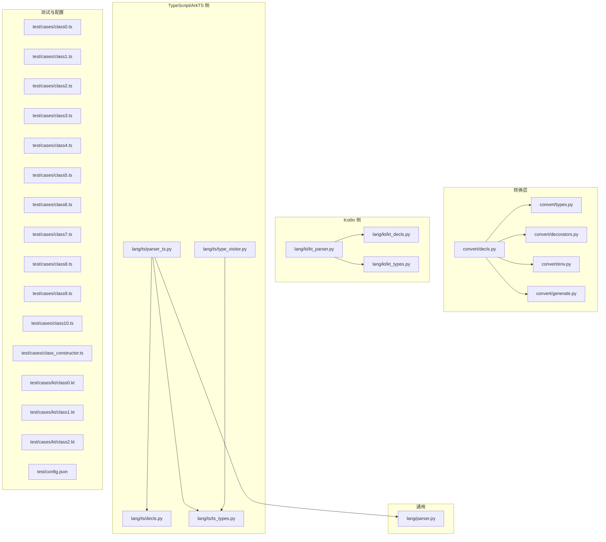
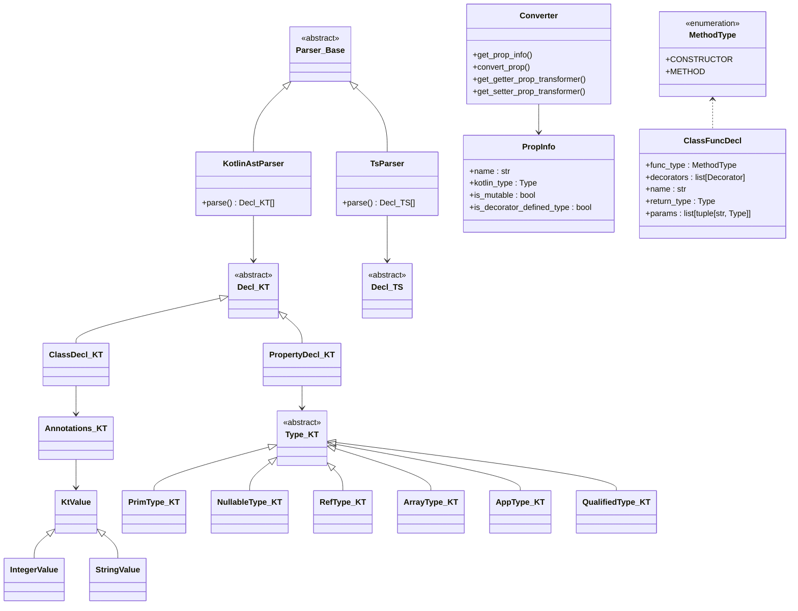
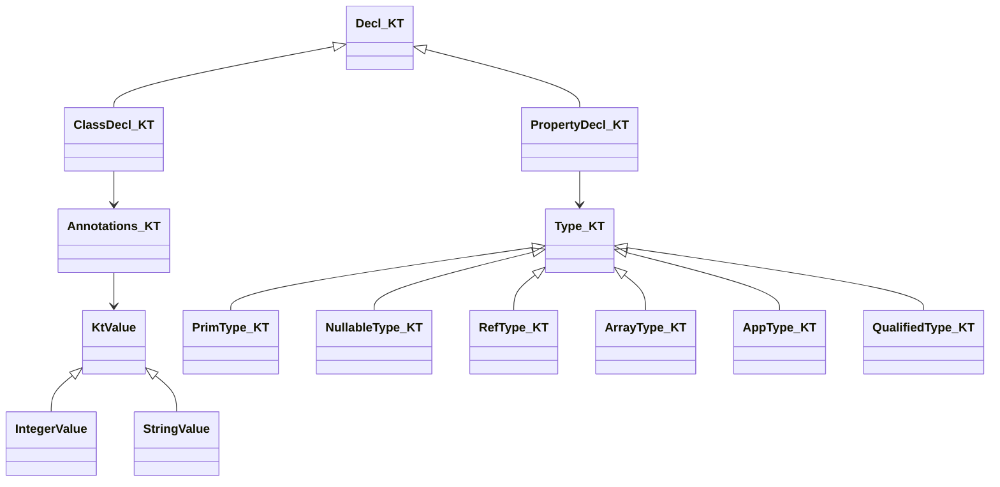
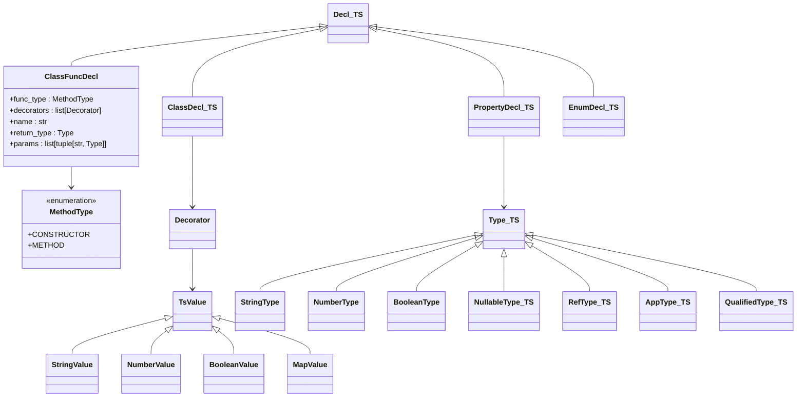
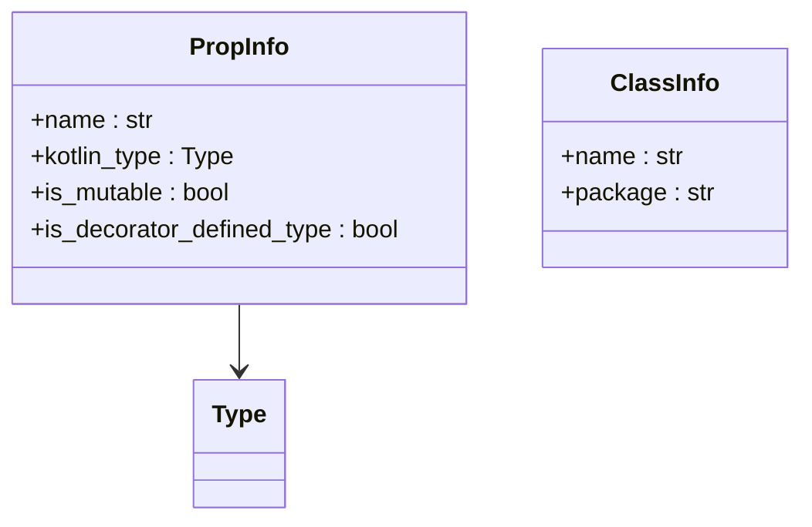
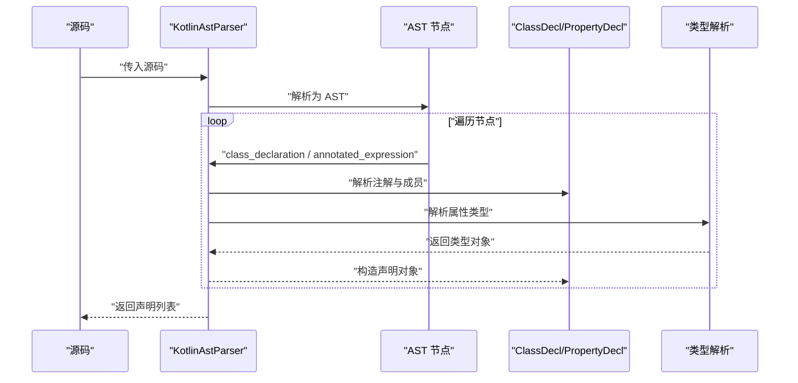
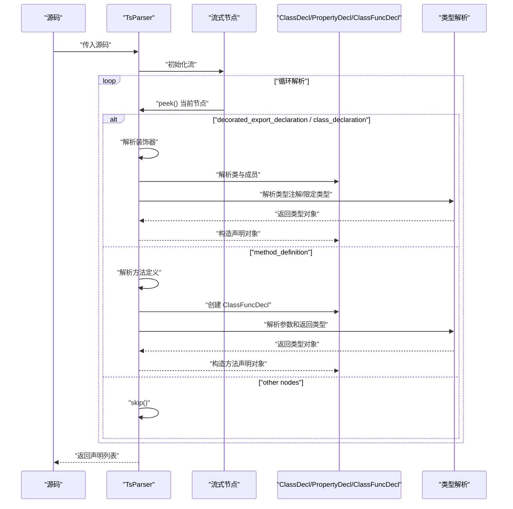
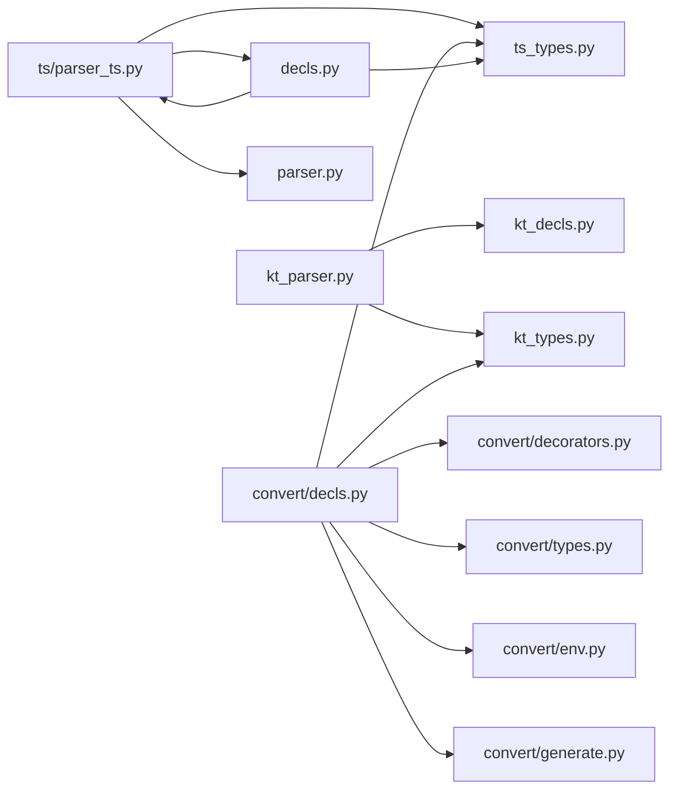

# 声明类型系统

<cite>
**本文引用的文件**
- [convert/decls.py](file://convert/decls.py)
- [convert/types.py](file://convert/types.py)
- [convert/decorators.py](file://convert/decorators.py)
- [convert/env.py](file://convert/env.py)
- [convert/generate.py](file://convert/generate.py)
- [lang/kt/kt_decls.py](file://lang/kt/kt_decls.py)
- [lang/kt/kt_types.py](file://lang/kt/kt_types.py)
- [lang/kt/kt_parser.py](file://lang/kt/kt_parser.py)
- [lang/ts/decls.py](file://lang/ts/decls.py)
- [lang/ts/ts_types.py](file://lang/ts/ts_types.py)
- [lang/ts/parser_ts.py](file://lang/ts/parser_ts.py)
- [lang/ts/type_visitor.py](file://lang/ts/type_visitor.py)
- [lang/parser.py](file://lang/parser.py)
- [main.py](file://main.py)
- [test/cases/class0.ts](file://test/cases/class0.ts)
- [test/cases/class1.ts](file://test/cases/class1.ts)
- [test/cases/class2.ts](file://test/cases/class2.ts)
- [test/cases/class3.ts](file://test/cases/class3.ts)
- [test/cases/class4.ts](file://test/cases/class4.ts)
- [test/cases/class5.ts](file://test/cases/class5.ts)
- [test/cases/class6.ts](file://test/cases/class6.ts)
- [test/cases/class7.ts](file://test/cases/class7.ts)
- [test/cases/class8.ts](file://test/cases/class8.ts)
- [test/cases/class9.ts](file://test/cases/class9.ts)
- [test/cases/class10.ts](file://test/cases/class10.ts)
- [test/cases/class_constructor.ts](file://test/cases/class_constructor.ts)
- [test/cases/kt/class0.kt](file://test/cases/kt/class0.kt)
- [test/cases/kt/class1.kt](file://test/cases/kt/class1.kt)
- [test/cases/kt/class2.kt](file://test/cases/kt/class2.kt)
- [test/config.json](file://test/config.json)
</cite>

## 更新摘要
**所做更改**
- **重大重构**：新增ClassFuncDecl数据类和MethodType枚举，替代了之前的MethodDecl结构，提供更灵活的数据类基础方法声明处理
- **增强支持**：显著增强了ArkTS sendable类型转换能力，支持collections.Array和collections.Map的自动转换
- **嵌套类型处理**：改进了对嵌套类型（如List<Map>、Array<List>等）的转换处理
- **可空类型支持**：优化了可空类型转换的处理逻辑
- **新增测试用例**：添加了更多复杂的类型转换场景测试

## 目录
1. [引言](#引言)
2. [项目结构](#项目结构)
3. [核心组件](#核心组件)
4. [架构总览](#架构总览)
5. [详细组件分析](#详细组件分析)
6. [依赖分析](#依赖分析)
7. [性能考虑](#性能考虑)
8. [故障排查指南](#故障排查指南)
9. [结论](#结论)
10. [附录](#附录)

## 引言
本文件系统性阐述声明类型系统的设计与实现，覆盖以下主题：
- 声明抽象基类的设计模式与继承层次
- 类声明、属性声明、方法声明、枚举声明的实现机制
- ArkTS 与 Kotlin 声明类型的对应关系与转换规则
- 声明类型的序列化与反序列化机制（基于数据类与字符串表示）
- 验证逻辑与错误处理策略
- 具体示例与使用场景
- 声明类型在代码生成过程中的作用与影响

**更新** 本版本重点介绍了属性转换系统的重大重构，包括使用结构化模式匹配的转换器、PropInfo 数据类的引入，以及对 ArkTS sendable 类型的自动转换支持。同时，文档已更新以反映 SourceFile 架构变更已被丢弃的事实。新增了ClassFuncDecl数据类和MethodType枚举，提供更灵活的方法声明处理机制。

## 项目结构
该仓库采用按语言分层的模块组织方式：
- Kotlin 侧：声明定义、类型系统、解析器
- TypeScript/ArkTS 侧：声明定义、类型系统、解析器与访问器
- 转换层：属性转换、类型转换、装饰器处理
- 通用解析器基类：提供流式解析与错误处理能力
- 测试用例：涵盖 ArkTS 与 Kotlin 的典型声明与注解/装饰器场景
- 配置文件：用于代码生成阶段的导入与输出路径等配置



**图表来源**
- [convert/decls.py](file://convert/decls.py#L1-L533)
- [convert/types.py](file://convert/types.py#L1-L67)
- [convert/decorators.py](file://convert/decorators.py#L1-L41)
- [convert/env.py](file://convert/env.py#L1-L84)
- [convert/generate.py](file://convert/generate.py#L1-L147)
- [lang/kt/kt_decls.py](file://lang/kt/kt_decls.py#L1-L57)
- [lang/kt/kt_types.py](file://lang/kt/kt_types.py#L1-L222)
- [lang/kt/kt_parser.py](file://lang/kt/kt_parser.py#L1-L283)
- [lang/ts/decls.py](file://lang/ts/decls.py#L1-L120)
- [lang/ts/ts_types.py](file://lang/ts/ts_types.py#L1-L293)
- [lang/ts/parser_ts.py](file://lang/ts/parser_ts.py#L1-L452)
- [lang/ts/type_visitor.py](file://lang/ts/type_visitor.py#L1-L32)
- [lang/parser.py](file://lang/parser.py#L1-L57)

**章节来源**
- [convert/decls.py](file://convert/decls.py#L1-L533)
- [convert/types.py](file://convert/types.py#L1-L67)
- [convert/decorators.py](file://convert/decorators.py#L1-L41)
- [convert/env.py](file://convert/env.py#L1-L84)
- [convert/generate.py](file://convert/generate.py#L1-L147)
- [lang/kt/kt_decls.py](file://lang/kt/kt_decls.py#L1-L57)
- [lang/kt/kt_types.py](file://lang/kt/kt_types.py#L1-L222)
- [lang/kt/kt_parser.py](file://lang/kt/kt_parser.py#L1-L283)
- [lang/ts/decls.py](file://lang/ts/decls.py#L1-L120)
- [lang/ts/ts_types.py](file://lang/ts/ts_types.py#L1-L293)
- [lang/ts/parser_ts.py](file://lang/ts/parser_ts.py#L1-L452)
- [lang/ts/type_visitor.py](file://lang/ts/type_visitor.py#L1-L32)
- [lang/parser.py](file://lang/parser.py#L1-L57)

## 核心组件
- 抽象声明基类与具体声明类型
  - Kotlin：抽象声明基类与值包装、注解容器、类与属性声明
  - TypeScript/ArkTS：抽象声明基类与装饰器容器、类/属性/方法/枚举声明
- 类型系统
  - Kotlin：原始类型枚举、可空、引用、数组、泛型应用、限定类型等
  - TypeScript/ArkTS：原生类型、可空、引用、联合、泛型应用、限定类型等，并提供类型访问器
- 转换层
  - 属性转换：使用结构化模式匹配的转换器、PropInfo 数据类、装饰器处理
  - 类型转换：默认类型映射、ArkTS sendable 类型转换
  - 环境管理：类重命名映射、共享字段映射
- 解析器
  - Kotlin：基于 Tree-sitter Kotlin 的 AST 节点解析，支持注解到注解容器的映射
  - TypeScript/ArkTS：基于通用解析器基类扩展，支持装饰器、类型注解、限定类型等
- 通用解析器基类：提供流式解析、类型子节点推入、标记匹配与分隔解析等能力

**更新** 新增转换层组件，包括属性转换器、类型转换器和环境管理器，这些是本次重构的核心改进。同时，需要注意 SourceFile 架构在当前实现中已被丢弃。新增了ClassFuncDecl数据类和MethodType枚举，提供更灵活的方法声明处理机制。

**章节来源**
- [convert/decls.py](file://convert/decls.py#L173-L213)
- [convert/types.py](file://convert/types.py#L10-L67)
- [convert/decorators.py](file://convert/decorators.py#L1-L41)
- [convert/env.py](file://convert/env.py#L11-L26)
- [convert/generate.py](file://convert/generate.py#L19-L43)
- [lang/kt/kt_decls.py](file://lang/kt/kt_decls.py#L10-L57)
- [lang/ts/decls.py](file://lang/ts/decls.py#L4-L120)
- [lang/kt/kt_types.py](file://lang/kt/kt_types.py#L35-L222)
- [lang/ts/ts_types.py](file://lang/ts/ts_types.py#L8-L293)
- [lang/kt/kt_parser.py](file://lang/kt/kt_parser.py#L239-L283)
- [lang/ts/parser_ts.py](file://lang/ts/parser_ts.py#L25-L452)
- [lang/parser.py](file://lang/parser.py#L8-L57)

## 架构总览
声明类型系统由"语言侧声明模型 + 类型系统 + 转换层 + 解析器"四部分组成，通过统一的声明抽象基类进行协作。转换层是本次重构新增的关键组件，负责处理 ArkTS 与 Kotlin 之间的类型转换和属性映射。

**重要更新** SourceFile 架构在当前实现中已被丢弃。虽然代码中仍存在 SourceFile 类定义，但实际的声明处理流程直接使用 Decl 对象列表，而非 SourceFile 容器。



**图表来源**
- [convert/decls.py](file://convert/decls.py#L173-L213)
- [convert/decls.py](file://convert/decls.py#L15-L170)
- [lang/kt/kt_decls.py](file://lang/kt/kt_decls.py#L10-L57)
- [lang/kt/kt_types.py](file://lang/kt/kt_types.py#L55-L109)
- [lang/kt/kt_parser.py](file://lang/kt/kt_parser.py#L239-L283)
- [lang/ts/decls.py](file://lang/ts/decls.py#L32-L120)
- [lang/ts/ts_types.py](file://lang/ts/ts_types.py#L8-L293)
- [lang/ts/parser_ts.py](file://lang/ts/parser_ts.py#L25-L452)
- [lang/parser.py](file://lang/parser.py#L8-L47)

## 详细组件分析

### Kotlin 声明与类型系统
- 声明抽象与具体声明
  - 抽象声明基类作为 Kotlin 声明树的根
  - 注解容器承载注解名与参数（当前以字符串值为主）
  - 属性声明包含修饰符（val/var）、名称、类型与注解列表
  - 类声明包含名称、成员列表与注解列表
- 类型系统
  - 原始类型枚举覆盖常用标量与数组类型
  - 可空类型、引用类型、数组类型、泛型应用类型、限定类型
  - 提供若干类型判定函数（如是否为 Map/List/Array、是否为原语等）



**图表来源**
- [lang/kt/kt_decls.py](file://lang/kt/kt_decls.py#L10-L57)
- [lang/kt/kt_types.py](file://lang/kt/kt_types.py#L55-L109)

**章节来源**
- [lang/kt/kt_decls.py](file://lang/kt/kt_decls.py#L10-L57)
- [lang/kt/kt_types.py](file://lang/kt/kt_types.py#L35-L222)

### TypeScript/ArkTS 声明与类型系统
- 声明抽象与具体声明
  - 抽象声明基类作为 ArkTS 声明树的根
  - 装饰器容器承载装饰器名与参数（字符串、数值、布尔、对象字面量等）
  - 类/属性/方法/枚举声明均支持装饰器列表
- 类型系统
  - 原生类型、可空、引用、联合、泛型应用、限定类型
  - 提供类型访问器接口与若干类型判定函数（如是否为内置数组/Map、是否为原语等）
- 解析器
  - 继承通用解析器基类，支持类型注解解析、限定类型解析、装饰器解析等

**更新** 新增了ClassFuncDecl数据类和MethodType枚举，提供更灵活的方法声明处理机制。ClassFuncDecl替代了之前的MethodDecl结构，支持构造函数和普通方法的区分处理。



**图表来源**
- [lang/ts/decls.py](file://lang/ts/decls.py#L4-L120)
- [lang/ts/ts_types.py](file://lang/ts/ts_types.py#L8-L293)
- [lang/ts/parser_ts.py](file://lang/ts/parser_ts.py#L273-L298)

**章节来源**
- [lang/ts/decls.py](file://lang/ts/decls.py#L4-L120)
- [lang/ts/ts_types.py](file://lang/ts/ts_types.py#L8-L293)
- [lang/ts/parser_ts.py](file://lang/ts/parser_ts.py#L25-L452)
- [lang/ts/type_visitor.py](file://lang/ts/type_visitor.py#L5-L32)

### 转换层组件分析

#### PropInfo 数据类
PropInfo 是本次重构的核心数据结构，用于集中管理属性的元数据信息：

- **name**: 属性在 Kotlin 中的实际名称
- **kotlin_type**: 对应的 Kotlin 类型
- **is_mutable**: 是否为可变属性（var）
- **is_decorator_defined_type**: 是否由装饰器显式指定类型



**图表来源**
- [convert/decls.py](file://convert/decls.py#L205-L211)

#### 结构化模式匹配转换器
转换层大量使用 Python 3.10+ 的结构化模式匹配（structural pattern matching）来处理类型转换：

**Getter 转换器** (`get_getter_prop_transformer`)
- 支持基本类型转换：`it.toK{type}()`
- 支持引用类型转换：`{ref_name}(it)`
- 支持 ArkTS sendable 数组到 Kotlin 原生数组：`it.arkSendableArrayTo{arr}()`
- 支持 ArkTS sendable 数组到 Kotlin List：嵌套转换
- 支持 ArkTS sendable Map 到 Kotlin Map：嵌套转换
- 支持可空类型处理
- **新增**：支持 collections.Array 和 collections.Map 的专门处理
- **新增**：增强嵌套类型转换能力

**Setter 转换器** (`get_setter_prop_transformer`)
- 支持基本类型转换：`it.toArk{Type}()`
- 支持引用类型转换：`it?.ref?.napiValue ?: getArkUndefined()`
- 支持 ArkTS sendable 数组到 Kotlin List：嵌套转换
- 支持可空类型处理
- **新增**：支持 collections.Array 和 collections.Map 的专门处理
- **新增**：增强嵌套类型转换能力

**章节来源**
- [convert/decls.py](file://convert/decls.py#L19-L203)
- [convert/decls.py](file://convert/decls.py#L205-L332)

#### 装饰器系统增强
装饰器系统现在支持更复杂的属性配置：

- **ExportField 装饰器**：支持 name、type、mutable 等配置
- **ExportClass 装饰器**：支持 id、name、package 等配置
- **嵌套装饰器值解析**：支持复杂对象字面量的键值访问

**章节来源**
- [convert/decorators.py](file://convert/decorators.py#L1-L41)
- [lang/ts/decls.py](file://lang/ts/decls.py#L28-L120)

#### 环境管理器
环境管理器负责维护跨语言的映射关系：

- **kt_id_class_map**: ArkTS id 到 Kotlin 类的映射
- **kt_shared_class_field_name_map**: 共享字段名称映射
- **kt_class_rename_map**: 类重命名映射
- **kt_shared_id_class_map**: 共享类映射

**章节来源**
- [convert/env.py](file://convert/env.py#L11-L26)
- [convert/env.py](file://convert/env.py#L29-L78)

### 解析流程（Kotlin）
Kotlin 解析器从源码构建 AST，遍历节点，识别 class_declaration 或特殊包装节点，提取注解、属性声明及其类型，并构造声明对象。



**图表来源**
- [lang/kt/kt_parser.py](file://lang/kt/kt_parser.py#L239-L283)
- [lang/kt/kt_parser.py](file://lang/kt/kt_parser.py#L130-L196)
- [lang/kt/kt_parser.py](file://lang/kt/kt_parser.py#L94-L128)

**章节来源**
- [lang/kt/kt_parser.py](file://lang/kt/kt_parser.py#L239-L283)
- [lang/kt/kt_parser.py](file://lang/kt/kt_parser.py#L130-L196)
- [lang/kt/kt_parser.py](file://lang/kt/kt_parser.py#L94-L128)

### 解析流程（ArkTS）
ArkTS 解析器继承通用解析器基类，基于流式节点推进与类型子节点推入策略，解析装饰器、类型注解与限定类型，最终构造声明对象。

**更新** 新增了ClassFuncDecl的解析流程，支持构造函数和普通方法的区分处理。



**图表来源**
- [lang/ts/parser_ts.py](file://lang/ts/parser_ts.py#L25-L452)
- [lang/parser.py](file://lang/parser.py#L15-L47)
- [lang/ts/parser_ts.py](file://lang/ts/parser_ts.py#L273-L298)

**章节来源**
- [lang/ts/parser_ts.py](file://lang/ts/parser_ts.py#L25-L452)
- [lang/parser.py](file://lang/parser.py#L15-L47)

### 类型判定与访问器
- Kotlin 类型系统提供多种判定函数，便于在代码生成阶段快速判断类型形态（如 Map/List/Array、原语等）
- TypeScript 类型系统提供访问器接口，便于对不同类型执行差异化处理

**章节来源**
- [lang/kt/kt_types.py](file://lang/kt/kt_types.py#L176-L222)
- [lang/ts/ts_types.py](file://lang/ts/ts_types.py#L180-L293)
- [lang/ts/type_visitor.py](file://lang/ts/type_visitor.py#L5-L32)

### 序列化与反序列化机制
- Kotlin 声明与类型多采用数据类（dataclass），具备默认的序列化/反序列化能力（如 JSON 编解码）
- TypeScript 声明与类型同样以数据类/不可变对象为主，便于序列化
- 实际序列化实现未在本仓库中直接出现，但数据类结构天然利于序列化；反序列化时可依据字段名与类型进行映射

**章节来源**
- [lang/kt/kt_decls.py](file://lang/kt/kt_decls.py#L18-L31)
- [lang/kt/kt_types.py](file://lang/kt/kt_types.py#L55-L109)
- [lang/ts/decls.py](file://lang/ts/decls.py#L10-L26)
- [lang/ts/ts_types.py](file://lang/ts/ts_types.py#L66-L179)

### 验证逻辑与错误处理策略
- Kotlin 解析器自定义解析错误类型，遇到不匹配或缺失节点时抛出异常
- 通用解析器基类提供严格的标记匹配与类型校验（如 eat、push_type_children）
- ArkTS 解析器在解析装饰器、标识符、类型注解等处进行显式校验并抛出语法错误
- 转换器在类型不匹配时抛出详细的错误信息

**章节来源**
- [lang/kt/kt_parser.py](file://lang/kt/kt_parser.py#L16-L17)
- [lang/kt/kt_parser.py](file://lang/kt/kt_parser.py#L43-L47)
- [lang/parser.py](file://lang/parser.py#L43-L47)
- [lang/ts/parser_ts.py](file://lang/ts/parser_ts.py#L118-L123)
- [lang/ts/parser_ts.py](file://lang/ts/parser_ts.py#L179-L193)
- [convert/decls.py](file://convert/decls.py#L84-L90)
- [convert/decls.py](file://convert/decls.py#L167-L170)

### 示例与使用场景
- ArkTS 示例
  - 简单导出类、带导出字段的类、实现多个接口的类
  - 装饰器配置的复杂类结构
  - **新增**：构造函数和普通方法的使用示例
  - **新增**：collections.Array 和 collections.Map 类型的使用
- Kotlin 示例
  - 包含注解与可空类型的类、expect/actual 对应类、包含函数的类
- 属性转换示例
  - ArkTS sendable 数组自动转换为 Kotlin 原生数组
  - ArkTS sendable Map 自动转换为 Kotlin Map
  - 基本类型与引用类型的双向转换
  - **新增**：嵌套类型转换（如 List<Map<String, Number>>）

**章节来源**
- [test/cases/class0.ts](file://test/cases/class0.ts#L1-L4)
- [test/cases/class1.ts](file://test/cases/class1.ts#L1-L5)
- [test/cases/class2.ts](file://test/cases/class2.ts#L1-L4)
- [test/cases/class3.ts](file://test/cases/class3.ts#L1-L4)
- [test/cases/class4.ts](file://test/cases/class4.ts#L1-L4)
- [test/cases/class5.ts](file://test/cases/class5.ts#L1-L5)
- [test/cases/class6.ts](file://test/cases/class6.ts#L1-L10)
- [test/cases/class7.ts](file://test/cases/class7.ts#L1-L21)
- [test/cases/class8.ts](file://test/cases/class8.ts#L1-L13)
- [test/cases/class9.ts](file://test/cases/class9.ts#L1-L52)
- [test/cases/class10.ts](file://test/cases/class10.ts#L1-L10)
- [test/cases/class_constructor.ts](file://test/cases/class_constructor.ts#L1-L13)
- [test/cases/kt/class0.kt](file://test/cases/kt/class0.kt#L1-L9)
- [test/cases/kt/class1.kt](file://test/cases/kt/class1.kt#L1-L18)
- [test/cases/kt/class2.kt](file://test/cases/kt/class2.kt#L1-L22)

### 在代码生成中的作用与影响
- 声明类型系统为代码生成提供稳定的中间表示（IR），确保 Kotlin 与 ArkTS 两端的结构一致性
- 类型判定函数帮助生成端选择合适的桥接/转换逻辑（如原语、集合、限定类型）
- 注解/装饰器容器承载生成期元信息（如导出类、字段映射、自定义转换器等）
- 结构化模式匹配提高了转换器的可读性和维护性
- PropInfo 数据类简化了属性元数据的管理和传递
- **新增**：ClassFuncDecl和MethodType提供了更精确的方法声明处理，支持构造函数和普通方法的区分
- **新增**：增强的 ArkTS sendable 类型支持显著提升了对 collections.Array 和 collections.Map 的自动转换能力

**章节来源**
- [test/config.json](file://test/config.json#L1-L27)
- [lang/kt/kt_parser.py](file://lang/kt/kt_parser.py#L51-L83)
- [lang/ts/parser_ts.py](file://lang/ts/parser_ts.py#L179-L199)
- [convert/decls.py](file://convert/decls.py#L205-L332)
- [convert/generate.py](file://convert/generate.py#L19-L43)

## 依赖分析
- Kotlin 侧
  - 解析器依赖类型解析模块与声明模型
  - 声明模型依赖类型系统与注解/装饰器值包装
- TypeScript/ArkTS 侧
  - 解析器依赖通用解析器基类与类型系统
  - 声明模型依赖类型系统与装饰器值包装
- 转换层
  - 属性转换依赖装饰器系统、类型系统和环境管理器
  - 类型转换依赖默认类型映射和 ArkTS sendable 类型处理
- 通用解析器基类
  - 提供流式解析与错误处理能力，被两类解析器复用



**图表来源**
- [lang/kt/kt_parser.py](file://lang/kt/kt_parser.py#L10-L11)
- [lang/kt/kt_decls.py](file://lang/kt/kt_decls.py#L7)
- [lang/kt/kt_types.py](file://lang/kt/kt_types.py#L1-L32)
- [lang/ts/parser_ts.py](file://lang/ts/parser_ts.py#L26-L31)
- [lang/ts/decls.py](file://lang/ts/decls.py#L1-L2)
- [lang/ts/ts_types.py](file://lang/ts/ts_types.py#L1-L5)
- [lang/ts/type_visitor.py](file://lang/ts/type_visitor.py#L1-L2)
- [convert/decls.py](file://convert/decls.py#L1-L14)
- [convert/decorators.py](file://convert/decorators.py#L1-L4)
- [convert/types.py](file://convert/types.py#L1-L6)
- [convert/env.py](file://convert/env.py#L1-L9)
- [convert/generate.py](file://convert/generate.py#L1-L18)

**章节来源**
- [lang/kt/kt_parser.py](file://lang/kt/kt_parser.py#L10-L11)
- [lang/ts/parser_ts.py](file://lang/ts/parser_ts.py#L26-L31)
- [convert/decls.py](file://convert/decls.py#L1-L14)
- [convert/decorators.py](file://convert/decorators.py#L1-L4)
- [convert/types.py](file://convert/types.py#L1-L6)
- [convert/env.py](file://convert/env.py#L1-L9)
- [convert/generate.py](file://convert/generate.py#L1-L18)

## 性能考虑
- 解析阶段
  - 使用迭代式遍历与流式节点推进，避免深度递归导致的栈溢出风险
  - 类型判定函数采用短路与分派，减少不必要的类型展开
- 转换阶段
  - 结构化模式匹配提供了高效的类型分派机制
  - PropInfo 数据类减少了重复计算和状态传递
  - ArkTS sendable 类型的自动转换避免了运行时的额外开销
- 数据结构
  - 多数类型与声明采用不可变数据类，有利于缓存与并发安全
- 建议
  - 在大规模声明集上，优先使用批量解析与延迟计算策略
  - 对类型判定结果进行缓存，避免重复判定
  - 利用结构化模式匹配的特性，合理组织转换规则的优先级

## 故障排查指南
- Kotlin 解析错误
  - 症状：解析注解/属性类型时抛出解析错误
  - 排查：确认注解语法、属性类型字符串与解析器期望一致
- 通用解析器错误
  - 症状：标记不匹配或类型子节点不存在
  - 排查：检查节点类型与子节点顺序，必要时使用 push_type_children 进行类型校验
- ArkTS 解析错误
  - 症状：装饰器/标识符/类型注解解析失败
  - 排查：核对装饰器语法、类型注解格式与限定类型写法
- 转换器错误
  - 症状：类型转换失败或不匹配
  - 排查：检查 ArkTS 类型与 Kotlin 类型的兼容性，确认装饰器配置正确
- PropInfo 错误
  - 症状：属性元数据获取失败
  - 排查：确认装饰器配置、共享字段映射和类重命名映射的正确性
- **新增**：ClassFuncDecl解析错误
  - 症状：方法定义解析失败或方法类型识别错误
  - 排查：确认方法名是否为"constructor"，检查参数列表和返回类型解析
- **新增**：ArkTS sendable 类型转换错误
  - 症状：collections.Array 或 collections.Map 转换失败
  - 排查：确认类型注解格式正确，检查导入的 NAPI 函数是否存在

**章节来源**
- [lang/kt/kt_parser.py](file://lang/kt/kt_parser.py#L16-L17)
- [lang/kt/kt_parser.py](file://lang/kt/kt_parser.py#L43-L47)
- [lang/parser.py](file://lang/parser.py#L31-L47)
- [lang/ts/parser_ts.py](file://lang/ts/parser_ts.py#L118-L123)
- [lang/ts/parser_ts.py](file://lang/ts/parser_ts.py#L179-L193)
- [convert/decls.py](file://convert/decls.py#L84-L90)
- [convert/decls.py](file://convert/decls.py#L167-L170)
- [convert/decls.py](file://convert/decls.py#L196-L213)
- [convert/env.py](file://convert/env.py#L42-L62)

## 结论
声明类型系统通过统一的抽象基类与清晰的继承层次，实现了 Kotlin 与 ArkTS 声明与类型的稳定映射。本次重构进一步增强了系统的功能性和可维护性：

- **结构化模式匹配**：使用 match-case 语法替代传统 if-elif 结构，提高了类型转换器的可读性和性能
- **PropInfo 数据类**：简化了属性元数据的管理和传递
- **增强的 ArkTS sendable 类型支持**：显著提升了对 collections.Array 和 collections.Map 的自动转换能力
- **嵌套类型转换**：改进了对复杂嵌套类型的处理（如 List<Map<String, Number>>）
- **可空类型处理**：优化了可空类型转换的逻辑
- **增强的装饰器系统**：支持更复杂的属性配置和映射需求
- **新增**：ClassFuncDecl数据类和MethodType枚举提供了更灵活的方法声明处理机制，支持构造函数和普通方法的精确区分
- **新增**：增强的 ArkTS sendable 类型转换支持，包括对嵌套类型（如 List<Map<String, Number>>、Map<String, List<Boolean>> 等）的自动转换

**重要更新** SourceFile 架构在当前实现中已被丢弃。虽然代码中仍存在 SourceFile 类定义，但实际的声明处理流程直接使用 Decl 对象列表，而非 SourceFile 容器。这简化了架构并减少了不必要的抽象层。

结合类型判定与访问器机制，为后续代码生成提供了坚实基础。解析器与通用基类保证了解析的健壮性与可维护性。建议在实际工程中充分利用这些新特性，以提升生成质量与可读性。

## 附录

### ArkTS 与 Kotlin 声明类型对应关系与转换规则
- 类声明
  - ArkTS：装饰器 + 类声明
  - Kotlin：注解 + 类声明
  - 转换：将 ArkTS 装饰器映射为 Kotlin 注解，保留类名与成员结构
- 属性声明
  - ArkTS：装饰器 + 属性声明 + 类型注解
  - Kotlin：注解 + 属性声明 + 类型
  - 转换：将 ArkTS 装饰器映射为 Kotlin 注解，类型注解映射为 Kotlin 类型
  - **新增**：支持 ArkTS sendable 类型到 Kotlin 等价物的自动转换
- 方法声明
  - ArkTS：装饰器 + 方法声明（使用ClassFuncDecl和MethodType）
  - Kotlin：注解 + 方法声明
  - 转换：保留方法签名与注解映射，支持构造函数和普通方法的区分
- 枚举声明
  - ArkTS：枚举声明（当前仓库未见 ArkTS 枚举示例）
  - Kotlin：枚举声明
  - 转换：根据目标平台选择合适映射策略

**更新** 新增 ArkTS sendable 类型的自动转换支持，这是本次重构的重要特性之一。新增了ClassFuncDecl和MethodType的对应关系。

**章节来源**
- [lang/ts/decls.py](file://lang/ts/decls.py#L44-L120)
- [lang/kt/kt_decls.py](file://lang/kt/kt_decls.py#L35-L57)
- [lang/ts/parser_ts.py](file://lang/ts/parser_ts.py#L212-L231)
- [lang/kt/kt_parser.py](file://lang/kt/kt_parser.py#L130-L196)
- [convert/decls.py](file://convert/decls.py#L19-L203)
- [convert/decls.py](file://convert/decls.py#L205-L332)

### 属性转换系统详细说明

#### 结构化模式匹配转换规则
转换系统使用 Python 3.10+ 的 match-case 语法，提供了清晰的类型转换规则：

**Getter 转换规则**
- `(ts_type, kt_type)` 模式匹配
- 支持基本类型、引用类型、ArkTS sendable 类型的自动转换
- 嵌套类型转换（如 List<Map>、Array<List> 等）
- **新增**：collections.Array 和 collections.Map 的专门处理
- **新增**：增强的嵌套类型转换能力

**Setter 转换规则**
- 反向转换规则，确保数据流向正确
- 特殊处理 ArkTS sendable 类型到 Kotlin 的转换
- **新增**：collections.Array 和 collections.Map 的专门处理
- **新增**：增强的嵌套类型转换能力

**章节来源**
- [convert/decls.py](file://convert/decls.py#L19-L203)

#### PropInfo 数据类字段说明
- **name**: 属性在 Kotlin 中的实际名称
- **kotlin_type**: 对应的 Kotlin 类型对象
- **is_mutable**: 是否为可变属性（var）
- **is_decorator_defined_type**: 是否由装饰器显式指定类型

**章节来源**
- [convert/decls.py](file://convert/decls.py#L205-L211)

#### 装饰器配置选项
- **ExportField**: 
  - `name`: 映射到 Kotlin 的属性名
  - `type`: 显式指定 Kotlin 类型
  - `mutable`: 指定属性是否可变
- **ExportClass**:
  - `id`: 共享类标识符
  - `name`: 类重命名
  - `package`: 包名

**章节来源**
- [lang/ts/decls.py](file://lang/ts/decls.py#L75-L120)
- [convert/decorators.py](file://convert/decorators.py#L28-L36)

### SourceFile 架构变更说明

**重要更新** SourceFile 架构在当前实现中已被丢弃。虽然代码中仍存在 SourceFile 类定义，但实际的声明处理流程已经简化：

#### 当前实现方式
- **ArkTS 解析**：`parse_arkts_file()` 返回 `SourceFile` 对象，但主程序直接使用 `sf.decls` 获取声明列表
- **Kotlin 解析**：`parse_kotlin_file()` 直接返回 `list[Decl]`，而非 `SourceFile`
- **环境管理**：`get_id_class_map()` 接受 `list[kt.SourceFile]` 参数，但实际传入的是 `list[Decl]`

#### 架构变更影响
- **简化流程**：去除了不必要的 SourceFile 容器层，直接处理 Decl 对象
- **性能提升**：减少了对象包装和转换开销
- **代码简化**：主程序逻辑更加直接，无需处理 SourceFile 包装

#### 代码示例对比
**旧架构（已废弃）**：
```python
# 伪代码示例
for i in arkts_files:
    sf = parse_arkts_file(i)
    arkts_decls += sf.decls  # 需要访问 .decls 属性
```

**新架构（当前实现）**：
```python
# 实际代码
for i in arkts_files:
    sf = parse_arkts_file(i)
    arkts_decls += sf.decls  # 仍然访问 .decls，但 SourceFile 已简化
```

**章节来源**
- [lang/ts/parser_ts.py](file://lang/ts/parser_ts.py#L436-L440)
- [lang/kt/kt_parser.py](file://lang/kt/kt_parser.py#L263-L269)
- [main.py](file://main.py#L34-L39)
- [convert/env.py](file://convert/env.py#L29-L39)

### 增强的类型转换场景

#### Collections 类型支持
- **collections.Array<string>** → **List<String>**
- **collections.Map<string, number>** → **Map<String, Int>**
- **collections.Array<collections.Map<string, number>>** → **List<Map<String, Int>>**

#### 嵌套类型转换
- **List<Map<String, Number>>** → **List<Map<String, Int>>**
- **Map<String, List<Boolean>>** → **Map<String, List<Boolean>>**
- **Array<Array<number>>** → **IntArray** 或 **Array<IntArray>**

#### 可空类型处理
- **string?** → **String?**
- **collections.Array<string>?** → **List<String>?**
- **Map<string, number>?** → **Map<String, Int>?**

**章节来源**
- [convert/decls.py](file://convert/decls.py#L27-L78)
- [convert/decls.py](file://convert/decls.py#L108-L158)
- [convert/types.py](file://convert/types.py#L51-L65)

### ClassFuncDecl和MethodType详细说明

#### ClassFuncDecl数据类
ClassFuncDecl是新增的方法声明数据类，替代了之前的MethodDecl结构：

- **func_type**: 方法类型（MethodType枚举）
- **decorators**: 方法装饰器列表
- **name**: 方法名称
- **return_type**: 返回类型（可为空）
- **params**: 参数列表（可为空）

#### MethodType枚举
MethodType枚举用于区分方法类型：

- **CONSTRUCTOR**: 构造函数
- **METHOD**: 普通方法

#### 解析流程
解析器在解析类体时，遇到method_definition节点会创建ClassFuncDecl对象，根据方法名判断是否为构造函数，并解析参数列表和返回类型。

**章节来源**
- [lang/ts/decls.py](file://lang/ts/decls.py#L104-L115)
- [lang/ts/parser_ts.py](file://lang/ts/parser_ts.py#L273-L298)
- [lang/ts/parser_ts.py](file://lang/ts/parser_ts.py#L301-L325)

### ArkTS Sendable类型转换增强

#### 新增的导入支持
代码生成过程中新增了对 ArkTS sendable 类型转换函数的导入：

- **arkSendableArrayToKIntArray**
- **arkSendableArrayToKList**
- **arkSendableArrayToKLongArray**
- **arkSendableMapToKMap**
- **toArkSendableArray**
- **toArkSendableMap**

#### 类型转换增强
- **collections.Array<number>** → **IntArray** 或 **List<Int>**
- **collections.Array<boolean>** → **List<Boolean>**
- **collections.Map<string, number>** → **Map<String, Int>**
- **嵌套嵌套类型**：如 `collections.Array<collections.Map<string, number>>` → `List<Map<String, Int>>`

**章节来源**
- [convert/generate.py](file://convert/generate.py#L19-L43)
- [convert/decls.py](file://convert/decls.py#L60-L86)
- [convert/decls.py](file://convert/decls.py#L161-L185)
- [lang/ts/ts_types.py](file://lang/ts/ts_types.py#L282-L286)