# 属性声明处理

<cite>
**本文档引用的文件**
- [convert/decls.py](file://convert/decls.py)
- [convert/types.py](file://convert/types.py)
- [convert/env.py](file://convert/env.py)
- [utils/config.py](file://utils/config.py)
- [lang/ts/decls.py](file://lang/ts/decls.py)
- [lang/kt/kt_decls.py](file://lang/kt/kt_decls.py)
- [lang/ts/ts_types.py](file://lang/ts/ts_types.py)
- [lang/kt/kt_types.py](file://lang/kt/kt_types.py)
- [lang/ts/parser.py](file://lang/ts/parser.py)
- [lang/ts/parser_arkts.py](file://lang/ts/parser_arkts.py)
- [lang/ts/parser_ts.py](file://lang/ts/parser_ts.py)
- [lang/kt/kt_parser.py](file://lang/kt/kt_parser.py)
- [lang/kt/type_parser.py](file://lang/kt/type_parser.py)
- [test/cases/class0.ts](file://test/cases/class0.ts)
- [test/cases/class1.ts](file://test/cases/class1.ts)
- [test/cases/class2.ts](file://test/cases/class2.ts)
- [test/cases/class3.ts](file://test/cases/class3.ts)
- [test/cases/class4.ts](file://test/cases/class4.ts)
- [test/cases/class5.ts](file://test/cases/class5.ts)
- [test/cases/class6.ts](file://test/cases/class6.ts)
- [test/cases/class7.ts](file://test/cases/class7.ts)
- [test/cases/class8.ts](file://test/cases/class8.ts)
- [test/cases/class9.ts](file://test/cases/class9.ts)
- [test/cases/enum0.ts](file://test/cases/enum0.ts)
- [test/cases/kt/class0.kt](file://test/cases/kt/class0.kt)
- [test/cases/kt/class1.kt](file://test/cases/kt/class1.kt)
</cite>

## 更新摘要
**所做更改**
- 新增 get_prop_name_and_type() 函数的详细说明，替代原有属性解析逻辑
- 更新共享类型处理机制，改进 basic、copy、proxy 三种模式的属性名称和类型处理
- 增强错误处理和类型安全性，提供更精确的属性解析控制
- 新增属性声明转换函数对比章节，解释 convert_prop_decl 与 convert_prop 的区别
- 更新属性声明处理流程图，反映新增的简化转换功能
- 新增抽象属性解析和转换的实际应用场景说明

## 目录
1. [简介](#简介)
2. [项目结构](#项目结构)
3. [核心组件](#核心组件)
4. [架构概览](#架构概览)
5. [详细组件分析](#详细组件分析)
6. [依赖关系分析](#依赖关系分析)
7. [性能考虑](#性能考虑)
8. [故障排除指南](#故障排除指南)
9. [结论](#结论)

## 简介

本文件深入解析了属性声明处理系统的设计与实现，重点围绕PropertyDecl类展开。该系统支持两种语言的属性声明处理：Kotlin和TypeScript（ArkTS）。通过统一的声明抽象层，实现了跨语言的属性声明解析、类型系统集成和代码生成支持。

**更新** 系统现已新增 get_prop_name_and_type() 函数，替代原有的属性解析逻辑，提供更精确的属性名称和类型处理机制。该函数根据共享类型配置（basic、copy、proxy）智能选择属性解析策略，增强了错误处理和类型安全性。

系统的核心设计目标是：
- 提供统一的属性声明数据结构
- 支持装饰器/注解的解析和处理
- 集成强大的类型系统进行类型检查，包括联合类型和枚举类型
- 实现可扩展的代码生成机制
- **更新** 支持不同共享类型（basic、copy、proxy）的智能属性解析
- **更新** 增强错误处理和类型安全性
- **更新** 提供专门的属性声明转换功能，用于抽象类生成场景

## 项目结构

该项目采用按语言分层的组织方式，主要包含以下核心模块：

```mermaid
graph TB
subgraph "语言层"
KT[Kotlin模块]
TS[TypeScript模块]
END
subgraph "声明层"
DECLS[声明定义]
TYPES[类型系统]
END
subgraph "解析层"
PARSER[通用解析器]
KT_PARSER[Kotlin解析器]
TS_PARSER[TypeScript解析器]
TS_ARKTS_PARSER[ArkTS解析器]
TS_TS_PARSER[TypeScript解析器]
END
subgraph "转换层"
CONVERT[转换器]
GET_PROP_NAME_AND_TYPE[属性名称和类型获取]
CONVERT_CLASS[类转换]
CONVERT_PROP_DECL[属性声明转换]
CONVERT_PROP[完整属性转换]
END
subgraph "配置层"
CONFIG[配置管理]
ENV[环境配置]
END
subgraph "工具层"
TYPE_PARSER[Kotlin类型解析器]
PRETTY[美化器]
END
KT --> DECLS
TS --> DECLS
DECLS --> TYPES
PARSER --> KT_PARSER
PARSER --> TS_PARSER
PARSER --> TS_ARKTS_PARSER
PARSER --> TS_TS_PARSER
KT_PARSER --> TYPE_PARSER
DECLS --> PRETTY
CONVERT --> GET_PROP_NAME_AND_TYPE
CONVERT --> CONVERT_CLASS
CONVERT --> CONVERT_PROP_DECL
CONVERT --> CONVERT_PROP
CONFIG --> ENV
ENV --> GET_PROP_NAME_AND_TYPE
```

**图表来源**
- [convert/decls.py](file://convert/decls.py#L211-L246)
- [convert/decls.py](file://convert/decls.py#L335-L373)
- [convert/decls.py](file://convert/decls.py#L345-L361)
- [convert/decls.py](file://convert/decls.py#L187-L231)
- [convert/env.py](file://convert/env.py#L241-L258)
- [utils/config.py](file://utils/config.py#L135-L145)

**章节来源**
- [convert/decls.py](file://convert/decls.py#L211-L246)
- [convert/decls.py](file://convert/decls.py#L335-L373)
- [convert/decls.py](file://convert/decls.py#L345-L361)
- [convert/decls.py](file://convert/decls.py#L187-L231)
- [convert/env.py](file://convert/env.py#L241-L258)
- [utils/config.py](file://utils/config.py#L135-L145)

## 核心组件

### 属性声明基础结构

系统提供了两个版本的属性声明实现，分别对应不同的语言特性：

#### Kotlin属性声明 (PropertyDecl)
- **修饰符支持**: 支持`var`和`val`两种修饰符
- **装饰器系统**: 通过Annotations类支持注解解析
- **类型系统**: 集成完整的Kotlin类型系统
- **空值安全**: 支持可空类型标记

#### TypeScript属性声明 (PropertyDecl)
- **装饰器支持**: 通过Decorator类实现装饰器解析
- **类型系统**: 集成TypeScript类型系统，包括联合类型和枚举类型
- **泛型支持**: 完整的泛型类型处理能力
- **联合类型**: 支持复杂的类型组合，如 `string | null | undefined`
- **枚举类型**: 支持常量枚举的解析和处理

**更新** TypeScript版本现在支持联合类型和枚举类型，通过UnionType和EnumDecl类实现：

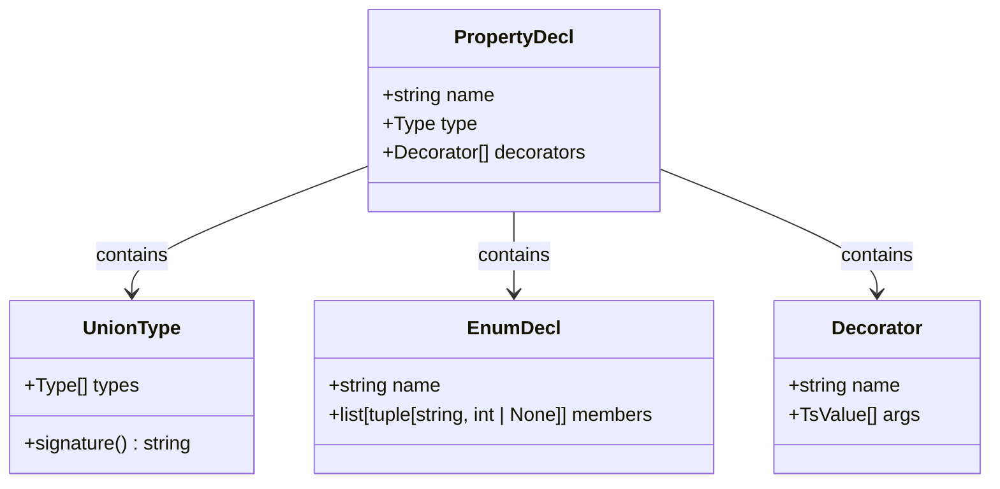

**图表来源**
- [lang/ts/decls.py](file://lang/ts/decls.py#L97-L116)
- [lang/ts/ts_types.py](file://lang/ts/ts_types.py#L124-L132)
- [lang/ts/parser_arkts.py](file://lang/ts/parser_arkts.py#L241-L251)

**章节来源**
- [lang/kt/kt_decls.py](file://lang/kt/kt_decls.py#L52-L57)
- [lang/ts/decls.py](file://lang/ts/decls.py#L97-L116)
- [lang/ts/ts_types.py](file://lang/ts/ts_types.py#L124-L132)
- [lang/ts/parser_arkts.py](file://lang/ts/parser_arkts.py#L241-L251)

### 新增的属性名称和类型获取函数

**更新** 系统新增了 get_prop_name_and_type() 函数，替代原有的属性解析逻辑：

#### get_prop_name_and_type() 函数
- **功能定位**: 根据共享类型配置智能获取属性名称和类型
- **共享类型支持**: 
  - basic/copy 模式：优先使用装饰器中的 name 和 type 字段
  - proxy 模式：支持 enable_share_id 配置，通过 ID 映射获取属性信息
- **错误处理**: 提供精确的错误信息和类型安全性检查
- **类型转换**: 自动处理装饰器类型字符串到 Kotlin 类型的转换

#### 共享类型处理机制

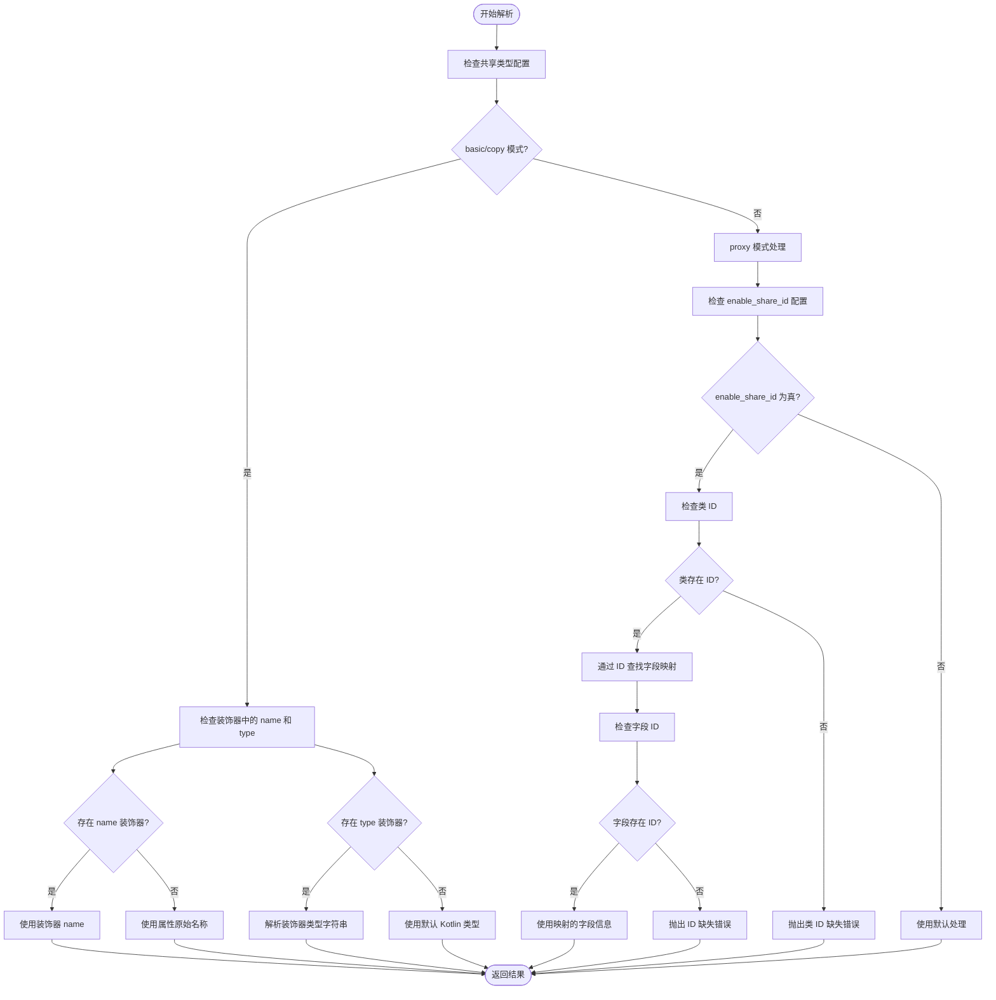

**图表来源**
- [convert/decls.py](file://convert/decls.py#L211-L246)

#### 新增的属性声明转换函数

**更新** 系统新增了 convert_prop_decl 函数，专门用于抽象类生成场景：

#### convert_prop_decl 函数
- **功能定位**: 生成属性声明的简化版本，仅包含属性签名
- **使用场景**: 抽象类生成、接口定义、类型声明等不需要完整实现细节的场景
- **输出格式**: 返回简单的属性声明字符串，如 `"var name: Type"` 或 `"val name: Type"`
- **与 convert_prop 的区别**: 不生成 getter/setter 实现代码，只返回属性声明

#### convert_prop 函数
- **功能定位**: 生成完整的属性实现，包含 getter/setter 方法
- **使用场景**: 具体类的属性实现生成
- **输出格式**: 返回包含属性声明和完整实现代码的列表
- **特点**: 包含类型转换逻辑、getter/setter 生成等完整功能

**章节来源**
- [convert/decls.py](file://convert/decls.py#L211-L246)
- [convert/decls.py](file://convert/decls.py#L335-L373)
- [convert/decls.py](file://convert/decls.py#L345-L361)

## 架构概览

系统采用分层架构设计，确保了良好的可维护性和扩展性：

```mermaid
graph TB
subgraph "输入层"
INPUT[Kotlin/TypeScript源码]
ABSTRACT_FIELD[抽象字段解析]
END
subgraph "解析层"
KT_PARSER[Kotlin解析器]
TS_PARSER[TypeScript解析器]
TS_ARKTS_PARSER[ArkTS解析器]
TS_TS_PARSER[TypeScript解析器]
TYPE_PARSER[Kotlin类型解析器]
ABSTRACT_PARSER[抽象字段解析器]
END
subgraph "配置层"
CONFIG[配置管理]
ENV[环境配置]
SHARE_TYPE[共享类型配置]
END
subgraph "模型层"
PROPERTY_DECL[PropertyDecl模型]
ABSTRACT_PROPERTY[抽象属性模型]
ANNOTATIONS[Annotations/Decorator]
TYPES[Type系统]
UNION_TYPE[UnionType]
ENUM_DECL[EnumDecl]
END
subgraph "转换层"
CONVERT_CLASS[类转换器]
GET_PROP_NAME_AND_TYPE[属性名称和类型获取]
CONVERT_PROP_DECL[属性声明转换]
CONVERT_PROP[完整属性转换]
END
subgraph "验证层"
DUPLICATE_CHECK[重复字段检查]
ERROR_REPORT[错误报告]
UNION_TYPE_CHECK[联合类型检查]
ENUM_CHECK[枚举类型检查]
ABSTRACT_FIELD_CHECK[抽象字段验证]
SHARE_TYPE_VALIDATION[共享类型验证]
END
subgraph "输出层"
CODEGEN[代码生成]
ABSTRACT_CODEGEN[抽象代码生成]
END
INPUT --> KT_PARSER
INPUT --> TS_PARSER
INPUT --> TS_ARKTS_PARSER
INPUT --> ABSTRACT_PARSER
KT_PARSER --> TYPE_PARSER
KT_PARSER --> PROPERTY_DECL
TS_PARSER --> PROPERTY_DECL
TS_ARKTS_PARSER --> UNION_TYPE
TS_ARKTS_PARSER --> ENUM_DECL
ABSTRACT_PARSER --> ABSTRACT_PROPERTY
PROPERTY_DECL --> ANNOTATIONS
PROPERTY_DECL --> TYPES
ABSTRACT_PROPERTY --> TYPES
UNION_TYPE --> TYPES
ENUM_DECL --> TYPES
CONFIG --> SHARE_TYPE
ENV --> SHARE_TYPE
SHARE_TYPE --> GET_PROP_NAME_AND_TYPE
GET_PROP_NAME_AND_TYPE --> CONVERT_PROP_DECL
GET_PROP_NAME_AND_TYPE --> CONVERT_PROP
CONVERT_CLASS --> DUPLICATE_CHECK
DUPLICATE_CHECK --> ERROR_REPORT
CONVERT_CLASS --> UNION_TYPE_CHECK
CONVERT_CLASS --> ENUM_CHECK
CONVERT_CLASS --> ABSTRACT_FIELD_CHECK
CONVERT_CLASS --> SHARE_TYPE_VALIDATION
CONVERT_PROP_DECL --> ABSTRACT_CODEGEN
CONVERT_PROP --> CODEGEN
```

**图表来源**
- [convert/decls.py](file://convert/decls.py#L211-L246)
- [convert/decls.py](file://convert/decls.py#L335-L373)
- [convert/decls.py](file://convert/decls.py#L345-L361)
- [convert/decls.py](file://convert/decls.py#L187-L231)
- [convert/decls.py](file://convert/decls.py#L303-L319)
- [convert/types.py](file://convert/types.py#L37-L43)
- [convert/env.py](file://convert/env.py#L241-L258)
- [utils/config.py](file://utils/config.py#L135-L145)

## 详细组件分析

### PropertyDecl类设计

PropertyDecl是属性声明处理的核心类，其设计体现了良好的面向对象原则：

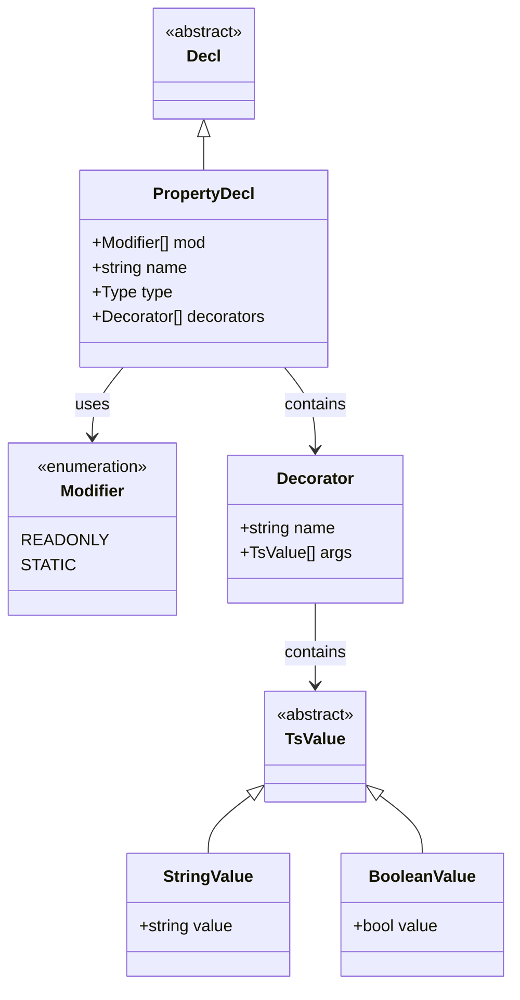

**图表来源**
- [lang/ts/decls.py](file://lang/ts/decls.py#L97-L116)

#### TypeScript版本对比

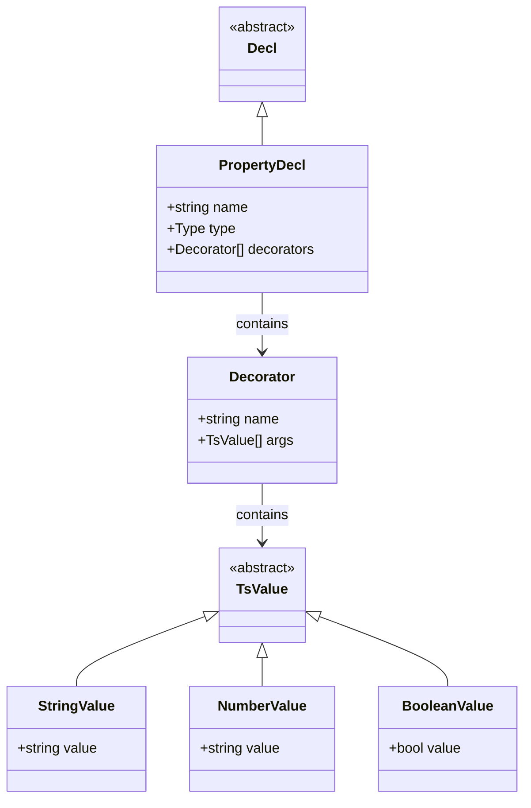

**图表来源**
- [lang/ts/decls.py](file://lang/ts/decls.py#L97-L116)

**章节来源**
- [lang/ts/decls.py](file://lang/ts/decls.py#L97-L116)

### 类型系统集成

#### Kotlin类型系统

Kotlin的类型系统提供了丰富的类型表示能力：

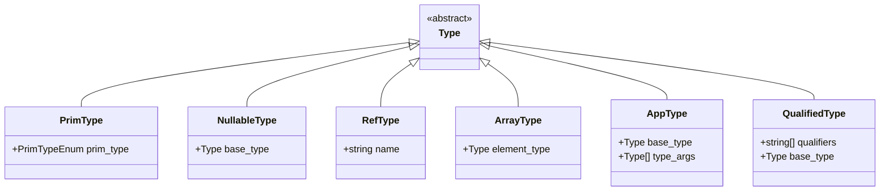

**图表来源**
- [lang/kt/kt_types.py](file://lang/kt/kt_types.py#L52-L98)

#### TypeScript类型系统

TypeScript类型系统更加复杂，现在支持联合类型和枚举类型：

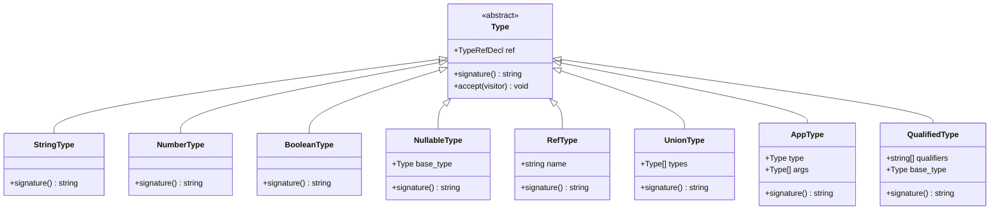

**更新** 新增UnionType类，支持联合类型的解析和处理：

**图表来源**
- [lang/ts/ts_types.py](file://lang/ts/ts_types.py#L8-L179)
- [lang/ts/ts_types.py](file://lang/ts/ts_types.py#L124-L132)

#### 联合类型支持

**更新** 系统现在支持联合类型，通过UnionType类实现：

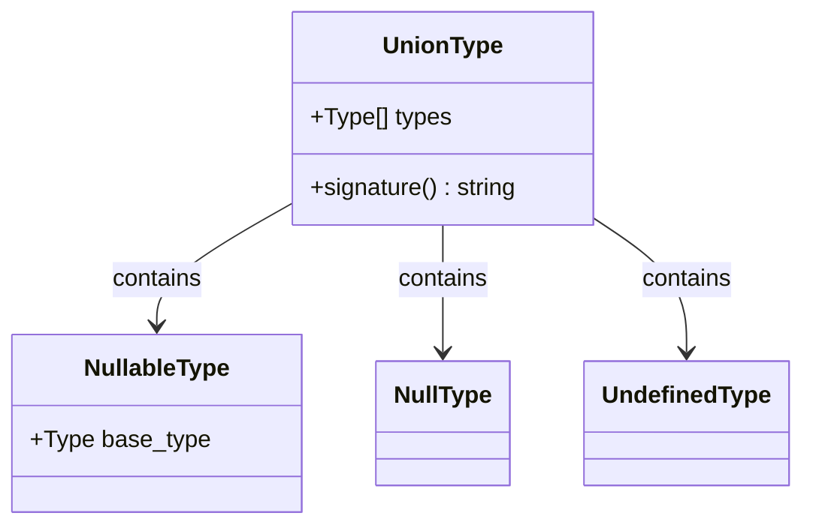

**图表来源**
- [lang/ts/ts_types.py](file://lang/ts/ts_types.py#L124-L132)

#### 枚举类型支持

**更新** 系统现在支持枚举类型，通过EnumDecl类实现：

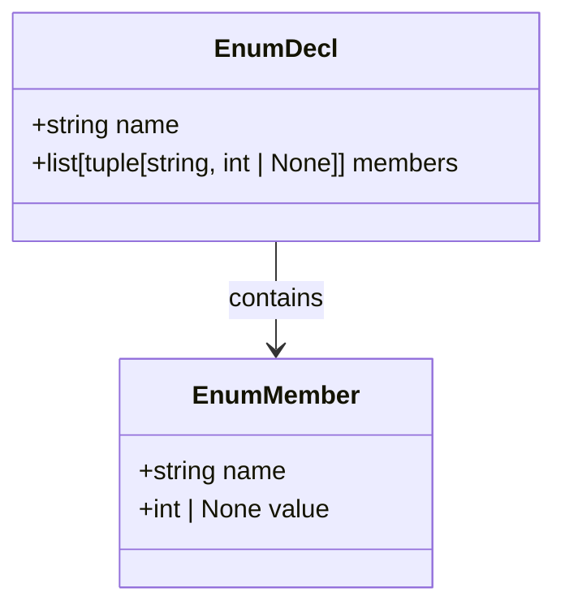

**图表来源**
- [lang/ts/parser_arkts.py](file://lang/ts/parser_arkts.py#L241-L251)

**章节来源**
- [lang/kt/kt_types.py](file://lang/kt/kt_types.py#L52-L191)
- [lang/ts/ts_types.py](file://lang/ts/ts_types.py#L8-L280)
- [lang/ts/ts_types.py](file://lang/ts/ts_types.py#L124-L132)
- [lang/ts/parser_arkts.py](file://lang/ts/parser_arkts.py#L241-L251)

### 解析流程分析

#### Kotlin属性解析流程

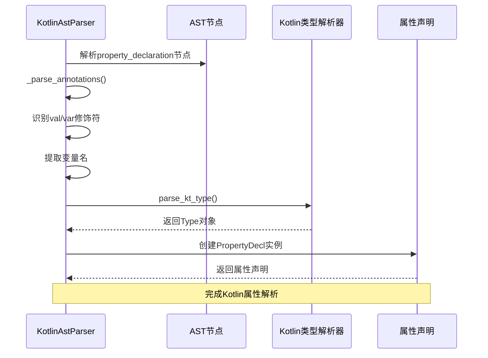

**图表来源**
- [lang/kt/kt_parser.py](file://lang/kt/kt_parser.py#L94-L128)
- [lang/kt/type_parser.py](file://lang/kt/type_parser.py#L149-L151)

#### TypeScript属性解析流程

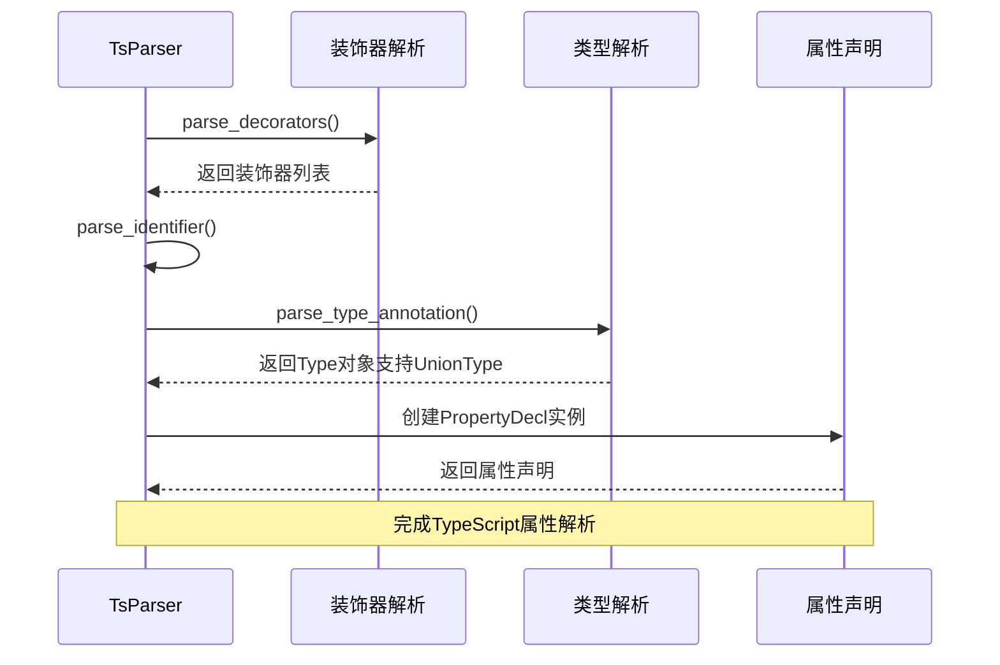

**更新** TypeScript解析器现在支持联合类型解析：

**图表来源**
- [lang/ts/parser.py](file://lang/ts/parser.py#L77-L87)
- [lang/ts/parser.py](file://lang/ts/parser.py#L164-L184)
- [lang/ts/parser_arkts.py](file://lang/ts/parser_arkts.py#L28-L31)

#### ArkTS属性解析流程

**更新** ArkTS解析器专门处理联合类型和枚举类型：

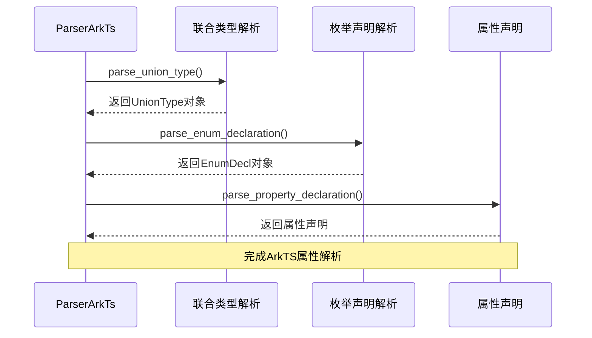

**图表来源**
- [lang/ts/parser_arkts.py](file://lang/ts/parser_arkts.py#L28-L31)
- [lang/ts/parser_arkts.py](file://lang/ts/parser_arkts.py#L241-L251)
- [lang/ts/parser_arkts.py](file://lang/ts/parser_arkts.py#L96-L112)

#### 抽象字段解析流程

**更新** 新增抽象字段解析流程，支持 convert_prop_decl 函数：

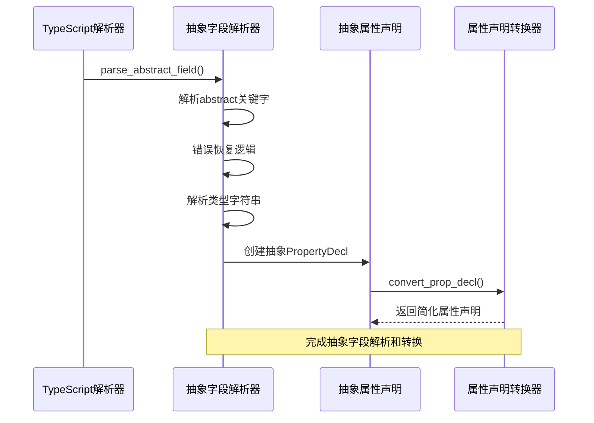

**图表来源**
- [lang/ts/parser_ts.py](file://lang/ts/parser_ts.py#L158-L225)
- [convert/decls.py](file://convert/decls.py#L335-L373)

#### 共享类型属性解析流程

**更新** 新增共享类型属性解析流程，展示 get_prop_name_and_type() 函数的工作机制：

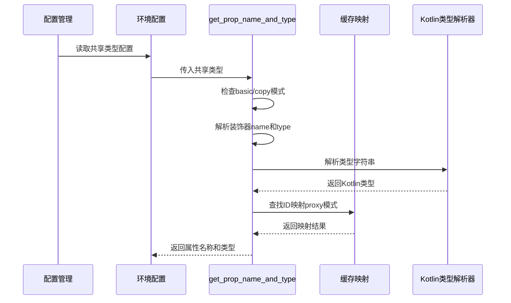

**图表来源**
- [convert/decls.py](file://convert/decls.py#L211-L246)
- [convert/env.py](file://convert/env.py#L241-L258)
- [utils/config.py](file://utils/config.py#L135-L145)

**章节来源**
- [lang/kt/kt_parser.py](file://lang/kt/kt_parser.py#L94-L128)
- [lang/ts/parser.py](file://lang/ts/parser.py#L77-L87)
- [lang/ts/parser_arkts.py](file://lang/ts/parser_arkts.py#L28-L31)
- [lang/ts/parser_arkts.py](file://lang/ts/parser_arkts.py#L96-L112)
- [lang/ts/parser_ts.py](file://lang/ts/parser_ts.py#L158-L225)
- [convert/decls.py](file://convert/decls.py#L211-L246)

### 验证逻辑和类型检查

**更新** 系统实现了多层次的验证机制，包括联合类型、枚举类型、抽象字段和共享类型的特殊处理：

#### 重构后的验证流程

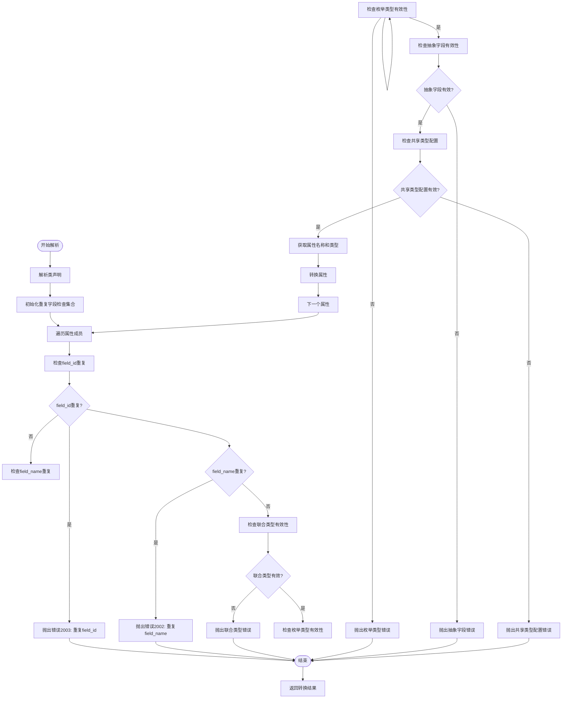

**图表来源**
- [convert/decls.py](file://convert/decls.py#L355-L372)

#### Kotlin类型验证流程

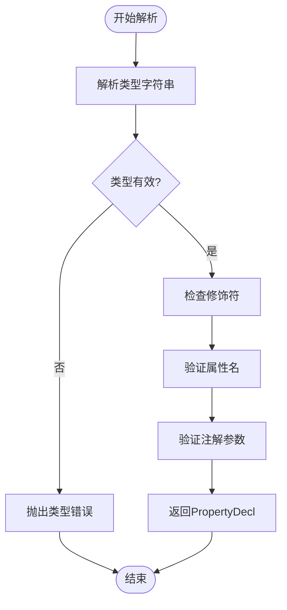

**图表来源**
- [lang/kt/kt_parser.py](file://lang/kt/kt_parser.py#L94-L128)
- [lang/kt/type_parser.py](file://lang/kt/type_parser.py#L92-L125)

#### TypeScript类型验证流程

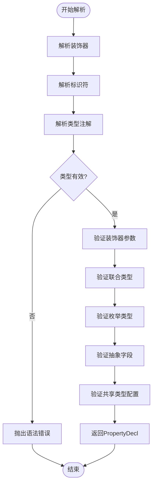

**更新** TypeScript验证流程现在包含联合类型、枚举类型、抽象字段和共享类型的验证：

**图表来源**
- [lang/ts/parser.py](file://lang/ts/parser.py#L77-L87)
- [lang/ts/parser.py](file://lang/ts/parser.py#L164-L184)
- [convert/types.py](file://convert/types.py#L37-L43)
- [lang/ts/parser_ts.py](file://lang/ts/parser_ts.py#L158-L225)
- [convert/decls.py](file://convert/decls.py#L211-L246)

### 类型转换增强

**更新** 类型转换系统现在支持联合类型、枚举类型、抽象字段和共享类型的转换：

#### 联合类型转换

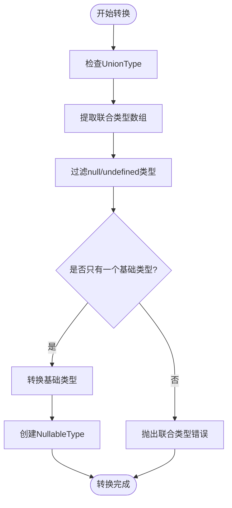

**图表来源**
- [convert/types.py](file://convert/types.py#L37-L43)

#### 枚举类型转换

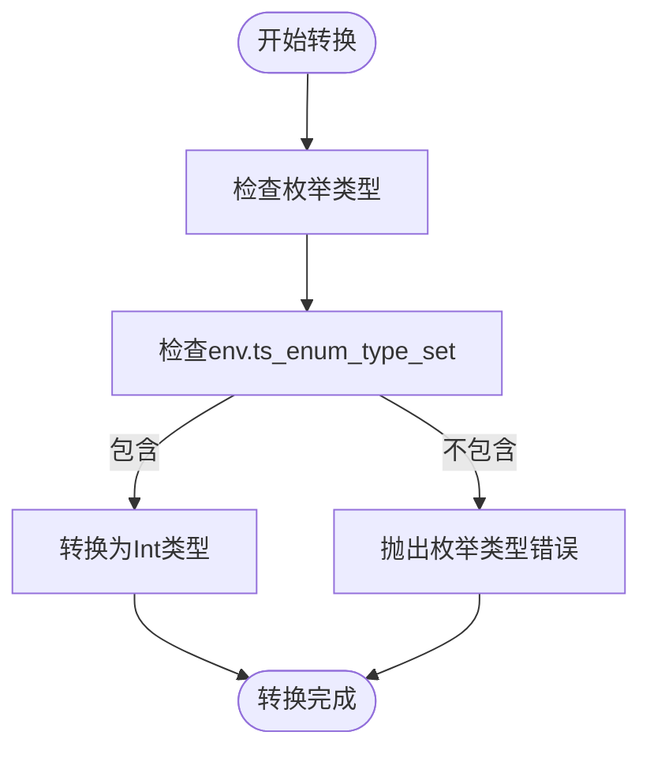

**图表来源**
- [convert/types.py](file://convert/types.py#L25-L28)

#### 抽象字段转换

**更新** 新增抽象字段转换流程：

```mermaid
flowchart TD
Start([开始转换]) --> CheckAbstractField["检查抽象字段"]
CheckAbstractField --> ExtractFieldType["提取字段类型"]
ExtractFieldType --> CheckFieldType{"类型有效?"}
CheckFieldType --> |否| RaiseError["抛出抽象字段错误"]
CheckFieldType --> |是| GenerateSimpleDecl["生成简化属性声明"]
GenerateSimpleDecl --> ReturnDecl["返回属性声明字符串"]
RaiseError --> End([转换完成])
ReturnDecl --> End
```

**图表来源**
- [convert/decls.py](file://convert/decls.py#L335-L373)

#### 共享类型属性转换

**更新** 新增共享类型属性转换流程：

```mermaid
flowchart TD
Start([开始转换]) --> CheckShareType["检查共享类型配置"]
CheckShareType --> BasicCopy{"basic/copy 模式?"}
BasicCopy --> |是| CheckDecorator["检查装饰器配置"]
CheckDecorator --> ParseName["解析装饰器name"]
CheckDecorator --> ParseType["解析装饰器type"]
ParseType --> ParseKtType["解析Kotlin类型"]
ParseKtType --> End([转换完成])
BasicCopy --> |否| ProxyMode["proxy 模式处理"]
ProxyMode --> CheckEnableId["检查enable_share_id"]
CheckEnableId --> EnableId{"enable_share_id 为真?"}
EnableId --> |是| CheckClassId["检查类ID"]
CheckClassId --> HasClassId{"类存在ID?"}
HasClassId --> |是| LookupField["查找字段映射"]
LookupField --> CheckFieldId["检查字段ID"]
CheckFieldId --> HasFieldId{"字段存在ID?"}
HasFieldId --> |是| UseMappedField["使用映射字段"]
HasFieldId --> |否| RaiseError["抛出字段ID缺失错误"]
HasClassId --> |否| RaiseError["抛出类ID缺失错误"]
EnableId --> |否| UseDefault["使用默认处理"]
UseMappedField --> End
UseDefault --> End
RaiseError --> End
```

**图表来源**
- [convert/decls.py](file://convert/decls.py#L211-L246)

**章节来源**
- [convert/types.py](file://convert/types.py#L37-L43)
- [convert/types.py](file://convert/types.py#L25-L28)
- [convert/decls.py](file://convert/decls.py#L335-L373)
- [convert/decls.py](file://convert/decls.py#L211-L246)

## 依赖关系分析

系统采用了清晰的依赖层次结构：

```mermaid
graph TB
subgraph "外部依赖"
TREE_SITTER[Tree Sitter解析器]
DATA_CLASSES[数据类装饰器]
ENUMS[枚举类型]
ENV[环境配置]
ABSTRACT_FIELDS[抽象字段支持]
SHARE_TYPE_CONFIG[共享类型配置]
END
subgraph "内部模块"
KT_DECLS[Kotlin声明]
TS_DECLS[TypeScript声明]
KT_TYPES[Kotlin类型]
TS_TYPES[TypeScript类型]
TS_UNION_TYPE[联合类型]
TS_ENUM_DECL[枚举声明]
TS_ABSTRACT_FIELD[抽象字段解析]
KT_PARSER[Kotlin解析器]
TS_PARSER[TypeScript解析器]
TS_ARKTS_PARSER[ArkTS解析器]
TS_TS_PARSER[TypeScript解析器]
TYPE_PARSER[Kotlin类型解析器]
CONVERT_DECLS[转换声明]
CHECK[验证检查]
GET_PROP_NAME_AND_TYPE[属性名称和类型获取]
CONVERT_PROP_DECL[属性声明转换]
CONVERT_PROP[完整属性转换]
END
subgraph "测试用例"
TS_TESTS[TypeScript测试]
KT_TESTS[Kotlin测试]
ENUM_TESTS[枚举测试]
ABSTRACT_TESTS[抽象字段测试]
SHARE_TYPE_TESTS[共享类型测试]
END
TREE_SITTER --> KT_PARSER
TREE_SITTER --> TS_PARSER
TREE_SITTER --> TS_ARKTS_PARSER
TREE_SITTER --> TS_TS_PARSER
DATA_CLASSES --> KT_DECLS
DATA_CLASSES --> TS_DECLS
ENUMS --> KT_DECLS
TS_DECLS --> TS_TYPES
TS_DECLS --> TS_UNION_TYPE
TS_DECLS --> TS_ENUM_DECL
TS_DECLS --> TS_ABSTRACT_FIELD
KT_PARSER --> KT_DECLS
KT_PARSER --> TYPE_PARSER
TS_PARSER --> TS_DECLS
TS_ARKTS_PARSER --> TS_UNION_TYPE
TS_ARKTS_PARSER --> TS_ENUM_DECL
TS_TS_PARSER --> TS_ABSTRACT_FIELD
CONVERT_DECLS --> CHECK
CONVERT_DECLS --> ENV
GET_PROP_NAME_AND_TYPE --> SHARE_TYPE_CONFIG
CONVERT_PROP_DECL --> CONVERT_PROP
TS_TESTS --> TS_PARSER
TS_TESTS --> TS_TS_PARSER
ENUM_TESTS --> TS_ARKTS_PARSER
ABSTRACT_TESTS --> TS_TS_PARSER
SHARE_TYPE_TESTS --> GET_PROP_NAME_AND_TYPE
KT_TESTS --> KT_PARSER
```

**图表来源**
- [convert/decls.py](file://convert/decls.py#L1-L21)
- [lang/ts/decls.py](file://lang/ts/decls.py#L1-L2)
- [lang/ts/parser_arkts.py](file://lang/ts/parser_arkts.py#L241-L251)
- [lang/ts/parser_ts.py](file://lang/ts/parser_ts.py#L158-L225)
- [convert/env.py](file://convert/env.py#L241-L258)
- [utils/config.py](file://utils/config.py#L135-L145)

**章节来源**
- [convert/decls.py](file://convert/decls.py#L1-L21)
- [lang/ts/decls.py](file://lang/ts/decls.py#L1-L2)
- [lang/ts/parser_arkts.py](file://lang/ts/parser_arkts.py#L241-L251)
- [lang/ts/parser_ts.py](file://lang/ts/parser_ts.py#L158-L225)
- [convert/env.py](file://convert/env.py#L241-L258)
- [utils/config.py](file://utils/config.py#L135-L145)

## 性能考虑

系统在设计时充分考虑了性能优化：

### 内存管理
- 使用`@dataclass(frozen=True)`确保不可变性，提高内存效率
- 类型系统采用不可变数据结构，支持高效缓存
- 解析器使用流式处理，避免大文件加载到内存
- **更新** 新增的 get_prop_name_and_type() 函数采用轻量级实现，减少内存占用
- **更新** 共享类型处理机制避免重复的装饰器解析

### 解析优化
- Tree Sitter提供高性能的语法解析
- 类型解析采用自顶向下的递归下降算法
- 缓存常见的类型映射关系
- **更新** 联合类型解析采用高效的类型合并策略
- **更新** 抽象字段解析采用快速路径优化
- **更新** 共享类型配置采用延迟加载机制

### 扩展性设计
- 抽象基类支持未来功能扩展
- 模块化设计便于独立测试和维护
- 清晰的接口定义支持多语言扩展
- **更新** 类型转换系统支持动态类型注册
- **更新** 新增的转换函数支持插件化扩展
- **更新** 共享类型配置支持运行时动态切换

## 故障排除指南

### 常见问题及解决方案

#### 重复字段验证错误
**更新** 错误报告机制已改进，现在提供更明确的错误信息：

- **错误2003**: `Duplicate field_id '{field_id.value}' found in class {c.name}`
- **原因**: 属性声明中存在重复的`field_id`值
- **解决方案**: 确保每个类中的`field_id`值都是唯一的

- **错误2002**: `Duplicate field name '{field_name.value}' found in class {c.name}`
- **原因**: 属性声明中存在重复的`field_name`值
- **解决方案**: 确保每个类中的`field_name`值都是唯一的

#### 联合类型解析错误
**更新** 新增联合类型相关的错误处理：

- **错误**: `Unrecognized union type {t}`
- **原因**: 联合类型包含多个非空类型或无效的类型组合
- **解决方案**: 确保联合类型只包含一个非空类型，如 `string | null`

- **错误**: `Cannot unwrap union type with multiple non-nullable members`
- **原因**: 联合类型无法安全转换为可空类型
- **解决方案**: 使用正确的联合类型语法，如 `string | null | undefined`

#### 枚举类型解析错误
**更新** 新增枚举类型相关的错误处理：

- **错误**: `Enum type {name} not found in ts_enum_type_set`
- **原因**: 枚举类型未在环境配置中注册
- **解决方案**: 在环境配置中添加枚举类型定义

- **错误**: `cannot convert arkts enum type {arkts_type} to kotlin type {kt_type}`
- **原因**: 枚举类型转换不支持的目标类型
- **解决方案**: 确保枚举类型转换到支持的Kotlin类型

#### 抽象字段解析错误
**更新** 新增抽象字段相关的错误处理：

- **错误**: `Abstract field parsing failed`
- **原因**: 抽象字段解析过程中出现语法错误
- **解决方案**: 检查抽象字段的语法格式，确保符合 `abstract fieldName: Type` 规范

- **错误**: `Invalid abstract field type`
- **原因**: 抽象字段类型不支持或解析失败
- **解决方案**: 使用有效的TypeScript类型，如基本类型或引用类型

#### 共享类型配置错误
**更新** 新增共享类型相关的错误处理：

- **错误**: `Cannot get prop name and type`
- **原因**: 共享类型配置不支持或解析失败
- **解决方案**: 检查配置文件中的 shareType 设置，确保值为 'basic'、'copy' 或 'proxy'

- **错误**: `Class {parent.name} is missing the 'id' decorator`
- **原因**: proxy 模式下类缺少必要的 ID 装饰器
- **解决方案**: 为类添加 @ExportClass({id: "class_id"}) 装饰器

- **错误**: `Field with id '{field_id}' not found in kt_shared_class_field_name_map`
- **原因**: proxy 模式下找不到对应的字段映射
- **解决方案**: 检查 Kotlin 侧的字段 ID 配置，确保与 TypeScript 侧一致

#### Kotlin属性解析错误
- **问题**: `property_declaration missing val/var`
- **原因**: 缺少属性修饰符
- **解决方案**: 确保属性声明包含`val`或`var`

- **问题**: `Property {name} missing type`
- **原因**: 属性类型缺失
- **解决方案**: 为属性提供完整类型声明

#### TypeScript属性解析错误
- **问题**: `Expected identifier, but got {type}`
- **原因**: 属性名解析失败
- **解决方案**: 检查属性名是否为合法标识符

- **问题**: `Unexpected token {token}`
- **原因**: 类型注解语法错误
- **解决方案**: 验证类型注解的语法正确性

**章节来源**
- [convert/decls.py](file://convert/decls.py#L364-L371)
- [convert/decls.py](file://convert/decls.py#L211-L246)
- [lang/kt/kt_parser.py](file://lang/kt/kt_parser.py#L103-L105)
- [lang/ts/parser.py](file://lang/ts/parser.py#L103-L107)
- [convert/types.py](file://convert/types.py#L37-L43)
- [convert/types.py](file://convert/types.py#L25-L28)
- [lang/ts/parser_ts.py](file://lang/ts/parser_ts.py#L158-L225)
- [utils/config.py](file://utils/config.py#L135-L145)

## 结论

属性声明处理系统展现了优秀的软件工程实践：

### 设计优势
- **统一抽象**: 通过Decl基类实现了跨语言的一致性
- **类型安全**: 强类型的类型系统确保编译时错误检测，包括联合类型、枚举类型和抽象字段
- **扩展性**: 模块化设计支持未来功能扩展
- **性能优化**: 流式处理和不可变数据结构提升执行效率
- **改进的验证机制**: 重构后的重复字段验证提供更好的错误报告
- **更新** **联合类型支持**: 新增联合类型处理能力，支持复杂的类型组合
- **更新** **枚举类型支持**: 新增枚举类型处理能力，支持常量枚举的解析和转换
- **更新** **抽象字段支持**: 新增抽象字段解析和转换功能，支持抽象类生成场景
- **更新** **共享类型处理**: 新增 get_prop_name_and_type() 函数，提供智能的属性解析机制
- **更新** **简化转换功能**: 新增 convert_prop_decl 函数，提供轻量级属性声明转换

### 应用价值
- **代码生成**: 为不同目标语言提供统一的中间表示
- **类型检查**: 在解析阶段就发现潜在的类型错误，包括联合类型、枚举类型、抽象字段和共享类型错误
- **装饰器支持**: 灵活的元数据处理机制
- **多语言支持**: 同时支持Kotlin和TypeScript的属性声明
- **增强的错误报告**: 更精确的重复字段验证和错误信息
- **更新** **类型转换增强**: 支持联合类型、枚举类型、抽象字段和共享类型的双向转换
- **更新** **抽象类生成**: 专门的简化转换功能支持抽象类的字段声明生成
- **更新** **智能属性解析**: 基于共享类型配置的智能属性名称和类型获取机制

### 发展方向
- 扩展更多语言的属性声明支持
- 增强类型推断能力，特别是联合类型的推断
- 优化大型项目的解析性能
- 提供更丰富的代码生成模板
- 进一步改进验证和错误报告机制
- **更新** **联合类型优化**: 支持更复杂的联合类型组合和嵌套
- **更新** **枚举类型扩展**: 支持更多枚举类型的变体和特性
- **更新** **抽象字段完善**: 增强抽象字段的类型检查和转换支持
- **更新** **共享类型增强**: 支持更多共享类型的变体和配置选项
- **更新** **转换函数扩展**: 支持更多场景的属性声明转换需求

**更新** 本次更新显著增强了属性声明处理系统的能力，通过新增 get_prop_name_and_type() 函数、共享类型处理机制、联合类型（UnionType）、枚举类型（EnumType）和抽象字段支持，系统现在能够处理更复杂的类型场景。新增的智能属性解析功能为不同共享类型提供了专门的支持，而联合类型和枚举类型的支持使得系统能够更好地适应现代TypeScript开发的需求。这些增强不仅提升了系统的表达能力，也为跨语言的类型转换和代码生成提供了更强大的基础。

该系统为跨语言的属性声明处理提供了一个坚实的基础，既满足了当前的需求，也为未来的扩展预留了充足的空间。新增的类型支持、转换功能和共享类型处理使得系统能够更好地适应多样化的开发场景，特别是在处理API响应、配置选项、状态管理和抽象类生成等场景时提供了更大的灵活性。