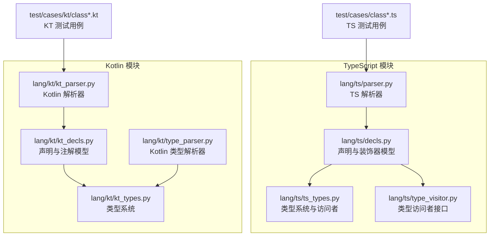
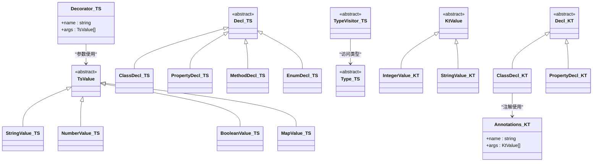
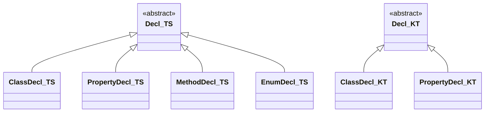
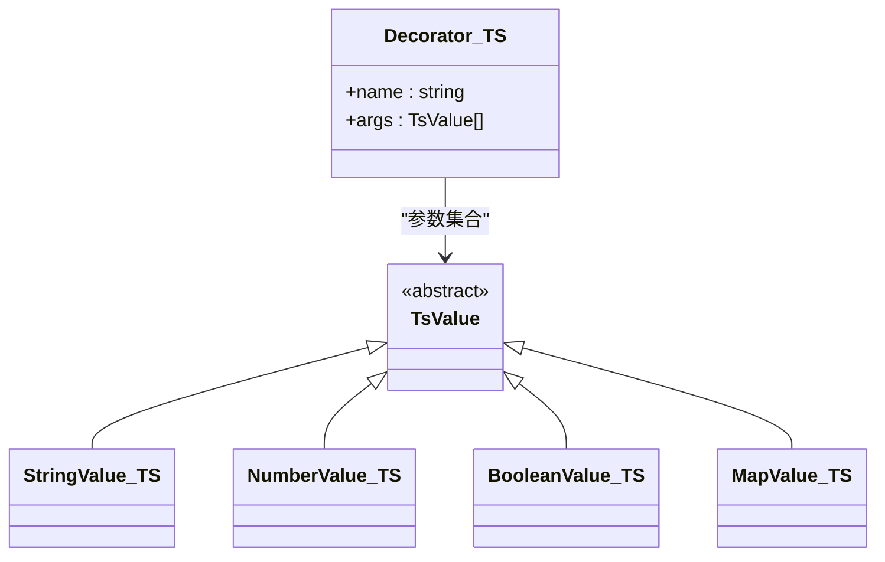
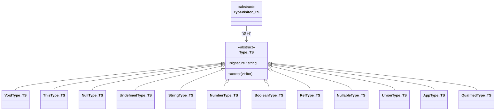
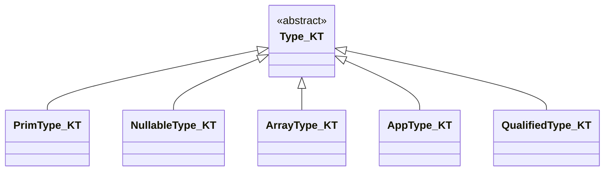
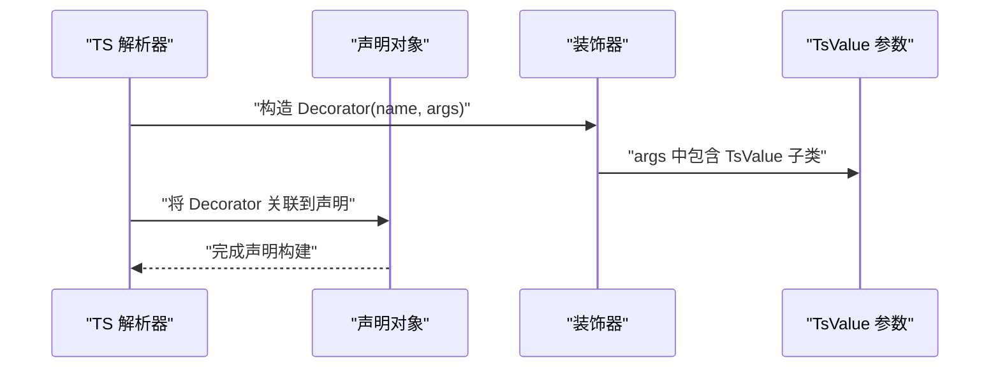
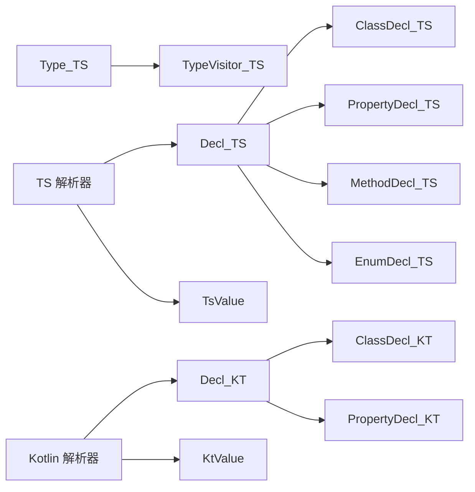

# 抽象基类设计

<cite>
**本文档引用的文件**
- [lang/ts/decls.py](file://lang/ts/decls.py)
- [lang/kt/kt_decls.py](file://lang/kt/kt_decls.py)
- [lang/ts/ts_types.py](file://lang/ts/ts_types.py)
- [lang/kt/kt_types.py](file://lang/kt/kt_types.py)
- [lang/ts/type_visitor.py](file://lang/ts/type_visitor.py)
- [lang/ts/parser.py](file://lang/ts/parser.py)
- [lang/kt/kt_parser.py](file://lang/kt/kt_parser.py)
- [lang/kt/type_parser.py](file://lang/kt/type_parser.py)
- [test/cases/class0.ts](file://test/cases/class0.ts)
- [test/cases/class1.ts](file://test/cases/class1.ts)
- [test/cases/class2.ts](file://test/cases/class2.ts)
- [test/cases/kt/class0.kt](file://test/cases/kt/class0.kt)
</cite>

## 目录
1. [引言](#引言)
2. [项目结构](#项目结构)
3. [核心组件](#核心组件)
4. [架构总览](#架构总览)
5. [详细组件分析](#详细组件分析)
6. [依赖分析](#依赖分析)
7. [性能考虑](#性能考虑)
8. [故障排除指南](#故障排除指南)
9. [结论](#结论)

## 引言
本文件聚焦于代码库中“抽象基类”的设计与应用，围绕以下目标展开：
- 解释 Decl 抽象基类的设计理念与继承层次结构
- 说明 TsValue 抽象基类及其在装饰器参数处理中的作用
- 详细介绍抽象类在声明类型系统中的设计模式应用
- 提供抽象基类的扩展机制与子类实现指南
- 给出具体的继承关系图与使用示例
- 阐述抽象基类如何确保声明类型的统一性与类型安全性

## 项目结构
该项目采用按语言分层的模块化组织方式：TypeScript 与 Kotlin 的声明、类型、解析器分别位于独立的子目录中，便于维护与扩展。

图表来源
- [lang/ts/decls.py](file://lang/ts/decls.py#L1-L57)
- [lang/ts/ts_types.py](file://lang/ts/ts_types.py#L1-L280)
- [lang/ts/type_visitor.py](file://lang/ts/type_visitor.py#L1-L32)
- [lang/ts/parser.py](file://lang/ts/parser.py#L175-L217)
- [lang/kt/kt_decls.py](file://lang/kt/kt_decls.py#L1-L51)
- [lang/kt/kt_types.py](file://lang/kt/kt_types.py#L1-L191)
- [lang/kt/kt_parser.py](file://lang/kt/kt_parser.py#L51-L178)
- [lang/kt/type_parser.py](file://lang/kt/type_parser.py#L1-L152)
- [test/cases/class0.ts](file://test/cases/class0.ts#L1-L4)
- [test/cases/kt/class0.kt](file://test/cases/kt/class0.kt#L1-L9)

章节来源
- [lang/ts/decls.py](file://lang/ts/decls.py#L1-L57)
- [lang/kt/kt_decls.py](file://lang/kt/kt_decls.py#L1-L51)
- [lang/ts/ts_types.py](file://lang/ts/ts_types.py#L1-L280)
- [lang/kt/kt_types.py](file://lang/kt/kt_types.py#L1-L191)

## 核心组件
本节聚焦两类抽象基类及其派生体系：
- 声明抽象基类 Decl：用于统一表示 TypeScript 与 Kotlin 的各类声明（类、属性、方法、枚举等）
- 类型抽象基类 Type：用于统一表示 TypeScript 与 Kotlin 的类型系统，并通过访问者模式实现类型操作的扩展

此外，还包含装饰器参数值的抽象基类 TsValue（以及 Kotlin 对应的 KtValue），用于在解析阶段对装饰器/注解的参数进行建模。

章节来源
- [lang/ts/decls.py](file://lang/ts/decls.py#L4-L57)
- [lang/kt/kt_decls.py](file://lang/kt/kt_decls.py#L10-L15)
- [lang/ts/ts_types.py](file://lang/ts/ts_types.py#L8-L22)
- [lang/kt/kt_types.py](file://lang/kt/kt_types.py#L52-L53)
- [lang/ts/decls.py](file://lang/ts/decls.py#L7-L8)
- [lang/kt/kt_decls.py](file://lang/kt/kt_decls.py#L14-L15)

## 架构总览
下图展示了抽象基类在声明与类型系统中的整体关系，以及与解析器的交互路径。

图表来源
- [lang/ts/decls.py](file://lang/ts/decls.py#L4-L57)
- [lang/ts/ts_types.py](file://lang/ts/ts_types.py#L8-L22)
- [lang/ts/type_visitor.py](file://lang/ts/type_visitor.py#L5-L32)
- [lang/kt/kt_decls.py](file://lang/kt/kt_decls.py#L10-L51)

## 详细组件分析

### Decl 抽象基类与继承层次
- 设计理念
  - Decl 作为所有声明类型的抽象基类，统一了 TypeScript 与 Kotlin 的声明建模，使解析器与后续处理逻辑无需关心具体语言差异
  - 通过在派生类中封装字段（如名称、成员列表、修饰符、返回类型、参数等），保证声明对象的结构一致性
- TypeScript 层次
  - ClassDecl、PropertyDecl、MethodDecl、EnumDecl 均继承自 Decl
  - 装饰器（Decorator）与声明关联，Decorator 的参数使用 TsValue 抽象类型
- Kotlin 层次
  - ClassDecl、PropertyDecl 继承自 Decl；Kotlin 使用 Annotations 表示注解，其参数使用 KtValue 抽象类型
- 统一性与类型安全
  - 由于所有声明都实现同一接口（通过抽象基类约束），编译器/静态检查工具可基于该接口进行类型校验
  - 解析器在生成声明对象时，必须遵循抽象基类约定，避免运行期类型不一致

图表来源
- [lang/ts/decls.py](file://lang/ts/decls.py#L32-L57)
- [lang/kt/kt_decls.py](file://lang/kt/kt_decls.py#L35-L51)

章节来源
- [lang/ts/decls.py](file://lang/ts/decls.py#L32-L57)
- [lang/kt/kt_decls.py](file://lang/kt/kt_decls.py#L35-L51)

### TsValue 抽象基类与装饰器参数处理
- 设计目的
  - 将装饰器参数的值域抽象为 TsValue 及其子类，便于解析器在不同上下文中统一处理字符串、数字、布尔、映射等参数
- 子类职责
  - StringValue、NumberValue、BooleanValue、MapValue 分别承载对应类型的参数值
  - MapValue 支持嵌套 TsValue，形成参数树，满足复杂装饰器参数的表达
- 在解析器中的作用
  - TypeScript 解析器在遇到装饰器节点时，会构造 Decorator 对象，并将解析到的 TsValue 参数集合作为其参数
  - Kotlin 解析器将注解参数解析为 KtValue，并以 Annotations 形式附加到声明上
- 类型安全
  - 通过抽象基类约束，调用方在处理装饰器参数时，只需面向 TsValue 接口编程，避免类型分支散落各处

图表来源
- [lang/ts/decls.py](file://lang/ts/decls.py#L7-L31)

章节来源
- [lang/ts/decls.py](file://lang/ts/decls.py#L7-L31)

### TypeScript 类型系统中的抽象基类与访问者模式
- Type 抽象基类
  - 所有 TypeScript 类型（基础类型、引用类型、可空类型、联合类型、应用类型、限定类型等）均继承自 Type
  - 通过统一的签名生成与访问者接口，实现类型信息的稳定输出与扩展处理
- TypeVisitor 抽象基类
  - 定义针对不同类型访问的方法骨架，子类可选择性覆盖特定类型访问逻辑
  - 通过在 Type 上的 accept 方法调度，实现“双分派”式的类型处理扩展
- 类型工具函数
  - 提供一系列类型判断与提取函数（如可空解包、基础名提取、内置集合类型识别等），这些函数依赖于抽象基类的类型层次，确保在扩展新类型时仍能保持一致性

图表来源
- [lang/ts/ts_types.py](file://lang/ts/ts_types.py#L8-L280)
- [lang/ts/type_visitor.py](file://lang/ts/type_visitor.py#L5-L32)

章节来源
- [lang/ts/ts_types.py](file://lang/ts/ts_types.py#L8-L280)
- [lang/ts/type_visitor.py](file://lang/ts/type_visitor.py#L5-L32)

### Kotlin 类型系统中的抽象基类
- Type 抽象基类
  - Kotlin 类型系统同样以 Type 抽象基类为核心，派生出基础类型、可空类型、数组类型、应用类型、限定类型等
- 类型工具函数
  - 提供类型判断与名称提取函数，确保在新增类型时仍能保持工具函数的一致行为
- 与解析器的配合
  - Kotlin 类型解析器将字符串形式的类型描述转换为上述类型对象，供后续处理使用

图表来源
- [lang/kt/kt_types.py](file://lang/kt/kt_types.py#L52-L98)

章节来源
- [lang/kt/kt_types.py](file://lang/kt/kt_types.py#L52-L98)

### 解析流程与装饰器/注解参数处理
- TypeScript 装饰器解析
  - 解析器在遇到装饰器节点时，构造 Decorator 对象，并将 TsValue 参数集合作为其参数
  - 装饰器与声明（如 ClassDecl、PropertyDecl）建立关联，便于后续处理
- Kotlin 注解解析
  - 解析器从注解节点中提取注解名与参数，参数以 KtValue 表示，并封装为 Annotations，附加到声明上
- 使用示例
  - TypeScript 示例：参见测试用例中的装饰器使用
  - Kotlin 示例：参见测试用例中的注解使用

图表来源
- [lang/ts/parser.py](file://lang/ts/parser.py#L175-L217)
- [lang/ts/decls.py](file://lang/ts/decls.py#L27-L36)

章节来源
- [lang/ts/parser.py](file://lang/ts/parser.py#L175-L217)
- [lang/ts/decls.py](file://lang/ts/decls.py#L27-L36)
- [lang/kt/kt_parser.py](file://lang/kt/kt_parser.py#L51-L81)
- [lang/kt/kt_decls.py](file://lang/kt/kt_decls.py#L28-L38)

### 扩展机制与子类实现指南
- 新增声明类型
  - 步骤
    - 定义新的派生类，继承自 Decl（TypeScript 或 Kotlin）
    - 明确该声明所需的字段（名称、成员、修饰符、返回类型、参数等）
    - 在解析器中添加对该声明类型的解析逻辑，确保生成的声明对象符合抽象基类约定
  - 注意事项
    - 保持字段命名与语义一致，避免破坏统一性
    - 如需支持装饰器/注解，确保参数类型使用 TsValue/KtValue 抽象类型
- 新增类型
  - 步骤
    - 定义新的派生类，继承自 Type（TypeScript）或 Type（Kotlin）
    - 实现必要的签名生成与访问者接口
    - 在工具函数中添加相应的类型判断逻辑
  - 注意事项
    - 确保与现有类型层次兼容，避免破坏访问者与工具函数的行为
- 新增装饰器/注解参数类型
  - 步骤
    - 定义新的 TsValue/KtValue 子类，承载新类型的参数值
    - 在解析器中添加对该参数类型的解析逻辑
  - 注意事项
    - 保持参数值的不可变性与可序列化特性，便于后续处理

章节来源
- [lang/ts/decls.py](file://lang/ts/decls.py#L4-L57)
- [lang/kt/kt_decls.py](file://lang/kt/kt_decls.py#L10-L51)
- [lang/ts/ts_types.py](file://lang/ts/ts_types.py#L8-L280)
- [lang/kt/kt_types.py](file://lang/kt/kt_types.py#L52-L98)

## 依赖分析
- 抽象基类之间的耦合
  - Decl 与 Type 分别在 TypeScript 与 Kotlin 模块内形成独立的继承体系，彼此无直接依赖，体现了语言层面的隔离
- 访问者模式的依赖
  - TypeVisitor 依赖于 Type 层次，通过 accept 方法实现对不同类型的统一处理
- 解析器与模型的依赖
  - TypeScript 解析器依赖 Decl 与 TsValue；Kotlin 解析器依赖 Decl 与 KtValue
- 工具函数的依赖
  - 类型工具函数依赖抽象基类的类型层次，确保在扩展新类型时仍能正确工作

图表来源
- [lang/ts/decls.py](file://lang/ts/decls.py#L4-L57)
- [lang/ts/ts_types.py](file://lang/ts/ts_types.py#L8-L22)
- [lang/ts/type_visitor.py](file://lang/ts/type_visitor.py#L5-L32)
- [lang/ts/parser.py](file://lang/ts/parser.py#L175-L217)
- [lang/kt/kt_decls.py](file://lang/kt/kt_decls.py#L10-L51)
- [lang/kt/kt_parser.py](file://lang/kt/kt_parser.py#L51-L81)

章节来源
- [lang/ts/decls.py](file://lang/ts/decls.py#L4-L57)
- [lang/ts/ts_types.py](file://lang/ts/ts_types.py#L8-L22)
- [lang/ts/type_visitor.py](file://lang/ts/type_visitor.py#L5-L32)
- [lang/kt/kt_decls.py](file://lang/kt/kt_decls.py#L10-L51)

## 性能考虑
- 抽象基类的开销
  - 抽象基类本身不引入额外运行时开销；主要成本在于多态调用与访问者调度
- 类型系统的优化
  - 使用不可变数据类（如 frozen dataclass）减少内存占用与拷贝成本
  - 工具函数尽量避免重复遍历，必要时缓存中间结果
- 解析器的效率
  - 在装饰器/注解参数解析时，优先使用轻量级的字符串或简单值类型，仅在需要时构建复杂参数树

## 故障排除指南
- 装饰器/注解参数类型不匹配
  - 症状：解析器无法正确识别参数类型
  - 处理：确认参数类型是否属于 TsValue/KtValue 的子类；检查解析器对参数类型的分支处理
- 类型工具函数异常
  - 症状：类型判断或名称提取失败
  - 处理：确认新增类型已正确继承 Type 抽象基类，并在工具函数中添加相应分支
- 访问者未覆盖新类型
  - 症状：新增类型未被访问者处理
  - 处理：在 TypeVisitor 中添加对应访问方法，并在 Type 的 accept 方法中调用

章节来源
- [lang/ts/decls.py](file://lang/ts/decls.py#L7-L31)
- [lang/kt/kt_decls.py](file://lang/kt/kt_decls.py#L14-L38)
- [lang/ts/ts_types.py](file://lang/ts/ts_types.py#L180-L237)
- [lang/ts/type_visitor.py](file://lang/ts/type_visitor.py#L5-L32)

## 结论
本项目通过抽象基类实现了声明与类型系统的统一建模，既保证了跨语言的一致性，又为扩展提供了清晰的接口与约束。Decl 与 Type 抽象基类分别在声明与类型层面建立了稳定的继承层次，TsValue/KtValue 则为装饰器/注解参数提供了统一的值域抽象。结合访问者模式与工具函数，系统在保持类型安全性的同时，具备良好的可扩展性与可维护性。