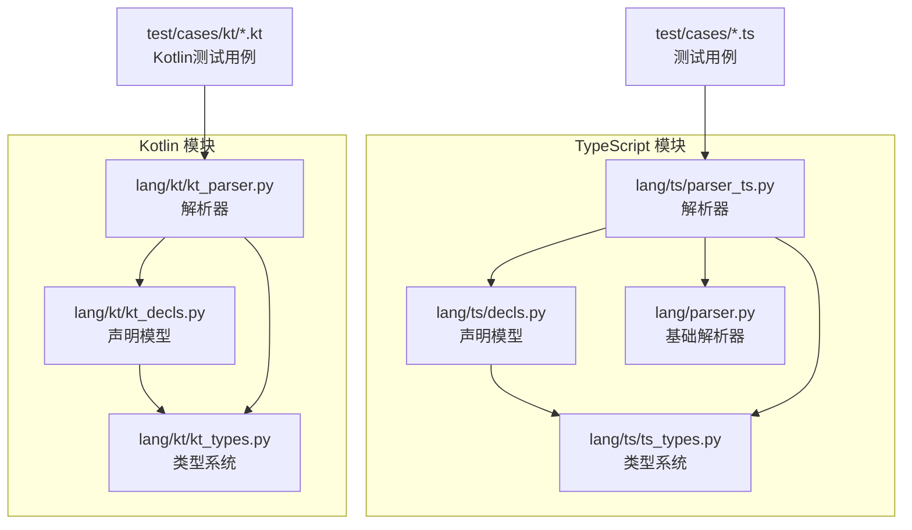
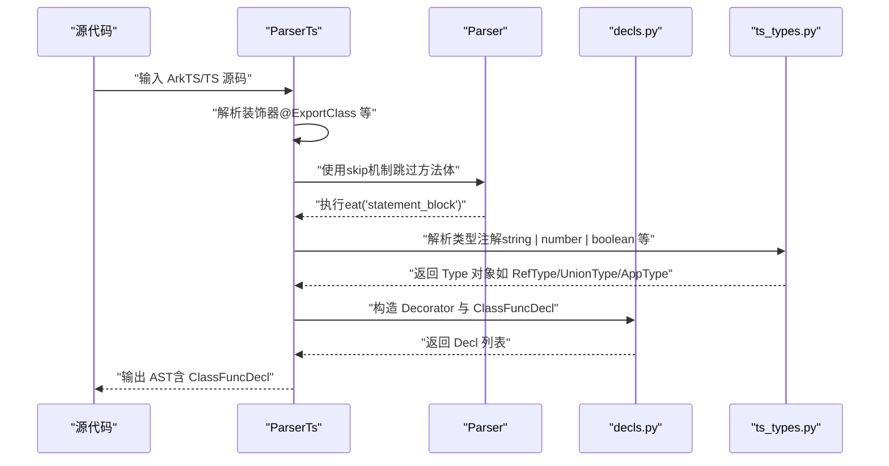
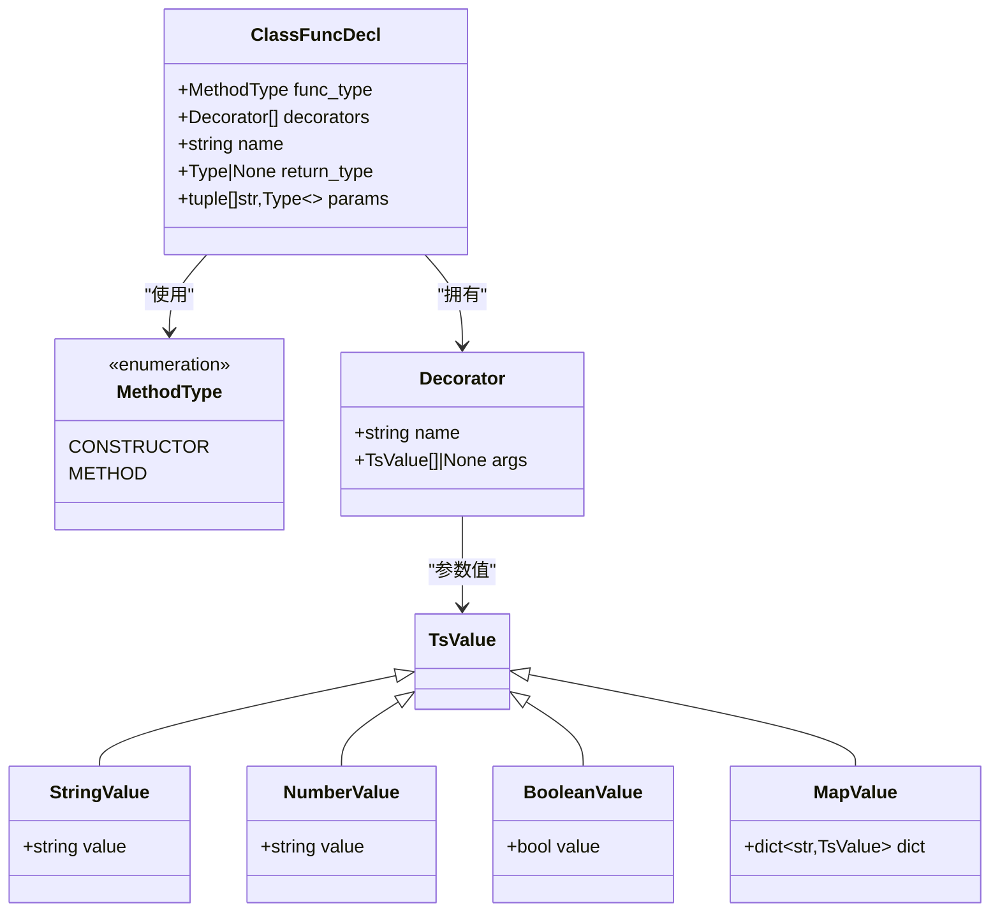
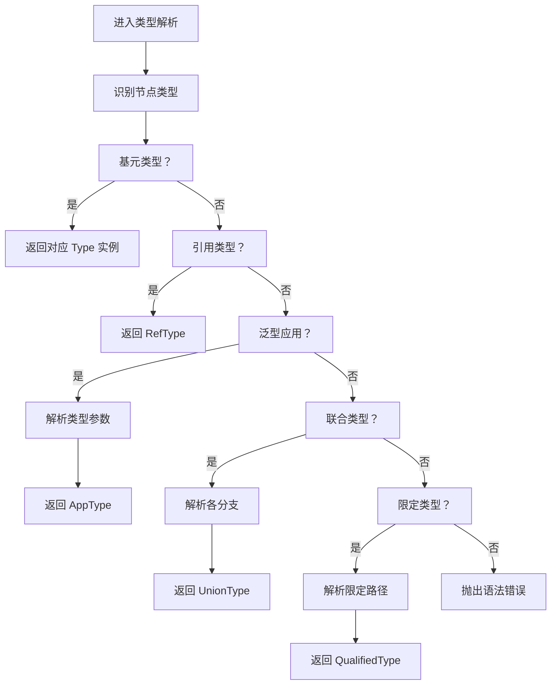
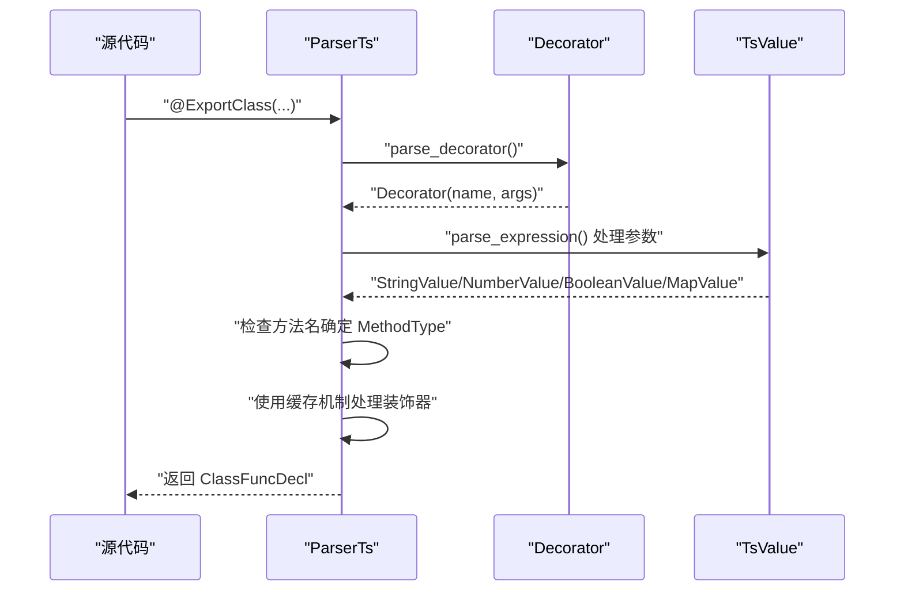
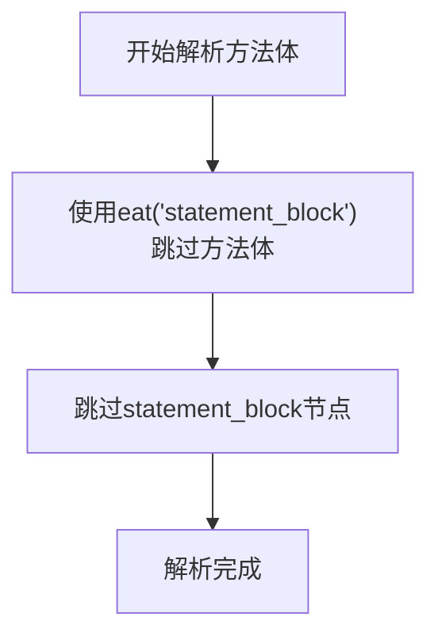
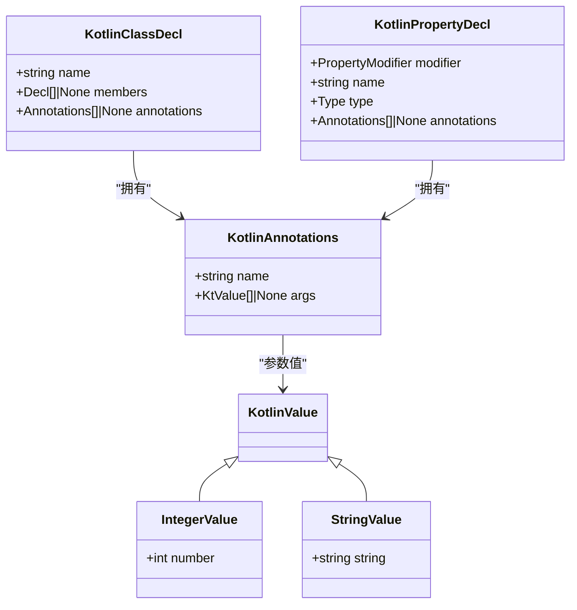
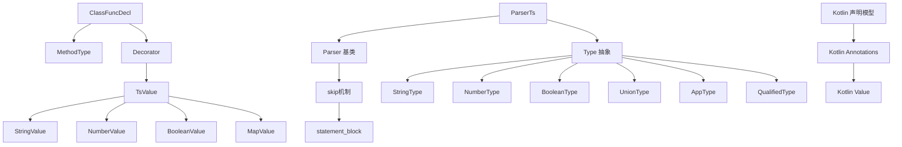

# 方法声明处理

<cite>
**本文引用的文件**
- [lang/ts/decls.py](file://lang/ts/decls.py)
- [lang/ts/ts_types.py](file://lang/ts/ts_types.py)
- [lang/ts/parser_ts.py](file://lang/ts/parser_ts.py)
- [lang/kt/kt_decls.py](file://lang/kt/kt_decls.py)
- [lang/parser.py](file://lang/parser.py)
- [test/cases/class0.ts](file://test/cases/class0.ts)
- [test/cases/class1.ts](file://test/cases/class1.ts)
- [test/cases/class2.ts](file://test/cases/class2.ts)
- [test/cases/class6.ts](file://test/cases/class6.ts)
- [test/cases/class7.ts](file://test/cases/class7.ts)
- [test/cases/class8.ts](file://test/cases/class8.ts)
- [test/cases/kt/class0.kt](file://test/cases/kt/class0.kt)
- [test/cases/kt/class1.kt](file://test/cases/kt/class1.kt)
</cite>

## 更新摘要
**变更内容**
- 方法体解析策略已从复杂的brace counting机制简化为高效的skip机制
- 装饰器处理逻辑得到显著优化，采用缓存机制在类体解析阶段统一处理
- 移除了复杂的parse_method_body实现，直接使用eat('statement_block')跳过方法体
- 解析器流程更加高效，减少了不必要的复杂性
- ClassFuncDecl数据类结构保持不变，继续提供一致的结构化特性
- 新增对@ExportMethod装饰器的支持，扩展了方法声明的装饰器体系

## 目录
1. [简介](#简介)
2. [项目结构](#项目结构)
3. [核心组件](#核心组件)
4. [架构总览](#架构总览)
5. [组件详解](#组件详解)
6. [依赖关系分析](#依赖关系分析)
7. [性能考量](#性能考量)
8. [故障排查指南](#故障排查指南)
9. [结论](#结论)
10. [附录](#附录)

## 简介
本文件聚焦于"方法声明处理"的设计与实现，围绕 TypeScript 侧的 ClassFuncDecl 类展开，系统阐述其属性结构（方法类型、名称、返回类型、参数列表、装饰器列表）、类型处理与验证机制、序列化与反序列化支持现状、以及在函数签名生成中的作用与转换规则。同时补充 Kotlin 侧的装饰器与类型系统背景，帮助读者建立完整的知识图谱。

**重要更新**：方法体解析策略已从复杂的brace counting机制简化为高效的skip机制，装饰器处理逻辑也得到了显著优化，采用缓存机制在类体解析阶段统一处理，提升了整体解析效率和代码可维护性。parse_method_body实现已被移除，直接使用eat('statement_block')来跳过方法体解析。新增对@ExportMethod装饰器的支持，进一步完善了方法声明的装饰器体系。

## 项目结构
本项目采用按语言分层的模块组织方式：
- TypeScript 解析与声明：位于 lang/ts 下，包含声明模型、类型系统、解析器等
- Kotlin 解析与声明：位于 lang/kt 下，包含声明模型、类型系统、解析器等
- 基础解析器框架：位于 lang/parser.py，提供通用的解析工具和机制
- 测试用例：位于 test/cases 下，覆盖多种装饰器与类声明场景

**图表来源**
- [lang/ts/decls.py](file://lang/ts/decls.py#L1-L122)
- [lang/ts/ts_types.py](file://lang/ts/ts_types.py#L1-L293)
- [lang/ts/parser_ts.py](file://lang/ts/parser_ts.py#L1-L472)
- [lang/parser.py](file://lang/parser.py#L1-L108)
- [lang/kt/kt_decls.py](file://lang/kt/kt_decls.py#L1-L57)

**章节来源**
- [lang/ts/decls.py](file://lang/ts/decls.py#L1-L122)
- [lang/ts/ts_types.py](file://lang/ts/ts_types.py#L1-L293)
- [lang/ts/parser_ts.py](file://lang/ts/parser_ts.py#L1-L472)
- [lang/parser.py](file://lang/parser.py#L1-L108)
- [lang/kt/kt_decls.py](file://lang/kt/kt_decls.py#L1-L57)

## 核心组件
- **TypeScript ClassFuncDecl**：用于描述类成员方法的声明节点，基于数据类实现，包含方法类型、名称、返回类型、参数列表、装饰器列表等字段
- **TypeScript MethodType枚举**：定义方法类型，支持CONSTRUCTOR（构造函数）和METHOD（普通方法）
- **TypeScript 类型系统**：提供统一的 Type 抽象及多种具体类型（如字符串、数字、布尔、联合、泛型应用、限定类型等）
- **TypeScript 解析器**：负责从 ArkTS/TS 源码中提取装饰器、类型注解与声明信息，并构建 AST 节点。现已采用简化的skip机制处理方法体解析
- **基础解析器框架**：提供通用的解析工具，包括skip、eat、push_type_children等核心方法
- **Kotlin 声明模型**：Kotlin侧同样采用数据类实现，提供一致的结构化特性
- **装饰器与类型系统**：为理解装饰器语义与类型表示提供背景支撑

**章节来源**
- [lang/ts/decls.py](file://lang/ts/decls.py#L110-L117)
- [lang/ts/ts_types.py](file://lang/ts/ts_types.py#L1-L293)
- [lang/ts/parser_ts.py](file://lang/ts/parser_ts.py#L280-L305)
- [lang/parser.py](file://lang/parser.py#L41-L55)
- [lang/kt/kt_decls.py](file://lang/kt/kt_decls.py#L40-L57)

## 架构总览
下图展示了从源码到 AST 的关键流程：解析器读取装饰器与类型注解，构建装饰器对象与类型对象，最终形成包含 ClassFuncDecl 的类声明树。**更新**：方法体解析现在使用简化的skip机制，装饰器处理逻辑通过缓存机制在类体解析阶段统一处理。

**图表来源**
- [lang/ts/parser_ts.py](file://lang/ts/parser_ts.py#L280-L305)
- [lang/parser.py](file://lang/parser.py#L41-L55)
- [lang/ts/decls.py](file://lang/ts/decls.py#L110-L117)
- [lang/ts/ts_types.py](file://lang/ts/ts_types.py#L57-L158)

## 组件详解

### ClassFuncDecl 设计与属性结构
ClassFuncDecl 是 TypeScript 声明模型中的方法声明节点，基于数据类实现，其属性包括：
- **方法类型**：MethodType（CONSTRUCTOR 或 METHOD）
- **名称**：方法标识符
- **返回类型**：可为空（表示未显式声明返回类型），或为 Type 对象
- **参数列表**：元素为二元组（形参名, 类型），类型以 Type 表示
- **装饰器列表**：每个装饰器包含名称与参数值列表（TsValue）

**图表来源**
- [lang/ts/decls.py](file://lang/ts/decls.py#L110-L117)
- [lang/ts/decls.py](file://lang/ts/decls.py#L32-L36)
- [lang/ts/decls.py](file://lang/ts/decls.py#L106-L109)

**章节来源**
- [lang/ts/decls.py](file://lang/ts/decls.py#L110-L117)

### 方法参数类型处理与验证机制
- **类型解析入口**：解析器通过 parse_type_cases 与 parse_type 将源码中的类型注解解析为统一的 Type 对象
- **支持的类型**：
  - 基元类型：string、number、boolean、bigint、void、null、undefined
  - 引用类型：RefType（标识符）
  - 泛型应用：AppType（如泛型容器）
  - 联合类型：UnionType（如 string | null）
  - 限定类型：QualifiedType（如模块限定名）
- **类型验证与工具函数**：
  - is_primitive_type：判断是否为"近似基元"类型（含可空包装与联合）
  - is_type_app/is_qualified_type_app：判断是否为特定类型名或限定类型名的应用
  - unwrap_nullable：对可空类型进行解包，便于后续处理

**图表来源**
- [lang/ts/parser_ts.py](file://lang/ts/parser_ts.py#L93-L137)
- [lang/ts/ts_types.py](file://lang/ts/ts_types.py#L57-L158)

**章节来源**
- [lang/ts/parser_ts.py](file://lang/ts/parser_ts.py#L93-L137)
- [lang/ts/ts_types.py](file://lang/ts/ts_types.py#L57-L158)

### 装饰器解析与参数值处理
- **装饰器解析**：解析器通过 parse_decorator 与 parse_decorators 识别以 @ 开头的装饰器，并将其转换为 Decorator 对象
- **参数值处理**：parse_expression 支持字符串、数值、布尔与对象字面量，分别映射到 TsValue 子类；对象字面量通过 parse_object_expression 转换为 MapValue
- **方法类型确定**：解析器通过检查方法名自动确定方法类型（constructor → CONSTRUCTOR，其他 → METHOD）
- **装饰器缓存机制**：**更新**：装饰器处理逻辑得到显著优化，采用缓存机制在类体解析阶段统一处理，避免了在方法定义中重复解析装饰器的复杂性。装饰器在 parse_class_body 中解析并缓存，然后传递给 parse_method_definition

**图表来源**
- [lang/ts/parser_ts.py](file://lang/ts/parser_ts.py#L69-L91)
- [lang/ts/parser_ts.py](file://lang/ts/parser_ts.py#L280-L305)
- [lang/ts/parser_ts.py](file://lang/ts/parser_ts.py#L307-L331)

**章节来源**
- [lang/ts/parser_ts.py](file://lang/ts/parser_ts.py#L69-L91)
- [lang/ts/parser_ts.py](file://lang/ts/parser_ts.py#L280-L305)
- [lang/ts/parser_ts.py](file://lang/ts/parser_ts.py#L307-L331)

### 方法体解析策略优化
**更新**：方法体解析策略已从复杂的brace counting机制简化为高效的skip机制，显著提升了解析性能和代码可维护性。**重要变更**：parse_method_body实现已被完全移除，现在直接使用eat('statement_block')来跳过方法体解析。

- **新策略**：使用 `self.eat('statement_block')` 直接跳过整个方法体，无需手动跟踪大括号匹配
- **性能提升**：避免了复杂的嵌套结构分析，减少了递归调用和状态管理开销
- **简化逻辑**：不再需要维护brace计数器和嵌套层级状态，代码更加简洁易懂
- **兼容性**：保持了原有的解析结果，不影响上层调用逻辑
- **移除复杂实现**：parse_method_body方法已被完全移除，简化了代码结构

**图表来源**
- [lang/ts/parser_ts.py](file://lang/ts/parser_ts.py#L302-L303)

**章节来源**
- [lang/ts/parser_ts.py](file://lang/ts/parser_ts.py#L302-L303)

### 序列化与反序列化支持
- **当前状态**：仓库未提供 ClassFuncDecl 的序列化/反序列化实现
- **建议方案**：
  - JSON 序列化：将 ClassFuncDecl 的字段（方法类型、名称、返回类型、参数列表、装饰器列表）转为字典结构
  - 反序列化：从字典重建 ClassFuncDecl 实例，必要时将字符串类型的返回类型与参数类型还原为 Type 对象
  - 注意：Type 对象通常由解析器在运行时构建，序列化时可仅保留类型签名字符串，反序列化时再交由类型系统重建

**章节来源**
- [lang/ts/decls.py](file://lang/ts/decls.py#L110-L117)

### 函数签名生成与转换规则
- **方法签名生成思路**：
  - 形参列表：遍历 params，拼接形参名与类型签名，支持可空/联合类型
  - 返回类型：优先使用 return_type 字段；若为空则根据上下文推断或标记为未声明
  - 方法类型：根据 MethodType 决定是否为构造函数签名
  - 装饰器：装饰器不直接参与签名生成，但可用于控制导出策略或附加元数据
- **转换规则**：
  - Type.signature 提供统一的类型字符串表示，可直接用于签名拼接
  - 对于联合类型与可空类型，遵循 ts_types 中的签名规则（例如联合类型以" | "连接）

**章节来源**
- [lang/ts/ts_types.py](file://lang/ts/ts_types.py#L16-L293)
- [lang/ts/decls.py](file://lang/ts/decls.py#L110-L117)

### Kotlin 侧声明模型对比
Kotlin 侧同样采用了数据类实现，提供一致的结构化特性：
- **Kotlin ClassDecl**：使用 @dataclass 装饰器，包含名称、成员列表、注解列表等字段
- **Kotlin PropertyDecl**：使用 @dataclass 装饰器，包含修饰符、名称、类型、注解列表等字段
- **注解系统**：Kotlin侧采用 Annotations 数据类，支持名称与参数值列表

**图表来源**
- [lang/kt/kt_decls.py](file://lang/kt/kt_decls.py#L40-L57)
- [lang/kt/kt_decls.py](file://lang/kt/kt_decls.py#L24-L32)

**章节来源**
- [lang/kt/kt_decls.py](file://lang/kt/kt_decls.py#L1-L57)

### 使用示例与场景
- **示例一**：基础类与字段（展示装饰器与类型注解）
  - TypeScript文件位置：[test/cases/class0.ts](file://test/cases/class0.ts#L1-L4)
  - TypeScript文件位置：[test/cases/class1.ts](file://test/cases/class1.ts#L1-L5)
  - TypeScript文件位置：[test/cases/class2.ts](file://test/cases/class2.ts#L1-L4)
  - Kotlin文件位置：[test/cases/kt/class0.kt](file://test/cases/kt/class0.kt#L1-L9)
  - Kotlin文件位置：[test/cases/kt/class1.kt](file://test/cases/kt/class1.kt#L1-L18)
- **示例二**：包含构造函数和方法的类
  - TypeScript文件位置：[test/cases/class6.ts](file://test/cases/class6.ts#L1-L10)
- **示例三**：复杂类型注解与装饰器组合
  - TypeScript文件位置：[test/cases/class7.ts](file://test/cases/class7.ts#L1-L21)
  - TypeScript文件位置：[test/cases/class8.ts](file://test/cases/class8.ts#L1-L13)
- **场景说明**：
  - @ExportClass：用于标记导出类
  - @ExportField：用于标记导出字段及其类型映射
  - @ExportMethod：**新增**：用于标记导出方法及其参数和返回类型配置
  - @ShareClass：Kotlin侧用于标记共享类
  - @ShareField：Kotlin侧用于标记共享字段
  - 类型注解：如 string | number | boolean、联合类型、可空类型等

**章节来源**
- [test/cases/class0.ts](file://test/cases/class0.ts#L1-L4)
- [test/cases/class1.ts](file://test/cases/class1.ts#L1-L5)
- [test/cases/class2.ts](file://test/cases/class2.ts#L1-L4)
- [test/cases/class6.ts](file://test/cases/class6.ts#L1-L10)
- [test/cases/class7.ts](file://test/cases/class7.ts#L1-L21)
- [test/cases/class8.ts](file://test/cases/class8.ts#L1-L13)
- [test/cases/kt/class0.kt](file://test/cases/kt/class0.kt#L1-L9)
- [test/cases/kt/class1.kt](file://test/cases/kt/class1.kt#L1-L18)

## 依赖关系分析
- **ClassFuncDecl 依赖**：MethodType、Decorator、TsValue 家族，用于承载方法类型、装饰器与参数值
- **解析器依赖**：ts_types 提供的 Type 抽象，完成类型注解到对象的转换
- **基础解析器依赖**：Parser 基类提供的 skip、eat、push_type_children 等核心方法
- **方法类型系统**：MethodType 枚举为方法声明提供类型区分能力
- **Kotlin 侧依赖**：kt_decls 提供的声明模型，完成 Kotlin 代码到对象的转换

**图表来源**
- [lang/ts/decls.py](file://lang/ts/decls.py#L110-L117)
- [lang/ts/decls.py](file://lang/ts/decls.py#L32-L36)
- [lang/ts/decls.py](file://lang/ts/decls.py#L106-L109)
- [lang/ts/parser_ts.py](file://lang/ts/parser_ts.py#L302-L303)
- [lang/parser.py](file://lang/parser.py#L41-L55)
- [lang/ts/parser_ts.py](file://lang/ts/parser_ts.py#L93-L137)
- [lang/ts/ts_types.py](file://lang/ts/ts_types.py#L57-L158)
- [lang/kt/kt_decls.py](file://lang/kt/kt_decls.py#L40-L57)

**章节来源**
- [lang/ts/decls.py](file://lang/ts/decls.py#L110-L117)
- [lang/ts/parser_ts.py](file://lang/ts/parser_ts.py#L302-L303)
- [lang/parser.py](file://lang/parser.py#L41-L55)
- [lang/ts/parser_ts.py](file://lang/ts/parser_ts.py#L93-L137)
- [lang/ts/ts_types.py](file://lang/ts/ts_types.py#L57-L158)
- [lang/kt/kt_decls.py](file://lang/kt/kt_decls.py#L1-L57)

## 性能考量
- **类型解析复杂度**：主要受类型注解深度与宽度影响（如联合类型与泛型嵌套）
- **装饰器解析**：装饰器数量与参数表达式的复杂度会影响解析时间
- **方法类型确定**：字符串比较操作开销极小，对整体性能影响可忽略
- **方法体解析性能**：**更新**：方法体解析性能大幅提升，eat('statement_block')机制避免了复杂的brace counting开销
- **装饰器缓存优化**：装饰器在类体解析阶段统一缓存，避免重复解析
- **数据类优化**：@dataclass 提供了更好的内存布局和访问性能
- **建议**：
  - 对重复出现的类型注解进行缓存（如 RefType 名称到 Type 的映射）
  - 在装饰器参数解析阶段避免不必要的回溯
  - 对大型源文件采用增量解析策略（如按模块拆分）
  - 利用数据类的内置优化特性
  - **利用新的eat('statement_block')机制处理方法体，减少解析时间**

## 故障排查指南
- **装饰器解析错误**
  - 现象：解析器抛出语法错误，提示必须为标识符
  - 排查：确认装饰器是否以 @ 开头且紧随标识符，参数括号与逗号是否正确
  - 参考：[lang/ts/parser_ts.py](file://lang/ts/parser_ts.py#L69-L91)
- **类型注解解析异常**
  - 现象：遇到未知节点类型或泛型参数缺失
  - 排查：检查类型注解是否符合支持的模式（基元、引用、泛型、联合、限定）
  - 参考：[lang/ts/parser_ts.py](file://lang/ts/parser_ts.py#L93-L137)
- **方法类型识别问题**
  - 现象：构造函数被错误识别为普通方法
  - 排查：确认方法名是否为"constructor"，检查解析器中方法类型确定逻辑
  - 参考：[lang/ts/parser_ts.py](file://lang/ts/parser_ts.py#L289)
- **方法体解析问题**
  - **更新**：现方法体解析使用eat('statement_block')机制，如遇解析问题，检查是否正确跳过了statement_block节点
  - 排查：确认方法体节点类型是否为statement_block，检查eat机制是否正常工作
  - 参考：[lang/ts/parser_ts.py](file://lang/ts/parser_ts.py#L302-L303)
- **装饰器缓存问题**
  - **更新**：装饰器缓存机制可能影响方法体解析，检查缓存装饰器列表是否正确传递
  - 排查：确认 parse_class_body 中装饰器缓存逻辑，检查 parse_method_definition 是否正确接收缓存装饰器
  - 参考：[lang/ts/parser_ts.py](file://lang/ts/parser_ts.py#L307-L331)
- **数据类初始化问题**
  - 现象：ClassFuncDecl 初始化失败或字段访问异常
  - 排查：确认 @dataclass 装饰器正确导入，字段类型注解完整
  - 参考：[lang/ts/decls.py](file://lang/ts/decls.py#L110-L117)

**章节来源**
- [lang/ts/parser_ts.py](file://lang/ts/parser_ts.py#L69-L91)
- [lang/ts/parser_ts.py](file://lang/ts/parser_ts.py#L93-L137)
- [lang/ts/parser_ts.py](file://lang/ts/parser_ts.py#L289)
- [lang/ts/parser_ts.py](file://lang/ts/parser_ts.py#L302-L303)
- [lang/ts/parser_ts.py](file://lang/ts/parser_ts.py#L307-L331)
- [lang/ts/decls.py](file://lang/ts/decls.py#L110-L117)

## 结论
ClassFuncDecl 作为 TypeScript 侧方法声明的核心抽象，通过与 MethodType、Decorator、TsValue、Type 等组件协同工作，实现了对方法类型、装饰器、类型注解与方法签名的完整建模。**更新**：新的解析策略通过简化的eat('statement_block')机制和优化的装饰器处理逻辑，显著提升了方法体解析的性能和代码可维护性。新的基于数据类的实现提供了更好的结构化特性和类型安全性。Kotlin 侧也采用了相同的模式，确保了跨语言的一致性。当前仓库未提供 ClassFuncDecl 的序列化/反序列化实现，建议基于现有类型系统与装饰器解析能力扩展该功能。结合测试用例与解析器逻辑，可进一步完善方法声明在导出与类型系统中的作用与转换规则。

## 附录
- **Type 系统背景**
  - Type 抽象类：所有类型的基础类，提供统一的 signature 属性
  - 基础类型：StringType、NumberType、BooleanType、BigIntType、VoidType、NullType、UndefinedType
  - 复合类型：RefType、ArrayType、NullableType、UnionType、AppType、QualifiedType
  - 类型工具函数：unwrap_nullable、union_type_to_nullable_type、is_primitive_type 等
  - 参考：[lang/ts/ts_types.py](file://lang/ts/ts_types.py#L1-L293)
- **数据类优势**
  - 自动生成 __init__、__repr__、__eq__ 等方法
  - 提供更好的内存效率和访问性能
  - 支持不可变性（frozen 参数）
  - 参考：[lang/ts/decls.py](file://lang/ts/decls.py#L110-L117)
- **解析器优化机制**
  - eat('statement_block')机制：通过 `self.eat()` 方法跳过不需要解析的节点，避免复杂的递归处理
  - 装饰器缓存机制：装饰器在类体解析阶段统一缓存，避免重复解析
  - 简化策略：方法体解析直接使用 `self.eat('statement_block')`，无需手动跟踪大括号
  - 性能提升：显著减少解析时间和内存占用
  - 参考：[lang/parser.py](file://lang/parser.py#L41-L55)
  - 参考：[lang/ts/parser_ts.py](file://lang/ts/parser_ts.py#L302-L303)
- **装饰器扩展**
  - @ExportMethod：**新增**装饰器，用于标记导出方法及其参数和返回类型配置
  - 支持参数类型数组和返回类型字符串配置
  - 与@ExportClass配合使用，实现完整的导出方法声明

**章节来源**
- [lang/ts/ts_types.py](file://lang/ts/ts_types.py#L1-L293)
- [lang/ts/decls.py](file://lang/ts/decls.py#L110-L117)
- [lang/parser.py](file://lang/parser.py#L41-L55)
- [lang/ts/parser_ts.py](file://lang/ts/parser_ts.py#L302-L303)
- [lang/ts/parser_ts.py](file://lang/ts/parser_ts.py#L69-L91)