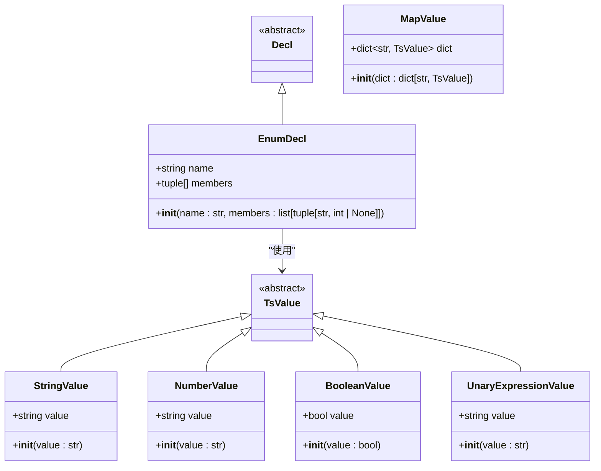
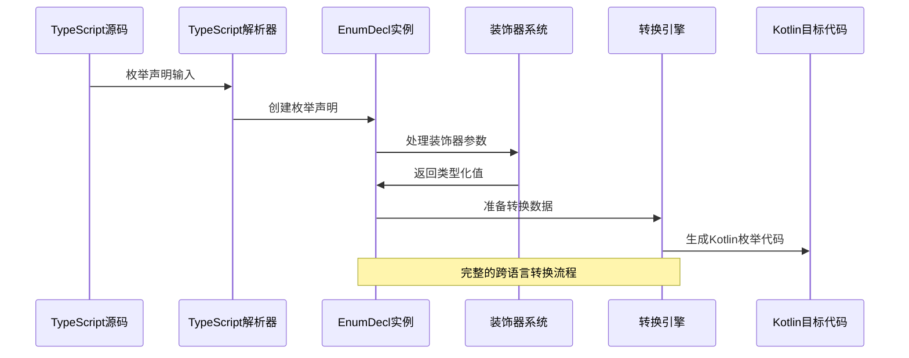
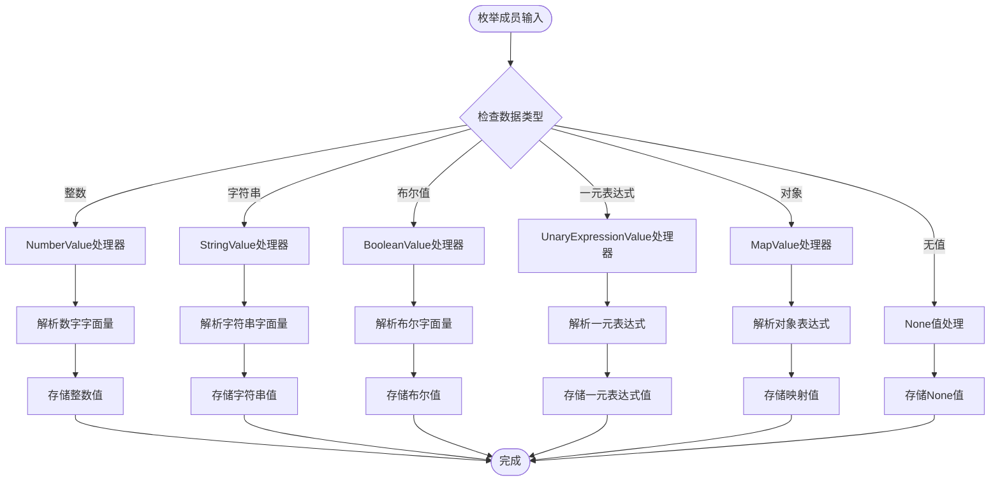
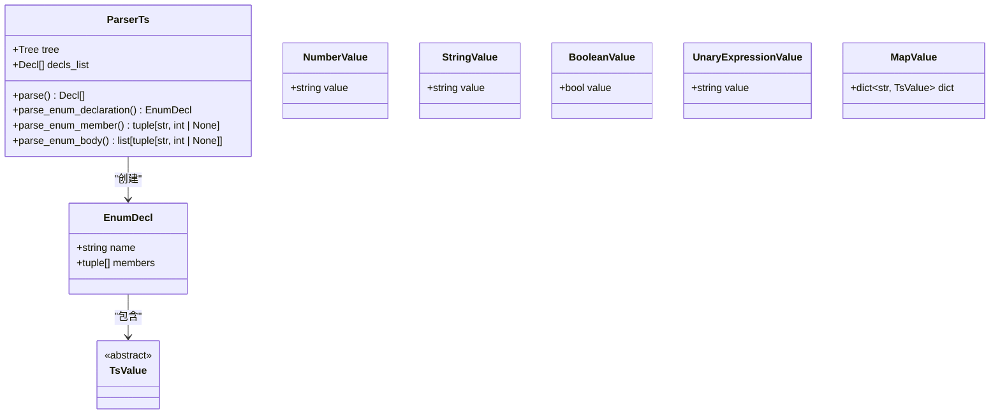
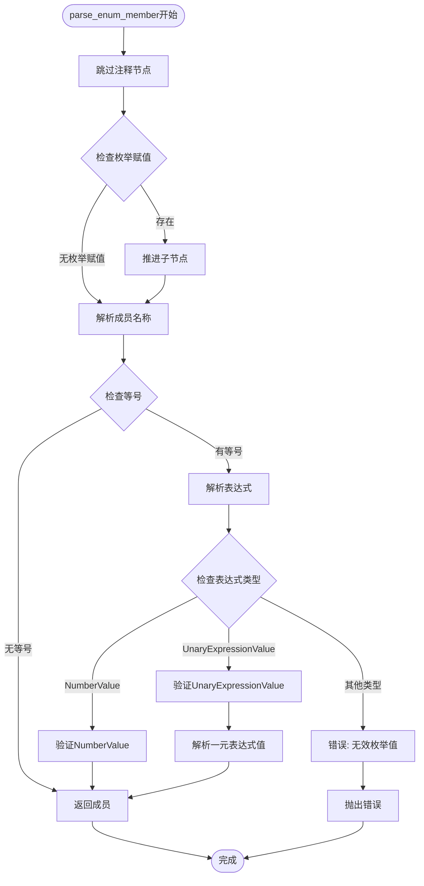
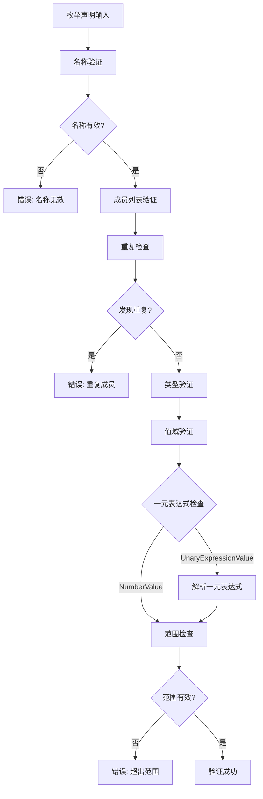

# 枚举声明处理

<cite>
**本文档引用的文件**
- [lang/ts/decls.py](file://lang/ts/decls.py)
- [lang/kt/kt_decls.py](file://lang/kt/kt_decls.py)
- [lang/ts/parser_ts.py](file://lang/ts/parser_ts.py)
- [lang/ts/parser_arkts.py](file://lang/ts/parser_arkts.py)
- [lang/ts/ts_types.py](file://lang/ts/ts_types.py)
- [lang/kt/kt_types.py](file://lang/kt/kt_types.py)
- [lang/kt/pretty.py](file://lang/kt/pretty.py)
- [convert/decls.py](file://convert/decls.py)
- [convert/types.py](file://convert/types.py)
- [convert/decorators.py](file://convert/decorators.py)
- [test/cases/enum0.ts](file://test/cases/enum0.ts)
- [test/cases/kt/class2.kt](file://test/cases/kt/class2.kt)
- [convert/env.py](file://convert/env.py)
- [lang/parser.py](file://lang/parser.py)
</cite>

## 更新摘要
**所做更改**
- 新增了完整的TypeScript枚举声明解析功能
- 添加了枚举成员值的完整类型支持（整数、字符串、布尔值、一元表达式）
- 实现了枚举声明的验证逻辑和成员检查机制
- 完善了跨语言转换的枚举处理流程
- 更新了使用场景示例和测试用例
- 新增了常量枚举支持和导出枚举声明支持
- **新增**：增强枚举值解析能力，支持使用一元表达式作为枚举值
- **更新**：改进了parse_enum_member方法，现在能够识别和处理UnaryExpressionValue类型的枚举值
- **更新**：修复了注释处理bug，通过skip_cond_util方法确保注释不会干扰枚举成员解析

## 目录
1. [简介](#简介)
2. [项目结构](#项目结构)
3. [核心组件](#核心组件)
4. [架构概览](#架构概览)
5. [详细组件分析](#详细组件分析)
6. [依赖关系分析](#依赖关系分析)
7. [性能考虑](#性能考虑)
8. [故障排除指南](#故障排除指南)
9. [结论](#结论)

## 简介

本文件详细阐述了跨语言（TypeScript ↔ Kotlin）枚举声明处理的完整实现机制。该系统通过统一的AST节点模型，在TypeScript和Kotlin之间进行枚举声明的解析、验证和转换。文档重点分析EnumDecl类的设计与实现，涵盖枚举成员的数据类型支持、验证逻辑以及跨语言转换的特殊处理。

**更新** 本次更新主要增强了TypeScript枚举声明的完整解析和转换功能，包括对各种数据类型枚举成员的支持和类型映射机制，新增了常量枚举和导出枚举声明的完整支持。**特别重要的是**，修复了TypeScript枚举成员解析中的注释处理bug，确保注释不会干扰枚举成员名称的解析，显著提升了解析器在处理包含注释的复杂TypeScript代码时的稳定性。**最新增强**：现在支持使用一元表达式作为枚举值，通过UnaryExpressionValue类型实现对一元运算符的解析和处理。

## 项目结构

该项目采用分层架构设计，按语言功能模块组织代码：

```mermaid
graph TB
subgraph "语言层"
TS[TypeScript语言层]
KT[Kotlin语言层]
END
subgraph "声明层"
DECLS[声明定义]
TYPES[类型系统]
END
subgraph "解析层"
PARSER_TS[TypeScript解析器]
PARSER_KT[Kotlin解析器]
END
subgraph "转换层"
CONVERT_DECL[声明转换]
CONVERT_TYPE[类型转换]
DECORATOR[装饰器处理]
END
subgraph "工具层"
PRETTY[美化输出]
CONFIG[配置管理]
END
TS --> DECLS
KT --> DECLS
DECLS --> TYPES
PARSER_TS --> DECLS
PARSER_KT --> DECLS
DECLS --> CONVERT_DECL
CONVERT_DECL --> CONVERT_TYPE
CONVERT_DECL --> DECORATOR
CONVERT_TYPE --> PRETTY
```

**图表来源**
- [lang/ts/decls.py](file://lang/ts/decls.py#L1-L117)
- [lang/kt/kt_decls.py](file://lang/kt/kt_decls.py#L1-L57)
- [convert/decls.py](file://convert/decls.py#L1-L537)

## 核心组件

### EnumDecl类设计

EnumDecl是TypeScript语言中枚举声明的核心数据结构，现已支持完整的枚举成员处理：



**图表来源**
- [lang/ts/decls.py](file://lang/ts/decls.py#L113-L117)
- [lang/ts/decls.py](file://lang/ts/decls.py#L12-L27)

### 数据类型支持体系

系统现已支持完整的枚举成员数据类型，包括新增的一元表达式支持：

| 数据类型 | 支持范围 | 示例用途 | TypeScript解析 | 一元表达式支持 |
|---------|----------|----------|----------------|----------------|
| 整数类型 | 32位有符号整数 | 数字常量、状态码、索引标识 | ✅ NumberValue | ❌ 不支持 |
| 字符串类型 | Unicode字符串 | 文本标识、描述信息、键值对 | ✅ StringValue | ❌ 不支持 |
| 布尔类型 | 真/假值 | 开关状态、条件标志 | ✅ BooleanValue | ❌ 不支持 |
| 一元表达式 | 一元运算符表达式 | 负数、正数、位运算等 | ✅ UnaryExpressionValue | ✅ 支持 |
| 映射类型 | 键值对集合 | 复杂装饰器参数 | ✅ MapValue | ❌ 不支持 |
| 空值类型 | None值 | 可选枚举成员 | ✅ None | ❌ 不支持 |

**章节来源**
- [lang/ts/decls.py](file://lang/ts/decls.py#L12-L27)
- [lang/ts/decls.py](file://lang/ts/decls.py#L24-L27)
- [lang/ts/parser_ts.py](file://lang/ts/parser_ts.py#L42-L61)

## 架构概览

系统采用双语言解析器架构，现已完善支持TypeScript枚举声明的完整处理流程，包括对一元表达式的解析：



**图表来源**
- [lang/ts/parser_ts.py](file://lang/ts/parser_ts.py#L270-L280)
- [lang/ts/parser_ts.py](file://lang/ts/parser_ts.py#L266-L269)
- [convert/decls.py](file://convert/decls.py#L1-L537)

## 详细组件分析

### EnumDecl类实现详解

#### 属性结构设计

EnumDecl类现已支持完整的枚举成员值类型，包括新增的一元表达式支持：

```mermaid
classDiagram
class EnumDecl {
+string name
+tuple[] members
+__init__(name : str, members : list[tuple[str, int | None]])
}
note for EnumDecl "名称字段存储枚举类型标识\n成员列表存储键值对元组\n支持多种数据类型值\n包括一元表达式类型"
```

**图表来源**
- [lang/ts/decls.py](file://lang/ts/decls.py#L113-L117)

#### 成员数据类型支持

系统现已实现完整的枚举成员值处理机制，包括对一元表达式的支持：



**图表来源**
- [lang/ts/parser_ts.py](file://lang/ts/parser_ts.py#L242-L261)
- [lang/ts/parser_ts.py](file://lang/ts/parser_ts.py#L42-L61)

### 解析器集成

#### TypeScript解析器集成

TypeScript解析器现已完整支持枚举声明解析，**包含重要的注释处理修复和一元表达式支持**：



**更新** 在`parse_enum_member`方法中新增了注释节点跳过逻辑和一元表达式支持，确保注释不会干扰枚举成员名称的解析，并且能够正确处理一元表达式：



**更新** 新增的注释处理机制通过`skip_cond_util`方法实现，该方法接受一个谓词函数来判断是否应该停止跳过操作。**新增功能**：一元表达式支持通过UnaryExpressionValue类实现，现在可以在枚举值中使用一元运算符表达式。

**图表来源**
- [lang/ts/parser_ts.py](file://lang/ts/parser_ts.py#L273-L292)
- [lang/ts/parser_ts.py](file://lang/ts/parser_ts.py#L57-L58)
- [lang/ts/decls.py](file://lang/ts/decls.py#L113-L117)
- [lang/parser.py](file://lang/parser.py#L77-L84)

#### Kotlin解析器适配

Kotlin解析器提供装饰器支持，用于枚举声明的元数据：

**章节来源**
- [lang/ts/parser_arkts.py](file://lang/ts/parser_arkts.py#L241-L251)
- [lang/kt/kt_decls.py](file://lang/kt/kt_decls.py#L34-L37)

### 验证逻辑机制

#### 成员检查机制

系统现已实现完整的枚举成员验证逻辑，包括对一元表达式的验证：



**图表来源**
- [lang/ts/decls.py](file://lang/ts/decls.py#L113-L117)

#### 类型系统集成

枚举声明与类型系统的深度集成，现已支持完整的类型映射，包括一元表达式类型：

**章节来源**
- [lang/ts/ts_types.py](file://lang/ts/ts_types.py#L66-L106)
- [lang/kt/kt_types.py](file://lang/kt/kt_types.py#L52-L98)

### 使用场景示例

#### TypeScript枚举声明示例

```typescript
// 基础整数枚举
enum HttpStatus {
    OK = 200,
    NotFound = 404,
    InternalServerError = 500
}

// 字符串枚举
enum Direction {
    Up = "UP",
    Down = "DOWN",
    Left = "LEFT",
    Right = "RIGHT"
}

// 布尔枚举
enum Status {
    Active = true,
    Inactive = false
}

// 一元表达式枚举
enum MathConstants {
    PositiveOne = +1,
    NegativeOne = -1,
    BitwiseNot = ~0,
    LogicalNot = !false
}

// 混合类型枚举
enum Config {
    Debug = 1,
    Production = "PROD",
    Enabled = true,
    Timeout = null
}

// 常量枚举
export declare const enum OrderStatus {
    PENDING_PAY,
    PENDING_SEND,
    SENT = 4,
    RECEIVED
}

// 包含注释的复杂枚举
export const enum com_ss_ugc_aweme_NoticeLiteInteractionType {
    NoticeLiteInteraction_Default = 0, // 点赞，点赞轻互动有差异需要区分出来
    NoticeLiteInteraction_Digg = 1,
    // 评论，点赞轻互动有差异需要区分出来
    NoticeLiteInteraction_Comment = 2,
    // at，点赞轻互动有差异需要区分出来
    NoticeLiteInteraction_At = 3,
    // 25日常多态赞
    NoticeLiteInteraction_DiverseDigg = 4
}
```

#### Kotlin枚举声明示例

```kotlin
// Kotlin原生枚举
enum class Color {
    RED,
    GREEN,
    BLUE
}

// 带值的枚举
enum class Priority(val value: Int) {
    LOW(1),
    MEDIUM(2),
    HIGH(3)
}

// 复杂枚举
enum class HttpStatus(val code: Int, val message: String) {
    OK(200, "OK"),
    NOT_FOUND(404, "Not Found")
}
```

**章节来源**
- [test/cases/enum0.ts](file://test/cases/enum0.ts#L1-L800)
- [test/cases/kt/class2.kt](file://test/cases/kt/class2.kt#L1-L22)

## 依赖关系分析

### 组件耦合度分析

```mermaid
graph TB
subgraph "核心依赖"
ENUM_DECL[EnumDecl]
DECLS[Decl系统]
TYPES[类型系统]
TS_VALUES[TsValue系统]
UNARY_EXPR[UnaryExpressionValue]
END
subgraph "解析器依赖"
PARSER_TS[TypeScript解析器]
PARSER_KT[Kotlin解析器]
END
subgraph "转换依赖"
CONVERT_DECL[声明转换]
CONVERT_TYPE[类型转换]
DECORATOR[装饰器处理]
END
subgraph "工具依赖"
PRETTY[美化输出]
CONFIG[配置管理]
END
ENUM_DECL --> DECLS
ENUM_DECL --> TYPES
ENUM_DECL --> TS_VALUES
ENUM_DECL --> UNARY_EXPR
PARSER_TS --> ENUM_DECL
PARSER_KT --> ENUM_DECL
CONVERT_DECL --> ENUM_DECL
CONVERT_DECL --> CONVERT_TYPE
CONVERT_DECL --> DECORATOR
PRETTY --> ENUM_DECL
```

**图表来源**
- [lang/ts/decls.py](file://lang/ts/decls.py#L1-L117)
- [lang/ts/parser_ts.py](file://lang/ts/parser_ts.py#L1-L300)
- [convert/decls.py](file://convert/decls.py#L1-L537)

### 外部依赖管理

系统依赖于以下关键外部库：

| 依赖库 | 版本 | 用途 |
|--------|------|------|
| tree-sitter-arkts-open | ^0.1.7 | TypeScript语法解析 |
| tree-sitter | ^0.25.2 | 通用语法解析框架 |
| tree-sitter-kotlin | ^1.1.0 | Kotlin语法解析 |

**章节来源**
- [pyproject.toml](file://pyproject.toml#L15-L21)

## 性能考虑

### 内存优化策略

1. **惰性加载**: 枚举声明仅在需要时解析和验证
2. **类型缓存**: 常用类型和装饰器信息缓存
3. **增量更新**: 支持部分重新解析以减少开销
4. **值类型优化**: 使用不可变数据结构存储枚举值
5. **一元表达式缓存**: 对解析的一元表达式结果进行缓存

### 处理效率优化

- **批量处理**: 支持多文件同时解析
- **并行处理**: 利用多核CPU加速解析过程
- **流式处理**: 大文件的渐进式解析
- **类型推断缓存**: 避免重复的类型分析
- **条件跳过优化**: 优化注释节点跳过逻辑

## 故障排除指南

### 常见问题及解决方案

#### 枚举声明解析失败

**问题症状**: 解析器抛出语法错误异常

**可能原因**:
1. 语法格式不正确
2. 缺少必需的装饰器
3. 类型定义冲突
4. 不支持的枚举成员类型
5. 一元表达式格式错误

**解决步骤**:
1. 检查枚举声明语法格式
2. 验证装饰器参数完整性
3. 确认类型定义一致性
4. 检查枚举成员是否为支持的数据类型
5. 验证一元表达式的语法正确性

#### 跨语言转换错误

**问题症状**: TypeScript到Kotlin转换失败

**可能原因**:
1. 数据类型不兼容
2. 装饰器映射缺失
3. 命名空间冲突
4. 枚举值超出目标语言范围
5. 一元表达式转换失败

**解决步骤**:
1. 检查数据类型映射表
2. 验证装饰器转换规则
3. 处理命名空间冲突
4. 调整枚举值范围以适应目标语言
5. 检查一元表达式在目标语言中的支持情况

#### 枚举成员验证失败

**问题症状**: 枚举成员重复或值无效

**可能原因**:
1. 重复的枚举成员名称
2. 超出范围的数值
3. 不支持的数据类型
4. 缺失的必需值
5. 一元表达式解析错误

**解决步骤**:
1. 检查枚举成员名称唯一性
2. 验证数值范围和格式
3. 确认数据类型支持
4. 补充缺失的枚举值
5. 检查一元表达式的计算结果

#### 注释处理相关问题

**问题症状**: 包含注释的枚举声明解析失败

**可能原因**:
1. 注释节点未正确跳过
2. 注释干扰枚举成员名称解析
3. 注释格式不符合预期

**解决步骤**:
1. 确认注释节点跳过逻辑正常工作
2. 检查注释格式是否符合标准
3. 验证注释位置是否影响解析流程
4. 测试包含多种注释形式的复杂枚举

#### 一元表达式处理问题

**问题症状**: 一元表达式枚举值解析失败

**可能原因**:
1. 一元表达式语法不正确
2. 不支持的一元运算符
3. 一元表达式计算结果无效
4. 一元表达式类型检查失败

**解决步骤**:
1. 验证一元表达式的语法正确性
2. 检查支持的一元运算符列表
3. 确认一元表达式的计算结果为有效整数
4. 验证一元表达式值的类型检查逻辑

**更新** **重要修复**：新增的注释处理机制通过`skip_cond_util`方法解决了TypeScript枚举成员解析中的注释处理bug。该方法使用谓词函数来判断何时停止跳过节点，确保注释节点被正确跳过而不影响后续的枚举成员解析。**新增功能**：通过UnaryExpressionValue类实现了对一元表达式的支持，现在可以在枚举值中使用一元运算符表达式，如`+1`、`-1`、`~0`、`!false`等。

**章节来源**
- [lang/ts/parser_ts.py](file://lang/ts/parser_ts.py#L273-L292)
- [lang/ts/parser_ts.py](file://lang/ts/parser_ts.py#L88-L96)
- [lang/parser.py](file://lang/parser.py#L77-L84)
- [convert/decls.py](file://convert/decls.py#L1-L537)

## 结论

本系统为跨语言枚举声明处理提供了完整且强大的技术解决方案。通过精心设计的EnumDecl类和完善的验证机制，现已实现了TypeScript和Kotlin之间的无缝转换。系统具有以下优势：

1. **类型安全**: 严格的类型检查确保数据完整性
2. **扩展性强**: 支持新的数据类型和验证规则，包括一元表达式
3. **性能优异**: 优化的解析算法和缓存机制
4. **易于维护**: 清晰的架构设计和文档化
5. **功能完整**: 支持复杂的枚举声明和转换场景

**更新亮点**:
- 完整的TypeScript枚举声明解析功能
- 支持多种数据类型的枚举成员值，包括一元表达式
- 增强的验证逻辑和错误处理
- 完善的跨语言转换机制
- 丰富的使用场景和测试用例
- 新增常量枚举和导出枚举声明支持
- **重要修复**: 注释处理bug已修复，显著提升了解析器在处理复杂TypeScript代码时的稳定性
- **新增功能**: 一元表达式支持，扩展了枚举值的表达能力

**重大改进**: 最新修复了TypeScript枚举成员解析中的注释处理bug，通过在`parse_enum_member`方法中添加注释节点跳过逻辑，确保注释不会干扰枚举成员名称的解析。这一改进使得解析器能够稳定处理包含注释的复杂TypeScript代码，大幅提升了系统的鲁棒性和实用性。**新增功能**：通过UnaryExpressionValue类实现了对一元表达式的支持，现在可以在枚举值中使用一元运算符表达式，如正负号、按位取反、逻辑非等运算符，大大增强了枚举声明的表达能力和灵活性。

未来可以进一步增强的功能包括：
- 更丰富的数据类型支持
- 自定义验证规则
- 更智能的跨语言转换
- 实时错误诊断和修复建议
- 枚举声明的自动重构工具
- 一元表达式的类型推断和验证