# 类声明处理

<cite>
**本文引用的文件**
- [convert/decls.py](file://convert/decls.py)
- [convert/env.py](file://convert/env.py)
- [convert/check.py](file://convert/check.py)
- [convert/decorators.py](file://convert/decorators.py)
- [convert/pretty.py](file://convert/pretty.py)
- [convert/generate.py](file://convert/generate.py)
- [lang/ts/decls.py](file://lang/ts/decls.py)
- [lang/ts/parser_ts.py](file://lang/ts/parser_ts.py)
- [lang/ts/ts_types.py](file://lang/ts/ts_types.py)
- [lang/kt/kt_decls.py](file://lang/kt/kt_decls.py)
- [lang/kt/kt_parser.py](file://lang/kt/kt_parser.py)
- [lang/kt/kt_types.py](file://lang/kt/kt_types.py)
- [lang/parser.py](file://lang/parser.py)
- [utils/config.py](file://utils/config.py)
- [test/cases/class0.ts](file://test/cases/class0.ts)
- [test/cases/class1.ts](file://test/cases/class1.ts)
- [test/cases/class2.ts](file://test/cases/class2.ts)
- [test/cases/class3.ts](file://test/cases/class3.ts)
- [test/cases/class4.ts](file://test/cases/class4.ts)
- [test/cases/class5.ts](file://test/cases/class5.ts)
- [test/cases/class7.ts](file://test/cases/class7.ts)
- [test/cases/class8.ts](file://test/cases/class8.ts)
- [test/cases/class10.ts](file://test/cases/class10.ts)
- [test/cases/class11.ts](file://test/cases/class11.ts)
- [test/cases/class12.ts](file://test/cases/class12.ts)
- [test/cases/kt/class0.kt](file://test/cases/kt/class0.kt)
- [test/cases/kt/class1.kt](file://test/cases/kt/class1.kt)
- [test/cases/kt/class2.kt](file://test/cases/kt/class2.kt)
- [main.py](file://main.py)
</cite>

## 更新摘要
**变更内容**
- 新增 get_kt_proxy_class_and_package_name() 函数：统一处理不同共享类型的类名和包名解析
- 增强错误检查和验证机制：改进类转换逻辑，新增更严格的错误处理
- 优化类转换流程：在 convert_class 和 convert_class_transformer 中集成新的类名解析函数
- 完善共享类型支持：支持 basic、copy、proxy 三种共享类型的不同处理策略

## 目录
1. [引言](#引言)
2. [项目结构](#项目结构)
3. [核心组件](#核心组件)
4. [架构总览](#架构总览)
5. [详细组件分析](#详细组件分析)
6. [依赖关系分析](#依赖关系分析)
7. [性能考量](#性能考量)
8. [故障排查指南](#故障排查指南)
9. [结论](#结论)
10. [附录](#附录)

## 引言
本文件聚焦于类声明处理，系统性阐述 TypeScript 与 Kotlin（ArkTS）中类声明的数据模型、解析流程、装饰器/注解处理、以及与类型系统的交互方式。重点围绕以下目标展开：
- 深入解释 ClassDecl 类的设计与实现机制
- 明确类声明的属性结构：名称、成员列表、装饰器/注解列表
- 介绍类声明在 ArkTS 装饰器解析中的作用与处理流程
- 提供类声明的序列化与反序列化机制说明
- 给出具体类声明示例与使用场景
- 解释类声明与其他声明类型的关系与交互模式
- **新增**：详细介绍 get_kt_proxy_class_and_package_name() 函数，统一处理不同共享类型的类名和包名解析
- **新增**：增强的错误检查和验证机制，改进类转换逻辑

## 项目结构
该项目采用按语言分层的组织方式，TypeScript 与 Kotlin 的声明模型、解析器与类型系统分别独立实现，便于扩展与维护。

```mermaid
graph TB
subgraph "转换层"
CONVERT_DECLS["convert/decls.py<br/>类声明转换与构造函数生成"]
CONVERT_ENV["convert/env.py<br/>环境配置与映射管理<br/>get_kt_proxy_class_and_package_name()"]
CONVERT_CHECK["convert/check.py<br/>Kotlin命名规范验证"]
CONVERT_DECORATORS["convert/decorators.py<br/>装饰器工具函数"]
CONVERT_PRETTY["convert/pretty.py<br/>代码格式化与多行字符串处理"]
CONVERT_GENERATE["convert/generate.py<br/>代码生成与导入处理"]
MAIN["main.py<br/>主程序入口与构造函数生成"]
END
subgraph "TypeScript 侧"
TS_DECL["lang/ts/decls.py<br/>声明与装饰器数据模型"]
TS_PARSER["lang/ts/parser_ts.py<br/>TS 解析器"]
TS_TYPES["lang/ts/ts_types.py<br/>TS 类型系统"]
END
subgraph "Kotlin 侧"
KT_DECL["lang/kt/kt_decls.py<br/>声明与注解数据模型"]
KT_PARSER["lang/kt/kt_parser.py<br/>Kotlin 解析器"]
KT_TYPES["lang/kt/kt_types.py<br/>Kotlin 类型系统"]
END
COMMON["lang/parser.py<br/>通用解析器基类"]
CONFIG["utils/config.py<br/>配置管理与共享类型设置"]
TS_PARSER --> TS_DECL
TS_PARSER --> TS_TYPES
TS_PARSER --> COMMON
KT_PARSER --> KT_DECL
KT_PARSER --> KT_TYPES
KT_PARSER --> COMMON
CONVERT_DECLS --> CONVERT_ENV
CONVERT_DECLS --> CONVERT_CHECK
CONVERT_DECLS --> CONVERT_DECORATORS
CONVERT_DECLS --> CONVERT_PRETTY
CONVERT_GENERATE --> CONVERT_DECLS
MAIN --> CONVERT_DECLS
CONFIG --> CONVERT_ENV
```

**图表来源**
- [convert/decls.py](file://convert/decls.py#L1-L863)
- [convert/env.py](file://convert/env.py#L1-L258)
- [convert/check.py](file://convert/check.py#L1-L89)
- [convert/decorators.py](file://convert/decorators.py#L1-L41)
- [convert/pretty.py](file://convert/pretty.py#L1-L113)
- [convert/generate.py](file://convert/generate.py#L1-L192)
- [main.py](file://main.py#L1-L71)
- [lang/ts/decls.py](file://lang/ts/decls.py#L1-L134)
- [lang/ts/parser_ts.py](file://lang/ts/parser_ts.py#L1-L483)
- [lang/ts/ts_types.py](file://lang/ts/ts_types.py#L1-L280)
- [lang/kt/kt_decls.py](file://lang/kt/kt_decls.py#L1-L57)
- [lang/kt/kt_parser.py](file://lang/kt/kt_parser.py#L1-L242)
- [lang/kt/kt_types.py](file://lang/kt/kt_types.py#L1-L191)
- [lang/parser.py](file://lang/parser.py#L1-L57)
- [utils/config.py](file://utils/config.py#L1-L390)

**章节来源**
- [convert/decls.py](file://convert/decls.py#L1-L863)
- [convert/env.py](file://convert/env.py#L1-L258)
- [convert/check.py](file://convert/check.py#L1-L89)
- [convert/decorators.py](file://convert/decorators.py#L1-L41)
- [convert/pretty.py](file://convert/pretty.py#L1-L113)
- [convert/generate.py](file://convert/generate.py#L1-L192)
- [main.py](file://main.py#L1-L71)
- [lang/ts/decls.py](file://lang/ts/decls.py#L1-L134)
- [lang/ts/parser_ts.py](file://lang/ts/parser_ts.py#L1-L483)
- [lang/ts/ts_types.py](file://lang/ts/ts_types.py#L1-L280)
- [lang/kt/kt_decls.py](file://lang/kt/kt_decls.py#L1-L57)
- [lang/kt/kt_parser.py](file://lang/kt/kt_parser.py#L1-L242)
- [lang/kt/kt_types.py](file://lang/kt/kt_types.py#L1-L191)
- [lang/parser.py](file://lang/parser.py#L1-L57)
- [utils/config.py](file://utils/config.py#L1-L390)

## 核心组件
- TypeScript 声明与装饰器模型
  - Decl 抽象基类
  - TsValue 及其子类（字符串、数字、布尔、映射、一元表达式、数组）
  - Decorator 装饰器模型
  - ClassDecl、PropertyDecl、MethodDecl、EnumDecl
- Kotlin 声明与注解模型
  - Decl 抽象基类
  - KtValue 及其子类（整数、字符串）
  - Annotations 注解模型
  - ClassDecl、PropertyDecl、PropertyModifier
- 通用解析器基类 Parser
  - 提供流式节点操作：pop/push/peek/eat/sep_parse 等
- TypeScript 解析器 TsParser
  - 负责装饰器、类声明、类体、属性声明、表达式等解析
- Kotlin 解析器 KotlinAstParser
  - 负责注解提取、类声明、属性声明解析
- **新增**：增强的类转换器
  - convert_class：支持export_all_fields和NoExportField装饰器，实现字段导出控制
  - convert_class_constructor：支持arkts_module_path参数，从指定模块创建实例
  - **新增**：has_export_decorator方法，确保只有带导出装饰器的类才会被处理转换
  - **新增**：duplicate field validation机制，防止字段ID和字段名重复
  - **新增**：自定义代码注入功能，支持custom_code、custom_getter、custom_setter装饰器
  - **新增**：custom_import功能，支持在类声明中指定自定义导入语句
- **新增**：统一类名解析函数
  - get_kt_proxy_class_and_package_name：统一处理不同共享类型的类名和包名解析
  - 支持 basic、copy、proxy 三种共享类型的不同处理策略
  - **新增**：增强的错误检查和验证机制
- **新增**：Kotlin命名规范验证器
  - check_kotlin_field_name：验证字段名符合Kotlin命名规范
  - check_kotlin_class_name：验证类名符合Kotlin命名规范
  - check_kotlin_package_name：验证包名符合Kotlin命名规范
- **新增**：环境配置管理器增强
  - get_class_rename_map：支持ShareId映射和类名验证
  - get_kt_shared_class_field_name_map：支持ShareField ID重复性检查
  - **新增**：kt_shared_class_field_name_map：存储共享字段映射
  - **新增**：build_kt_class_rename_map集成has_export_decorator过滤
- **新增**：代码生成器增强
  - _get_custom_imports：从ClassInfo中提取custom_import_list并生成import语句
  - convert_module_paths：支持单文件和项目模式下的自定义导入合并
  - **新增**：generate函数集成has_export_decorator过滤
- 类型系统
  - TS 类型系统：Type 及其派生类型
  - KT 类型系统：Type 及其派生类型

**章节来源**
- [convert/decls.py](file://convert/decls.py#L377-L471)
- [convert/env.py](file://convert/env.py#L131-L155)
- [convert/check.py](file://convert/check.py#L62-L89)
- [convert/generate.py](file://convert/generate.py#L126-L192)
- [lang/ts/decls.py](file://lang/ts/decls.py#L80-L134)
- [lang/kt/kt_decls.py](file://lang/kt/kt_decls.py#L1-L57)
- [lang/parser.py](file://lang/parser.py#L1-L57)
- [lang/ts/parser_ts.py](file://lang/ts/parser_ts.py#L358-L424)
- [lang/kt/kt_parser.py](file://lang/kt/kt_parser.py#L1-L242)
- [lang/ts/ts_types.py](file://lang/ts/ts_types.py#L1-L280)
- [lang/kt/kt_types.py](file://lang/kt/kt_types.py#L1-L191)
- [utils/config.py](file://utils/config.py#L52-L63)

## 架构总览
下图展示了类声明在两种语言中的解析与建模路径，以及与类型系统的交互，包括增强的字段导出控制、重复性验证、自定义代码注入和自定义导入功能，以及新增的类导出过滤功能和统一的类名解析机制。

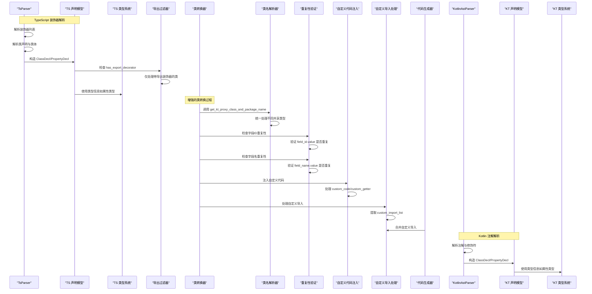

**图表来源**
- [lang/ts/parser_ts.py](file://lang/ts/parser_ts.py#L358-L424)
- [lang/ts/decls.py](file://lang/ts/decls.py#L86-L93)
- [lang/ts/ts_types.py](file://lang/ts/ts_types.py#L8-L280)
- [convert/decls.py](file://convert/decls.py#L377-L471)
- [convert/env.py](file://convert/env.py#L240-L257)
- [convert/check.py](file://convert/check.py#L62-L89)
- [convert/generate.py](file://convert/generate.py#L126-L192)
- [lang/kt/kt_parser.py](file://lang/kt/kt_parser.py#L59-L90)
- [lang/kt/kt_decls.py](file://lang/kt/kt_decls.py#L41-L57)
- [lang/kt/kt_types.py](file://lang/kt/kt_types.py#L52-L191)

## 详细组件分析

### TypeScript 类声明 ClassDecl
- 设计要点
  - 属性：名称、成员列表、装饰器列表
  - 成员列表可包含属性、方法、枚举等其他声明
  - 装饰器列表用于承载 ArkTS 导出/桥接等元信息
- **新增**：装饰器增强功能
  - export_all_fields：控制是否导出所有字段（默认true）
  - NoExportField：标记不需要导出的字段
  - custom_code：自定义注入到生成类中的代码
  - **新增**：custom_import：指定自定义导入语句列表
  - arkts_module_path：指定ArkTS模块路径用于实例化
  - ShareId：共享字段ID，用于跨类字段映射
  - **新增**：has_export_decorator方法：检查类是否带有导出装饰器
- 解析流程
  - 通过装饰器解析函数收集装饰器
  - 解析 class 关键字、名称、类体
  - 类体内逐项解析属性声明等
- 与类型系统交互
  - 属性声明使用 TS 类型系统提供的类型表示
- 序列化/反序列化
  - 当前仓库未提供显式的序列化/反序列化实现；可通过自定义转换器将 ClassDecl 转换为字典或 JSON 结构进行持久化与传输

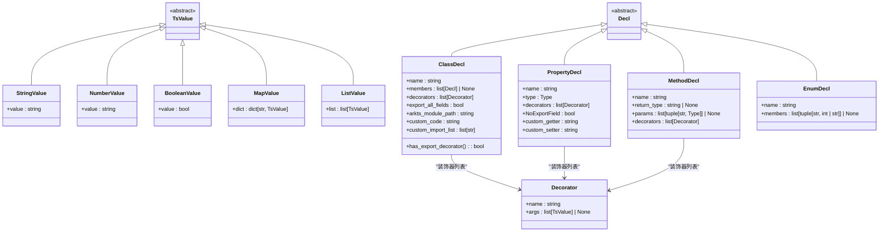

**图表来源**
- [lang/ts/decls.py](file://lang/ts/decls.py#L80-L134)
- [lang/ts/ts_types.py](file://lang/ts/ts_types.py#L8-L280)

**章节来源**
- [lang/ts/decls.py](file://lang/ts/decls.py#L80-L134)
- [lang/ts/parser_ts.py](file://lang/ts/parser_ts.py#L358-L424)
- [lang/ts/parser_ts.py](file://lang/ts/parser_ts.py#L420-L424)
- [lang/ts/parser_ts.py](file://lang/ts/parser_ts.py#L16-L24)

### Kotlin 类声明 ClassDecl
- 设计要点
  - 属性：名称、成员列表、注解列表
  - 注解列表由 Annotations 表示，支持带参数的注解值
  - 成员列表可包含属性声明等
- **新增**：注解增强功能
  - ShareClass：标记共享类，支持ID映射
  - ShareField：标记共享字段，支持ID映射
- 解析流程
  - 从修饰符中提取注解
  - 解析 class 名称与类体
  - 遍历类体内的属性声明并解析注解
- 与类型系统交互
  - 属性声明使用 Kotlin 类型系统提供的类型表示
- 序列化/反序列化
  - 当前仓库未提供显式的序列化/反序列化实现；可通过自定义转换器将 ClassDecl 转换为字典或 JSON 结构进行持久化与传输

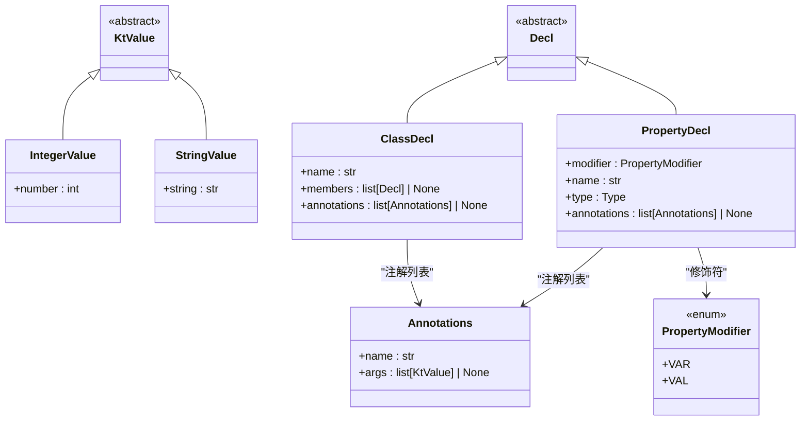

**图表来源**
- [lang/kt/kt_decls.py](file://lang/kt/kt_decls.py#L14-L57)
- [lang/kt/kt_parser.py](file://lang/kt/kt_parser.py#L59-L90)
- [lang/kt/kt_types.py](file://lang/kt/kt_types.py#L52-L191)

**章节来源**
- [lang/kt/kt_decls.py](file://lang/kt/kt_decls.py#L41-L44)
- [lang/kt/kt_parser.py](file://lang/kt/kt_parser.py#L59-L75)
- [lang/kt/kt_parser.py](file://lang/kt/kt_parser.py#L85-L91)

### 统一类名解析函数（新增）
- **更新** 设计要点
  - get_kt_proxy_class_and_package_name：统一处理不同共享类型的类名和包名解析
  - 支持 basic、copy、proxy 三种共享类型的不同处理策略
  - **新增**：增强的错误检查和验证机制
  - **新增**：支持 ShareId 映射和包名解析
  - **新增**：默认类名和包名回退机制
- **更新** 处理流程
  - basic/copy 类型：使用装饰器映射表获取类名和包名
  - proxy 类型：优先检查 ShareId 映射，否则使用常规类名映射
  - 错误处理：当 ShareId 对应的 Kotlin 类不存在时抛出详细错误
  - 默认回退：当无法解析时使用类名后缀和默认包名
- **更新** 共享类型支持
  - basic：直接使用装饰器指定的类名和包名
  - copy：复制实体类到 Kotlin 项目
  - proxy：通过 ShareId 关联现有 Kotlin 类

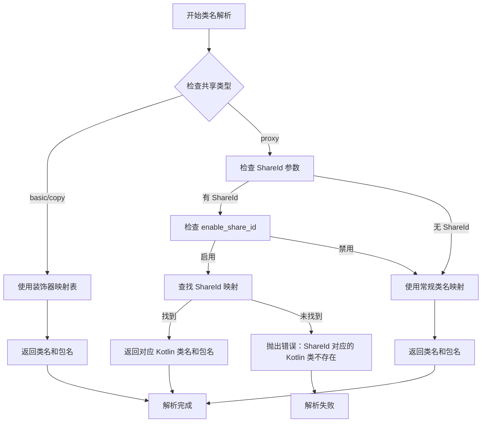

**图表来源**
- [convert/env.py](file://convert/env.py#L240-L257)

**章节来源**
- [convert/env.py](file://convert/env.py#L240-L257)

### 增强的类转换器（新增）
- **更新** 设计要点
  - **新增**：has_export_decorator方法，确保只有带导出装饰器的类才会被处理转换
  - **新增**：duplicate field validation机制，防止字段ID和字段名重复
  - **新增**：增强的字段导出控制逻辑，支持export_all_fields和NoExportField装饰器
  - **新增**：自定义代码注入功能，支持custom_code装饰器参数
  - **新增**：arkts_module_path支持，允许从指定模块路径创建实例
  - **新增**：字段名验证功能，确保字段名符合Kotlin命名规范
  - **新增**：custom_import功能，支持在类声明中指定自定义导入语句
  - **新增**：集成 get_kt_proxy_class_and_package_name 函数进行类名解析
- **更新** 转换流程
  - **新增**：导出过滤：使用has_export_decorator方法检查类是否带有导出装饰器
  - **新增**：类名解析：调用 get_kt_proxy_class_and_package_name 获取正确的类名和包名
  - 字段导出控制：根据export_all_fields决定导出策略
  - 重复性验证：检查字段ID和字段名是否重复
  - 自定义代码注入：处理custom_code装饰器参数
  - 构造函数增强：支持arkts_module_path参数
  - **新增**：custom_import处理：从装饰器中提取custom_import_list
- **更新** 与环境配置交互
  - 依赖env.py中的共享ID映射进行字段验证
  - 支持ShareId和ShareField的重复性检查
  - **新增**：kt_shared_class_field_name_map存储共享字段映射
  - **新增**：ClassInfo类包含custom_import_list字段

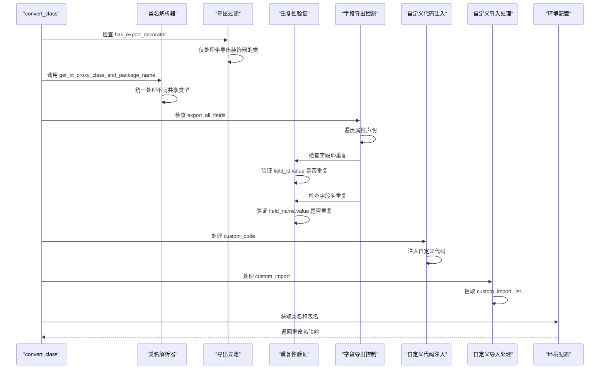

**图表来源**
- [convert/decls.py](file://convert/decls.py#L377-L471)
- [convert/env.py](file://convert/env.py#L240-L257)

**章节来源**
- [convert/decls.py](file://convert/decls.py#L377-L471)
- [convert/env.py](file://convert/env.py#L240-L257)

### 类导出过滤功能（新增）
- **新增** 设计要点
  - has_export_decorator方法：检查类是否带有导出装饰器
  - 支持ExportClass、ExportField、ExportMethod三种装饰器检测
  - 在环境配置构建和代码生成阶段集成过滤逻辑
  - 提高转换过程效率，避免处理无关类声明
- **新增** 过滤流程
  - 类声明解析：通过has_export_decorator方法检查装饰器
  - 环境配置构建：build_kt_class_rename_map集成导出过滤
  - 代码生成：generate函数集成导出过滤
  - 仅处理带有导出装饰器的类声明
- **新增** 装饰器检测
  - ExportClass：类级导出装饰器
  - ExportField：字段级导出装饰器
  - ExportMethod：方法级导出装饰器
  - NoExportField：字段级不导出装饰器

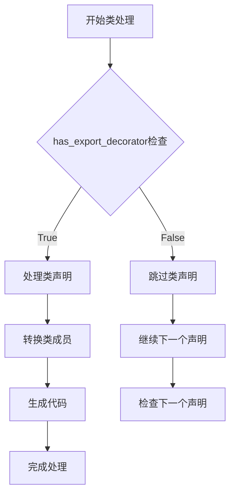

**图表来源**
- [lang/ts/decls.py](file://lang/ts/decls.py#L92-L93)
- [convert/decorators.py](file://convert/decorators.py#L39-L41)
- [convert/env.py](file://convert/env.py#L138-L155)
- [convert/generate.py](file://convert/generate.py#L130-L132)

**章节来源**
- [lang/ts/decls.py](file://lang/ts/decls.py#L92-L93)
- [convert/decorators.py](file://convert/decorators.py#L39-L41)
- [convert/env.py](file://convert/env.py#L138-L155)
- [convert/generate.py](file://convert/generate.py#L130-L132)

### 自定义导入功能（新增）
- **新增** 设计要点
  - custom_import：在类声明中指定自定义导入语句列表
  - 支持多个导入语句的批量处理
  - 与代码生成器集成，自动合并导入语句
  - 生成标准的Kotlin import语句格式
- **新增** 处理流程
  - 装饰器解析：从ExportClass装饰器中提取custom_import参数
  - 数据提取：将ListValue转换为字符串列表
  - 生成导入：通过_get_custom_imports函数生成import语句
  - 合并处理：在convert_module_paths中合并所有自定义导入
- **新增** 代码生成
  - ClassInfo类包含custom_import_list字段
  - _get_custom_imports函数将字符串列表转换为import语句
  - 支持单文件和项目模式下的导入合并去重

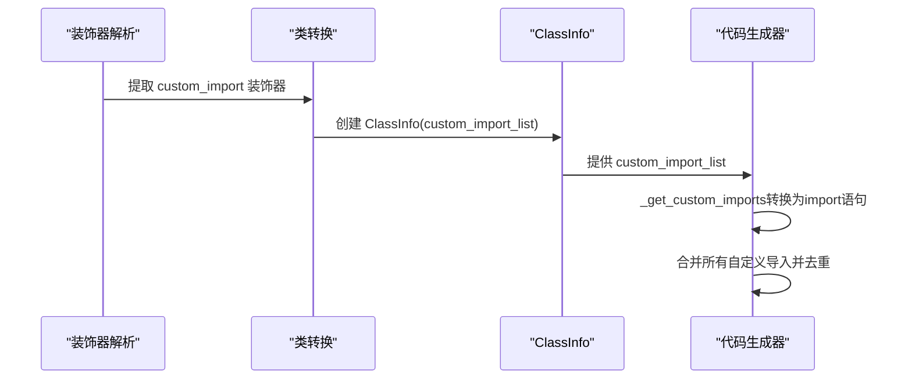

**图表来源**
- [convert/decls.py](file://convert/decls.py#L468-L471)
- [convert/generate.py](file://convert/generate.py#L138-L141)
- [convert/generate.py](file://convert/generate.py#L189-L192)

**章节来源**
- [convert/decls.py](file://convert/decls.py#L468-L471)
- [convert/generate.py](file://convert/generate.py#L138-L141)
- [convert/generate.py](file://convert/generate.py#L189-L192)

### 字段重复性验证机制（新增）
- **新增** 设计要点
  - 检查字段ID重复：使用used_field_ids集合跟踪已使用的字段ID
  - 检查字段名重复：使用used_field_names集合跟踪已使用的字段名
  - 错误处理：发现重复时抛出详细的错误信息
  - **新增**：支持反引号包裹的字段名验证
- **新增** 验证流程
  - 提取字段装饰器中的id和name参数
  - 检查集合中是否存在重复值
  - 发现重复时立即抛出错误
  - 支持反引号包裹的字段名特殊处理
- **新增** 错误类型
  - [Error 2002]：重复的字段名
  - [Error 2003]：重复的字段ID

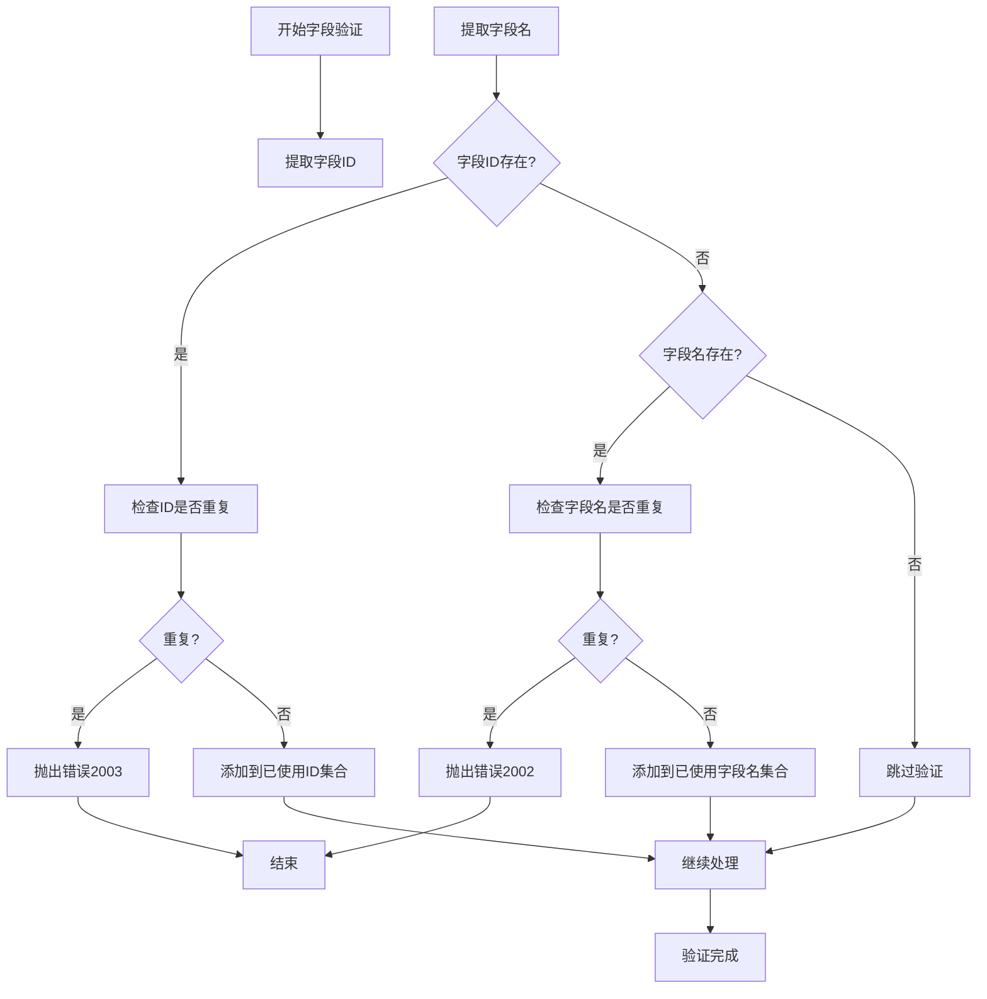

**图表来源**
- [convert/decls.py](file://convert/decls.py#L420-L431)
- [convert/check.py](file://convert/check.py#L62-L89)

**章节来源**
- [convert/decls.py](file://convert/decls.py#L420-L431)
- [convert/check.py](file://convert/check.py#L62-L89)

### 自定义代码注入功能（新增）
- **新增** 设计要点
  - custom_code：注入到类定义中的自定义代码
  - custom_getter：自定义getter实现
  - custom_setter：自定义setter实现
  - 支持多行字符串代码注入
  - **新增**：字段名验证集成到属性转换流程
- **新增** 注入流程
  - 检查装饰器中的custom_code参数
  - 将多行字符串转换为Kotlin节点
  - 注入到生成的类定义中
  - 支持字段级别的自定义getter和setter
- **新增** 代码转换
  - 使用multi_line_str_to_kt_node进行代码转换
  - 支持缩进和格式化处理

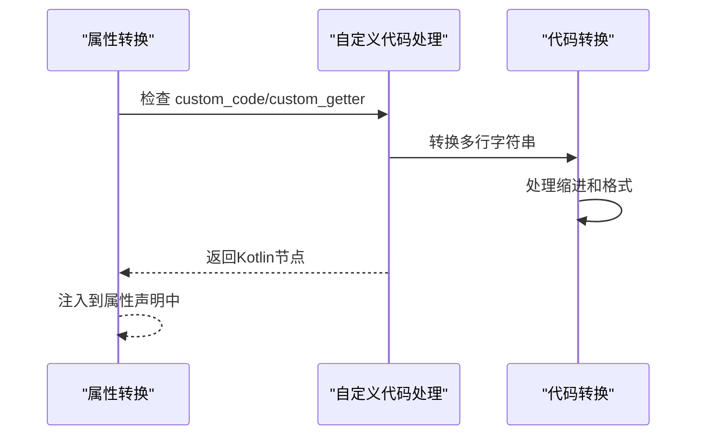

**图表来源**
- [convert/decls.py](file://convert/decls.py#L258-L345)
- [convert/decls.py](file://convert/decls.py#L438-L442)
- [convert/pretty.py](file://convert/pretty.py#L8-L97)

**章节来源**
- [convert/decls.py](file://convert/decls.py#L258-L345)
- [convert/decls.py](file://convert/decls.py#L438-L442)
- [convert/pretty.py](file://convert/pretty.py#L8-L97)

### 字段导出控制逻辑（增强）
- **更新** 设计要点
  - export_all_fields：控制是否导出所有字段（默认true）
  - NoExportField：标记不需要导出的字段
  - **新增**：支持ShareId字段映射
  - **新增**：支持字段类型和名称的装饰器覆盖
  - **新增**：has_export_decorator方法集成导出过滤
- **更新** 控制流程
  - export_all_fields为true：导出所有字段，排除NoExportField标记的字段
  - export_all_fields为false：仅导出带有ExportField装饰器的字段
  - **新增**：字段ID映射支持，通过ShareId关联共享字段
  - **新增**：字段名称和类型的装饰器覆盖机制
  - **新增**：导出过滤集成has_export_decorator检查

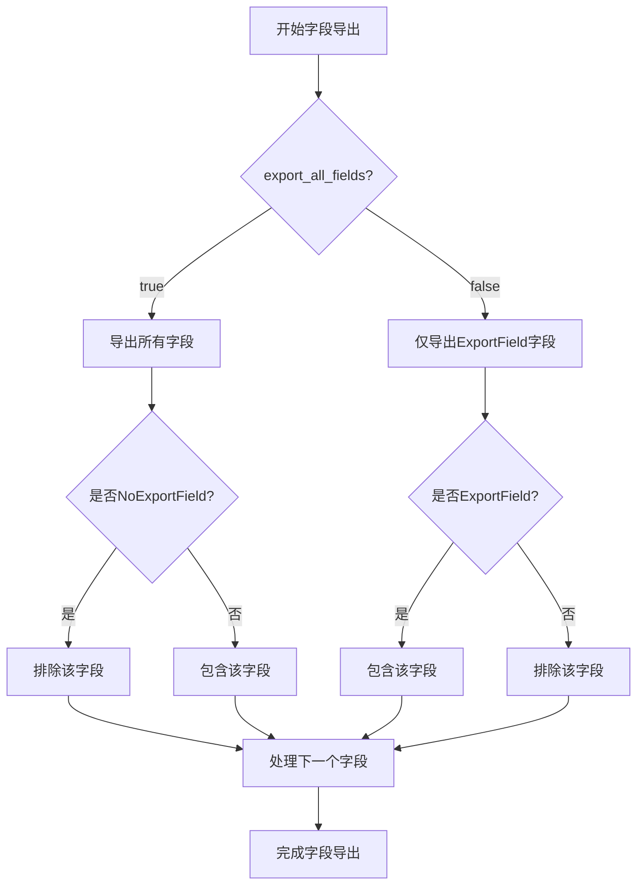

**图表来源**
- [convert/decls.py](file://convert/decls.py#L390-L401)

**章节来源**
- [convert/decls.py](file://convert/decls.py#L390-L401)

### Kotlin命名规范验证器（新增）
- **新增** 设计要点
  - check_kotlin_field_name：验证字段名符合Kotlin命名规范
  - 支持反引号包裹的字段名特殊处理
  - 检查关键字冲突和字符合法性
  - **新增**：check_kotlin_class_name和check_kotlin_package_name
- **新增** 验证规则
  - 非空检查：字段名不能为空
  - 反引号处理：支持反引号包裹的字段名
  - 关键字检查：不能使用Kotlin关键字
  - 字符检查：只能包含字母、数字、下划线
  - 首字符检查：必须以字母或下划线开头
- **新增** 错误类型
  - [Error 2001]：字段名不符合规范
  - [Error 1001]：类名不符合规范
  - [Error 1002]：包名不符合规范

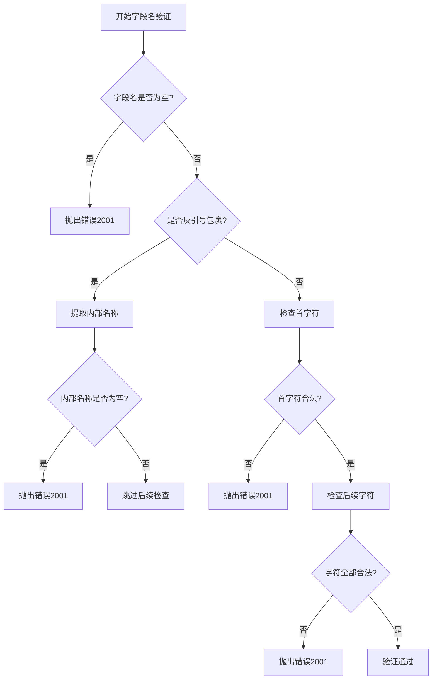

**图表来源**
- [convert/check.py](file://convert/check.py#L62-L89)

**章节来源**
- [convert/check.py](file://convert/check.py#L62-L89)

### 装饰器/注解解析流程（TypeScript）
- 流程概览
  - 解析装饰器：逐个识别 @ 符号与标识符，支持可选参数（字符串、数字、布尔、对象字面量、数组）
  - 解析类声明：class 关键字、名称、类体
  - 解析类体：逐项解析属性声明，同时保留装饰器信息
  - **新增**：导出过滤：通过has_export_decorator方法检查装饰器
- 关键步骤
  - 装饰器解析：识别 @ 标识符，判断是否带括号与参数列表
  - 表达式解析：支持字符串、数字、布尔、对象字面量、数组
  - 类声明解析：eat('class')、解析名称、解析类体、生成 ClassDecl
  - **新增**：导出检查：调用has_export_decorator方法进行过滤

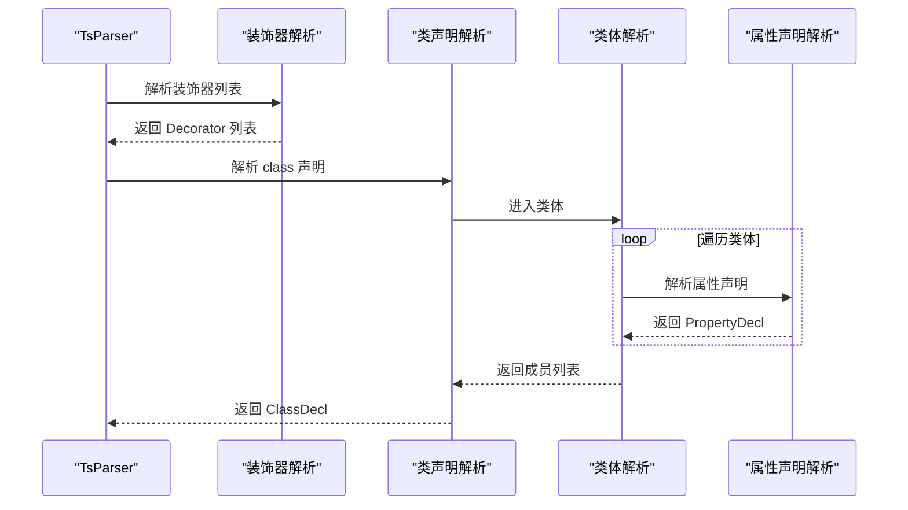

**图表来源**
- [lang/ts/parser_ts.py](file://lang/ts/parser_ts.py#L358-L424)
- [lang/ts/parser_ts.py](file://lang/ts/parser_ts.py#L16-L24)
- [lang/ts/parser_ts.py](file://lang/ts/parser_ts.py#L420-L424)
- [lang/ts/parser_ts.py](file://lang/ts/parser_ts.py#L164-L184)

**章节来源**
- [lang/ts/parser_ts.py](file://lang/ts/parser_ts.py#L358-L424)
- [lang/ts/parser_ts.py](file://lang/ts/parser_ts.py#L16-L24)
- [lang/ts/parser_ts.py](file://lang/ts/parser_ts.py#L420-L424)
- [lang/ts/parser_ts.py](file://lang/ts/parser_ts.py#L164-L184)

### 注解解析流程（Kotlin）
- 流程概览
  - 从修饰符中提取注解节点，构造 Annotations
  - 解析 class 名称与类体
  - 遍历类体内的属性声明，解析注解与修饰符
- 关键步骤
  - 注解解析：从 constructor_invocation 中提取 user_type 作为注解名，value_arguments 中提取字符串参数
  - 属性解析：识别 val/var 修饰符，解析变量声明与类型

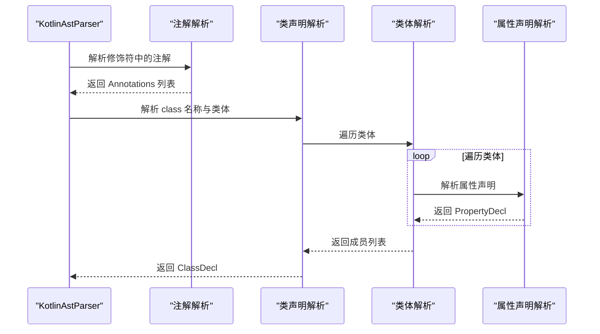

**图表来源**
- [lang/kt/kt_parser.py](file://lang/kt/kt_parser.py#L59-L90)
- [lang/kt/kt_parser.py](file://lang/kt/kt_parser.py#L130-L149)
- [lang/kt/kt_parser.py](file://lang/kt/kt_parser.py#L94-L127)

**章节来源**
- [lang/kt/kt_parser.py](file://lang/kt/kt_parser.py#L59-L90)
- [lang/kt/kt_parser.py](file://lang/kt/kt_parser.py#L130-L149)
- [lang/kt/kt_parser.py](file://lang/kt/kt_parser.py#L94-L127)

### 类声明的序列化与反序列化机制
- 当前状态
  - 仓库未提供显式的序列化/反序列化实现
- 建议方案
  - 将 ClassDecl 转换为字典结构，包含名称、成员列表、装饰器/注解信息
  - 对嵌套的类型与值结构进行递归转换
  - 可使用 JSON 或二进制格式进行持久化与跨语言传输
- 注意事项
  - 需要确保类型系统中的复杂类型（如泛型、联合类型、可空类型）在转换时保持语义一致
  - 对于装饰器/注解参数，需统一为可序列化的基础类型（字符串、数字、布尔、字典、列表）
  - **新增**：需要考虑duplicate field validation、自定义代码注入、custom_import和has_export_decorator的序列化
  - **新增**：需要考虑 get_kt_proxy_class_and_package_name 函数的统一类名解析逻辑

### 具体类声明示例与使用场景
- TypeScript 示例
  - 基础类与导出装饰器
    - 示例路径：[test/cases/class0.ts](file://test/cases/class0.ts#L1-L4)
  - 带字段级导出装饰器
    - 示例路径：[test/cases/class1.ts](file://test/cases/class1.ts#L1-L5)
  - 实现多个接口
    - 示例路径：[test/cases/class2.ts](file://test/cases/class2.ts#L1-L4)
  - 继承与实现组合
    - 示例路径：[test/cases/class3.ts](file://test/cases/class3.ts#L1-L4)
  - 带对象参数的装饰器
    - 示例路径：[test/cases/class4.ts](file://test/cases/class4.ts#L1-L4)
  - **新增**：导出过滤示例
    - 示例路径：[test/cases/class5.ts](file://test/cases/class5.ts#L1-L5)
  - **新增**：字段重复性验证示例
    - 示例路径：[test/cases/class8.ts](file://test/cases/class8.ts#L1-L21)
  - **新增**：自定义代码注入示例
    - 示例路径：[test/cases/class11.ts](file://test/cases/class11.ts#L1-L14)
  - **新增**：自定义导入功能示例
    - 示例路径：[test/cases/class12.ts](file://test/cases/class12.ts#L1-L4)
  - **新增**：共享ID和导出控制示例
    - 示例路径：[test/cases/class10.ts](file://test/cases/class10.ts#L1-L35)
- Kotlin 示例
  - 基础类与共享类注解
    - 示例路径：[test/cases/kt/class0.kt](file://test/cases/kt/class0.kt#L1-L9)
  - expect/actual 类与多注解
    - 示例路径：[test/cases/kt/class1.kt](file://test/cases/kt/class1.kt#L1-L18)
  - 含方法的 expect/actual 类
    - 示例路径：[test/cases/kt/class2.kt](file://test/cases/kt/class2.kt#L1-L22)

**章节来源**
- [test/cases/class0.ts](file://test/cases/class0.ts#L1-L4)
- [test/cases/class1.ts](file://test/cases/class1.ts#L1-L5)
- [test/cases/class2.ts](file://test/cases/class2.ts#L1-L4)
- [test/cases/class3.ts](file://test/cases/class3.ts#L1-L4)
- [test/cases/class4.ts](file://test/cases/class4.ts#L1-L4)
- [test/cases/class5.ts](file://test/cases/class5.ts#L1-L5)
- [test/cases/class8.ts](file://test/cases/class8.ts#L1-L21)
- [test/cases/class11.ts](file://test/cases/class11.ts#L1-L14)
- [test/cases/class12.ts](file://test/cases/class12.ts#L1-L4)
- [test/cases/class10.ts](file://test/cases/class10.ts#L1-L35)
- [test/cases/kt/class0.kt](file://test/cases/kt/class0.kt#L1-L9)
- [test/cases/kt/class1.kt](file://test/cases/kt/class1.kt#L1-L18)
- [test/cases/kt/class2.kt](file://test/cases/kt/class2.kt#L1-L22)

### 类声明与其他声明类型的关系与交互模式
- TypeScript
  - ClassDecl 可包含 PropertyDecl、MethodDecl、EnumDecl 等成员
  - 装饰器可作用于类与成员级别，形成元信息链
  - 类型系统为属性与方法提供类型约束
  - **新增**：装饰器增强支持字段导出控制、自定义代码注入、自定义导入和导出过滤
  - **新增**：has_export_decorator方法确保只有带导出装饰器的类才会被处理
  - **新增**：get_kt_proxy_class_and_package_name函数统一处理不同共享类型的类名解析
- Kotlin
  - ClassDecl 可包含 PropertyDecl 等成员
  - 注解可作用于类与属性级别，修饰符（val/var）决定可变性
  - 类型系统为属性提供类型约束
  - **新增**：注解增强支持ShareClass和ShareField ID映射

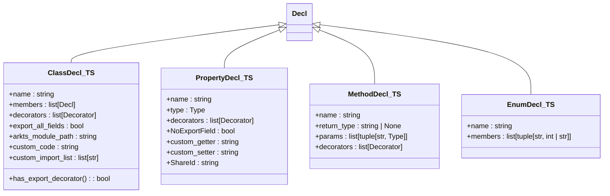

**图表来源**
- [lang/ts/decls.py](file://lang/ts/decls.py#L80-L134)

**章节来源**
- [lang/ts/decls.py](file://lang/ts/decls.py#L80-L134)

## 依赖关系分析
- 模块耦合
  - 解析器依赖声明模型与类型系统
  - 声明模型之间通过继承关系形成层次结构
  - **新增**：类转换器依赖验证器、环境配置管理和代码生成器
  - **新增**：验证器依赖Kotlin命名规范检查
  - **新增**：环境配置管理器依赖共享ID映射和has_export_decorator过滤
  - **新增**：代码生成器依赖类转换器、自定义导入处理和has_export_decorator过滤
  - **新增**：主程序依赖增强的类转换器、生成器和导出过滤功能
  - **新增**：get_kt_proxy_class_and_package_name函数依赖配置管理和共享类型设置
- 外部依赖
  - TypeScript 解析依赖 tree-sitter-arkts
  - Kotlin 解析依赖 tree-sitter-kotlin
  - **新增**：配置管理依赖 utils/config.py 中的 ProxyConfig
- 潜在循环依赖
  - 当前结构以抽象基类与具体实现分离，未见循环导入

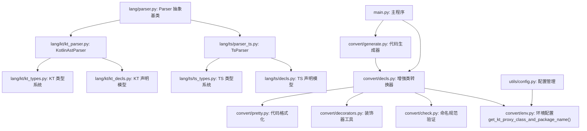

**图表来源**
- [lang/parser.py](file://lang/parser.py#L8-L57)
- [lang/ts/parser_ts.py](file://lang/ts/parser_ts.py#L10-L17)
- [lang/ts/decls.py](file://lang/ts/decls.py#L1-L134)
- [lang/ts/ts_types.py](file://lang/ts/ts_types.py#L1-L280)
- [lang/kt/kt_parser.py](file://lang/kt/kt_parser.py#L1-L242)
- [lang/kt/kt_decls.py](file://lang/kt/kt_decls.py#L1-L57)
- [lang/kt/kt_types.py](file://lang/kt/kt_types.py#L1-L191)
- [convert/decls.py](file://convert/decls.py#L1-L863)
- [convert/check.py](file://convert/check.py#L1-L89)
- [convert/env.py](file://convert/env.py#L1-L258)
- [convert/decorators.py](file://convert/decorators.py#L1-L41)
- [convert/pretty.py](file://convert/pretty.py#L1-L113)
- [convert/generate.py](file://convert/generate.py#L1-L192)
- [main.py](file://main.py#L1-L71)
- [utils/config.py](file://utils/config.py#L1-L390)

**章节来源**
- [lang/parser.py](file://lang/parser.py#L1-L57)
- [lang/ts/parser_ts.py](file://lang/ts/parser_ts.py#L1-L483)
- [lang/ts/decls.py](file://lang/ts/decls.py#L1-L134)
- [lang/ts/ts_types.py](file://lang/ts/ts_types.py#L1-L280)
- [lang/kt/kt_parser.py](file://lang/kt/kt_parser.py#L1-L242)
- [lang/kt/kt_decls.py](file://lang/kt/kt_decls.py#L1-L57)
- [lang/kt/kt_types.py](file://lang/kt/kt_types.py#L1-L191)
- [convert/decls.py](file://convert/decls.py#L1-L863)
- [convert/check.py](file://convert/check.py#L1-L89)
- [convert/env.py](file://convert/env.py#L1-L258)
- [convert/decorators.py](file://convert/decorators.py#L1-L41)
- [convert/pretty.py](file://convert/pretty.py#L1-L113)
- [convert/generate.py](file://convert/generate.py#L1-L192)
- [main.py](file://main.py#L1-L71)
- [utils/config.py](file://utils/config.py#L1-L390)

## 性能考量
- 解析效率
  - 使用流式节点操作减少重复遍历
  - 分离装饰器与类体解析，避免不必要的回溯
  - **新增**：has_export_decorator方法提供快速过滤，避免处理无关类声明
  - **新增**：get_kt_proxy_class_and_package_name函数提供统一的类名解析，减少重复计算
- 内存占用
  - 将装饰器/注解参数转换为轻量级值对象，降低内存开销
  - **新增**：重复性验证使用集合操作，时间复杂度为O(1)
  - **新增**：custom_import处理使用列表和集合操作，性能开销较小
  - **新增**：导出过滤在早期阶段进行，减少后续处理开销
  - **新增**：共享ID映射缓存，避免重复查找
- 扩展性
  - 通过抽象基类与访问者模式，便于新增声明类型与类型种类
  - **新增**：has_export_decorator方法支持未来更多导出装饰器类型
  - **新增**：get_kt_proxy_class_and_package_name函数支持未来更多共享类型
- **新增**：增强功能性能
  - has_export_decorator：常量时间检查，O(1)性能
  - duplicate field validation：使用集合操作，O(1)查找，整体O(n)遍历
  - 自定义代码注入：多行字符串处理，性能开销较小
  - 字段导出控制：条件分支检查，性能影响可忽略
  - Kotlin命名规范验证：字符逐个检查，性能开销较小
  - 构造函数生成性能：与原有功能相同，无额外开销
  - **新增**：custom_import处理：列表转换和集合去重，整体O(n)性能
  - **新增**：代码生成器优化：导入语句合并去重，避免重复导入
  - **新增**：导出过滤优化：在解析阶段就过滤掉不需要的类声明
  - **新增**：类名解析优化：统一处理逻辑，减少重复计算

## 故障排查指南
- 常见错误
  - 装饰器/注解缺失或格式错误：检查 @ 符号与括号匹配
  - 类声明关键字缺失：确认 class 关键字与名称解析
  - 类体解析异常：检查大括号闭合与成员分隔符
  - **新增**：字段重复性错误：检查字段ID和字段名重复
  - **新增**：字段名不符合规范：检查Kotlin命名规则
  - **新增**：自定义代码注入错误：检查多行字符串格式
  - **新增**：arkts_module_path配置错误：检查模块路径正确性
  - **新增**：ShareId映射错误：检查共享ID唯一性和有效性
  - **新增**：custom_import格式错误：检查数组格式和字符串格式
  - **新增**：类未被处理：检查是否带有导出装饰器
  - **新增**：ShareId对应的Kotlin类不存在：检查ShareId映射配置
  - **新增**：不支持的共享类型：检查配置文件中的shareType设置
- 定位方法
  - 使用解析器的 eat/peek/skip 辅助定位当前节点
  - 在装饰器与类体解析处增加日志输出
  - **新增**：在重复性验证处增加详细的错误信息
  - **新增**：在自定义代码注入处增加格式验证
  - **新增**：在字段导出控制处增加装饰器参数检查
  - **新增**：在custom_import处理处增加格式验证
  - **新增**：使用has_export_decorator方法检查类是否被过滤
  - **新增**：使用详细的错误类型帮助定位问题
  - **新增**：检查get_kt_proxy_class_and_package_name函数的返回值
  - **新增**：验证配置文件中的共享类型设置
- 错误类型
  - TypeScript：装饰器解析抛出语法错误
  - Kotlin：注解解析抛出 KotlinParseError
  - **新增**：duplicate field validation：ValueError（字段重复）
  - **新增**：字段名验证：ValueError（命名规范错误）
  - **新增**：自定义代码注入：SyntaxError（代码格式错误）
  - **新增**：ShareId映射：ValueError（ID重复或无效）
  - **新增**：custom_import处理：ValueError（导入格式错误）
  - **新增**：导出过滤：ValueError（类未带导出装饰器）
  - **新增**：ShareId对应的Kotlin类不存在：ValueError（ShareId映射错误）
  - **新增**：不支持的共享类型：ValueError（配置错误）

**章节来源**
- [lang/ts/parser_ts.py](file://lang/ts/parser_ts.py#L43-L46)
- [lang/ts/parser_ts.py](file://lang/ts/parser_ts.py#L358-L424)
- [lang/kt/kt_parser.py](file://lang/kt/kt_parser.py#L16-L17)
- [convert/decls.py](file://convert/decls.py#L420-L431)
- [convert/check.py](file://convert/check.py#L62-L89)
- [convert/env.py](file://convert/env.py#L138-L155)
- [utils/config.py](file://utils/config.py#L142-L143)

## 结论
本文件系统性梳理了类声明在 TypeScript 与 Kotlin 两套体系中的建模与解析机制，明确了 ClassDecl 的属性结构、装饰器/注解处理流程，并给出了与类型系统的交互方式与扩展建议。**新增的 get_kt_proxy_class_and_package_name() 函数显著改进了类转换逻辑，统一处理不同共享类型的类名和包名解析，支持 basic、copy、proxy 三种共享类型的不同处理策略，增强了错误检查和验证机制。**增强的类转换器显著提升了字段导出控制的灵活性，新增的duplicate field validation机制确保了字段定义的正确性，自定义代码注入功能为用户提供了更大的定制空间，新增的custom_import功能支持在类声明中指定自定义导入语句，arkts_module_path支持增强了实例化场景的多样性。这些改进共同构建了一个更加健壮、灵活且用户友好的跨语言桥接基础设施。

## 附录
- 相关测试用例
  - TypeScript：[test/cases/class0.ts](file://test/cases/class0.ts#L1-L4)、[test/cases/class1.ts](file://test/cases/class1.ts#L1-L5)、[test/cases/class2.ts](file://test/cases/class2.ts#L1-L4)、[test/cases/class3.ts](file://test/cases/class3.ts#L1-L4)、[test/cases/class4.ts](file://test/cases/class4.ts#L1-L4)
  - **新增**：导出过滤测试：[test/cases/class5.ts](file://test/cases/class5.ts#L1-L5)
  - **新增**：字段重复性验证测试：[test/cases/class8.ts](file://test/cases/class8.ts#L1-L21)
  - **新增**：自定义代码注入测试：[test/cases/class11.ts](file://test/cases/class11.ts#L1-L14)
  - **新增**：自定义导入功能测试：[test/cases/class12.ts](file://test/cases/class12.ts#L1-L4)
  - **新增**：共享ID和导出控制测试：[test/cases/class10.ts](file://test/cases/class10.ts#L1-L35)
  - Kotlin：[test/cases/kt/class0.kt](file://test/cases/kt/class0.kt#L1-L9)、[test/cases/kt/class1.kt](file://test/cases/kt/class1.kt#L1-L18)、[test/cases/kt/class2.kt](file://test/cases/kt/class2.kt#L1-L22)
- **新增**：增强的类转换器功能
  - has_export_decorator方法：检查类是否带有导出装饰器，确保只有带导出装饰器的类才会被处理转换
  - duplicate field validation：防止字段ID和字段名重复，提供详细的错误信息
  - 增强的字段导出控制：支持export_all_fields和NoExportField装饰器
  - 自定义代码注入：支持custom_code、custom_getter、custom_setter装饰器参数
  - **新增**：custom_import功能：支持在类声明中指定自定义导入语句列表
  - arkts_module_path支持：允许从指定模块路径创建实例
  - Kotlin命名规范验证：确保字段名符合Kotlin命名规范
  - ShareId映射支持：支持跨类字段映射和重复性检查
  - 多行字符串代码注入：支持复杂的自定义代码生成
  - 条件构造函数生成：根据arkts_module_path动态生成构造函数
  - **新增**：自定义导入处理：支持批量导入语句的解析和生成
  - **新增**：代码生成器集成：自动合并和去重自定义导入语句
  - **新增**：导出过滤优化：在解析阶段就过滤掉不需要的类声明
  - **新增**：get_kt_proxy_class_and_package_name函数：统一处理不同共享类型的类名和包名解析
  - **新增**：增强的错误检查和验证机制：改进类转换逻辑，提供更详细的错误信息
  - **新增**：共享类型支持：支持 basic、copy、proxy 三种共享类型的不同处理策略
  - **新增**：配置管理集成：依赖 utils/config.py 中的 ProxyConfig 设置