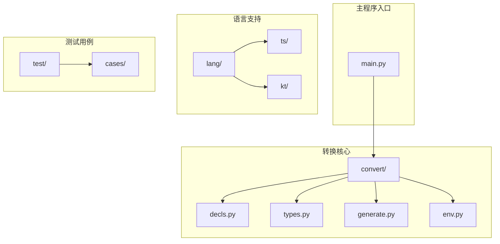
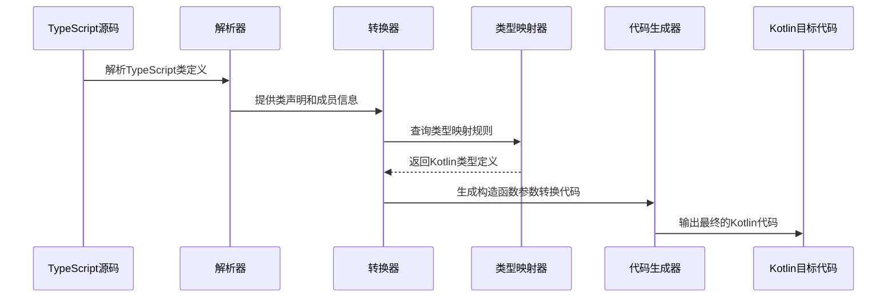
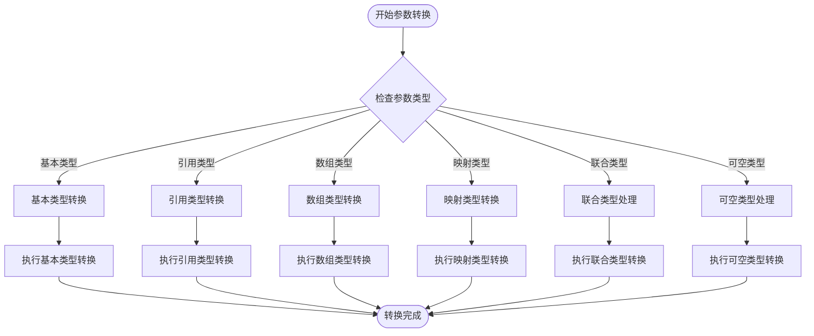
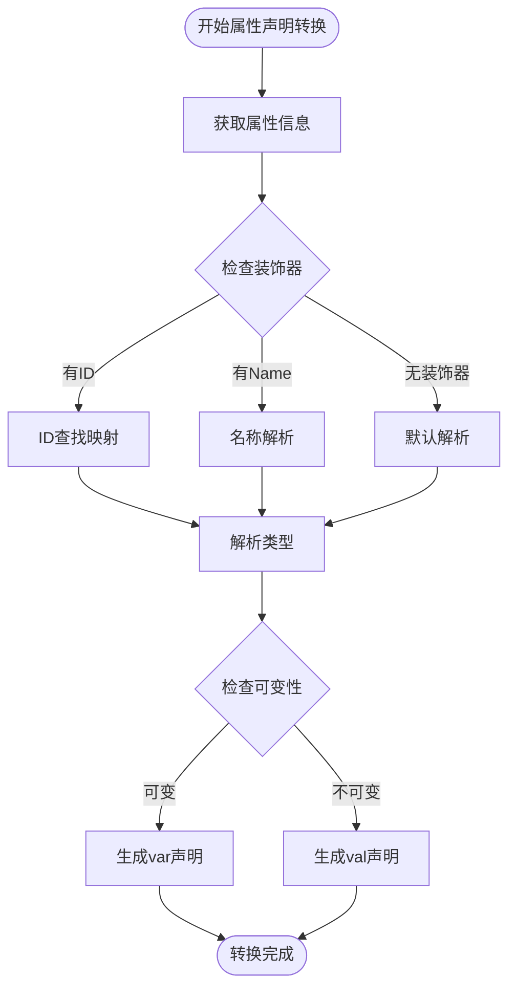
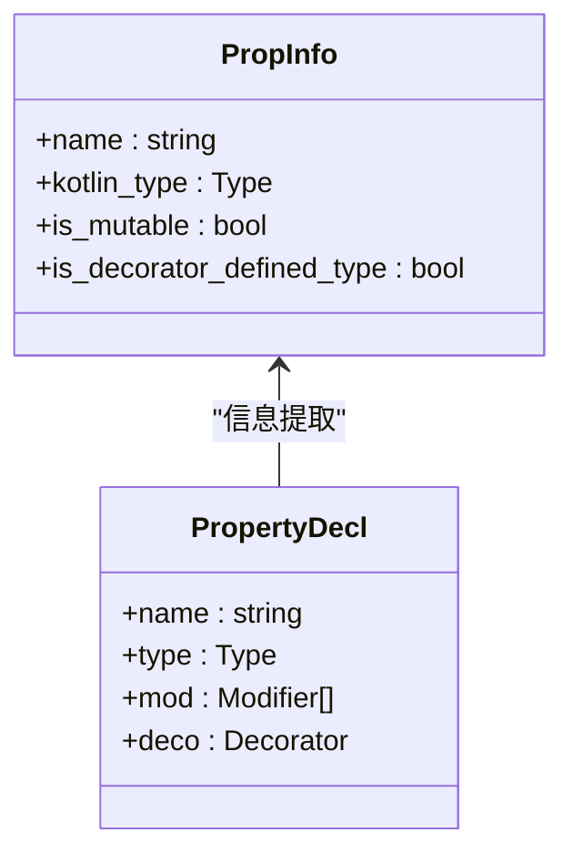
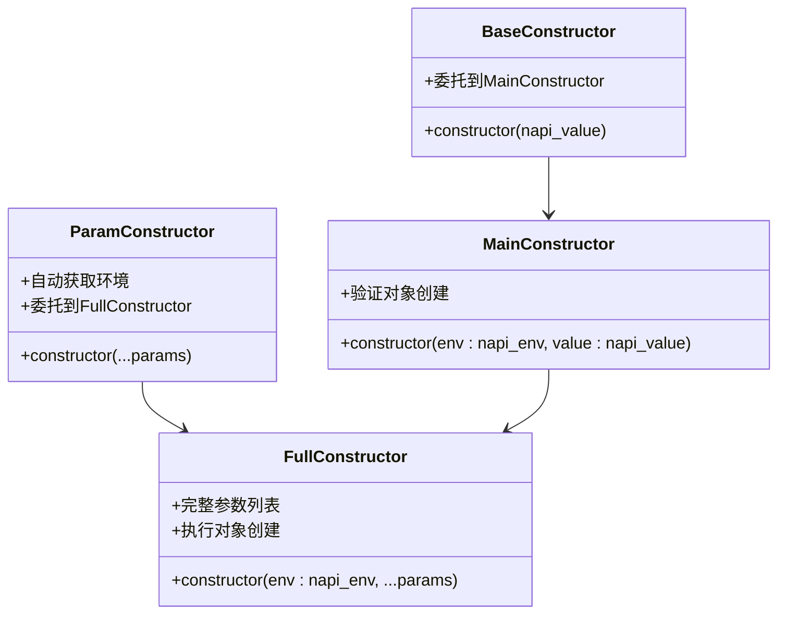
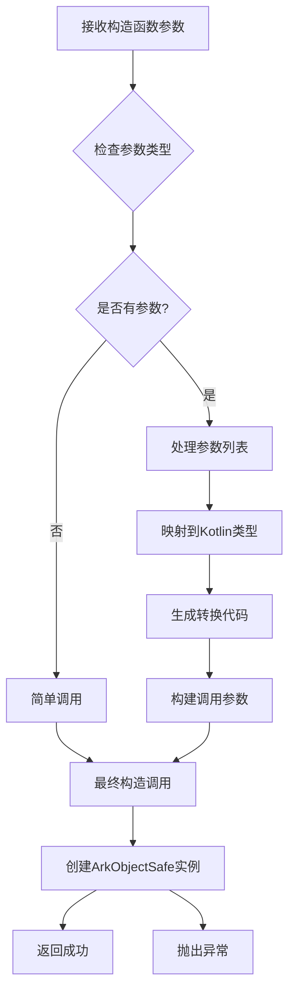
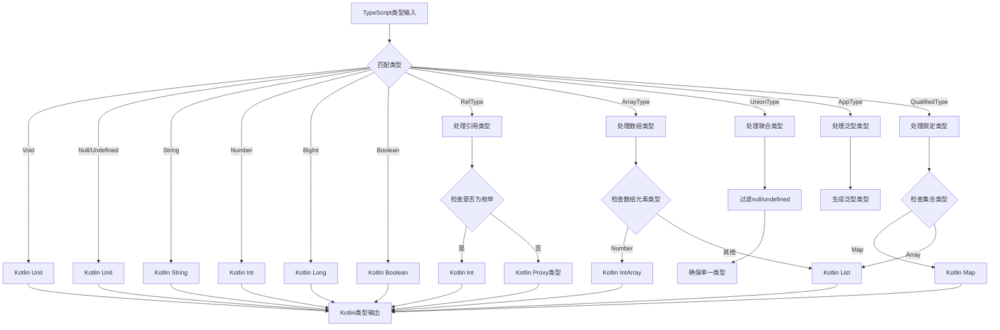
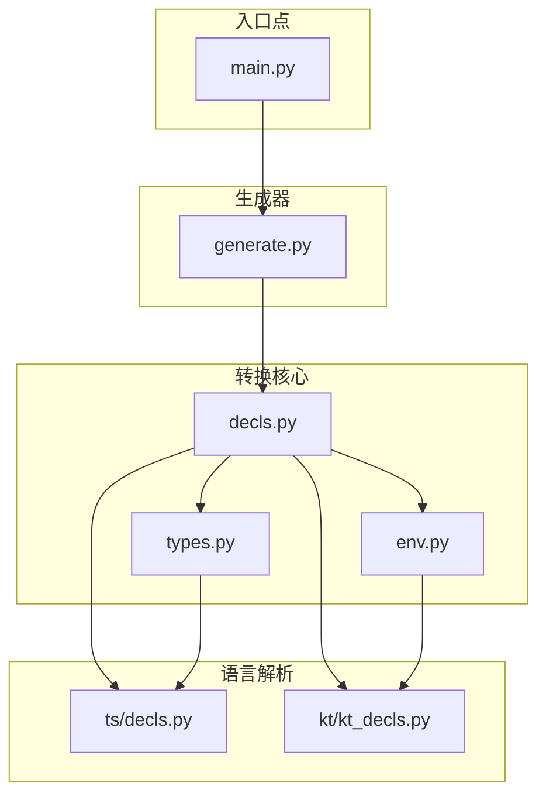

# 类构造函数参数转换功能

<cite>
**本文档引用的文件**
- [main.py](file://main.py)
- [generate.py](file://convert/generate.py)
- [decls.py](file://convert/decls.py)
- [types.py](file://convert/types.py)
- [env.py](file://convert/env.py)
- [decls.py](file://lang/ts/decls.py)
- [kt_decls.py](file://lang/kt/kt_decls.py)
- [class0.ts](file://test/cases/class0.ts)
- [class1.ts](file://test/cases/class1.ts)
- [class2.ts](file://test/cases/class2.ts)
- [class3.ts](file://test/cases/class3.ts)
- [class4.ts](file://test/cases/class4.ts)
- [class5.ts](file://test/cases/class5.ts)
- [class6.ts](file://test/cases/class6.ts)
- [class7.ts](file://test/cases/class7.ts)
- [class8.ts](file://test/cases/class8.ts)
- [class9.ts](file://test/cases/class9.ts)
- [class10.ts](file://test/cases/class10.ts)
- [class11.ts](file://test/cases/class11.ts)
- [class12.ts](file://test/cases/class12.ts)
- [class0.kt](file://test/cases/kt/class0.kt)
- [class1.kt](file://test/cases/kt/class1.kt)
- [class2.kt](file://test/cases/kt/class2.kt)
- [class3.kt](file://test/cases/kt/class3.kt)
- [class4.kt](file://test/cases/kt/class4.kt)
</cite>

## 更新摘要
**所做更改**
- 新增属性声明转换功能，引入 convert_prop_decl 函数
- 增强属性信息获取机制，完善 PropInfo 数据结构
- 扩展属性转换器支持，涵盖 getter 和 setter 生成
- 完善类构造函数参数转换功能，支持更完整的属性声明转换能力
- 新增属性声明转换器的独立实现，支持仅生成属性声明而无getter/setter
- 优化装饰器类型字符串处理，改进返回类型简化逻辑
- 改进构造函数累积逻辑，提升代码性能和可维护性

## 目录
1. [简介](#简介)
2. [项目结构](#项目结构)
3. [核心组件](#核心组件)
4. [架构概览](#架构概览)
5. [详细组件分析](#详细组件分析)
6. [依赖关系分析](#依赖关系分析)
7. [性能考虑](#性能考虑)
8. [故障排除指南](#故障排除指南)
9. [结论](#结论)

## 简介

本文档深入分析了 ArkTS FFI 转换器中的类构造函数参数转换功能。该功能负责将 TypeScript 类的构造函数参数转换为相应的 Kotlin 类构造函数，实现跨语言的数据类型映射和参数转换。系统通过复杂的类型推导、装饰器解析和代码生成机制，实现了从 TypeScript 到 Kotlin 的无缝转换。

**更新** 新增属性声明转换功能，增强了类构造函数参数转换的完整性，支持更丰富的属性声明转换能力。新增的 convert_prop_decl 函数专门处理属性声明的独立转换，支持仅生成属性声明而无需生成 getter 和 setter 代码。同时，对装饰器类型字符串处理进行了优化，改进了返回类型简化逻辑，并优化了构造函数累积逻辑以提升性能和可维护性。

## 项目结构

该项目采用模块化设计，主要包含以下核心目录：



**图表来源**
- [main.py](file://main.py#L1-L36)
- [decls.py](file://convert/decls.py#L1-L863)
- [generate.py](file://convert/generate.py#L1-L192)

**章节来源**
- [main.py](file://main.py#L1-L36)
- [generate.py](file://convert/generate.py#L1-L192)

## 核心组件

### 类构造函数转换器

类构造函数参数转换功能的核心实现位于 `convert/decls.py` 文件中，主要包含以下关键组件：

1. **class_constructor_param_transformer**: 主要的参数转换函数
2. **convert_class_constructor**: 类构造函数生成器
3. **convert_prop_decl**: 新增的属性声明转换函数（独立实现）
4. **convert_prop**: 原有的属性转换函数（包含 getter 和 setter）
5. **get_prop_info**: 属性信息获取函数
6. **PropInfo**: 属性信息数据结构
7. **类型映射系统**: 支持多种数据类型的转换
8. **装饰器解析**: 处理 TypeScript 装饰器元数据

### 数据类型支持

系统支持以下主要数据类型的转换：

| TypeScript 类型 | Kotlin 类型 | 转换示例 |
|----------------|-------------|----------|
| string | kotlin.String | `param.toArkString()` |
| number | kotlin.Int/LONG | `param.toArkNumber()` |
| boolean | kotlin.Boolean | `param.toArkBoolean()` |
| bigint | kotlin.Long | `param.toArkBigInt()` |
| Array<T> | List<T> | `param.toArkArray()` |
| Map<K,V> | Map<K,V> | `param.toArkMap()` |
| 自定义对象 | Proxy 类型 | `param?.ref?.napiValue ?: getArkUndefined()` |

**更新** 新增属性声明转换功能，支持更完整的属性类型映射和转换。

**章节来源**
- [decls.py](file://convert/decls.py#L495-L593)
- [types.py](file://convert/types.py#L10-L69)

## 架构概览

系统采用分层架构设计，实现了从 TypeScript 到 Kotlin 的完整转换流程：



**图表来源**
- [decls.py](file://convert/decls.py#L595-L694)
- [types.py](file://convert/types.py#L10-L69)

## 详细组件分析

### 类构造函数参数转换器

#### 核心转换逻辑

`class_constructor_param_transformer` 函数实现了复杂的参数类型转换逻辑：



**图表来源**
- [decls.py](file://convert/decls.py#L495-L593)

#### 类型转换规则

系统实现了全面的类型转换规则，覆盖了所有常见的 TypeScript 类型：

1. **基本类型转换**
   - string → kotlin.String: `param.toArkString()`
   - number → kotlin.Int/LONG: `param.toArkNumber()`
   - boolean → kotlin.Boolean: `param.toArkBoolean()`

2. **复杂类型转换**
   - Array<T> → List<T>: `param.toArkArray() { it.toArkType() }`
   - Map<K,V> → Map<K,V>: `param.toArkMap() { it.toArkType() }`
   - BigInt → kotlin.Long: `param.toArkBigInt()`

3. **引用类型处理**
   - 自定义对象 → Proxy 类型: `param?.ref?.napiValue ?: getArkUndefined()`

**更新** 优化了装饰器类型字符串处理，改进了返回类型简化逻辑，提升了代码性能和可维护性。

**章节来源**
- [decls.py](file://convert/decls.py#L495-L593)

### 属性声明转换功能

#### 新增属性转换器

**更新** 新增 `convert_prop_decl` 函数，专门处理属性声明的独立转换：



**图表来源**
- [decls.py](file://convert/decls.py#L335-L373)

#### 属性信息管理

**更新** 新增 `PropInfo` 数据结构和 `get_prop_info` 函数：



**图表来源**
- [decls.py](file://convert/decls.py#L204-L261)

**章节来源**
- [decls.py](file://convert/decls.py#L204-L261)
- [decls.py](file://convert/decls.py#L335-L373)

### 类构造函数生成器

#### 多级构造函数体系

系统生成四层构造函数体系，提供灵活的使用方式：



**图表来源**
- [decls.py](file://convert/decls.py#L595-L694)

#### 构造函数参数处理流程



**图表来源**
- [decls.py](file://convert/decls.py#L620-L694)

**更新** 改进了构造函数累积逻辑，优化了参数处理和代码生成过程，提升了性能和可维护性。

**章节来源**
- [decls.py](file://convert/decls.py#L595-L694)

### 类型映射系统

#### 默认类型映射规则

`to_default_kt_type` 函数实现了 TypeScript 到 Kotlin 的默认类型映射：



**图表来源**
- [types.py](file://convert/types.py#L10-L69)

**章节来源**
- [types.py](file://convert/types.py#L10-L69)

### 环境配置和共享机制

#### 共享类映射系统

系统通过 `env.py` 实现了复杂的类和字段共享机制：

```mermaid
graph TD
TS_CLASS {
string name
string id
string module_path
}
KT_CLASS {
string name
string package
string share_id
}
SHARED_FIELD {
string class_id
string field_id
string ts_field_name
string kt_field_name
}
CLASS_RENAME_MAP {
string ts_class_name
string kt_class_name
string package
}
TS_CLASS ||--|| CLASS_RENAME_MAP : "映射"
KT_CLASS ||--o{ SHARED_FIELD : "包含"
TS_CLASS ||--o{ SHARED_FIELD : "关联"
```

**图表来源**
- [env.py](file://convert/env.py#L13-L31)

**章节来源**
- [env.py](file://convert/env.py#L1-L258)

## 依赖关系分析

### 组件间依赖关系



**图表来源**
- [main.py](file://main.py#L1-L36)
- [generate.py](file://convert/generate.py#L1-L192)
- [decls.py](file://convert/decls.py#L1-L863)

### 关键依赖链路

1. **入口依赖**: main.py → generate.py → decls.py
2. **类型依赖**: decls.py → types.py → ts/decls.py
3. **环境依赖**: decls.py → env.py → kt/kt_decls.py
4. **生成依赖**: generate.py → decls.py → types.py

**章节来源**
- [main.py](file://main.py#L1-L36)
- [generate.py](file://convert/generate.py#L1-L192)
- [decls.py](file://convert/decls.py#L1-L863)

## 性能考虑

### 转换性能优化

1. **类型缓存**: 系统通过全局映射表缓存类型转换结果，避免重复计算
2. **延迟加载**: 构造函数参数转换代码按需生成，减少内存占用
3. **批量处理**: 支持多个类的批量转换，提高整体效率
4. **属性转换优化**: 新增的属性声明转换功能采用高效的属性信息缓存机制
5. **独立转换优化**: convert_prop_decl 函数提供独立的属性声明转换，避免不必要的 getter/setter 生成开销
6. **装饰器类型字符串优化**: 改进了装饰器类型字符串处理逻辑，减少了不必要的字符串操作
7. **返回类型简化**: 优化了返回类型简化逻辑，提升了代码生成效率

### 内存管理

1. **对象池**: 复用转换器实例，减少垃圾回收压力
2. **流式处理**: 大文件转换采用流式处理方式，控制内存使用
3. **增量更新**: 支持增量转换，只处理变更的类定义
4. **属性信息复用**: PropInfo 对象在多次转换中复用，减少内存分配
5. **条件生成**: 仅在需要时生成 getter 和 setter 代码，减少代码体积
6. **构造函数累积优化**: 改进了构造函数累积逻辑，减少了中间变量的创建

## 故障排除指南

### 常见问题及解决方案

#### 类型转换错误

**问题**: `cannot convert arkts type X kotlin type Y`

**原因**: TypeScript 类型与 Kotlin 类型不兼容

**解决方案**:
1. 检查装饰器中指定的类型映射
2. 确认 TypeScript 类型定义正确
3. 验证 Kotlin 类型是否存在

#### 参数转换失败

**问题**: 构造函数参数转换失败

**原因**: 参数类型不匹配或缺少必要的转换代码

**解决方案**:
1. 检查参数类型映射规则
2. 验证转换器函数的实现
3. 确认参数名称和顺序正确

#### 类型映射异常

**问题**: `Unrecognized type X`

**原因**: 未支持的 TypeScript 类型

**解决方案**:
1. 在类型映射表中添加新类型支持
2. 检查类型定义的正确性
3. 验证导入的类型模块

#### 属性转换错误

**更新** 新增属性转换相关错误处理：

**问题**: `Field with id 'X' not found in kt_shared_class_field_name_map`

**原因**: 属性 ID 映射不存在

**解决方案**:
1. 检查 Kotlin 类中是否存在对应的 ShareField
2. 验证装饰器中的 ID 值是否正确
3. 确认类 ID 和字段 ID 的映射关系

**问题**: `Duplicate field_id 'X' found in class Y`

**原因**: 属性 ID 重复定义

**解决方案**:
1. 检查类中是否存在重复的 field_id
2. 确保每个属性的 ID 唯一性
3. 移除重复的装饰器配置

**问题**: `Class X is missing the 'id' decorator`

**原因**: 类缺少必需的 id 装饰器

**解决方案**:
1. 为类添加 @ExportClass({id: '...'}) 装饰器
2. 确保类 ID 与 Kotlin 类的共享 ID 匹配
3. 验证装饰器语法正确性

**更新** 装饰器类型字符串处理优化相关问题：

**问题**: 装饰器类型字符串处理异常

**原因**: 类型字符串格式不正确或包含多余的引号

**解决方案**:
1. 检查装饰器中 type 参数的格式
2. 确保类型字符串符合 Kotlin 类型规范
3. 验证类型字符串中没有多余的引号

**章节来源**
- [decls.py](file://convert/decls.py#L228-L246)
- [decls.py](file://convert/decls.py#L495-L593)
- [decls.py](file://convert/decls.py#L228-L246)

## 结论

类构造函数参数转换功能是 ArkTS FFI 转换器的核心特性之一，它通过复杂的类型映射、装饰器解析和代码生成机制，实现了 TypeScript 到 Kotlin 的无缝转换。该功能具有以下特点：

1. **全面的类型支持**: 支持所有常见 TypeScript 类型到 Kotlin 的转换
2. **灵活的参数处理**: 提供多级构造函数，适应不同的使用场景
3. **强大的扩展性**: 通过装饰器机制支持自定义类型映射
4. **完善的错误处理**: 提供详细的错误信息和解决方案
5. **新增属性转换**: 支持更完整的属性声明转换能力，增强类定义的灵活性
6. **性能优化**: 通过装饰器类型字符串处理优化、返回类型简化、构造函数累积逻辑改进等内部优化，提升了代码性能和可维护性

**更新** 最新的增强包括：
- 新增 `convert_prop_decl` 函数，专门处理属性声明转换
- 完善 `get_prop_info` 函数，提供更准确的属性信息获取
- 增强 `PropInfo` 数据结构，支持装饰器定义类型检测
- 扩展属性转换器支持，涵盖 getter 和 setter 的完整生成
- 新增独立属性声明转换功能，支持仅生成属性声明而无需 getter/setter
- 优化装饰器类型字符串处理，改进了返回类型简化逻辑
- 改进构造函数累积逻辑，提升了代码性能和可维护性

该功能为跨语言开发提供了坚实的基础，使得开发者可以专注于业务逻辑的实现，而不必担心底层的类型转换细节。新增的属性转换功能进一步提升了系统的完整性和易用性，为复杂的类定义转换提供了更好的支持。独立的 convert_prop_decl 函数为需要仅生成属性声明的场景提供了更高效的选择，避免了不必要的代码生成开销。装饰器类型字符串处理优化和返回类型简化逻辑改进进一步提升了系统的性能和稳定性，为大规模代码转换提供了更好的支持。