# 装饰器系统

<cite>
**本文档引用的文件**
- [lang/ts/decls.py](file://lang/ts/decls.py)
- [lang/kt/kt_decls.py](file://lang/kt/kt_decls.py)
- [lang/ts/parser_ts.py](file://lang/ts/parser_ts.py)
- [lang/kt/kt_parser.py](file://lang/kt/kt_parser.py)
- [lang/ts/ts_types.py](file://lang/ts/ts_types.py)
- [lang/kt/kt_types.py](file://lang/kt/kt_types.py)
- [lang/parser.py](file://lang/parser.py)
- [lang/kt/type_parser.py](file://lang/kt/type_parser.py)
- [convert/decorators.py](file://convert/decorators.py)
- [convert/env.py](file://convert/env.py)
- [convert/decls.py](file://convert/decls.py)
- [convert/pretty.py](file://convert/pretty.py)
- [main.py](file://main.py)
- [utils/cmd_args.py](file://utils/cmd_args.py)
- [test/cases/class8.ts](file://test/cases/class8.ts)
- [test/cases/kt/class2.kt](file://test/cases/kt/class2.kt)
- [test/cases/class7.ts](file://test/cases/class7.ts)
- [test/cases/class10.ts](file://test/cases/class10.ts)
- [test/cases/class11.ts](file://test/cases/class11.ts)
</cite>

## 更新摘要
**所做更改**
- 新增装饰器调用表达式支持：增强装饰器参数解析，支持表达式求值和复杂参数结构
- 新增多装饰器链处理机制：支持多个装饰器的串联解析和验证
- 新增属性声明可变性检查：为 PropertyDecl 添加 is_mutable() 方法，支持 readonly 和 static 修饰符检测
- 新增自定义代码注入功能：支持 custom_code、custom_getter、custom_setter 装饰器参数
- 新增 ShareId 功能集成：@id 装饰器与 ShareClass/ShareField 注解的协同工作机制
- 更新装饰器参数解析流程：支持修饰符解析和可变性判断
- 更新装饰器工具函数：增强装饰器值提取和验证功能
- **更新** 改进 get_ts_string_value() 函数的类型安全性：现在接受 None 值并返回 Optional[str] 类型，增强了装饰器参数处理的健壮性

## 目录
1. [简介](#简介)
2. [项目结构](#项目结构)
3. [核心组件](#核心组件)
4. [架构总览](#架构总览)
5. [详细组件分析](#详细组件分析)
6. [装饰器调用表达式支持](#装饰器调用表达式支持)
7. [多装饰器链处理机制](#多装饰器链处理机制)
8. [装饰器参数解析增强](#装饰器参数解析增强)
9. [属性声明可变性检查](#属性声明可变性检查)
10. [自定义代码注入功能](#自定义代码注入功能)
11. [ShareId 功能集成](#shareid-功能集成)
12. [命令行参数配置](#命令行参数配置)
13. [依赖关系分析](#依赖关系分析)
14. [性能考虑](#性能考虑)
15. [故障排除指南](#故障排除指南)
16. [结论](#结论)
17. [附录](#附录)

## 简介
本文件系统性地阐述装饰器系统的设计与实现，重点覆盖以下方面：
- Decorator 类的设计与职责边界
- TypeScript 侧的 TsValue 基类及其子类（StringValue、NumberValue、BooleanValue、MapValue、UnaryExpressionValue）的类型系统与值处理机制
- **新增** 装饰器调用表达式支持：增强装饰器参数解析，支持表达式求值和复杂参数结构
- **新增** 多装饰器链处理机制：支持多个装饰器的串联解析和验证
- **新增** 属性声明可变性检查：为 PropertyDecl 添加 is_mutable() 方法，支持 readonly 和 static 修饰符检测
- **新增** 自定义代码注入功能：支持 custom_code、custom_getter、custom_setter 装饰器参数
- **新增** ShareId 功能集成：@id 装饰器与 ShareClass/ShareField 注解的协同工作机制
- **更新** 类型安全性增强：get_ts_string_value() 函数现在支持 None 值输入，返回 Optional[str] 类型，提升装饰器参数处理的健壮性
- 装饰器参数的解析与验证流程
- 在 ArkTS 与 Kotlin 之间的转换中，装饰器系统的关键作用与映射策略

该系统通过统一的声明模型（Decl）与装饰器容器（Decorator），为 ArkTS/Kotlin 的跨语言互操作提供可扩展的元数据承载能力。

## 项目结构
装饰器系统主要分布在 TypeScript 与 Kotlin 两套解析与类型系统中，并通过通用的声明模型进行桥接。核心文件包括：
- TypeScript 解析与声明：lang/ts/parser_ts.py、lang/ts/decls.py、lang/ts/ts_types.py
- Kotlin 解析与声明：lang/kt/kt_parser.py、lang/kt/kt_decls.py、lang/kt/kt_types.py、lang/kt/type_parser.py
- 通用解析框架：lang/parser.py
- **新增** 装饰器工具函数：convert/decorators.py
- **新增** 环境配置与 ShareId 处理：convert/env.py
- **新增** 声明转换与可变性检查：convert/decls.py
- **新增** 代码美化与多行字符串处理：convert/pretty.py
- **新增** 命令行参数解析：utils/cmd_args.py

```mermaid
graph TB
subgraph "TypeScript 侧"
TS_PARSER["ParserTs<br/>解析装饰器与表达式"]
TS_DECLS["TsValue/Decorator<br/>装饰器参数类型"]
TS_TYPES["Type/Primitive Types<br/>类型系统"]
TS_MODIFIERS["Modifier枚举<br/>readonly/static修饰符"]
END
subgraph "Kotlin 侧"
KT_PARSER["KotlinAstParser<br/>解析注解与字符串参数"]
KT_DECLS["KtValue/Annotations<br/>注解参数类型"]
KT_TYPES["Type/Primitive Types<br/>类型系统"]
KT_TYPE_PARSER["Kotlin Type Parser<br/>解析复杂类型"]
END
subgraph "装饰器工具函数"
DECORATORS["装饰器工具函数<br/>get_decorator/get_value_from_ts_value"]
DECORATORS_ENHANCED["增强解析<br/>多装饰器链处理"]
END
subgraph "声明转换与可变性检查"
CONVERT_DECLS["声明转换<br/>get_prop_info/is_mutable检查"]
IS_MUTABLE["可变性检查<br/>PropertyDecl.is_mutable()"]
CUSTOM_CODE["自定义代码注入<br/>custom_code/custom_getter/custom_setter"]
END
subgraph "共享ID处理"
ENV["环境配置<br/>get_id_class_map/get_class_rename_map"]
CMD["命令行参数<br/>--enableShareId"]
END
COMMON["Decl 抽象<br/>ClassDecl/PropertyDecl/MethodDecl"]
TS_PARSER --> TS_DECLS
TS_DECLS --> COMMON
TS_TYPES --> COMMON
TS_MODIFIERS --> IS_MUTABLE
KT_PARSER --> KT_DECLS
KT_DECLS --> COMMON
KT_TYPES --> COMMON
DECORATORS --> DECORATORS_ENHANCED
DECORATORS_ENHANCED --> ENV
ENV --> CMD
CONVERT_DECLS --> IS_MUTABLE
CONVERT_DECLS --> CUSTOM_CODE
```

**图表来源**
- [lang/ts/parser_ts.py](file://lang/ts/parser_ts.py#L42-L91)
- [lang/ts/decls.py](file://lang/ts/decls.py#L4-L122)
- [lang/ts/ts_types.py](file://lang/ts/ts_types.py#L8-L280)
- [lang/kt/kt_parser.py](file://lang/kt/kt_parser.py#L59-L90)
- [lang/kt/kt_decls.py](file://lang/kt/kt_decls.py#L1-L57)
- [lang/kt/kt_types.py](file://lang/kt/kt_types.py#L52-L191)
- [lang/kt/type_parser.py](file://lang/kt/type_parser.py#L68-L151)
- [convert/decorators.py](file://convert/decorators.py#L1-L41)
- [convert/env.py](file://convert/env.py#L1-L141)
- [convert/decls.py](file://convert/decls.py#L1-L580)
- [convert/pretty.py](file://convert/pretty.py#L1-L113)
- [utils/cmd_args.py](file://utils/cmd_args.py#L1-L76)

**章节来源**
- [lang/ts/parser_ts.py](file://lang/ts/parser_ts.py#L42-L91)
- [lang/kt/kt_parser.py](file://lang/kt/kt_parser.py#L59-L90)
- [lang/ts/decls.py](file://lang/ts/decls.py#L4-L122)
- [lang/kt/kt_decls.py](file://lang/kt/kt_decls.py#L1-L57)
- [convert/decorators.py](file://convert/decorators.py#L1-L41)
- [convert/env.py](file://convert/env.py#L1-L141)
- [convert/decls.py](file://convert/decls.py#L1-L580)
- [convert/pretty.py](file://convert/pretty.py#L1-L113)
- [utils/cmd_args.py](file://utils/cmd_args.py#L1-L76)

## 核心组件
- Decl 抽象：所有声明的基础接口，用于统一表示类、属性、方法等实体。
- TsValue/KtValue：装饰器参数的值载体，分别面向 TypeScript 与 Kotlin 的不同语义。
- Decorator/Annotations：装饰器容器，保存装饰器名称与参数列表。
- ClassDecl/PropertyDecl/MethodDecl：具体声明类型，均支持装饰器集合。
- **新增** Modifier 枚举：定义 readonly 和 static 修饰符常量。
- **新增** PropertyDecl.is_mutable()：属性声明的可变性检查方法。
- **新增** UnaryExpressionValue：支持一元表达式作为装饰器参数。
- Type/Primitive Types：类型系统，支撑跨语言类型识别与转换。
- **新增** 装饰器工具函数：提供装饰器值提取和验证功能，支持增强的解析机制。
- **新增** 环境配置：管理 ShareId 映射和类重命名规则。
- **新增** 自定义代码注入：支持自定义 getter、setter 和类级别代码注入。
- **更新** 类型安全性增强：get_ts_string_value() 函数支持 None 值输入，返回 Optional[str] 类型，提升装饰器参数处理的健壮性。

**章节来源**
- [lang/ts/decls.py](file://lang/ts/decls.py#L4-L122)
- [lang/kt/kt_decls.py](file://lang/kt/kt_decls.py#L1-L57)
- [lang/ts/ts_types.py](file://lang/ts/ts_types.py#L8-L280)
- [lang/kt/kt_types.py](file://lang/kt/kt_types.py#L52-L191)
- [convert/decorators.py](file://convert/decorators.py#L1-L41)
- [convert/env.py](file://convert/env.py#L1-L141)
- [convert/decls.py](file://convert/decls.py#L1-L580)
- [convert/pretty.py](file://convert/pretty.py#L1-L113)

## 架构总览
装饰器系统采用"解析层 + 声明层 + 类型层 + 装饰器工具层 + 共享ID处理层 + 自定义代码注入层"的分层设计：
- 解析层负责从源码中提取装饰器与参数，生成对应的声明对象
- 声明层以统一的 Decl/Decorator 模型承载元数据，包含新增的可变性检查功能
- 类型层提供跨语言类型识别，辅助转换过程中的类型匹配与校验
- **新增** 装饰器工具层：提供增强的装饰器值提取、验证和多装饰器链处理功能
- **新增** 共享ID处理层：通过 ShareId 机制实现 ArkTS 与 Kotlin 类的智能映射
- **新增** 自定义代码注入层：支持用户自定义代码的注入和转换

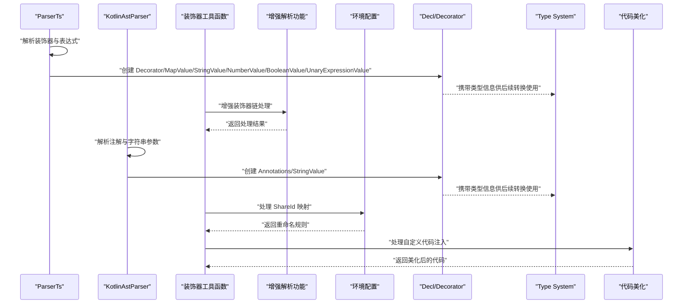

**图表来源**
- [lang/ts/parser_ts.py](file://lang/ts/parser_ts.py#L42-L91)
- [lang/ts/parser_ts.py](file://lang/ts/parser_ts.py#L162-L177)
- [lang/kt/kt_parser.py](file://lang/kt/kt_parser.py#L59-L90)
- [convert/decorators.py](file://convert/decorators.py#L1-L41)
- [convert/env.py](file://convert/env.py#L53-L108)
- [convert/pretty.py](file://convert/pretty.py#L8-L97)

## 详细组件分析

### Decorator 类与装饰器参数类型系统
Decorator 是装饰器的核心容器，承载装饰器名称与参数列表。其参数类型在 TypeScript 侧通过 TsValue 及其子类统一建模，在 Kotlin 侧通过 KtValue 及其子类建模。

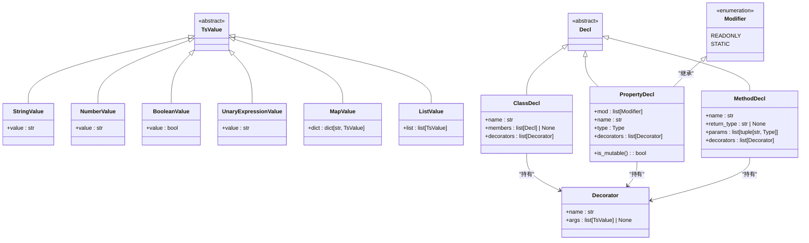

**图表来源**
- [lang/ts/decls.py](file://lang/ts/decls.py#L4-L122)

**章节来源**
- [lang/ts/decls.py](file://lang/ts/decls.py#L4-L122)

### TypeScript 侧装饰器解析与验证流程
ParserTs 负责从 TypeScript 源码中解析装饰器与表达式，生成对应的装饰器参数对象。解析流程如下：
- 解析装饰器：读取 @ 符号后，解析装饰器名称；若存在括号则解析逗号分隔的表达式序列
- **新增** 解析修饰符：支持 readonly 和 static 修饰符的解析与存储
- 表达式解析：根据节点类型选择字符串字面量、数值字面量、布尔字面量、一元表达式或对象字面量
- 对象字面量解析：解析键值对，键为标识符，值为表达式，最终封装为 MapValue
- **新增** 多装饰器链处理：支持多个装饰器的连续解析和验证

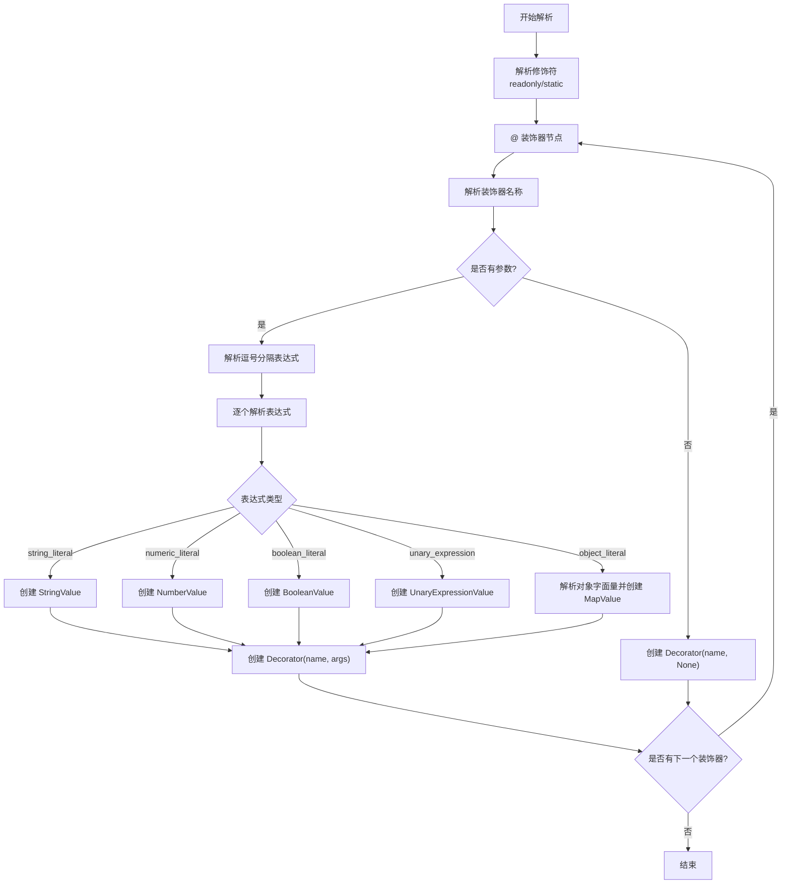

**图表来源**
- [lang/ts/parser_ts.py](file://lang/ts/parser_ts.py#L42-L91)
- [lang/ts/parser_ts.py](file://lang/ts/parser_ts.py#L162-L177)

**章节来源**
- [lang/ts/parser_ts.py](file://lang/ts/parser_ts.py#L42-L91)
- [lang/ts/parser_ts.py](file://lang/ts/parser_ts.py#L162-L177)

### Kotlin 侧装饰器解析与注解映射
KotlinAstParser 将 Kotlin 注解解析为 Annotations，仅在当前用例下提取字符串参数。解析流程如下：
- 解析注解节点：提取构造调用中的用户类型作为注解名称
- 解析值参数：遍历 value_argument，优先解析字符串字面量，否则回退为原始文本
- 生成 Annotations：包含注解名与字符串参数列表

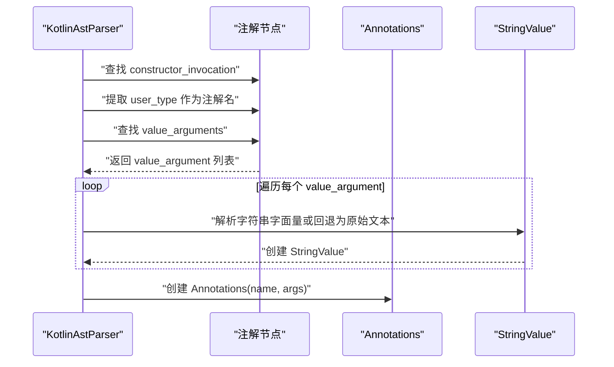

**图表来源**
- [lang/kt/kt_parser.py](file://lang/kt/kt_parser.py#L59-L90)
- [lang/kt/kt_parser.py](file://lang/kt/kt_parser.py#L102-L135)

**章节来源**
- [lang/kt/kt_parser.py](file://lang/kt/kt_parser.py#L59-L90)
- [lang/kt/kt_parser.py](file://lang/kt/kt_parser.py#L102-L135)

### 类型系统与值处理机制
- TypeScript 类型系统：Type 抽象基类及多种具体类型（如 StringType、NumberType、BooleanType、NullableType、UnionType、AppType、QualifiedType 等），用于描述 ArkTS 类型签名与组合关系
- Kotlin 类型系统：Type 抽象基类及多种具体类型（如 PrimType、NullableType、RefType、ArrayType、AppType、QualifiedType 等），配合字符串解析器解析复杂类型
- 值处理：TsValue/KtValue 分别承载装饰器参数，确保在跨语言转换时具备一致的元数据结构

**章节来源**
- [lang/ts/ts_types.py](file://lang/ts/ts_types.py#L8-L280)
- [lang/kt/kt_types.py](file://lang/kt/kt_types.py#L52-L191)
- [lang/kt/type_parser.py](file://lang/kt/type_parser.py#L68-L151)

### 使用示例与参数传递场景
- TypeScript 示例：装饰器参数为对象字面量，包含模块路径、导出开关与重命名等键值
- Kotlin 示例：注解参数为字符串字面量，支持 expect/actual 场景下的字段标注

**章节来源**
- [test/cases/class8.ts](file://test/cases/class8.ts#L1-L13)
- [test/cases/kt/class2.kt](file://test/cases/kt/class2.kt#L1-L22)

## 装饰器调用表达式支持

### 增强的表达式解析
系统现已支持装饰器调用表达式的解析，包括：
- 字面量表达式：字符串、数值、布尔值的直接解析
- **新增** 一元表达式：支持一元运算符表达式作为装饰器参数
- 对象表达式：支持嵌套的对象字面量和复杂参数结构
- 多级参数访问：通过 get_value_from_ts_value 支持深度参数提取

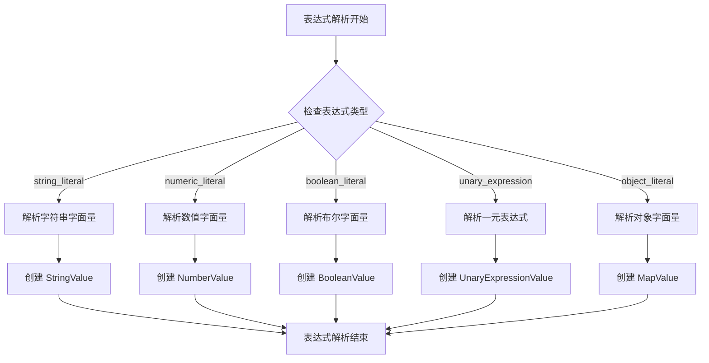

**图表来源**
- [lang/ts/parser_ts.py](file://lang/ts/parser_ts.py#L42-L67)

### 多装饰器链处理机制
系统支持多个装饰器的串联处理，包括：
- 装饰器链解析：逐个解析并验证装饰器的有效性
- 参数链处理：支持装饰器参数的链式访问和提取
- 错误处理：提供详细的装饰器解析错误信息

**章节来源**
- [lang/ts/parser_ts.py](file://lang/ts/parser_ts.py#L86-L91)
- [convert/decorators.py](file://convert/decorators.py#L5-L36)

## 多装饰器链处理机制

### 装饰器链解析流程
系统采用链式解析机制处理多个装饰器：
- 逐个装饰器解析：遍历装饰器列表，逐一解析每个装饰器
- 装饰器验证：检查装饰器名称和参数的有效性
- 参数提取：支持多级参数访问和嵌套结构提取

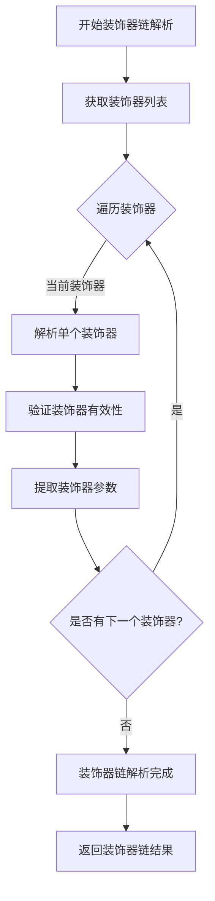

**图表来源**
- [lang/ts/parser_ts.py](file://lang/ts/parser_ts.py#L86-L91)
- [convert/decorators.py](file://convert/decorators.py#L21-L31)

### 装饰器工具函数增强
新增的工具函数支持更复杂的装饰器处理：
- get_decorator：从装饰器列表中查找指定名称的装饰器
- get_value_from_ts_value：支持多级参数访问的值提取
- get_decorators_value：结合装饰器查找和值提取的综合函数
- get_decorator_value：针对单个装饰器的参数提取

**章节来源**
- [convert/decorators.py](file://convert/decorators.py#L5-L36)

## 装饰器参数解析增强

### 嵌套参数处理
系统现已支持嵌套参数结构的解析和处理：
- 深度参数访问：通过键路径访问嵌套的装饰器参数
- 类型安全检查：确保参数访问的类型安全性
- 错误处理：提供详细的参数解析错误信息

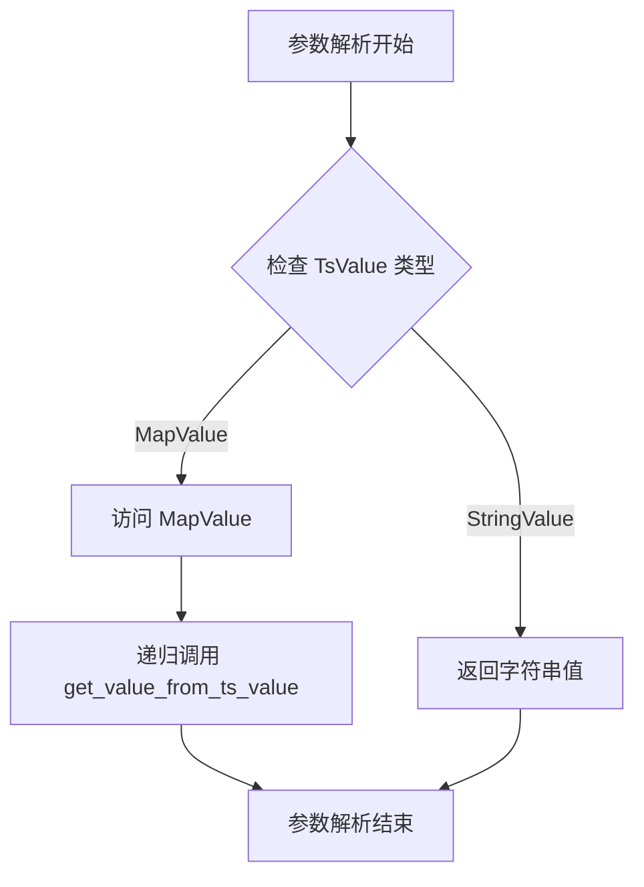

**图表来源**
- [convert/decorators.py](file://convert/decorators.py#L12-L18)

### 参数验证机制
增强的参数验证机制包括：
- 装饰器存在性检查：验证装饰器是否存在于装饰器列表中
- 参数类型验证：确保参数类型与预期类型匹配
- 嵌套结构验证：支持复杂嵌套参数结构的验证

**章节来源**
- [convert/decorators.py](file://convert/decorators.py#L34-L40)

## 属性声明可变性检查

### is_mutable() 方法设计
PropertyDecl 类新增了 is_mutable() 方法，用于判断属性声明的可变性。该方法基于修饰符集合进行判断，遵循以下规则：
- 如果属性标记为 readonly，则不可变
- 如果属性标记为 static，则不可变
- 否则为可变属性

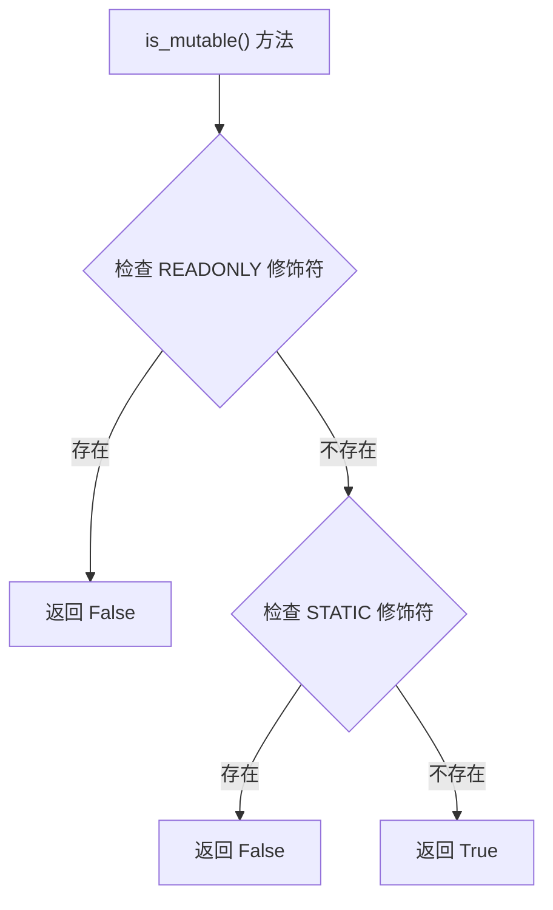

**图表来源**
- [lang/ts/decls.py](file://lang/ts/decls.py#L115-L116)

### 可变性检查在转换流程中的应用
在声明转换过程中，is_mutable() 方法被广泛应用于以下场景：

#### 字段生成转换
在 convert_prop() 函数中，根据属性的可变性决定生成 val 或 var：
- 可变属性：生成 Kotlin var 声明和 getter/setter
- 不可变属性：生成 Kotlin val 声明和只读 getter

#### 代理对象转换
在 convert_proxy_to_from_real_function() 中，仅处理可变字段的代理转换：
- 可变字段：生成 Proxy <-> Real 对象之间的双向赋值代码
- 不可变字段：发出警告并跳过转换

#### 字段信息获取
在 get_prop_info() 函数中，综合多种因素确定字段的可变性：
- Kotlin 字段本身的可变性（PropertyModifier.VAR）
- TypeScript 属性的 readonly 修饰符
- 装饰器中显式的 mutable 参数

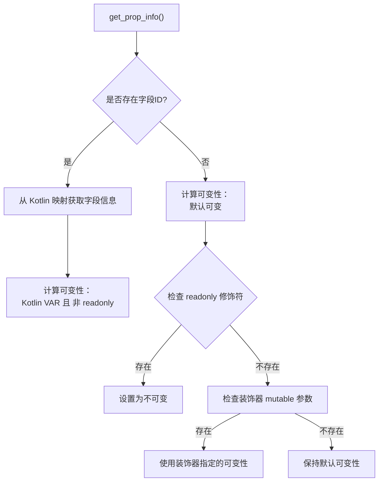

**图表来源**
- [convert/decls.py](file://convert/decls.py#L249-L261)
- [convert/decls.py](file://convert/decls.py#L345-L361)
- [convert/decls.py](file://convert/decls.py#L363-L373)

**章节来源**
- [lang/ts/decls.py](file://lang/ts/decls.py#L115-L116)
- [convert/decls.py](file://convert/decls.py#L249-L261)
- [convert/decls.py](file://convert/decls.py#L345-L361)
- [convert/decls.py](file://convert/decls.py#L363-L373)

### 测试用例与实际应用场景
测试文件展示了 readonly 和 static 修饰符的实际使用：

#### readonly 修饰符测试
在 test/cases/class7.ts 中，readonly 修饰符用于声明不可变属性：
- `static readonly field12 : number;` - 静态只读字段
- `readonly field14 : number;` - 实例只读字段

这些字段在转换为 Kotlin 时会被识别为不可变属性，不会生成 setter 方法。

#### 可变性检查的实际效果
通过 is_mutable() 方法，系统能够：
- 正确识别 readonly 属性并跳过不必要的转换
- 在代理对象转换中仅处理可变字段
- 提供清晰的警告信息，帮助开发者理解转换行为

**章节来源**
- [test/cases/class7.ts](file://test/cases/class7.ts#L16-L21)
- [convert/decls.py](file://convert/decls.py#L363-L373)

## 自定义代码注入功能

### 自定义代码注入概述
系统新增了强大的自定义代码注入功能，允许开发者在转换过程中插入自定义的 Kotlin 代码。该功能通过装饰器参数实现，支持类级别和字段级别的代码注入。

### 支持的自定义代码类型
- **custom_code**：类级别的自定义代码注入，支持多行字符串代码块
- **custom_getter**：字段 getter 方法的自定义实现
- **custom_setter**：字段 setter 方法的自定义实现

### 代码注入处理流程
系统通过以下步骤处理自定义代码注入：

1. **解析装饰器参数**：从装饰器中提取 custom_code、custom_getter、custom_setter 参数
2. **多行字符串处理**：使用 multi_line_str_to_kt_node 将多行字符串转换为嵌套的 KtNode 结构
3. **代码美化**：通过 pretty_print_kt_node 进行代码格式化和缩进处理
4. **代码注入**：将处理后的代码注入到生成的 Kotlin 类中

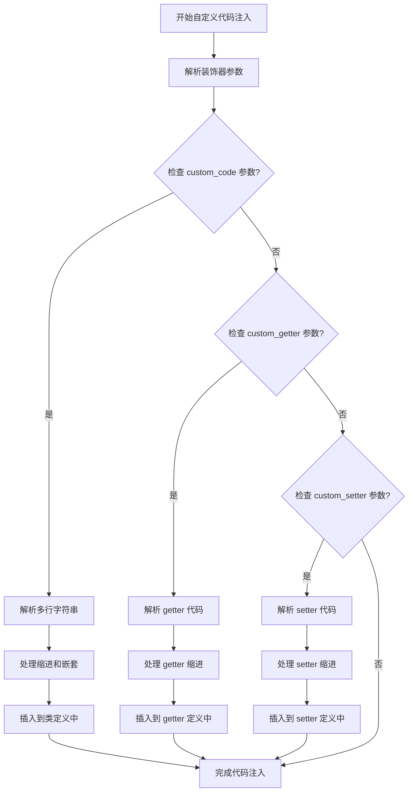

**图表来源**
- [convert/decls.py](file://convert/decls.py#L266-L271)
- [convert/decls.py](file://convert/decls.py#L297-L302)
- [convert/pretty.py](file://convert/pretty.py#L8-L97)

### 代码注入示例
在 test/cases/class11.ts 中展示了自定义代码注入的使用：

```typescript
@ExportClass({name : "ClassName0", package: 'bd.dy',
            custom_code: `
            line1
                line2
                line3
                    line4`})
class ClassNameTs0 {
    @ExportField({custom_getter: `
            line1
                line2
                line3
                    line4`})
    field3? : number; // this is comment
}
```

### 多行字符串处理机制
系统使用 multi_line_str_to_kt_node 函数处理多行字符串，该函数具有以下特性：
- 忽略首尾空白行
- 移除公共前导缩进
- 从前导空格推断缩进层级
- 任何缩进增加都被视为恰好更深一层嵌套
- dedent 必须与先前看到的缩进宽度完全匹配

**章节来源**
- [convert/decls.py](file://convert/decls.py#L266-L271)
- [convert/decls.py](file://convert/decls.py#L297-L302)
- [convert/pretty.py](file://convert/pretty.py#L8-L97)
- [test/cases/class11.ts](file://test/cases/class11.ts#L1-L14)

## ShareId 功能集成

### ShareId 概述
ShareId 是装饰器系统的新功能，用于实现 ArkTS 与 Kotlin 类之间的智能映射。通过 @id 装饰器与 ShareClass/ShareField 注解的协同工作，系统可以自动识别和重命名具有相同 ShareId 的类和字段。

### ShareId 处理流程
系统通过以下步骤处理 ShareId：

1. **收集 Kotlin 类映射**：扫描 Kotlin 源文件，提取带有 ShareClass 注解的类及其 ID
2. **建立 ID 到类的映射**：将 ShareId 与对应的 Kotlin 类关联
3. **应用类重命名规则**：当 ArkTS 类具有匹配的 ShareId 时，自动重命名为 Kotlin 类名 + Proxy
4. **字段级映射**：通过 ShareField 注解实现字段级别的精确映射

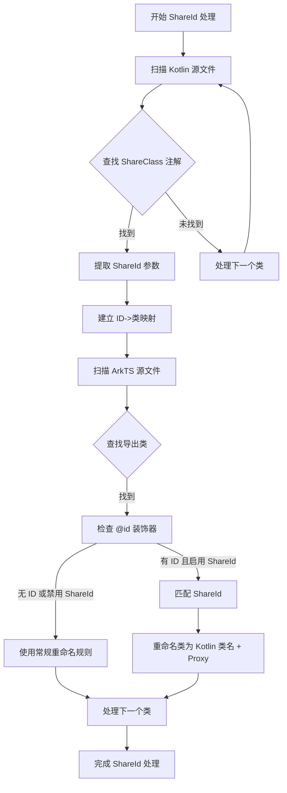

**图表来源**
- [convert/env.py](file://convert/env.py#L50-L68)
- [convert/env.py](file://convert/env.py#L136-L157)

### ShareId 配置与使用
ShareId 功能通过命令行参数 `--enableShareId` 控制，默认为禁用状态。启用后，系统会：
- 自动扫描 Kotlin 源文件中的 ShareClass 注解
- 建立 ShareId 到 Kotlin 类的映射关系
- 应用到 ArkTS 类的重命名决策中

**章节来源**
- [convert/env.py](file://convert/env.py#L50-L68)
- [convert/env.py](file://convert/env.py#L136-L157)
- [main.py](file://main.py#L12-L25)
- [utils/cmd_args.py](file://utils/cmd_args.py#L40-L46)

## 命令行参数配置

### 参数详解
系统提供 `--enableShareId` 命令行参数来控制 ShareId 功能的启用状态：

- **参数名称**：`--enableShareId`
- **类型**：布尔值
- **默认值**：False
- **作用**：启用或禁用 ShareId 功能
- **使用场景**：需要 ArkTS 与 Kotlin 类进行智能映射时启用

### 参数解析与验证
命令行参数通过 `utils/cmd_args.py` 中的 `parse_args` 函数解析和验证：

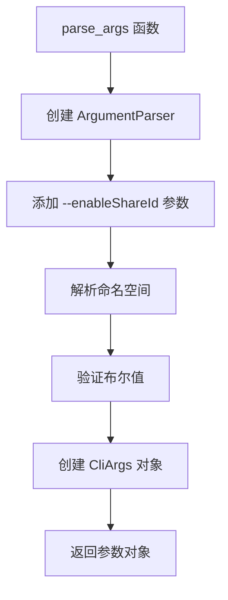

**图表来源**
- [utils/cmd_args.py](file://utils/cmd_args.py#L16-L63)

**章节来源**
- [utils/cmd_args.py](file://utils/cmd_args.py#L16-L63)
- [main.py](file://main.py#L12-L25)

## 依赖关系分析
装饰器系统在各模块间的耦合与协作如下：
- ParserTs 依赖 TsValue/Decorator/Type 等声明与类型定义
- KotlinAstParser 依赖 KtValue/Annotations/Type 等声明与类型定义
- **新增** 装饰器工具函数依赖装饰器模型进行值提取和验证，支持增强的解析功能
- **新增** 环境配置依赖 Kotlin 源文件和装饰器工具函数进行 ShareId 处理
- **新增** 主程序依赖命令行参数解析和环境配置进行功能控制
- **新增** 声明转换模块依赖 PropertyDecl.is_mutable() 方法进行可变性检查
- **新增** 代码美化模块依赖多行字符串处理函数进行代码格式化
- 两者均通过 Decl 抽象统一承载元数据，便于后续转换与生成目标语言代码

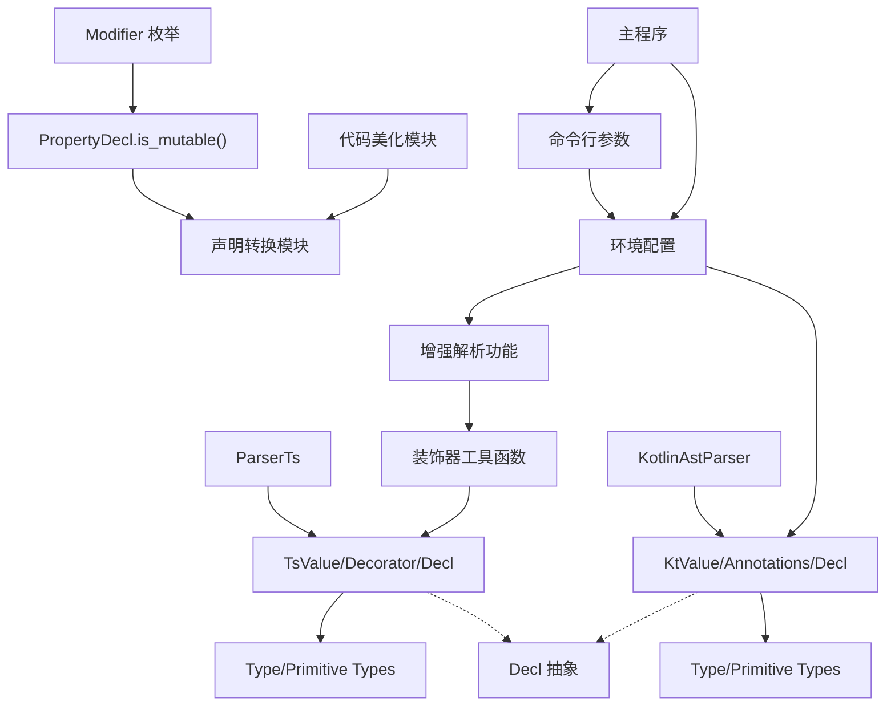

**图表来源**
- [lang/ts/parser_ts.py](file://lang/ts/parser_ts.py#L42-L91)
- [lang/ts/decls.py](file://lang/ts/decls.py#L4-L122)
- [lang/kt/kt_parser.py](file://lang/kt/kt_parser.py#L59-L90)
- [convert/decorators.py](file://convert/decorators.py#L1-L41)
- [convert/env.py](file://convert/env.py#L1-L141)
- [convert/decls.py](file://convert/decls.py#L1-L580)
- [convert/pretty.py](file://convert/pretty.py#L1-L113)
- [utils/cmd_args.py](file://utils/cmd_args.py#L1-L76)
- [main.py](file://main.py#L1-L36)

**章节来源**
- [lang/ts/parser_ts.py](file://lang/ts/parser_ts.py#L42-L91)
- [lang/kt/kt_parser.py](file://lang/kt/kt_parser.py#L59-L90)
- [lang/ts/decls.py](file://lang/ts/decls.py#L4-L122)
- [lang/kt/kt_decls.py](file://lang/kt/kt_decls.py#L1-L57)
- [convert/decorators.py](file://convert/decorators.py#L1-L41)
- [convert/env.py](file://convert/env.py#L1-L141)
- [convert/decls.py](file://convert/decls.py#L1-L580)
- [convert/pretty.py](file://convert/pretty.py#L1-L113)
- [utils/cmd_args.py](file://utils/cmd_args.py#L1-L76)
- [main.py](file://main.py#L1-L36)

## 性能考虑
- 解析器采用基于树游走的流式解析，时间复杂度与源码长度线性相关
- 表达式解析按需展开子节点，避免不必要的递归开销
- 类型系统通过不可变数据类（dataclass/frozen）减少运行时状态管理成本
- **新增** 装饰器工具函数采用高效的查找和验证算法，支持 O(1) 装饰器查找
- **新增** 多装饰器链处理采用迭代而非递归，避免深度嵌套导致的栈溢出
- **新增** ShareId 处理采用哈希映射优化查找性能
- **新增** 可变性检查 is_mutable() 方法采用简单的布尔运算，性能开销极小
- **新增** 多行字符串处理使用高效的缩进推断算法，支持大段代码的快速处理
- **更新** 类型安全性增强：get_ts_string_value() 函数的 None 值处理减少了不必要的类型检查开销
- 建议在大规模转换场景中缓存解析结果与类型映射，以降低重复解析成本

## 故障排除指南
- 装饰器语法错误：检查 @ 符号后的标识符与括号配对是否正确
- 表达式类型不匹配：确认字面量类型与期望的 TsValue 子类一致
- Kotlin 注解参数非字符串：当前实现仅提取字符串字面量，非字符串参数会回退为原始文本
- 类型解析异常：核对 Kotlin 类型字符串格式，确保泛型、数组与可空修饰符书写正确
- **新增** 装饰器链解析失败：检查装饰器列表的格式和语法正确性
- **新增** 多级参数访问错误：验证键路径的正确性和参数类型的安全性
- **新增** ShareId 映射失败：检查 Kotlin 源文件中 ShareClass 注解的参数是否正确
- **新增** 类重命名异常：确认 ArkTS 类的 @id 装饰器与 Kotlin 类的 ShareId 是否匹配
- **新增** 命令行参数错误：验证 `--enableShareId` 参数的布尔值格式
- **新增** 可变性检查异常：确认 readonly 和 static 修饰符的使用是否符合预期
- **新增** 自定义代码注入失败：检查多行字符串的缩进格式和代码语法
- **更新** 类型安全性问题：如果遇到 get_ts_string_value() 的 TypeError，请检查传入的 TsValue 类型是否为 StringValue 或 None

**章节来源**
- [lang/ts/parser_ts.py](file://lang/ts/parser_ts.py#L42-L91)
- [lang/kt/kt_parser.py](file://lang/kt/kt_parser.py#L59-L90)
- [lang/kt/type_parser.py](file://lang/kt/type_parser.py#L68-L151)
- [convert/decorators.py](file://convert/decorators.py#L12-L18)
- [convert/env.py](file://convert/env.py#L53-L108)
- [convert/decls.py](file://convert/decls.py#L115-L116)
- [convert/pretty.py](file://convert/pretty.py#L8-L97)
- [utils/cmd_args.py](file://utils/cmd_args.py#L40-L46)

## 结论
装饰器系统通过统一的声明模型与类型系统，为 ArkTS 与 Kotlin 的跨语言互操作提供了清晰的元数据承载方式。**新增的装饰器调用表达式支持**和**多装饰器链处理机制**进一步增强了系统的灵活性和表达能力。**新增的属性声明可变性检查功能**通过 PropertyDecl.is_mutable() 方法，为开发者提供了精确的属性可变性控制，确保在转换过程中正确处理只读和静态属性。

**新增的自定义代码注入功能**为系统提供了强大的扩展能力，允许开发者在转换过程中插入自定义的 Kotlin 代码，满足复杂的业务需求。**新增** 的 ShareId 功能进一步增强了系统的智能化水平，通过 @id 装饰器与 ShareClass/ShareField 注解的协同工作，实现了 ArkTS 与 Kotlin 类之间的自动映射和重命名。配合命令行参数控制，系统能够在不同场景下灵活切换处理模式，满足多样化的跨语言互操作需求。

**更新的类型安全性增强**体现在 get_ts_string_value() 函数的改进上，现在该函数能够安全地处理 None 值输入并返回 Optional[str] 类型，这大大提升了装饰器参数处理的健壮性，减少了运行时错误的可能性。TsValue/KtValue 的参数类型抽象与 Decorator/Annotations 的容器化设计，使得装饰器参数在解析、验证与转换阶段保持一致性。结合完善的解析流程与类型识别，系统能够稳定地支持复杂参数场景与多语言注解映射。

## 附录
- 关键实现参考路径
  - TypeScript 装饰器解析：[lang/ts/parser_ts.py](file://lang/ts/parser_ts.py#L42-L91)
  - TypeScript 表达式解析：[lang/ts/parser_ts.py](file://lang/ts/parser_ts.py#L162-L177)
  - Kotlin 注解解析：[lang/kt/kt_parser.py](file://lang/kt/kt_parser.py#L59-L90)
  - Kotlin 类型解析：[lang/kt/type_parser.py](file://lang/kt/type_parser.py#L68-L151)
  - 声明与装饰器模型：[lang/ts/decls.py](file://lang/ts/decls.py#L4-L122)、[lang/kt/kt_decls.py](file://lang/kt/kt_decls.py#L1-L57)
  - 类型系统：[lang/ts/ts_types.py](file://lang/ts/ts_types.py#L8-L280)、[lang/kt/kt_types.py](file://lang/kt/kt_types.py#L52-L191)
  - **新增** 装饰器工具函数：[convert/decorators.py](file://convert/decorators.py#L1-L41)
  - **新增** 环境配置与 ShareId 处理：[convert/env.py](file://convert/env.py#L1-L141)
  - **新增** 声明转换与可变性检查：[convert/decls.py](file://convert/decls.py#L1-L580)
  - **新增** 代码美化与多行字符串处理：[convert/pretty.py](file://convert/pretty.py#L1-L113)
  - **新增** 命令行参数解析：[utils/cmd_args.py](file://utils/cmd_args.py#L1-L76)
  - **新增** 主程序集成：[main.py](file://main.py#L1-L36)
  - **更新** 类型安全性增强：[lang/ts/decls.py](file://lang/ts/decls.py#L41-L47)