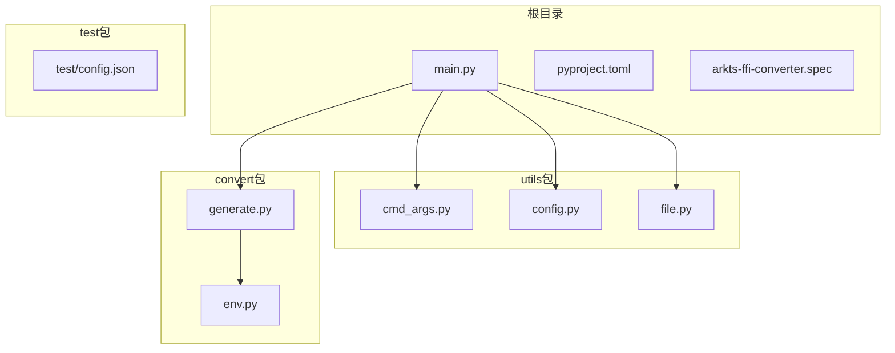
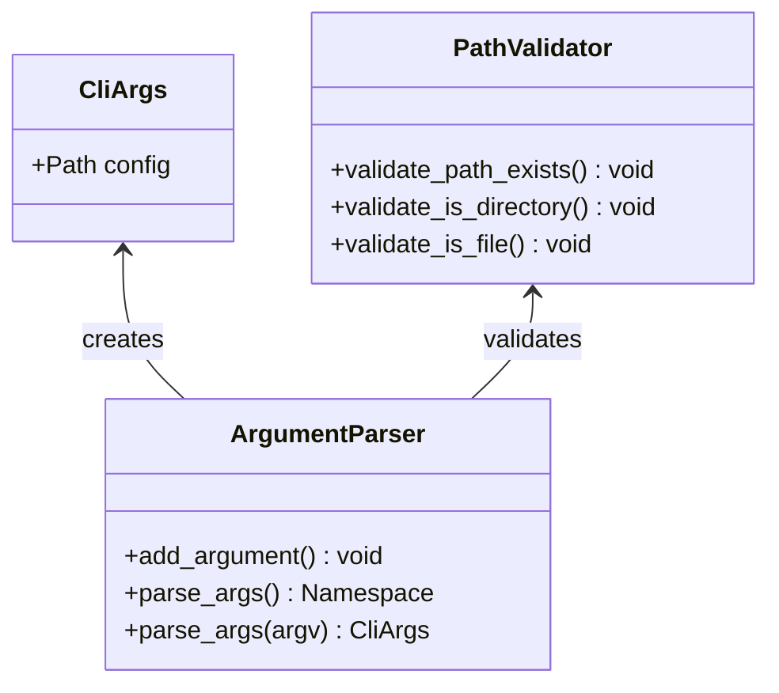
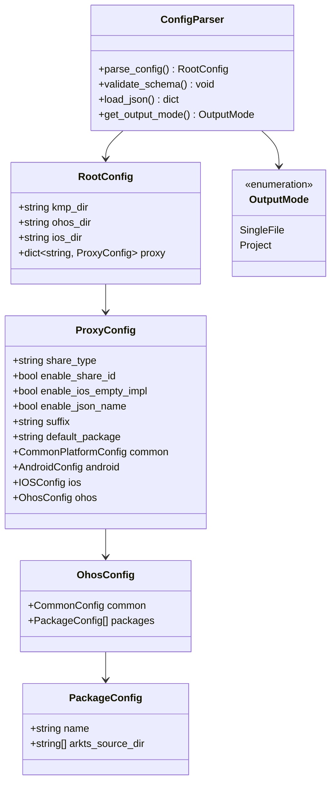
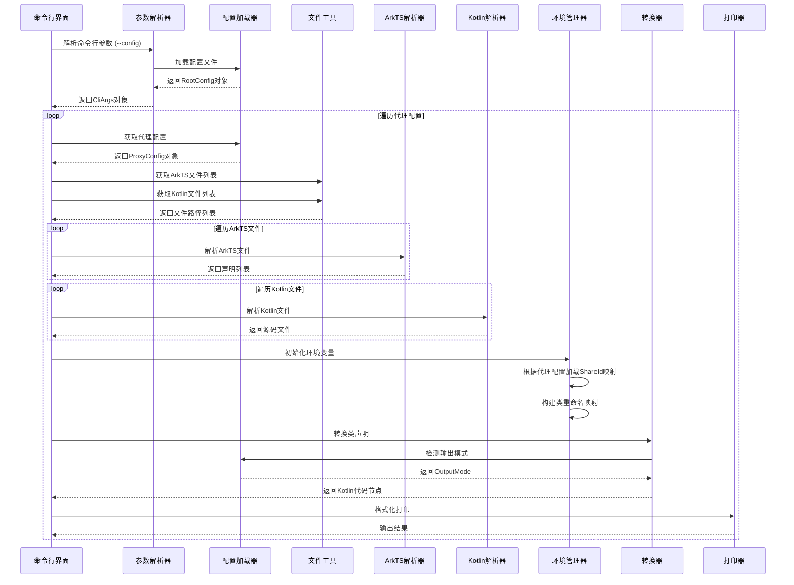
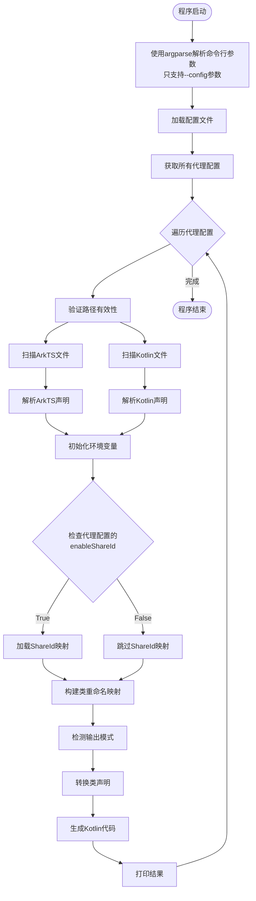
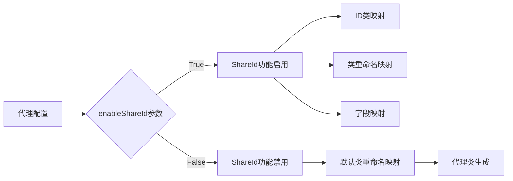
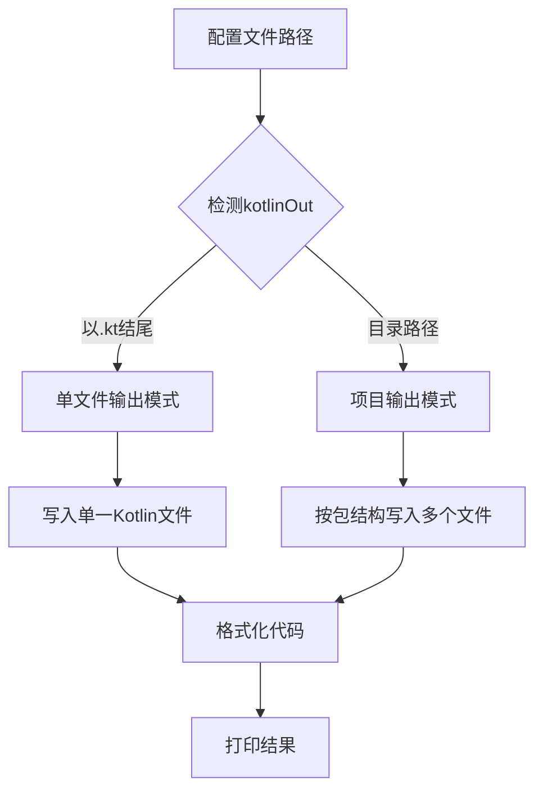
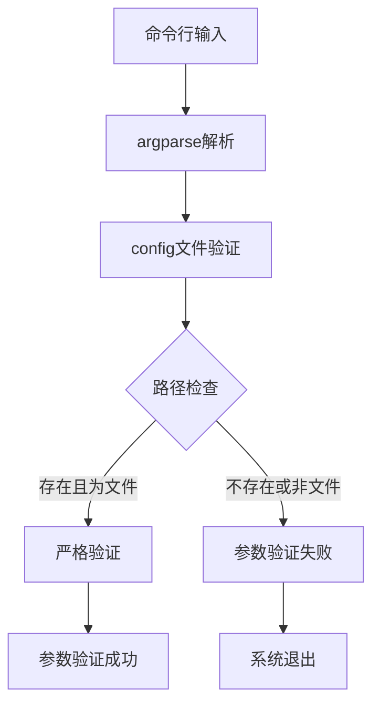
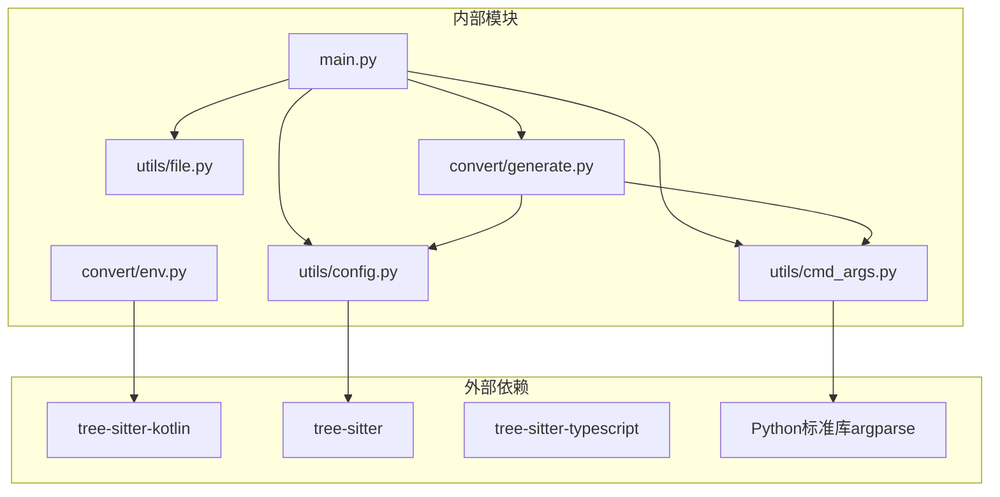

# 命令行界面

<cite>
**本文档引用的文件**
- [main.py](file://main.py)
- [cmd_args.py](file://utils/cmd_args.py)
- [config.py](file://utils/config.py)
- [env.py](file://convert/env.py)
- [file.py](file://utils/file.py)
- [generate.py](file://convert/generate.py)
- [pyproject.toml](file://pyproject.toml)
- [config.json](file://test/config.json)
- [arkts-ffi-converter.spec](file://arkts-ffi-converter.spec)
</cite>

## 更新摘要
**变更内容**
- 完全移除了kmp_dir、ohos_dir、enableShareId等命令行参数
- CLI现在完全依赖配置文件进行所有配置
- 新增了复杂的多代理配置系统
- ShareId功能现在在配置文件中控制
- 更新了使用指南和配置文件格式说明
- 增强了故障排除指南以反映新的配置系统

## 目录
1. [简介](#简介)
2. [使用指南](#使用指南)
3. [命令行参数](#命令行参数)
4. [配置文件格式](#配置文件格式)
5. [环境要求](#环境要求)
6. [编译/打包指南](#编译打包指南)
7. [项目结构](#项目结构)
8. [核心组件](#核心组件)
9. [架构概览](#架构概览)
10. [详细组件分析](#详细组件分析)
11. [依赖关系分析](#依赖关系分析)
12. [性能考虑](#性能考虑)
13. [故障排除指南](#故障排除指南)
14. [结论](#结论)

## 简介

这是一个用于从ArkTS声明生成Kotlin包装器的命令行工具。该工具通过解析ArkTS和Kotlin源代码，识别带有特定装饰器的类和属性，并生成相应的Kotlin代理类代码。

**重大更新**：CLI现在完全依赖配置文件进行所有配置，移除了传统的命令行参数。配置文件支持复杂的多代理系统，允许同时处理多个不同的转换配置。

主要功能包括：
- 解析ArkTS文件中的导出类声明
- 解析Kotlin源代码中的类定义
- 识别带有装饰器的导出声明
- 生成Kotlin代理类代码
- 支持配置文件管理
- **新增**：多代理配置系统，支持不同平台和用途的配置分离
- **新增**：ShareId功能的集中式配置管理

## 使用指南

### 基本用法

```bash
./arkts-ffi-converter --config /path/to/config.json
```

### 常用场景

1. **基础转换**：使用配置文件进行ArkTS到Kotlin的基本转换
```bash
./arkts-ffi-converter --config ./config.json
```

2. **多代理配置**：同时处理多个不同的转换需求
```bash
./arkts-ffi-converter --config ./multi_proxy_config.json
```

3. **自定义配置**：使用自定义配置文件
```bash
./arkts-ffi-converter --config ./custom_config.json
```

**章节来源**
- [main.py](file://main.py#L12-L24)

## 命令行参数

**重大更新**：CLI现在只支持一个参数，完全依赖配置文件进行配置。

| 参数 | 必需 | 类型 | 默认值 | 描述 |
|------|------|------|--------|------|
| `--config` | ✅ | 路径 | `test/config.json` | 配置文件路径 |

### 参数详细说明

**`--config`**
- **必需**：是
- **类型**：路径
- **默认值**：`test/config.json`
- **描述**：指定配置文件的路径
- **验证**：必须是存在的文件

**章节来源**
- [cmd_args.py](file://utils/cmd_args.py#L13-L35)

## 配置文件格式

**重大更新**：配置文件格式已大幅扩展，支持复杂的多代理系统和平台特定配置。

配置文件采用JSON格式，定义转换规则和输出设置：

```json
{
  "kmp.dir": "/absolute/path/to/kmp/project",
  "ohos.dir": "/absolute/path/to/ohos/project", 
  "ios.dir": "/absolute/path/to/ios/project",
  "proxy": {
    "har_demo_example1": {
      "shareType": "proxy",
      "enableShareId": true,
      "enableIosEmptyImpl": true,
      "enableJsonName": true,
      "suffix": "KMP",
      "defaultPackage": "com.bd.kmp.infra.ffi.demo",
      "android": {
        "srcDir": ["./src/androidMain/kotlin"]
      },
      "common": {
        "kotlinOut": "./src/commonMain/kotlin/auto_gen_ffi_proxy_example1",
        "entityDir": {
          "commonMain": ["./src/commonMain/kotlin/auto_gen_ffi_proxy_example1"],
          "ohosArm64Main": ["./src/ohosArm64Main/kotlin/auto_gen_ffi_proxy_example1"]
        }
      },
      "ohos": {
        "common": {
          "kotlinOut": "./demo/har_demo/src/ohosArm64Main/kotlin/auto_gen_ffi_proxy_example1",
          "import": ["bigint.test.BigIntTestInterfaceCommon"]
        },
        "packages": {
          "@kmp/basic_ability": {
            "arktsSrcDir": [""]
          }
        }
      },
      "ios": {
        "common": {
          "kotlinOut": "./demo/har_demo/src/ohosArm64Main/kotlin/auto_gen_ffi_proxy_example2"
        }
      }
    }
  }
}
```

### 配置项说明

**顶层配置项**
- `kmp.dir`：KMP项目根目录路径
- `ohos.dir`：OHOS项目根目录路径（可选）
- `ios.dir`：iOS项目根目录路径（可选）
- `proxy`：代理配置对象，支持多个不同的转换配置

**代理配置 (`proxy` 对象)**
- **键**：代理名称（如 `"har_demo_example1"`）
- **值**：代理配置对象，包含：
  - `shareType`：共享类型，必须是 `"proxy"` 或 `"copy"`
  - `enableShareId`：启用ShareId功能（可选，默认 `false`）
  - `enableIosEmptyImpl`：启用iOS空实现（可选，默认 `false`）
  - `enableJsonName`：启用JSON名称映射（可选，默认 `false`）
  - `suffix`：代理类后缀（可选，默认 `"Proxy"`）
  - `defaultPackage`：默认包名（可选，默认空字符串）
  - `android`：Android特定配置（可选）
  - `common`：通用配置
  - `ohos`：OHOS特定配置
  - `ios`：iOS特定配置

**平台特定配置**

**`android` 配置**
- `srcDir`：Android源代码目录数组

**`common` 配置**
- `kotlinOut`：通用Kotlin输出目录
- `entityDir`：实体目录配置（可选）
  - `commonMain`：Common Main目录数组
  - `ohosArm64Main`：OHOS ARM64 Main目录数组

**`ohos` 配置**
- `common`：OHOS通用配置
  - `kotlinOut`：OHOS Kotlin输出目录
  - `import`：导入语句数组（可选）
- `packages`：包配置对象
  - 键：包名（如 `"@kmp/basic_ability"`）
  - 值：包配置对象，包含 `arktsSrcDir` 数组

**输出模式检测**

工具会根据配置文件中的 `kotlinOut` 字段自动判断输出模式：

- **单文件模式**：当 `kotlinOut` 以 `.kt` 结尾时启用
- **项目模式**：当 `kotlinOut` 为目录路径时启用

**章节来源**
- [config.py](file://utils/config.py#L124-L293)
- [config.json](file://test/config.json#L1-L41)

## 环境要求

### 开发环境

- **Python**：>= 3.13
- **Poetry**：>= 1.5.0
- **操作系统**：macOS（推荐）或 Linux/Windows

### 运行环境

- **无需Python环境**：使用打包后的二进制文件
- **macOS**：10.13+ (Intel/Apple Silicon)
- **Linux**：兼容
- **Windows**：兼容（需相应平台的打包版本）

### 依赖项

项目核心依赖：
- `tree-sitter` >= 0.25.2：语法解析引擎
- `tree-sitter-kotlin` >= 1.1.0：Kotlin语法解析器
- `tree-sitter-typescript` >= 0.23.2：TypeScript语法解析器
- `typing-extensions` >= 4.12.2：类型提示扩展

**章节来源**
- [pyproject.toml](file://pyproject.toml#L15-L21)

## 编译/打包指南

### 1. 准备开发环境

```bash
# 克隆项目
git clone <repository-url>
cd python-arkts-ffi-kt

# 安装 Poetry（如果尚未安装）
curl -sSL https://install.python-poetry.org | python3 -

# 安装项目依赖
poetry install

# 激活虚拟环境
poetry shell
```

### 2. 安装打包工具

```bash
# 在项目虚拟环境中安装 PyInstaller
pip install pyinstaller
```

### 3. 打包为独立二进制文件

#### macOS 打包（推荐配置）

```bash
# 清理之前的构建缓存
pyinstaller --clean arkts-ffi-converter.spec
```

### 4. 验证打包结果

```bash
# 检查生成的二进制文件
ls -la dist/arkts-ffi-converter

# 添加执行权限（macOS/Linux）
chmod +x dist/arkts-ffi-converter

# 测试运行
./dist/arkts-ffi-converter --help
```

### 5. 分发说明

打包后的二进制文件 `dist/arkts-ffi-converter` 是完全独立的，可以在没有Python环境的系统上运行。

**章节来源**
- [README.md](file://README.md#L36-L87)

## 项目结构



**图表来源**
- [main.py](file://main.py#L1-L33)
- [cmd_args.py](file://utils/cmd_args.py#L1-L49)
- [config.py](file://utils/config.py#L1-L366)
- [file.py](file://utils/file.py#L1-L32)
- [env.py](file://convert/env.py#L1-L164)
- [generate.py](file://convert/generate.py#L1-L164)

**章节来源**
- [main.py](file://main.py#L1-L33)
- [pyproject.toml](file://pyproject.toml#L1-L26)

## 核心组件

### 命令行参数处理

**重大更新**：命令行界面现在极其简化，只支持一个参数。

命令行界面通过重构后的 `argparse` 模块实现，现在只支持以下参数：

- `--config`: 配置文件路径，默认为 `test/config.json`

**更新** 参数解析现在使用 `argparse` 模块，提供了更好的参数验证和错误处理：



**图表来源**
- [cmd_args.py](file://utils/cmd_args.py#L8-L35)

### 配置管理系统

**重大更新**：配置系统已大幅扩展，支持复杂的多代理架构。

配置系统使用JSON格式，支持以下结构：

- `kmp.dir`: KMP项目根目录
- `ohos.dir`: OHOS项目根目录（可选）
- `ios.dir`: iOS项目根目录（可选）
- `proxy`: 代理配置对象，支持多个不同的转换配置

**新增** 多代理配置系统：每个代理配置包含完整的转换规则，支持不同平台和用途的分离



**图表来源**
- [config.py](file://utils/config.py#L66-L293)

**章节来源**
- [cmd_args.py](file://utils/cmd_args.py#L8-L35)
- [config.py](file://utils/config.py#L66-L293)
- [config.json](file://test/config.json#L1-L41)

## 架构概览



**图表来源**
- [main.py](file://main.py#L12-L24)
- [cmd_args.py](file://utils/cmd_args.py#L13-L35)
- [file.py](file://utils/file.py#L7-L32)
- [env.py](file://convert/env.py#L33-L164)
- [generate.py](file://convert/generate.py#L87-L164)

## 详细组件分析

### 主程序流程

**重大更新**：主程序现在遍历配置文件中的所有代理配置。

主程序执行以下步骤：

1. **参数解析**: 使用重构后的 `argparse` 解析命令行参数，只支持 `--config` 参数
2. **配置加载**: 读取并验证配置文件
3. **代理遍历**: 遍历配置文件中的所有代理配置
4. **文件扫描**: 递归查找ArkTS和Kotlin文件
5. **语法解析**: 分别解析ArkTS和Kotlin源代码
6. **环境初始化**: 根据每个代理配置的 `enableShareId` 参数决定是否加载ShareId映射
7. **类型映射**: 建立类和字段映射关系
8. **代码生成**: 转换并生成Kotlin代理类
9. **输出模式选择**: 根据配置自动选择单文件或项目输出模式
10. **结果输出**: 格式化打印生成的代码



**图表来源**
- [main.py](file://main.py#L12-L24)
- [env.py](file://convert/env.py#L58-L113)
- [config.py](file://utils/config.py#L112-L123)
- [generate.py](file://convert/generate.py#L87-L164)

**章节来源**
- [main.py](file://main.py#L12-L24)

### 环境管理器与ShareId功能

**重大更新**：环境管理器现在支持每个代理配置独立的ShareId设置。

环境管理器负责管理ShareId相关的映射关系，现在支持通过代理配置控制功能启用状态：

- `get_id_and_name_class_map()`: 从Kotlin源码中提取带`@ShareClass`注解的类及其ID映射
- `get_class_rename_map()`: 基于ArkTS装饰器和ShareId配置构建类重命名映射，受代理配置的 `enableShareId` 参数控制
- `get_kt_shared_class_field_name_map()`: 提取共享类的字段映射关系



**图表来源**
- [env.py](file://convert/env.py#L58-L113)

**章节来源**
- [env.py](file://convert/env.py#L33-L164)

### 输出模式选择系统

**新增** 输出模式选择系统根据配置文件中的 `kotlinOut` 字段自动判断输出模式：

- **单文件模式 (SingleFile)**: 当 `kotlinOut` 以 `.kt` 结尾时启用
- **项目模式 (Project)**: 当 `kotlinOut` 为目录路径时启用



**图表来源**
- [config.py](file://utils/config.py#L112-L123)
- [generate.py](file://convert/generate.py#L116-L164)

**章节来源**
- [config.py](file://utils/config.py#L112-L123)
- [generate.py](file://convert/generate.py#L116-L164)

### 参数验证系统

**更新** 新的参数验证系统提供了更严格的输入检查：

- 文件存在性验证：确保配置文件存在且可读
- 文件类型验证：验证配置文件为JSON格式
- 错误处理：提供清晰的错误消息和退出码



**图表来源**
- [cmd_args.py](file://utils/cmd_args.py#L30-L35)

**章节来源**
- [cmd_args.py](file://utils/cmd_args.py#L30-L35)

## 依赖关系分析



**图表来源**
- [pyproject.toml](file://pyproject.toml#L15-L21)
- [main.py](file://main.py#L1-L9)
- [cmd_args.py](file://utils/cmd_args.py#L1-L6)
- [generate.py](file://convert/generate.py#L1-L18)

**章节来源**
- [pyproject.toml](file://pyproject.toml#L15-L21)

## 性能考虑

### 并发处理建议

当前实现使用顺序处理方式，可以考虑以下优化：

1. **多线程文件扫描**: 使用concurrent.futures处理文件系统操作
2. **异步解析**: 对大型文件使用异步解析减少阻塞
3. **缓存机制**: 缓存已解析的AST以避免重复解析
4. **增量编译**: 只处理修改过的文件

### 内存优化

- 实现流式解析以减少内存占用
- 及时释放不再使用的AST节点
- 使用生成器模式处理大量数据

## 故障排除指南

### 常见问题及解决方案

**1. 配置文件路径错误**
- 检查`--config`参数是否指向有效文件
- 确保路径使用绝对路径或正确的相对路径
- 验证路径权限是否正确

**2. 配置文件格式错误**
- 验证JSON格式正确性
- 检查必需字段是否存在
- 确认导入语句格式正确
- **新增** 验证代理配置格式正确性

**3. 文件扩展名不匹配**
- ArkTS文件应为`.ets`或`.ts`扩展名
- Kotlin文件应为`.kt`扩展名

**4. 装饰器缺失**
- 确保ArkTS类使用`@ExportClass`装饰器
- 确保需要导出的字段使用`@ExportField`装饰器

**5. ShareId功能异常**
- **更新** ShareId功能现在在配置文件中控制
- 检查代理配置中的 `enableShareId` 参数
- 检查Kotlin类是否使用`@ShareClass`注解
- 验证ShareId字符串值是否匹配

**6. 参数解析错误**
- **更新** 现在只支持 `--config` 参数
- 确保配置文件路径正确
- 验证配置文件格式正确

**7. 输出模式错误**
- **新增** 检查配置文件中的 `kotlinOut` 字段
- 单文件模式必须以 `.kt` 结尾
- 项目模式必须为有效的目录路径

**8. 代理配置问题**
- **新增** 检查代理配置名称是否唯一
- 验证代理配置格式正确性
- 确认代理配置中的路径存在

**9. 环境配置问题**
- **新增** 确保Python版本 >= 3.13
- **新增** 验证Poetry安装和配置正确
- **新增** 检查tree-sitter相关依赖是否正确安装

**10. 打包和分发问题**
- **新增** 确保PyInstaller正确安装
- **新增** 验证spec文件配置正确
- **新增** 检查生成的二进制文件权限设置

**章节来源**
- [cmd_args.py](file://utils/cmd_args.py#L30-L35)
- [config.py](file://utils/config.py#L112-L123)
- [config.json](file://test/config.json#L1-L41)

## 结论

该命令行界面提供了一个完整的ArkTS到Kotlin代码生成解决方案。通过完全依赖配置文件的架构设计，实现了更灵活和强大的配置管理能力。

**重大更新**：CLI现在完全依赖配置文件，移除了传统的命令行参数，提供了更强大的配置管理能力。

主要优势：
- **极简的命令行接口**：只支持一个参数，简化了使用
- **强大的配置系统**：支持复杂的多代理配置和平台特定设置
- **灵活的输出模式**：自动检测单文件输出或项目输出模式
- **ShareId功能集中管理**：通过配置文件控制ShareId功能
- **基于Tree-Sitter的高性能语法解析**
- **完善的装饰器支持**确保精确的导出控制
- **清晰的类型转换机制**保证类型安全
- **详细的使用指南和配置说明**
- **完整的环境要求和依赖项说明**
- **标准化的编译/打包流程**

未来改进方向：
- 添加更多的并发处理能力
- 扩展装饰器支持范围
- 增强错误报告和调试功能
- 提供增量编译和缓存机制
- 优化ShareId映射性能和准确性
- 增加更多输出格式选项
- **新增** 更完善的日志记录和调试功能
- **新增** 批量处理和并行转换能力
- **新增** 配置文件模板和验证工具