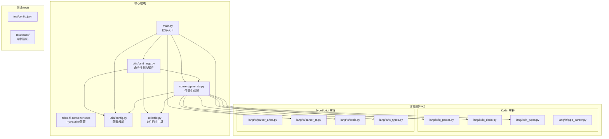
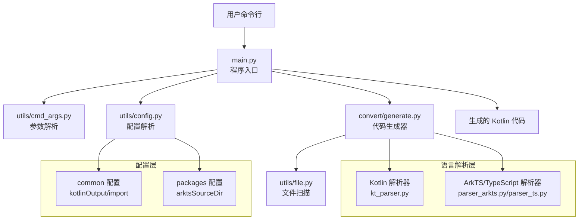
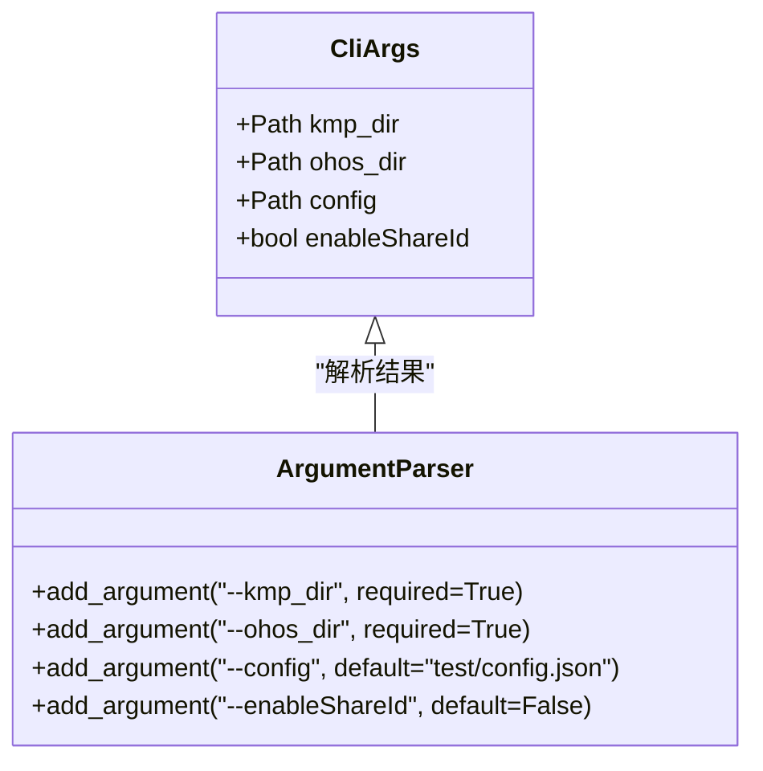
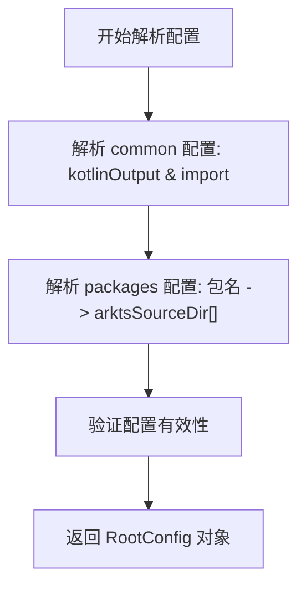
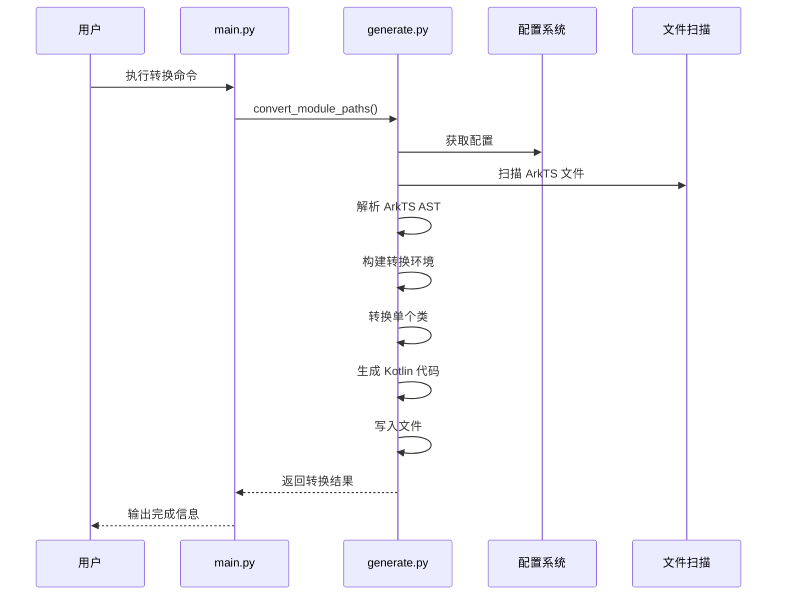
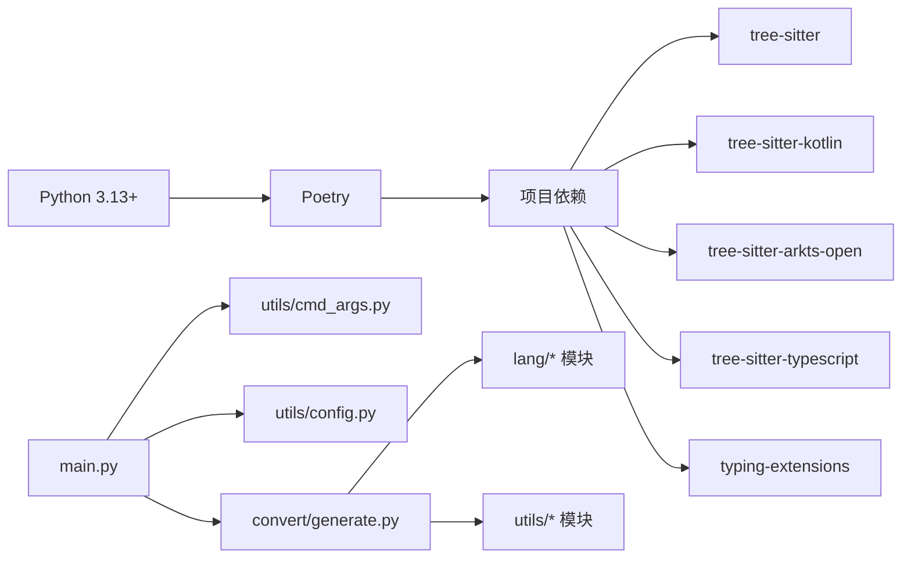

# 开发者指南

<cite>
**本文引用的文件**
- [README.md](file://README.md)
- [pyproject.toml](file://pyproject.toml)
- [main.py](file://main.py)
- [arkts-ffi-converter.spec](file://arkts-ffi-converter.spec)
- [utils/cmd_args.py](file://utils/cmd_args.py)
- [convert/generate.py](file://convert/generate.py)
- [lang/parser.py](file://lang/parser.py)
- [lang/kt/kt_parser.py](file://lang/kt/kt_parser.py)
- [lang/kt/kt_decls.py](file://lang/kt/kt_decls.py)
- [lang/kt/kt_types.py](file://lang/kt/kt_types.py)
- [lang/kt/type_parser.py](file://lang/kt/type_parser.py)
- [lang/ts/parser_arkts.py](file://lang/ts/parser_arkts.py)
- [lang/ts/parser_ts.py](file://lang/ts/parser_ts.py)
- [lang/ts/decls.py](file://lang/ts/decls.py)
- [lang/ts/ts_types.py](file://lang/ts/ts_types.py)
- [utils/config.py](file://utils/config.py)
- [utils/file.py](file://utils/file.py)
- [test/config.json](file://test/config.json)
</cite>

## 更新摘要
**所做更改**
- 新增项目概述和功能特性介绍
- 更新环境要求章节，包含开发环境和运行环境
- 新增完整的编译打包指南
- 新增详细的使用说明和命令行参数
- 新增配置文件格式和说明
- 更新项目结构图以反映实际架构
- 增强工具链和生成器的工作流程说明

## 目录
1. [简介](#简介)
2. [项目概述](#项目概述)
3. [环境要求](#环境要求)
4. [编译打包指南](#编译打包指南)
5. [使用指南](#使用指南)
6. [项目结构](#项目结构)
7. [核心组件](#核心组件)
8. [架构总览](#架构总览)
9. [详细组件分析](#详细组件分析)
10. [依赖关系分析](#依赖关系分析)
11. [性能考虑](#性能考虑)
12. [故障排除指南](#故障排除指南)
13. [结论](#结论)
14. [附录](#附录)

## 简介
本指南面向希望参与"ArkTS FFI Kotlin"项目的开发者，这是一个专门用于将 ArkTS 声明转换为 Kotlin FFI 包装器的命令行工具，专为 HarmonyOS 开发设计。系统阐述项目的架构设计原则与开发模式，提供扩展开发（新装饰器、注解与类型）的方法论与步骤，明确贡献流程与规范，给出调试与故障排除策略，总结性能优化建议与最佳实践，并提供开发环境搭建、工具配置、版本管理与发布流程、代码审查标准与质量保障措施，以及可直接参考的实际开发示例与扩展案例。

## 项目概述
ArkTS 到 Kotlin FFI 转换工具是一个专为 HarmonyOS 开发设计的命令行工具，主要功能包括：

- ✅ 将 ArkTS 接口声明自动转换为 Kotlin FFI 包装器代码
- ✅ 支持复杂的类型映射和转换规则  
- ✅ 自动生成必要的导入和注解
- ✅ 配置驱动的转换流程
- ✅ 跨平台支持（macOS/Linux/Windows）

该工具通过解析 ArkTS 源码，将其转换为对应的 Kotlin 包装器，使得 Kotlin 代码能够通过 FFI（Foreign Function Interface）调用 ArkTS 实现的功能，为跨语言开发提供了便利的解决方案。

**章节来源**
- [README.md](file://README.md#L1-L138)

## 环境要求

### 开发环境
- **Python >= 3.13**：项目要求 Python 3.13 或更高版本
- **Poetry >= 1.5.0**：使用 Poetry 作为包管理和构建工具
- **操作系统**：推荐 macOS，也支持 Linux 和 Windows

### 运行环境
- **无需 Python 环境**：工具可打包为独立二进制文件，在没有 Python 环境的系统上直接运行
- **macOS 10.13+**：支持 Intel 和 Apple Silicon 处理器
- **Linux 和 Windows**：兼容相应平台的打包版本

### 依赖项
项目核心依赖包括：
- `tree-sitter >= 0.25.2`：语法解析引擎
- `tree-sitter-arkts-open`：ArkTS 语法解析器
- `tree-sitter-kotlin >= 1.1.0`：Kotlin 语法解析器
- `tree-sitter-typescript >= 0.23.2`：TypeScript 语法解析器
- `typing-extensions >= 4.12.2`：类型提示扩展

**章节来源**
- [README.md](file://README.md#L13-L35)
- [pyproject.toml](file://pyproject.toml#L15-L21)

## 编译打包指南

### 1. 准备开发环境
```bash
# 克隆项目
git clone <repository-url>
cd python-arkts-ffi-kt

# 安装 Poetry（如果尚未安装）
curl -sSL https://install.python-poetry.org | python3 -

# 安装项目依赖
poetry install

# 激活虚拟环境
poetry shell
```

### 2. 安装打包工具
```bash
# 在项目虚拟环境中安装 PyInstaller
pip install pyinstaller
```

### 3. 打包为独立二进制文件
#### macOS 打包（推荐配置）
```bash
# 清理之前的构建缓存
pyinstaller --clean arkts-ffi-converter.spec
```

### 4. 验证打包结果
```bash
# 检查生成的二进制文件
ls -la dist/arkts-ffi-converter

# 添加执行权限（macOS/Linux）
chmod +x dist/arkts-ffi-converter

# 测试运行
./dist/arkts-ffi-converter --help
```

### 5. 分发说明
打包后的二进制文件 `dist/arkts-ffi-converter` 是完全独立的，可以在没有 Python 环境的系统上运行。该文件包含了所有必要的依赖和资源文件，支持跨平台分发。

**章节来源**
- [README.md](file://README.md#L36-L87)
- [arkts-ffi-converter.spec](file://arkts-ffi-converter.spec#L1-L67)

## 使用指南

### 基本用法
```bash
./arkts-ffi-converter \
  --kmp_dir /path/to/kmp/project \
  --ohos_dir /path/to/ohos/project \
  --config /path/to/config.json \
  --enableShareId True
```

### 命令行参数

| 参数 | 必需 | 类型 | 描述 |
|------|------|------|------|
| `--kmp_dir` | ✅ | 路径 | KMP 项目根目录路径 |
| `--ohos_dir` | ✅ | 路径 | OHOS 项目根目录路径 |
| `--config` | ✅ | 路径 | 配置文件路径 |
| `--enableShareId` | ❌ | 布尔 | 启用 ShareId 功能（默认：False） |

### 配置文件格式
配置文件采用 JSON 格式，定义转换规则和输出设置：

```json
{
  "common": {
    "kotlinOutput": "business_modules/Infrastructure/Common/common_model_basic/src/ohosArm64Main/kotlin",
    "import": [
      "com.bd.kmp.ohos_ffi.types.ArkObjectSafeReference",
      "platform.ohos.napi.*",
      "kotlinx.cinterop.*",
      "com.bd.kmp.ohos_ffi.annotation.ArkTsExportClass"
    ]
  },
  "packages": {
    "@dy/common_dto": {
      "arktsSourceDir": ["/path/to/source"]
    }
  }
}
```

#### 配置项说明
- `common.kotlinOutput`：Kotlin 输出文件的相对路径
- `common.import`：需要导入的包列表
- `packages`：包映射配置
  - 键：包名（如 "@dy/common_dto"）
  - 值：包含 `arktsSourceDir` 数组的对象

**章节来源**
- [README.md](file://README.md#L88-L138)
- [utils/cmd_args.py](file://utils/cmd_args.py#L8-L62)
- [test/config.json](file://test/config.json#L1-L22)

## 项目结构
项目采用按语言分层的模块化组织方式：lang 下分别提供 Kotlin 与 TypeScript 的解析器、声明模型与类型系统；utils 提供配置解析与文件扫描工具；convert 提供代码生成器；test 提供示例源码与配置样例。



**图表来源**
- [main.py](file://main.py#L1-L36)
- [arkts-ffi-converter.spec](file://arkts-ffi-converter.spec#L1-L67)
- [utils/cmd_args.py](file://utils/cmd_args.py#L1-L76)
- [convert/generate.py](file://convert/generate.py#L1-L147)
- [lang/kt/kt_parser.py](file://lang/kt/kt_parser.py#L1-L242)
- [lang/ts/parser_arkts.py](file://lang/ts/parser_arkts.py#L1-L237)
- [lang/ts/parser_ts.py](file://lang/ts/parser_ts.py#L1-L237)

**章节来源**
- [pyproject.toml](file://pyproject.toml#L8-L12)

## 核心组件
- **程序入口**：main.py 提供命令行接口，负责解析参数、加载配置并协调整个转换流程
- **命令行参数解析**：utils/cmd_args.py 处理用户输入，验证路径有效性并提供帮助信息
- **配置系统**：utils/config.py 解析 JSON 配置，支持 common 和 packages 两层配置结构
- **文件扫描工具**：utils/file.py 提供递归文件扫描功能，支持多种文件扩展名
- **代码生成器**：convert/generate.py 负责将解析的 AST 转换为 Kotlin 代码，支持单文件和项目两种输出模式
- **抽象解析器基类**：提供基于双端队列的流式解析能力，统一支持弹出、推入、窥视、跳过、按类型推进等操作
- **Kotlin 解析器**：基于 tree-sitter-kotlin，解析类声明、属性声明、注解与类型字符串
- **TypeScript/ArkTS 解析器**：基于 tree-sitter-arkts-open，解析装饰器、类声明、类型注解与表达式
- **类型系统**：支持原生类型、数组、泛型应用、可空、限定类型等复杂类型结构

**章节来源**
- [main.py](file://main.py#L12-L25)
- [utils/cmd_args.py](file://utils/cmd_args.py#L8-L62)
- [utils/config.py](file://utils/config.py#L1-L84)
- [utils/file.py](file://utils/file.py#L1-L32)
- [convert/generate.py](file://convert/generate.py#L1-L147)
- [lang/parser.py](file://lang/parser.py#L1-L57)

## 架构总览
整体架构遵循"命令行接口 + 配置系统 + 代码生成器 + 语言解析器"的分层设计。用户通过命令行参数启动程序，配置系统解析 JSON 配置，代码生成器协调各语言解析器将源码转换为 Kotlin 包装器，最终输出到指定目录。



**图表来源**
- [main.py](file://main.py#L12-L25)
- [utils/cmd_args.py](file://utils/cmd_args.py#L16-L62)
- [utils/config.py](file://utils/config.py#L1-L84)
- [convert/generate.py](file://convert/generate.py#L86-L147)

## 详细组件分析

### 命令行接口与参数解析
- **参数定义**：提供 kmp_dir、ohos_dir、config、enableShareId 四个必需参数
- **路径验证**：确保 KMP 和 OHOS 项目目录存在且为有效目录
- **配置文件验证**：确保配置文件存在且为有效文件
- **参数类型**：kmp_dir 和 ohos_dir 为 Path 类型，config 为 Path 类型，默认指向 test/config.json



**图表来源**
- [utils/cmd_args.py](file://utils/cmd_args.py#L8-L62)

**章节来源**
- [utils/cmd_args.py](file://utils/cmd_args.py#L8-L62)

### 配置系统与文件扫描
- **配置结构**：支持 common 和 packages 两个层级的配置
- **common 配置**：包含 kotlinOutput 和 import 数组
- **packages 配置**：包名到 arktsSourceDir 数组的映射
- **文件扫描**：递归扫描指定后缀的文件，支持 ArkTS/TS 文件



**图表来源**
- [utils/config.py](file://utils/config.py#L1-L84)
- [test/config.json](file://test/config.json#L1-L22)

**章节来源**
- [utils/config.py](file://utils/config.py#L1-L84)
- [test/config.json](file://test/config.json#L1-L22)

### 代码生成器与转换流程
- **输出模式**：支持 SingleFile 和 Project 两种输出模式
- **环境构建**：构建 ArkTS 声明、Kotlin 类型映射和共享 ID 环境
- **类转换**：将 ArkTS 类转换为 Kotlin 包装器，生成相应的导入和声明
- **文件输出**：根据配置输出到指定的 Kotlin 项目路径



**图表来源**
- [main.py](file://main.py#L12-L25)
- [convert/generate.py](file://convert/generate.py#L86-L147)

**章节来源**
- [convert/generate.py](file://convert/generate.py#L1-L147)

## 依赖关系分析
- **核心依赖**：Python 3.13+、Poetry、tree-sitter 生态系统
- **语言解析依赖**：tree-sitter-kotlin、tree-sitter-arkts-open、tree-sitter-typescript
- **类型系统依赖**：typing-extensions 提供类型提示支持
- **打包依赖**：PyInstaller 用于创建独立的二进制文件
- **内部模块依赖**：utils 模块为 convert 和 lang 模块提供基础功能



**图表来源**
- [pyproject.toml](file://pyproject.toml#L15-L21)
- [arkts-ffi-converter.spec](file://arkts-ffi-converter.spec#L31-L34)

**章节来源**
- [pyproject.toml](file://pyproject.toml#L15-L21)

## 性能考虑
- **解析器性能**
  - Kotlin：基于 tree-sitter 的高效 C 实现，解析复杂度近似 O(N)，注意避免重复解析同一源码
  - TypeScript/ArkTS：流式解析器在 Python 层实现，建议减少不必要的 push/pop 操作
- **内存与缓存**
  - 将源码编码为字节后一次性解析，避免频繁 I/O
  - 对于大型项目，建议分包扫描与增量解析，结合文件工具的去重与排序结果
- **打包优化**
  - PyInstaller 支持 UPX 压缩，可减小二进制文件大小
  - 隐藏导入优化，只包含必要的模块和数据文件
- **类型系统**
  - 类型解析采用词法+递归下降，注意类型字符串长度与嵌套深度
  - 使用延迟计算策略处理复杂类型映射

## 故障排除指南
- **常见错误与定位**
  - 参数验证失败：检查路径是否存在且为有效目录
  - 配置文件解析失败：验证 JSON 格式和字段完整性
  - 文件扫描失败：确认文件扩展名和路径权限
  - 语法解析错误：检查 ArkTS/TypeScript 源码的语法正确性
- **调试技巧**
  - 启用详细日志：在 main.py 中添加调试输出
  - 单元测试：针对最小可复现样例编写测试
  - 配置验证：使用 print_config 函数输出配置信息
- **工具辅助**
  - 使用文件扫描工具快速定位目标文件
  - PyInstaller 调试：检查 spec 文件中的隐藏导入和数据文件配置

**章节来源**
- [utils/cmd_args.py](file://utils/cmd_args.py#L55-L62)
- [utils/config.py](file://utils/config.py#L64-L84)

## 结论
本项目以清晰的模块化架构和完整的工具链为核心，结合强大的外部语法解析库与实用的打包工具，形成了一个功能完备的 ArkTS 到 Kotlin 转换解决方案。开发者可以通过命令行接口快速集成到现有开发流程中，同时通过配置系统灵活定制转换规则。项目的设计充分考虑了跨平台支持和独立部署需求，为 HarmonyOS 开发提供了便利的工具支持。

## 附录

### 扩展开发指南（新装饰器、注解与类型）

- **新增 Kotlin 注解/装饰器支持**
  - 在注解解析处增加对新注解类型的识别分支
  - 扩展注解参数解析逻辑，支持更多值类型
  - 在声明模型中新增对应的数据结构
  - 参考路径：[lang/kt/kt_parser.py](file://lang/kt/kt_parser.py#L51-L91)

- **新增 Kotlin 类型支持**
  - 在 Kotlin 类型解析器中添加新的令牌与解析规则
  - 在类型模型中补充相应类型
  - 参考路径：[lang/kt/type_parser.py](file://lang/kt/type_parser.py#L40-L151)

- **新增 TypeScript/ArkTS 装饰器支持**
  - 在装饰器解析流程中增加新装饰器名称的识别
  - 支持对象字面量、数组等复杂参数
  - 参考路径：[lang/ts/parser_arkts.py](file://lang/ts/parser_arkts.py#L179-L199)

- **新增 TypeScript 类型支持**
  - 在类型解析流程中增加新类型的识别与构造
  - 扩展类型访问器接口以支持新类型处理
  - 参考路径：[lang/ts/ts_types.py](file://lang/ts/ts_types.py#L180-L280)

### 贡献流程与规范
- **提交流程**
  - Fork 并创建功能分支
  - 提交前运行配置解析与文件扫描的示例脚本
  - 编写最小可复现测试用例
  - 更新相关文档与注释
- **规范要求**
  - 遵循现有命名与模块组织风格
  - 保持解析器与类型系统的扩展点清晰
  - 错误处理保持明确与可诊断
  - 性能敏感路径避免重复解析

### 调试技巧与最佳实践
- **调试技巧**
  - 在解析器关键节点打印当前节点类型与文本
  - 使用最小样例快速复现问题
  - 对配置与文件扫描进行单元测试
- **最佳实践**
  - 优先使用 push_type_children 进行类型安全推进
  - 对复杂类型采用分层解析与延迟计算策略

### 开发环境搭建与工具配置
- **环境准备**
  - Python 版本与依赖：参考项目依赖声明
  - 项目打包：使用 Poetry 管理依赖与构建
- **工具配置**
  - 配置文件格式与字段：参考配置解析器的字段校验逻辑
  - 文件扫描：使用文件工具递归收集 ArkTS/TS 文件
  - PyInstaller 配置：参考 spec 文件中的隐藏导入和数据文件

### 版本管理与发布流程
- **版本管理**
  - 使用语义化版本号
  - 变更类型与变更日志同步更新
- **发布流程**
  - 构建与打包：使用 Poetry 构建后分发
  - 文档与示例：随版本附带最小可运行示例与配置说明

### 代码审查标准与质量保证
- **审查标准**
  - 解析正确性：覆盖边界条件与异常路径
  - 扩展一致性：新增装饰器/注解/类型需与既有模型保持一致
  - 性能影响：避免引入不必要的解析开销与内存占用
- **质量保证**
  - 单元测试：针对最小样例与边界条件编写测试
  - 集成测试：使用配置解析与文件扫描工具验证工程化流程

### 实际开发示例与扩展案例
- **命令行工具扩展**
  - 示例：为现有命令行接口增加新参数选项
  - 参考路径：[utils/cmd_args.py](file://utils/cmd_args.py#L16-L46)
- **配置系统扩展**
  - 示例：为配置系统增加新的配置项支持
  - 参考路径：[utils/config.py](file://utils/config.py#L1-L84)
- **代码生成器扩展**
  - 示例：为代码生成器增加新的输出模式
  - 参考路径：[convert/generate.py](file://convert/generate.py#L112-L147)