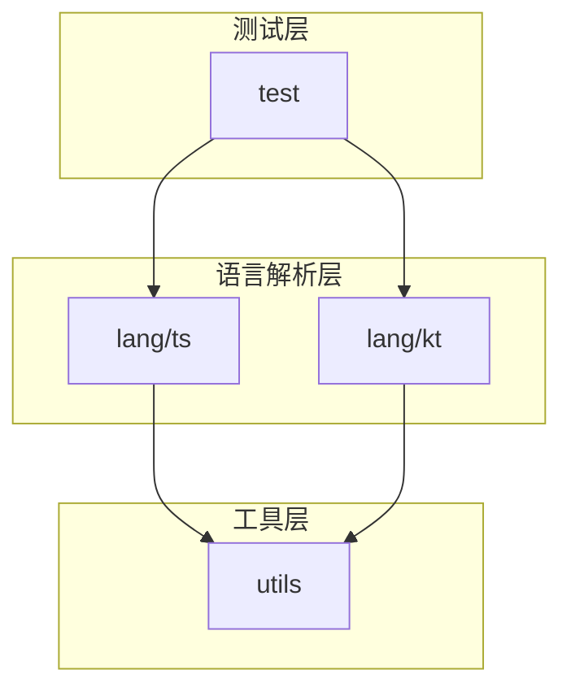
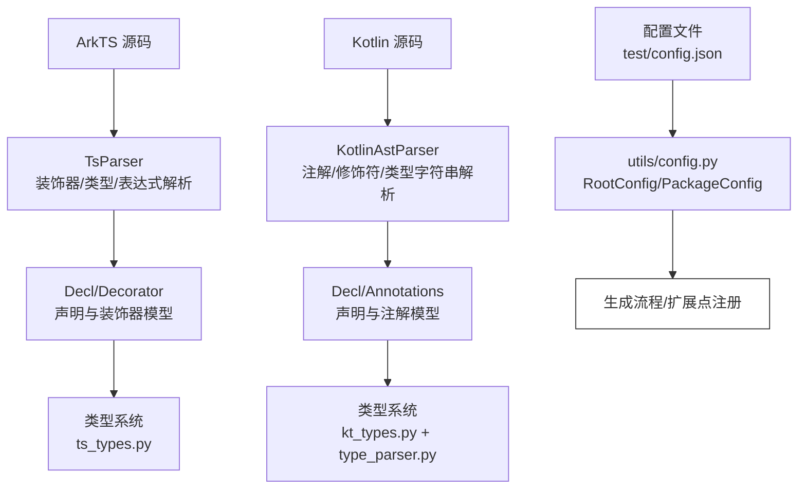
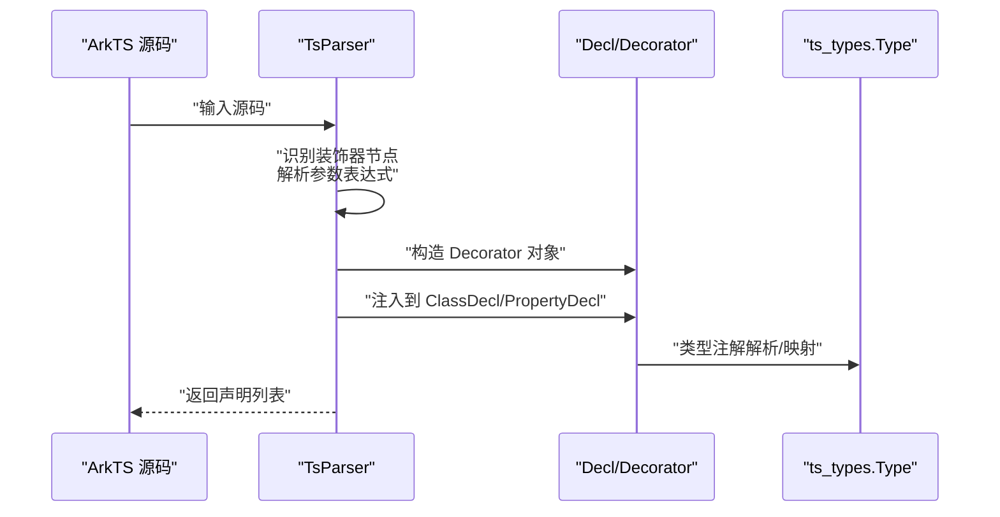
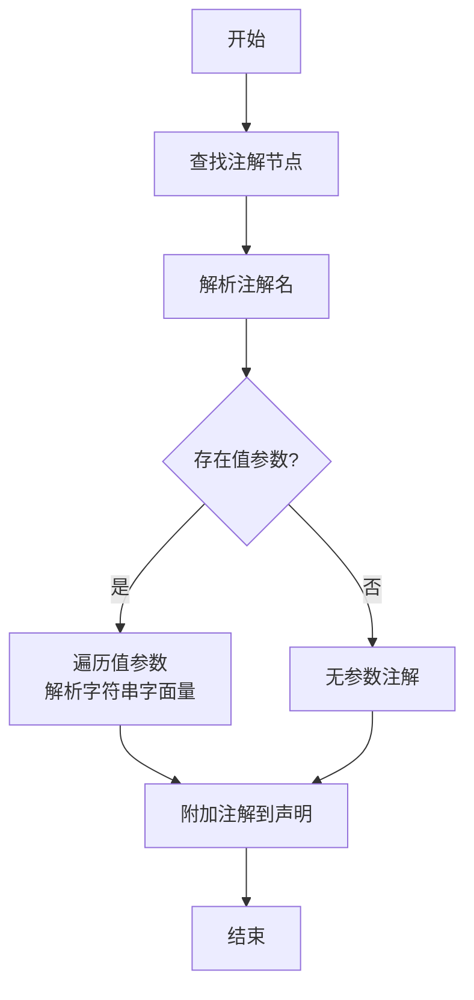
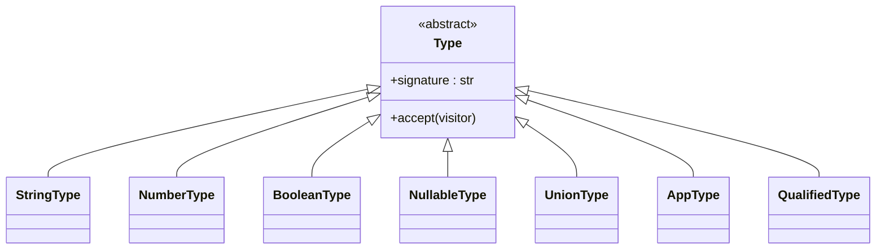
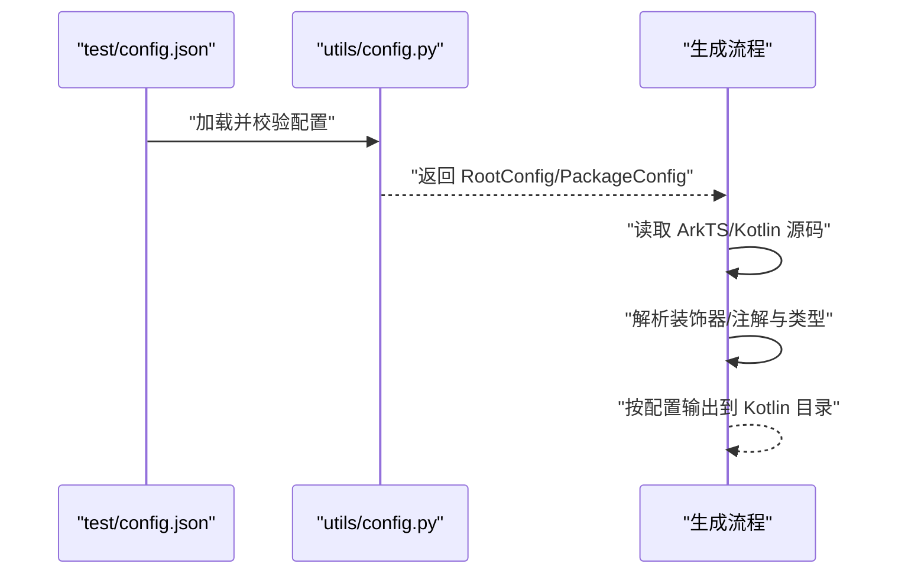
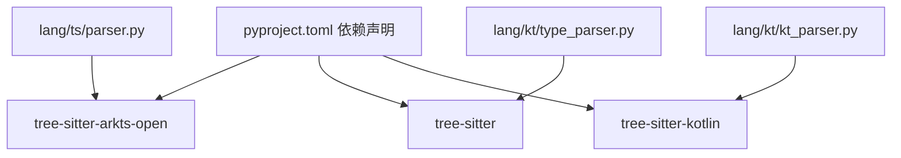

# 扩展开发指南

<cite>
**本文引用的文件**
- [lang/parser.py](file://lang/parser.py)
- [lang/ts/parser.py](file://lang/ts/parser.py)
- [lang/ts/decls.py](file://lang/ts/decls.py)
- [lang/ts/ts_types.py](file://lang/ts/ts_types.py)
- [lang/kt/kt_parser.py](file://lang/kt/kt_parser.py)
- [lang/kt/kt_decls.py](file://lang/kt/kt_decls.py)
- [lang/kt/kt_types.py](file://lang/kt/kt_types.py)
- [lang/kt/type_parser.py](file://lang/kt/type_parser.py)
- [lang/kt/pretty.py](file://lang/kt/pretty.py)
- [pyproject.toml](file://pyproject.toml)
- [test/config.json](file://test/config.json)
- [utils/config.py](file://utils/config.py)
- [test/cases/class8.ts](file://test/cases/class8.ts)
- [test/cases/kt/class2.kt](file://test/cases/kt/class2.kt)
</cite>

## 目录
1. [简介](#简介)
2. [项目结构](#项目结构)
3. [核心组件](#核心组件)
4. [架构总览](#架构总览)
5. [详细组件分析](#详细组件分析)
6. [依赖关系分析](#依赖关系分析)
7. [性能考量](#性能考量)
8. [故障排查指南](#故障排查指南)
9. [结论](#结论)
10. [附录](#附录)

## 简介
本指南面向需要为该仓库添加“ArkTS 装饰器”与“Kotlin 注解”支持的扩展开发者，系统讲解以下内容：
- 如何扩展 ArkTS 装饰器：从语法解析、AST 节点处理到类型映射的完整流程
- 如何扩展 Kotlin 注解：从注解解析器编写到属性提取
- 如何扩展类型系统：新增类型、映射规则与转换逻辑
- 扩展点的注册机制与配置方法
- 最佳实践与注意事项

本指南以现有实现为蓝本，结合图示帮助不同技术背景的读者快速上手。

## 项目结构
该项目采用按语言分层的模块化组织方式：
- lang/ts：ArkTS 解析与类型系统
- lang/kt：Kotlin 解析与类型系统
- utils：配置解析工具
- test：测试用例与配置样例



图表来源
- [pyproject.toml](file://pyproject.toml#L8-L12)

章节来源
- [pyproject.toml](file://pyproject.toml#L8-L12)

## 核心组件
- 抽象解析器基类：提供通用的流式解析能力（弹出、推入、窥视、分隔解析等）
- ArkTS 解析器：基于 Tree-sitter 的 ArkTS 语法树解析，支持装饰器、类型注解、表达式等
- Kotlin 解析器：基于 Tree-sitter 的 Kotlin 语法树解析，支持注解、修饰符、类型字符串解析
- 类型系统：ArkTS 与 Kotlin 各自的类型模型与判断工具函数
- 配置系统：读取 JSON 配置，驱动生成流程

章节来源
- [lang/parser.py](file://lang/parser.py#L8-L57)
- [lang/ts/parser.py](file://lang/ts/parser.py#L10-L217)
- [lang/kt/kt_parser.py](file://lang/kt/kt_parser.py#L200-L234)
- [lang/ts/ts_types.py](file://lang/ts/ts_types.py#L8-L280)
- [lang/kt/kt_types.py](file://lang/kt/kt_types.py#L52-L191)
- [utils/config.py](file://utils/config.py#L45-L61)

## 架构总览
下图展示了扩展开发的关键交互路径：解析器从源码构建 AST，再通过声明与类型模型进行语义抽取；配置驱动生成流程。



图表来源
- [lang/ts/parser.py](file://lang/ts/parser.py#L10-L217)
- [lang/kt/kt_parser.py](file://lang/kt/kt_parser.py#L200-L234)
- [lang/ts/ts_types.py](file://lang/ts/ts_types.py#L8-L280)
- [lang/kt/kt_types.py](file://lang/kt/kt_types.py#L52-L191)
- [lang/kt/type_parser.py](file://lang/kt/type_parser.py#L68-L151)
- [utils/config.py](file://utils/config.py#L45-L61)
- [test/config.json](file://test/config.json#L1-L27)

## 详细组件分析

### ArkTS 装饰器扩展（添加新的 @ExportXxx 支持）
目标：在 ArkTS 中新增装饰器支持，并将其映射到内部声明模型与类型系统。

实现步骤概览
- 语法解析：在 ArkTS 解析器中识别新装饰器节点，解析参数表达式
- AST 节点处理：将装饰器信息注入到 ClassDecl/PropertyDecl 等声明对象
- 类型映射：根据装饰器参数与类型注解，建立类型约束或派生类型
- 生成与注册：在生成阶段读取装饰器元数据，输出对应导出代码



图表来源
- [lang/ts/parser.py](file://lang/ts/parser.py#L164-L184)
- [lang/ts/parser.py](file://lang/ts/parser.py#L186-L217)
- [lang/ts/decls.py](file://lang/ts/decls.py#L27-L57)
- [lang/ts/ts_types.py](file://lang/ts/ts_types.py#L8-L280)

关键实现要点
- 装饰器解析入口：解析装饰器节点，支持带/不带参数两种形式
- 表达式解析：支持字符串、数字、布尔、对象字面量等值
- 声明注入：将装饰器列表附加到类或属性声明对象
- 类型注解：结合类型注解解析器，完成联合类型、泛型等复杂类型的处理

章节来源
- [lang/ts/parser.py](file://lang/ts/parser.py#L164-L184)
- [lang/ts/parser.py](file://lang/ts/parser.py#L137-L163)
- [lang/ts/parser.py](file://lang/ts/parser.py#L186-L217)
- [lang/ts/decls.py](file://lang/ts/decls.py#L27-L57)
- [lang/ts/ts_types.py](file://lang/ts/ts_types.py#L19-L74)
- [test/cases/class8.ts](file://test/cases/class8.ts#L1-L13)

扩展模板与实现建议
- 新增装饰器名称与参数键：在装饰器解析处增加分支，识别新装饰器名与参数键集合
- 参数值类型映射：将表达式解析结果映射到 TsValue 子类（如 StringValue、NumberValue、BooleanValue、MapValue）
- 声明模型扩展：在 Decl/Decorator 或其子类中增加字段，承载新装饰器的元数据
- 类型系统集成：在类型注解解析中，针对新装饰器影响的类型进行特殊处理（例如限定可导出类型）

参考路径
- [lang/ts/parser.py](file://lang/ts/parser.py#L164-L184)
- [lang/ts/parser.py](file://lang/ts/parser.py#L137-L163)
- [lang/ts/decls.py](file://lang/ts/decls.py#L7-L26)

### Kotlin 注解扩展（添加新的 @ShareXxx 支持）
目标：在 Kotlin 中新增注解支持，解析注解参数并注入到声明模型。

实现步骤概览
- 注解解析：从修饰符节点中提取注解，解析构造调用与值参数
- 属性提取：支持字符串字面量与回退为原始文本
- 声明注入：将注解信息附加到 ClassDecl/PropertyDecl
- 类型系统：结合类型字符串解析器，统一 Kotlin 类型表示



图表来源
- [lang/kt/kt_parser.py](file://lang/kt/kt_parser.py#L51-L82)
- [lang/kt/kt_parser.py](file://lang/kt/kt_parser.py#L85-L91)
- [lang/kt/kt_parser.py](file://lang/kt/kt_parser.py#L94-L128)

关键实现要点
- 注解解析器：从注解节点中提取构造调用与值参数，支持字符串字面量与回退策略
- 修饰符处理：区分 val/var，记录属性修饰符
- 类型解析：使用 Kotlin 字符串类型解析器，将类型字符串转为内部类型模型
- 兼容性：处理 expect/actual 包装场景，适配树形语法差异

章节来源
- [lang/kt/kt_parser.py](file://lang/kt/kt_parser.py#L51-L82)
- [lang/kt/kt_parser.py](file://lang/kt/kt_parser.py#L85-L91)
- [lang/kt/kt_parser.py](file://lang/kt/kt_parser.py#L94-L128)
- [lang/kt/kt_parser.py](file://lang/kt/kt_parser.py#L130-L149)
- [lang/kt/kt_parser.py](file://lang/kt/kt_parser.py#L152-L196)
- [test/cases/kt/class2.kt](file://test/cases/kt/class2.kt#L3-L16)

扩展模板与实现建议
- 新增注解名与参数键：在注解解析器中增加分支，识别新注解名与参数键集合
- 参数值类型映射：将值参数映射到 KtValue 子类（如 StringValue、IntegerValue），必要时保留原始文本
- 声明模型扩展：在 Annotations 或其父类中增加字段，承载新注解的元数据
- 类型系统集成：确保 Kotlin 类型字符串能被 type_parser 正确解析为内部类型模型

参考路径
- [lang/kt/kt_parser.py](file://lang/kt/kt_parser.py#L51-L82)
- [lang/kt/kt_parser.py](file://lang/kt/kt_parser.py#L85-L91)
- [lang/kt/kt_decls.py](file://lang/kt/kt_decls.py#L28-L32)
- [lang/kt/type_parser.py](file://lang/kt/type_parser.py#L68-L151)

### 类型系统扩展（新增类型、映射规则与转换逻辑）
目标：为 ArkTS 与 Kotlin 分别新增类型，或增强现有类型判断与转换逻辑。

ArkTS 类型系统扩展
- 新增类型：在 ts_types.py 中新增类型类，实现签名与访问者接口
- 类型判断：在现有工具函数基础上扩展 is_xxx_type 判断
- 访问者模式：为新类型实现 visit_type_* 方法，保持一致性



图表来源
- [lang/ts/ts_types.py](file://lang/ts/ts_types.py#L8-L280)

Kotlin 类型系统扩展
- 新增类型：在 kt_types.py 中新增类型类，提供字符串化与判断函数
- 名称映射：在 _PRIM_BY_NAME 中注册基础类型名
- 类型解析：在 type_parser.py 中扩展解析器，支持新类型语法

```mermaid
flowchart TD
A["类型字符串"] --> B["词法分析<br/>_tokenize"]
B --> C["语法解析<br/>_Parser._parse_type/_parse_qualified_or_simple"]
C --> D{"是否泛型?"}
D --> |是| E["收集类型参数<br/>AppType"]
D --> |否| F{"是否数组/可空后缀?"}
F --> |数组[]| G["ArrayType 包装"]
F --> |可空?| H["NullableType 包装"]
F --> |都不是| I["返回基础类型"]
E --> J["返回类型"]
G --> J
H --> J
I --> J
```

图表来源
- [lang/kt/type_parser.py](file://lang/kt/type_parser.py#L40-L64)
- [lang/kt/type_parser.py](file://lang/kt/type_parser.py#L68-L151)
- [lang/kt/kt_types.py](file://lang/kt/kt_types.py#L52-L191)

章节来源
- [lang/ts/ts_types.py](file://lang/ts/ts_types.py#L8-L280)
- [lang/kt/kt_types.py](file://lang/kt/kt_types.py#L52-L191)
- [lang/kt/type_parser.py](file://lang/kt/type_parser.py#L68-L151)

### 扩展点注册机制与配置方法
- 配置文件：通过 test/config.json 定义公共 Kotlin 输出目录与导入项，以及各包的 ArkTS 源码目录
- 配置解析：utils/config.py 将 JSON 映射为数据类，供生成流程使用
- 扩展注册：在生成阶段读取装饰器/注解元数据与类型信息，按配置输出到指定目录



图表来源
- [test/config.json](file://test/config.json#L1-L27)
- [utils/config.py](file://utils/config.py#L45-L61)

章节来源
- [test/config.json](file://test/config.json#L1-L27)
- [utils/config.py](file://utils/config.py#L45-L61)

## 依赖关系分析
- 外部依赖：tree-sitter-arkts-open、tree-sitter、tree-sitter-kotlin
- 内部依赖：解析器依赖抽象解析器基类；ArkTS/Kotlin 各自维护独立的声明与类型模型



图表来源
- [pyproject.toml](file://pyproject.toml#L15-L21)
- [lang/ts/parser.py](file://lang/ts/parser.py#L2-L8)
- [lang/kt/kt_parser.py](file://lang/kt/kt_parser.py#L7-L11)
- [lang/kt/type_parser.py](file://lang/kt/type_parser.py#L1-L16)

章节来源
- [pyproject.toml](file://pyproject.toml#L15-L21)

## 性能考量
- 解析器流式操作：利用双端队列进行节点流式推进，避免重复扫描
- 类型判断与归一化：提供 unwrap_nullable、is_primitive_type 等工具，减少重复计算
- 词法/语法解析：Kotlin 类型解析采用单次扫描与递归下降，注意异常定位与错误恢复
- 配置读取：一次性解析配置，避免频繁 IO

[本节为通用指导，无需列出具体文件来源]

## 故障排查指南
常见问题与解决思路
- 装饰器未生效
  - 检查装饰器名是否在解析器中被识别
  - 确认参数表达式是否被正确解析为 TsValue
  - 参考：装饰器解析与表达式解析流程
- 注解参数缺失
  - 检查注解节点是否存在值参数，必要时回退到原始文本
  - 参考：注解解析器与字符串字面量解析
- 类型解析失败
  - 检查类型字符串是否符合 Kotlin 语法，确认 _PRIM_BY_NAME 是否包含基础类型
  - 参考：Kotlin 类型解析器与类型判断函数
- 配置读取异常
  - 检查 JSON 结构与字段类型，确保路径正确
  - 参考：配置解析器的字段校验逻辑

章节来源
- [lang/ts/parser.py](file://lang/ts/parser.py#L164-L184)
- [lang/kt/kt_parser.py](file://lang/kt/kt_parser.py#L51-L82)
- [lang/kt/type_parser.py](file://lang/kt/type_parser.py#L149-L151)
- [utils/config.py](file://utils/config.py#L27-L43)

## 结论
通过本指南，开发者可以：
- 在 ArkTS 中新增装饰器支持，并将其与声明模型、类型系统打通
- 在 Kotlin 中新增注解支持，并实现参数提取与类型映射
- 扩展类型系统，完善类型判断与转换逻辑
- 使用配置文件驱动生成流程，实现可扩展的注册机制

建议在扩展过程中遵循“先解析、再注入、后映射”的三段式流程，并充分利用现有工具函数与访问者模式，确保扩展的一致性与可维护性。

[本节为总结性内容，无需列出具体文件来源]

## 附录
- 测试用例参考
  - ArkTS 示例：[test/cases/class8.ts](file://test/cases/class8.ts#L1-L13)
  - Kotlin 示例：[test/cases/kt/class2.kt](file://test/cases/kt/class2.kt#L3-L16)
- 配置示例参考：[test/config.json](file://test/config.json#L1-L27)
- 解析器基类参考：[lang/parser.py](file://lang/parser.py#L8-L57)
- ArkTS 声明与类型参考：[lang/ts/decls.py](file://lang/ts/decls.py#L27-L57), [lang/ts/ts_types.py](file://lang/ts/ts_types.py#L8-L280)
- Kotlin 声明与类型参考：[lang/kt/kt_decls.py](file://lang/kt/kt_decls.py#L28-L51), [lang/kt/kt_types.py](file://lang/kt/kt_types.py#L52-L191), [lang/kt/type_parser.py](file://lang/kt/type_parser.py#L68-L151)