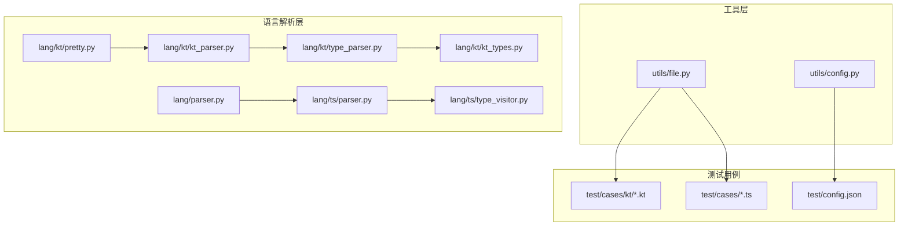
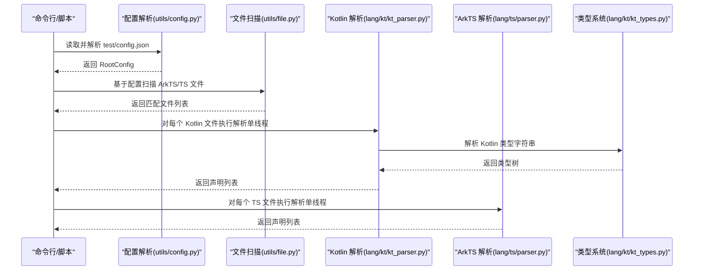
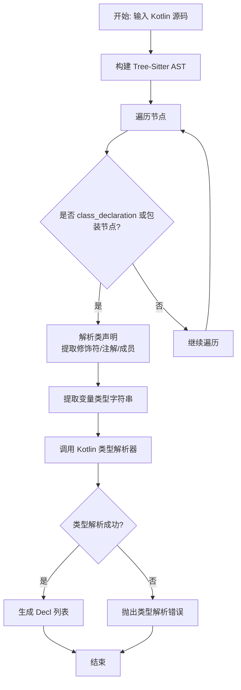
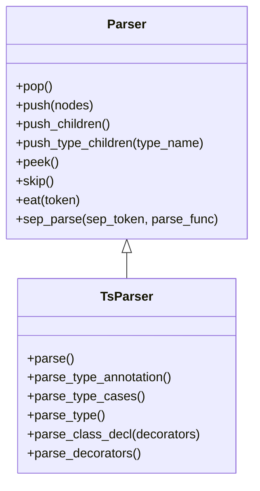
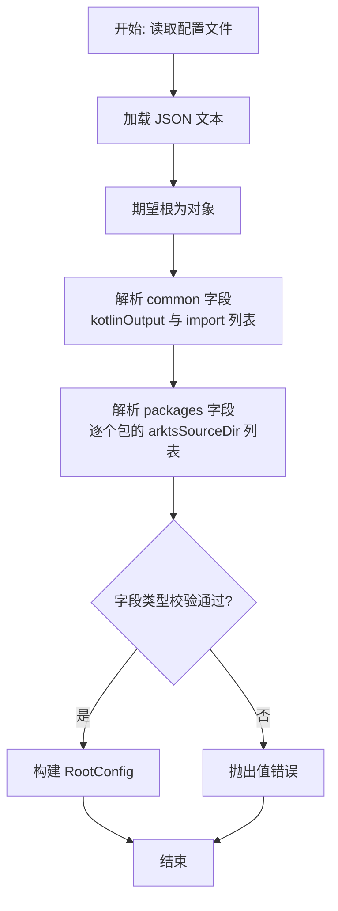
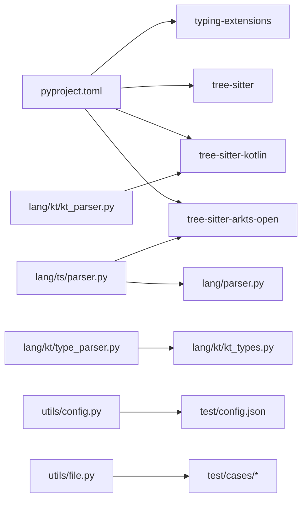

# 调试与故障排除

<cite>
**本文引用的文件**
- [pyproject.toml](file://pyproject.toml)
- [test/config.json](file://test/config.json)
- [utils/config.py](file://utils/config.py)
- [utils/file.py](file://utils/file.py)
- [lang/parser.py](file://lang/parser.py)
- [lang/kt/kt_parser.py](file://lang/kt/kt_parser.py)
- [lang/kt/type_parser.py](file://lang/kt/type_parser.py)
- [lang/kt/kt_types.py](file://lang/kt/kt_types.py)
- [lang/kt/pretty.py](file://lang/kt/pretty.py)
- [lang/ts/parser.py](file://lang/ts/parser.py)
- [lang/ts/type_visitor.py](file://lang/ts/type_visitor.py)
- [test/cases/kt/class0.kt](file://test/cases/kt/class0.kt)
- [test/cases/class0.ts](file://test/cases/class0.ts)
- [main.py](file://main.py)
- [convert/pretty.py](file://convert/pretty.py)
</cite>

## 更新摘要
**所做更改**
- 更新了架构总览以反映当前的单线程实现
- 移除了关于实验性多线程支持的讨论
- 简化了调试方法部分，专注于当前的单线程调试技术
- 更新了性能考虑部分，反映当前的单线程性能特征
- 移除了临时性能优化和临时调试增强的相关内容

## 目录
1. [简介](#简介)
2. [项目结构](#项目结构)
3. [核心组件](#核心组件)
4. [架构总览](#架构总览)
5. [详细组件分析](#详细组件分析)
6. [依赖关系分析](#依赖关系分析)
7. [性能考虑](#性能考虑)
8. [故障排除指南](#故障排除指南)
9. [结论](#结论)
10. [附录](#附录)

## 简介
本指南聚焦于该代码库在 Kotlin 与 ArkTS（TS）语法解析与类型映射方面的调试与故障排除方法。内容涵盖：
- Python 调试器使用与日志记录策略
- 配置文件解析错误的诊断与修复
- 语法解析失败的定位与处理
- 类型映射异常的排查与修正
- 性能分析与优化建议（当前为单线程实现）
- 单元测试与调试方法
- 使用 Tree-Sitter 工具进行语法解析问题排查
- 故障排除检查清单与最佳实践

**更新** 当前实现为单线程架构，移除了之前的实验性多线程支持计划。

## 项目结构
该项目围绕"语言解析层""工具层""测试用例"组织，主要模块如下：
- 语言解析层：Kotlin 解析器、ArkTS 解析器、通用解析基类、类型模型与类型解析器
- 工具层：配置解析、文件扫描
- 测试用例：Kotlin 与 TS 的示例文件

**图表来源**
- [utils/config.py](file://utils/config.py#L45-L82)
- [utils/file.py](file://utils/file.py#L7-L32)
- [lang/parser.py](file://lang/parser.py#L8-L57)
- [lang/kt/kt_parser.py](file://lang/kt/kt_parser.py#L200-L235)
- [lang/kt/type_parser.py](file://lang/kt/type_parser.py#L68-L151)
- [lang/kt/kt_types.py](file://lang/kt/kt_types.py#L52-L191)
- [lang/ts/parser.py](file://lang/ts/parser.py#L10-L218)
- [lang/ts/type_visitor.py](file://lang/ts/type_visitor.py#L5-L32)
- [lang/kt/pretty.py](file://lang/kt/pretty.py#L89-L97)
- [test/config.json](file://test/config.json#L1-L27)

**章节来源**
- [pyproject.toml](file://pyproject.toml#L1-L26)
- [test/config.json](file://test/config.json#L1-L27)

## 核心组件
- 通用解析器基类：提供基于流的解析器抽象，支持弹出/推入/窥视/跳过等操作，并提供分隔符解析辅助函数，便于 TS 解析器实现。
- Kotlin 解析器：基于 Tree-Sitter Kotlin 语言库，从源码构建 AST 并提取类与属性声明；对 expect/actual 包装节点做兼容处理；提供 Kotlin 类型字符串解析器。
- ArkTS 解析器：继承通用解析器基类，基于 Tree-Sitter ArkTS 语言库，解析装饰器、类型注解、类声明等。
- 类型系统与类型解析：Kotlin 类型解析器采用词法/语法两阶段，生成类型树；ArkTS 类型访问者定义了类型分发接口。
- 配置解析：从 JSON 配置中读取公共输出目录、导入列表以及包级 ArkTS 源码目录。
- 文件扫描：递归收集指定扩展名的 ArkTS/TS 文件，保证路径唯一、绝对化与排序。

**章节来源**
- [lang/parser.py](file://lang/parser.py#L8-L57)
- [lang/kt/kt_parser.py](file://lang/kt/kt_parser.py#L200-L235)
- [lang/kt/type_parser.py](file://lang/kt/type_parser.py#L68-L151)
- [lang/kt/kt_types.py](file://lang/kt/kt_types.py#L52-L191)
- [lang/ts/parser.py](file://lang/ts/parser.py#L10-L218)
- [lang/ts/type_visitor.py](file://lang/ts/type_visitor.py#L5-L32)
- [utils/config.py](file://utils/config.py#L45-L82)
- [utils/file.py](file://utils/file.py#L7-L32)

## 架构总览
下图展示了从配置到文件扫描、再到语言解析的整体流程与关键错误点。**更新** 当前为单线程实现，移除了多线程优化计划：

**图表来源**
- [utils/config.py](file://utils/config.py#L45-L82)
- [utils/file.py](file://utils/file.py#L7-L32)
- [lang/kt/kt_parser.py](file://lang/kt/kt_parser.py#L200-L235)
- [lang/kt/type_parser.py](file://lang/kt/type_parser.py#L149-L151)
- [lang/kt/kt_types.py](file://lang/kt/kt_types.py#L52-L191)
- [lang/ts/parser.py](file://lang/ts/parser.py#L10-L218)

## 详细组件分析

### Kotlin 解析器与类型解析器
- 关键职责
  - 通过 Tree-Sitter Kotlin 语言库构建 AST，并遍历节点提取类与属性声明。
  - 兼容 expect/actual 包装节点，确保在某些语法构造下仍可正确识别类体。
  - 将 Kotlin 类型字符串解析为内部类型树，支持泛型、数组、可空性等。
- 错误与异常
  - 当节点类型不匹配时抛出解析错误；当类型字符串不符合预期时抛出类型解析错误。
- 调试要点
  - 在解析前打印根节点类型与子节点概览，确认 Tree-Sitter 产出是否符合预期。
  - 对类型字符串进行最小化复现，逐步验证词法与语法阶段的错误位置。

**图表来源**
- [lang/kt/kt_parser.py](file://lang/kt/kt_parser.py#L130-L197)
- [lang/kt/type_parser.py](file://lang/kt/type_parser.py#L68-L151)

**章节来源**
- [lang/kt/kt_parser.py](file://lang/kt/kt_parser.py#L16-L197)
- [lang/kt/type_parser.py](file://lang/kt/type_parser.py#L18-L151)
- [lang/kt/kt_types.py](file://lang/kt/kt_types.py#L52-L191)

### ArkTS 解析器
- 关键职责
  - 继承通用解析器基类，基于 Tree-Sitter ArkTS 语言库解析装饰器、类型注解、类声明等。
  - 提供类型注解解析、标识符解析、表达式解析等辅助能力。
- 错误与异常
  - 当遇到未知或不期望的节点类型时抛出语法错误；当缺少必需节点（如标识符、大括号等）时抛出异常。
- 调试要点
  - 在解析每一步前打印当前节点类型与文本，核对 Tree-Sitter 产出。
  - 对复杂类型注解进行拆分测试，逐步定位失败分支。

**图表来源**
- [lang/parser.py](file://lang/parser.py#L8-L57)
- [lang/ts/parser.py](file://lang/ts/parser.py#L10-L218)

**章节来源**
- [lang/parser.py](file://lang/parser.py#L8-L57)
- [lang/ts/parser.py](file://lang/ts/parser.py#L10-L218)

### 配置解析与文件扫描
- 关键职责
  - 从 JSON 配置中读取公共输出目录、导入列表与包级 ArkTS 源码目录。
  - 递归扫描指定扩展名的 ArkTS/TS 文件，保证路径唯一、绝对化与排序。
- 错误与异常
  - 当 JSON 结构不符合预期（类型不符、缺失字段）时抛出值错误；当路径不存在或既非文件也非目录时抛出文件未找到错误。
- 调试要点
  - 打印解析后的配置对象，核对字段是否存在且类型正确。
  - 对扫描结果进行去重与排序校验，避免重复处理或顺序不一致导致的问题。

**图表来源**
- [utils/config.py](file://utils/config.py#L45-L82)

**章节来源**
- [utils/config.py](file://utils/config.py#L27-L82)
- [utils/file.py](file://utils/file.py#L7-L32)
- [test/config.json](file://test/config.json#L1-L27)

### 类型系统与类型访问者
- 关键职责
  - 定义 Kotlin 类型树的数据结构（原始类型、可空、数组、应用类型、限定类型等），并提供类型判断与查询工具。
  - ArkTS 类型访问者定义类型分发接口，便于扩展不同类型的处理逻辑。
- 错误与异常
  - 当传入类型不符合预期（例如非引用类型却要求名称）时抛出类型错误。
- 调试要点
  - 使用"美化打印"工具输出类型树，快速定位类型结构问题。
  - 对复杂类型（如嵌套泛型、可空数组）进行最小化用例测试。

**章节来源**
- [lang/kt/kt_types.py](file://lang/kt/kt_types.py#L52-L191)
- [lang/ts/type_visitor.py](file://lang/ts/type_visitor.py#L5-L32)
- [lang/kt/pretty.py](file://lang/kt/pretty.py#L50-L87)

## 依赖关系分析
- 外部依赖
  - Tree-Sitter 及其 Kotlin/ArkTS 语言绑定用于语法解析。
  - typing-extensions 提供类型提示增强。
- 内部依赖
  - Kotlin 解析器依赖 Kotlin 类型解析器与类型模型。
  - ArkTS 解析器依赖通用解析器基类与类型访问者接口。
  - 工具层为解析层提供配置与文件扫描支撑。

**图表来源**
- [pyproject.toml](file://pyproject.toml#L15-L21)
- [lang/kt/kt_parser.py](file://lang/kt/kt_parser.py#L7-L11)
- [lang/ts/parser.py](file://lang/ts/parser.py#L2-L8)
- [utils/config.py](file://utils/config.py#L45-L82)
- [utils/file.py](file://utils/file.py#L7-L32)

**章节来源**
- [pyproject.toml](file://pyproject.toml#L15-L21)

## 性能考虑
- **当前实现为单线程**：所有解析任务在主线程中顺序执行，避免了多线程同步开销。
- Tree-Sitter 解析
  - 复杂文件的解析时间与节点数量近似线性相关；尽量减少不必要的重复解析。
  - 对大型项目可按模块拆分解析任务，避免一次性解析全部文件。
- 类型解析
  - Kotlin 类型解析器采用词法/语法两阶段，输入越短、结构越简单，解析越快；对复杂类型可先简化再测试。
- 输出与打印
  - "美化打印"仅用于调试，生产环境应避免频繁深度打印类型树或声明树。

**更新** 移除了之前的多线程性能优化计划，当前实现更加简单可靠。

## 故障排除指南

### 一、配置错误
- 现象
  - 运行时报错提示字段类型不符或缺失。
- 诊断步骤
  - 校验 JSON 结构：确认 common 与 packages 字段存在且类型正确。
  - 校验字段类型：kotlinOutput 为字符串，import 与 arktsSourceDir 为字符串数组。
  - 校验路径有效性：确保 arktsSourceDir 指向真实存在的目录。
- 修复建议
  - 修正 JSON 中的字段类型或拼写错误。
  - 使用"打印配置"功能核对解析结果。

**章节来源**
- [utils/config.py](file://utils/config.py#L45-L82)
- [test/config.json](file://test/config.json#L1-L27)

### 二、语法解析失败
- Kotlin 解析失败
  - 现象：解析类声明或属性声明时抛出解析错误，提示节点类型不匹配。
  - 诊断：检查源码中是否使用了 expect/actual 包装节点；确认 Tree-Sitter 产出的根节点类型与子节点类型。
  - 修复：根据包装节点类型调整解析分支；必要时在最小化示例中验证。
- ArkTS 解析失败
  - 现象：解析装饰器、类型注解或类声明时抛出语法错误。
  - 诊断：逐级打印当前节点类型与文本，定位到具体失败分支。
  - 修复：补齐缺失的节点（如标识符、大括号、分隔符），或调整解析顺序。

**章节来源**
- [lang/kt/kt_parser.py](file://lang/kt/kt_parser.py#L16-L197)
- [lang/ts/parser.py](file://lang/ts/parser.py#L19-L75)

### 三、类型映射异常
- Kotlin 类型解析异常
  - 现象：类型字符串解析失败，提示意外字符或意外标记。
  - 诊断：检查类型字符串是否包含未支持的符号或非法序列；逐步缩小到具体片段。
  - 修复：规范化类型字符串，移除非法字符或使用标准形式。
- ArkTS 类型访问异常
  - 现象：访问类型时未覆盖某一分支导致行为异常。
  - 诊断：确认已实现对应 visit_* 方法；对新增类型补充访问器实现。
  - 修复：完善类型访问者接口的实现。

**章节来源**
- [lang/kt/type_parser.py](file://lang/kt/type_parser.py#L18-L151)
- [lang/ts/type_visitor.py](file://lang/ts/type_visitor.py#L5-L32)

### 四、错误信息的含义与定位
- 解析错误（SyntaxError）
  - 含义：当前节点类型与期望不一致；通常出现在 TS 解析器中。
  - 定位：查看抛出位置的上下文节点类型与文本，核对语法规则。
- 类型解析错误（KotlinTypeParseError）
  - 含义：类型字符串不符合 Kotlin 类型解析器的词法/语法规则。
  - 定位：根据错误位置与文本，定位到具体字符或片段。
- 值错误（ValueError）
  - 含义：配置 JSON 结构不符合预期。
  - 定位：根据 where 参数定位到具体字段路径。

**章节来源**
- [lang/parser.py](file://lang/parser.py#L43-L47)
- [lang/kt/kt_parser.py](file://lang/kt/kt_parser.py#L46-L46)
- [lang/kt/type_parser.py](file://lang/kt/type_parser.py#L83-L98)
- [utils/config.py](file://utils/config.py#L27-L42)

### 五、使用 Tree-Sitter 调试工具
- 建议做法
  - 在解析前打印 AST 根节点与关键子节点类型，确认 Tree-Sitter 产出是否符合预期。
  - 对复杂节点（如包装节点、注解节点）单独提取并打印，验证解析分支。
  - 使用最小化示例文件（参考测试用例）快速复现问题。
- 示例参考
  - Kotlin 示例文件：[test/cases/kt/class0.kt](file://test/cases/kt/class0.kt#L1-L9)
  - ArkTS 示例文件：[test/cases/class0.ts](file://test/cases/class0.ts#L1-L4)

**章节来源**
- [lang/kt/kt_parser.py](file://lang/kt/kt_parser.py#L200-L235)
- [lang/ts/parser.py](file://lang/ts/parser.py#L10-L218)
- [test/cases/kt/class0.kt](file://test/cases/kt/class0.kt#L1-L9)
- [test/cases/class0.ts](file://test/cases/class0.ts#L1-L4)

### 六、测试用例的调试方法与单元测试编写指南
- 调试方法
  - 使用"美化打印"输出声明或类型树，快速定位结构问题。
  - 对最小化示例文件逐一运行解析流程，观察错误发生点。
- 单元测试建议
  - 针对配置解析：构造不同结构的 JSON，覆盖字段缺失、类型错误等边界情况。
  - 针对文件扫描：构造不存在路径、非目录/文件路径等异常输入。
  - 针对 Kotlin/ArkTS 解析：针对不同节点类型与组合编写用例，覆盖正常与异常分支。
  - 针对类型解析：针对复杂类型字符串编写用例，覆盖泛型、数组、可空等组合。

**章节来源**
- [convert/pretty.py](file://convert/pretty.py#L50-L87)
- [utils/file.py](file://utils/file.py#L7-L32)
- [utils/config.py](file://utils/config.py#L45-L82)

### 七、故障排除检查清单
- 配置相关
  - JSON 结构是否完整？字段类型是否正确？
  - 路径是否存在且可访问？
- 文件扫描相关
  - 扩展名过滤是否正确？
  - 返回路径是否唯一、绝对化与排序？
- Kotlin 解析相关
  - Tree-Sitter 产出是否包含目标节点类型？
  - expect/actual 包装节点是否被正确处理？
  - 类型字符串是否规范？
- ArkTS 解析相关
  - 装饰器、类型注解、类声明的节点类型是否齐全？
  - 分隔符与大括号是否闭合？
- 类型系统相关
  - 类型访问者是否覆盖所有类型分支？
  - 复杂类型是否能被正确识别与判断？

## 结论
本指南提供了从配置、文件扫描到 Kotlin/ArkTS 语法解析与类型映射的全链路调试方法。通过结合 Tree-Sitter 的调试手段、最小化用例与"美化打印"，可以高效定位并解决配置错误、语法解析失败与类型映射异常等问题。**更新** 当前为单线程实现，简化了调试流程，减少了并发相关的复杂性。建议在开发过程中持续完善单元测试与边界条件覆盖，以提升系统的稳定性与可维护性。

## 附录
- 常用调试技巧
  - 使用 Python 调试器设置断点，逐步跟踪解析流程。
  - 在关键节点打印节点类型与文本，核对 Tree-Sitter 产出。
  - 对复杂类型与配置进行最小化复现，隔离问题范围。
- 日志记录建议
  - 在配置解析、文件扫描、解析主循环等关键路径添加日志，记录输入、中间状态与输出。
  - 对异常路径捕获并记录详细上下文，包括字段路径、期望类型与实际类型。
- **单线程调试最佳实践**
  - 由于当前实现为单线程，调试时重点关注顺序执行的错误定位。
  - 利用简单的 print 语句和断点进行逐步调试。
  - 对大型文件解析时，考虑分批处理以提高调试效率。