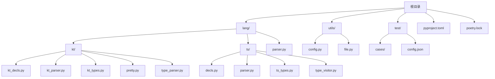
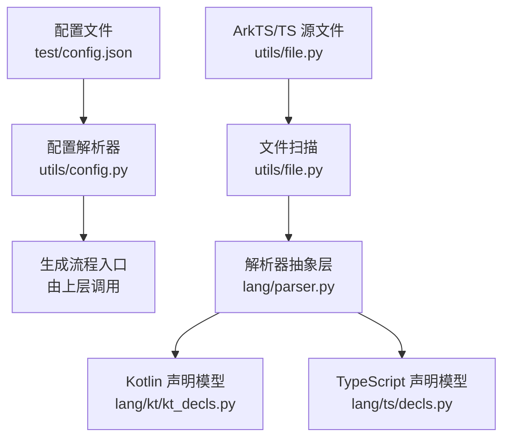
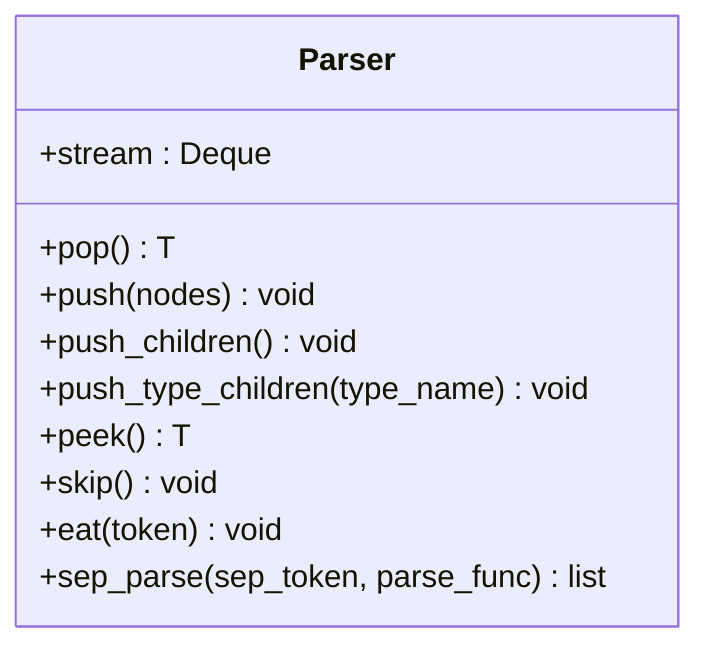
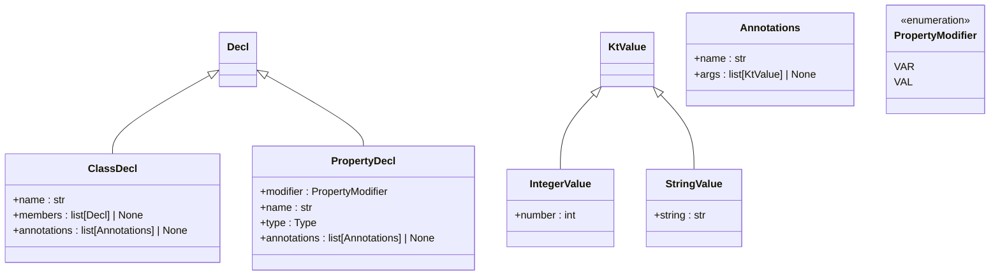
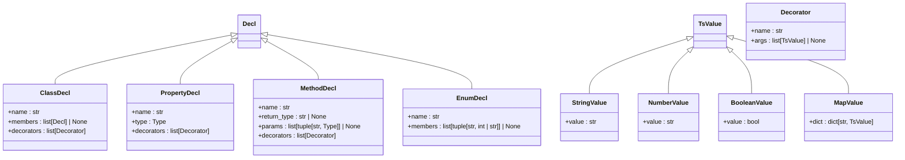
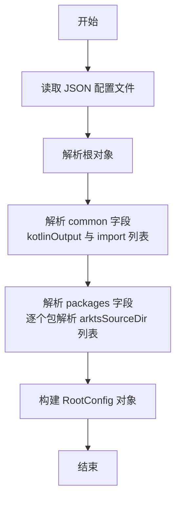
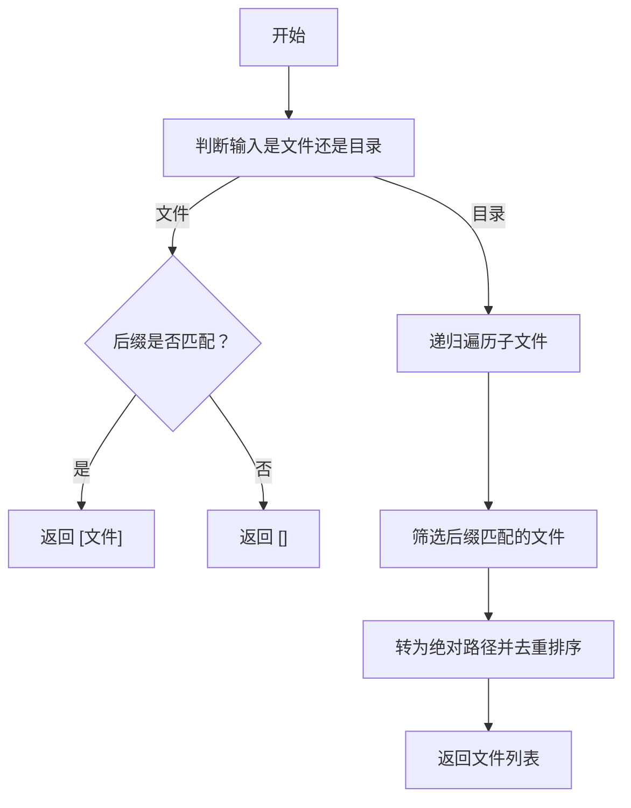
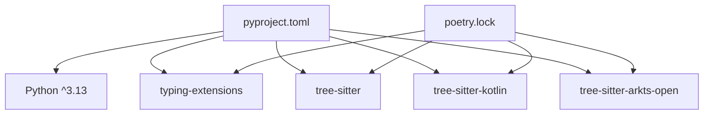
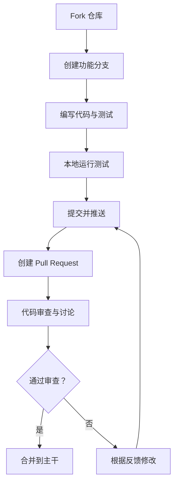

# 贡献流程规范

<cite>
**本文引用的文件**
- [pyproject.toml](file://pyproject.toml)
- [poetry.lock](file://poetry.lock)
- [test/config.json](file://test/config.json)
- [utils/config.py](file://utils/config.py)
- [utils/file.py](file://utils/file.py)
- [lang/parser.py](file://lang/parser.py)
- [lang/kt/kt_decls.py](file://lang/kt/kt_decls.py)
- [lang/ts/decls.py](file://lang/ts/decls.py)
</cite>

## 目录
1. [简介](#简介)
2. [项目结构](#项目结构)
3. [核心组件](#核心组件)
4. [架构总览](#架构总览)
5. [详细组件分析](#详细组件分析)
6. [依赖分析](#依赖分析)
7. [性能考虑](#性能考虑)
8. [故障排查指南](#故障排查指南)
9. [结论](#结论)
10. [附录](#附录)

## 简介
本文件为“贡献流程规范”的权威说明，面向希望参与本项目的开发者，涵盖从 Fork 到 Pull Request 的完整流程、分支与合并策略、代码审查要点、编码规范与风格指南、测试要求与覆盖率标准、文档贡献方式、开发环境搭建、问题报告与功能请求模板、以及版本发布与变更日志维护规范。本项目基于 Python 实现，使用 Poetry 进行依赖与构建管理，围绕 Kotlin/ArkTS/TypeScript 解析与类型系统展开。

## 项目结构
项目采用按领域分层的组织方式：语言解析模块（lang）、工具模块（utils）、测试配置与用例（test），以及构建与依赖定义（pyproject.toml、poetry.lock）。

图表来源
- [pyproject.toml](file://pyproject.toml#L8-L12)
- [utils/config.py](file://utils/config.py#L9-L25)
- [utils/file.py](file://utils/file.py#L1-L32)
- [lang/parser.py](file://lang/parser.py#L1-L57)
- [lang/kt/kt_decls.py](file://lang/kt/kt_decls.py#L1-L51)
- [lang/ts/decls.py](file://lang/ts/decls.py#L1-L57)

章节来源
- [pyproject.toml](file://pyproject.toml#L8-L12)
- [utils/config.py](file://utils/config.py#L9-L25)
- [utils/file.py](file://utils/file.py#L1-L32)
- [lang/parser.py](file://lang/parser.py#L1-L57)
- [lang/kt/kt_decls.py](file://lang/kt/kt_decls.py#L1-L51)
- [lang/ts/decls.py](file://lang/ts/decls.py#L1-L57)

## 核心组件
- 语言解析器抽象层：提供统一的流式解析器接口与通用操作（弹出、推入、窥视、跳过、匹配分隔符等），用于构建 Kotlin/ArkTS/TypeScript 的语法树解析流程。
- Kotlin/ArkTS 声明模型：定义类、属性、注解等声明结构，支持数据类与枚举，便于生成目标语言代码。
- TypeScript 声明模型：定义类、属性、方法、装饰器、枚举等声明结构，支持值类型与装饰器集合。
- 配置解析工具：从 JSON 配置文件中解析通用导出参数与包级源码路径，确保生成流程可配置化。
- 文件扫描工具：递归收集指定扩展名的 ArkTS/TS 源文件，支持去重与排序，便于批量处理。

章节来源
- [lang/parser.py](file://lang/parser.py#L8-L57)
- [lang/kt/kt_decls.py](file://lang/kt/kt_decls.py#L10-L51)
- [lang/ts/decls.py](file://lang/ts/decls.py#L4-L57)
- [utils/config.py](file://utils/config.py#L45-L62)
- [utils/file.py](file://utils/file.py#L7-L32)

## 架构总览
下图展示从配置到文件扫描再到解析器的工作流，体现各模块间的职责边界与交互关系。

图表来源
- [test/config.json](file://test/config.json#L1-L27)
- [utils/config.py](file://utils/config.py#L45-L62)
- [utils/file.py](file://utils/file.py#L7-L32)
- [lang/parser.py](file://lang/parser.py#L8-L57)
- [lang/kt/kt_decls.py](file://lang/kt/kt_decls.py#L10-L51)
- [lang/ts/decls.py](file://lang/ts/decls.py#L4-L57)

## 详细组件分析

### 组件一：解析器抽象层（Parser）
- 职责：提供统一的流式解析器接口，支持节点/令牌的弹出、推入、窥视、跳过、匹配与分隔符驱动的序列解析。
- 关键点：
  - 使用双端队列作为输入流，保证顺序与高效插入/删除。
  - 提供 push_children 与 push_type_children，后者在类型校验失败时抛出语法错误，增强健壮性。
  - sep_parse 支持以分隔符为界进行序列解析，常用于参数列表、成员列表等。
- 复杂度：单次操作平均 O(1)，序列解析 O(n)。

图表来源
- [lang/parser.py](file://lang/parser.py#L8-L57)

章节来源
- [lang/parser.py](file://lang/parser.py#L8-L57)

### 组件二：Kotlin/ArkTS 声明模型（kt_decls）
- 职责：定义 Kotlin/ArkTS 的声明与值类型，包括类、属性、注解、修饰符等。
- 关键点：
  - 抽象基类 Decl 与 KtValue，派生出具体声明与值类型。
  - 数据类用于不可变结构，字段明确，便于序列化与比较。
  - 注解与修饰符通过列表存储，支持空值默认。
- 设计模式：使用数据类与枚举提升类型安全与可读性。

图表来源
- [lang/kt/kt_decls.py](file://lang/kt/kt_decls.py#L10-L51)

章节来源
- [lang/kt/kt_decls.py](file://lang/kt/kt_decls.py#L10-L51)

### 组件三：TypeScript 声明模型（ts/decls）
- 职责：定义 TypeScript 的声明与值类型，包括类、属性、方法、装饰器、枚举等。
- 关键点：
  - 使用构造函数初始化值类型与声明对象，字段清晰。
  - 装饰器与声明均支持可选列表，默认为空。
  - 方法声明支持可选返回类型与参数列表。
- 设计模式：通过构造函数集中初始化，减少样板代码。

图表来源
- [lang/ts/decls.py](file://lang/ts/decls.py#L4-L57)

章节来源
- [lang/ts/decls.py](file://lang/ts/decls.py#L4-L57)

### 组件四：配置解析工具（utils/config.py）
- 职责：从 JSON 配置文件中解析通用导出参数与包级源码路径，输出强类型的配置对象。
- 关键点：
  - 使用 dataclass 定义不可变配置结构，字段带槽位优化内存。
  - 严格的类型检查与错误定位，确保配置一致性。
  - 支持命令行运行，便于快速验证配置正确性。

图表来源
- [utils/config.py](file://utils/config.py#L45-L62)

章节来源
- [utils/config.py](file://utils/config.py#L45-L62)

### 组件五：文件扫描工具（utils/file.py）
- 职责：递归扫描指定扩展名的 ArkTS/TS 源文件，支持文件与目录两种输入，返回绝对路径、去重、排序后的结果。
- 关键点：
  - 默认扩展集包含 .ets 与 .ts。
  - 输入路径不存在或既非文件也非目录时抛出异常，避免静默失败。
  - 返回路径统一为绝对路径，便于跨模块引用。

图表来源
- [utils/file.py](file://utils/file.py#L7-L32)

章节来源
- [utils/file.py](file://utils/file.py#L7-L32)

## 依赖分析
- 构建与运行时依赖：Python 版本要求与核心库在 pyproject.toml 中定义；Poetry 锁定文件记录了精确版本与可选 extras。
- 语言解析依赖：tree-sitter 与相关语言语法包（如 Kotlin、ArkTS Open）用于解析源码，提供稳定的语法树基础。
- 可选测试依赖：JSON、HTML、JavaScript、Rust 等语言的语法包，用于扩展测试覆盖范围。

图表来源
- [pyproject.toml](file://pyproject.toml#L15-L21)
- [poetry.lock](file://poetry.lock#L3-L111)

章节来源
- [pyproject.toml](file://pyproject.toml#L15-L21)
- [poetry.lock](file://poetry.lock#L3-L111)

## 性能考虑
- 解析器流式处理：使用双端队列实现 O(1) 的头部/尾部操作，适合自顶向下与回溯场景。
- 配置解析：一次性加载与严格类型检查，避免运行时重复解析带来的开销。
- 文件扫描：递归遍历配合后缀过滤与去重排序，建议在 CI 中缓存中间结果以减少磁盘 IO。
- 依赖锁定：Poetry 锁定文件确保一致的依赖版本，避免因版本漂移导致的性能波动。

## 故障排查指南
- 配置解析错误
  - 现象：运行配置解析器时报错，提示期望对象/数组/字符串但实际类型不符。
  - 排查：检查 JSON 结构与键名拼写，确认 common 与 packages 字段存在且类型正确。
  - 参考：配置解析器中的类型检查与错误定位逻辑。
- 文件扫描异常
  - 现象：传入无效路径或既非文件也非目录时抛出异常。
  - 排查：确认输入路径存在且类型正确；若为目录，确保其可读且包含目标扩展名文件。
- 解析器类型不匹配
  - 现象：push_type_children 或 eat 操作抛出语法错误。
  - 排查：检查当前节点类型与预期类型是否一致；必要时在上层增加容错或日志打印。

章节来源
- [utils/config.py](file://utils/config.py#L27-L43)
- [utils/file.py](file://utils/file.py#L23-L24)
- [lang/parser.py](file://lang/parser.py#L31-L47)

## 结论
本规范明确了从 Fork 到 PR 的贡献流程、分支与合并策略、代码审查要点、编码规范与风格指南、测试要求与覆盖率标准、文档贡献方式、开发环境搭建、问题报告与功能请求模板，以及版本发布与变更日志维护规范。请在提交前对照本规范完成自检，并在 PR 描述中引用相关 issue 编号与变更摘要，以便评审与合并。

## 附录

### 贡献流程总览（概念性）

### 开发环境搭建
- 安装 Python 与 Poetry
  - Python 版本要求见构建配置。
  - Poetry 作为构建与依赖管理工具。
- 安装依赖
  - 使用 Poetry 安装项目依赖与可选 extras。
- 验证环境
  - 运行配置解析器示例，检查输出与 JSON 配置一致。
  - 执行文件扫描工具，确认能正确发现目标源文件。

章节来源
- [pyproject.toml](file://pyproject.toml#L15-L21)
- [poetry.lock](file://poetry.lock#L3-L111)
- [utils/config.py](file://utils/config.py#L64-L82)
- [utils/file.py](file://utils/file.py#L7-L32)

### 编码规范与风格指南
- Python 风格
  - 使用数据类与枚举提升类型安全与可读性。
  - 明确字段类型注解，保持一致的缩进与换行。
  - 将公共接口与内部实现分离，避免魔法数字与字符串。
- 命名约定
  - 类型与类名使用 PascalCase；变量与函数使用 snake_case。
  - 常量使用 UPPER_SNAKE_CASE。
- 注释规范
  - 公共 API 添加简要说明与参数/返回值说明。
  - 复杂逻辑添加步骤说明与边界条件提示。
- 代码组织
  - 按领域拆分模块，避免循环依赖。
  - 单元测试与集成测试分离，测试命名清晰。

### 测试要求与覆盖率标准
- 单元测试
  - 每个模块至少覆盖核心路径与边界条件。
  - 配置解析与文件扫描需包含错误输入的测试用例。
- 集成测试
  - 使用真实源文件与配置，验证解析链路完整性。
- 覆盖率
  - 建议语句覆盖率不低于 80%，关键路径不低于 90%。

### 文档贡献方式与格式要求
- 文档格式
  - 使用 Markdown，标题层级清晰，段落分明。
  - 图表使用 Mermaid，标注来源文件与行号。
- 内容要求
  - 新增功能必须配套使用说明与示例。
  - 修改行为需同步更新变更日志与迁移指南。

### 问题报告与功能请求模板
- 问题报告
  - 环境信息：操作系统、Python 版本、依赖版本。
  - 复现步骤：最小可复现工程或命令。
  - 期望与实际结果：清晰对比。
  - 日志与截图：便于定位问题。
- 功能请求
  - 背景与动机：为什么需要该功能。
  - 使用场景：典型用例与边界情况。
  - 接口设计：建议的 API 与配置项。
  - 兼容性：对现有行为的影响评估。

### 版本发布流程与变更日志维护规范
- 版本号规则
  - 采用语义化版本：主版本.次版本.修订号。
- 发布流程
  - 合并前确保所有测试通过与文档更新。
  - 更新变更日志，记录新增特性、修复与破坏性变更。
  - 创建标签并发布到包管理平台（如 Poetry）。
- 变更日志
  - 分类记录：新增、改进、修复、破坏性变更。
  - 引用相关 PR 与作者，便于追溯。