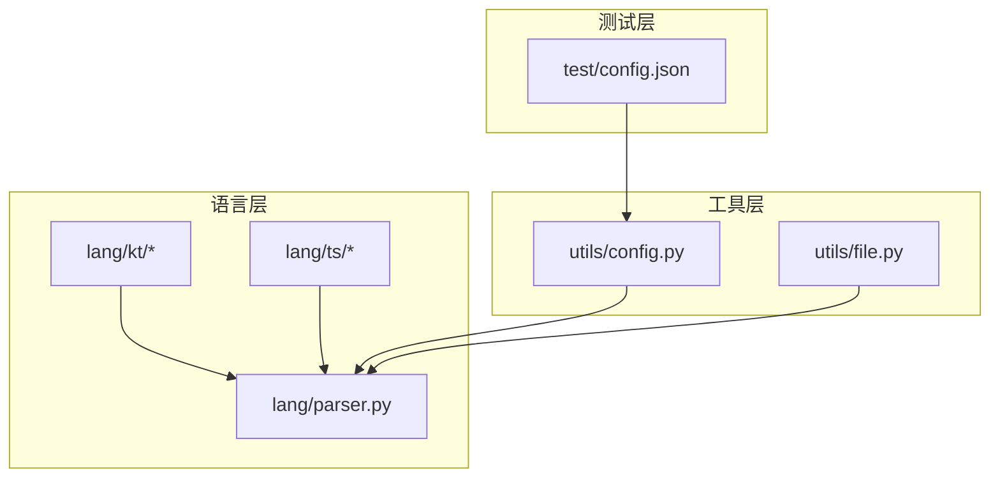
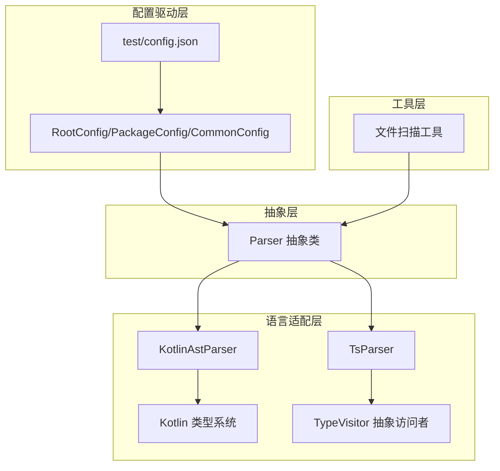
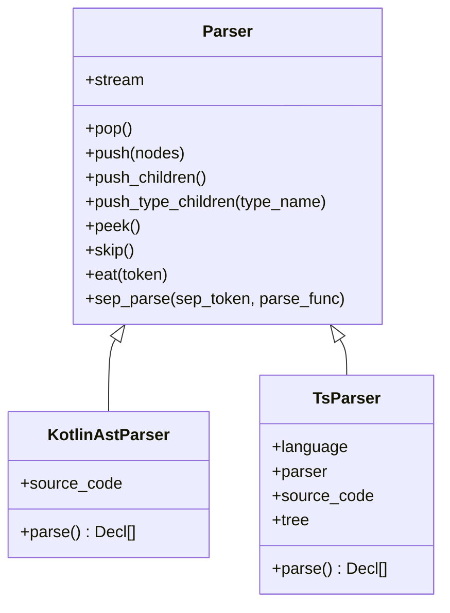
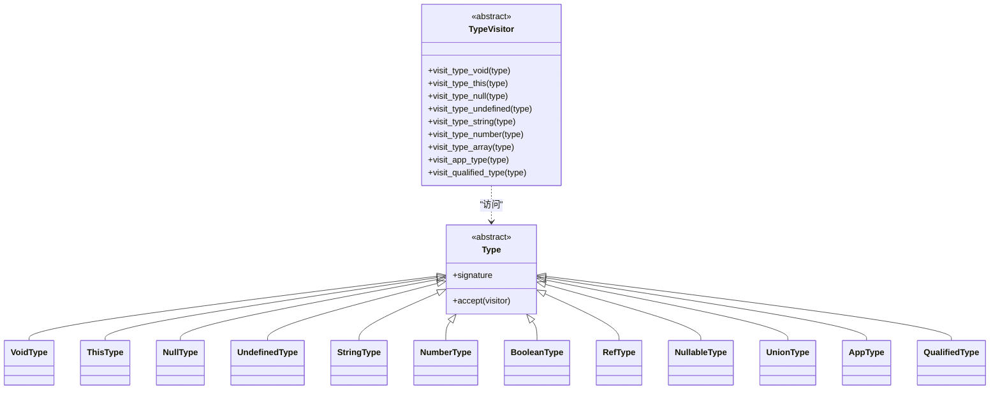
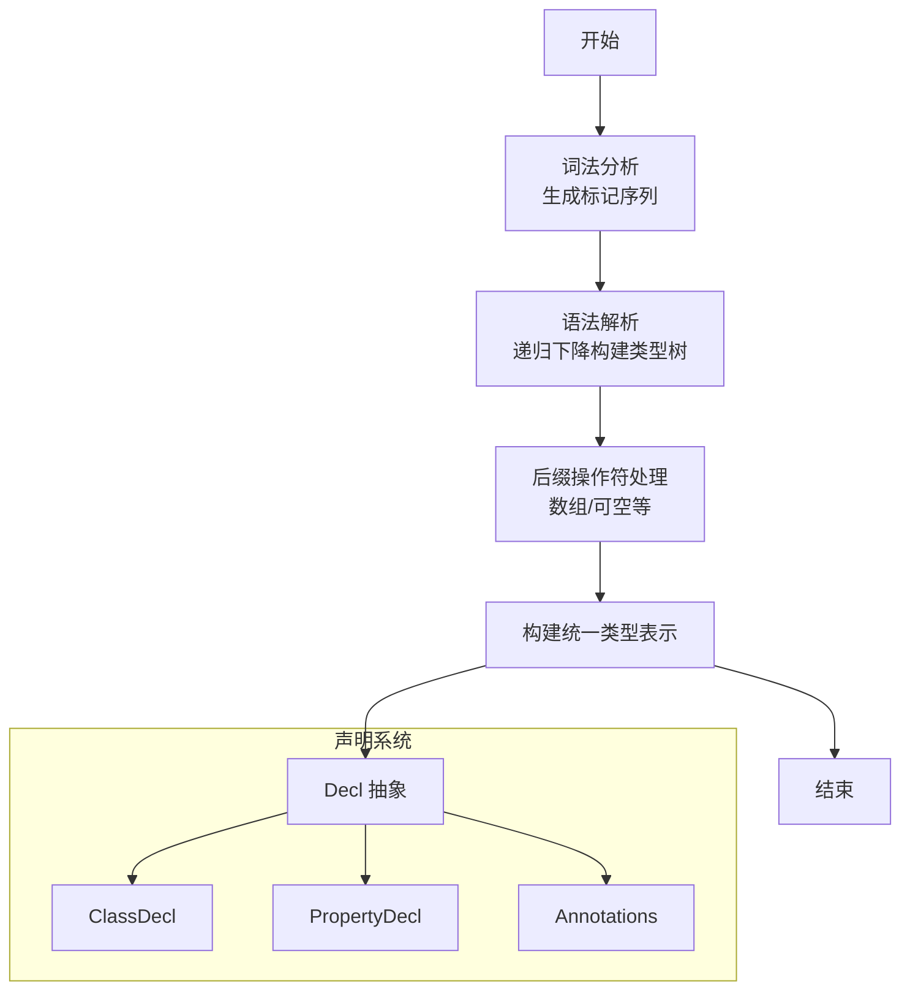
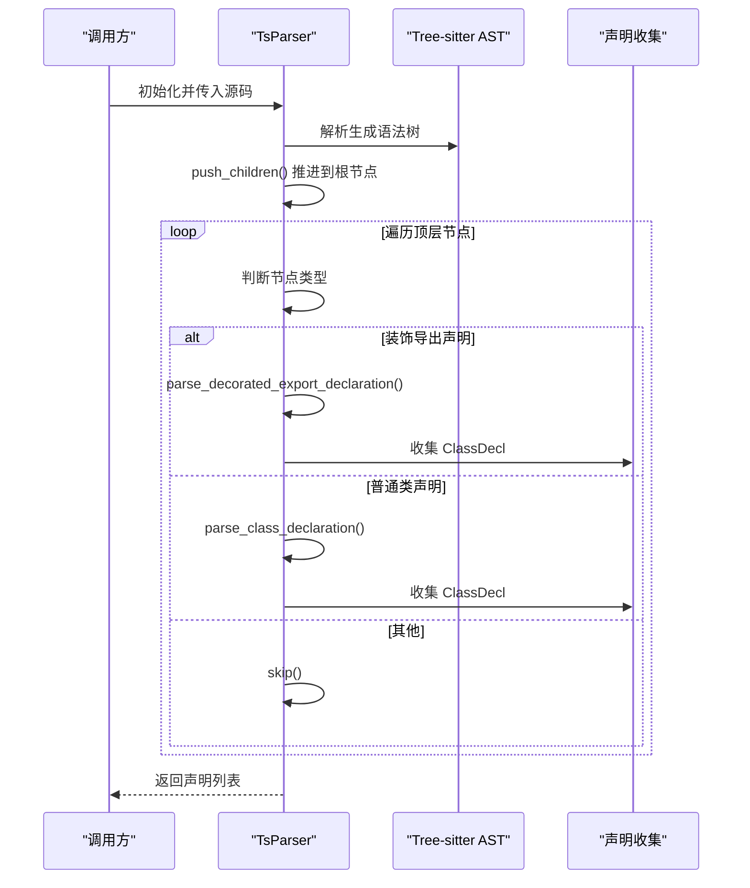
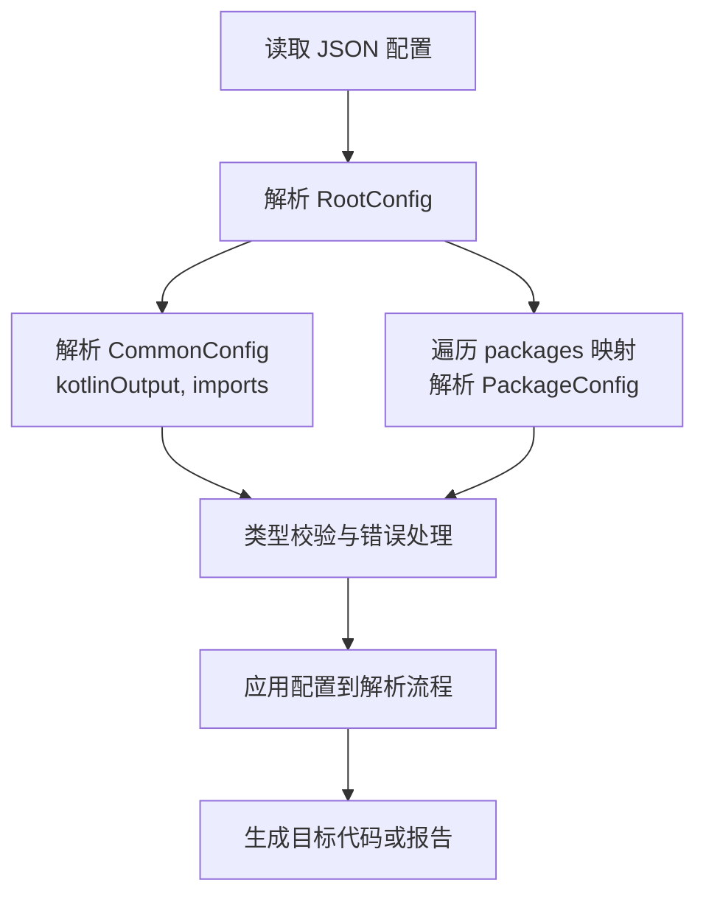
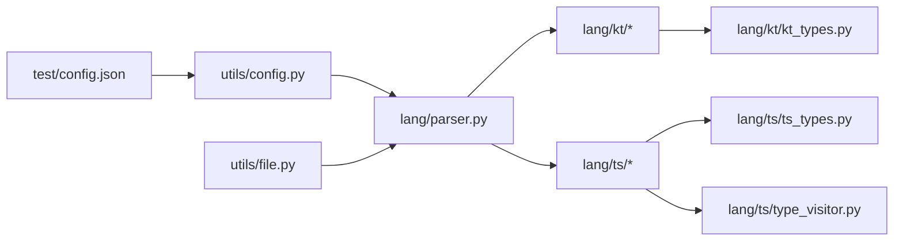

# 项目架构设计

<cite>
**本文档引用的文件**
- [lang/parser.py](file://lang/parser.py)
- [utils/config.py](file://utils/config.py)
- [lang/kt/kt_parser.py](file://lang/kt/kt_parser.py)
- [lang/ts/parser.py](file://lang/ts/parser.py)
- [lang/kt/kt_decls.py](file://lang/kt/kt_decls.py)
- [lang/ts/decls.py](file://lang/ts/decls.py)
- [lang/kt/type_parser.py](file://lang/kt/type_parser.py)
- [lang/ts/type_visitor.py](file://lang/ts/type_visitor.py)
- [lang/kt/kt_types.py](file://lang/kt/kt_types.py)
- [lang/ts/ts_types.py](file://lang/ts/ts_types.py)
- [utils/file.py](file://utils/file.py)
- [test/config.json](file://test/config.json)
- [pyproject.toml](file://pyproject.toml)
</cite>

## 目录
1. [简介](#简介)
2. [项目结构](#项目结构)
3. [核心组件](#核心组件)
4. [架构总览](#架构总览)
5. [详细组件分析](#详细组件分析)
6. [依赖关系分析](#依赖关系分析)
7. [性能考虑](#性能考虑)
8. [故障排除指南](#故障排除指南)
9. [结论](#结论)
10. [附录](#附录)

## 简介
本项目是一个跨语言声明解析与类型系统转换工具，支持从 Kotlin 和 ArkTS（TypeScript）源码中提取声明信息，并通过统一的类型系统进行建模与处理。项目采用分层架构与模块化设计，结合抽象工厂模式、访问者模式以及配置驱动架构，实现了可扩展、可维护且易于扩展的解析与类型处理体系。

## 项目结构
项目采用按语言分层的模块化组织方式：
- lang：语言解析与类型系统核心
  - parser.py：通用流式解析器抽象基类
  - kt：Kotlin 解析与类型系统
  - ts：ArkTS/TypeScript 解析与类型系统
- utils：通用工具与配置管理
  - config.py：配置解析与数据模型
  - file.py：文件扫描与过滤工具
- test：测试用例与配置示例

**图表来源**
- [lang/parser.py](file://lang/parser.py#L8-L57)
- [lang/kt/kt_parser.py](file://lang/kt/kt_parser.py#L1-L242)
- [lang/ts/parser.py](file://lang/ts/parser.py#L1-L242)
- [utils/config.py](file://utils/config.py#L1-L84)
- [utils/file.py](file://utils/file.py#L1-L32)
- [test/config.json](file://test/config.json#L1-L27)

**章节来源**
- [pyproject.toml](file://pyproject.toml#L8-L12)

## 核心组件
本节概述项目的关键组件及其职责：
- 抽象解析器基类：提供统一的流式解析接口与通用辅助方法，为 Kotlin 与 ArkTS 解析器提供继承基础。
- 声明类型系统：定义抽象声明与具体声明类型，用于承载解析后的结构化信息。
- 类型系统：为 Kotlin 与 ArkTS 提供独立但可互操作的类型表示与转换逻辑。
- 配置管理模块：以数据类形式描述配置结构，提供 JSON 解析与校验。
- 文件工具：提供 ArkTS/Kotlin 源文件递归扫描与过滤能力。

**章节来源**
- [lang/parser.py](file://lang/parser.py#L8-L57)
- [lang/kt/kt_decls.py](file://lang/kt/kt_decls.py#L10-L51)
- [lang/ts/decls.py](file://lang/ts/decls.py#L4-L57)
- [lang/kt/kt_types.py](file://lang/kt/kt_types.py#L52-L191)
- [lang/ts/ts_types.py](file://lang/ts/ts_types.py#L8-L280)
- [utils/config.py](file://utils/config.py#L9-L61)
- [utils/file.py](file://utils/file.py#L7-L32)

## 架构总览
项目采用“分层 + 多语言适配”的架构模式：
- 抽象层：Parser 抽象类提供统一的流式解析能力，子类负责具体语言语法细节。
- 语言适配层：Kotlin 与 ArkTS 各自实现解析器与类型系统，共享声明与类型抽象。
- 配置驱动层：通过 JSON 配置文件驱动输出路径、导入列表与包目录等参数。
- 工具层：文件扫描与过滤，配合配置驱动完成批量处理。

**图表来源**
- [lang/parser.py](file://lang/parser.py#L8-L57)
- [lang/kt/kt_parser.py](file://lang/kt/kt_parser.py#L199-L235)
- [lang/ts/parser.py](file://lang/ts/parser.py#L10-L218)
- [lang/kt/kt_types.py](file://lang/kt/kt_types.py#L52-L191)
- [lang/ts/type_visitor.py](file://lang/ts/type_visitor.py#L5-L32)
- [utils/config.py](file://utils/config.py#L22-L61)
- [test/config.json](file://test/config.json#L1-L27)
- [utils/file.py](file://utils/file.py#L7-L32)

## 详细组件分析

### 抽象工厂模式与多语言解析器
项目通过抽象基类与具体子类实现“工厂式”的解析器创建与使用：
- 抽象工厂：Parser 抽象类作为工厂接口，定义统一的流式解析行为。
- 具体工厂：KotlinAstParser 与 TsParser 分别代表 Kotlin 与 ArkTS 的解析器工厂实现。
- 使用方式：调用方仅依赖抽象接口，无需关心具体语言实现细节。

**图表来源**
- [lang/parser.py](file://lang/parser.py#L8-L57)
- [lang/kt/kt_parser.py](file://lang/kt/kt_parser.py#L199-L235)
- [lang/ts/parser.py](file://lang/ts/parser.py#L10-L218)

**章节来源**
- [lang/parser.py](file://lang/parser.py#L8-L57)
- [lang/kt/kt_parser.py](file://lang/kt/kt_parser.py#L199-L235)
- [lang/ts/parser.py](file://lang/ts/parser.py#L10-L218)

### 访问者模式与类型系统
ArkTS 类型系统采用访问者模式，通过 TypeVisitor 抽象类定义对不同类型的操作接口，便于扩展新的类型处理逻辑而不修改现有类型定义。

**图表来源**
- [lang/ts/ts_types.py](file://lang/ts/ts_types.py#L8-L280)
- [lang/ts/type_visitor.py](file://lang/ts/type_visitor.py#L5-L32)

**章节来源**
- [lang/ts/ts_types.py](file://lang/ts/ts_types.py#L8-L280)
- [lang/ts/type_visitor.py](file://lang/ts/type_visitor.py#L5-L32)

### Kotlin 类型解析器与声明系统
Kotlin 类型解析器采用词法与语法分离的方式，先将字符串切分为标记，再进行递归下降解析，最终生成统一的类型表示。声明系统通过数据类定义类、属性等结构，支持注解与修饰符信息的保留。

**图表来源**
- [lang/kt/type_parser.py](file://lang/kt/type_parser.py#L40-L151)
- [lang/kt/kt_types.py](file://lang/kt/kt_types.py#L52-L191)
- [lang/kt/kt_decls.py](file://lang/kt/kt_decls.py#L10-L51)

**章节来源**
- [lang/kt/type_parser.py](file://lang/kt/type_parser.py#L40-L151)
- [lang/kt/kt_types.py](file://lang/kt/kt_types.py#L52-L191)
- [lang/kt/kt_decls.py](file://lang/kt/kt_decls.py#L10-L51)

### ArkTS 解析流程
TsParser 继承自 Parser，基于 Tree-sitter 的 ArkTS 语法树进行流式解析，支持装饰器、类型注解、类声明等特性。解析过程通过 push_children/push_type_children 等方法控制节点推进与类型分支选择。

**图表来源**
- [lang/ts/parser.py](file://lang/ts/parser.py#L10-L218)

**章节来源**
- [lang/ts/parser.py](file://lang/ts/parser.py#L10-L218)

### 配置驱动架构
配置驱动架构通过 JSON 文件定义通用配置与包配置，使用数据类进行强类型解析与校验，确保配置变更不影响核心解析逻辑。

**图表来源**
- [utils/config.py](file://utils/config.py#L45-L61)
- [test/config.json](file://test/config.json#L1-L27)

**章节来源**
- [utils/config.py](file://utils/config.py#L45-L61)
- [test/config.json](file://test/config.json#L1-L27)

### 文件扫描与批量处理
文件扫描工具提供 ArkTS/TS 文件的递归收集能力，支持自定义扩展名集合，返回绝对路径、去重与排序后的结果，便于与配置驱动架构协同工作。

**章节来源**
- [utils/file.py](file://utils/file.py#L7-L32)

## 依赖关系分析
项目模块间依赖清晰，遵循“低耦合、高内聚”的设计原则：
- 语言层依赖抽象解析器与类型系统，避免直接依赖具体实现。
- 配置层与工具层为解析层提供输入与环境支持。
- 测试层提供配置示例与用例文件，验证解析与类型系统的正确性。

**图表来源**
- [lang/parser.py](file://lang/parser.py#L8-L57)
- [lang/kt/kt_parser.py](file://lang/kt/kt_parser.py#L1-L242)
- [lang/ts/parser.py](file://lang/ts/parser.py#L1-L242)
- [lang/kt/kt_types.py](file://lang/kt/kt_types.py#L1-L191)
- [lang/ts/ts_types.py](file://lang/ts/ts_types.py#L1-L280)
- [lang/ts/type_visitor.py](file://lang/ts/type_visitor.py#L1-L32)
- [utils/config.py](file://utils/config.py#L1-L84)
- [utils/file.py](file://utils/file.py#L1-L32)
- [test/config.json](file://test/config.json#L1-L27)

**章节来源**
- [lang/parser.py](file://lang/parser.py#L8-L57)
- [utils/config.py](file://utils/config.py#L1-L84)
- [utils/file.py](file://utils/file.py#L1-L32)

## 性能考虑
- 解析器性能：Tree-sitter 提供高性能的语法树解析，建议在大规模文件处理时启用增量解析与缓存策略。
- 类型系统优化：Kotlin 类型解析采用标记化与递归下降，建议对常见类型进行缓存以减少重复解析成本。
- 内存管理：声明与类型对象采用不可变数据类，有利于垃圾回收与并发安全；注意避免在解析过程中产生过多中间对象。
- 批量处理：文件扫描工具已提供去重与排序，建议在外部引入分片与并行处理机制以提升吞吐量。

## 故障排除指南
- 解析错误：检查源码是否符合目标语言语法规则，确认 Tree-sitter 语法库版本兼容性。
- 类型不匹配：核对 Kotlin 类型字符串与解析器期望格式，确保泛型、数组与可空类型书写正确。
- 配置错误：验证 JSON 结构与字段名称，确保路径存在且具有读权限。
- 文件未发现：确认文件扩展名集合与实际文件扩展名一致，检查路径是否存在。

**章节来源**
- [lang/kt/kt_parser.py](file://lang/kt/kt_parser.py#L16-L18)
- [lang/kt/type_parser.py](file://lang/kt/type_parser.py#L18-L20)
- [utils/config.py](file://utils/config.py#L27-L43)

## 结论
本项目通过抽象工厂模式、访问者模式与配置驱动架构，构建了可扩展、可维护的语言解析与类型处理系统。分层与模块化设计使得新增语言支持与类型扩展变得简单，同时配置驱动架构提供了灵活的运行时定制能力。建议在未来进一步引入增量解析、类型推断与插件化扩展点，以满足更复杂的工程需求。

## 附录
- 设计决策与权衡
  - 抽象工厂模式：通过 Parser 抽象类隔离语言差异，降低调用方复杂度。
  - 访问者模式：TypeVisitor 将类型处理逻辑与类型定义解耦，便于扩展新类型处理。
  - 配置驱动：JSON 配置提供运行时可调参数，减少硬编码与编译期耦合。
- 扩展点与插件化思路
  - 新增语言：实现 Parser 子类与对应类型系统，保持与现有抽象一致。
  - 新增类型处理：扩展 TypeVisitor 子类或添加新的访问方法，避免修改既有类型定义。
  - 插件化：通过配置注册解析器与类型处理器，实现动态加载与替换。