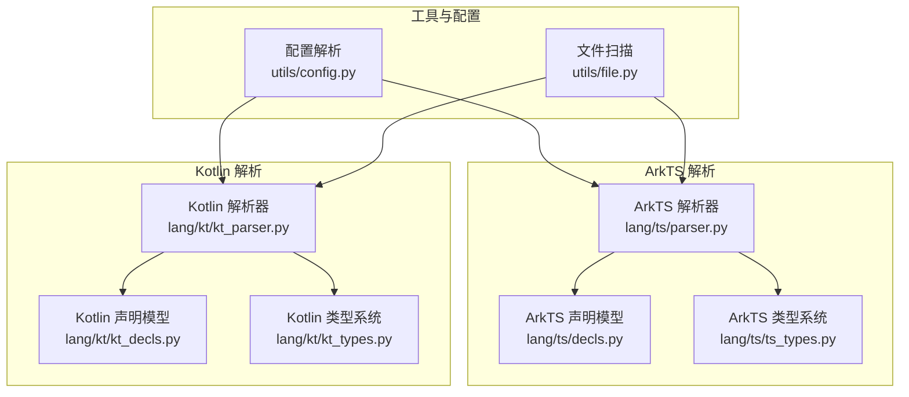
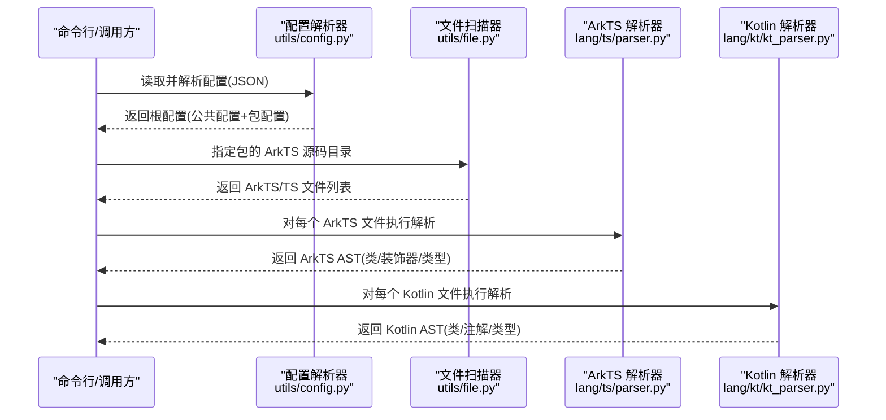
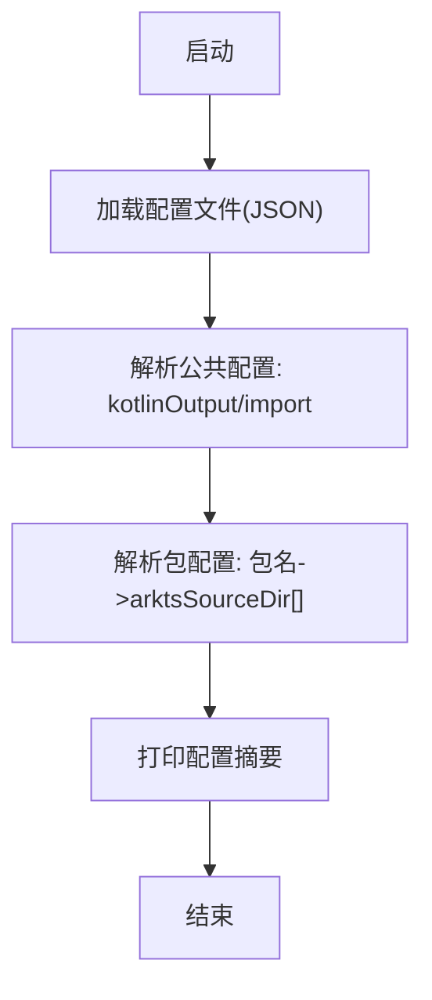
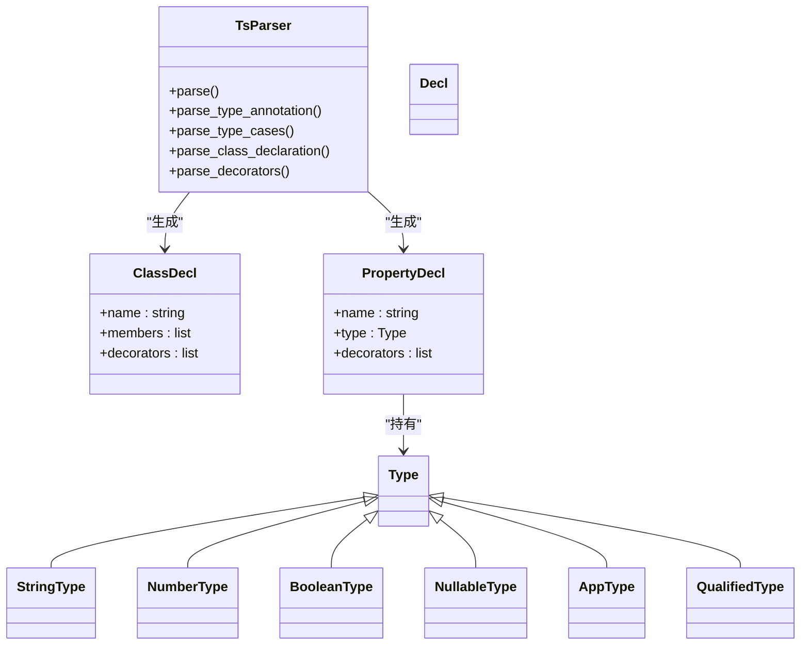
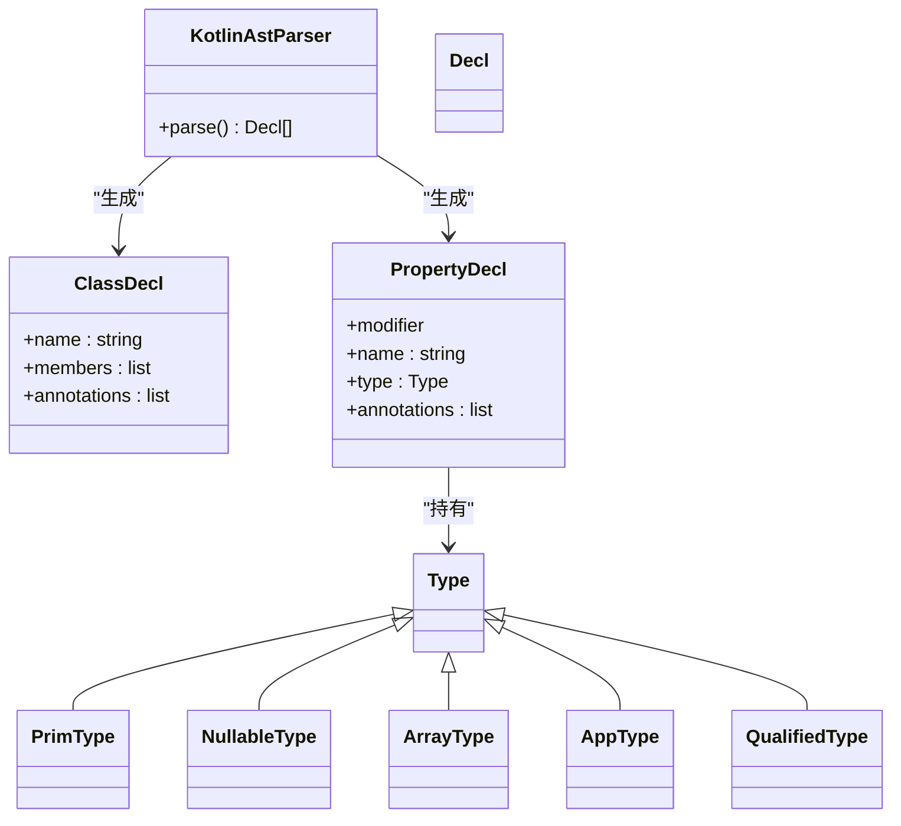
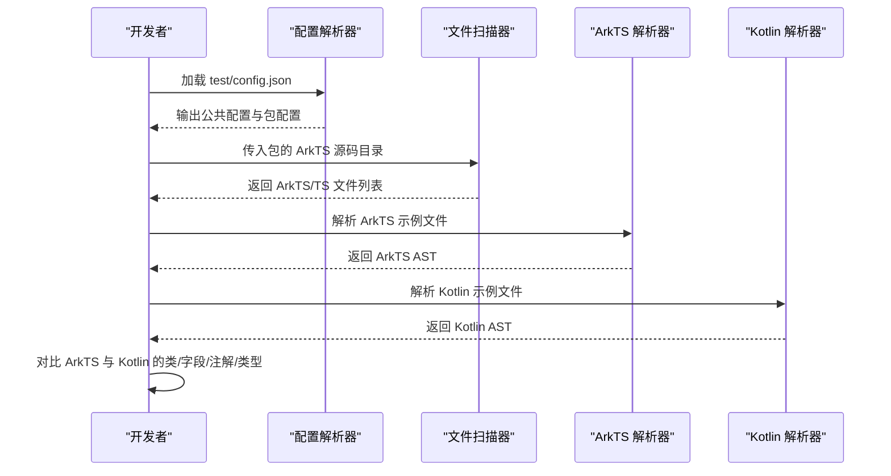
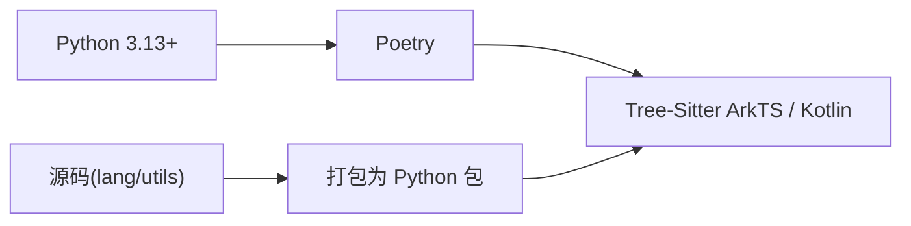

# 快速开始

<cite>
**本文引用的文件**
- [pyproject.toml](file://pyproject.toml)
- [test/config.json](file://test/config.json)
- [utils/config.py](file://utils/config.py)
- [utils/file.py](file://utils/file.py)
- [lang/parser.py](file://lang/parser.py)
- [lang/ts/parser.py](file://lang/ts/parser.py)
- [lang/ts/decls.py](file://lang/ts/decls.py)
- [lang/ts/ts_types.py](file://lang/ts/ts_types.py)
- [lang/kt/kt_parser.py](file://lang/kt/kt_parser.py)
- [lang/kt/kt_decls.py](file://lang/kt/kt_decls.py)
- [lang/kt/kt_types.py](file://lang/kt/kt_types.py)
- [test/cases/class0.ts](file://test/cases/class0.ts)
- [test/cases/class1.ts](file://test/cases/class1.ts)
- [test/cases/kt/class0.kt](file://test/cases/kt/class0.kt)
</cite>

## 目录
1. [简介](#简介)
2. [项目结构](#项目结构)
3. [核心组件](#核心组件)
4. [架构总览](#架构总览)
5. [详细组件分析](#详细组件分析)
6. [依赖分析](#依赖分析)
7. [性能考虑](#性能考虑)
8. [故障排除指南](#故障排除指南)
9. [结论](#结论)
10. [附录](#附录)

## 简介
本指南面向希望使用 Python 驱动的 ArkTS FFI Kotlin 转换工具链的开发者，目标是帮助你在最短时间内完成环境准备、安装与基础配置，并通过一个完整的“第一个转换示例”掌握从 ArkTS 到 Kotlin 的转换流程。你将看到 ArkTS 源码、Kotlin 源码与配置文件的对照，以及 CLI 工具的运行方式与常见问题排查。

## 项目结构
该仓库采用按语言分层的模块化组织方式：语言解析器位于 lang/ 下，工具函数位于 utils/，测试样例位于 test/。核心能力包括：
- ArkTS 解析：基于 Tree-Sitter ArkTS 语法树解析 ArkTS 类型与装饰器信息。
- Kotlin 解析：基于 Tree-Sitter Kotlin 语法树解析 Kotlin 类与注解。
- 配置解析：读取 JSON 配置，确定输出目录与导入列表，以及包级 ArkTS 源码目录。
- 文件扫描：递归收集 ArkTS/TS 文件路径，支持多种扩展名。

图表来源
- [utils/config.py](file://utils/config.py#L45-L61)
- [utils/file.py](file://utils/file.py#L7-L32)
- [lang/ts/parser.py](file://lang/ts/parser.py#L25-L231)
- [lang/ts/decls.py](file://lang/ts/decls.py#L32-L57)
- [lang/ts/ts_types.py](file://lang/ts/ts_types.py#L8-L280)
- [lang/kt/kt_parser.py](file://lang/kt/kt_parser.py#L199-L231)
- [lang/kt/kt_decls.py](file://lang/kt/kt_decls.py#L34-L51)
- [lang/kt/kt_types.py](file://lang/kt/kt_types.py#L52-L191)

章节来源
- [pyproject.toml](file://pyproject.toml#L1-L26)
- [utils/config.py](file://utils/config.py#L45-L61)
- [utils/file.py](file://utils/file.py#L7-L32)
- [lang/ts/parser.py](file://lang/ts/parser.py#L25-L231)
- [lang/kt/kt_parser.py](file://lang/kt/kt_parser.py#L199-L231)

## 核心组件
- 配置解析器：负责加载 JSON 配置，校验字段类型，生成根配置对象，供其他模块消费。
- 文件扫描器：递归扫描指定目录下的 ArkTS/TS 文件，返回去重、排序后的绝对路径列表。
- ArkTS 解析器：基于 Tree-Sitter ArkTS 语法，解析类声明、装饰器、属性与类型表达式。
- Kotlin 解析器：基于 Tree-Sitter Kotlin 语法，解析类声明、注解、属性与类型表达式。
- 类型系统：为 ArkTS/Kotlin 提供统一的类型表示与判定工具（如可空、数组、映射、基本类型等）。

章节来源
- [utils/config.py](file://utils/config.py#L45-L61)
- [utils/file.py](file://utils/file.py#L7-L32)
- [lang/ts/parser.py](file://lang/ts/parser.py#L25-L231)
- [lang/kt/kt_parser.py](file://lang/kt/kt_parser.py#L199-L231)
- [lang/ts/ts_types.py](file://lang/ts/ts_types.py#L204-L237)
- [lang/kt/kt_types.py](file://lang/kt/kt_types.py#L126-L191)

## 架构总览
下图展示了从配置到文件扫描再到解析器的工作流，以及 ArkTS 与 Kotlin 两套解析器之间的关系。

图表来源
- [utils/config.py](file://utils/config.py#L45-L61)
- [utils/file.py](file://utils/file.py#L7-L32)
- [lang/ts/parser.py](file://lang/ts/parser.py#L25-L231)
- [lang/kt/kt_parser.py](file://lang/kt/kt_parser.py#L199-L231)

## 详细组件分析

### 配置解析与 CLI 使用
- 配置文件结构要点
  - 公共配置(common)
    - kotlinOutput：Kotlin 输出目录
    - import：需要在生成的 Kotlin 代码中引入的包列表
  - 包配置(packages)
    - 以包名为键，值包含 arktsSourceDir 数组，用于定位 ArkTS 源码目录
- CLI 行为
  - 默认读取 test/config.json；也可传入自定义路径
  - 打印 kotlinOutput、import 列表与各包的 ArkTS 源码目录

图表来源
- [utils/config.py](file://utils/config.py#L45-L79)
- [test/config.json](file://test/config.json#L1-L27)

章节来源
- [utils/config.py](file://utils/config.py#L45-L79)
- [test/config.json](file://test/config.json#L1-L27)

### ArkTS 解析器与类型系统
- 解析能力
  - 支持装饰器解析（如 @ExportClass、@ExportField）
  - 支持类声明、属性声明、类型注解解析（基础类型、联合类型、泛型等）
- 类型系统
  - 提供基础类型、可空类型、引用类型、数组类型、应用类型、限定类型等
  - 提供 is_primitive_type、is_builtin_list_type、is_builtin_map_type 等判定工具

图表来源
- [lang/ts/parser.py](file://lang/ts/parser.py#L25-L231)
- [lang/ts/decls.py](file://lang/ts/decls.py#L32-L57)
- [lang/ts/ts_types.py](file://lang/ts/ts_types.py#L66-L179)

章节来源
- [lang/ts/parser.py](file://lang/ts/parser.py#L25-L231)
- [lang/ts/decls.py](file://lang/ts/decls.py#L32-L57)
- [lang/ts/ts_types.py](file://lang/ts/ts_types.py#L204-L237)

### Kotlin 解析器与类型系统
- 解析能力
  - 支持注解解析（如 @ShareClass、@ShareField 等）
  - 支持类声明、属性声明、修饰符（val/var）、类型解析
- 类型系统
  - 提供基础类型、可空类型、数组类型、应用类型、限定类型等
  - 提供 is_primitive_type、is_map_type、is_list_type 等判定工具

图表来源
- [lang/kt/kt_parser.py](file://lang/kt/kt_parser.py#L199-L231)
- [lang/kt/kt_decls.py](file://lang/kt/kt_decls.py#L34-L51)
- [lang/kt/kt_types.py](file://lang/kt/kt_types.py#L52-L191)

章节来源
- [lang/kt/kt_parser.py](file://lang/kt/kt_parser.py#L199-L231)
- [lang/kt/kt_decls.py](file://lang/kt/kt_decls.py#L34-L51)
- [lang/kt/kt_types.py](file://lang/kt/kt_types.py#L126-L191)

### 第一个转换示例（ArkTS → Kotlin）
- ArkTS 示例
  - 示例文件：test/cases/class0.ts、test/cases/class1.ts
  - 特征：使用 @ExportClass、@ExportField 等装饰器标记导出类与字段
- Kotlin 示例
  - 示例文件：test/cases/kt/class0.kt
  - 特征：使用 @ShareClass、@ShareField 等注解，字段类型标注为 Kotlin 原生类型与可空性
- 配置示例
  - 参考 test/config.json，设置 kotlinOutput、import 列表与包级 arktsSourceDir

图表来源
- [test/config.json](file://test/config.json#L1-L27)
- [utils/file.py](file://utils/file.py#L7-L32)
- [lang/ts/parser.py](file://lang/ts/parser.py#L25-L231)
- [lang/kt/kt_parser.py](file://lang/kt/kt_parser.py#L199-L231)
- [test/cases/class0.ts](file://test/cases/class0.ts#L1-L4)
- [test/cases/class1.ts](file://test/cases/class1.ts#L1-L5)
- [test/cases/kt/class0.kt](file://test/cases/kt/class0.kt#L1-L9)

章节来源
- [test/config.json](file://test/config.json#L1-L27)
- [utils/file.py](file://utils/file.py#L7-L32)
- [lang/ts/parser.py](file://lang/ts/parser.py#L25-L231)
- [lang/kt/kt_parser.py](file://lang/kt/kt_parser.py#L199-L231)
- [test/cases/class0.ts](file://test/cases/class0.ts#L1-L4)
- [test/cases/class1.ts](file://test/cases/class1.ts#L1-L5)
- [test/cases/kt/class0.kt](file://test/cases/kt/class0.kt#L1-L9)

## 依赖分析
- 运行时依赖
  - Python 3.13+
  - Poetry（用于项目构建与依赖管理）
  - Tree-Sitter ArkTS 与 Kotlin 语法库
- 项目打包
  - packages 字段包含 convert、lang、utils，表明这些子目录会被作为包发布

图表来源
- [pyproject.toml](file://pyproject.toml#L15-L21)

章节来源
- [pyproject.toml](file://pyproject.toml#L15-L21)

## 性能考虑
- 语法树解析成本
  - ArkTS/Kotlin 解析均基于 Tree-Sitter，解析复杂度与源码规模线性相关
  - 建议在大型工程中按包拆分处理，避免一次性解析过多文件
- 文件扫描
  - 文件扫描会递归遍历目录，建议仅扫描必要的 ArkTS 源码目录
- 类型判定
  - 类型判定函数（如 is_primitive_type、is_builtin_map_type）为纯函数，开销较小
- I/O 与内存
  - 大量文件读取与字符串拼接可能带来内存压力，建议分批处理并及时释放中间结果

## 故障排除指南
- 安装与环境
  - Python 版本不匹配：请确保使用 Python 3.13+，否则无法满足项目依赖要求
  - Poetry 未安装：请先安装 Poetry 并使用其进行依赖安装与构建
- 配置文件错误
  - 字段缺失或类型不符：kotlinOutput 应为字符串；import 应为字符串数组；packages 中的 arktsSourceDir 应为字符串数组
  - 包名重复或路径不存在：请检查包名与路径是否正确
- 文件扫描失败
  - 指定目录不存在或非目录/文件：请确认路径存在且类型正确
- 解析异常
  - ArkTS/Kotlin 解析报错：检查源码语法是否符合 Tree-Sitter 规范，必要时简化示例先行验证
- CLI 使用
  - 未传入配置路径：默认读取 test/config.json；若自定义，请传入绝对或相对路径

章节来源
- [utils/config.py](file://utils/config.py#L27-L42)
- [utils/file.py](file://utils/file.py#L18-L24)
- [lang/ts/parser.py](file://lang/ts/parser.py#L48-L49)
- [lang/kt/kt_parser.py](file://lang/kt/kt_parser.py#L16-L17)

## 结论
通过本指南，你已了解项目的核心模块、配置结构与解析流程，并掌握了从 ArkTS 到 Kotlin 的转换思路。建议在实际工程中：
- 将 ArkTS 源码按包拆分管理，明确导出装饰器与字段
- 在 Kotlin 侧使用对应的注解与类型标注，保持一致性
- 使用配置文件集中管理输出目录与导入列表
- 分批处理大量文件，关注性能与稳定性

## 附录
- 常见使用场景
  - DTO/数据模型互转：ArkTS 导出类 + Kotlin 注解，自动映射字段与类型
  - 跨端共享：通过注解与类型系统保证跨端一致
- 最佳实践
  - 统一命名规范：包名、类名、字段名保持一致
  - 明确可空性：ArkTS 的可空类型与 Kotlin 的可空类型一一对应
  - 逐步迁移：先小范围验证，再扩大到全量包