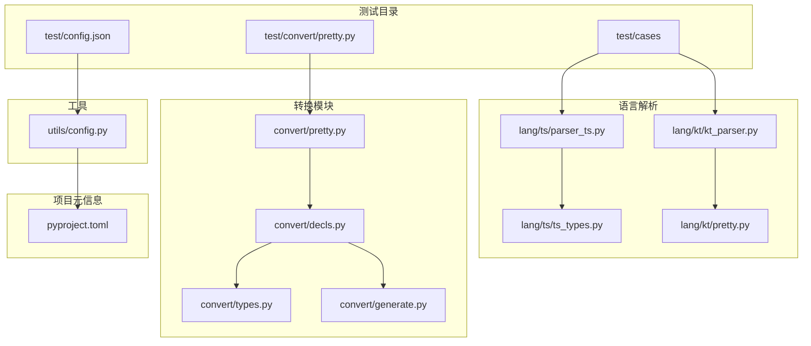
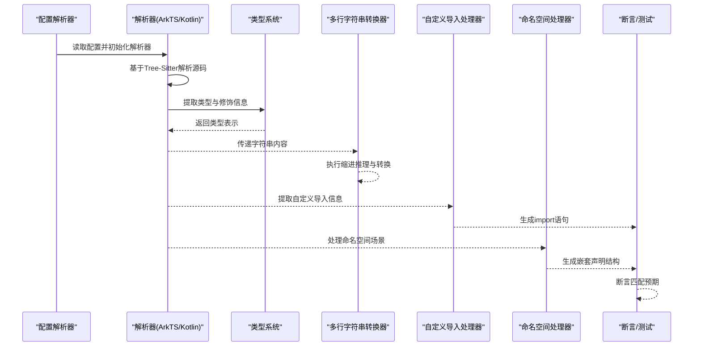
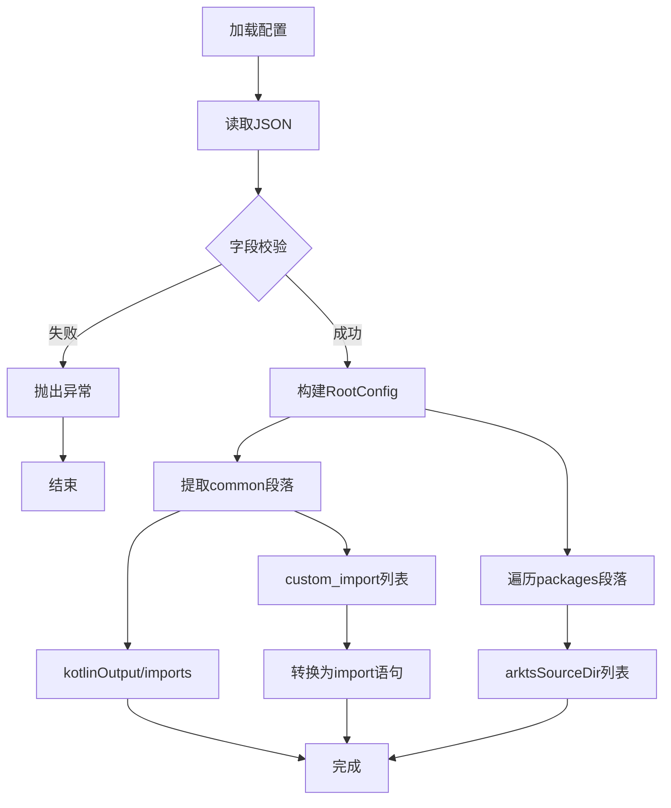
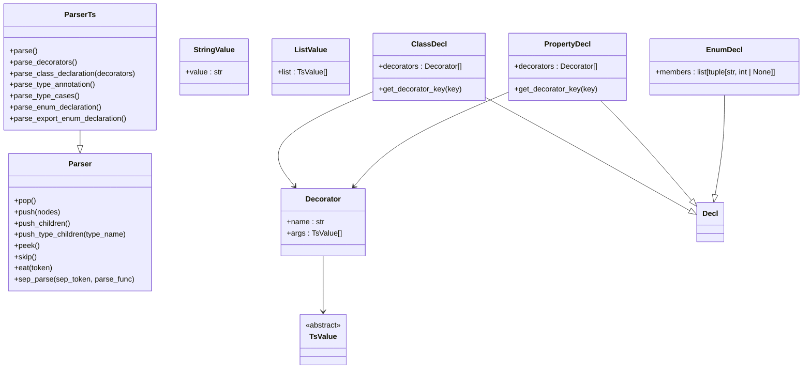
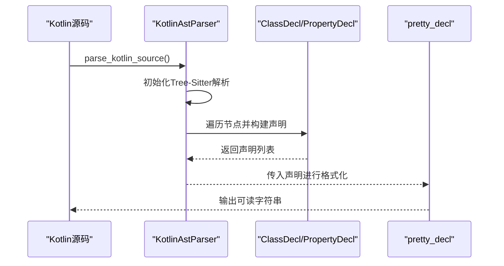
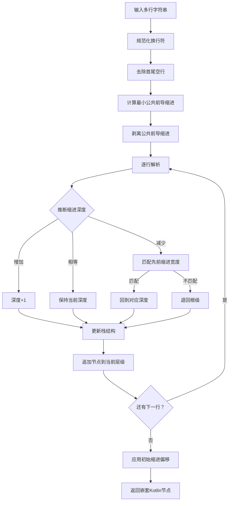
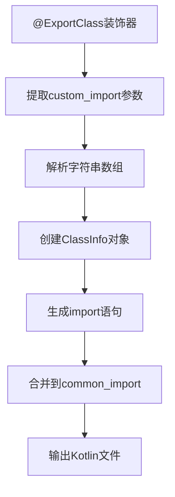
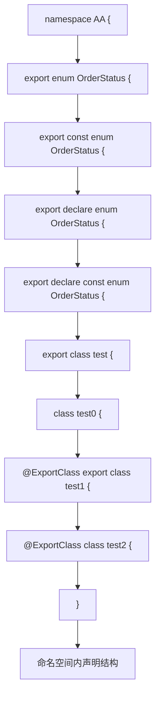
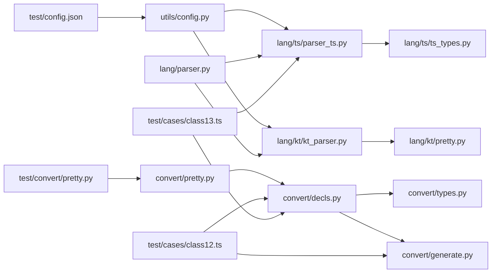

# 测试和验证

<cite>
**本文引用的文件**
- [pyproject.toml](file://pyproject.toml)
- [test/config.json](file://test/config.json)
- [utils/config.py](file://utils/config.py)
- [lang/parser.py](file://lang/parser.py)
- [lang/ts/parser_ts.py](file://lang/ts/parser_ts.py)
- [lang/ts/ts_types.py](file://lang/ts/ts_types.py)
- [lang/kt/kt_parser.py](file://lang/kt/kt_parser.py)
- [lang/kt/pretty.py](file://lang/kt/pretty.py)
- [test/cases/class0.ts](file://test/cases/class0.ts)
- [test/cases/class1.ts](file://test/cases/class1.ts)
- [test/cases/class10.ts](file://test/cases/class10.ts)
- [test/cases/class11.ts](file://test/cases/class11.ts)
- [test/cases/class12.ts](file://test/cases/class12.ts)
- [test/cases/class13.ts](file://test/cases/class13.ts)
- [test/cases/class2.ts](file://test/cases/class2.ts)
- [test/cases/class3.ts](file://test/cases/class3.ts)
- [test/cases/class4.ts](file://test/cases/class4.ts)
- [test/cases/class5.ts](file://test/cases/class5.ts)
- [test/cases/class6.ts](file://test/cases/class6.ts)
- [test/cases/class7.ts](file://test/cases/class7.ts)
- [test/cases/class8.ts](file://test/cases/class8.ts)
- [test/cases/class9.ts](file://test/cases/class9.ts)
- [test/cases/enum0.ts](file://test/cases/enum0.ts)
- [test/cases/kt/class0.kt](file://test/cases/kt/class0.kt)
- [test/cases/kt/class1.kt](file://test/cases/kt/class1.kt)
- [test/convert/pretty.py](file://test/convert/pretty.py)
- [convert/pretty.py](file://convert/pretty.py)
- [convert/decls.py](file://convert/decls.py)
- [convert/types.py](file://convert/types.py)
- [convert/generate.py](file://convert/generate.py)
- [lang/ts/decls.py](file://lang/ts/decls.py)
</cite>

## 更新摘要
**所做更改**
- 新增 class13.ts 测试文件的详细分析，展示复杂命名空间场景的完整实现
- 增强枚举解析与命名空间处理章节，涵盖多种导出枚举类型和可见性修饰符
- 更新测试基础设施章节，包含命名空间场景的测试策略
- 完善装饰器解析与类型系统章节，反映复杂命名空间场景的技术细节

## 目录
1. [引言](#引言)
2. [项目结构](#项目结构)
3. [核心组件](#核心组件)
4. [架构总览](#架构总览)
5. [详细组件分析](#详细组件分析)
6. [依赖分析](#依赖分析)
7. [性能考虑](#性能考虑)
8. [故障排查指南](#故障排查指南)
9. [结论](#结论)
10. [附录](#附录)

## 引言
本文件系统性阐述测试与验证体系，覆盖 ArkTS 与 Kotlin 源码的解析、类型系统、装饰器与注解处理、以及测试配置与用例组织方式。文档同时给出单元测试与集成测试的方法论、错误处理与边界条件测试策略、覆盖率与质量评估指标建议、测试结果解读与调试技巧，并提供自动化与持续集成的落地建议。

**更新** 新增了针对复杂命名空间场景的全面测试套件，涵盖多种导出枚举类型（常规、const、declare、declare const）、不同可见性修饰符的类，以及命名空间嵌套场景的验证。同时新增 class13.ts 测试文件展示复杂命名空间场景的完整实现。

## 项目结构
仓库采用按语言分层的模块化组织：解析器位于 lang 下，分别支持 ArkTS 与 Kotlin；测试用例位于 test/cases；测试配置位于 test/config.json；工具模块位于 utils（如配置解析）；转换模块位于 convert 下，包含类型转换、声明转换等功能。

**图表来源**
- [pyproject.toml](file://pyproject.toml#L1-L26)
- [test/config.json](file://test/config.json#L1-L41)
- [utils/config.py](file://utils/config.py#L1-L84)
- [lang/ts/parser_ts.py](file://lang/ts/parser_ts.py#L1-L483)
- [lang/kt/kt_parser.py](file://lang/kt/kt_parser.py#L1-L242)
- [lang/ts/ts_types.py](file://lang/ts/ts_types.py#L1-L215)
- [lang/kt/pretty.py](file://lang/kt/pretty.py#L1-L96)
- [convert/pretty.py](file://convert/pretty.py#L1-L113)
- [test/convert/pretty.py](file://test/convert/pretty.py#L1-L67)
- [convert/decls.py](file://convert/decls.py#L1-L817)
- [convert/generate.py](file://convert/generate.py#L1-L164)

**章节来源**
- [pyproject.toml](file://pyproject.toml#L1-L26)
- [test/config.json](file://test/config.json#L1-L41)

## 核心组件
- 配置解析与校验：通过 JSON 配置驱动 Kotlin 输出路径与导入列表，以及 ArkTS 包源目录集合。
- 解析器基类：提供流式解析器抽象，统一 pop/push/peek/eat 等操作，便于扩展 ArkTS/Kotlin 解析器。
- ArkTS 解析器：基于 Tree-Sitter ArkTS 语言，解析装饰器、导出声明、类型注解等。
- Kotlin 解析器：基于 Tree-Sitter Kotlin 语言，解析注解、属性、类定义，兼容 expect/actual 形态。
- 类型系统：ArkTS 侧提供基础类型与联合类型、可空类型等表示与访问器。
- Kotlin 美化输出：将 Kotlin AST 转为可读字符串，用于调试与测试断言。
- **新增** 多行字符串转 Kotlin 节点：将缩进的多行字符串转换为嵌套的 Kotlin 节点结构，支持复杂的缩进推理和反缩进处理。
- **新增** 自定义导入功能：支持在装饰器中指定自定义导入列表，转换器能够正确处理并生成相应的 import 语句。
- **新增** 复杂命名空间场景：支持命名空间内的多种导出枚举类型和类声明，涵盖不同可见性修饰符的处理。

**章节来源**
- [utils/config.py](file://utils/config.py#L1-L84)
- [lang/parser.py](file://lang/parser.py#L1-L57)
- [lang/ts/parser_ts.py](file://lang/ts/parser_ts.py#L1-L483)
- [lang/ts/ts_types.py](file://lang/ts/ts_types.py#L1-L215)
- [lang/kt/kt_parser.py](file://lang/kt/kt_parser.py#L1-L242)
- [lang/kt/pretty.py](file://lang/kt/pretty.py#L1-L96)
- [convert/pretty.py](file://convert/pretty.py#L8-L97)
- [convert/decls.py](file://convert/decls.py#L360-L363)
- [convert/generate.py](file://convert/generate.py#L71-L75)

## 架构总览
测试与验证体系围绕"配置 → 解析 → 类型 → 转换 → 断言"的链路展开。配置文件决定 Kotlin 输出位置与 ArkTS 包源目录；解析器从测试用例中抽取结构化信息；类型系统提供类型一致性判断；转换模块处理多行字符串到 Kotlin 节点的转换；最终以断言形式验证解析结果。

**图表来源**
- [utils/config.py](file://utils/config.py#L45-L61)
- [lang/ts/parser_ts.py](file://lang/ts/parser_ts.py#L25-L32)
- [lang/kt/kt_parser.py](file://lang/kt/kt_parser.py#L200-L231)
- [lang/ts/ts_types.py](file://lang/ts/ts_types.py#L1-L215)
- [convert/pretty.py](file://convert/pretty.py#L8-L97)
- [convert/decls.py](file://convert/decls.py#L430-L433)
- [convert/generate.py](file://convert/generate.py#L71-L75)

## 详细组件分析

### 配置与测试用例组织
- 配置文件结构：common 段落包含 Kotlin 输出目录与导入项；packages 段落为多个包名到 ArkTS 源目录的映射。
- 配置解析：严格校验字段类型与存在性，生成不可变数据对象，便于后续流程复用。
- 测试用例：ArkTS 用例位于 test/cases/*.ts，Kotlin 用例位于 test/cases/kt/*.kt；二者均体现装饰器/注解与类结构。
- **新增** 转换器测试：新增 test/convert/pretty.py 文件，专门测试 multi_line_str_to_kt_node 函数的各种缩进场景。
- **新增** 自定义导入测试：class12.ts 展示了自定义导入功能的完整实现，包括装饰器参数 custom_import 的使用。
- **新增** 命名空间测试：class13.ts 展示了复杂命名空间场景的完整实现，包含多种导出枚举类型和不同可见性修饰符的类。

**图表来源**
- [test/config.json](file://test/config.json#L1-L41)
- [utils/config.py](file://utils/config.py#L45-L61)
- [convert/decls.py](file://convert/decls.py#L430-L433)
- [convert/generate.py](file://convert/generate.py#L71-L75)

**章节来源**
- [test/config.json](file://test/config.json#L1-L41)
- [utils/config.py](file://utils/config.py#L1-L84)
- [test/cases/class0.ts](file://test/cases/class0.ts#L1-L4)
- [test/cases/class1.ts](file://test/cases/class1.ts#L1-L5)
- [test/cases/class12.ts](file://test/cases/class12.ts#L1-L4)
- [test/cases/class13.ts](file://test/cases/class13.ts#L1-L35)
- [test/cases/enum0.ts](file://test/cases/enum0.ts#L1-L10)
- [test/cases/kt/class0.kt](file://test/cases/kt/class0.kt#L1-L9)
- [test/cases/kt/class1.kt](file://test/cases/kt/class1.kt#L1-L18)
- [test/convert/pretty.py](file://test/convert/pretty.py#L1-L67)

### ArkTS 解析器与类型系统
- 解析器职责：从 ArkTS 源码中识别装饰器、导出类声明、属性与类型注解，构建 AST。
- 关键能力：
  - 装饰器解析：支持带/不带参数的装饰器，提取名称与参数值。
  - 类声明解析：解析类名、成员列表、修饰符等。
  - 类型解析：支持基本类型、联合类型、泛型、限定类型等。
  - **新增** 命名空间解析：支持命名空间内的多种声明类型，包括枚举和类。
  - **新增** 枚举解析增强：支持 const enum、declare enum、declare const enum 等多种枚举类型。
- 类型系统：提供基础类型、可空类型、联合类型、限定类型等表示，并支持访问器模式。
- **新增** 装饰器键值提取：新增 get_decorator_key 方法，支持从装饰器参数中提取特定键值，如 custom_import。

**图表来源**
- [lang/parser.py](file://lang/parser.py#L8-L57)
- [lang/ts/parser_ts.py](file://lang/ts/parser_ts.py#L25-L483)
- [lang/ts/decls.py](file://lang/ts/decls.py#L36-L61)
- [lang/ts/decls.py](file://lang/ts/decls.py#L86-L105)
- [lang/ts/decls.py](file://lang/ts/decls.py#L128-L132)

**章节来源**
- [lang/ts/parser_ts.py](file://lang/ts/parser_ts.py#L1-L483)
- [lang/ts/ts_types.py](file://lang/ts/ts_types.py#L1-L215)
- [lang/ts/decls.py](file://lang/ts/decls.py#L1-L132)
- [lang/parser.py](file://lang/parser.py#L1-L57)

### Kotlin 解析器与美化输出
- 解析器职责：从 Kotlin 源码中解析注解、属性、类定义；兼容 expect/actual 的包装节点形态。
- 关键能力：
  - 注解解析：从构造调用中提取注解名与字符串参数。
  - 属性解析：识别 val/var、名称、类型与注解。
  - 类解析：支持普通类与注解包裹的类形态。
- 美化输出：将 Kotlin AST 转为可读字符串，便于调试与测试断言。

**图表来源**
- [lang/kt/kt_parser.py](file://lang/kt/kt_parser.py#L200-L231)
- [lang/kt/pretty.py](file://lang/kt/pretty.py#L50-L87)

**章节来源**
- [lang/kt/kt_parser.py](file://lang/kt/kt_parser.py#L1-L242)
- [lang/kt/pretty.py](file://lang/kt/pretty.py#L1-L96)
- [test/cases/kt/class0.kt](file://test/cases/kt/class0.kt#L1-L9)
- [test/cases/kt/class1.kt](file://test/cases/kt/class1.kt#L1-L18)

### 多行字符串转换器与测试套件
- **新增** 转换器职责：将缩进的多行字符串转换为嵌套的 Kotlin 节点结构，支持复杂的缩进推理算法。
- 关键能力：
  - 缩进推理：自动计算公共前导缩进，推断每个缩进级别的深度。
  - 跳跃缩进处理：任何缩进增加都被视为恰好更深一层（即使跳过2倍）。
  - 反缩进匹配：必须精确匹配先前见过的缩进宽度，否则退回根级。
  - 初始缩进偏移：支持在最终结果上添加额外的外层数组包装。
- 测试套件覆盖场景：
  - 2空间缩进：验证标准2空格缩进的正确处理。
  - 4空间缩进：验证4空格缩进的正确处理。
  - 跳跃缩进：验证缩进跳跃被正确处理为单层深度。
  - 反缩进：验证回到先前层级的正确处理。
  - 不均匀反缩进：验证不规则缩进的合理回退。
  - 初始缩进偏移：验证 init_indent 参数的效果。

**图表来源**
- [convert/pretty.py](file://convert/pretty.py#L8-L97)
- [test/convert/pretty.py](file://test/convert/pretty.py#L7-L62)

**章节来源**
- [convert/pretty.py](file://convert/pretty.py#L8-L97)
- [test/convert/pretty.py](file://test/convert/pretty.py#L1-L67)
- [convert/decls.py](file://convert/decls.py#L16-L16)
- [convert/decls.py](file://convert/decls.py#L262-L263)
- [convert/decls.py](file://convert/decls.py#L293-L294)
- [convert/decls.py](file://convert/decls.py#L398-L399)

### 自定义导入功能与测试基础设施
- **新增** 自定义导入功能：class12.ts 展示了如何在 @ExportClass 装饰器中使用 custom_import 参数，传入字符串数组作为自定义导入列表。
- **新增** 转换器实现：convert/decls.py 中的 convert_class 函数提取 custom_import 装饰器参数，转换为 ClassInfo 对象的 custom_import_list 字段。
- **新增** 导入生成：convert/generate.py 中的 _get_custom_imports 函数将自定义导入列表转换为 import 语句，合并到最终的 Kotlin 文件导入中。
- **新增** 测试策略：class12.ts 用例验证自定义导入功能的正确性，包括包名解析和导入语句生成。

**图表来源**
- [test/cases/class12.ts](file://test/cases/class12.ts#L1-L2)
- [convert/decls.py](file://convert/decls.py#L430-L433)
- [convert/generate.py](file://convert/generate.py#L71-L75)

**章节来源**
- [test/cases/class12.ts](file://test/cases/class12.ts#L1-L4)
- [convert/decls.py](file://convert/decls.py#L360-L363)
- [convert/decls.py](file://convert/decls.py#L430-L433)
- [convert/generate.py](file://convert/generate.py#L71-L75)
- [lang/ts/decls.py](file://lang/ts/decls.py#L83-L84)

### 复杂命名空间场景与测试用例
- **新增** 命名空间场景：class13.ts 展示了复杂命名空间场景的完整实现，包含以下特性：
  - 多种导出枚举类型：常规枚举、const 枚举、declare 枚举、declare const 枚举
  - 不同可见性修饰符：export 修饰符和无修饰符的类声明
  - 嵌套命名空间：namespace AA { ... } 内的声明组织
  - 装饰器应用：@ExportClass 装饰器在命名空间内的使用
- **新增** 枚举解析增强：支持 const enum、declare enum、declare const enum 等多种枚举声明形式。
- **新增** 命名空间解析：支持命名空间内的导出声明和内部声明的区分处理。
- **新增** 测试策略：class13.ts 用例验证命名空间内多种声明类型的正确解析和处理。

**图表来源**
- [test/cases/class13.ts](file://test/cases/class13.ts#L1-L35)
- [lang/ts/parser_ts.py](file://lang/ts/parser_ts.py#L454-L464)
- [lang/ts/parser_ts.py](file://lang/ts/parser_ts.py#L449-L453)

**章节来源**
- [test/cases/class13.ts](file://test/cases/class13.ts#L1-L35)
- [test/cases/enum0.ts](file://test/cases/enum0.ts#L1-L10)
- [lang/ts/parser_ts.py](file://lang/ts/parser_ts.py#L449-L464)
- [lang/ts/decls.py](file://lang/ts/decls.py#L128-L132)

### 测试用例与断言策略
- ArkTS 用例示例：包含装饰器与简单类定义，用于验证装饰器解析与类声明解析。
- Kotlin 用例示例：包含注解与属性，以及 expect/actual 形态，用于验证注解与类/属性解析。
- **新增** 转换器测试用例：覆盖各种缩进模式，验证 multi_line_str_to_kt_node 函数的正确性。
- **新增** 自定义导入测试用例：class12.ts 验证 @ExportClass 装饰器的 custom_import 功能，包括包名解析和导入生成。
- **新增** 复杂装饰器测试：class10.ts 和 class11.ts 展示了更复杂的装饰器组合，包括 export_all_fields、custom_code、custom_getter 等高级功能。
- **新增** 命名空间测试用例：class13.ts 验证复杂命名空间场景，包括多种导出枚举类型和不同可见性修饰符的类。
- 断言建议：
  - 结构断言：类名、属性名、修饰符是否正确。
  - 类型断言：属性类型与可空性是否符合预期。
  - 注解断言：注解名与参数是否正确提取。
  - 兼容性断言：expect/actual 形态下的类解析一致性。
  - **新增** 转换断言：验证多行字符串转换为正确的嵌套节点结构。
  - **新增** 导入断言：验证自定义导入语句正确生成并合并到最终输出中。
  - **新增** 命名空间断言：验证命名空间内多种声明类型的正确解析和处理。

**章节来源**
- [test/cases/class0.ts](file://test/cases/class0.ts#L1-L4)
- [test/cases/class1.ts](file://test/cases/class1.ts#L1-L5)
- [test/cases/class10.ts](file://test/cases/class10.ts#L1-L35)
- [test/cases/class11.ts](file://test/cases/class11.ts#L1-L14)
- [test/cases/class12.ts](file://test/cases/class12.ts#L1-L4)
- [test/cases/class13.ts](file://test/cases/class13.ts#L1-L35)
- [test/cases/enum0.ts](file://test/cases/enum0.ts#L1-L10)
- [test/cases/kt/class0.kt](file://test/cases/kt/class0.kt#L1-L9)
- [test/cases/kt/class1.kt](file://test/cases/kt/class1.kt#L1-L18)
- [test/convert/pretty.py](file://test/convert/pretty.py#L7-L62)

## 依赖分析
- 配置依赖：测试配置驱动解析器初始化与输出路径。
- 解析器依赖：ArkTS/Kotlin 解析器依赖 Tree-Sitter 语言绑定与公共解析器基类。
- 类型系统依赖：ArkTS 解析器依赖类型系统进行类型表示与访问。
- 工具依赖：配置解析工具独立于业务逻辑，提供强类型配置对象。
- **新增** 转换器依赖：multi_line_str_to_kt_node 函数被转换模块广泛使用，包括自定义 getter/setter 和自定义代码块。
- **新增** 自定义导入依赖：class12.ts 用例依赖装饰器解析、类型系统和转换器的完整链路。
- **新增** 命名空间依赖：class13.ts 用例依赖枚举解析、类解析和装饰器解析的完整链路。

**图表来源**
- [test/config.json](file://test/config.json#L1-L41)
- [utils/config.py](file://utils/config.py#L1-L84)
- [lang/ts/parser_ts.py](file://lang/ts/parser_ts.py#L1-L483)
- [lang/kt/kt_parser.py](file://lang/kt/kt_parser.py#L1-L242)
- [lang/ts/ts_types.py](file://lang/ts/ts_types.py#L1-L215)
- [lang/kt/pretty.py](file://lang/kt/pretty.py#L1-L96)
- [lang/parser.py](file://lang/parser.py#L1-L57)
- [convert/pretty.py](file://convert/pretty.py#L1-L113)
- [convert/decls.py](file://convert/decls.py#L1-L817)
- [convert/generate.py](file://convert/generate.py#L1-L164)
- [test/convert/pretty.py](file://test/convert/pretty.py#L1-L67)
- [test/cases/class12.ts](file://test/cases/class12.ts#L1-L4)
- [test/cases/class13.ts](file://test/cases/class13.ts#L1-L35)

**章节来源**
- [pyproject.toml](file://pyproject.toml#L1-L26)
- [utils/config.py](file://utils/config.py#L1-L84)
- [lang/ts/parser_ts.py](file://lang/ts/parser_ts.py#L1-L483)
- [lang/kt/kt_parser.py](file://lang/kt/kt_parser.py#L1-L242)
- [convert/pretty.py](file://convert/pretty.py#L1-L113)
- [convert/decls.py](file://convert/decls.py#L1-L817)
- [convert/generate.py](file://convert/generate.py#L1-L164)
- [test/cases/class12.ts](file://test/cases/class12.ts#L1-L4)
- [test/cases/class13.ts](file://test/cases/class13.ts#L1-L35)

## 性能考虑
- 解析性能：Tree-Sitter 解析在大文件上具备线性复杂度，建议对测试用例进行拆分与并行化执行。
- 内存占用：AST 构建与类型系统对象应避免冗余拷贝，优先使用不可变数据结构。
- 缓存策略：重复运行相同用例时可缓存解析树与类型推导结果，减少重复计算。
- 并发执行：在多用例场景下，合理划分任务并行度，避免解析器状态共享导致的竞争。
- **新增** 转换器性能：multi_line_str_to_kt_node 函数的时间复杂度为 O(n)，其中 n 是行数，适合处理大型代码块。
- **新增** 自定义导入性能：自定义导入功能的处理开销主要集中在字符串解析和导入语句生成，时间复杂度为 O(m)，其中 m 是导入项数量。
- **新增** 命名空间性能：复杂命名空间场景的解析开销主要集中在嵌套声明的处理，时间复杂度为 O(k)，其中 k 是命名空间内的声明数量。

## 故障排查指南
- 配置错误
  - 症状：解析器无法启动或输出路径为空。
  - 排查：检查配置文件字段类型与存在性，确认 common 与 packages 段落格式。
  - 参考：配置解析函数对字段进行严格校验。
- 解析语法错误
  - 症状：解析器抛出语法错误或类型不匹配。
  - 排查：核对 ArkTS/Kotlin 语法是否符合解析器期望；检查装饰器/注解参数是否合法。
  - 参考：解析器在不匹配时抛出明确异常。
- 类型断言失败
  - 症状：类型签名与预期不符。
  - 排查：确认类型系统中的类型构造与访问器行为；检查可空/联合类型的处理。
- **新增** 转换器断言失败
  - 症状：多行字符串转换结果不符合预期。
  - 排查：检查缩进推理逻辑，验证最小公共前导缩进计算；确认跳跃缩进和反缩进处理是否正确。
  - 参考：multi_line_str_to_kt_node 函数的详细行为描述。
- **新增** 自定义导入断言失败
  - 症状：自定义导入语句生成错误或包名解析失败。
  - 排查：检查装饰器参数解析，确认 custom_import 数组格式正确；验证导入语句生成逻辑。
  - 参考：convert/decls.py 中的装饰器参数提取和 convert/generate.py 中的导入生成逻辑。
- **新增** 命名空间断言失败
  - 症状：命名空间内声明解析错误或枚举类型识别失败。
  - 排查：检查命名空间解析逻辑，确认 export 修饰符和 declare 修饰符的正确处理；验证不同枚举类型的解析。
  - 参考：lang/ts/parser_ts.py 中的命名空间解析和枚举解析实现。
- 调试技巧
  - 使用 Kotlin 美化输出打印 AST，快速定位结构问题。
  - 将复杂用例拆分为最小可复现片段，逐步缩小范围。
  - **新增** 使用转换器测试套件的各个场景进行对比验证。
  - **新增** 验证自定义导入功能时，检查中间步骤的输出，如 ClassInfo 对象的 custom_import_list 字段。
  - **新增** 验证命名空间场景时，检查命名空间内的声明层次结构和修饰符处理。

**章节来源**
- [utils/config.py](file://utils/config.py#L27-L43)
- [lang/ts/parser_ts.py](file://lang/ts/parser_ts.py#L43-L47)
- [lang/kt/kt_parser.py](file://lang/kt/kt_parser.py#L16-L17)
- [lang/kt/pretty.py](file://lang/kt/pretty.py#L50-L87)
- [convert/pretty.py](file://convert/pretty.py#L8-L97)
- [convert/decls.py](file://convert/decls.py#L430-L433)
- [convert/generate.py](file://convert/generate.py#L71-L75)
- [lang/ts/parser_ts.py](file://lang/ts/parser_ts.py#L454-L464)

## 结论
本测试与验证体系以配置驱动、解析器为中心、类型系统为支撑，形成从 ArkTS/Kotlin 源码到结构化断言的完整闭环。通过规范化的测试用例与严格的错误处理，能够有效保障跨语言互操作的稳定性与一致性。**新增的 multi_line_str_to_kt_node 函数测试套件进一步完善了测试体系，确保缩进推理算法的正确性和鲁棒性。新增的 class12.ts 测试文件展示了自定义导入功能的完整实现，包括装饰器参数解析、类型系统支持和转换器生成逻辑。新增的 class13.ts 测试文件展示了复杂命名空间场景的完整实现，涵盖多种导出枚举类型和不同可见性修饰符的类，验证了命名空间解析和枚举处理的正确性。** 建议在持续集成中引入覆盖率统计与质量门禁，确保变更不会破坏既有行为。

## 附录

### 单元测试与集成测试方法论
- 单元测试
  - 针对解析器与类型系统的原子功能进行测试，覆盖装饰器、注解、类型解析等分支。
  - 使用最小用例验证边界条件（空参数、可空类型、联合类型等）。
  - **新增** 针对 multi_line_str_to_kt_node 函数进行单元测试，覆盖各种缩进场景。
  - **新增** 针对自定义导入功能进行单元测试，验证装饰器参数解析和导入语句生成。
  - **新增** 针对命名空间场景进行单元测试，验证多种声明类型的正确解析。
- 集成测试
  - 组合 ArkTS 与 Kotlin 用例，验证跨语言解析的一致性与输出路径正确性。
  - 对配置解析与实际解析流程进行端到端验证。
  - **新增** 验证转换器在实际代码生成中的正确性，包括自定义 getter/setter 和自定义代码块。
  - **新增** 验证自定义导入功能在整个转换流程中的正确性，从装饰器解析到最终导入语句生成。
  - **新增** 验证命名空间场景在完整转换流程中的正确性，包括声明解析和代码生成。

### 测试配置文件使用指南
- common 段落
  - kotlinOutput：指定 Kotlin 输出目录，用于生成目标代码或中间产物。
  - import：导入所需的类型与注解，确保解析上下文完备。
- packages 段落
  - 以包名为键，arktsSourceDir 为值，支持多目录映射，便于管理多模块 ArkTS 源码。

**章节来源**
- [test/config.json](file://test/config.json#L1-L41)
- [utils/config.py](file://utils/config.py#L45-L61)

### 错误处理与边界条件测试
- 错误处理
  - 配置缺失字段：触发字段类型校验异常。
  - 解析不匹配：触发语法错误或类型不匹配异常。
  - **新增** 转换器参数错误：验证 init_indent 参数的负值处理。
  - **新增** 自定义导入参数错误：验证 custom_import 参数格式错误的处理。
  - **新增** 命名空间参数错误：验证命名空间内声明格式错误的处理。
- 边界条件
  - 空参数注解：验证参数解析回退逻辑。
  - 可空/联合类型：验证类型展开与签名生成。
  - expect/actual：验证包装节点解析与成员提取。
  - **新增** 空字符串输入：验证空多行字符串的处理。
  - **新增** 不规则缩进：验证不规则缩进的合理回退逻辑。
  - **新增** 空导入列表：验证空 custom_import 数组的处理。
  - **新增** 无修饰符类：验证命名空间内未导出类的正确处理。

**章节来源**
- [utils/config.py](file://utils/config.py#L27-L43)
- [lang/ts/ts_types.py](file://lang/ts/ts_types.py#L180-L194)
- [lang/kt/kt_parser.py](file://lang/kt/kt_parser.py#L152-L196)
- [convert/pretty.py](file://convert/pretty.py#L24-L25)
- [convert/decls.py](file://convert/decls.py#L430-L433)
- [lang/ts/parser_ts.py](file://lang/ts/parser_ts.py#L454-L464)

### 测试覆盖率与质量评估
- 覆盖率指标建议
  - 语句覆盖率：解析器与类型系统核心路径覆盖率。
  - 分支覆盖率：装饰器/注解、类型解析分支覆盖率。
  - 函数覆盖率：关键解析函数与类型构造函数覆盖率。
  - **新增** 转换器覆盖率：multi_line_str_to_kt_node 函数的各个分支覆盖率。
  - **新增** 自定义导入覆盖率：装饰器参数解析、导入语句生成的分支覆盖率。
  - **新增** 命名空间覆盖率：命名空间解析、枚举解析、类解析的分支覆盖率。
- 质量门禁
  - 设定最低覆盖率阈值，阻断低质量变更进入主干。
  - 对关键路径增加回归用例，防止回归。
  - **新增** 转换器测试用例完整性检查。
  - **新增** 自定义导入功能测试用例完整性检查。
  - **新增** 命名空间场景测试用例完整性检查。

### 自动化测试与持续集成建议
- CI 阶段
  - 安装依赖：根据项目元信息安装 Python 与 Tree-Sitter 语言绑定。
  - 运行测试：执行解析器与类型系统相关测试，以及新增的转换器测试、自定义导入测试和命名空间测试。
  - 生成报告：收集覆盖率与测试日志。
- 配置要点
  - 使用矩阵构建不同语言版本的测试环境。
  - 将配置解析与解析流程纳入 CI，确保配置变更及时发现。
  - **新增** 将转换器测试套件纳入 CI 流程，确保缩进推理算法的稳定性。
  - **新增** 将自定义导入功能测试纳入 CI 流程，确保装饰器参数解析和导入生成的正确性。
  - **新增** 将命名空间场景测试纳入 CI 流程，确保复杂声明类型的解析正确性。

**章节来源**
- [pyproject.toml](file://pyproject.toml#L15-L21)