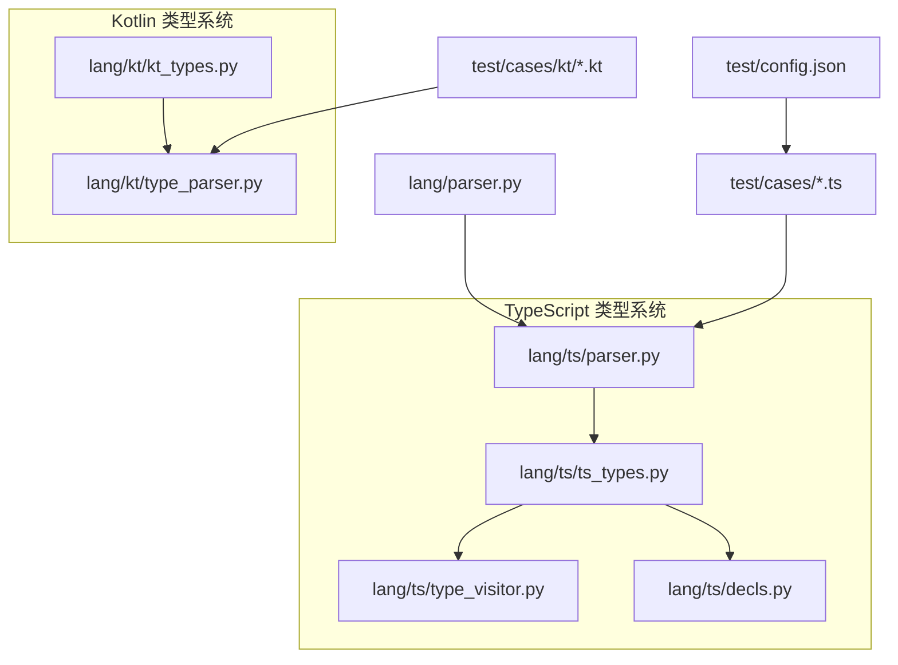
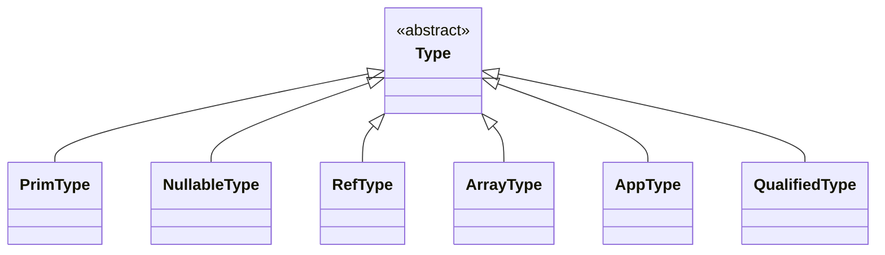
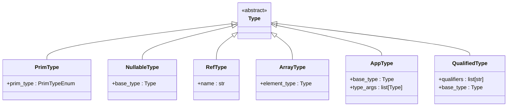
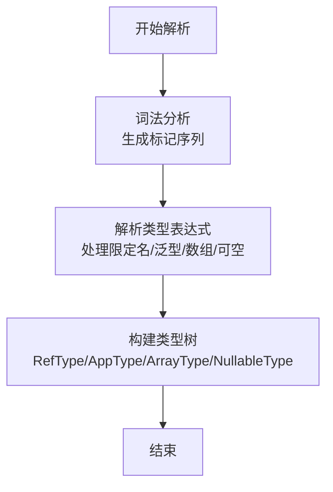
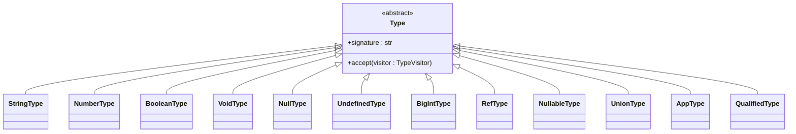
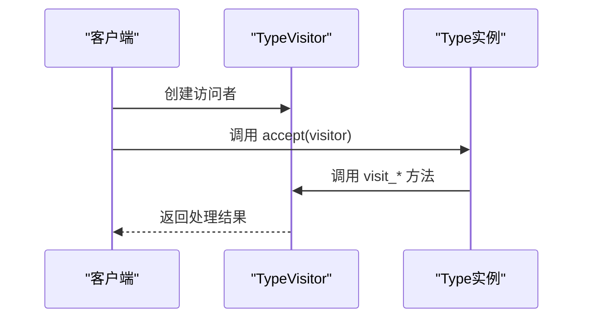
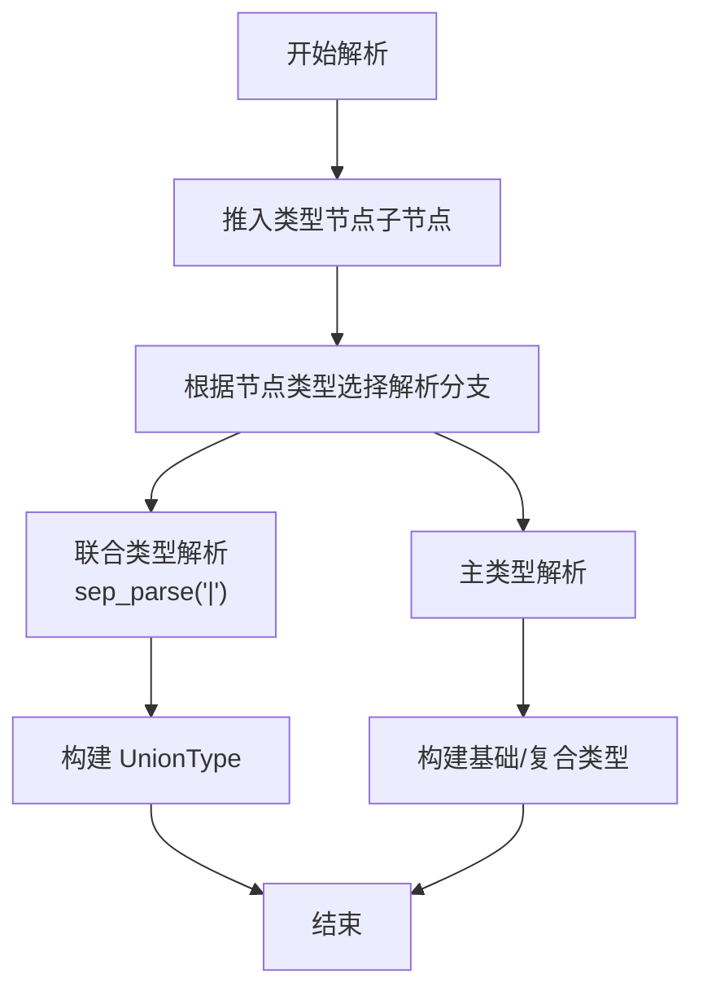
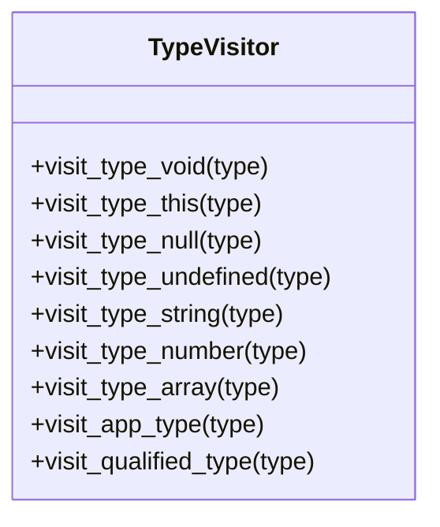
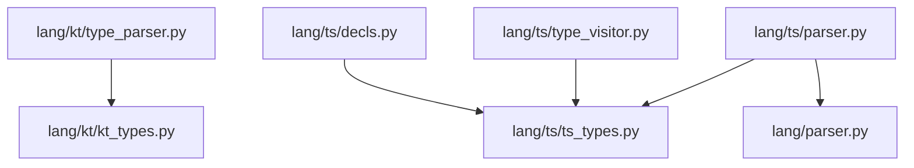

# ArkTS类型系统

<cite>
**本文档引用的文件**
- [lang/kt/kt_types.py](file://lang/kt/kt_types.py)
- [lang/kt/type_parser.py](file://lang/kt/type_parser.py)
- [lang/ts/ts_types.py](file://lang/ts/ts_types.py)
- [lang/ts/type_visitor.py](file://lang/ts/type_visitor.py)
- [lang/ts/decls.py](file://lang/ts/decls.py)
- [lang/ts/parser.py](file://lang/ts/parser.py)
- [lang/parser.py](file://lang/parser.py)
- [pyproject.toml](file://pyproject.toml)
- [test/cases/class0.ts](file://test/cases/class0.ts)
- [test/cases/class1.ts](file://test/cases/class1.ts)
- [test/cases/class2.ts](file://test/cases/class2.ts)
- [test/cases/kt/class0.kt](file://test/cases/kt/class0.kt)
- [test/cases/kt/class1.kt](file://test/cases/kt/class1.kt)
- [test/config.json](file://test/config.json)
</cite>

## 目录
1. [简介](#简介)
2. [项目结构](#项目结构)
3. [核心组件](#核心组件)
4. [架构总览](#架构总览)
5. [详细组件分析](#详细组件分析)
6. [依赖关系分析](#依赖关系分析)
7. [性能考虑](#性能考虑)
8. [故障排除指南](#故障排除指南)
9. [结论](#结论)
10. [附录](#附录)

## 简介
本文件系统性地阐述了 ArkTS 类型系统的设计与实现，涵盖 Kotlin 类型与 TypeScript 类型两大子系统。文档重点包括：
- 类型抽象基类的设计原则与继承层次
- 基础类型与复合类型的实现与用途
- 类型解析辅助函数的功能与使用场景
- 访问者模式在类型系统中的应用与扩展机制
- 实际应用示例与最佳实践建议

该类型系统服务于 ArkTS FFI 转换流程，为 Kotlin 与 TypeScript 的类型表示提供统一抽象，并通过访问者模式支持后续的代码生成与类型检查。

## 项目结构
该项目采用按语言分层的组织方式：Kotlin 类型定义与解析位于 `lang/kt/`，TypeScript 类型定义与解析位于 `lang/ts/`，通用解析器基类位于 `lang/` 根目录，测试用例位于 `test/` 目录。

图表来源
- [lang/kt/kt_types.py](file://lang/kt/kt_types.py#L1-L191)
- [lang/kt/type_parser.py](file://lang/kt/type_parser.py#L1-L152)
- [lang/ts/ts_types.py](file://lang/ts/ts_types.py#L1-L280)
- [lang/ts/type_visitor.py](file://lang/ts/type_visitor.py#L1-L32)
- [lang/ts/decls.py](file://lang/ts/decls.py#L1-L57)
- [lang/ts/parser.py](file://lang/ts/parser.py#L1-L36)
- [lang/parser.py](file://lang/parser.py#L1-L57)

章节来源
- [pyproject.toml](file://pyproject.toml#L8-L12)

## 核心组件
本节概述类型系统的核心模块及其职责：
- Kotlin 类型定义与工具：提供基础类型、复合类型以及类型判断与提取工具
- Kotlin 类型解析器：将 Kotlin 类型字符串解析为内部类型对象
- TypeScript 类型定义与访问者：提供基础类型、复合类型、访问者接口与类型判断工具
- 通用解析器基类：为 TypeScript 解析器提供流式节点处理能力
- 测试用例与配置：展示类型系统在实际工程中的使用场景

章节来源
- [lang/kt/kt_types.py](file://lang/kt/kt_types.py#L1-L191)
- [lang/kt/type_parser.py](file://lang/kt/type_parser.py#L1-L152)
- [lang/ts/ts_types.py](file://lang/ts/ts_types.py#L1-L280)
- [lang/ts/type_visitor.py](file://lang/ts/type_visitor.py#L1-L32)
- [lang/ts/decls.py](file://lang/ts/decls.py#L1-L57)
- [lang/ts/parser.py](file://lang/ts/parser.py#L1-L36)
- [lang/parser.py](file://lang/parser.py#L1-L57)

## 架构总览
ArkTS 类型系统由两条并行的类型体系构成：
- Kotlin 类型体系：以 `Type` 抽象基类为核心，派生出基础类型与复合类型；提供类型判断与提取工具
- TypeScript 类型体系：以 `Type` 抽象基类为核心，派生出基础类型与复合类型；提供访问者模式接口与类型判断工具

两类体系通过各自的解析器将源码中的类型声明转换为内部类型对象，供后续转换与生成阶段使用。

图表来源
- [lang/kt/kt_types.py](file://lang/kt/kt_types.py#L52-L98)

章节来源
- [lang/kt/kt_types.py](file://lang/kt/kt_types.py#L52-L98)

## 详细组件分析

### Kotlin 类型系统

#### 类型抽象与继承层次
Kotlin 类型系统以抽象基类 `Type` 为核心，所有具体类型均继承自该基类。主要类型包括：
- 基础类型：`PrimType` 表示 Kotlin 原始类型集合
- 复合类型：`NullableType`、`RefType`、`ArrayType`、`AppType`、`QualifiedType`

图表来源
- [lang/kt/kt_types.py](file://lang/kt/kt_types.py#L52-L98)

章节来源
- [lang/kt/kt_types.py](file://lang/kt/kt_types.py#L52-L98)

#### 基础类型与复合类型详解
- 基础类型（PrimType）
  - 通过枚举 `PrimTypeEnum` 定义 Kotlin 原始类型集合，覆盖整数、浮点、字符、字符串及数组等
  - 提供类型名到枚举值的映射，便于从字符串解析为具体类型
- 复合类型
  - `NullableType`：对任意类型进行可空包装
  - `RefType`：引用类型，通常对应 Kotlin 类或接口名称
  - `ArrayType`：数组类型，元素类型为另一个类型
  - `AppType`：泛型应用类型，包含基础类型与类型参数列表
  - `QualifiedType`：带限定符的类型，常用于包路径或限定作用域

章节来源
- [lang/kt/kt_types.py](file://lang/kt/kt_types.py#L34-L121)
- [lang/kt/kt_types.py](file://lang/kt/kt_types.py#L83-L97)

#### 类型解析与工具函数
- Kotlin 类型解析器
  - 将 Kotlin 类型字符串解析为内部类型对象，支持泛型、数组、可空等语法
  - 支持限定名解析与简单名解析，自动区分原始类型与引用类型
- 类型判断与提取工具
  - `is_primitive_type`：判断是否为 Kotlin 原始类型或其可空包装
  - `is_ref_type` / `get_ref_type_name`：判断引用类型并提取名称
  - `is_map_type` / `is_list_type` / `is_array_type`：识别常见集合类型

图表来源
- [lang/kt/type_parser.py](file://lang/kt/type_parser.py#L40-L147)

章节来源
- [lang/kt/type_parser.py](file://lang/kt/type_parser.py#L1-L152)
- [lang/kt/kt_types.py](file://lang/kt/kt_types.py#L126-L191)

### TypeScript 类型系统

#### 类型抽象与继承层次
TypeScript 类型系统同样以抽象基类 `Type` 为核心，派生出基础类型与复合类型，并引入访问者模式以支持类型遍历与操作：
- 基础类型：`StringType`、`NumberType`、`BooleanType`、`VoidType`、`NullType`、`UndefinedType`、`BigIntType`
- 复合类型：`RefType`、`NullableType`、`UnionType`、`AppType`、`QualifiedType`
- 访问者接口：`TypeVisitor`，用于扩展类型处理逻辑

图表来源
- [lang/ts/ts_types.py](file://lang/ts/ts_types.py#L8-L178)

章节来源
- [lang/ts/ts_types.py](file://lang/ts/ts_types.py#L8-L178)

#### 访问者模式与扩展机制
- 访问者接口 `TypeVisitor`
  - 定义针对各类型的访问方法，便于扩展新的处理逻辑
  - 类型对象通过 `accept` 方法将自身传递给访问者
- 扩展机制
  - 新增类型时，只需在访问者中添加对应的访问方法
  - 在不修改类型定义的情况下，实现类型分析、格式化、转换等功能

图表来源
- [lang/ts/ts_types.py](file://lang/ts/ts_types.py#L20-L22)
- [lang/ts/type_visitor.py](file://lang/ts/type_visitor.py#L5-L31)

章节来源
- [lang/ts/ts_types.py](file://lang/ts/ts_types.py#L20-L22)
- [lang/ts/type_visitor.py](file://lang/ts/type_visitor.py#L1-L32)

#### 类型解析与工具函数
- 类型解析器 `TsParser`
  - 基于通用解析器基类，提供 TypeScript 类型注解解析能力
  - 支持联合类型解析与主类型解析
- 类型判断与提取工具
  - `unwrap_nullable`：递归解包可空类型，支持联合类型中去除空值
  - `is_primitive_type`：判断是否为基础类型或其联合/可空包装
  - `is_type_app` / `is_qualified_type_app`：识别内置与限定泛型类型
  - `is_builtin_*` / `is_sendable_*`：识别标准库与 ArkTS 特定集合类型

图表来源
- [lang/ts/parser.py](file://lang/ts/parser.py#L19-L35)
- [lang/parser.py](file://lang/parser.py#L26-L36)

章节来源
- [lang/ts/parser.py](file://lang/ts/parser.py#L1-L36)
- [lang/parser.py](file://lang/parser.py#L1-L57)
- [lang/ts/ts_types.py](file://lang/ts/ts_types.py#L180-L277)

### 类型系统访问者模式实现与扩展

#### 访问者接口设计
- `TypeVisitor` 定义了针对各类型的访问方法，包括基础类型、复合类型与特殊类型
- 每个具体类型通过 `accept` 方法调用访问者的相应方法，实现多态分发

图表来源
- [lang/ts/type_visitor.py](file://lang/ts/type_visitor.py#L5-L31)

章节来源
- [lang/ts/type_visitor.py](file://lang/ts/type_visitor.py#L1-L32)

#### 扩展访问者
- 新增访问逻辑：在访问者中添加新的 `visit_*` 方法
- 新增类型：在类型系统中新增类型后，在访问者中补充对应的访问方法
- 无需修改类型定义即可实现功能扩展，符合开闭原则

章节来源
- [lang/ts/ts_types.py](file://lang/ts/ts_types.py#L20-L22)
- [lang/ts/type_visitor.py](file://lang/ts/type_visitor.py#L1-L32)

### 类型解析函数详解

#### Kotlin 类型解析函数
- `parse_kt_type(text: str) -> Type`
  - 将 Kotlin 类型字符串解析为内部类型对象
  - 支持限定名、泛型、数组、可空等语法
- 工具函数
  - `is_primitive_type(t: Type) -> bool`：判断是否为 Kotlin 原始类型或其可空包装
  - `is_ref_type(t: Type) -> bool` / `get_ref_type_name(t: Type) -> str`：判断引用类型并提取名称
  - `is_map_type(t: Type) -> bool` / `is_list_type(t: Type) -> bool` / `is_array_type(t: Type) -> bool`：识别集合类型

章节来源
- [lang/kt/type_parser.py](file://lang/kt/type_parser.py#L149-L151)
- [lang/kt/kt_types.py](file://lang/kt/kt_types.py#L126-L191)

#### TypeScript 类型解析函数
- `unwrap_nullable(t: Type) -> Type`
  - 递归解包可空类型，支持联合类型中去除空值与未定义
- 类型判断函数
  - `is_primitive_type(t: Type) -> bool`：判断是否为基础类型或其联合/可空包装
  - `is_type_app(t: str, ty: Type) -> bool`：判断是否为指定名称的泛型应用
  - `is_qualified_type_app(t: list[str], ty: Type) -> bool`：判断是否为指定限定名的泛型应用
  - `is_builtin_*` / `is_sendable_*`：识别标准库与 ArkTS 特定集合类型

章节来源
- [lang/ts/ts_types.py](file://lang/ts/ts_types.py#L180-L277)

### 实际应用示例与最佳实践

#### 示例一：Kotlin 类型解析
- 场景：解析 Kotlin 类型字符串 `kotlin.collections.Map<kotlin.String, kotlin.Long?>[]?`
- 步骤：
  1. 词法分析生成标记序列
  2. 解析限定名 `kotlin.collections.Map`
  3. 解析泛型参数 `kotlin.String, kotlin.Long?`
  4. 应用数组与可空后缀
  5. 构建类型树：`NullableType(ArrayType(AppType(QualifiedType(...), ...)))`

章节来源
- [lang/kt/type_parser.py](file://lang/kt/type_parser.py#L92-L124)
- [test/cases/kt/class0.kt](file://test/cases/kt/class0.kt#L5-L8)

#### 示例二：TypeScript 类型解析
- 场景：解析 TypeScript 类型注解 `string | null | undefined`
- 步骤：
  1. 推入类型注解节点子节点
  2. 选择联合类型解析分支
  3. 分隔 `|` 并逐项解析
  4. 构建 `UnionType` 对象
  5. 使用 `unwrap_nullable` 解包可空类型

章节来源
- [lang/ts/parser.py](file://lang/ts/parser.py#L19-L35)
- [lang/ts/ts_types.py](file://lang/ts/ts_types.py#L180-L194)
- [test/cases/class1.ts](file://test/cases/class1.ts#L4-L4)

#### 最佳实践
- 明确类型边界：在 Kotlin 侧使用 `QualifiedType` 表示限定名，在 TypeScript 侧使用 `RefType` 或 `QualifiedType` 表示引用类型
- 统一可空处理：优先使用 `NullableType` 或 `UnionType` 表示可空，配合 `unwrap_nullable` 进行统一处理
- 访问者扩展：通过访问者模式实现类型分析与转换，避免在类型定义中嵌入业务逻辑
- 配置驱动：结合测试配置文件，确保类型系统与工程约定一致

章节来源
- [lang/ts/ts_types.py](file://lang/ts/ts_types.py#L180-L277)
- [test/config.json](file://test/config.json#L1-L27)

## 依赖关系分析

图表来源
- [lang/kt/kt_types.py](file://lang/kt/kt_types.py#L1-L32)
- [lang/kt/type_parser.py](file://lang/kt/type_parser.py#L5-L16)
- [lang/ts/ts_types.py](file://lang/ts/ts_types.py#L1-L7)
- [lang/ts/type_visitor.py](file://lang/ts/type_visitor.py#L1-L3)
- [lang/ts/decls.py](file://lang/ts/decls.py#L1-L2)
- [lang/ts/parser.py](file://lang/ts/parser.py#L1-L8)
- [lang/parser.py](file://lang/parser.py#L1-L6)

章节来源
- [lang/kt/kt_types.py](file://lang/kt/kt_types.py#L1-L32)
- [lang/kt/type_parser.py](file://lang/kt/type_parser.py#L1-L16)
- [lang/ts/ts_types.py](file://lang/ts/ts_types.py#L1-L7)
- [lang/ts/type_visitor.py](file://lang/ts/type_visitor.py#L1-L3)
- [lang/ts/decls.py](file://lang/ts/decls.py#L1-L2)
- [lang/ts/parser.py](file://lang/ts/parser.py#L1-L8)
- [lang/parser.py](file://lang/parser.py#L1-L6)

## 性能考虑
- 类型解析复杂度
  - Kotlin 解析器：线性扫描与递归解析，时间复杂度近似 O(n)，空间复杂度取决于类型深度
  - TypeScript 解析器：基于流式节点处理，时间复杂度近似 O(n)，空间复杂度受 AST 深度影响
- 类型判断与提取
  - 递归解包与类型匹配为 O(d)，其中 d 为类型深度
  - 建议在频繁使用的场景缓存解析结果，减少重复计算
- 内存管理
  - 使用不可变数据结构（如 frozen dataclass）降低并发风险
  - 合理使用访问者模式，避免在类型对象中存储状态

## 故障排除指南
- Kotlin 类型解析错误
  - 症状：解析异常或标记不匹配
  - 排查：检查输入字符串是否包含非法字符，确认泛型、数组、可空语法正确
  - 参考：解析器抛出的异常信息与位置提示
- TypeScript 类型解析错误
  - 症状：联合类型解析失败或节点类型不匹配
  - 排查：确认类型注解节点类型为 `type_annotation`，联合类型使用 `|` 分隔
  - 参考：通用解析器的类型节点校验逻辑
- 类型判断异常
  - 症状：`unwrap_nullable` 抛出异常或 `is_primitive_type` 判断错误
  - 排查：确认类型树结构正确，联合类型中仅有一个非空成员
  - 参考：类型判断函数的递归实现与异常分支

章节来源
- [lang/kt/type_parser.py](file://lang/kt/type_parser.py#L83-L98)
- [lang/ts/parser.py](file://lang/ts/parser.py#L31-L35)
- [lang/ts/ts_types.py](file://lang/ts/ts_types.py#L180-L194)

## 结论
ArkTS 类型系统通过 Kotlin 与 TypeScript 两套类型体系，实现了对 ArkTS 生态中类型表示的统一抽象。Kotlin 侧侧重类型解析与工具函数，TypeScript 侧强调访问者模式与类型判断。两者协同工作，为 ArkTS FFI 转换提供了坚实的基础。通过访问者模式与工具函数，系统具备良好的扩展性与可维护性，适合在大型工程中持续演进。

## 附录
- 相关测试用例
  - TypeScript 类型注解示例：字段类型为 `string`
  - Kotlin 类型注解示例：字段类型为 `kotlin.Int?`、`kotlin.Long?`
- 配置参考
  - 工程导入与模块配置，确保类型系统与编译环境一致

章节来源
- [test/cases/class1.ts](file://test/cases/class1.ts#L4-L4)
- [test/cases/kt/class0.kt](file://test/cases/kt/class0.kt#L5-L8)
- [test/cases/kt/class1.kt](file://test/cases/kt/class1.kt#L5-L8)
- [test/config.json](file://test/config.json#L1-L27)