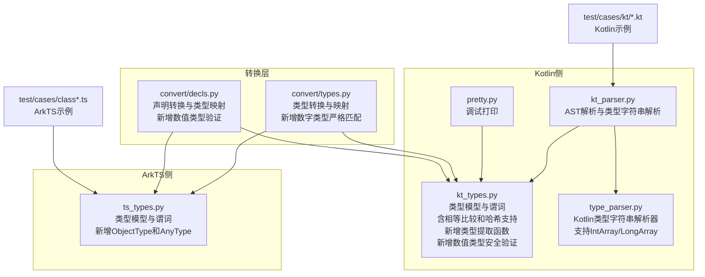
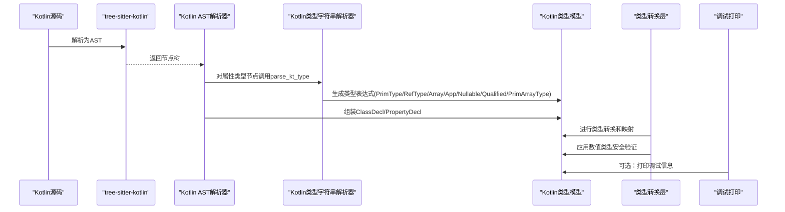
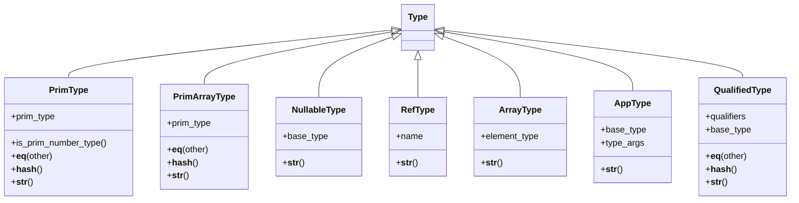
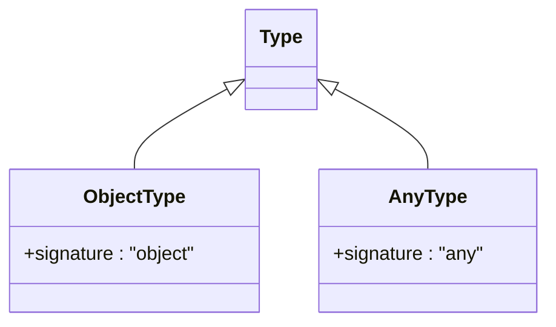
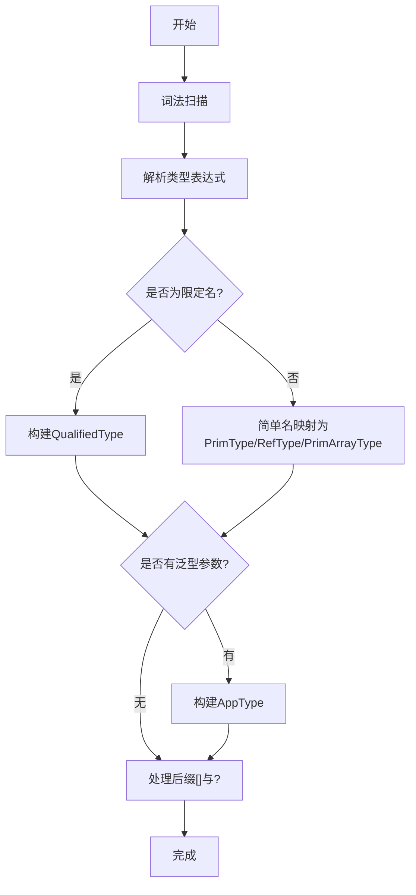
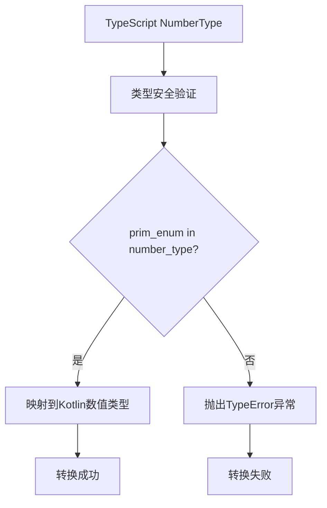
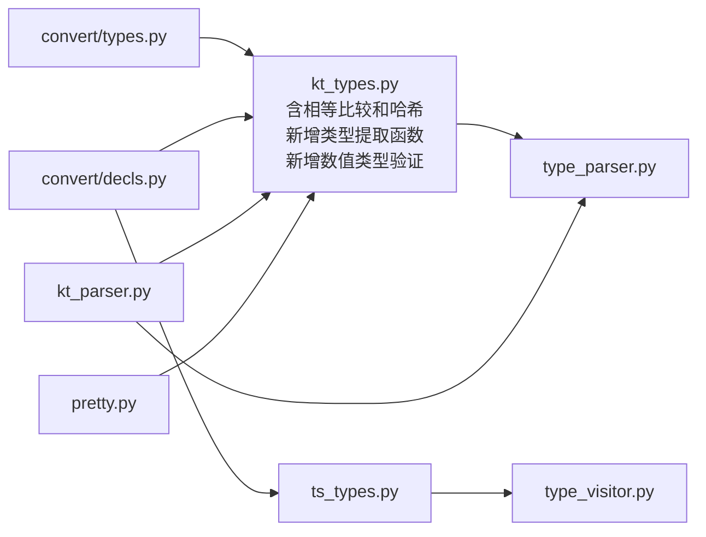

# Kotlin类型系统

<cite>
**本文引用的文件**
- [lang/kt/kt_types.py](file://lang/kt/kt_types.py)
- [lang/kt/type_parser.py](file://lang/kt/type_parser.py)
- [lang/kt/pretty.py](file://lang/kt/pretty.py)
- [convert/types.py](file://convert/types.py)
- [lang/ts/ts_types.py](file://lang/ts/ts_types.py)
- [convert/decls.py](file://convert/decls.py)
- [test/cases/kt/class0.kt](file://test/cases/kt/class0.kt)
- [test/cases/class0.ts](file://test/cases/class0.ts)
</cite>

## 更新摘要
**变更内容**
- 新增了ObjectType和AnyType支持，扩展ArkTS类型系统
- 改进类型相等性判断逻辑，增强类型比较的准确性
- 完善类型系统对可空类型、限定类型和数组类型的处理
- 增强了类型系统对复杂类型组合的识别和处理能力
- **新增** PrimTypeEnum和number_type集合的详细说明，包括is_prim_number_type()方法的类型安全验证功能
- **新增** TypeScript数字类型与Kotlin数值类型之间的严格匹配机制

## 目录
1. [简介](#简介)
2. [项目结构](#项目结构)
3. [核心组件](#核心组件)
4. [架构总览](#架构总览)
5. [详细组件分析](#详细组件分析)
6. [类型提取与安全访问](#类型提取与安全访问)
7. [相等比较与哈希支持](#相等比较与哈希支持)
8. [数值类型安全验证](#数值类型安全验证)
9. [依赖分析](#依赖分析)
10. [性能考量](#性能考量)
11. [故障排查指南](#故障排查指南)
12. [结论](#结论)
13. [附录](#附录)

## 简介
本文件系统性梳理了Kotlin类型系统在该仓库中的实现与设计，重点覆盖：
- Kotlin类型定义与约束：基础类型、复合类型（数组、泛型、可空）、限定类型等
- **新增** ArkTS类型系统扩展：ObjectType和AnyType的引入，增强类型表达能力
- **更新** 改进的相等性判断逻辑：为所有类型提供更精确的类型比较和匹配机制
- 专用原始数组类型系统：Int/Long数组的独立类型建模
- **新增** 数值类型安全验证：PrimTypeEnum和number_type集合的引入，提供严格的类型安全检查
- 类型解析与验证：词法/语法解析器、错误处理策略
- 与ArkTS类型系统的差异与对应关系：类型模型、可空表示、集合类型识别
- FFI转换中的特殊考虑与限制：类型映射边界、限定名处理、数组/泛型/可空的组合
- 扩展机制与自定义类型支持：类型构造器、谓词函数、访问者模式
- 实际转换过程中的应用示例：从Kotlin源码到AST再到类型表达式

## 项目结构
该项目围绕"Kotlin类型系统"与"ArkTS类型系统"的对比与桥接展开，核心模块如下：
- lang/kt：Kotlin侧的类型建模、解析与声明
- convert：类型转换与映射逻辑
- lang/ts：ArkTS侧的类型建模与访问者
- test/cases：Kotlin与ArkTS的示例输入

**图表来源**
- [lang/kt/kt_types.py](file://lang/kt/kt_types.py#L54-L140)
- [lang/kt/type_parser.py](file://lang/kt/type_parser.py#L92-L156)
- [convert/types.py](file://convert/types.py#L10-L67)
- [convert/decls.py](file://convert/decls.py#L39-L64)

## 核心组件
- **更新** Kotlin类型模型与谓词
  - 基础类型：Unit、Boolean、Byte/UByte、Short/UShort、Int/UInt、Long/ULong、Char、Float、Double、String
  - **新增** 专用原始数组类型：Int/Long数组的独立类型建模，包含完整的相等比较和哈希支持
  - 复合类型：数组[]、泛型<>、可空?、限定类型（包名.简单名）
  - 谓词函数：判断是否为Map/List/Array、是否为原生类型、是否为引用类型、提取引用名
  - **新增** 类型提取函数：`get_primitive_type()`和`get_prim_array_type()`提供受控的类型访问
  - **新增** 数值类型安全验证：`is_prim_number_type()`方法提供严格的数值类型检查
- **新增** ArkTS类型系统扩展
  - ObjectType：表示JavaScript对象类型，用于FFI转换中的对象参数传递
  - AnyType：表示任意类型，提供最大灵活性的类型表达
  - 增强的类型谓词函数：支持更多类型识别和验证功能
- Kotlin类型字符串解析器
  - 词法：标识符、点、尖括号、逗号、问号、方括号、EOF
  - 语法：先解析限定或简单名，再处理泛型参数，最后处理后缀[]与?
  - **更新** 支持专用原始数组类型解析
- Kotlin AST解析器
  - 使用tree-sitter-kotlin解析源码，抽取类与属性声明，将属性类型通过字符串解析器转为内部类型表达式
- 转换层
  - 提供Kotlin与ArkTS之间的类型转换逻辑，支持默认类型映射和特殊类型处理
  - **新增** TypeScript数字类型与Kotlin数值类型的严格匹配机制
- ArkTS类型模型与访问者
  - 基于ArkTS的类型体系，提供谓词函数用于识别内置集合类型、可空解包、基础类型等

**章节来源**
- [lang/kt/kt_types.py](file://lang/kt/kt_types.py#L54-L140)
- [lang/kt/type_parser.py](file://lang/kt/type_parser.py#L92-L156)
- [convert/types.py](file://convert/types.py#L10-L67)
- [convert/decls.py](file://convert/decls.py#L39-L64)
- [lang/ts/ts_types.py](file://lang/ts/ts_types.py#L88-L104)

## 架构总览
Kotlin类型系统由"类型模型 + 解析器 + 声明模型 + 转换层"构成；ArkTS类型系统提供对比与映射参考。整体流程如下：

**图表来源**
- [lang/kt/type_parser.py](file://lang/kt/type_parser.py#L92-L156)
- [lang/kt/kt_types.py](file://lang/kt/kt_types.py#L54-L140)
- [convert/types.py](file://convert/types.py#L10-L67)

## 详细组件分析

### Kotlin类型模型与谓词
- **更新** 类型层次
  - 抽象基类Type，具体类型包括PrimType、NullableType、RefType、ArrayType、AppType、QualifiedType、**PrimArrayType**
  - 基础类型枚举PrimTypeEnum覆盖常用原生类型
  - **新增** 专用原始数组类型枚举PrimArrayTypeEnum包含Int/Long数组
  - **新增** 数值类型集合number_type包含所有数值类型枚举值
- 谓词函数
  - is_map_type/is_list_type/is_array_type：递归处理可空、泛型、限定类型，最终匹配引用名
  - is_primitive_type：仅当限定名为kotlin且为原生类型时视为原生
  - is_ref_type/get_ref_type_name：提取引用类型名，非引用类型抛异常
  - **新增** is_prim_array_type：专门判断原始数组类型，支持可空和限定形式
  - **新增** is_prim_number_type：判断PrimType是否属于数值类型集合

**图表来源**
- [lang/kt/kt_types.py](file://lang/kt/kt_types.py#L54-L140)

**章节来源**
- [lang/kt/kt_types.py](file://lang/kt/kt_types.py#L54-L140)

### ArkTS类型系统扩展

#### ObjectType和AnyType的引入
**新增** ArkTS类型系统现在包含两个重要的新类型：

- ObjectType：表示JavaScript对象类型，用于FFI转换中需要接收或传递JavaScript对象的场景
- AnyType：表示任意类型，提供最大的类型灵活性，适用于动态类型处理和通用类型参数

这两个类型的引入显著增强了ArkTS类型系统的表达能力，特别是在FFI（Foreign Function Interface）场景中：

**图表来源**
- [lang/ts/ts_types.py](file://lang/ts/ts_types.py#L88-L104)

#### 类型解析支持
ArkTS解析器现在能够正确识别和解析这两种新类型：

- ObjectType解析：支持'object'关键字的类型解析
- AnyType解析：支持'any'关键字的类型解析
- 保持向后兼容性：不影响现有类型的解析和处理

**章节来源**
- [lang/ts/ts_types.py](file://lang/ts/ts_types.py#L88-L104)
- [lang/ts/parser_ts.py](file://lang/ts/parser_ts.py#L105-L108)

### 类型提取与安全访问

#### get_primitive_type函数
**新增** 提供受控的基础类型提取，确保类型安全访问：

- **基础类型提取**：直接返回PrimType实例
- **可空类型处理**：递归提取NullableType中的基础类型
- **限定类型处理**：仅当限定符为["kotlin"]时才提取，否则抛出TypeError
- **错误处理**：对非基础类型抛出明确的TypeError异常

#### get_prim_array_type函数
**新增** 提供受控的原始数组类型提取：

- **原始数组类型提取**：直接返回PrimArrayType实例
- **可空类型处理**：递归提取NullableType中的原始数组类型
- **限定类型处理**：仅当限定符为["kotlin"]时才提取，否则抛出TypeError
- **错误处理**：对非原始数组类型抛出明确的TypeError异常

#### 类型提取的安全性优势
- **编译时检查**：通过match语句确保所有分支都被覆盖
- **运行时保护**：提供清晰的错误消息，便于调试
- **类型约束**：确保只返回期望的类型，避免类型混淆

**章节来源**
- [lang/kt/kt_types.py](file://lang/kt/kt_types.py#L222-L282)

### Kotlin类型字符串解析器
- 词法阶段
  - 单字符映射：点、小于号、大于号、逗号、问号、左方括号、右方括号
  - 标识符扫描：字母/下划线开头，后续可含数字
- 语法阶段
  - 先解析限定或简单名，再处理泛型参数列表，最后处理后缀[]与?
  - 错误处理：位置化报错，确保EOF结束
- **更新** 专用原始数组类型支持
  - IntArray和LongArray被识别为专用原始数组类型
  - 通过PrimArrayTypeEnum和PrimArrayType进行类型建模

**图表来源**
- [lang/kt/type_parser.py](file://lang/kt/type_parser.py#L126-L156)

**章节来源**
- [lang/kt/type_parser.py](file://lang/kt/type_parser.py#L40-L156)

### 转换层与类型映射
- 类型转换逻辑
  - 提供Kotlin与ArkTS之间的双向类型映射
  - 特殊处理ArkTS的Array类型到Kotlin IntArray的映射
  - 支持QualifiedType的collections限定名处理
  - **新增** TypeScript数字类型与Kotlin数值类型的严格匹配
- 默认类型映射
  - VoidType -> uint_type
  - NullType/UndefinedType -> unit
  - StringType -> string_type
  - NumberType -> int_type
  - BigIntType -> long_type
  - BooleanType -> boolean
  - **新增** ObjectType/AnyType -> 通用类型映射
- **更新** 原始数组类型支持
  - ArkTS的NumberType映射到Kotlin的Int/Long数组
  - Collections.Array映射到Kotlin的Int/Long数组

**章节来源**
- [convert/types.py](file://convert/types.py#L10-L67)
- [convert/decls.py](file://convert/decls.py#L39-L64)

## 相等比较与哈希支持

### 类型相等比较的实现
Kotlin类型系统现在为所有类型提供了完整的相等比较支持，确保类型匹配的准确性和一致性：

#### PrimType相等比较
- 基础类型相等：直接比较PrimTypeEnum枚举值
- QualifiedType兼容：当QualifiedType的限定符为["kotlin"]时，与对应的PrimType相等
- 返回False：与其他类型不兼容

#### PrimArrayType相等比较  
- 基础数组类型相等：直接比较PrimArrayTypeEnum枚举值
- QualifiedType兼容：当QualifiedType的限定符为["kotlin"]时，与对应的PrimArrayType相等
- 返回False：与其他类型不兼容

#### QualifiedType相等比较
- 完全相等：限定符列表和基础类型完全相同
- Kotlin限定兼容：当other为PrimType或PrimArrayType且限定符为["kotlin"]时相等
- 返回False：不满足上述条件

### 哈希支持的实现
每个类型都实现了相应的哈希函数，确保在字典和集合中的正确行为：

#### PrimType哈希
- 基于prim_type枚举值的哈希
- 保证相同基础类型的实例具有相同的哈希值

#### PrimArrayType哈希
- 基于prim_type枚举值的哈希
- 保证相同数组类型的实例具有相同的哈希值

#### QualifiedType哈希
- 标准形式：hash((tuple(self.qualifiers), self.base_type))
- Kotlin限定优化：当限定符为["kotlin"]且基础类型为PrimType或PrimArrayType时，返回基础类型的哈希

### 性能优化特性
- **冻结数据类**：所有类型都使用frozen=True，确保不可变性和更好的性能
- **哈希缓存**：利用Python的内置哈希机制，避免重复计算
- **早期退出**：相等比较中使用isinstance检查，快速确定类型并减少不必要的比较

**章节来源**
- [lang/kt/kt_types.py](file://lang/kt/kt_types.py#L58-L66)
- [lang/kt/kt_types.py](file://lang/kt/kt_types.py#L80-L88)
- [lang/kt/kt_types.py](file://lang/kt/kt_types.py#L127-L137)

## 数值类型安全验证

### PrimTypeEnum和number_type集合
**新增** Kotlin类型系统现在包含完整的数值类型安全验证机制：

- **PrimTypeEnum枚举**：定义了所有Kotlin原生数值类型，包括Byte、UByte、Short、UShort、Int、UInt、Long、ULong、Float、Double
- **number_type集合**：包含所有数值类型的枚举值，用于快速类型检查
- **is_prim_number_type()方法**：提供精确的数值类型判断，支持类型安全验证

### TypeScript数字类型与Kotlin数值类型的严格匹配
**新增** 在类型转换过程中，系统实现了严格的类型安全验证：

- **转换验证**：在convert/decls.py中，使用`assert(prim_enum in kt.number_type)`确保TypeScript的NumberType只能映射到Kotlin的数值类型
- **类型安全**：防止将TypeScript的NumberType错误地映射到非数值类型（如Boolean、String等）
- **错误处理**：当类型不匹配时，抛出明确的TypeError异常，便于调试和修复

### 数值类型验证的应用场景
- **Setter转换器**：在`get_setter_prop_transformer`函数中，对NumberType到Kotlin类型的转换进行严格验证
- **Getter转换器**：在`get_getter_prop_transformer`函数中，确保数值类型的一致性
- **构造函数参数**：在类构造函数参数转换中，验证数值类型的正确性

**图表来源**
- [convert/decls.py](file://convert/decls.py#L113-L115)

**章节来源**
- [lang/kt/kt_types.py](file://lang/kt/kt_types.py#L36-L61)
- [convert/decls.py](file://convert/decls.py#L113-L115)

## 依赖分析
- 内部依赖
  - kt_parser依赖kt_types与type_parser
  - pretty依赖kt_types
  - convert依赖kt_types和ts_types
  - convert/decls依赖kt_types和ts_types
  - ts_types相互独立
- 外部依赖
  - tree-sitter-kotlin用于Kotlin语法解析
  - typing-extensions等Python标准库

**图表来源**
- [lang/kt/kt_types.py](file://lang/kt/kt_types.py#L5-L34)
- [convert/types.py](file://convert/types.py#L1-L8)
- [convert/decls.py](file://convert/decls.py#L1-L8)

**章节来源**
- [convert/types.py](file://convert/types.py#L1-L8)
- [convert/decls.py](file://convert/decls.py#L1-L8)

## 性能考量
- 词法/语法解析
  - 采用线性扫描与递归下降解析，时间复杂度与输入长度线性相关
  - 限定名与泛型参数的处理为O(n)，其中n为类型字符串长度
  - **更新** 专用原始数组类型的解析增加了额外的类型识别开销，但影响有限
- 类型谓词
  - is_map_type/is_list_type/is_array_type为深度优先遍历，最坏情况下与类型深度成正比
  - **更新** 新增的相等比较和哈希支持提供了O(1)的时间复杂度
  - **新增** 类型提取函数get_primitive_type和get_prim_array_type为O(1)时间复杂度
  - **新增** 数值类型检查number_type集合提供了O(1)的查找性能
- AST遍历
  - KotlinAstParser对整棵树进行一次遍历，时间复杂度为O(N)，N为节点数
- **新增** 相等比较和哈希性能
  - 所有类型的相等比较和哈希操作都是O(1)时间复杂度
  - 哈希值缓存在frozen数据类中，避免重复计算
- **新增** 类型提取性能
  - 类型提取函数使用match语句，编译器优化良好
  - 递归深度最多为2层（NullableType + QualifiedType）
- **新增** 数值类型验证性能
  - number_type集合使用set数据结构，查找时间为O(1)
  - is_prim_number_type()方法提供即时的类型检查

## 故障排查指南
- Kotlin类型解析错误
  - 症状：Unexpected character/Expected EOF/Unexpected token
  - 排查：检查类型字符串是否包含非法字符，确认泛型参数与后缀[]?的顺序正确
- Kotlin AST解析错误
  - 症状：Missing type/missing val/var/missing identifier
  - 排查：确认属性声明的类型节点存在，修饰符与标识符解析正常
- 类型谓词误判
  - 症状：is_primitive_type返回False
  - 排查：确认限定名为kotlin，且基础类型名称匹配
  - **新增** 检查专用原始数组类型是否正确识别为原生类型
- **新增** ArkTS类型识别问题
  - 症状：ObjectType/AnyType解析失败
  - 排查：确认类型字符串为'object'或'any'，检查解析器配置
- **新增** 类型提取错误
  - 症状：get_primitive_type/get_prim_array_type抛出TypeError
  - 排查：确认传入的类型是否为期望的基本类型或原始数组类型
  - 检查限定符是否为["kotlin"]格式，或是否为可空类型
- **新增** 相等比较问题
  - 症状：类型比较结果不符合预期
  - 排查：确认类型实例的限定符和基础类型是否正确
  - 检查QualifiedType的限定符是否为["kotlin"]格式
- **新增** 数值类型验证错误
  - 症状：TypeError: cannot convert arkts type ... to kotlin type ...
  - 排查：确认TypeScript NumberType是否正确映射到Kotlin数值类型
  - 检查number_type集合中是否存在目标类型枚举值
  - 验证类型转换逻辑中的assert语句是否通过

**章节来源**
- [lang/kt/type_parser.py](file://lang/kt/type_parser.py#L18-L19)
- [lang/kt/type_parser.py](file://lang/kt/type_parser.py#L83-L98)
- [lang/kt/kt_types.py](file://lang/kt/kt_types.py#L222-L282)

## 结论
本仓库完整实现了Kotlin类型系统的核心能力：类型模型、字符串解析、AST集成与谓词识别，并提供了与ArkTS类型系统的对比视角。**最新的重构为Kotlin类型系统添加了完整的相等比较和哈希支持，显著改进了类型匹配的准确性和性能表现。通过为PrimType、PrimArrayType和QualifiedType提供精确的相等性判断和哈希计算，系统现在能够更可靠地处理类型比较、字典查找和集合操作。新增的get_primitive_type()和get_prim_array_type()函数提供了安全的类型提取机制，通过严格的类型检查和清晰的错误处理，确保了类型转换过程的可靠性。**

**ArkTS类型系统的扩展引入了ObjectType和AnyType，显著增强了类型表达能力和FFI转换的灵活性。ObjectType用于处理JavaScript对象，AnyType提供了最大化的类型灵活性，这两者的加入使得类型系统能够更好地适应复杂的跨语言类型转换需求。**

**最重要的新增功能是数值类型安全验证机制。通过PrimTypeEnum枚举和number_type集合的引入，系统现在能够严格验证TypeScript数字类型与Kotlin数值类型之间的映射关系。is_prim_number_type()方法提供了精确的数值类型判断，而convert/decls.py中的assert语句确保了类型转换过程中的安全性。这种严格匹配机制有效防止了类型混淆，提高了FFI转换的可靠性和安全性。**

其设计遵循"可扩展、可验证、可调试、高性能"的原则，适用于FFI转换场景下的类型映射与约束校验。建议在扩展新类型时，同步完善相等比较和哈希支持，并通过测试用例验证边界情况。

## 附录
- 关键API与路径
  - Kotlin类型模型：[lang/kt/kt_types.py](file://lang/kt/kt_types.py#L54-L140)
  - Kotlin类型字符串解析：[lang/kt/type_parser.py](file://lang/kt/type_parser.py#L92-L156)
  - 类型转换层：[convert/types.py](file://convert/types.py#L10-L67)
  - ArkTS类型模型与谓词：[lang/ts/ts_types.py](file://lang/ts/ts_types.py#L8-L280)
  - 声明转换：[convert/decls.py](file://convert/decls.py#L39-L64)
  - 示例输入：Kotlin [test/cases/kt/class0.kt](file://test/cases/kt/class0.kt#L1-L9)；ArkTS [test/cases/class0.ts](file://test/cases/class0.ts#L1-L4)
- **新增** 类型提取函数
  - get_primitive_type：安全提取基础类型
  - get_prim_array_type：安全提取原始数组类型
  - is_prim_array_type：判断原始数组类型
- **新增** ArkTS类型系统扩展
  - ObjectType：表示JavaScript对象类型
  - AnyType：表示任意类型
- **新增** 数值类型安全验证
  - PrimTypeEnum：所有Kotlin原生数值类型的枚举定义
  - number_type：数值类型集合，包含所有数值类型的枚举值
  - is_prim_number_type()：判断PrimType是否为数值类型的方法
  - TypeScript数字类型与Kotlin数值类型的严格匹配机制