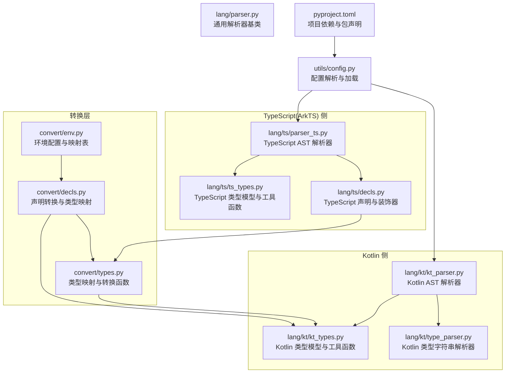
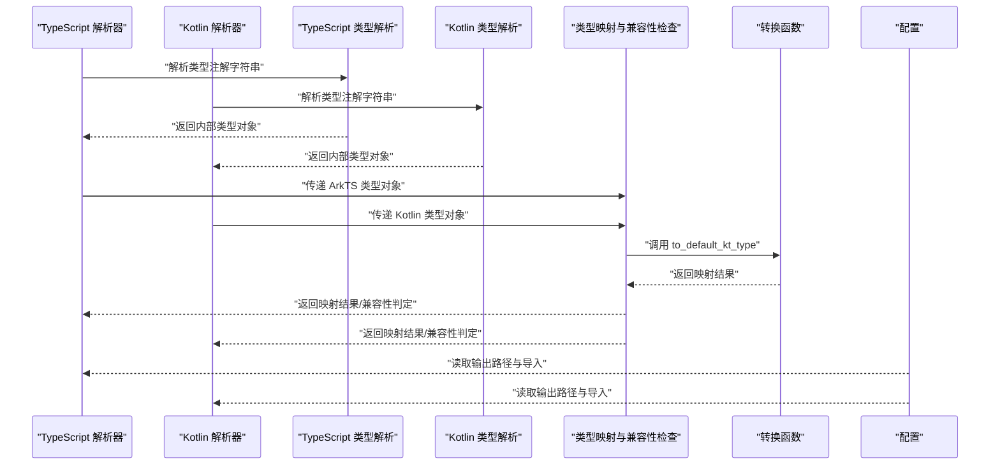
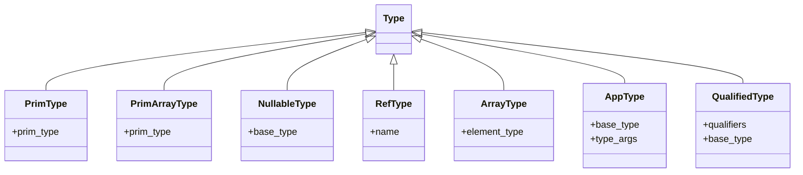
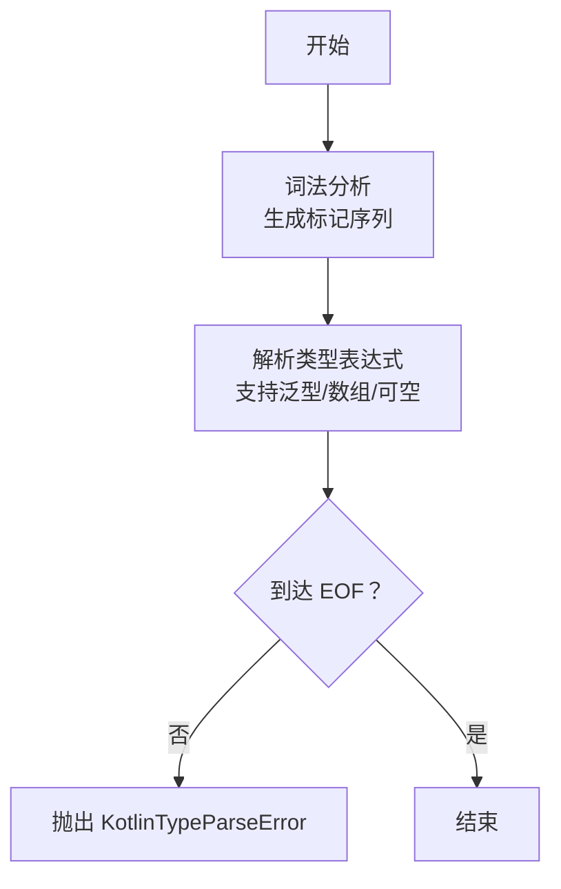
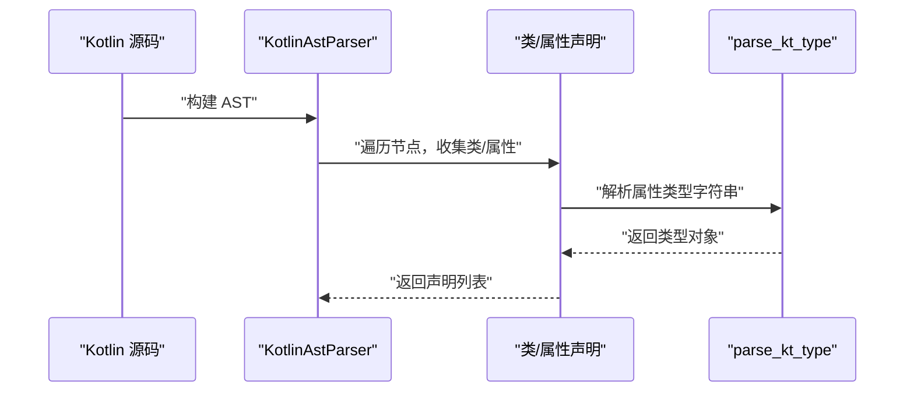
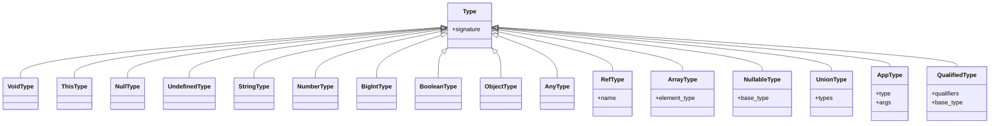
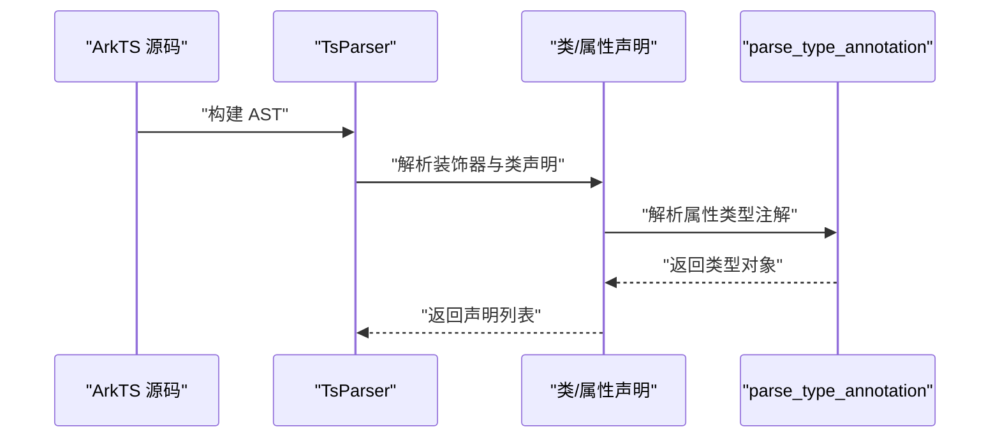
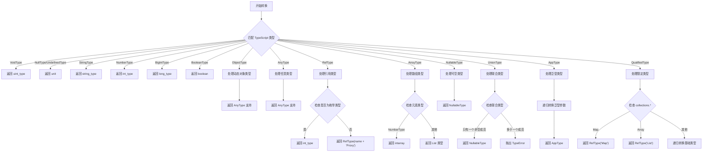
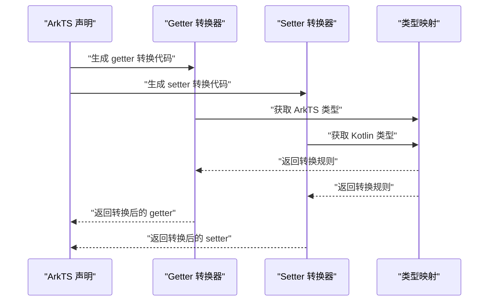
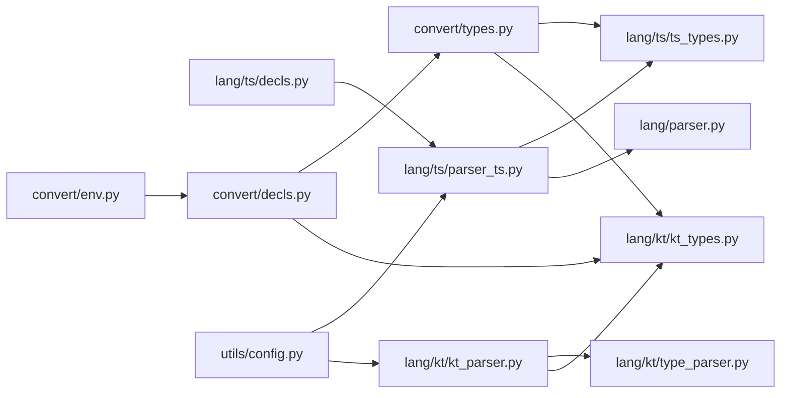

# 类型映射与转换

<cite>
**本文引用的文件**
- [lang/kt/kt_types.py](file://lang/kt/kt_types.py)
- [lang/kt/type_parser.py](file://lang/kt/type_parser.py)
- [lang/kt/kt_parser.py](file://lang/kt/kt_parser.py)
- [lang/ts/ts_types.py](file://lang/ts/ts_types.py)
- [lang/ts/parser_ts.py](file://lang/ts/parser_ts.py)
- [convert/types.py](file://convert/types.py)
- [convert/decls.py](file://convert/decls.py)
- [convert/env.py](file://convert/env.py)
- [lang/ts/decls.py](file://lang/ts/decls.py)
- [utils/config.py](file://utils/config.py)
- [pyproject.toml](file://pyproject.toml)
</cite>

## 更新摘要
**所做更改**
- 新增 ObjectType 和 AnyType 类型支持的详细说明
- 更新类型映射与转换函数，添加对动态对象和 any 类型的处理逻辑
- 扩展类型系统架构图，包含新的类型支持
- 更新故障排查指南，添加 ObjectType 和 AnyType 相关的问题诊断
- 补充类型转换的实际示例，展示动态类型处理场景

## 目录
1. [引言](#引言)
2. [项目结构](#项目结构)
3. [核心组件](#核心组件)
4. [架构总览](#架构总览)
5. [详细组件分析](#详细组件分析)
6. [依赖关系分析](#依赖关系分析)
7. [性能考量](#性能考量)
8. [故障排查指南](#故障排查指南)
9. [结论](#结论)
10. [附录](#附录)

## 引言
本文件围绕 ArkTS 与 Kotlin 之间的类型映射与转换机制进行系统化说明，目标包括：
- 深入解释 ArkTS 类型到 Kotlin 类型的映射规则与转换算法
- 详述类型兼容性检查机制与类型安全保证策略
- 说明类型解析器的实现原理与使用方法
- 提供类型转换过程中的错误处理与异常情况处理
- 展示类型映射的扩展机制与自定义映射规则的实现思路
- 给出类型转换的实际示例与性能优化策略
- 解释类型系统在整个 FFI 转换流程中的作用与重要性

**更新** 新增 ObjectType 和 AnyType 类型支持，为动态对象处理和 any 类型场景提供重要支持，扩展了 TypeScript 到 Kotlin 的类型映射能力。

## 项目结构
该仓库采用按语言分层的模块组织方式，核心类型系统与解析器分别位于 Kotlin 与 TypeScript（ArkTS）侧，并通过统一的解析框架与工具模块协同工作。

**图表来源**
- [lang/kt/kt_types.py](file://lang/kt/kt_types.py#L1-L332)
- [lang/kt/type_parser.py](file://lang/kt/type_parser.py#L1-L152)
- [lang/kt/kt_parser.py](file://lang/kt/kt_parser.py#L1-L242)
- [lang/ts/ts_types.py](file://lang/ts/ts_types.py#L1-L310)
- [lang/ts/parser_ts.py](file://lang/ts/parser_ts.py#L1-L462)
- [lang/ts/decls.py](file://lang/ts/decls.py#L1-L110)
- [convert/types.py](file://convert/types.py#L1-L67)
- [convert/decls.py](file://convert/decls.py#L1-L397)
- [convert/env.py](file://convert/env.py#L1-L85)
- [lang/parser.py](file://lang/parser.py#L1-L57)
- [utils/config.py](file://utils/config.py#L1-L84)
- [pyproject.toml](file://pyproject.toml#L1-L26)

**章节来源**
- [pyproject.toml](file://pyproject.toml#L1-L26)

## 核心组件
- Kotlin 类型模型与工具：定义 Kotlin 基础类型、可空类型、数组、泛型应用、限定类型等，并提供类型识别与查询工具函数（如判断 Map/List/Array、判断原生类型、提取引用名等）。
- Kotlin 类型字符串解析器：将 Kotlin 类型字符串解析为内部类型对象，支持泛型参数、数组后缀、可空标记等语法。
- Kotlin AST 解析器：基于 Tree-sitter Kotlin 语法树，抽取类、属性等声明，并在属性类型处调用 Kotlin 类型解析器。
- TypeScript 类型模型与工具：定义 TypeScript 原始类型、可空/未定义、联合类型、泛型应用、限定类型等，并提供类型识别与判断工具（如内置 Array/List/Map、可发送集合等）。
- **新增** TypeScript 动态类型：ObjectType 表示 JavaScript 对象类型，AnyType 表示任意类型，为动态类型处理提供支持。
- TypeScript AST 解析器：基于 Tree-sitter ArkTS 语法树，抽取装饰器、类、属性等声明，并解析类型注解。
- 类型映射与转换函数：提供 to_default_kt_type 函数，将 TypeScript 类型转换为 Kotlin 类型，支持数组类型、可空类型、联合类型等的转换。
- **更新** 类型映射与转换函数：现已包含 ObjectType 和 AnyType 的处理逻辑，支持动态对象和 any 类型到 Kotlin 的转换。
- 声明转换与类型映射：处理 ArkTS 声明到 Kotlin 声明的转换，包括属性类型映射、getter/setter 转换器生成等。
- 环境配置与映射表：维护类型枚举映射、类重命名映射、共享类字段映射等配置信息。
- 通用解析器基类：提供流式解析器的通用能力（推入/弹出节点、类型断言、分隔符解析等），被 TypeScript 解析器复用。
- 配置解析：从 JSON 配置中读取 Kotlin 输出路径与导入列表、包信息等，为转换流程提供上下文。

**章节来源**
- [lang/kt/kt_types.py](file://lang/kt/kt_types.py#L1-L332)
- [lang/kt/type_parser.py](file://lang/kt/type_parser.py#L1-L152)
- [lang/kt/kt_parser.py](file://lang/kt/kt_parser.py#L1-L242)
- [lang/ts/ts_types.py](file://lang/ts/ts_types.py#L1-L310)
- [lang/ts/parser_ts.py](file://lang/ts/parser_ts.py#L1-L462)
- [convert/types.py](file://convert/types.py#L1-L67)
- [convert/decls.py](file://convert/decls.py#L1-L397)
- [convert/env.py](file://convert/env.py#L1-L85)
- [lang/parser.py](file://lang/parser.py#L1-L57)
- [utils/config.py](file://utils/config.py#L1-L84)

## 架构总览
类型映射与转换的整体流程如下：
- 输入：ArkTS 源码（含装饰器、类、属性、类型注解）与 Kotlin 源码（含类、属性、类型注解）
- 解析阶段：分别使用 Tree-sitter 生成 AST，再由各自语言的解析器抽取声明与类型注解
- 类型解析阶段：将类型注解字符串解析为内部类型对象；同时利用工具函数识别集合类型、原生类型等
- 映射与兼容性检查：根据映射规则与兼容性策略，决定是否允许转换以及如何转换
- **更新** 动态类型处理：新增 ObjectType 和 AnyType 的专门处理逻辑，确保动态类型的安全转换
- 错误处理：在词法/语法解析、类型识别、映射检查等环节抛出明确异常
- 输出：生成 Kotlin 端可用的类型表示或转换后的声明

**图表来源**
- [lang/ts/parser_ts.py](file://lang/ts/parser_ts.py#L1-L462)
- [lang/kt/kt_parser.py](file://lang/kt/kt_parser.py#L1-L242)
- [lang/kt/type_parser.py](file://lang/kt/type_parser.py#L1-L152)
- [convert/types.py](file://convert/types.py#L1-L67)
- [utils/config.py](file://utils/config.py#L1-L84)

## 详细组件分析

### Kotlin 类型系统与工具函数
- 类型模型
  - 基础类型：Unit、Boolean、Byte、UByte、Short、UShort、Int、UInt、Long、ULong、Char、Float、Double、String、IntArray、LongArray
  - 复合类型：可空类型、数组类型、泛型应用类型、限定类型
- 工具函数
  - 判断集合类型：is_map_type、is_list_type、is_array_type
  - 判断原生类型：is_primitive_type
  - 判断引用类型：is_ref_type、get_ref_type_name

**图表来源**
- [lang/kt/kt_types.py](file://lang/kt/kt_types.py#L56-L191)

**章节来源**
- [lang/kt/kt_types.py](file://lang/kt/kt_types.py#L1-L332)

### Kotlin 类型字符串解析器
- 功能：将 Kotlin 类型字符串解析为内部类型对象
- 词法：识别标识符、点号、尖括号、逗号、问号、方括号、EOF
- 语法：支持简单类型、限定类型、泛型参数、数组后缀、可空标记
- 错误：在词法/语法不合法时抛出 KotlinTypeParseError

**图表来源**
- [lang/kt/type_parser.py](file://lang/kt/type_parser.py#L40-L151)

**章节来源**
- [lang/kt/type_parser.py](file://lang/kt/type_parser.py#L1-L152)

### Kotlin AST 解析器
- 功能：从 Kotlin 源码中抽取类与属性声明，并在属性类型处调用 Kotlin 类型解析器
- 关键流程：解析注解、解析属性修饰符与名称、解析类型节点、调用 parse_kt_type
- 兼容性：对 expect/actual 等包装节点进行适配

**图表来源**
- [lang/kt/kt_parser.py](file://lang/kt/kt_parser.py#L94-L128)
- [lang/kt/kt_parser.py](file://lang/kt/kt_parser.py#L130-L149)
- [lang/kt/kt_parser.py](file://lang/kt/kt_parser.py#L209-L230)
- [lang/kt/type_parser.py](file://lang/kt/type_parser.py#L149-L151)

**章节来源**
- [lang/kt/kt_parser.py](file://lang/kt/kt_parser.py#L1-L242)

### TypeScript 类型系统与工具函数
- 类型模型
  - 原始类型：void、this、null、undefined、string、number、boolean、bigint
  - **新增** 动态类型：ObjectType 表示 JavaScript 对象类型，AnyType 表示任意类型
  - 复合类型：RefType、NullableType、UnionType、AppType、QualifiedType、ArrayType
- 工具函数
  - 类型解包：unwrap_nullable
  - 原生类型判断：is_primitive_type
  - 集合类型判断：is_builtin_array_type、is_builtin_list_type、is_builtin_map_type、is_sendable_array_type、is_sendable_map_type
  - 引用类型判断：is_ref_type

**图表来源**
- [lang/ts/ts_types.py](file://lang/ts/ts_types.py#L8-L175)

**章节来源**
- [lang/ts/ts_types.py](file://lang/ts/ts_types.py#L1-L310)

### TypeScript AST 解析器
- 功能：从 ArkTS 源码中抽取装饰器、类、属性等声明，并解析类型注解
- 类型解析：支持 primary_type、union_type、generic_type、qualified_type 等节点
- **更新** 动态类型解析：新增对 predefined_type 节点的处理，支持 object 和 any 关键字
- 流式解析：继承通用解析器基类，使用 push/push_type_children/sep_parse 等工具

**图表来源**
- [lang/ts/parser_ts.py](file://lang/ts/parser_ts.py#L93-L141)
- [lang/parser.py](file://lang/parser.py#L1-L57)

**章节来源**
- [lang/ts/parser_ts.py](file://lang/ts/parser_ts.py#L1-L462)
- [lang/parser.py](file://lang/parser.py#L1-L57)

### 类型映射与转换函数
- 功能：将 TypeScript 类型转换为 Kotlin 类型，支持数组类型、可空类型、联合类型等的转换
- 实现：使用模式匹配（match-case）处理不同类型的转换规则
- 数组类型支持：新增 ArrayType 类，支持基本数组类型和泛型数组类型的转换
- 枚举类型处理：通过环境配置识别枚举类型并转换为整数类型
- **更新** 动态类型处理：新增 ObjectType 和 AnyType 的专门处理逻辑，确保动态类型的安全转换

**图表来源**
- [convert/types.py](file://convert/types.py#L10-L67)

**章节来源**
- [convert/types.py](file://convert/types.py#L1-L67)

### 声明转换与类型映射
- 功能：处理 ArkTS 声明到 Kotlin 声明的转换，包括属性类型映射、getter/setter 转换器生成等
- Getter 转换器：根据 ArkTS 类型和 Kotlin 类型生成相应的转换代码
- Setter 转换器：处理数据从 Kotlin 到 ArkTS 的转换
- 类型映射：支持基本类型、数组类型、可空类型、联合类型、限定类型、**新增** 动态类型（ObjectType、AnyType）的双向转换

**图表来源**
- [convert/decls.py](file://convert/decls.py#L15-L91)
- [convert/decls.py](file://convert/decls.py#L92-L170)

**章节来源**
- [convert/decls.py](file://convert/decls.py#L1-L397)

### 环境配置与映射表
- 功能：维护类型枚举映射、类重命名映射、共享类字段映射等配置信息
- 类型枚举映射：ts_enum_type_set 记录 TypeScript 枚举类型名称
- 类重命名映射：kt_class_rename_map 存储 ArkTS 类到 Kotlin 类的映射关系
- 共享类字段映射：kt_shared_class_field_name_map 存储共享字段的映射关系

**章节来源**
- [convert/env.py](file://convert/env.py#L1-L85)

### 类型解析器的实现原理与使用方法
- Kotlin 类型解析器
  - 实现：词法分析 + 递归下降解析
  - 使用：parse_kt_type("类型字符串") 返回内部类型对象
- TypeScript 类型解析器
  - 实现：基于 Tree-sitter ArkTS 的类型注解节点，递归解析 primary/generic/qualified/union
  - **更新** 动态类型支持：新增对 predefined_type 节点的处理，支持 object 和 any 关键字
  - 使用：parse_type_annotation() 返回内部类型对象
- Kotlin AST 解析器
  - 实现：抽取类/属性声明，在属性类型处调用 parse_kt_type
  - 使用：parse_kotlin_source("源码") 返回声明列表
- TypeScript AST 解析器
  - 实现：抽取装饰器与类声明，解析类型注解
  - 使用：TsParser("源码").parse() 返回声明列表
- 类型映射函数
  - 实现：使用模式匹配处理不同类型的转换规则
  - **更新** 动态类型处理：新增 ObjectType 和 AnyType 的专门处理逻辑
  - 使用：to_default_kt_type(ts_type) 返回对应的 Kotlin 类型

**章节来源**
- [lang/kt/type_parser.py](file://lang/kt/type_parser.py#L149-L151)
- [lang/ts/parser_ts.py](file://lang/ts/parser_ts.py#L93-L141)
- [lang/kt/kt_parser.py](file://lang/kt/kt_parser.py#L233-L234)
- [lang/ts/parser_ts.py](file://lang/ts/parser_ts.py#L446-L462)
- [convert/types.py](file://convert/types.py#L10-L67)

### 类型转换过程中的错误处理与异常情况
- Kotlin 类型解析错误
  - KotlinTypeParseError：词法/语法不合法时抛出
- Kotlin AST 解析错误
  - KotlinParseError：节点类型不匹配、缺少必需子节点等
- TypeScript 解析错误
  - SyntaxError：节点类型不支持或格式不正确
- **更新** 动态类型错误处理
  - ObjectType 和 AnyType 类型转换异常：当动态类型无法安全转换时抛出明确异常
  - 建议在映射阶段对不可兼容类型抛出明确异常
- 配置错误
  - 配置项缺失或类型不符时抛出 ValueError
- 未识别类型错误
  - to_default_kt_type 函数对未识别的类型抛出 TypeError

**章节来源**
- [lang/kt/type_parser.py](file://lang/kt/type_parser.py#L18-L19)
- [lang/kt/kt_parser.py](file://lang/kt/kt_parser.py#L16)
- [lang/ts/parser_ts.py](file://lang/ts/parser_ts.py#L66-L67)
- [utils/config.py](file://utils/config.py#L27-L42)
- [convert/types.py](file://convert/types.py#L67)

### 类型映射的扩展机制与自定义映射规则
- 注册表/映射表
  - 维护一个映射字典，键为 ArkTS 类型签名，值为 Kotlin 类型对象
  - 支持通配符与前缀限定（如 kotlin.*）
- 插件化接口
  - 定义映射插件接口，允许外部模块注入新规则
- 配置驱动
  - 在配置中声明自定义映射规则与别名，运行时动态加载
- 数组类型扩展
  - 通过 ArrayType 类支持基本数组类型和泛型数组类型的转换
  - 可以扩展支持更多特定的数组类型映射规则
- **新增** 动态类型扩展
  - ObjectType 和 AnyType 类型支持为动态类型处理提供基础
  - 可以扩展支持更多特定的动态类型映射规则

### 类型转换的实际示例与性能优化策略
- 示例场景
  - ArkTS 属性：prop: string | null
  - Kotlin 属性：prop: String?
  - ArkTS 方法：fun f(map: Map<string, number>): void
  - Kotlin 方法：fun f(map: Map<String, Double>): Unit
  - ArkTS 数组：numbers: number[]
  - Kotlin 数组：numbers: IntArray 或 List<Int>
  - **新增** ArkTS 动态类型：obj: object
  - **新增** Kotlin 动态类型：obj: Any
  - **新增** ArkTS 任意类型：value: any
  - **新增** Kotlin 任意类型：value: Any
- 性能优化
  - 词法/语法解析缓存：对重复出现的类型字符串进行缓存
  - 类型对象冻结：使用 frozen 数据类避免不必要的拷贝
  - 递归解析短路：在已知不兼容的情况下提前返回
  - 流式解析：减少中间结构，直接在 AST 上进行转换
  - 模式匹配优化：使用 match-case 语句提高类型匹配效率
  - **新增** 动态类型缓存：对 ObjectType 和 AnyType 的处理结果进行缓存

## 依赖关系分析
- 语言解析器依赖各自的类型解析器与类型模型
- TypeScript 解析器复用通用解析器基类
- 转换层依赖类型模型和解析器，提供类型映射功能
- 环境配置模块为转换层提供映射信息
- 配置模块为解析器提供输出路径与导入信息

**图表来源**
- [lang/ts/parser_ts.py](file://lang/ts/parser_ts.py#L1-L462)
- [lang/kt/kt_parser.py](file://lang/kt/kt_parser.py#L1-L242)
- [lang/kt/type_parser.py](file://lang/kt/type_parser.py#L1-L152)
- [lang/kt/kt_types.py](file://lang/kt/kt_types.py#L1-L332)
- [lang/ts/ts_types.py](file://lang/ts/ts_types.py#L1-L310)
- [lang/ts/decls.py](file://lang/ts/decls.py#L1-L110)
- [convert/types.py](file://convert/types.py#L1-L67)
- [convert/decls.py](file://convert/decls.py#L1-L397)
- [convert/env.py](file://convert/env.py#L1-L85)
- [lang/parser.py](file://lang/parser.py#L1-L57)
- [utils/config.py](file://utils/config.py#L1-L84)

**章节来源**
- [lang/ts/parser_ts.py](file://lang/ts/parser_ts.py#L1-L462)
- [lang/kt/kt_parser.py](file://lang/kt/kt_parser.py#L1-L242)
- [lang/kt/type_parser.py](file://lang/kt/type_parser.py#L1-L152)
- [lang/kt/kt_types.py](file://lang/kt/kt_types.py#L1-L332)
- [lang/ts/ts_types.py](file://lang/ts/ts_types.py#L1-L310)
- [lang/ts/decls.py](file://lang/ts/decls.py#L1-L110)
- [convert/types.py](file://convert/types.py#L1-L67)
- [convert/decls.py](file://convert/decls.py#L1-L397)
- [convert/env.py](file://convert/env.py#L1-L85)
- [lang/parser.py](file://lang/parser.py#L1-L57)
- [utils/config.py](file://utils/config.py#L1-L84)

## 性能考量
- 解析阶段
  - Tree-sitter 解析为 O(n) 线性复杂度，注意避免重复解析同一源码
  - 类型字符串解析采用递归下降，复杂度与类型深度成正比
- 类型识别
  - is_primitive_type/is_map_type/is_list_type 等为线性扫描，建议配合缓存
- 内存占用
  - 使用 frozen 数据类减少对象拷贝成本
  - 避免在解析过程中构造大量中间结构
- 并发与批处理
  - 对多个文件并行解析时，注意共享资源的线程安全
- 模式匹配优化
  - 使用 match-case 语句替代传统的 if-elif 链，提高类型匹配效率
- 数组类型处理
  - ArrayType 类的引入简化了数组类型的处理逻辑
  - 基本数组类型（IntArray、LongArray）的特殊处理提高了性能
- **新增** 动态类型处理
  - ObjectType 和 AnyType 类型的处理逻辑相对简单，性能影响较小
  - 可以考虑对常用动态类型进行缓存以提升性能

## 故障排查指南
- Kotlin 类型解析失败
  - 检查类型字符串是否符合 Kotlin 语法（泛型、数组、可空标记）
  - 查看 KotlinTypeParseError 的位置信息
- Kotlin AST 解析失败
  - 检查属性类型节点是否存在
  - 确认 expect/actual 包装节点的解析逻辑是否覆盖
- TypeScript 解析失败
  - 检查类型注解节点类型是否受支持
  - 确认分隔符与嵌套结构是否正确
  - **新增** 检查 predefined_type 节点是否正确解析为 ObjectType 或 AnyType
- 类型映射失败
  - 检查 to_default_kt_type 函数是否支持目标类型
  - 确认数组类型、联合类型、限定类型的处理逻辑
  - **新增** 检查 ObjectType 和 AnyType 的映射逻辑是否正确
- 配置问题
  - 检查配置文件字段类型与命名是否正确
  - 确认路径与导入列表是否有效
- 枚举类型映射问题
  - 检查 ts_enum_type_set 是否正确初始化
  - 确认枚举类型的名称是否匹配
- **新增** 动态类型问题
  - 检查 ObjectType 和 AnyType 类型是否正确解析
  - 确认动态类型转换逻辑是否符合预期
  - 验证动态类型在 Kotlin 中的等价表示（Any 类型）

**章节来源**
- [lang/kt/type_parser.py](file://lang/kt/type_parser.py#L83-L98)
- [lang/kt/kt_parser.py](file://lang/kt/kt_parser.py#L94-L127)
- [lang/ts/parser_ts.py](file://lang/ts/parser_ts.py#L66-L67)
- [convert/types.py](file://convert/types.py#L67)
- [utils/config.py](file://utils/config.py#L27-L61)
- [convert/env.py](file://convert/env.py#L64-L67)

## 结论
本项目通过清晰的语言侧类型模型与解析器，为 ArkTS 与 Kotlin 之间的类型映射与转换提供了坚实基础。移除 TypeVisitor 模式后，架构变得更加简洁高效，to_default_kt_type 函数的实现也更加直接明了。新增的 ArrayType 类支持了更完整的数组类型转换，包括基本数组类型和泛型数组类型的处理。

**更新** 最重要的改进是新增了 ObjectType 和 AnyType 类型支持，为动态对象处理和 any 类型场景提供了重要支持。TypeScript 类型系统中已经包含了 ObjectType 和 AnyType 的定义和解析逻辑，类型映射函数也相应地增加了对这些新类型的处理能力。这大大扩展了 TypeScript 到 Kotlin 的类型映射能力，使得动态类型场景也能得到良好的支持。

结合工具函数与配置模块，能够实现较为完善的类型识别、映射与兼容性检查。后续可在映射规则注册、插件化扩展与性能优化方面进一步增强，特别是针对动态类型的性能优化，以满足更复杂的 FFI 场景需求。

## 附录
- 术语
  - ArkTS：TypeScript 的方言，用于声明导出给 Kotlin 的接口
  - FFI：Foreign Function Interface，跨语言函数接口
  - TypeVisitor：类型访问者模式（已移除）
  - **新增** ObjectType：表示 JavaScript 对象类型的 TypeScript 类型
  - **新增** AnyType：表示任意类型的 TypeScript 类型
- 相关文件
  - Kotlin 类型模型与解析：[lang/kt/kt_types.py](file://lang/kt/kt_types.py#L1-L332)、[lang/kt/type_parser.py](file://lang/kt/type_parser.py#L1-L152)
  - Kotlin AST 解析：[lang/kt/kt_parser.py](file://lang/kt/kt_parser.py#L1-L242)
  - TypeScript 类型模型与解析：[lang/ts/ts_types.py](file://lang/ts/ts_types.py#L1-L310)、[lang/ts/parser_ts.py](file://lang/ts/parser_ts.py#L1-L462)
  - 类型映射与转换：[convert/types.py](file://convert/types.py#L1-L67)、[convert/decls.py](file://convert/decls.py#L1-L397)
  - 环境配置：[convert/env.py](file://convert/env.py#L1-L85)
  - TypeScript 声明与装饰器：[lang/ts/decls.py](file://lang/ts/decls.py#L1-L110)
  - 通用解析器基类：[lang/parser.py](file://lang/parser.py#L1-L57)
  - 配置解析：[utils/config.py](file://utils/config.py#L1-L84)
  - 项目依赖与包声明：[pyproject.toml](file://pyproject.toml#L1-L26)