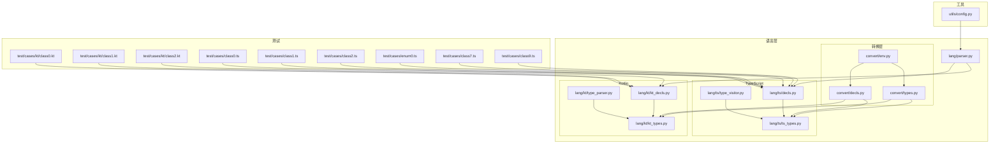
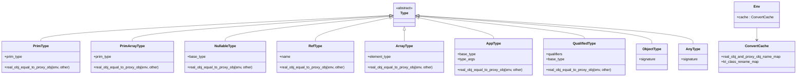
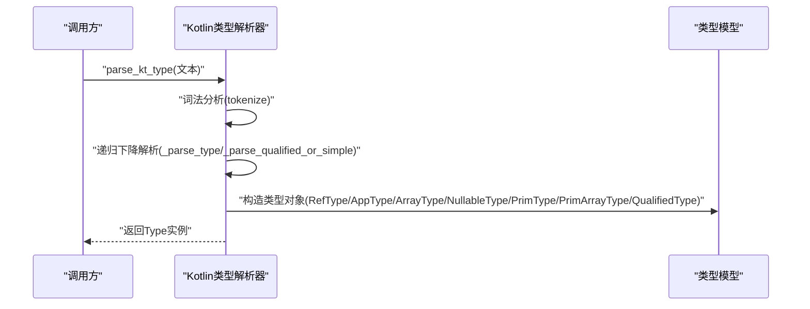
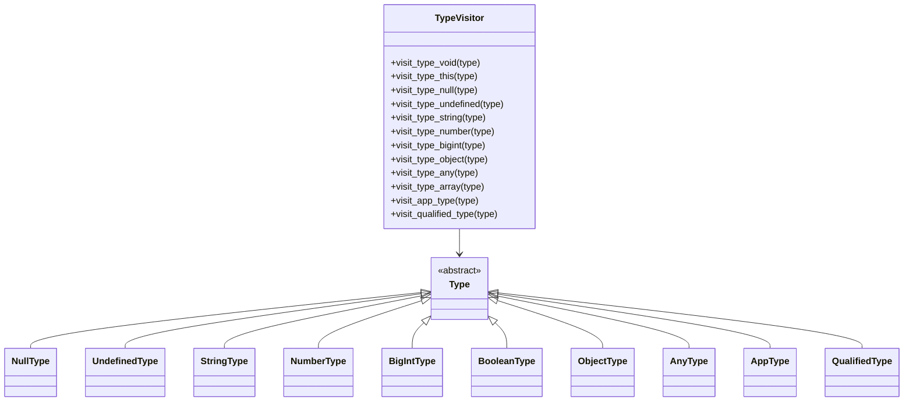
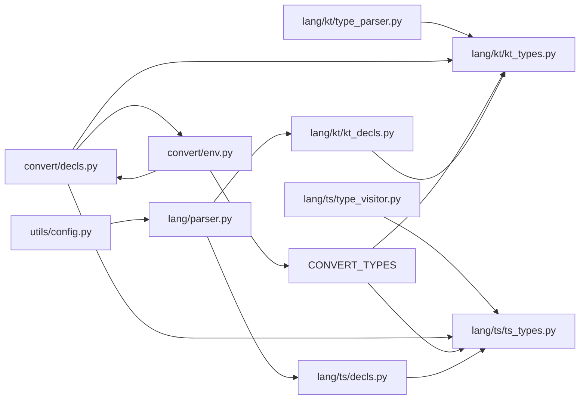

# 类型系统架构

<cite>
**本文引用的文件**
- [lang/kt/kt_types.py](file://lang/kt/kt_types.py)
- [lang/kt/type_parser.py](file://lang/kt/type_parser.py)
- [lang/kt/kt_decls.py](file://lang/kt/kt_decls.py)
- [lang/ts/ts_types.py](file://lang/ts/ts_types.py)
- [lang/ts/type_visitor.py](file://lang/ts/type_visitor.py)
- [lang/ts/decls.py](file://lang/ts/decls.py)
- [lang/parser.py](file://lang/parser.py)
- [convert/decls.py](file://convert/decls.py)
- [convert/types.py](file://convert/types.py)
- [convert/env.py](file://convert/env.py)
- [utils/config.py](file://utils/config.py)
- [pyproject.toml](file://pyproject.toml)
- [test/cases/kt/class0.kt](file://test/cases/kt/class0.kt)
- [test/cases/kt/class1.kt](file://test/cases/kt/class1.kt)
- [test/cases/kt/class2.kt](file://test/cases/kt/class2.kt)
- [test/cases/class0.ts](file://test/cases/class0.ts)
- [test/cases/class1.ts](file://test/cases/class1.ts)
- [test/cases/class2.ts](file://test/cases/class2.ts)
- [test/cases/enum0.ts](file://test/cases/enum0.ts)
- [test/cases/class7.ts](file://test/cases/class7.ts)
- [test/cases/class9.ts](file://test/cases/class9.ts)
</cite>

## 更新摘要
**变更内容**
- 新增类型比较机制增强，支持环境参数传递的实体类与代理类判等
- 改进类型转换系统，支持环境上下文中的类名映射和代理对象处理
- 增强类型比较的递归处理能力，支持复杂嵌套类型的精确匹配
- 完善转换器中的环境参数传递机制，提升类型转换的准确性

## 目录
1. [引言](#引言)
2. [项目结构](#项目结构)
3. [核心组件](#核心组件)
4. [架构总览](#架构总览)
5. [详细组件分析](#详细组件分析)
6. [依赖关系分析](#依赖关系分析)
7. [性能考量](#性能考量)
8. [故障排查指南](#故障排查指南)
9. [结论](#结论)
10. [附录](#附录)

## 引言
本文件系统化阐述该仓库中"类型系统架构"的设计与实现，重点覆盖以下方面：
- 类型系统的设计原则与抽象层次（基类、派生类型、工具函数）。
- Kotlin 类型定义（基础类型、复合类型、可空类型、原语数组类型、限定类型）与解析器实现。
- TypeScript 类型定义（基础类型、可空/联合类型、应用类型、限定类型、对象类型、任意类型）与访问器模式。
- 类型映射与转换机制（类型识别、兼容性检查思路、类型安全保障）。
- 类型解析器的实现细节与使用方法。
- 类型系统的扩展机制与自定义类型支持建议。
- 类型转换的实际示例与最佳实践。

## 项目结构
该项目围绕"语言层"组织，分别在 Kotlin 与 TypeScript 子模块下实现类型模型、解析器与声明结构，并通过通用解析器基类提供流式解析能力；工具模块提供配置解析能力；测试用例展示类型在真实场景中的使用。

**图表来源**
- [lang/kt/kt_types.py](file://lang/kt/kt_types.py#L1-L332)
- [lang/kt/type_parser.py](file://lang/kt/type_parser.py#L1-L157)
- [lang/kt/kt_decls.py](file://lang/kt/kt_decls.py#L1-L51)
- [lang/ts/ts_types.py](file://lang/ts/ts_types.py#L1-L310)
- [lang/ts/type_visitor.py](file://lang/ts/type_visitor.py#L1-L32)
- [lang/ts/decls.py](file://lang/ts/decls.py#L1-L57)
- [convert/decls.py](file://convert/decls.py#L1-L822)
- [convert/types.py](file://convert/types.py#L1-L69)
- [convert/env.py](file://convert/env.py#L1-L163)
- [lang/parser.py](file://lang/parser.py#L1-L57)
- [utils/config.py](file://utils/config.py#L1-L84)

**章节来源**
- [pyproject.toml](file://pyproject.toml#L1-L26)

## 核心组件
- Kotlin 类型系统
  - 基础类型枚举与具体类型封装：单元、布尔、字节、无符号整数、短整数、长整数、字符、浮点、双精度、字符串、整型数组、长整型数组。
  - 原语数组类型：新增原语数组类型支持，包括 IntArray 和 LongArray，提供专门的类型检测功能。
  - 复合类型：引用类型、数组类型、应用类型（泛型）、限定类型（带包名前缀）。
  - 可空类型：通过包装器表达可空语义。
  - 类型识别工具：判断 Map/List/Array、原语数组、是否为原生类型、是否为引用类型等。
  - **新增** 类型比较机制：支持环境参数传递的实体类与代理类判等，增强类型比较的准确性。
- TypeScript 类型系统
  - 基础类型：void、this、null、undefined、string、number、bigint、boolean、object、any。
  - 复合类型：可空类型、联合类型、应用类型（泛型）、限定类型。
  - 访问器模式：通过 TypeVisitor 对不同类型进行分发处理。
  - 类型识别工具：判断内置 Array/List/Map、限定类型应用、是否可发送类型等。
- 类型转换与映射
  - 结构化模式匹配：使用Python 3.10+的match-case语法重构类型转换逻辑，提供更清晰的类型处理分支。
  - 默认类型映射：支持基础类型、可空类型、联合类型、限定类型的应用映射。
  - 转换器：实现ArkTS与Kotlin之间的类型转换，包括原语数组类型的特殊处理。
  - **新增** 环境参数传递：转换器支持环境上下文传递，提升类型转换的准确性。

**章节来源**
- [lang/kt/kt_types.py](file://lang/kt/kt_types.py#L52-L132)
- [lang/ts/ts_types.py](file://lang/ts/ts_types.py#L8-L310)
- [convert/decls.py](file://convert/decls.py#L19-L200)
- [convert/types.py](file://convert/types.py#L10-L69)

## 架构总览
类型系统采用"语言内核 + 解析器 + 声明结构 + 转换层"的分层设计：
- 语言内核：每种语言独立维护类型模型与识别工具，确保类型表达与判定逻辑内聚。
- 解析器：Kotlin 使用自定义递归下降解析器；TypeScript 的解析器基类提供通用流式能力。
- 转换层：使用结构化模式匹配实现类型转换逻辑，提供清晰的类型处理分支。
- 声明结构：承载类型信息，用于后续的类型映射与转换。
- **新增** 环境管理：通过 ConvertCache 和 Env 管理转换过程中的环境上下文，支持类名映射和代理对象处理。

**图表来源**
- [lang/kt/kt_types.py](file://lang/kt/kt_types.py#L52-L187)
- [lang/ts/ts_types.py](file://lang/ts/ts_types.py#L8-L103)
- [convert/env.py](file://convert/env.py#L20-L31)

## 详细组件分析

### Kotlin 类型系统与解析器
- 类型模型
  - 基础类型：通过枚举统一管理，配合常量实例化。
  - 原语数组类型：新增`PrimArrayType`类型，支持`INTARRAY`和`LONGARRAY`两种原语数组类型。
  - 复合类型：数组、泛型、限定名均以不可变数据类表达，便于比较与打印。
  - 可空类型：以包装器形式表达，支持链式嵌套。
  - 类型识别：提供 Map/List/Array、原语数组、原生类型判断、引用类型判断等工具函数。
  - **新增** 类型比较机制：所有类型都支持`real_obj_equal_to_proxy_obj(env, other)`方法，通过环境参数传递实现实体类与代理类的精确判等。
- 解析器
  - 词法阶段：单字符标记、标识符、空白跳过、EOF 结束。
  - 语法阶段：先解析限定或简单名称，再处理泛型参数列表，最后处理数组与可空后缀。
  - 错误处理：统一抛出自定义异常，包含位置信息。
- 使用方法
  - 将 Kotlin 类型字符串交由解析器生成类型对象，随后使用工具函数进行类型判定与提取。

**图表来源**
- [lang/kt/type_parser.py](file://lang/kt/type_parser.py#L40-L156)
- [lang/kt/kt_types.py](file://lang/kt/kt_types.py#L52-L187)

**章节来源**
- [lang/kt/kt_types.py](file://lang/kt/kt_types.py#L52-L329)
- [lang/kt/type_parser.py](file://lang/kt/type_parser.py#L142-L156)

### TypeScript 类型系统与访问器
- 类型模型
  - 基础类型：void、this、null、undefined、string、number、bigint、boolean、object、any。
  - 复合类型：可空类型、联合类型、应用类型、限定类型。
  - 访问器模式：通过 TypeVisitor 对不同类型进行分发，便于扩展新处理逻辑。
- 类型识别
  - 内置集合类型判断：Array/List/Map。
  - 限定类型应用判断：如 collections.Array。
  - 可发送类型判断：针对 ArkTS 特定集合命名空间。
  - BigInt 类型判断：新增 is_bigint_type 函数，支持可空和联合类型的 BigInt 判断。
- 使用方法
  - 在访问器中实现相应 visit 方法，遍历 AST 并对类型进行转换或校验。

**图表来源**
- [lang/ts/type_visitor.py](file://lang/ts/type_visitor.py#L5-L32)
- [lang/ts/ts_types.py](file://lang/ts/ts_types.py#L23-L103)

**章节来源**
- [lang/ts/ts_types.py](file://lang/ts/ts_types.py#L8-L310)
- [lang/ts/type_visitor.py](file://lang/ts/type_visitor.py#L1-L32)

### 类型识别与工具函数
- Kotlin
  - is_map_type/is_list_type/is_array_type：支持可空、限定类型、应用类型穿透。
  - is_prim_array_type：新增原语数组类型检测，支持可空和限定类型形式。
  - is_primitive_type：区分原生类型与限定 kotlin.* 原生类型。
  - is_ref_type/get_ref_type_name：提取引用类型名。
- TypeScript
  - is_builtin_array_type/is_builtin_list_type/is_builtin_map_type：基于 RefType 名称匹配。
  - is_sendable_array_type/is_sendable_map_type：基于 QualifiedType 路径匹配。
  - is_primitive_type：支持可空与联合类型中非空成员为原生类型的情形。
  - is_bigint_type：新增 BigInt 类型判断函数，支持可空和联合类型的 BigInt 判断。

**章节来源**
- [lang/kt/kt_types.py](file://lang/kt/kt_types.py#L216-L329)
- [lang/ts/ts_types.py](file://lang/ts/ts_types.py#L204-L310)

### 类型转换与映射
- 结构化模式匹配
  - 使用Python 3.10+的match-case语法重构类型转换逻辑，提供更清晰的类型处理分支。
  - 支持复杂的类型模式匹配，包括嵌套类型、可空类型、限定类型等。
- 默认类型映射
  - 基础类型映射：将 TypeScript 原生类型映射到 Kotlin 原生类型。
  - 复合类型映射：数组与泛型映射到目标语言的等价表示；限定类型映射到目标语言的命名空间或模块路径。
  - 可空类型映射：根据目标语言的可空语义选择可空包装或联合类型。
  - 枚举类型映射：TypeScript 枚举映射到 Kotlin 整数类型。
  - BigInt 类型映射：bigint 映射到 Kotlin long 类型。
- 转换器实现
  - Getter转换器：处理ArkTS到Kotlin的类型转换，支持原语数组类型的特殊处理。
  - Setter转换器：处理Kotlin到ArkTS的类型转换，支持原语数组类型的特殊处理。
  - 默认类型映射：实现ArkTS与Kotlin之间的默认类型映射规则。
  - **新增** 环境参数传递：转换器支持 Env 参数传递，利用 ConvertCache 中的类名映射和代理对象信息。

**章节来源**
- [convert/decls.py](file://convert/decls.py#L19-L200)
- [convert/types.py](file://convert/types.py#L10-L69)

### 声明与类型绑定
- Kotlin
  - 属性声明携带类型字段，注解/修饰符可附加到属性上。
- TypeScript
  - 类、属性、方法、枚举等声明结构，属性与方法参数携带类型对象。
  - 装饰器与值对象用于承载元数据。

**章节来源**
- [lang/kt/kt_decls.py](file://lang/kt/kt_decls.py#L35-L51)
- [lang/ts/decls.py](file://lang/ts/decls.py#L32-L57)

### 环境管理与类名映射
- ConvertCache
  - class_rename_map：类重命名映射。
  - ts_enum_type_set：TypeScript 枚举类型集合。
  - kt_name_class_map：Kotlin 类名到声明的映射。
  - kt_shared_class_field_name_map：共享类字段映射。
  - kt_id_class_map：类ID到声明的映射。
  - **新增** real_obj_and_proxy_obj_name_map：实体类名到代理类名的映射，支持实体类与代理类的精确匹配。
  - **新增** suffix：代理类后缀，默认为"Proxy"。
- Env
  - cache：ConvertCache 实例。
  - config：ProxyConfig 配置。
- 类名映射函数
  - get_class_rename_map：根据装饰器配置生成类重命名映射。
  - get_real_obj_and_proxy_obj_name_map：建立实体类与代理类的映射关系。
  - get_class_name_and_package_name：获取类名和包名。

**章节来源**
- [convert/env.py](file://convert/env.py#L20-L163)

### 类型比较机制增强
- 实体类与代理类判等
  - RefType：支持实体类与代理类映射关系，通过 env.real_obj_and_proxy_obj_name_map 进行精确匹配。
  - AppType：支持泛型类型的递归比较，同时处理 List 与数组类型的特殊映射。
  - PrimArrayType：支持原生数组类型的精确比较，包括与 Array 和 List 的映射关系。
  - **新增** 环境参数传递：所有类型比较方法都接受 env 参数，利用环境上下文进行精确匹配。
- 递归比较机制
  - NullableType：递归比较基础类型。
  - ArrayType：递归比较元素类型。
  - QualifiedType：递归比较限定名和基础类型。
- 类型比较的准确性提升
  - 支持复杂的嵌套类型结构。
  - 提供精确的实体类与代理类匹配逻辑。
  - 增强泛型类型的比较能力。

**章节来源**
- [lang/kt/kt_types.py](file://lang/kt/kt_types.py#L52-L187)

### 流式解析器基类
- 提供队列式输入流、节点/令牌弹出/推入、分隔符解析、类型/令牌校验等通用能力。
- 为 Kotlin/TypeScript 解析器提供一致的解析框架。

**章节来源**
- [lang/parser.py](file://lang/parser.py#L8-L57)

## 依赖关系分析
- 模块耦合
  - Kotlin 类型解析器依赖 Kotlin 类型模型与名称映射表。
  - TypeScript 类型访问器依赖 TypeScript 类型模型。
  - 转换层依赖语言层的类型模型，使用结构化模式匹配进行类型处理。
  - **新增** 转换层依赖环境管理模块，通过 Env 和 ConvertCache 提供上下文信息。
  - 声明模块依赖各自语言的类型模型。
- 外部依赖
  - 项目声明了树形语法解析器与 Python 运行时依赖，支撑 ArkTS/Kotlin 解析与运行。

**图表来源**
- [lang/kt/type_parser.py](file://lang/kt/type_parser.py#L5-L16)
- [lang/kt/kt_types.py](file://lang/kt/kt_types.py#L1-L33)
- [lang/ts/type_visitor.py](file://lang/ts/type_visitor.py#L1-L32)
- [lang/ts/ts_types.py](file://lang/ts/ts_types.py#L1-L20)
- [convert/decls.py](file://convert/decls.py#L1-L14)
- [convert/types.py](file://convert/types.py#L1-L7)
- [convert/env.py](file://convert/env.py#L1-L6)
- [lang/kt/kt_decls.py](file://lang/kt/kt_decls.py#L7-L8)
- [lang/ts/decls.py](file://lang/ts/decls.py#L1-L3)
- [lang/parser.py](file://lang/parser.py#L1-L6)
- [utils/config.py](file://utils/config.py#L1-L25)

**章节来源**
- [pyproject.toml](file://pyproject.toml#L15-L21)

## 性能考量
- 类型对象不可变：使用冻结数据类，减少运行期修改成本，利于缓存与比较。
- 工具函数递归：类型识别函数按需穿透 Nullable/AppType/QualifiedType，注意避免深层嵌套导致的栈深度。
- 结构化模式匹配：使用Python 3.10+的match-case语法，提供更高效的类型匹配性能。
- 解析器状态：词法与语法解析器仅持有文本与游标，内存占用低。
- **新增** 环境参数传递：通过 Env 和 ConvertCache 提供上下文信息，避免重复计算和查找。
- **新增** 类型比较优化：实体类与代理类的映射关系通过字典查找实现O(1)时间复杂度。
- 扩展建议：若类型数量增长，可考虑将名称到类型的映射表改为更高效的查找结构；对频繁使用的类型识别结果进行记忆化。

## 故障排查指南
- Kotlin 类型解析错误
  - 症状：解析过程中抛出自定义异常，包含期望标记与当前位置。
  - 排查：检查类型字符串是否包含非法字符、泛型括号不匹配、数组后缀与可空后缀顺序是否正确。
- 类型识别异常
  - 症状：工具函数在不可识别类型上抛出异常或返回意外结果。
  - 排查：确认类型对象是否来自同一语言的类型模型；对于 Kotlin 的限定类型，确保 QualifiedType 的 qualifiers 与 RefType 的 name 组合正确。
- 结构化模式匹配错误
  - 症状：类型转换时出现模式不匹配或类型不兼容错误。
  - 排查：确认Python版本支持match-case语法；检查类型模式的匹配顺序和完整性。
- **新增** 类型比较错误
  - 症状：实体类与代理类比较失败或出现意外匹配。
  - 排查：确认 env.real_obj_and_proxy_obj_name_map 中的映射关系是否正确；检查类名映射函数的执行顺序。
- **新增** 环境参数传递问题
  - 症状：转换器无法访问环境上下文或类名映射信息。
  - 排查：确认 Env 实例的正确初始化；检查 ConvertCache 中的数据是否完整加载。
- 配置解析错误
  - 症状：配置文件格式不合法导致解析失败。
  - 排查：核对 JSON 字段类型与路径，确保 common.kotlinOutput、common.import、packages.*.arktsSourceDir 的类型与存在性。

**章节来源**
- [lang/kt/type_parser.py](file://lang/kt/type_parser.py#L18-L20)
- [convert/decls.py](file://convert/decls.py#L19-L200)
- [convert/env.py](file://convert/env.py#L151-L163)
- [utils/config.py](file://utils/config.py#L27-L62)

## 结论
该类型系统以清晰的抽象层次与模块化设计实现了 Kotlin 与 TypeScript 的类型建模与解析。通过不可变类型对象、访问器模式、结构化模式匹配与工具函数，系统在保持类型安全的同时提供了良好的扩展性。结合测试用例与配置解析模块，整体架构满足从源码到类型模型再到导出/生成流程的端到端需求。

**最新增强功能**显著提升了系统的实用性和准确性：
- 新增的类型比较机制支持环境参数传递，能够精确处理实体类与代理类的关系。
- 改进的转换系统通过环境上下文提供更准确的类名映射和代理对象处理。
- 增强的递归比较能力支持复杂嵌套类型的精确匹配。
- 完善的环境管理模块为类型转换提供了可靠的上下文支持。

这些改进使得类型系统在处理复杂的 ArkTS 与 Kotlin 互操作场景时更加稳健和可靠。

## 附录

### 类型映射与转换机制（设计建议）
- 映射策略
  - 基础类型映射：将 Kotlin 原生类型与 TypeScript 原生类型一一对应，必要时引入别名或桥接层。
  - 原语数组映射：Int/Long原语数组映射到目标语言的等价原语数组表示。
  - 复合类型映射：数组与泛型映射到目标语言的等价表示；限定类型映射到目标语言的命名空间或模块路径。
  - 可空类型映射：根据目标语言的可空语义选择可空包装或联合类型。
  - 枚举类型映射：TypeScript 枚举映射到 Kotlin 整数类型，支持枚举值的数值转换。
  - BigInt 类型映射：bigint 映射到 Kotlin long 类型，支持大整数的双向转换。
  - **新增** 实体类与代理类映射：通过环境参数传递实现精确的类名映射和代理对象处理。
- 兼容性检查
  - 在映射前后执行类型识别函数，确保 Map/List/Array/原语数组等集合类型得到正确识别。
  - 对于 ArkTS 场景，优先使用限定类型判断（如 collections.Array/Map）以保证跨平台一致性。
  - **新增** 类型比较兼容性：利用环境参数传递的类型比较机制，确保实体类与代理类的精确匹配。
- 类型安全保证
  - 使用不可变类型对象与严格的类型守卫，避免运行期类型污染。
  - 在访问器中为新增类型补充 visit 方法，防止漏判。
  - 使用结构化模式匹配确保类型处理的完整性和正确性。
  - **新增** 环境参数验证：在转换器中验证环境参数的有效性，提供详细的错误信息。
- 实际示例
  - Kotlin 示例：属性类型为可空整数或长整数，映射到 TypeScript 的 number | null 或 bigint | null。
  - TypeScript 示例：Array<string> 映射到 Kotlin 的 List<String> 或 kotlin.String[]，并处理可空性。
  - 原语数组示例：collections.Array<number> 映射到 Kotlin 的 IntArray 或 LongArray。
  - **新增** 实体类与代理类示例：通过环境参数传递实现实体类与代理类的精确映射和比较。
  - **新增** 复杂嵌套类型示例：List<Map<String, List<Boolean>>> 的精确类型比较和转换。

### 使用示例与最佳实践
- Kotlin
  - 使用解析器将类型字符串解析为类型对象，再调用工具函数进行类型识别与提取。
  - 在声明结构中为属性/方法参数绑定类型对象，便于后续转换与导出。
  - 注意原语数组类型的特殊处理，确保可空和限定类型形式的正确识别。
  - **新增** 利用类型比较机制进行实体类与代理类的精确匹配。
- TypeScript
  - 通过访问器遍历类型对象，实现类型转换或生成目标语言的类型签名。
  - 对于 ArkTS 特定集合，优先使用限定类型判断，确保与 Kotlin 端一致。
  - **新增** 利用环境参数传递机制进行精确的类型转换和映射。
- 转换层
  - 使用结构化模式匹配实现清晰的类型转换逻辑，便于维护和扩展。
  - 在转换器中处理原语数组类型的特殊转换需求。
  - **新增** 通过 Env 参数传递环境上下文，提升转换的准确性。
  - 增强枚举类型和 BigInt 类型的转换逻辑，确保数据的正确传递。
- **新增** 环境管理
  - 使用 ConvertCache 管理转换过程中的环境上下文，包括类名映射和代理对象信息。
  - 通过 Env 实例提供统一的环境访问接口。
  - 确保类名映射函数的正确执行顺序，避免映射关系冲突。
- 配置
  - 使用配置解析模块读取输出目录与导入路径，确保生成产物的可集成性。
  - **新增** 验证环境配置的完整性，确保转换过程的顺利进行。

**章节来源**
- [test/cases/kt/class0.kt](file://test/cases/kt/class0.kt#L1-L9)
- [test/cases/kt/class1.kt](file://test/cases/kt/class1.kt#L1-L18)
- [test/cases/kt/class2.kt](file://test/cases/kt/class2.kt#L1-L22)
- [test/cases/class0.ts](file://test/cases/class0.ts#L1-L4)
- [test/cases/class1.ts](file://test/cases/class1.ts#L1-L5)
- [test/cases/class2.ts](file://test/cases/class2.ts#L1-L4)
- [test/cases/enum0.ts](file://test/cases/enum0.ts#L1-L10)
- [test/cases/class7.ts](file://test/cases/class7.ts#L7-L7)
- [test/cases/class9.ts](file://test/cases/class9.ts#L13-L52)
- [utils/config.py](file://utils/config.py#L45-L84)
- [convert/env.py](file://convert/env.py#L151-L163)