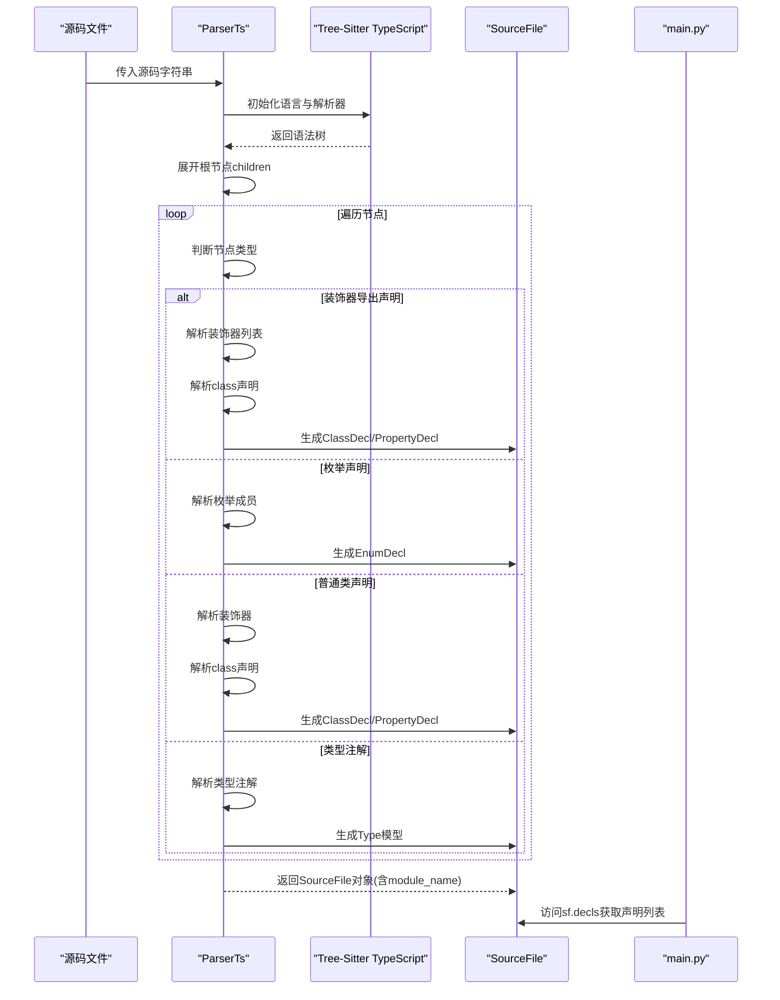
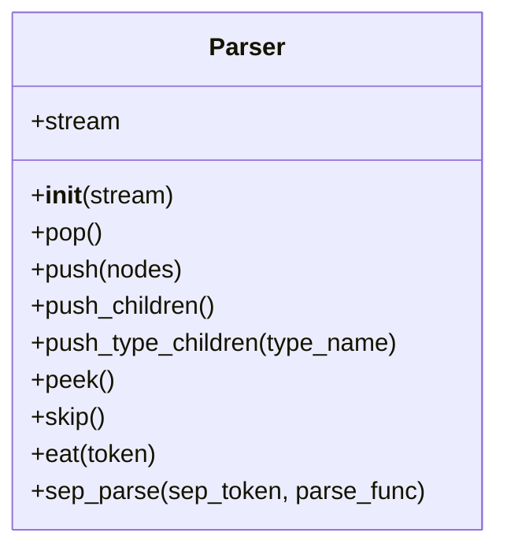
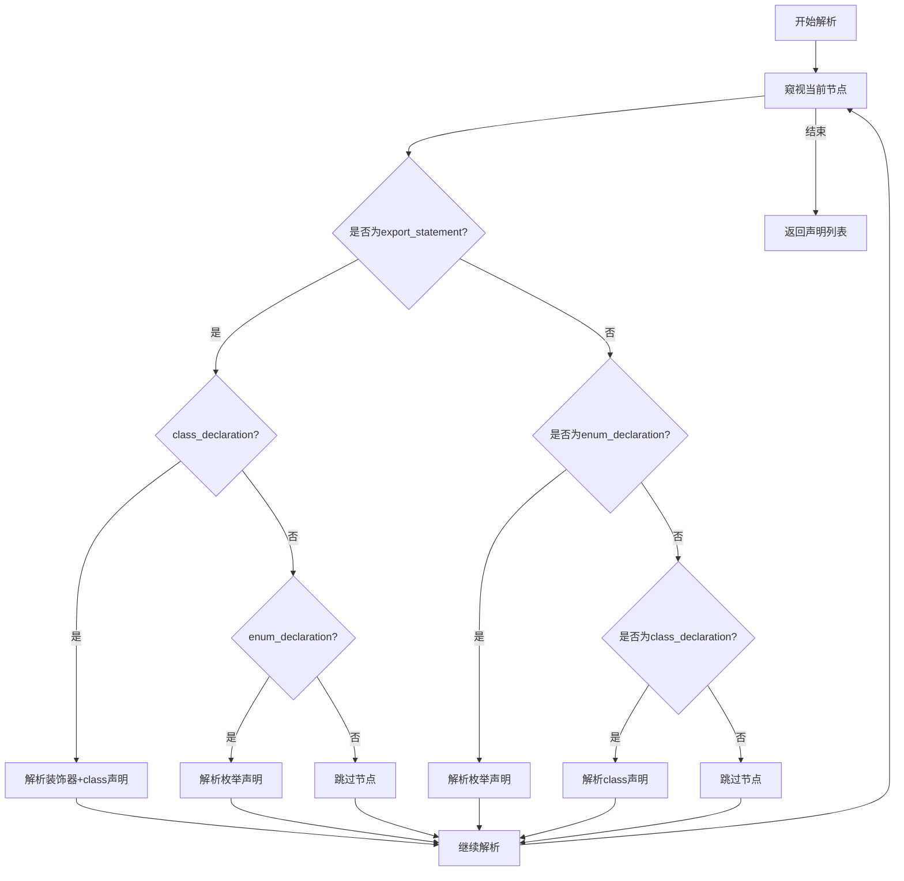
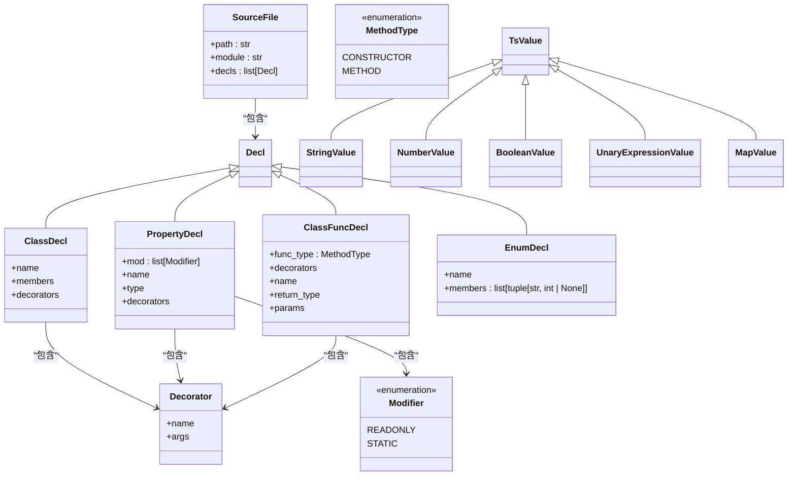
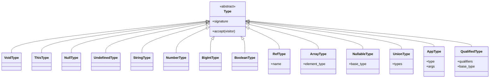
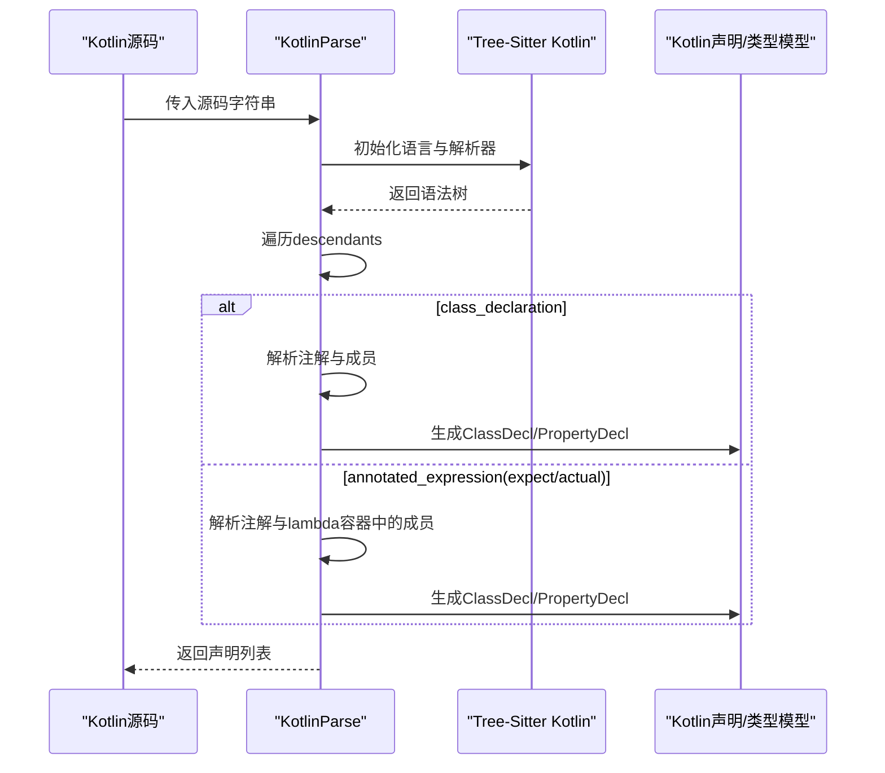
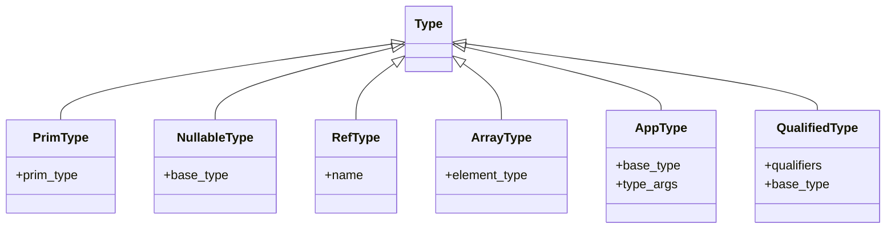
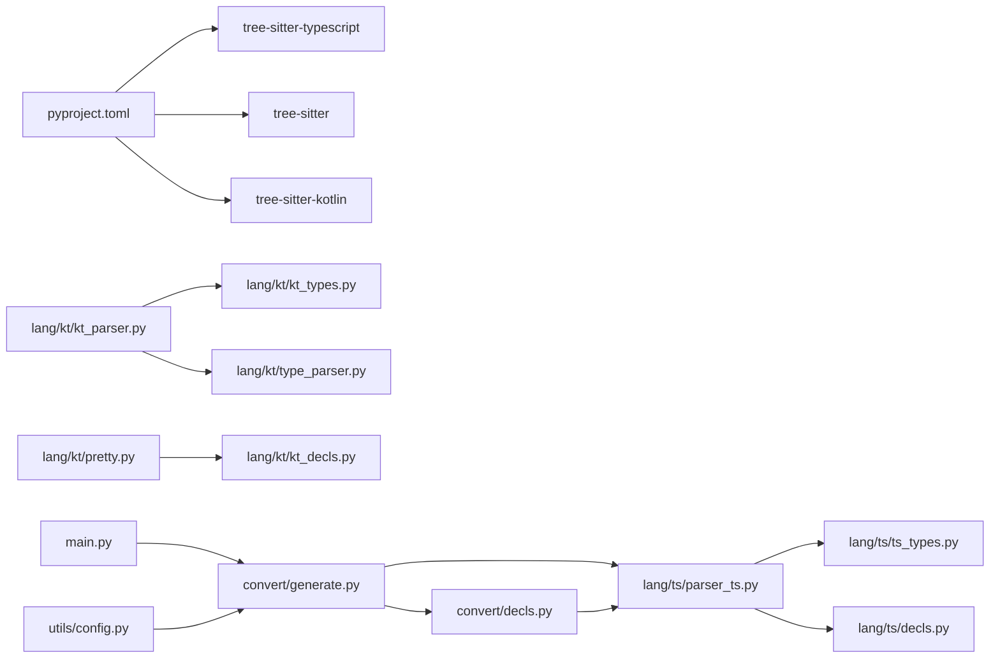

# TypeScript解析器

<cite>
**本文档引用的文件**
- [lang/parser.py](file://lang/parser.py)
- [lang/ts/parser_ts.py](file://lang/ts/parser_ts.py)
- [lang/ts/decls.py](file://lang/ts/decls.py)
- [lang/ts/ts_types.py](file://lang/ts/ts_types.py)
- [lang/kt/kt_parser.py](file://lang/kt/kt_parser.py)
- [lang/kt/kt_decls.py](file://lang/kt/kt_decls.py)
- [lang/kt/kt_types.py](file://lang/kt/kt_types.py)
- [lang/kt/type_parser.py](file://lang/kt/type_parser.py)
- [lang/kt/pretty.py](file://lang/kt/pretty.py)
- [utils/config.py](file://utils/config.py)
- [pyproject.toml](file://pyproject.toml)
- [main.py](file://main.py)
- [convert/generate.py](file://convert/generate.py)
- [convert/decls.py](file://convert/decls.py)
- [convert/decorators.py](file://convert/decorators.py)
- [convert/env.py](file://convert/env.py)
- [convert/types.py](file://convert/types.py)
- [convert/pretty.py](file://convert/pretty.py)
- [utils/file.py](file://utils/file.py)
- [test/config.json](file://test/config.json)
- [test/cases/class8.ts](file://test/cases/class8.ts)
- [test/cases/enum0.ts](file://test/cases/enum0.ts)
- [test/cases/class7.ts](file://test/cases/class7.ts)
- [test/cases/class6.ts](file://test/cases/class6.ts)
</cite>

## 更新摘要
**变更内容**
- 移除ArkTS解析器实现，完全迁移到TypeScript解析器系统
- 新增TypeScript解析器，基于Tree-Sitter TypeScript语言
- 新增装饰器解析机制，支持@ExportClass、@ExportField、@ExportMethod等
- 新增类型注解处理，支持基本类型、联合类型、泛型类型、限定类型
- 新增类声明解析，支持属性声明、方法声明和修饰符解析
- 新增枚举解析功能，支持const enum和enum声明
- 新增模块感知解析能力，通过module_name参数增强模块上下文信息
- 新增修饰符解析功能，支持readonly和static修饰符
- 新增可选属性支持，支持?标记的可选属性解析
- 新增方法体解析功能，支持方法体跳过解析
- 新增参数解析功能，支持必需参数解析

## 目录
1. [简介](#简介)
2. [项目结构](#项目结构)
3. [核心组件](#核心组件)
4. [架构总览](#架构总览)
5. [详细组件分析](#详细组件分析)
6. [依赖关系分析](#依赖关系分析)
7. [性能考虑](#性能考虑)
8. [故障排查指南](#故障排查指南)
9. [结论](#结论)
10. [附录](#附录)

## 简介
本项目为基于Tree-Sitter的TypeScript与Kotlin语法解析器，专注于TypeScript语言的专门解析实现。目标是：
- 解析TypeScript源码中的装饰器（如@ExportClass、@ExportField、@ExportMethod）并提取其参数
- 提供TypeScript类型系统模型与类型推断辅助函数
- 解析TypeScript类声明、属性声明与方法声明，并支持装饰器与类型注解
- 支持readonly和static属性修饰符、可选属性、枚举解析
- 支持模块感知的文件解析，通过module_name参数增强模块上下文信息
- 同时支持Kotlin的注解解析与类型解析，用于跨语言互操作场景
- 提供可扩展的解析框架与性能优化策略

本技术文档将从架构、数据结构、解析策略、装饰器与类型处理、到扩展开发指南进行系统化阐述。

## 项目结构
仓库采用按语言分层的模块化组织：
- lang/parser.py：通用流式解析器抽象基类
- lang/ts/*：TypeScript解析器与类型系统
- lang/kt/*：Kotlin解析器与类型系统
- utils/config.py：配置解析工具
- test/cases/*：测试用例（TypeScript与Kotlin）

```mermaid
graph TB
subgraph "解析器抽象"
P["lang/parser.py<br/>Parser 抽象类"]
end
subgraph "TypeScript"
TSP["lang/ts/parser_ts.py<br/>ParserTs"]
TSDecl["lang/ts/decls.py<br/>声明与装饰器模型"]
TSType["lang/ts/ts_types.py<br/>类型系统"]
end
subgraph "Kotlin"
KTP["lang/kt/kt_parser.py<br/>Kotlin解析器"]
KTDecl["lang/kt/kt_decls.py<br/>Kotlin声明与注解模型"]
KTType["lang/kt/kt_types.py<br/>Kotlin类型系统"]
KTTP["lang/kt/type_parser.py<br/>Kotlin类型字符串解析器"]
KTPP["lang/kt/pretty.py<br/>Kotlin打印工具"]
end
subgraph "工具"
CFG["utils/config.py<br/>配置解析"]
MAIN["main.py<br/>主程序入口"]
GEN["convert/generate.py<br/>模块转换器"]
DEC["convert/decls.py<br/>声明转换器"]
ENV["convert/env.py<br/>环境变量管理"]
end
subgraph "测试"
TSC["test/cases/class8.ts"]
TSE["test/cases/enum0.ts"]
TKC["test/cases/class7.ts"]
TKD["test/cases/class6.ts"]
CONF["test/config.json"]
end
P --> TSP
P --> KTP
TSP --> TSDecl
TSP --> TSType
KTP --> KTDecl
KTP --> KTType
KTP --> KTTP
KTPP --> KTDecl
CFG --> GEN
MAIN --> GEN
GEN --> DEC
GEN --> ENV
DEC --> TSP
CONF --> CFG
TSC --> TSP
TSE --> TSP
TKC --> KTP
TKD --> KTP
```

**图表来源**
- [lang/parser.py](file://lang/parser.py#L8-L108)
- [lang/ts/parser_ts.py](file://lang/ts/parser_ts.py#L13-L452)
- [lang/ts/decls.py](file://lang/ts/decls.py#L1-L120)
- [lang/ts/ts_types.py](file://lang/ts/ts_types.py#L1-L293)
- [lang/kt/kt_parser.py](file://lang/kt/kt_parser.py#L1-L200)
- [lang/kt/kt_decls.py](file://lang/kt/kt_decls.py#L1-L51)
- [lang/kt/kt_types.py](file://lang/kt/kt_types.py#L1-L191)
- [lang/kt/type_parser.py](file://lang/kt/type_parser.py#L1-L152)
- [lang/kt/pretty.py](file://lang/kt/pretty.py#L1-L97)
- [utils/config.py](file://utils/config.py#L1-L104)
- [main.py](file://main.py#L1-L36)
- [convert/generate.py](file://convert/generate.py#L1-L147)
- [convert/decls.py](file://convert/decls.py#L1-L533)
- [convert/env.py](file://convert/env.py#L1-L120)
- [test/config.json](file://test/config.json#L1-L22)

## 核心组件
- 抽象解析器：提供统一的流式节点访问与子节点展开能力，支持类型安全的子节点展开与分隔符解析
- TypeScript解析器：基于Tree-Sitter TypeScript语言，解析装饰器、类型注解、类与属性声明，支持readonly、static修饰符和可选属性
- 模块感知解析器：parse_ts_file函数支持module_name参数，为SourceFile对象提供模块上下文信息
- Kotlin解析器：基于Tree-Sitter Kotlin语言，解析注解与类型字符串，生成声明与类型模型
- 类型系统：TypeScript与Kotlin分别提供类型模型与类型判定辅助函数
- 配置工具：解析JSON配置，支持多包与导入路径管理
- SourceFile架构：提供文件级封装，包含路径、模块和声明列表

**章节来源**
- [lang/parser.py](file://lang/parser.py#L8-L108)
- [lang/ts/parser_ts.py](file://lang/ts/parser_ts.py#L13-L452)
- [lang/kt/kt_parser.py](file://lang/kt/kt_parser.py#L1-L200)
- [lang/ts/ts_types.py](file://lang/ts/ts_types.py#L1-L293)
- [lang/kt/kt_types.py](file://lang/kt/kt_types.py#L1-L191)
- [utils/config.py](file://utils/config.py#L1-L104)
- [lang/ts/decls.py](file://lang/ts/decls.py#L65-L68)

## 架构总览
TypeScript解析器以Tree-Sitter作为词法与语法前端，通过自定义解析器将AST节点映射为领域模型。当前实现使用SourceFile架构封装解析结果，提供统一的文件级访问接口。parse_ts_file函数现在支持可选的module_name参数，为每个SourceFile对象注入模块上下文信息。Kotlin解析器同样使用Tree-Sitter，但对注解与类型字符串进行二次解析，以获得更丰富的语义信息。

**图表来源**
- [lang/ts/parser_ts.py](file://lang/ts/parser_ts.py#L436-L441)
- [lang/ts/parser_ts.py](file://lang/ts/parser_ts.py#L449-L452)
- [main.py](file://main.py#L18-L25)

## 详细组件分析

### 抽象解析器 Parser
- 职责：维护解析流队列，提供弹出、推入、窥视、跳过、按类型展开等基础能力
- 关键点：
  - push_children/push_type_children：按节点类型安全展开子节点
  - sep_parse：按分隔符迭代解析序列
  - eat/peek/skip：对当前节点进行消费与校验
  - 增强的错误处理，对ERROR节点抛出详细异常信息

**图表来源**
- [lang/parser.py](file://lang/parser.py#L8-L108)

**章节来源**
- [lang/parser.py](file://lang/parser.py#L8-L108)

### TypeScript解析器 ParserTs
- 语言与初始化：使用Tree-Sitter TypeScript语言加载器，构建解析器并解析源码为语法树
- 修饰符解析：
  - parse_modifiers：识别readonly和static修饰符，返回Modifier枚举列表
- 可选属性解析：
  - parse_public_field_definition：支持?可选属性标记，跳过初始化表达式
  - parse_required_parameter：解析必需参数，支持可选参数标记
- 装饰器解析：
  - parse_decorator：识别@符号后跟随的标识符，若存在括号则解析逗号分隔表达式为参数值
  - parse_decorators：循环收集多个装饰器
  - parse_class_declaration：支持export修饰的装饰器类声明
- 枚举解析：
  - parse_enum_declaration：解析const enum和enum声明
  - parse_enum_members：解析枚举成员列表
  - parse_enum_member：解析枚举成员及其可选的数值赋值
- 声明解析：
  - parse_class_body：遍历类体，解析属性声明和方法声明
  - parse_method_definition：解析方法定义，支持构造函数和普通方法
- 表达式与字面量：
  - parse_expression：支持字符串、数字、布尔、对象字面量
  - parse_object_value：解析键值对，生成MapValue
  - parse_pair：解析键值对
- 类型注解解析：
  - parse_type_annotation：展开type_annotation节点
  - parse_type：递归解析基本类型、联合类型、泛型、限定类型等
- 方法体解析：
  - parse_method_body：跳过方法体内容直到找到匹配的闭合大括号
- 参数解析：
  - parse_formal_parameters：解析形式参数列表
- 入口解析：
  - parse：遍历顶层节点，识别export_statement、enum_declaration、class_declaration并解析

**图表来源**
- [lang/ts/parser_ts.py](file://lang/ts/parser_ts.py#L449-L452)

**章节来源**
- [lang/ts/parser_ts.py](file://lang/ts/parser_ts.py#L13-L452)

### TypeScript声明与装饰器模型
- TsValue：表达式值的抽象，包含字符串、数字、布尔、对象字面量
- Decorator：装饰器名称与参数列表（TsValue）
- Modifier枚举：READONLY和STATIC修饰符
- ClassDecl/PropertyDecl/ClassFuncDecl/EnumDecl：声明模型，支持装饰器字段
- PropertyDecl现在包含修饰符列表
- SourceFile：文件级封装，包含路径、模块和声明列表

**图表来源**
- [lang/ts/decls.py](file://lang/ts/decls.py#L9-L120)

**章节来源**
- [lang/ts/decls.py](file://lang/ts/decls.py#L1-L120)

### TypeScript类型系统
- Type抽象与具体类型：Void/This/Null/Undefined/String/Number/BigInt/Boolean/Ref/Nullable/Union/App/Qualified
- 辅助函数：
  - unwrap_nullable：解包可空类型
  - is_primitive_type/is_type_app/is_qualified_type_app：类型判定与匹配
  - is_builtin_* / is_sendable_*：内置集合类型判定

**图表来源**
- [lang/ts/ts_types.py](file://lang/ts/ts_types.py#L8-L293)

**章节来源**
- [lang/ts/ts_types.py](file://lang/ts/ts_types.py#L1-L293)

### 模块感知解析器
- parse_ts_file函数现在支持可选的module_name参数
- 功能：为每个解析的SourceFile对象注入模块上下文信息
- 使用场景：在多模块项目中区分不同模块的TypeScript文件
- 实现：在SourceFile构造函数中存储module_name参数

**章节来源**
- [lang/ts/parser_ts.py](file://lang/ts/parser_ts.py#L436-L441)

### 模块转换器
- convert_module_paths函数接收module_name参数
- 功能：在批量处理TypeScript文件时为每个文件设置相应的模块名称
- 实现：将module_name传递给parse_ts_file函数

**章节来源**
- [convert/generate.py](file://convert/generate.py#L86-L96)

### 装饰器与模块信息集成
- 装饰器解析支持模块路径信息
- 功能：通过@ExportClass装饰器的arkts_module_path参数传递模块信息
- 实现：在装饰器值解析中提取模块路径信息

**章节来源**
- [convert/decorators.py](file://convert/decorators.py#L1-L41)

### 类构造器与模块路径
- convert_class_constructor函数使用module_path参数
- 功能：当提供模块路径时，生成支持模块路径的构造函数
- 实现：在Kotlin代理类构造函数中包含模块路径参数

**章节来源**
- [convert/decls.py](file://convert/decls.py#L397-L432)

### Kotlin解析器与类型解析
- 注解解析：
  - _parse_decorator_from_annotation：从annotation节点解析注解名称与参数（字符串字面量）
  - _parse_annotations：遍历modifiers下的annotation节点，收集注解列表
- 声明解析：
  - _parse_property_declaration：解析val/var修饰符、变量名、类型（通过字符串类型解析器），并收集注解
  - _parse_class_declaration/_parse_class_like：解析class_declaration或expect/actual包装节点，收集成员
- 类型解析：
  - parse_kt_type：基于词法与递归下降解析器，支持简单/限定类型、泛型、数组、可空等
- 打印工具：
  - pretty_decl/pretty_program：将AST声明格式化输出，便于调试与测试

**图表来源**
- [lang/kt/kt_parser.py](file://lang/kt/kt_parser.py#L138-L157)

**章节来源**
- [lang/kt/kt_parser.py](file://lang/kt/kt_parser.py#L1-L200)
- [lang/kt/type_parser.py](file://lang/kt/type_parser.py#L1-L152)
- [lang/kt/kt_types.py](file://lang/kt/kt_types.py#L1-L191)
- [lang/kt/pretty.py](file://lang/kt/pretty.py#L1-L97)

### Kotlin类型系统
- Type抽象与具体类型：PrimType/NullableType/RefType/ArrayType/AppType/QualifiedType
- 基础常量：unit/boolean/整数与浮点类型/数组类型
- 类型判定与查询：
  - is_map_type/is_list_type/is_array_type/is_primitive_type/is_ref_type/get_ref_type_name

**图表来源**
- [lang/kt/kt_types.py](file://lang/kt/kt_types.py#L1-L191)

**章节来源**
- [lang/kt/kt_types.py](file://lang/kt/kt_types.py#L1-L191)

### 配置解析工具
- RootConfig/CommonConfig/PackageConfig：定义配置结构
- parse_config：从JSON解析配置，校验字段类型并生成数据类实例
- 支持kotlinOutput、imports与packages配置项

**章节来源**
- [utils/config.py](file://utils/config.py#L1-L104)

## 依赖关系分析
- 外部依赖：tree-sitter-typescript、tree-sitter、tree-sitter-kotlin
- 内部模块依赖：
  - ParserTs依赖ts_types与decls
  - Kotlin解析器依赖kt_types与type_parser
  - pretty工具依赖kt_decls与kt_types
  - main.py依赖parse_ts_file返回的SourceFile对象
  - convert/generate.py依赖module_name参数进行模块感知解析

**图表来源**
- [pyproject.toml](file://pyproject.toml#L15-L21)
- [lang/ts/parser_ts.py](file://lang/ts/parser_ts.py#L1-L10)
- [lang/kt/kt_parser.py](file://lang/kt/kt_parser.py#L1-L12)
- [main.py](file://main.py#L10-L15)
- [convert/generate.py](file://convert/generate.py#L1-L147)

**章节来源**
- [pyproject.toml](file://pyproject.toml#L1-L26)

## 性能考虑
- 语法树遍历：优先使用迭代方式（如ParserTs的while循环）避免深度递归导致栈溢出
- 子节点展开：使用push_type_children进行类型安全展开，减少错误分支
- 类型解析：TypeScript类型解析采用递归下降与分隔符解析，复杂度与节点数量线性相关
- Kotlin类型解析：词法与递归下降解析，注意输入合法性校验，避免无效字符引发异常
- 字符串编码：统一使用UTF-8编码，确保多语言字符正确解析
- SourceFile架构：通过单次解析获取完整文件信息，减少重复解析开销
- 模块感知解析：module_name参数的使用不会增加额外解析成本，仅在SourceFile对象中存储模块信息
- 可扩展性：通过抽象Parser与类型系统接口，便于新增语言或类型规则

## 故障排查指南
- 修饰符解析失败
  - 确认readonly和static关键字正确拼写
  - 检查修饰符位置是否在属性声明之前
  - 参考路径：[lang/ts/parser_ts.py](file://lang/ts/parser_ts.py#L134-L146)
- 可选属性解析异常
  - 确认?标记位置正确，位于冒号之前
  - 检查属性初始化表达式是否正确跳过
  - 参考路径：[lang/ts/parser_ts.py](file://lang/ts/parser_ts.py#L195-L215)
- 枚举解析失败
  - 确认枚举声明语法正确（const enum或enum）
  - 检查枚举成员赋值是否为合法表达式
  - 参考路径：[lang/ts/parser_ts.py](file://lang/ts/parser_ts.py#L423-L433)
- 装饰器解析失败
  - 确认装饰器以@开头且后跟标识符
  - 若带参数，确保括号内为合法表达式序列
  - 参考路径：[lang/ts/parser_ts.py](file://lang/ts/parser_ts.py#L63-L85)
- 类型注解解析异常
  - 检查类型注解节点类型是否为type_annotation
  - 确认基本类型、联合类型、泛型、限定类型分支覆盖完整
  - 参考路径：[lang/ts/parser_ts.py](file://lang/ts/parser_ts.py#L87-L126)
- 方法体解析异常
  - 确认方法体包含匹配的大括号对
  - 检查ERROR节点是否正确处理
  - 参考路径：[lang/ts/parser_ts.py](file://lang/ts/parser_ts.py#L258-L272)
- 参数解析失败
  - 确认参数列表包含正确的括号和逗号分隔符
  - 检查required_parameter节点类型
  - 参考路径：[lang/ts/parser_ts.py](file://lang/ts/parser_ts.py#L238-L256)
- SourceFile返回类型问题
  - 确认parse_ts_file返回类型为SourceFile
  - 检查main.py中使用sf.decls访问声明列表
  - 参考路径：[lang/ts/parser_ts.py](file://lang/ts/parser_ts.py#L436-L441)
  - 参考路径：[main.py](file://main.py#L18-L25)
- module_name参数使用问题
  - 确认module_name参数正确传递给parse_ts_file函数
  - 检查SourceFile对象的module属性是否正确设置
  - 参考路径：[lang/ts/parser_ts.py](file://lang/ts/parser_ts.py#L436-L441)
  - 参考路径：[convert/generate.py](file://convert/generate.py#L86-L96)
- 装饰器模块路径解析失败
  - 确认@ExportClass装饰器包含正确的arkts_module_path参数
  - 检查模块路径格式是否符合预期
  - 参考路径：[convert/decorators.py](file://convert/decorators.py#L1-L41)
- Kotlin注解参数非字符串
  - 当前仅解析字符串字面量，其他类型回退为原始文本
  - 参考路径：[lang/kt/kt_parser.py](file://lang/kt/kt_parser.py#L72-L88)
- Kotlin类型字符串解析错误
  - 检查类型字符串是否符合支持的语法（限定名、泛型、数组、可空）
  - 参考路径：[lang/kt/type_parser.py](file://lang/kt/type_parser.py#L92-L124)
- 配置解析异常
  - 确认JSON字段类型与顺序正确
  - 参考路径：[utils/config.py](file://utils/config.py#L66-L83)

**章节来源**
- [lang/ts/parser_ts.py](file://lang/ts/parser_ts.py#L134-L146)
- [lang/ts/parser_ts.py](file://lang/ts/parser_ts.py#L195-L215)
- [lang/ts/parser_ts.py](file://lang/ts/parser_ts.py#L423-L433)
- [lang/ts/parser_ts.py](file://lang/ts/parser_ts.py#L63-L85)
- [lang/ts/parser_ts.py](file://lang/ts/parser_ts.py#L87-L126)
- [lang/ts/parser_ts.py](file://lang/ts/parser_ts.py#L258-L272)
- [lang/ts/parser_ts.py](file://lang/ts/parser_ts.py#L238-L256)
- [lang/ts/parser_ts.py](file://lang/ts/parser_ts.py#L436-L441)
- [main.py](file://main.py#L18-L25)
- [convert/generate.py](file://convert/generate.py#L86-L96)
- [convert/decorators.py](file://convert/decorators.py#L1-L41)
- [lang/kt/kt_parser.py](file://lang/kt/kt_parser.py#L72-L88)
- [lang/kt/type_parser.py](file://lang/kt/type_parser.py#L92-L124)
- [utils/config.py](file://utils/config.py#L66-L83)

## 结论
本解析器以Tree-Sitter为核心，结合自定义解析器与类型系统，实现了对TypeScript与Kotlin的装饰器与类型解析。最新实现反映了真实的代码状态：当前代码使用SourceFile架构封装解析结果，提供统一的文件级访问接口。parse_ts_file函数现在支持可选的module_name参数，增强了模块感知的文件解析能力。TypeScript侧重点在装饰器与类型注解的提取与建模，Kotlin侧重点在注解与类型字符串的解析与打印。通过清晰的模块划分与抽象设计，具备良好的可扩展性与可维护性。

## 附录

### 示例：TypeScript修饰符与可选属性解析
- 示例文件：[test/cases/class8.ts](file://test/cases/class8.ts#L1-L13)
- readonly和static修饰符支持
- 可选属性（?）标记处理
- 解析要点：
  - @ExportClass与@ExportField装饰器被解析为Decorator对象
  - 属性类型支持联合类型（string | number | boolean）
  - 装饰器参数为对象字面量，解析为MapValue
  - 可选属性自动转换为NullableType

**章节来源**
- [test/cases/class8.ts](file://test/cases/class8.ts#L1-L13)
- [lang/ts/parser_ts.py](file://lang/ts/parser_ts.py#L134-L146)
- [lang/ts/parser_ts.py](file://lang/ts/parser_ts.py#L195-L215)
- [lang/ts/decls.py](file://lang/ts/decls.py#L85-L90)

### 示例：TypeScript枚举解析
- 示例文件：[test/cases/enum0.ts](file://test/cases/enum0.ts#L1-L9)
- 完整的枚举解析功能
- 解析要点：
  - 支持const enum和enum声明
  - 枚举成员可包含数值赋值
  - 枚举类型作为属性类型使用

**章节来源**
- [test/cases/enum0.ts](file://test/cases/enum0.ts#L1-L9)
- [lang/ts/parser_ts.py](file://lang/ts/parser_ts.py#L423-L433)
- [lang/ts/parser_ts.py](file://lang/ts/parser_ts.py#L395-L416)
- [lang/ts/parser_ts.py](file://lang/ts/parser_ts.py#L395-L412)

### 示例：复杂TypeScript类解析
- 示例文件：[test/cases/class7.ts](file://test/cases/class7.ts#L1-L21)
- 静态属性和只读属性支持
- 解析要点：
  - 静态方法和属性的解析
  - 只读属性的修饰符处理
  - 复杂类型注解的解析

**章节来源**
- [test/cases/class7.ts](file://test/cases/class7.ts#L1-L21)
- [lang/ts/parser_ts.py](file://lang/ts/parser_ts.py#L301-L325)
- [lang/ts/parser_ts.py](file://lang/ts/parser_ts.py#L134-L146)

### 示例：装饰器与方法解析
- 示例文件：[test/cases/class6.ts](file://test/cases/class6.ts#L1-L10)
- 装饰器处理改进
- 解析要点：
  - @ExportMethod装饰器的参数解析
  - 方法声明的完整解析
  - Kotlin类型注解的支持

**章节来源**
- [test/cases/class6.ts](file://test/cases/class6.ts#L1-L10)
- [lang/ts/parser_ts.py](file://lang/ts/parser_ts.py#L273-L298)
- [lang/ts/parser_ts.py](file://lang/ts/parser_ts.py#L216-L236)

### 示例：SourceFile架构使用
- 真实实现状态
- 使用方式：在main.py中通过`sf = parse_ts_file(i, module_name)`获取SourceFile对象
- 访问声明：通过`sf.decls`获取声明列表
- 文件信息：SourceFile包含文件路径和模块信息

**章节来源**
- [lang/ts/parser_ts.py](file://lang/ts/parser_ts.py#L436-L441)
- [main.py](file://main.py#L18-L25)
- [lang/ts/decls.py](file://lang/ts/decls.py#L65-L68)

### 示例：模块感知解析
- module_name参数使用示例
- 配置文件：[test/config.json](file://test/config.json#L15-L21)
- 使用场景：多模块TypeScript项目中的文件解析
- 实现方式：通过convert_module_paths函数传递module_name参数

**章节来源**
- [test/config.json](file://test/config.json#L15-L21)
- [convert/generate.py](file://convert/generate.py#L86-L96)

### 扩展开发指南
- TypeScript修饰符支持
  - 在parse_modifiers中添加新的修饰符分支
  - 扩展Modifier枚举类型
  - 参考路径：[lang/ts/parser_ts.py](file://lang/ts/parser_ts.py#L134-L146)
- TypeScript可选属性支持
  - 在parse_public_field_definition中处理?标记
  - 更新PropertyDecl构造函数
  - 参考路径：[lang/ts/parser_ts.py](file://lang/ts/parser_ts.py#L195-L215)
- TypeScript枚举支持
  - 实现parse_enum_declaration、parse_enum_members、parse_enum_member方法
  - 添加EnumDecl类定义
  - 参考路径：[lang/ts/parser_ts.py](file://lang/ts/parser_ts.py#L423-L433)
- TypeScript类型支持
  - 在类型解析中添加新的类型分支，扩展Type子类与is_*辅助函数
  - 参考路径：[lang/ts/ts_types.py](file://lang/ts/ts_types.py#L1-L293)
- Kotlin注解支持
  - 在注解解析中增加新注解分支，扩展Annotations参数类型
  - 参考路径：[lang/kt/kt_parser.py](file://lang/kt/kt_parser.py#L59-L90)
- Kotlin类型支持
  - 在type_parser中扩展语法支持，或新增专用解析器
  - 参考路径：[lang/kt/type_parser.py](file://lang/kt/type_parser.py#L68-L124)
- SourceFile架构扩展
  - 在parse_ts_file中扩展SourceFile构造函数参数
  - 更新main.py中对SourceFile的使用方式
  - module_name参数支持
  - 参考路径：[lang/ts/parser_ts.py](file://lang/ts/parser_ts.py#L436-L441)
  - 参考路径：[main.py](file://main.py#L18-L25)
- 模块感知功能扩展
  - 在convert_module_paths中正确传递module_name参数
  - 在装饰器解析中处理arkts_module_path参数
  - 在类构造器中使用module_path参数
  - 参考路径：[convert/generate.py](file://convert/generate.py#L86-L96)
  - 参考路径：[convert/decorators.py](file://convert/decorators.py#L1-L41)
  - 参考路径：[convert/decls.py](file://convert/decls.py#L397-L432)
- 方法体解析扩展
  - 在parse_method_body中处理嵌套大括号计数
  - 添加ERROR节点处理逻辑
  - 参考路径：[lang/ts/parser_ts.py](file://lang/ts/parser_ts.py#L258-L272)
- 参数解析扩展
  - 在parse_formal_parameters中处理多种参数类型
  - 扩展parse_required_parameter支持可选参数
  - 参考路径：[lang/ts/parser_ts.py](file://lang/ts/parser_ts.py#L238-L256)
  - 参考路径：[lang/ts/parser_ts.py](file://lang/ts/parser_ts.py#L216-L236)

**章节来源**
- [lang/ts/parser_ts.py](file://lang/ts/parser_ts.py#L134-L146)
- [lang/ts/parser_ts.py](file://lang/ts/parser_ts.py#L195-L215)
- [lang/ts/parser_ts.py](file://lang/ts/parser_ts.py#L423-L433)
- [lang/ts/ts_types.py](file://lang/ts/ts_types.py#L1-L293)
- [lang/kt/kt_parser.py](file://lang/kt/kt_parser.py#L59-L90)
- [lang/kt/type_parser.py](file://lang/kt/type_parser.py#L68-L124)
- [lang/ts/parser_ts.py](file://lang/ts/parser_ts.py#L436-L441)
- [main.py](file://main.py#L18-L25)
- [convert/generate.py](file://convert/generate.py#L86-L96)
- [convert/decorators.py](file://convert/decorators.py#L1-L41)
- [convert/decls.py](file://convert/decls.py#L397-L432)
- [lang/ts/parser_ts.py](file://lang/ts/parser_ts.py#L258-L272)
- [lang/ts/parser_ts.py](file://lang/ts/parser_ts.py#L238-L256)
- [lang/ts/parser_ts.py](file://lang/ts/parser_ts.py#L216-L236)