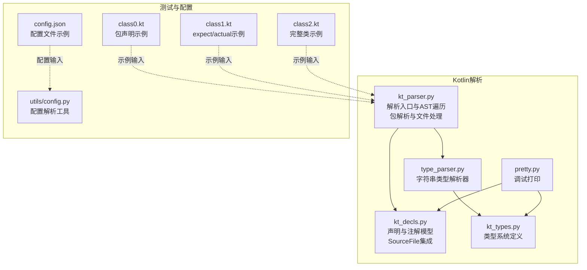
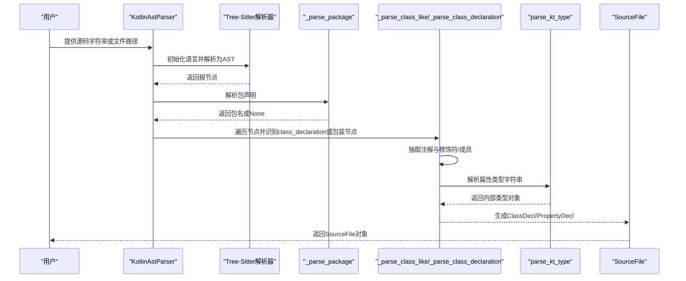
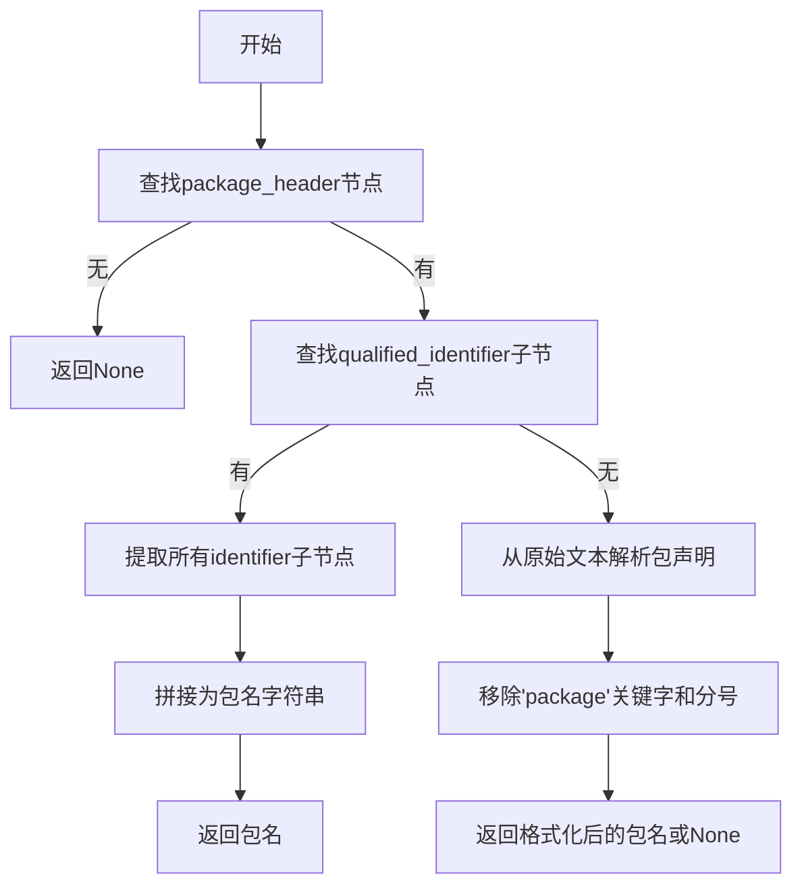
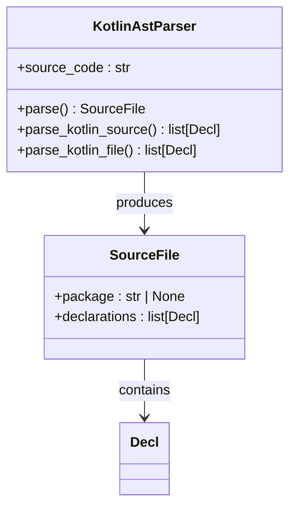
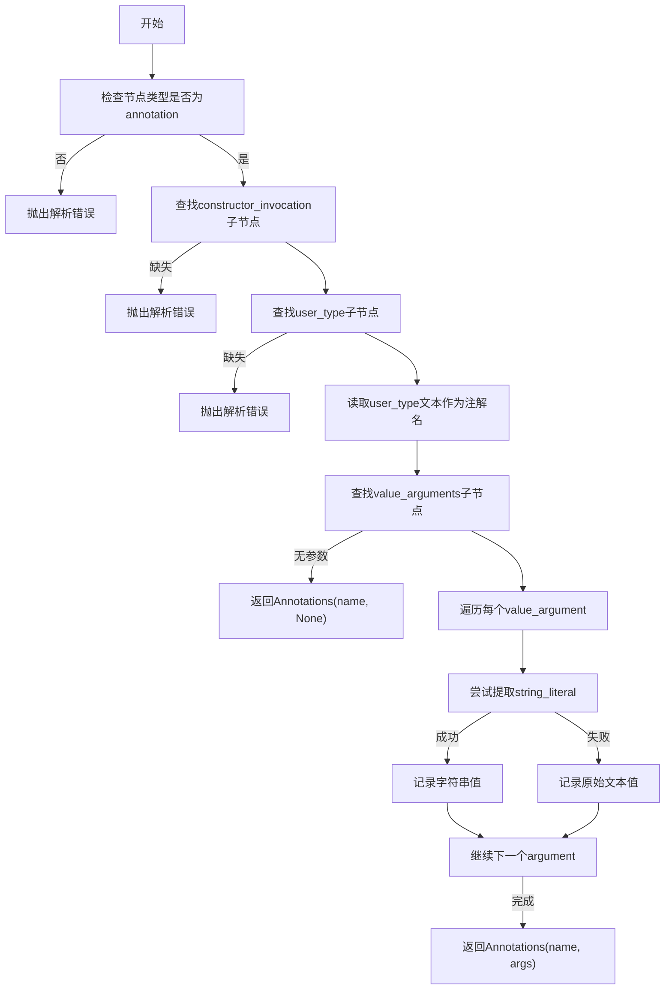
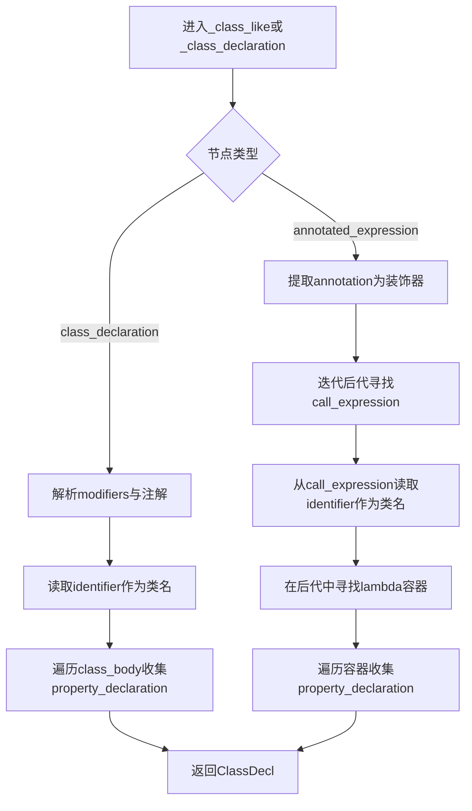
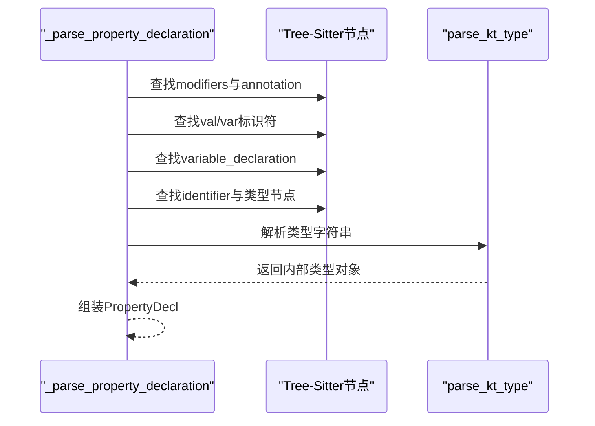
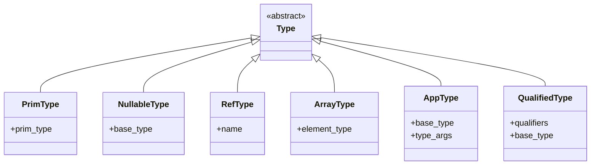
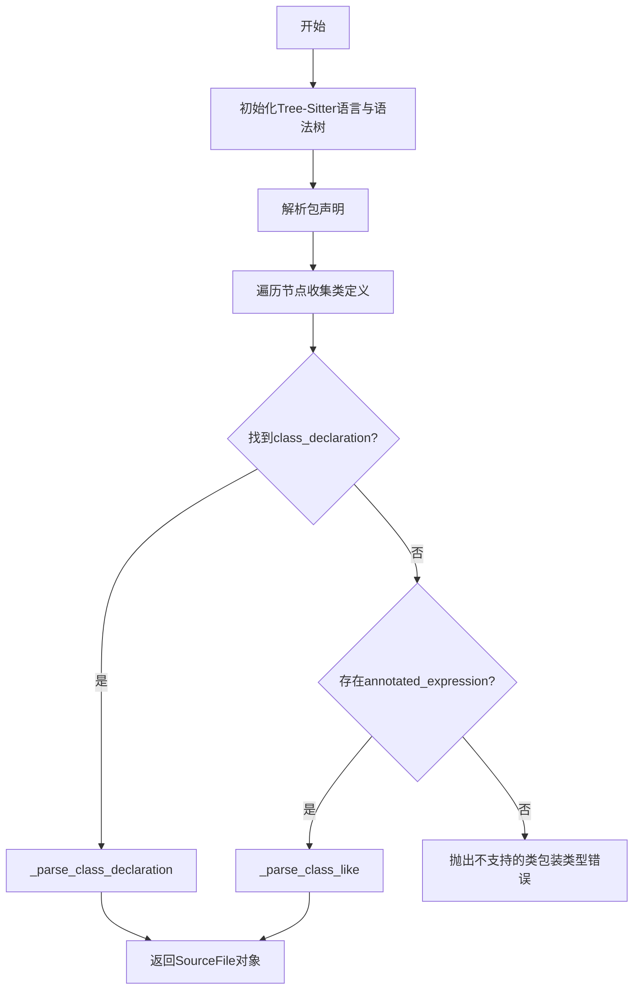
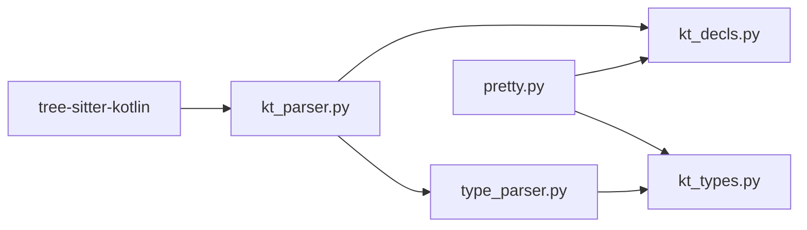

# Kotlin解析器

<cite>
**本文引用的文件**
- [lang/kt/kt_parser.py](file://lang/kt/kt_parser.py)
- [lang/kt/kt_decls.py](file://lang/kt/kt_decls.py)
- [lang/kt/kt_types.py](file://lang/kt/kt_types.py)
- [lang/kt/type_parser.py](file://lang/kt/type_parser.py)
- [lang/kt/pretty.py](file://lang/kt/pretty.py)
- [test/cases/kt/class0.kt](file://test/cases/kt/class0.kt)
- [test/cases/kt/class1.kt](file://test/cases/kt/class1.kt)
- [test/cases/kt/class2.kt](file://test/cases/kt/class2.kt)
- [pyproject.toml](file://pyproject.toml)
- [utils/config.py](file://utils/config.py)
- [test/config.json](file://test/config.json)
</cite>

## 目录
1. [引言](#引言)
2. [项目结构](#项目结构)
3. [核心组件](#核心组件)
4. [架构总览](#架构总览)
5. [详细组件分析](#详细组件分析)
6. [依赖分析](#依赖分析)
7. [性能考虑](#性能考虑)
8. [故障排查指南](#故障排查指南)
9. [结论](#结论)
10. [附录](#附录)

## 引言
本文件为Kotlin解析器的详细技术文档，聚焦于Kotlin语法解析的实现细节，涵盖注解解析机制（如@ShareClass、@ShareField、@JSONNAME等）、类型系统映射与属性声明处理。文档从系统架构、数据流、处理逻辑、错误处理到扩展开发给出完整说明，并通过图示与路径引用帮助读者快速定位实现位置。

**更新** 本次更新重点介绍了新增的包解析功能、SourceFile AST节点集成、增强的错误处理机制和文件处理灵活性。

## 项目结构
该仓库采用按语言分层的模块化组织方式：lang/kt目录下包含Kotlin解析的核心实现；lang/ts提供ArkTS解析对比参考；utils提供通用配置解析工具；test目录包含Kotlin与ArkTS的测试样例及配置。

**图表来源**
- [lang/kt/kt_parser.py](file://lang/kt/kt_parser.py#L207-L227)
- [lang/kt/kt_parser.py](file://lang/kt/kt_parser.py#L239-L260)
- [lang/kt/kt_decls.py](file://lang/kt/kt_decls.py#L14-L18)
- [lang/kt/kt_decls.py](file://lang/kt/kt_decls.py#L40-L57)
- [lang/kt/kt_types.py](file://lang/kt/kt_types.py#L1-L32)
- [lang/kt/type_parser.py](file://lang/kt/type_parser.py#L1-L152)
- [lang/kt/pretty.py](file://lang/kt/pretty.py#L1-L97)
- [test/cases/kt/class0.kt](file://test/cases/kt/class0.kt#L1-L9)
- [test/cases/kt/class1.kt](file://test/cases/kt/class1.kt#L1-L18)
- [test/cases/kt/class2.kt](file://test/cases/kt/class2.kt#L1-L22)
- [utils/config.py](file://utils/config.py#L1-L84)
- [test/config.json](file://test/config.json#L1-L27)

**章节来源**
- [pyproject.toml](file://pyproject.toml#L1-L26)

## 核心组件
- **解析器主体**：KotlinAstParser负责初始化Tree-Sitter语言与语法树，遍历节点并产出声明对象列表，现已集成包解析和SourceFile封装。
- **声明与注解模型**：ClassDecl、PropertyDecl、PropertyModifier、Annotations等用于承载解析后的结构化信息，新增SourceFile数据类封装包名和声明列表。
- **类型系统**：Type抽象与多种具体类型（PrimType、NullableType、RefType、ArrayType、AppType、QualifiedType）描述Kotlin类型。
- **类型解析器**：将字符串形式的Kotlin类型解析为内部类型对象，支持泛型、数组、可空性后缀等。
- **调试打印**：pretty模块提供带注解块输出的格式化打印，便于验证解析结果。

**更新** 新增包解析功能和SourceFile AST节点集成，增强了错误处理机制和文件处理灵活性。

**章节来源**
- [lang/kt/kt_parser.py](file://lang/kt/kt_parser.py#L207-L227)
- [lang/kt/kt_parser.py](file://lang/kt/kt_parser.py#L239-L260)
- [lang/kt/kt_decls.py](file://lang/kt/kt_decls.py#L14-L18)
- [lang/kt/kt_decls.py](file://lang/kt/kt_decls.py#L40-L57)
- [lang/kt/kt_types.py](file://lang/kt/kt_types.py#L52-L191)
- [lang/kt/type_parser.py](file://lang/kt/type_parser.py#L68-L151)
- [lang/kt/pretty.py](file://lang/kt/pretty.py#L29-L87)

## 架构总览
Kotlin解析器基于Tree-Sitter Kotlin语法生成的AST进行深度优先遍历，识别class_declaration与特殊包装节点（如annotated_expression），抽取注解与属性声明，同时使用字符串驱动的类型解析器将类型字符串转换为内部类型对象。新增的包解析功能允许从源文件中提取包声明信息。

**图表来源**
- [lang/kt/kt_parser.py](file://lang/kt/kt_parser.py#L239-L260)
- [lang/kt/kt_parser.py](file://lang/kt/kt_parser.py#L207-L227)
- [lang/kt/kt_parser.py](file://lang/kt/kt_parser.py#L130-L196)
- [lang/kt/type_parser.py](file://lang/kt/type_parser.py#L149-L151)

## 详细组件分析

### 包解析机制
- **包声明识别**：通过查找`package_header`节点来识别Kotlin源文件中的包声明。
- **限定标识符解析**：使用`qualified_identifier`节点提取包名的各个部分，支持多级包结构。
- **回退解析策略**：当AST节点不可用时，回退到从原始文本中解析包声明。
- **包名格式化**：将解析到的包名部分用点号连接，形成标准的Java/Kotlin包名格式。

**图表来源**
- [lang/kt/kt_parser.py](file://lang/kt/kt_parser.py#L207-L227)

**章节来源**
- [lang/kt/kt_parser.py](file://lang/kt/kt_parser.py#L207-L227)

### SourceFile AST节点集成
- **数据结构设计**：SourceFile数据类包含包名（可选）和声明列表，提供统一的解析结果封装。
- **包信息集成**：解析器在生成声明列表的同时收集包信息，形成完整的源文件表示。
- **向后兼容**：保留原有的声明列表返回接口，同时提供新的SourceFile对象接口。

**图表来源**
- [lang/kt/kt_decls.py](file://lang/kt/kt_decls.py#L14-L18)
- [lang/kt/kt_parser.py](file://lang/kt/kt_parser.py#L239-L260)

**章节来源**
- [lang/kt/kt_decls.py](file://lang/kt/kt_decls.py#L14-L18)
- [lang/kt/kt_parser.py](file://lang/kt/kt_parser.py#L239-L260)

### 注解解析机制
- **注解节点形态**：annotation由@符号与构造调用组成，构造调用包含user_type（注解名）与可选的value_arguments（参数列表）。
- **参数提取策略**：仅在当前用例中需要字符串参数，因此对每个value_argument尝试提取string_literal，若失败则回退为原始文本。
- **注解对象**：Annotations(name, args)保存注解名与参数列表（字符串值或整数值）。

**图表来源**
- [lang/kt/kt_parser.py](file://lang/kt/kt_parser.py#L59-L90)

**章节来源**
- [lang/kt/kt_parser.py](file://lang/kt/kt_parser.py#L59-L90)

### 类声明解析
- **支持两类入口**：
  - 直接class_declaration：标准类定义，直接解析名称、修饰符与类体成员。
  - 包装节点annotated_expression：常见于expect/actual场景，需递归遍历后代节点以提取类名与成员。
- **成员收集**：当前版本仅处理property_declaration；方法声明未在此阶段解析。
- **注解处理**：从modifiers中提取annotation节点，或在包装节点中直接提取。

**图表来源**
- [lang/kt/kt_parser.py](file://lang/kt/kt_parser.py#L160-L204)

**章节来源**
- [lang/kt/kt_parser.py](file://lang/kt/kt_parser.py#L160-L204)

### 属性声明解析
- **识别val/var修饰符**，确定PropertyModifier。
- **变量声明节点**包含identifier与类型节点，类型节点可能是user_type、nullable_type、function_type、parenthesized_type或dynamic_type。
- **使用parse_kt_type**将类型字符串解析为内部类型对象，并封装为PropertyDecl。

**图表来源**
- [lang/kt/kt_parser.py](file://lang/kt/kt_parser.py#L102-L135)
- [lang/kt/type_parser.py](file://lang/kt/type_parser.py#L149-L151)

**章节来源**
- [lang/kt/kt_parser.py](file://lang/kt/kt_parser.py#L102-L135)

### 类型系统与类型解析
- **类型系统定义**：Type为抽象基类，具体类型包括基础类型PrimType、可空类型NullableType、引用类型RefType、数组类型ArrayType、应用类型AppType（含泛型）、限定类型QualifiedType（含包前缀）。
- **字符串类型解析**：_Parser基于词法与递归下降解析，支持IDENT、DOT、LT/GT、COMMA、LBRACK/RBRACK、QMARK等标记，按"先限定/简单类型，再泛型参数，再后缀[]与?"的顺序解析。
- **名称到类型的映射**：_name_to_type根据名称映射到PrimType或RefType；_PRIM_BY_NAME提供名称到枚举的反向映射。

**图表来源**
- [lang/kt/kt_types.py](file://lang/kt/kt_types.py#L52-L98)

**章节来源**
- [lang/kt/kt_types.py](file://lang/kt/kt_types.py#L34-L191)
- [lang/kt/type_parser.py](file://lang/kt/type_parser.py#L40-L151)

### 解析器主流程与错误处理
- **错误类型**：KotlinParseError用于Kotlin语法解析错误；KotlinTypeParseError用于类型字符串解析错误。
- **主流程**：KotlinAstParser在初始化时构建Tree-Sitter语言与语法树，随后遍历节点，优先匹配class_declaration，其次处理expect/actual包装节点，最终返回声明列表。
- **错误处理策略**：在关键节点缺失或类型不匹配时抛出明确错误，便于上层捕获与诊断。

**图表来源**
- [lang/kt/kt_parser.py](file://lang/kt/kt_parser.py#L239-L260)
- [lang/kt/kt_parser.py](file://lang/kt/kt_parser.py#L160-L204)

**章节来源**
- [lang/kt/kt_parser.py](file://lang/kt/kt_parser.py#L24-L25)
- [lang/kt/kt_parser.py](file://lang/kt/kt_parser.py#L239-L260)

### 文件处理灵活性
- **字符串解析**：parse_kotlin_source_file接受源码字符串，返回SourceFile对象。
- **声明列表解析**：parse_kotlin_source返回仅包含声明的列表，保持向后兼容。
- **文件解析**：parse_kotlin_file支持从文件路径解析，自动处理文件编码和路径解析。

**更新** 新增了文件处理灵活性，支持多种输入方式。

**章节来源**
- [lang/kt/kt_parser.py](file://lang/kt/kt_parser.py#L263-L278)

### 输出与调试
- **pretty模块**提供带注解块的格式化输出，便于人工核验解析结果。
- **支持字符串与整数参数**的注解值格式化。
- **SourceFile输出**：现在可以显示包名信息和完整的声明列表。

**章节来源**
- [lang/kt/pretty.py](file://lang/kt/pretty.py#L29-L87)

## 依赖分析
- **外部依赖**：tree-sitter与tree-sitter-kotlin用于语法解析；Python标准库与typing-extensions提供运行时支持。
- **内部模块耦合**：kt_parser依赖kt_decls与type_parser；type_parser依赖kt_types；pretty依赖kt_decls与kt_types。

**图表来源**
- [pyproject.toml](file://pyproject.toml#L15-L21)
- [lang/kt/kt_parser.py](file://lang/kt/kt_parser.py#L7-L8)
- [lang/kt/type_parser.py](file://lang/kt/type_parser.py#L5-L16)
- [lang/kt/kt_types.py](file://lang/kt/kt_types.py#L1-L32)
- [lang/kt/pretty.py](file://lang/kt/pretty.py#L13-L22)

**章节来源**
- [pyproject.toml](file://pyproject.toml#L15-L21)

## 性能考虑
- **语法树遍历**：采用深度优先遍历，时间复杂度与节点数量线性相关；建议在大规模源码场景中分批处理或限制解析范围。
- **包解析优化**：包解析仅在AST中查找一次，避免重复解析原始文本。
- **类型解析**：字符串类型解析为线性扫描与递归下降，整体仍为线性复杂度；避免在热路径重复解析相同类型字符串。
- **内存占用**：AST节点与中间字符串的生命周期应尽量短，及时释放不必要的引用。

**更新** 新增了包解析的性能考虑。

## 故障排查指南
- **常见错误**
  - 注解缺失：当annotation缺少constructor_invocation或user_type时会抛出解析错误。
  - 属性类型缺失：property_declaration必须包含类型节点，否则抛出解析错误。
  - 类包装类型不支持：当遇到非class_declaration且非annotated_expression的包装节点时抛出错误。
  - 类型解析异常：类型字符串包含未知字符或不合法的泛型/数组/可空语法时抛出类型解析错误。
  - 包解析失败：当package_header节点不存在时返回None，不影响整体解析流程。
- **定位方法**
  - 使用pretty模块输出解析结果，核对注解与属性类型是否正确。
  - 检查测试用例中的注解与类型写法是否符合当前解析器预期。
  - 在KotlinAstParser初始化后，检查语法树根节点类型与子节点结构。
  - 验证SourceFile对象的package字段是否正确提取。

**更新** 新增了包解析相关的故障排查指导。

**章节来源**
- [lang/kt/kt_parser.py](file://lang/kt/kt_parser.py#L59-L90)
- [lang/kt/kt_parser.py](file://lang/kt/kt_parser.py#L102-L135)
- [lang/kt/kt_parser.py](file://lang/kt/kt_parser.py#L160-L204)
- [lang/kt/kt_parser.py](file://lang/kt/kt_parser.py#L207-L227)
- [lang/kt/type_parser.py](file://lang/kt/type_parser.py#L18-L19)
- [lang/kt/type_parser.py](file://lang/kt/type_parser.py#L83-L98)

## 结论
本解析器以Tree-Sitter为基础，结合自定义的注解与类型解析逻辑，实现了对Kotlin类声明、注解与属性类型的结构化解析。新增的包解析功能和SourceFile AST节点集成为Kotlin源文件提供了更完整的表示能力。增强的错误处理机制和文件处理灵活性使得解析器更加健壮和易用。其设计清晰、模块化程度高，便于扩展与维护。后续可在方法声明解析、更丰富的注解参数支持以及ArkTS类型映射方面进一步完善。

**更新** 本次更新显著增强了解析器的功能完整性，特别是包解析和文件处理方面的改进。

## 附录

### 示例：注解与类型解析结果
- **示例输入**：参见以下测试文件
  - [test/cases/kt/class0.kt](file://test/cases/kt/class0.kt#L1-L9) - 包声明示例
  - [test/cases/kt/class1.kt](file://test/cases/kt/class1.kt#L1-L18) - expect/actual示例
  - [test/cases/kt/class2.kt](file://test/cases/kt/class2.kt#L1-L22) - 完整类示例
- **运行解析器并打印结果**
  - 参考脚本入口：[lang/kt/kt_parser.py](file://lang/kt/kt_parser.py#L280-L284)
  - 调试打印入口：[lang/kt/pretty.py](file://lang/kt/pretty.py#L89-L97)

### 配置与集成
- **配置文件示例**：[test/config.json](file://test/config.json#L1-L27)
- **配置解析工具**：[utils/config.py](file://utils/config.py#L45-L62)

### 扩展开发指南
- **新增注解支持**
  - 在注解解析函数中扩展参数提取逻辑，确保与现有Args模型兼容。
  - 更新测试用例以覆盖新注解的解析路径。
- **新增类型支持**
  - 在类型系统中添加新的Type变体，并在类型解析器中增加相应的解析分支。
  - 补充类型判断辅助函数（如is_xxx_type）以满足上层转换需求。
- **新增声明类型**
  - 在声明模型中新增对应的数据类，并在解析器中添加对应的节点识别与组装逻辑。
- **ArkTS类型映射**
  - 当前解析器专注于Kotlin侧的类型与注解解析；ArkTS类型映射可作为独立模块在上层进行转换，遵循"Kotlin类型 → 内部类型 → ArkTS类型"的转换链路。
- **包解析扩展**
  - 可以扩展包解析功能以支持更复杂的包声明格式。
  - 可以添加包名验证和规范化功能。
- **文件处理增强**
  - 可以添加批量文件处理功能。
  - 可以添加文件编码检测和自动转换功能。

**更新** 新增了包解析和文件处理相关的扩展开发指导。