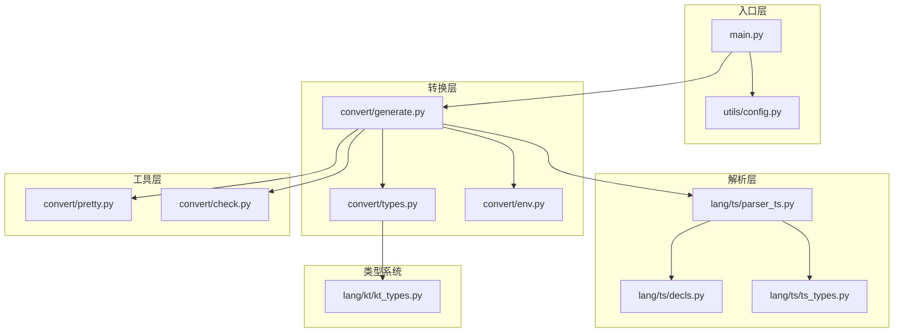
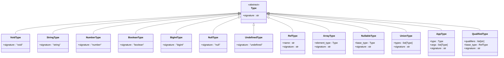
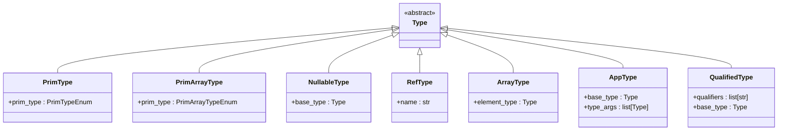
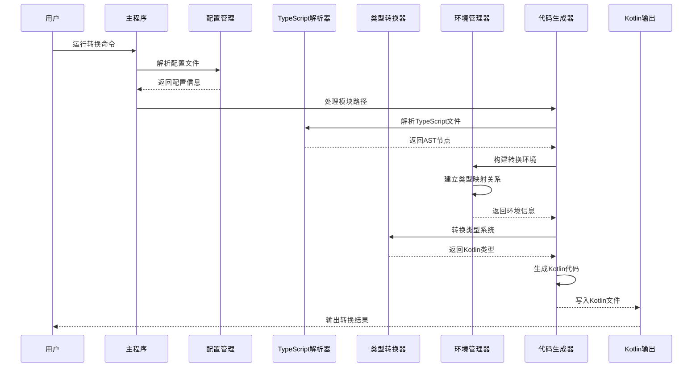
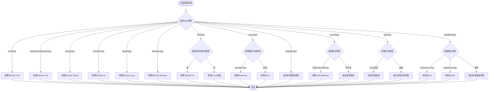
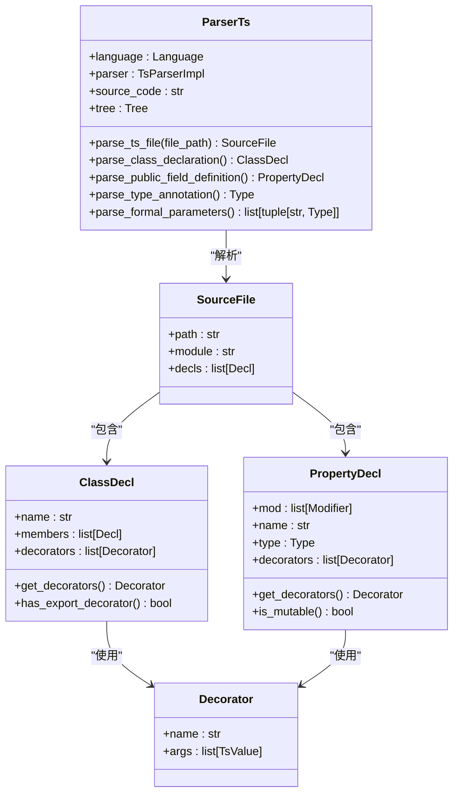
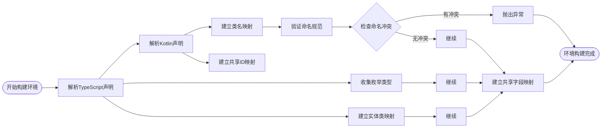
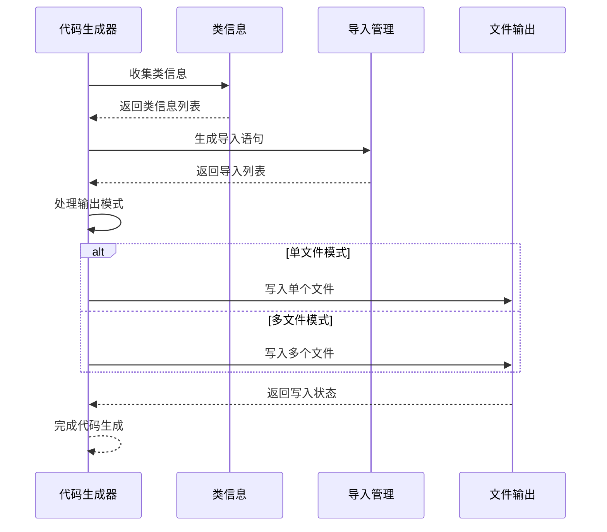
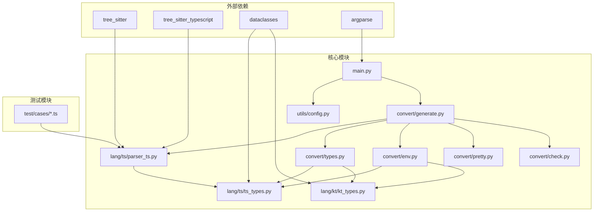

# TypeScript类型支持扩展

<cite>
**本文档引用的文件**
- [main.py](file://main.py)
- [convert/types.py](file://convert/types.py)
- [lang/ts/ts_types.py](file://lang/ts/ts_types.py)
- [lang/kt/kt_types.py](file://lang/kt/kt_types.py)
- [convert/generate.py](file://convert/generate.py)
- [lang/ts/decls.py](file://lang/ts/decls.py)
- [convert/env.py](file://convert/env.py)
- [utils/config.py](file://utils/config.py)
- [test/cases/class0.ts](file://test/cases/class0.ts)
- [test/cases/class1.ts](file://test/cases/class1.ts)
- [test/cases/class2.ts](file://test/cases/class2.ts)
- [convert/check.py](file://convert/check.py)
- [lang/ts/parser_ts.py](file://lang/ts/parser_ts.py)
- [convert/pretty.py](file://convert/pretty.py)
</cite>

## 目录
1. [简介](#简介)
2. [项目结构](#项目结构)
3. [核心组件](#核心组件)
4. [架构概览](#架构概览)
5. [详细组件分析](#详细组件分析)
6. [依赖关系分析](#依赖关系分析)
7. [性能考虑](#性能考虑)
8. [故障排除指南](#故障排除指南)
9. [结论](#结论)

## 简介

这是一个专门针对ArkTS（ArkUI TypeScript）与Kotlin之间FFI（Foreign Function Interface）转换的工具系统。该项目的核心目标是提供TypeScript类型支持的扩展，实现从TypeScript到Kotlin的自动类型转换，特别专注于ArkTS环境下的类型映射和转换。

该系统通过树状语法分析器解析TypeScript源码，识别装饰器和类型声明，然后将这些信息转换为对应的Kotlin类型表示。项目采用模块化设计，支持多种输出模式和复杂的类型映射策略。

## 项目结构

项目采用清晰的模块化架构，主要分为以下几个核心层次：

**图表来源**
- [main.py](file://main.py#L12-L25)
- [convert/generate.py](file://convert/generate.py#L87-L148)
- [lang/ts/parser_ts.py](file://lang/ts/parser_ts.py#L13-L21)

**章节来源**
- [main.py](file://main.py#L1-L36)
- [utils/config.py](file://utils/config.py#L63-L68)

## 核心组件

### TypeScript类型系统

TypeScript类型系统提供了完整的类型表示能力，支持基本类型、复合类型和泛型类型：

**图表来源**
- [lang/ts/ts_types.py](file://lang/ts/ts_types.py#L8-L310)

### Kotlin类型系统

Kotlin类型系统提供了与TypeScript类型相对应的类型表示：

**图表来源**
- [lang/kt/kt_types.py](file://lang/kt/kt_types.py#L56-L332)

**章节来源**
- [lang/ts/ts_types.py](file://lang/ts/ts_types.py#L1-L310)
- [lang/kt/kt_types.py](file://lang/kt/kt_types.py#L1-L332)

## 架构概览

系统采用分层架构设计，实现了TypeScript到Kotlin的完整转换流程：

**图表来源**
- [main.py](file://main.py#L12-L25)
- [convert/generate.py](file://convert/generate.py#L87-L148)
- [convert/env.py](file://convert/env.py#L72-L85)

## 详细组件分析

### 类型转换器组件

类型转换器是系统的核心组件，负责将TypeScript类型转换为Kotlin类型：

**图表来源**
- [convert/types.py](file://convert/types.py#L10-L67)

**章节来源**
- [convert/types.py](file://convert/types.py#L1-L67)

### TypeScript解析器组件

TypeScript解析器使用Tree-Sitter语法分析器，支持完整的TypeScript语法解析：

**图表来源**
- [lang/ts/parser_ts.py](file://lang/ts/parser_ts.py#L13-L462)
- [lang/ts/decls.py](file://lang/ts/decls.py#L64-L122)

**章节来源**
- [lang/ts/parser_ts.py](file://lang/ts/parser_ts.py#L1-L462)
- [lang/ts/decls.py](file://lang/ts/decls.py#L1-L122)

### 环境管理器组件

环境管理器负责建立TypeScript和Kotlin之间的映射关系：

**图表来源**
- [convert/env.py](file://convert/env.py#L72-L149)

**章节来源**
- [convert/env.py](file://convert/env.py#L1-L152)

### 代码生成器组件

代码生成器负责将解析和转换后的信息生成最终的Kotlin代码：

**图表来源**
- [convert/generate.py](file://convert/generate.py#L45-L148)

**章节来源**
- [convert/generate.py](file://convert/generate.py#L1-L148)

## 依赖关系分析

系统采用模块化设计，各组件之间的依赖关系清晰明确：

**图表来源**
- [main.py](file://main.py#L3-L9)
- [lang/ts/parser_ts.py](file://lang/ts/parser_ts.py#L6-L8)

**章节来源**
- [main.py](file://main.py#L1-L36)
- [lang/ts/parser_ts.py](file://lang/ts/parser_ts.py#L1-L462)

## 性能考虑

系统在设计时充分考虑了性能优化：

1. **增量解析**: 使用Tree-Sitter进行增量语法分析，避免全量重新解析
2. **缓存机制**: 环境信息和类型映射关系进行缓存，减少重复计算
3. **批量处理**: 支持批量处理多个TypeScript文件，提高整体效率
4. **内存管理**: 合理的内存使用策略，避免大规模数据处理时的内存溢出

## 故障排除指南

### 常见问题及解决方案

1. **类型转换错误**
   - 检查TypeScript类型定义是否符合预期
   - 确认类型映射关系是否正确配置
   - 查看具体的错误信息定位问题

2. **命名冲突**
   - 检查类名和包名是否符合Kotlin命名规范
   - 验证是否存在重复的类名或包名
   - 使用唯一的类名和包名

3. **配置文件错误**
   - 检查JSON配置文件格式是否正确
   - 确认必需字段是否完整
   - 验证路径配置是否有效

4. **语法解析错误**
   - 检查TypeScript代码语法是否正确
   - 确认装饰器使用是否符合规范
   - 验证类型注解是否正确

**章节来源**
- [convert/check.py](file://convert/check.py#L1-L89)
- [convert/env.py](file://convert/env.py#L58-L113)

## 结论

该TypeScript类型支持扩展系统为ArkTS与Kotlin之间的FFI转换提供了完整的解决方案。系统采用模块化设计，具有以下特点：

1. **完整的类型支持**: 支持TypeScript的所有基本类型和复合类型
2. **灵活的配置**: 提供丰富的配置选项，适应不同的使用场景
3. **强大的扩展性**: 模块化架构便于功能扩展和维护
4. **良好的性能**: 优化的算法和数据结构确保高效的处理能力

该系统为ArkTS开发者提供了便捷的工具，简化了TypeScript与Kotlin之间的类型转换过程，提高了开发效率和代码质量。