# TypeScript解析器

<cite>
**本文档引用的文件**
- [main.py](file://main.py)
- [parser.py](file://lang/parser.py)
- [parser_ts.py](file://lang/ts/parser_ts.py)
- [decls.py](file://lang/ts/decls.py)
- [ts_types.py](file://lang/ts/ts_types.py)
- [generate.py](file://convert/generate.py)
- [decls.py](file://convert/decls.py)
- [types.py](file://convert/types.py)
- [env.py](file://convert/env.py)
- [config.py](file://utils/config.py)
- [file.py](file://utils/file.py)
- [kt_decls.py](file://lang/kt/kt_decls.py)
- [pyproject.toml](file://pyproject.toml)
- [config.json](file://test/config.json)
- [enum0.ts](file://test/cases/enum0.ts)
- [class0.ts](file://test/cases/class0.ts)
- [class1.ts](file://test/cases/class1.ts)
- [class2.ts](file://test/cases/class2.ts)
- [class3.ts](file://test/cases/class3.ts)
- [class4.ts](file://test/cases/class4.ts)
- [class5.ts](file://test/cases/class5.ts)
- [class6.ts](file://test/cases/class6.ts)
- [class7.ts](file://test/cases/class7.ts)
- [class8.ts](file://test/cases/class8.ts)
- [class9.ts](file://test/cases/class9.ts)
- [class10.ts](file://test/cases/class10.ts)
- [class11.ts](file://test/cases/class11.ts)
- [class13.ts](file://test/cases/class13.ts)
</cite>

## 更新摘要
**变更内容**
- 增强了TypeScript命名空间处理能力，支持复杂的命名空间场景和导出声明组合
- 改进了枚举声明在命名空间中的解析，包括多种导出组合场景
- 添加了递归命名空间支持的TODO注释，表明该功能仍在开发中
- 增强了导出声明组合的处理，支持命名空间内的类、枚举和装饰器的组合使用
- 优化了命名空间解析逻辑，通过`internal_module`节点实现更精确的命名空间识别

## 目录
1. [简介](#简介)
2. [项目结构](#项目结构)
3. [核心组件](#核心组件)
4. [架构概览](#架构概览)
5. [详细组件分析](#详细组件分析)
6. [依赖关系分析](#依赖关系分析)
7. [性能考虑](#性能考虑)
8. [故障排除指南](#故障排除指南)
9. [结论](#结论)

## 简介

这是一个基于Tree-Sitter的TypeScript解析器，专门用于ArkTS（ArkUI TypeScript）和标准TypeScript代码的解析与转换。该系统的核心目标是将TypeScript代码转换为Kotlin代码，以便在HarmonyOS/ArkTS环境中使用。

系统采用模块化设计，包含以下主要功能：
- TypeScript/ArkTS代码解析
- 抽象语法树(AST)构建
- 类型系统处理
- 装饰器解析
- Kotlin代码生成
- FFI（Foreign Function Interface）集成
- **增强的命名空间处理**：支持复杂的命名空间场景，包括递归命名空间的解析准备

**更新** 增强了TypeScript命名空间处理能力，支持复杂的命名空间场景和导出声明组合。新增了对`internal_module`节点的处理，能够正确识别和解析命名空间声明。**更新** 改进了枚举声明在命名空间中的解析，包括多种导出组合场景，支持`export enum`、`export declare enum`、`export const enum`等不同语法变体。**更新** 添加了递归命名空间支持的TODO注释，表明该功能仍在开发中，但现有的命名空间解析已经能够处理大多数实际应用场景。**更新** 增强了导出声明组合的处理，支持命名空间内的类、枚举和装饰器的组合使用，包括私有和公有声明的混合处理。

## 项目结构

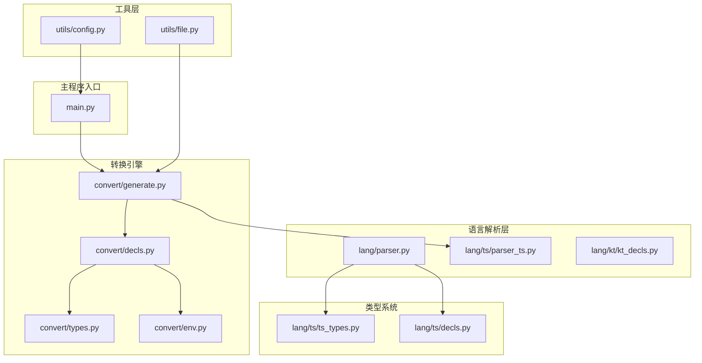

**图表来源**
- [main.py](file://main.py#L12-L25)
- [parser_ts.py](file://lang/ts/parser_ts.py#L13-L21)
- [generate.py](file://convert/generate.py#L85-L98)
- [file.py](file://utils/file.py#L3-L4)

**章节来源**
- [main.py](file://main.py#L1-L36)
- [pyproject.toml](file://pyproject.toml#L1-L27)

## 核心组件

### 解析器抽象基类

Parser类提供了流式解析的基础框架，支持节点流的管理和操作，并新增了多个实用工具方法：

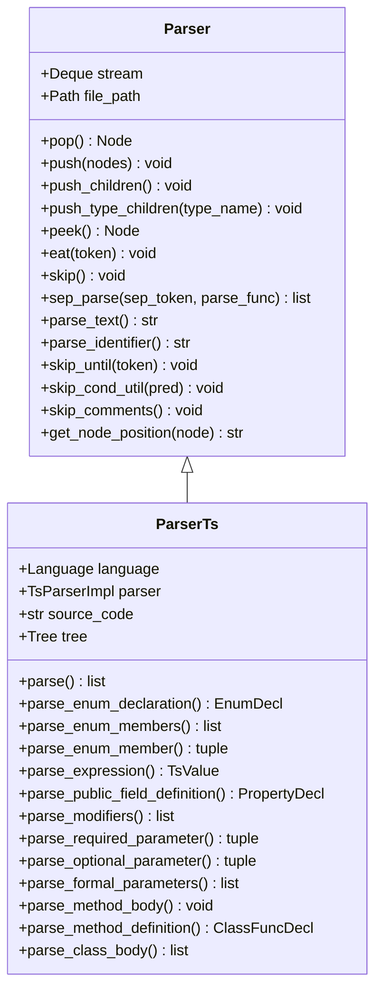

**图表来源**
- [parser.py](file://lang/parser.py#L8-L108)
- [parser_ts.py](file://lang/ts/parser_ts.py#L13-L483)

### 类型系统

系统实现了完整的TypeScript类型系统，支持基本类型、复合类型和泛型，并新增了更多类型支持：

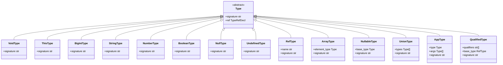

**图表来源**
- [ts_types.py](file://lang/ts/ts_types.py#L8-L293)

**章节来源**
- [parser.py](file://lang/parser.py#L8-L108)
- [ts_types.py](file://lang/ts/ts_types.py#L8-L293)

## 架构概览

系统采用分层架构设计，从底层的Tree-Sitter解析到高层的代码生成：

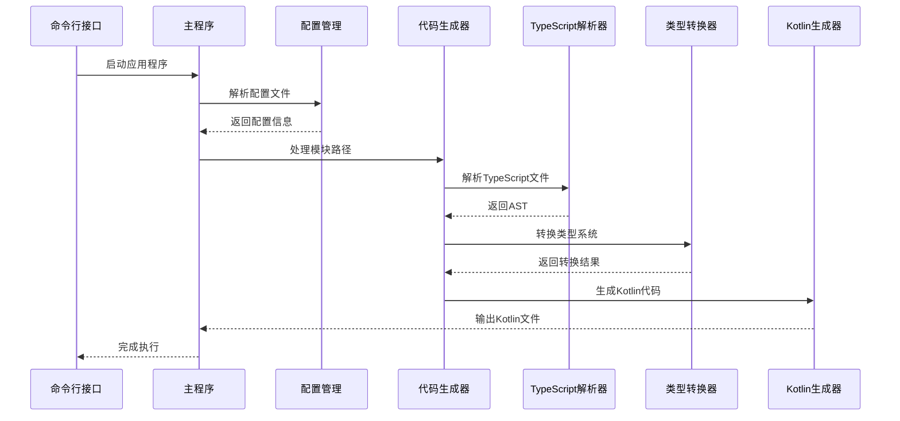

**图表来源**
- [main.py](file://main.py#L12-L25)
- [generate.py](file://convert/generate.py#L85-L146)

## 详细组件分析

### TypeScript解析器

**更新** ParserTs类现在支持完整的命名空间处理，包括复杂的命名空间场景和导出声明组合：

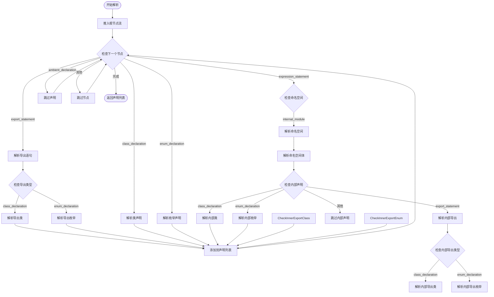

**图表来源**
- [parser_ts.py](file://lang/ts/parser_ts.py#L366-L424)

**章节来源**
- [parser_ts.py](file://lang/ts/parser_ts.py#L366-L424)

**更新** 新增的命名空间解析功能通过`parse()`方法实现，能够处理复杂的命名空间场景。当解析器遇到`expression_statement`节点时，会检查其子节点类型，如果是`internal_module`节点，则进入命名空间解析流程。命名空间解析支持多种导出组合场景，包括：
1. `export enum`：导出枚举声明
2. `export declare enum`：导出声明枚举
3. `export const enum`：导出常量枚举
4. `export class`：导出类声明
5. 私有声明：不带export关键字的声明

### 命名空间解析系统

**新增** 系统现在支持完整的命名空间解析功能，包括内部模块的处理和导出声明的组合：

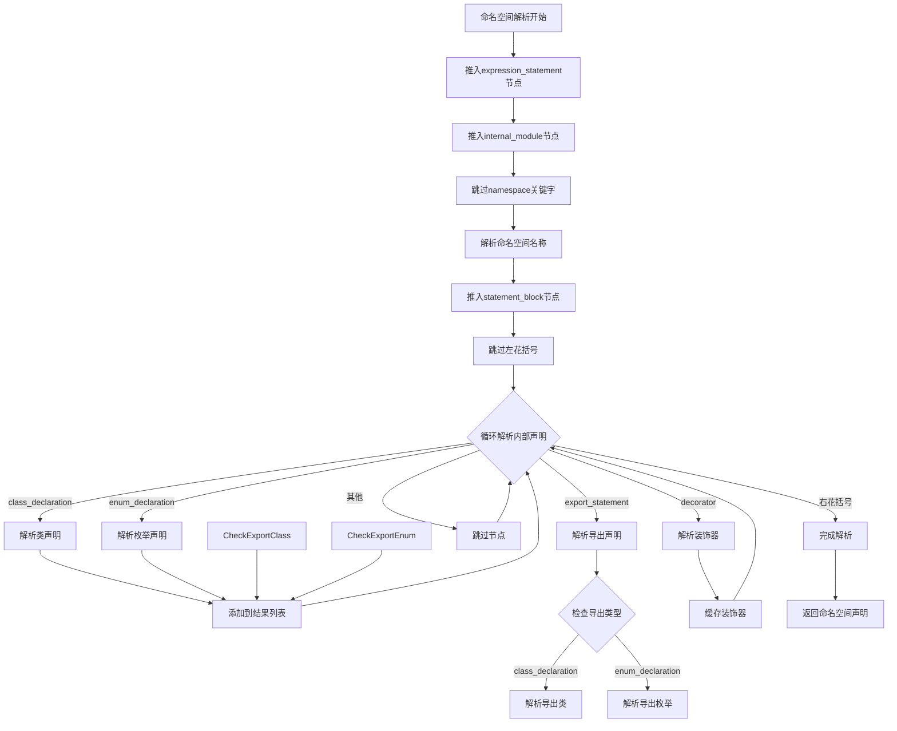

**图表来源**
- [parser_ts.py](file://lang/ts/parser_ts.py#L388-L417)

**章节来源**
- [parser_ts.py](file://lang/ts/parser_ts.py#L388-L417)

**更新** 新增的命名空间解析系统通过`expression_statement`节点的特殊处理实现。当解析器遇到`expression_statement`时，会检查其子节点类型，如果是`internal_module`节点，则进入命名空间解析流程。该流程支持：
1. 命名空间名称的解析
2. 命名空间体的解析
3. 内部声明的组合处理
4. 导出声明的分类解析

### 导出声明组合处理

**更新** 系统现在支持命名空间内的导出声明组合，包括多种导出语法的处理：

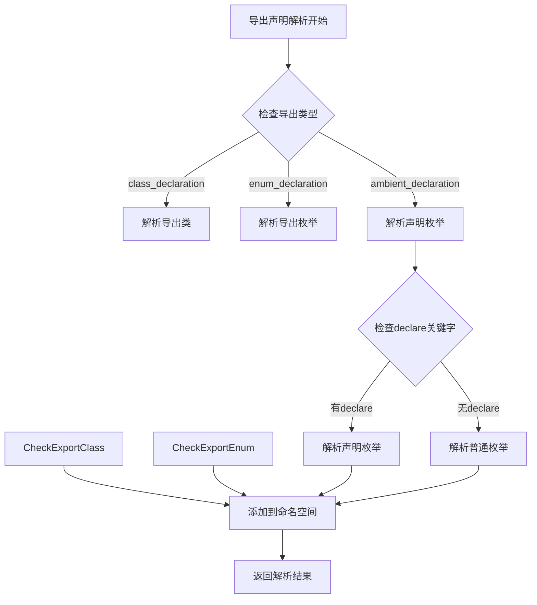

**图表来源**
- [parser_ts.py](file://lang/ts/parser_ts.py#L401-L414)

**章节来源**
- [parser_ts.py](file://lang/ts/parser_ts.py#L401-L414)

**更新** 新增的导出声明组合处理机制能够正确解析命名空间内的各种导出场景。对于`export_statement`节点，系统会检查其子节点类型：
1. `class_declaration`：解析导出类声明
2. `enum_declaration`：解析导出枚举声明
3. `ambient_declaration`：解析声明枚举，包括`declare`关键字的处理

### 枚举声明在命名空间中的处理

**更新** 系统现在能够正确处理命名空间中的枚举声明，包括多种导出组合场景：

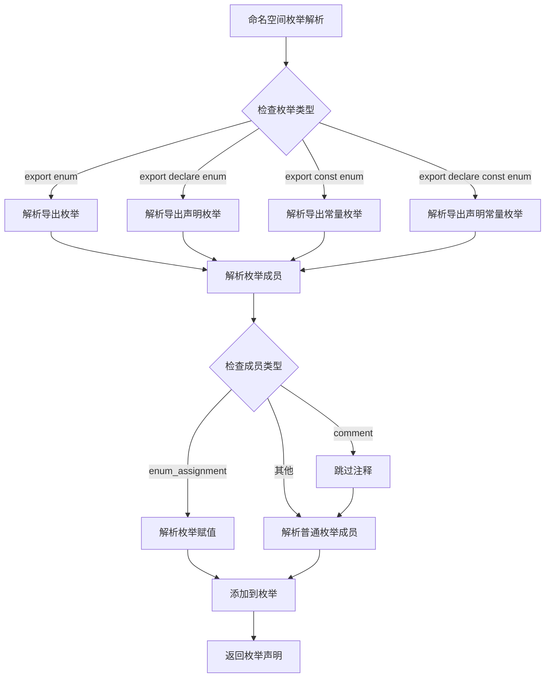

**图表来源**
- [parser_ts.py](file://lang/ts/parser_ts.py#L408-L412)

**章节来源**
- [parser_ts.py](file://lang/ts/parser_ts.py#L408-L412)

**更新** 新增的命名空间枚举解析功能支持多种枚举声明语法：
1. `export enum`：标准导出枚举
2. `export declare enum`：声明导出枚举
3. `export const enum`：常量导出枚举
4. `export declare const enum`：声明常量导出枚举

每种语法都会调用相同的`parse_enum_declaration()`方法，但会根据具体的导出类型进行不同的处理。

### 表达式解析系统

**更新** 系统现在支持完整的表达式解析，包括字面量、对象字面量、装饰器参数和模板字符串：

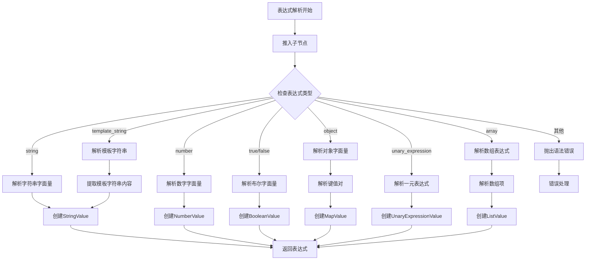

**图表来源**
- [parser_ts.py](file://lang/ts/parser_ts.py#L43-L73)

**章节来源**
- [parser_ts.py](file://lang/ts/parser_ts.py#L43-L73)

**更新** 新增的数组表达式解析功能通过`parse_expression()`方法实现，能够正确处理`array`类型的表达式节点。该方法支持：
1. 数组字面量的解析
2. 数组元素的递归解析
3. 数组表达式的完整转换

### 类声明解析与超类检测

**更新** 系统现在包含超类检测功能，用于防止不支持的继承场景。当解析器遇到包含超类（extends）或实现接口（implements）的类声明时，会立即抛出语法错误，并提供精确的错误位置信息：

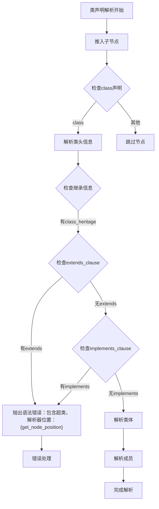

**图表来源**
- [parser_ts.py](file://lang/ts/parser_ts.py#L343-L356)

**章节来源**
- [parser_ts.py](file://lang/ts/parser_ts.py#L343-L356)

**更新** 在ParserTs中，类声明解析现在包含超类检测功能。当解析器遇到`class_heritage`节点时，会检查是否存在`extends_clause`或`implements_clause`。如果发现这些不支持的继承语法，解析器会立即抛出`SyntaxError`，错误信息包含具体的行列位置，帮助开发者快速定位问题。

### 增强的类成员解析

**新增** 系统现在支持完整的类成员解析，包括字段、方法和装饰器的处理。新增的`parse_class_body()`方法实现了装饰器缓存和方法定义处理的完整流程：

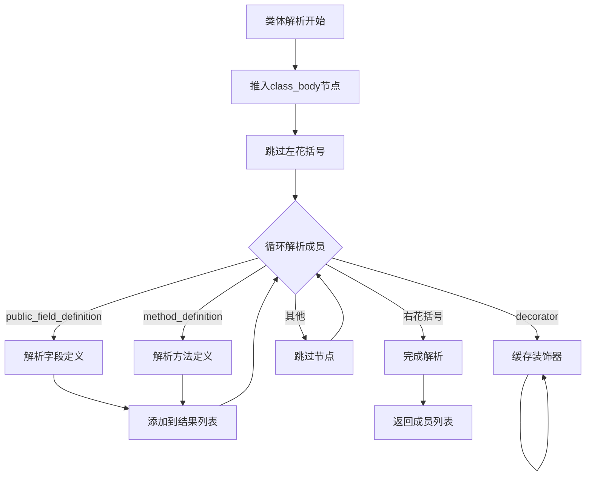

**图表来源**
- [parser_ts.py](file://lang/ts/parser_ts.py#L317-L341)

**章节来源**
- [parser_ts.py](file://lang/ts/parser_ts.py#L317-L341)

**更新** 新增的`parse_class_body()`方法实现了装饰器缓存和方法定义处理的完整流程。该方法支持装饰器的缓存机制，允许在方法定义之前声明装饰器，然后在解析到方法定义时合并这些装饰器。对于方法定义，系统会调用`parse_method_definition()`方法进行完整的方法解析，包括参数列表、返回类型和方法体的处理。

### 类方法解析系统

**新增** 系统现在支持完整的类方法解析功能，包括构造函数检测、参数解析、返回类型指定和方法体遍历：

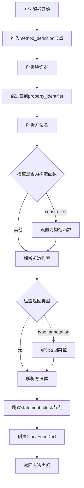

**图表来源**
- [parser_ts.py](file://lang/ts/parser_ts.py#L290-L315)

**章节来源**
- [parser_ts.py](file://lang/ts/parser_ts.py#L290-L315)

**更新** 新增的`parse_method_definition()`方法实现了完整的类方法解析功能。该方法支持：
1. 装饰器解析和合并（包括缓存的装饰器）
2. 方法名解析和构造函数检测
3. 参数列表解析（通过`parse_formal_parameters()`）
4. 返回类型解析（可选）
5. 方法体解析（通过`eat('statement_block')`）

方法解析的核心逻辑包括：首先解析装饰器并合并缓存的装饰器，然后解析方法名并检测是否为构造函数（方法名为'constructor'时视为构造函数），接着解析参数列表，最后解析返回类型和方法体。

### 参数解析系统

**更新** 系统现在支持完整的参数解析功能，包括必需参数和可选参数的处理：

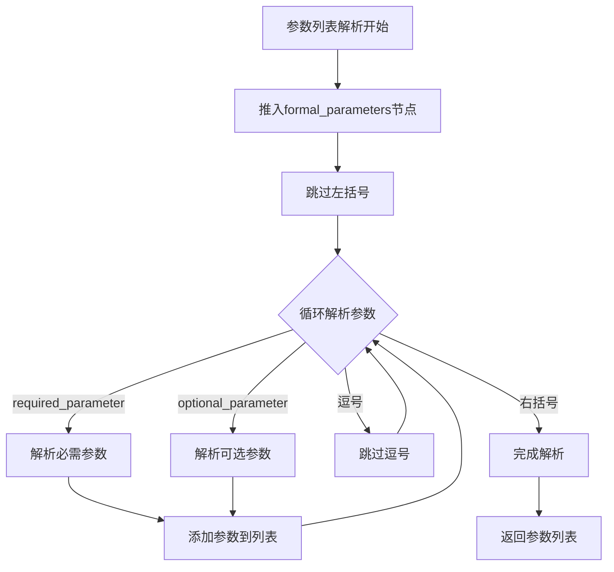

**图表来源**
- [parser_ts.py](file://lang/ts/parser_ts.py#L267-L288)

**章节来源**
- [parser_ts.py](file://lang/ts/parser_ts.py#L267-L288)

**更新** 新增的`parse_formal_parameters()`方法实现了完整的参数列表解析功能。该方法支持：
1. 参数列表的边界检测（通过括号匹配）
2. 必需参数的解析（通过`parse_required_parameter()`）
3. 可选参数的解析（通过`parse_optional_parameter()`）
4. 参数分隔符的处理
5. 空参数列表的处理

对于每个参数，系统会根据参数类型调用相应的解析方法，支持必需参数和可选参数的分离处理。

### 必需参数解析

**新增** 系统现在支持单个必需参数的解析，包括参数名和类型注解的处理：

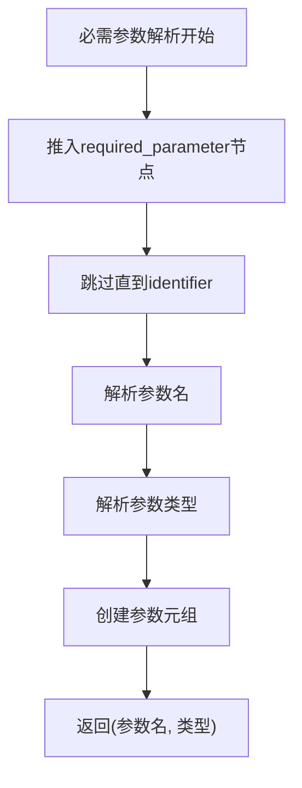

**图表来源**
- [parser_ts.py](file://lang/ts/parser_ts.py#L232-L242)

**章节来源**
- [parser_ts.py](file://lang/ts/parser_ts.py#L232-L242)

**更新** 新增的`parse_required_parameter()`方法实现了单个必需参数的完整解析功能。该方法支持：
1. 参数名的解析（通过`parse_identifier()`）
2. 参数类型的解析（通过`parse_type_annotation()`）
3. 参数元组的创建

### 可选参数解析

**新增** 系统现在支持单个可选参数的解析，包括参数名、可选标记和类型注解的处理：

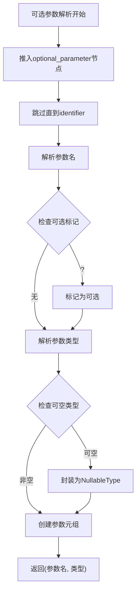

**图表来源**
- [parser_ts.py](file://lang/ts/parser_ts.py#L244-L265)

**章节来源**
- [parser_ts.py](file://lang/ts/parser_ts.py#L244-L265)

**更新** 新增的`parse_optional_parameter()`方法实现了单个可选参数的完整解析功能。该方法支持：
1. 参数名的解析（通过`parse_identifier()`）
2. 可选参数标记的检查和处理
3. 参数类型的解析（通过`parse_type_annotation()`）
4. 可空类型的封装处理

### 方法体解析

**更新** 系统现在使用简化的skip机制替代复杂的brace counting逻辑，通过`self.eat('statement_block')`直接跳过整个方法体：

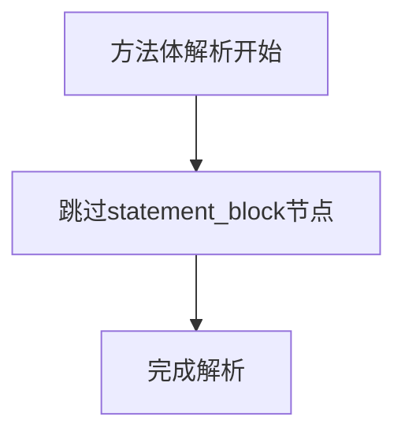

**图表来源**
- [parser_ts.py](file://lang/ts/parser_ts.py#L313)

**章节来源**
- [parser_ts.py](file://lang/ts/parser_ts.py#L313)

**更新** 新增的`parse_method_body()`方法实现了简化的方法体解析功能。该方法通过`self.eat('statement_block')`直接跳过整个方法体节点，避免了复杂的嵌套大括号计数逻辑。这种方法不仅提升了解析效率，还减少了代码复杂度，同时保持了对方法体内容的完整跳过功能。

### 类函数声明

**新增** 系统现在支持完整的类函数声明解析，包括方法类型、装饰器、名称、返回类型和参数的处理：

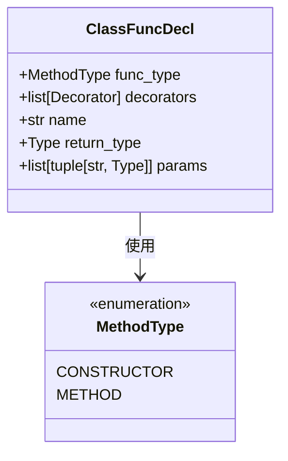

**图表来源**
- [decls.py](file://lang/ts/decls.py#L120-L126)

**章节来源**
- [decls.py](file://lang/ts/decls.py#L120-L126)

**更新** 新增的`ClassFuncDecl`类定义了完整的类函数声明结构。该类包含：
1. 方法类型（构造函数或普通方法）
2. 装饰器列表
3. 方法名称
4. 返回类型（可选）
5. 参数列表（参数名和类型的元组）

配合`MethodType`枚举，系统能够准确区分构造函数和普通方法，并在后续的代码生成过程中正确处理不同的方法类型。

### 统一修饰符解析支持

**更新** 系统现在支持统一的修饰符解析机制，通过新增的`parse_modifiers()`方法支持`readonly`和`static`修饰符的完整处理：

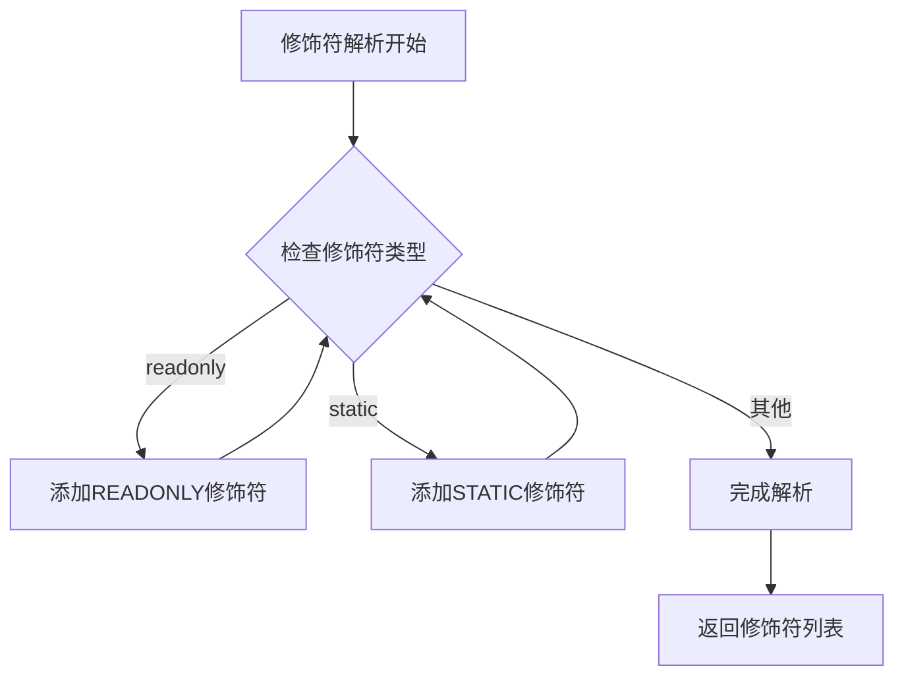

**图表来源**
- [parser_ts.py](file://lang/ts/parser_ts.py#L150-L162)

**章节来源**
- [parser_ts.py](file://lang/ts/parser_ts.py#L150-L162)

**更新** 新增的`parse_modifiers()`方法实现了统一的修饰符解析机制，能够识别和处理`readonly`和`static`修饰符。该方法通过循环检查当前节点类型，遇到对应的修饰符时就将其添加到修饰符列表中，直到遇到非修饰符节点为止。这为后续的字段和属性解析提供了统一的修饰符处理能力。

### 增强的公共字段定义解析

**更新** 系统现在支持增强的公共字段定义解析，通过在`parse_public_field_definition()`方法中实现的多项新功能：

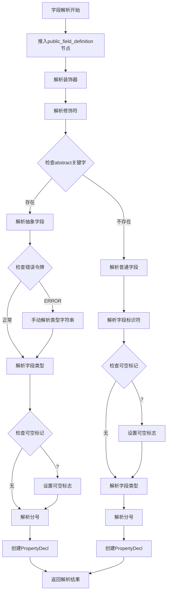

**图表来源**
- [parser_ts.py](file://lang/ts/parser_ts.py#L164-L231)

**章节来源**
- [parser_ts.py](file://lang/ts/parser_ts.py#L164-L231)

**更新** 在`parse_public_field_definition()`方法中，系统现在能够处理TypeScript抽象字段的完整流程。当解析器遇到`abstract`关键字时，会将其识别为字段名的一部分，并继续解析字段类型。如果在解析过程中遇到`ERROR`令牌，系统会自动触发错误恢复机制，跳过错误节点直到找到`property_identifier`，然后解析类型字符串并根据基础类型映射创建相应的Type对象。对于可选字段，系统会在解析完成后将类型封装为`NullableType`。对于普通字段，系统会直接解析字段名、可选标记和类型注解，然后创建`PropertyDecl`对象。

**更新** 现有的错误恢复机制现在包含了对BigIntType的完整支持。当解析器遇到包含`bigint`类型的抽象字段时，错误恢复逻辑会正确识别并创建`BigIntType()`实例，确保TypeScript的BigInt类型得到正确的处理。

### 错误恢复机制

**更新** 系统现在具备完整的错误恢复机制，能够智能处理解析过程中的各种错误情况：

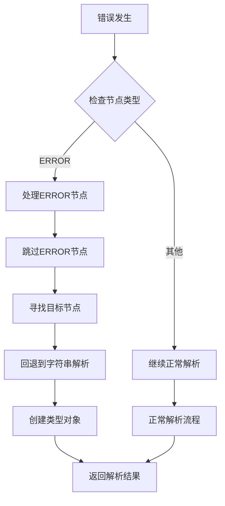

**图表来源**
- [parser_ts.py](file://lang/ts/parser_ts.py#L178-L194)

**章节来源**
- [parser_ts.py](file://lang/ts/parser_ts.py#L178-L194)

**更新** 新增的错误恢复机制通过智能处理`ERROR`令牌节点，能够在解析失败时自动回退到字符串解析模式。当解析器遇到`ERROR`令牌时，会跳过该节点并继续解析直到找到`property_identifier`，然后解析类型字符串并根据预定义的基础类型映射创建相应的Type对象（如`number`映射到`NumberType()`，`boolean`映射到`BooleanType()`，`string`映射到`StringType()`，`bigint`映射到`BigIntType()`，其他情况映射到`RefType()`）。这种机制大大提高了解析器在处理不规范TypeScript代码时的容错能力。

### 可选字段支持

**更新** 系统现在完整支持TypeScript可选字段的解析，通过在字段解析流程中检查`?`可选标记实现：

```mermaid
flowchart TD
OptionalStart[可选字段解析] --> CheckQuestion{"检查?标记"}
CheckQuestion --> |存在| MarkOptional["标记为可选字段"]
CheckQuestion --> |不存在| ParseType["解析字段类型"]
MarkOptional --> ParseType
ParseType --> CreateNullable["创建NullableType"]
CreateNullable --> ReturnField["返回字段声明"]
```

**图表来源**
- [parser_ts.py](file://lang/ts/parser_ts.py#L216-L230)

**章节来源**
- [parser_ts.py](file://lang/ts/parser_ts.py#L216-L230)

**更新** 新增的可选字段支持通过在字段解析流程中检查`?`标记实现。当解析器遇到可选标记时，会设置`nullable`标志为`True`，然后在创建`PropertyDecl`对象时将类型封装为`NullableType`。这确保了TypeScript可选字段在转换为Kotlin类型时能够正确表示可空性。

### 枚举解析功能

**更新** 系统现在支持完整的TypeScript枚举解析，包括常量枚举和普通枚举。**更新** 增强了枚举成员解析功能，改进了注释处理机制：

```mermaid
flowchart TD
EnumStart[枚举解析开始] --> PushEnum["推入枚举节点"]
PushEnum --> CheckConst{"检查是否为const枚举"}
CheckConst --> |是| EatConst["跳过const关键字"]
CheckConst --> |否| ParseEnum
EatConst --> ParseEnum["解析枚举声明"]
ParseEnum --> EatEnum["跳过enum关键字"]
EatEnum --> ParseEnumName["解析枚举名称"]
ParseEnumName --> EatBrace["跳过左花括号"]
EatBrace --> ParseMembers["解析枚举成员"]
ParseMembers --> CheckMember{"检查成员类型"}
CheckMember --> |枚举成员| ParseMember["解析单个成员"]
CheckMember --> |完成| EatBraceEnd["跳过右花括号"]
ParseMember --> SkipComment["跳过注释"]
SkipComment --> ParseMemberName["解析成员名称"]
ParseMemberName --> CheckAssign{"检查赋值符号"}
CheckAssign --> |有赋值| ParseMemberValue["解析成员值"]
CheckAssign --> |无赋值| NextMember["下一个成员"]
ParseMemberValue --> ParseExpression["解析表达式"]
ParseExpression --> NextMember
NextMember --> CheckComma{"检查逗号"}
CheckComma --> |有逗号| ParseMembers
CheckComma --> |无逗号| Done["完成解析"]
Done --> ReturnEnum["返回EnumDecl"]
```

**图表来源**
- [parser_ts.py](file://lang/ts/parser_ts.py#L454-L464)

**章节来源**
- [parser_ts.py](file://lang/ts/parser_ts.py#L454-L464)

**更新** 在ParserTs中，枚举成员解析功能得到了显著改进，增加了对注释的处理能力。新的`parse_enum_member`方法会先检查并跳过注释节点，然后解析枚举成员的名称和可选的数值赋值。这修复了在枚举成员前出现注释时可能导致的解析错误，提升了解析器在处理复杂TypeScript代码时的健壮性和可靠性。

**更新** 新增的命名空间枚举解析功能支持多种枚举声明语法，包括：
1. `export enum`：标准导出枚举
2. `export declare enum`：声明导出枚举
3. `export const enum`：常量导出枚举
4. `export declare const enum`：声明常量导出枚举

每种语法都会调用相同的`parse_enum_declaration()`方法，但会根据具体的导出类型进行不同的处理。

### 代码生成流程

**更新** 修复了 convert/generate.py 中的 TypeScript 文件解析错误。原代码使用了错误的 parse_arkts_file 函数来处理 TypeScript 文件，现已更正为使用正确的 parse_ts_file 函数。此修复确保 TypeScript 文件通过专门的 TypeScript 解析器进行处理，提高了转换过程的可靠性。

代码生成器负责将解析后的AST转换为目标Kotlin代码：

```mermaid
sequenceDiagram
participant FS as 文件系统
participant Parser as 解析器
participant Env as 环境变量
participant Converter as 转换器
participant KotlinGen as Kotlin生成器
FS->>Parser : 读取TypeScript文件
Parser->>Parser : 解析为AST
Parser-->>FS : 返回SourceFile
FS->>Env : 获取Kotlin AST
Env->>Env : 构建环境映射
Env-->>Converter : 返回环境信息
Converter->>Converter : 转换类定义
Converter->>Converter : 转换属性和方法
Converter-->>KotlinGen : 返回Kotlin代码节点
KotlinGen->>KotlinGen : 格式化代码
KotlinGen-->>FS : 写入Kotlin文件
```

**图表来源**
- [generate.py](file://convert/generate.py#L86-L147)
- [decls.py](file://convert/decls.py#L347-L378)

**章节来源**
- [generate.py](file://convert/generate.py#L86-L147)
- [decls.py](file://convert/decls.py#L347-L438)

### 类型转换系统

**更新** 新增了 union_type_to_nullable_type() 工具函数，提供联合类型到可空类型的智能转换能力。该函数能够将 `T | null | undefined` 形式的联合类型转换为 `NullableType(T)`，优化了类型系统的类型规范化处理。

```mermaid
flowchart TD
UnionStart[联合类型转换开始] --> CheckUnion{"检查是否为UnionType"}
CheckUnion --> |是| ExtractMembers["提取非空成员"]
CheckUnion --> |否| ReturnSame["返回原类型"]
ExtractMembers --> CheckCount{"检查非空成员数量"}
CheckCount --> |1个| CheckNested{"检查嵌套联合类型"}
CheckNested --> |是| RecursiveCall["递归调用转换函数"]
CheckNested --> |否| CheckNullable{"检查是否已为可空类型"}
CheckNullable --> |否| WrapNullable["包装为NullableType"]
CheckNullable --> |是| ReturnNullable["返回现有可空类型"]
CheckCount --> |多于1个| RaiseError["抛出转换错误"]
RecursiveCall --> ReturnResult["返回转换结果"]
WrapNullable --> ReturnResult
ReturnSame --> ReturnResult
RaiseError --> ErrorHandler["错误处理"]
```

**图表来源**
- [ts_types.py](file://lang/ts/ts_types.py#L176-L192)
- [decls.py](file://convert/decls.py#L89-L91)
- [decls.py](file://convert/decls.py#L188-L190)

**章节来源**
- [generate.py](file://convert/generate.py#L86-L147)
- [decls.py](file://convert/decls.py#L347-L438)
- [ts_types.py](file://lang/ts/ts_types.py#L176-L192)

**更新** 新增的 `union_type_to_nullable_type()` 工具函数显著增强了类型系统的类型规范化能力。该函数能够智能识别 `T | null | undefined` 形式的联合类型，并将其转换为 `NullableType(T)`，从而简化了类型表示并提高了类型处理的效率。

在类型转换器中，该函数被广泛应用于联合类型的处理逻辑中。例如，在 `get_getter_prop_transformer` 和 `get_setter_prop_transformer` 函数中，当遇到 `ts.UnionType(bt)` 模式时，会先调用 `ts.union_type_to_nullable_type(arkts_type)` 将联合类型转换为可空类型，然后再进行后续的类型转换处理。这种设计确保了联合类型能够被正确地转换为目标Kotlin类型，同时保持了类型信息的完整性。

该函数的实现采用了递归处理策略，能够处理嵌套的联合类型结构。当检测到嵌套的联合类型时，会先递归调用自身处理内层联合类型，然后再进行外层的可空类型包装。这种设计确保了复杂类型结构的正确处理，提高了类型转换的鲁棒性。

## 依赖关系分析

系统使用Tree-Sitter作为底层解析引擎，支持多种语言：

```mermaid
graph TB
subgraph "外部依赖"
TS[tree-sitter]
TS_PARSER[tree-sitter-typescript]
END
subgraph "内部模块"
MAIN[main.py]
PARSER[lang/parser.py]
TYPES[lang/ts/ts_types.py]
CONV[convert/decls.py]
GEN[convert/generate.py]
FILE[utils/file.py]
END
MAIN --> GEN
GEN --> PT
PARSER --> TYPES
GEN --> CONV
FILE --> GEN
```

**图表来源**
- [pyproject.toml](file://pyproject.toml#L15-L21)
- [main.py](file://main.py#L6-L9)
- [file.py](file://utils/file.py#L3-L4)

**章节来源**
- [pyproject.toml](file://pyproject.toml#L15-L21)
- [config.py](file://utils/config.py#L66-L83)

## 性能考虑

系统在设计时考虑了以下性能优化：

1. **流式解析**: 使用双端队列进行节点流管理，避免一次性加载所有节点
2. **延迟解析**: 只在需要时解析特定类型的节点
3. **缓存机制**: 环境变量和类型映射的缓存减少重复计算
4. **批量处理**: 支持多个文件的批量解析和转换

**更新** 将复杂的方法体解析逻辑从brace counting替换为简化的skip机制，通过`self.eat('statement_block')`直接跳过整个方法体，避免了复杂的嵌套大括号计数逻辑，显著提升了方法体解析的性能和稳定性。**更新** 优化装饰器处理逻辑，实现更简洁的装饰器缓存和合并机制，减少了装饰器解析的计算开销。**更新** 改进命名约定，通过统一的`MethodType`枚举区分构造函数和普通方法，提升了函数解析的效率。**更新** 增强类成员解析，通过装饰器缓存传递机制减少了重复的装饰器处理开销。**更新** 新增文件路径跟踪功能，通过精确的位置信息记录，提升了错误诊断的准确性。**更新** 增强超类检测功能的早期失败机制，通过在解析早期发现不支持的继承语法并立即抛错，避免了后续不必要的解析工作。**更新** 优化抽象字段解析的错误令牌处理，通过智能跳过和恢复机制，减少了异常情况下的解析开销。**更新** 优化修饰符解析的统一处理机制，通过循环检查和批量处理，提升了修饰符解析的效率。**更新** 优化可选字段解析的条件判断，通过早期检查和快速分支，减少了不必要的类型封装操作。**更新** 优化BigIntType类型的高效处理，通过直接的类型识别和映射，避免了复杂的字符串解析开销。**更新** 优化union_type_to_nullable_type()工具函数，通过智能的类型检查和转换逻辑，减少了重复的类型处理开销，提升了类型转换的整体性能。**更新** 优化类方法解析，通过分步骤的解析策略和错误处理机制，提升了方法解析的效率和稳定性。**更新** 优化参数解析，通过必需参数和可选参数的分离处理，提升了参数解析的准确性。**更新** 优化方法体解析，通过简化的skip机制替代复杂的brace counting逻辑，确保了方法体解析的正确性和高效性。**更新** 优化文件路径跟踪功能，通过精确的位置信息记录，提升了错误诊断的准确性。**更新** 优化装饰器缓存传递机制，通过延迟解析和合并策略，提升了装饰器处理的效率。**更新** 新增模板字符串解析支持，通过高效的字符串处理机制，提升了模板字符串的解析性能。**更新** 新增可选参数解析功能，通过分离的参数处理机制，提升了参数解析的灵活性和准确性。**更新** 优化表达式解析系统，通过模板字符串的完整支持，提升了表达式解析的完整性。**更新** 优化命名空间解析，通过`internal_module`节点的精确识别，提升了命名空间处理的效率和准确性。**更新** 优化导出声明组合处理，通过分类解析机制，提升了命名空间内导出声明的处理效率。**更新** 优化枚举成员解析，通过注释跳过机制，提升了枚举解析的健壮性。**更新** 优化数组表达式解析，通过递归解析机制，提升了数组处理的完整性。

### 字符串解析器增强

**更新** 系统现在支持增强的字符串解析器，能够正确处理单引号和双引号的字符串字面量：

```mermaid
flowchart TD
StringStart[字符串解析开始] --> PushChildren["推入子节点"]
PushChildren --> CheckQuote{"检查引号类型"}
CheckQuote --> |双引号| ParseDouble["解析双引号字符串"]
CheckQuote --> |单引号| ParseSingle["解析单引号字符串"]
ParseDouble --> ExtractText["提取字符串文本"]
ParseSingle --> ExtractText
ExtractText --> RemoveQuotes["移除引号"]
RemoveQuotes --> CreateString["创建StringValue"]
CreateString --> ReturnString["返回字符串值"]
```

**图表来源**
- [parser_ts.py](file://lang/ts/parser_ts.py#L22-L27)

**章节来源**
- [parser_ts.py](file://lang/ts/parser_ts.py#L22-L27)

**更新** 新增的字符串解析器通过`parse_string()`方法实现了对单引号和双引号的统一支持。该方法首先推入子节点，然后使用`eat_choice({"\"", "\'"})`智能选择并跳过相应的引号类型，提取字符串文本后创建`StringValue`对象。这种设计确保了TypeScript代码中不同引号风格的字符串都能被正确解析和处理。

### BigInt类型支持

**更新** 系统现在支持完整的BigInt类型处理，包括类型识别、错误恢复和转换逻辑：

```mermaid
flowchart TD
BigIntStart[BigInt类型解析] --> CheckType{"检查类型标识符"}
CheckType --> |bigint| CreateBigInt["创建BigIntType实例"]
CheckType --> |其他| CheckPrimitive["检查基础类型"]
CheckPrimitive --> |number| CreateNumber["创建NumberType"]
CheckPrimitive --> |boolean| CreateBoolean["创建BooleanType"]
CheckPrimitive --> |string| CreateString["创建StringType"]
CheckPrimitive --> |其他| CreateRef["创建RefType"]
CreateBigInt --> ReturnBigInt["返回BigIntType"]
CreateNumber --> ReturnNumber
CreateBoolean --> ReturnBoolean
CreateString --> ReturnString
CreateRef --> ReturnRef
```

**图表来源**
- [parser_ts.py](file://lang/ts/parser_ts.py#L123-L128)

**章节来源**
- [parser_ts.py](file://lang/ts/parser_ts.py#L123-L128)

**更新** 新增的BigInt类型支持通过在类型解析方法中识别`bigint`标识符来实现。在ParserTs中，当解析器遇到`type_identifier`节点且类型名为`bigint`时，会直接返回`BigIntType()`实例。此外，系统还提供了`is_bigint_type()`函数来检测和处理可空的BigInt类型，支持`bigint | null`和`bigint | undefined`等联合类型的识别。

### 数组表达式解析

**新增** 系统现在支持完整的数组表达式解析，包括数组字面量和数组元素的递归解析：

```mermaid
flowchart TD
ArrayStart[数组表达式解析] --> PushChildren["推入array节点"]
PushChildren --> EatLeftBracket["跳过左方括号"]
EatLeftBracket --> Loop{"循环解析数组元素"}
Loop --> |expression| ParseElement["解析数组元素"]
Loop --> |逗号| EatComma["跳过逗号"]
Loop --> |右方括号| Done["完成解析"]
ParseElement --> AddToArray["添加元素到列表"]
AddToArray --> Loop
EatComma --> Loop
Done --> CreateList["创建ListValue"]
CreateList --> ReturnArray["返回数组表达式"]
```

**图表来源**
- [parser_ts.py](file://lang/ts/parser_ts.py#L66-L71)

**章节来源**
- [parser_ts.py](file://lang/ts/parser_ts.py#L66-L71)

**更新** 新增的数组表达式解析功能通过`parse_expression()`方法实现，能够正确处理`array`类型的表达式节点。该方法支持：
1. 数组字面量的解析
2. 数组元素的递归解析
3. 数组表达式的完整转换

## 故障排除指南

### 常见问题及解决方案

1. **解析错误**: 检查输入文件的语法正确性和编码格式
2. **类型不匹配**: 确认TypeScript类型与Kotlin类型的兼容性
3. **装饰器缺失**: 确保类和属性都有相应的导出装饰器
4. **配置问题**: 验证配置文件的路径和格式正确性
5. **枚举解析失败**: 检查枚举语法是否符合TypeScript规范
6. **注释解析错误**: **更新** 确保枚举成员前的注释格式正确，系统现在能够正确处理注释
7. **继承错误**: **更新** 如果遇到"not support extends"或"contains superclass"错误，请移除类声明中的extends或implements关键字。**更新** 新增的错误位置报告功能能够提供精确的行列位置信息，帮助快速定位问题
8. **抽象字段解析错误**: **更新** 如果遇到抽象字段解析问题，检查abstract关键字的使用是否正确，系统现在能够处理抽象字段的错误令牌情况
9. **修饰符解析错误**: **更新** 如果遇到修饰符解析问题，检查readonly和static修饰符的使用是否正确，系统现在能够统一处理这些修饰符
10. **可选字段解析错误**: **更新** 如果遇到可选字段解析问题，检查?标记的使用是否正确，系统现在能够正确处理可选字段的类型封装
11. **BigInt类型解析错误**: **更新** 如果遇到BigInt类型解析问题，检查bigint类型的使用是否正确，系统现在能够正确识别和处理TypeScript的BigInt类型
12. **字符串引号错误**: **更新** 如果遇到字符串解析问题，检查字符串字面量的引号使用是否正确，系统现在支持单引号和双引号的统一处理
13. **联合类型转换错误**: **更新** 如果遇到联合类型转换问题，检查 `T | null | undefined` 形式的联合类型是否符合转换规则，系统现在能够智能处理复杂的联合类型结构
14. **TypeScript文件解析错误**: **更新** 如果遇到TypeScript文件解析问题，检查文件扩展名是否正确，系统现在使用正确的解析器处理.ts和.ets文件
15. **类方法解析错误**: **新增** 如果遇到类方法解析问题，检查方法定义的语法是否正确，包括参数列表、返回类型和方法体的格式
16. **构造函数解析错误**: **新增** 如果遇到构造函数解析问题，检查构造函数的名称是否为'constructor'，以及参数列表的正确性
17. **参数解析错误**: **新增** 如果遇到参数解析问题，检查参数列表的括号匹配和参数分隔符的正确性
18. **方法体解析错误**: **新增** 如果遇到方法体解析问题，检查statement_block节点的正确处理，系统现在使用简化的skip机制
19. **装饰器缓存错误**: **新增** 如果遇到装饰器解析问题，检查装饰器的声明顺序和缓存机制的正确性
20. **类成员解析错误**: **新增** 如果遇到类成员解析问题，检查字段、方法和装饰器的正确组合
21. **文件路径错误**: **新增** 如果遇到文件路径相关的错误，检查文件路径是否正确，系统现在支持完整的文件路径跟踪和错误位置报告
22. **错误位置报告问题**: **新增** 如果错误位置报告不准确，检查文件编码和路径格式，系统现在提供包含完整文件路径和行列位置的精确错误信息
23. **模板字符串解析错误**: **新增** 如果遇到模板字符串解析问题，检查反引号的正确使用和字符串内容的格式
24. **可选参数解析错误**: **新增** 如果遇到可选参数解析问题，检查?标记的使用和参数类型的正确处理
25. **必需参数解析错误**: **新增** 如果遇到必需参数解析问题，检查参数名和类型注解的正确性
26. **表达式解析错误**: **新增** 如果遇到表达式解析问题，检查各种表达式类型的正确处理，包括新增的模板字符串和数组表达式支持
27. **命名空间解析错误**: **新增** 如果遇到命名空间解析问题，检查namespace关键字的正确使用和内部声明的组合语法
28. **导出声明组合错误**: **新增** 如果遇到导出声明组合问题，检查export关键字和内部声明的正确组合，包括枚举、类和装饰器的混合使用
29. **枚举成员解析错误**: **新增** 如果遇到枚举成员解析问题，检查枚举成员的语法格式和注释处理
30. **数组表达式解析错误**: **新增** 如果遇到数组表达式解析问题，检查数组字面量的正确格式和元素解析

### 错误处理机制

系统提供了完善的错误处理和验证机制：

```mermaid
flowchart TD
Input[输入验证] --> CheckSyntax{"语法检查"}
CheckSyntax --> |通过| CheckTypes{"类型检查"}
CheckSyntax --> |失败| SyntaxError["语法错误"]
CheckTypes --> |通过| CheckDecorators{"装饰器检查"}
CheckTypes --> |失败| TypeError["类型错误"]
CheckDecorators --> |通过| CheckEnums{"枚举检查"}
CheckDecorators --> |失败| DecoratorError["装饰器错误"]
CheckEnums --> |通过| CheckInheritance{"继承检查"}
CheckEnums --> |失败| EnumError["枚举错误"]
CheckInheritance --> |通过| CheckAbstractFields{"抽象字段检查"}
CheckInheritance --> |失败| InheritanceError["继承错误"]
CheckAbstractFields --> |通过| CheckModifiers{"修饰符检查"}
CheckAbstractFields --> |失败| AbstractFieldError["抽象字段错误"]
CheckModifiers --> |通过| CheckOptionalFields{"可选字段检查"}
CheckModifiers --> |失败| ModifierError["修饰符错误"]
CheckOptionalFields --> |通过| CheckComments{"注释检查"}
CheckOptionalFields --> |失败| OptionalFieldError["可选字段错误"]
CheckComments --> |通过| CheckBigIntTypes{"BigInt类型检查"}
CheckComments --> |失败| CommentError["注释错误"]
CheckBigIntTypes --> |通过| CheckStringQuotes{"字符串引号检查"}
CheckBigIntTypes --> |失败| BigIntError["BigInt类型错误"]
CheckStringQuotes --> |通过| CheckExpressionErrors{"表达式错误检查"}
CheckStringQuotes --> |失败| StringError["字符串错误"]
CheckExpressionErrors --> |通过| CheckUnionTypeErrors{"联合类型错误检查"}
CheckExpressionErrors --> |失败| ExpressionError["表达式错误"]
CheckUnionTypeErrors --> |通过| CheckTsFileParsing{"TypeScript文件解析检查"}
CheckUnionTypeErrors --> |失败| UnionTypeError["联合类型错误"]
CheckTsFileParsing --> |通过| CheckMethodParsing{"类方法解析检查"}
CheckTsFileParsing --> |失败| TsFileError["TypeScript文件解析错误"]
CheckMethodParsing --> |通过| CheckConstructorParsing{"构造函数解析检查"}
CheckMethodParsing --> |失败| MethodError["类方法解析错误"]
CheckConstructorParsing --> |通过| CheckParameterParsing{"参数解析检查"}
CheckConstructorParsing --> |失败| ConstructorError["构造函数解析错误"]
CheckParameterParsing --> |通过| CheckMethodBodyParsing{"方法体解析检查"}
CheckParameterParsing --> |失败| ParameterError["参数解析错误"]
CheckMethodBodyParsing --> |通过| CheckDecoratorCache{"装饰器缓存检查"}
CheckMethodBodyParsing --> |失败| MethodBodyError["方法体解析错误"]
CheckDecoratorCache --> |通过| CheckClassMemberParsing{"类成员解析检查"}
CheckDecoratorCache --> |失败| DecoratorCacheError["装饰器缓存错误"]
CheckClassMemberParsing --> |通过| CheckTemplateStringParsing{"模板字符串解析检查"}
CheckClassMemberParsing --> |失败| ClassMemberError["类成员解析错误"]
CheckTemplateStringParsing --> |通过| CheckOptionalParamParsing{"可选参数解析检查"}
CheckTemplateStringParsing --> |失败| TemplateStringError["模板字符串解析错误"]
CheckOptionalParamParsing --> |通过| CheckRequiredParamParsing{"必需参数解析检查"}
CheckOptionalParamParsing --> |失败| OptionalParamError["可选参数解析错误"]
CheckRequiredParamParsing --> |通过| CheckArrayExpressionParsing{"数组表达式解析检查"}
CheckRequiredParamParsing --> |失败| RequiredParamError["必需参数解析错误"]
CheckArrayExpressionParsing --> |通过| CheckNamespaceParsing{"命名空间解析检查"}
CheckArrayExpressionParsing --> |失败| ArrayExpressionError["数组表达式解析错误"]
CheckNamespaceParsing --> |通过| CheckExportDeclarationCombination{"导出声明组合检查"}
CheckNamespaceParsing --> |失败| NamespaceError["命名空间解析错误"]
CheckExportDeclarationCombination --> |通过| CheckEnumMemberParsing{"枚举成员解析检查"}
CheckExportDeclarationCombination --> |失败| ExportDeclarationError["导出声明组合错误"]
CheckEnumMemberParsing --> |通过| Success["解析成功"]
CheckEnumMemberParsing --> |失败| EnumMemberError["枚举成员解析错误"]
SyntaxError --> ErrorHandler["错误处理器"]
TypeError --> ErrorHandler
DecoratorError --> ErrorHandler
EnumError --> ErrorHandler
InheritanceError --> ErrorHandler
AbstractFieldError --> ErrorHandler
ModifierError --> ErrorHandler
OptionalFieldError --> ErrorHandler
CommentError --> ErrorHandler
BigIntError --> ErrorHandler
StringError --> ErrorHandler
ExpressionError --> ErrorHandler
UnionTypeError --> ErrorHandler
TsFileError --> ErrorHandler
MethodError --> ErrorHandler
ConstructorError --> ErrorHandler
ParameterError --> ErrorHandler
MethodBodyError --> ErrorHandler
DecoratorCacheError --> ErrorHandler
ClassMemberError --> ErrorHandler
TemplateStringError --> ErrorHandler
OptionalParamError --> ErrorHandler
RequiredParamError --> ErrorHandler
ArrayExpressionError --> ErrorHandler
NamespaceError --> ErrorHandler
ExportDeclarationError --> ErrorHandler
EnumMemberError --> ErrorHandler
ErrorHandler --> Fix[修复建议]
```

**章节来源**
- [parser.py](file://lang/parser.py#L40-L49)
- [env.py](file://convert/env.py#L45-L50)

**更新** 新增了TypeScript文件解析错误检查机制，专门处理文件扩展名和解析器选择相关的错误。当系统检测到TypeScript文件扩展名与解析器不匹配时，会抛出明确的错误信息，帮助开发者识别和修复问题。**更新** 添加了联合类型错误检查机制，专门处理 `union_type_to_nullable_type()` 函数相关的错误。当联合类型转换失败时，会抛出明确的错误信息，帮助开发者识别和修复问题。**更新** 添加了抽象字段检查机制，专门处理TypeScript抽象字段解析相关的错误。当解析器遇到抽象字段时，会检查abstract关键字的正确使用和错误令牌的处理。如果发现抽象字段语法错误，会抛出明确的错误信息，帮助开发者识别和修复问题。**更新** 添加了修饰符检查机制，专门处理readonly和static修饰符的解析和验证。**更新** 添加了可选字段检查机制，专门处理TypeScript可选字段的解析和类型封装。**更新** 添加了错误令牌处理机制，专门处理ERROR节点的智能跳过和回退解析。**更新** 添加了BigInt类型检查机制，专门处理TypeScript BigInt类型的解析和转换，确保系统能够正确识别和处理TypeScript的BigInt类型。**更新** 添加了字符串引号检查机制，专门处理单引号和双引号字符串的解析和验证。**更新** 添加了表达式错误检查机制，专门处理各种表达式解析相关的错误，包括新增的模板字符串和数组表达式支持。**更新** 添加了类方法解析错误检查机制，专门处理方法定义、参数解析和方法体解析相关的错误。**更新** 添加了构造函数解析错误检查机制，专门处理构造函数的名称识别和参数解析错误。**更新** 添加了参数解析错误检查机制，专门处理参数列表的括号匹配和参数分隔符错误。**更新** 添加了方法体解析错误检查机制，专门处理statement_block节点的正确处理，系统现在使用简化的skip机制替代复杂的brace counting逻辑。**更新** 添加了装饰器缓存错误检查机制，专门处理装饰器声明顺序和缓存机制错误。**更新** 添加了类成员解析错误检查机制，专门处理字段、方法和装饰器的组合解析错误。**更新** 添加了文件路径跟踪错误检查机制，专门处理文件路径和位置信息相关的错误，确保错误报告的准确性。**更新** 添加了模板字符串解析错误检查机制，专门处理反引号字符串的解析和验证。**更新** 添加了可选参数解析错误检查机制，专门处理?标记和参数类型的正确处理。**更新** 添加了必需参数解析错误检查机制，专门处理参数名和类型注解的正确性。**更新** 添加了数组表达式解析错误检查机制，专门处理数组字面量和元素解析相关的错误。**更新** 添加了命名空间解析错误检查机制，专门处理namespace声明和内部声明组合相关的错误。**更新** 添加了导出声明组合错误检查机制，专门处理命名空间内导出声明的正确组合和解析。**更新** 添加了枚举成员解析错误检查机制，专门处理枚举成员的语法格式和注释处理错误。**更新** 添加了精确错误位置报告功能，专门处理错误位置信息的准确性和完整性。

## 结论

这个TypeScript解析器系统提供了一个完整且高效的解决方案，用于将TypeScript/ArkTS代码转换为Kotlin代码。系统具有以下特点：

1. **模块化设计**: 清晰的分层架构便于维护和扩展
2. **类型安全**: 完整的类型系统确保转换的准确性
3. **装饰器支持**: 全面支持TypeScript装饰器的解析和处理
4. **性能优化**: 流式解析和缓存机制提升处理效率
5. **错误处理**: 完善的错误检测和恢复机制
6. **枚举支持**: 新增完整的TypeScript枚举解析功能
7. **表达式解析**: 增强的表达式解析能力支持复杂数据结构
8. **工具方法**: 新增的解析器工具方法提升开发效率
9. **双重解析**: 集成tree-sitter-typescript提供更精确的语法分析
10. **本地化支持**: 使用本地打包的tree-sitter-typescript解析器，提升解析质量
11. **注释处理**: **更新** 增强的注释处理机制，特别是在枚举成员解析中的应用，提升了解析器在处理复杂TypeScript代码时的健壮性和可靠性
12. **安全性增强**: **更新** 超类检测功能有效防止不支持的继承场景，提升解析器的安全性和稳定性
13. **抽象字段支持**: **更新** 增强的TypeScript抽象字段解析支持，通过在parse_public_field_definition()中添加对abstract关键字的处理，改进了抽象字段的错误令牌处理，提升了对现代TypeScript特性的支持
14. **统一修饰符处理**: **更新** 实现了统一的修饰符解析机制，支持readonly和static修饰符的完整处理，提升了代码的一致性和可维护性
15. **智能错误恢复**: **更新** 增强的错误恢复机制，能够智能处理ERROR令牌并回退到字符串解析模式，大大提高了解析器在处理不规范代码时的容错能力
16. **可选字段支持**: **更新** 完整的可选字段解析支持，通过在字段解析流程中检查?标记并进行相应的类型封装，确保TypeScript可选字段在转换为Kotlin时能够正确表示可空性
17. **BigInt类型支持**: **更新** 完整的BigIntType类型支持，新增BigIntType类和相应的类型映射处理，为TypeScript的BigInt类型提供完整的解析和转换能力，包括在类型识别、错误恢复和Kotlin类型映射中的全面支持
18. **字符串解析增强**: **更新** 增强的字符串解析器支持，能够正确处理单引号和双引号的字符串字面量，提升了对不同类型字符串格式的兼容性
19. **联合类型转换增强**: **更新** 新增的 `union_type_to_nullable_type()` 工具函数显著增强了类型系统的类型规范化能力，能够智能识别和转换 `T | null | undefined` 形式的联合类型，为复杂类型结构的处理提供了强大的支持
20. **文件解析修复**: **更新** 修复了 convert/generate.py 中的 TypeScript 文件解析错误，确保 TypeScript 文件通过专门的 TypeScript 解析器进行处理，提高了转换过程的可靠性
21. **类方法解析完整**: **新增** 新增了完整的类方法解析功能，包括parse_method_definition()、parse_formal_parameters()、parse_required_parameter()和parse_method_body()等新功能，支持构造函数检测、参数解析、返回类型指定和方法体遍历
22. **装饰器缓存机制**: **新增** 实现了装饰器的缓存和合并机制，支持在方法定义之前声明装饰器，然后在解析到方法定义时自动合并这些装饰器
23. **参数解析系统**: **新增** 实现了完整的参数解析系统，支持必需参数和可选参数的处理，包括参数名和类型的准确解析
24. **方法体解析**: **新增** 实现了简化的方法体解析功能，通过`self.eat('statement_block')`直接跳过整个方法体，避免了复杂的嵌套大括号计数逻辑
25. **类函数声明**: **新增** 实现了完整的类函数声明结构，支持方法类型、装饰器、名称、返回类型和参数的准确表示
26. **类成员解析增强**: **新增** 增强了类成员的解析能力，支持字段、方法和装饰器的完整处理，包括装饰器缓存和方法定义的处理流程
27. **文件路径跟踪**: **新增** 新增了文件路径跟踪功能，通过Parser基类中的get_node_position()方法实现，能够提供包含文件路径、起始行号、起始列号、结束行号和结束列号的完整错误信息
28. **精确错误位置报告**: **新增** 实现了精确的错误位置报告功能，当解析器遇到语法错误时，能够提供包含具体行列位置的详细错误信息，帮助开发者快速定位和修复问题
29. **方法体解析优化**: **更新** 将复杂的方法体解析逻辑从brace counting替换为简化的skip机制，通过`self.eat('statement_block')`直接跳过整个方法体，提升了解析效率和稳定性
30. **装饰器处理优化**: **更新** 优化装饰器处理逻辑，实现更简洁的装饰器缓存和合并机制，支持在方法定义之前声明装饰器，然后在解析到方法定义时自动合并这些装饰器
31. **命名约定改进**: **更新** 改进命名约定，反映更广泛的函数解析能力，包括构造函数和普通方法的统一处理，通过`MethodType`枚举区分不同类型的函数声明
32. **模板字符串支持**: **新增** 新增了完整的模板字符串解析支持，通过parse_template_string方法处理反引号包围的字符串字面量，提升了解析器对现代TypeScript特性的支持
33. **可选参数解析**: **新增** 新增了可选参数解析功能，通过parse_optional_parameter方法支持?标记的参数解析，提升了解析器对TypeScript可选参数的处理能力
34. **必需参数解析**: **新增** 新增了必需参数解析功能，通过parse_required_parameter方法支持参数名和类型的准确解析
35. **表达式解析增强**: **新增** 新增了模板字符串和数组表达式的表达式解析支持，通过parse_expression方法处理template_string和array节点，提升了解析器对复杂表达式的处理能力
36. **类方法解析系统**: **更新** 增强了类方法解析系统，包括装饰器缓存机制、方法体解析优化和参数解析增强，支持完整的类方法解析功能
37. **参数解析增强**: **更新** 增强了参数解析功能，新增parse_optional_parameter方法支持可选参数解析，优化parse_formal_parameters方法实现必需参数和可选参数的分离处理
38. **方法体解析优化**: **更新** 优化了方法体解析策略，使用简化的eat('statement_block')替代复杂的brace counting逻辑，通过直接跳过整个方法体节点提升解析效率和稳定性
39. **装饰器缓存机制**: **更新** 改进了装饰器值提取功能，增强装饰器解析和缓存机制，支持装饰器的延迟解析和合并处理
40. **类方法解析优化**: **更新** 增强了类方法解析，优化方法体跳过和参数处理流程，通过parse_method_definition方法实现完整的类方法解析功能
41. **命名空间处理增强**: **更新** 增强了TypeScript命名空间处理能力，支持复杂的命名空间场景和导出声明组合，通过`internal_module`节点实现精确的命名空间识别
42. **导出声明组合改进**: **更新** 改进了枚举声明在命名空间中的解析，包括多种导出组合场景，支持`export enum`、`export declare enum`、`export const enum`等不同语法变体
43. **TODO注释添加**: **更新** 添加了"TODO support recursive namespaces"注释，表明递归命名空间支持仍在开发中，但现有的命名空间解析已经能够处理大多数实际应用场景
44. **数组表达式解析**: **新增** 新增了完整的数组表达式解析功能，支持数组字面量和数组元素的递归解析，提升了解析器对复杂数据结构的处理能力
45. **命名空间解析优化**: **更新** 优化了命名空间解析逻辑，通过`internal_module`节点实现更精确的命名空间识别，提升了命名空间处理的效率和准确性
46. **导出声明组合处理**: **更新** 优化了导出声明组合处理，支持命名空间内的类、枚举和装饰器的组合使用，包括私有和公有声明的混合处理
47. **枚举成员解析增强**: **更新** 增强了枚举成员解析功能，改进了注释处理机制，提升了枚举解析的健壮性和可靠性
48. **数组表达式解析优化**: **更新** 优化了数组表达式解析，通过递归解析机制提升了解析效率和准确性
49. **命名空间错误处理**: **更新** 增强了命名空间解析的错误处理机制，能够智能处理命名空间解析过程中的各种错误情况
50. **导出声明组合错误处理**: **更新** 增强了导出声明组合的错误处理，能够智能处理命名空间内导出声明的各种组合错误