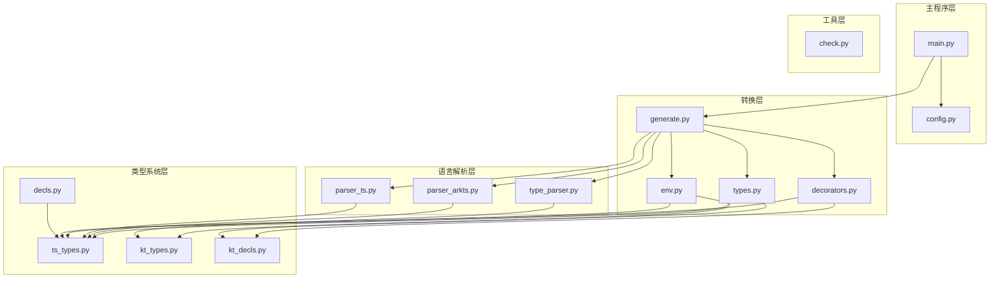
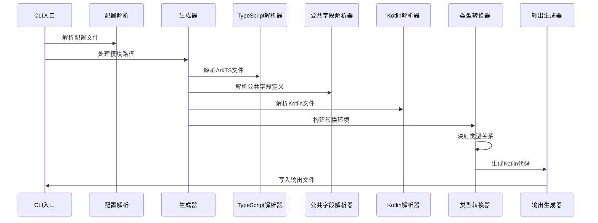
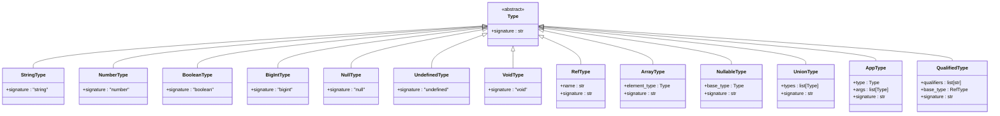
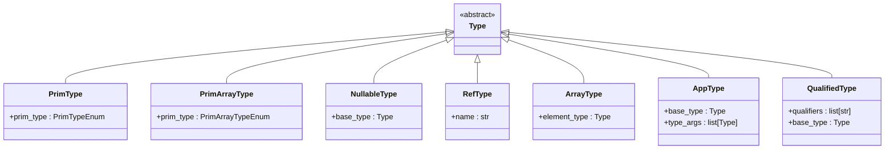
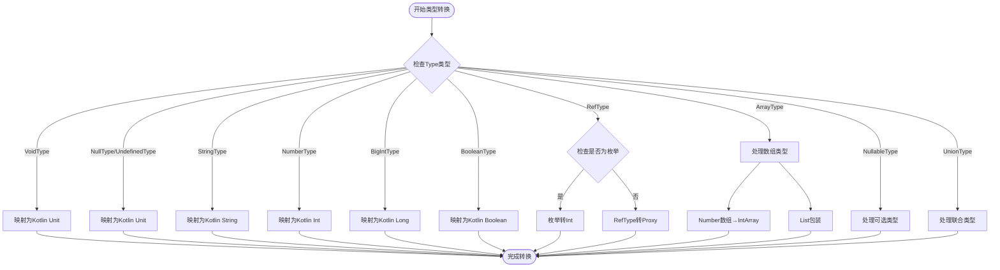
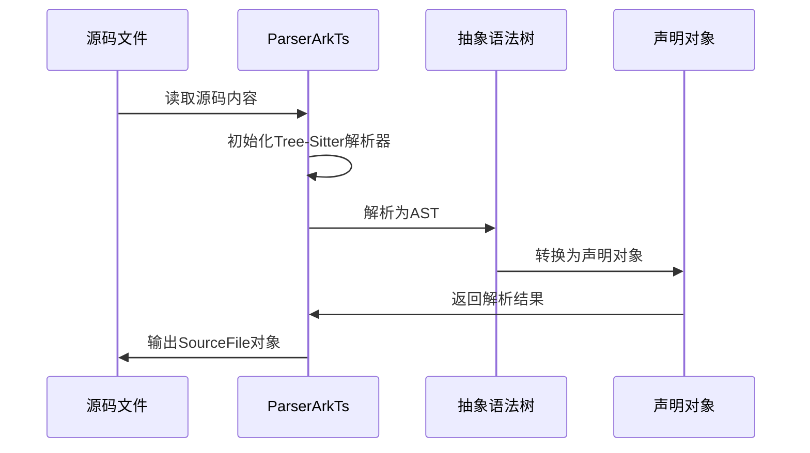
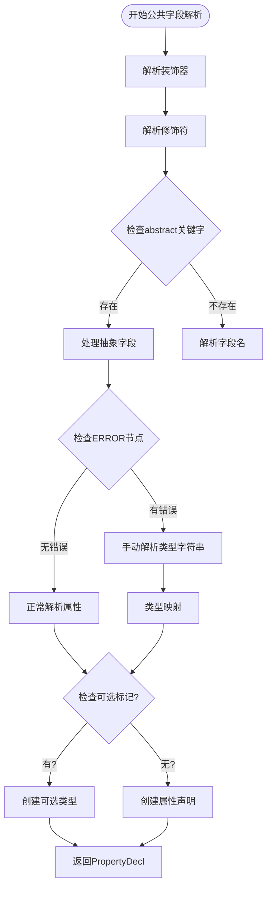
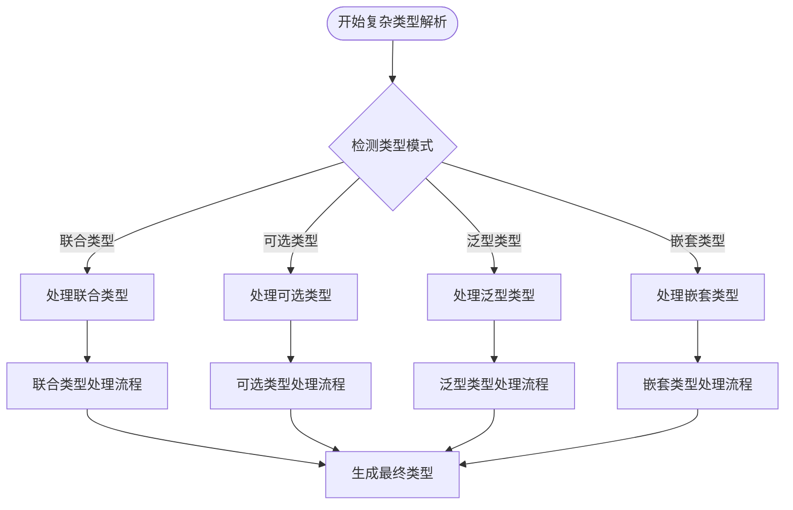
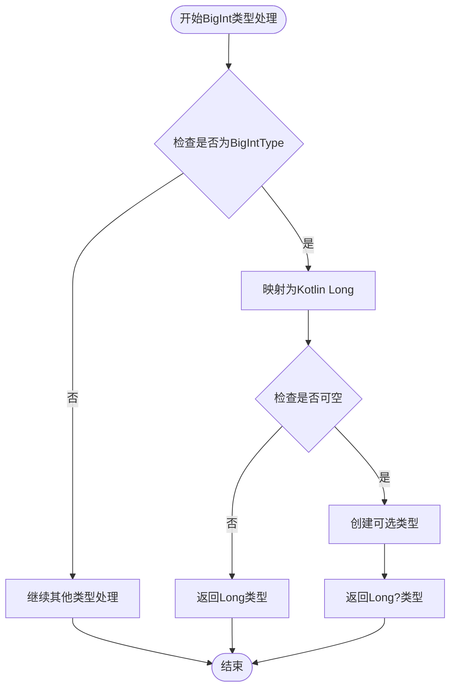
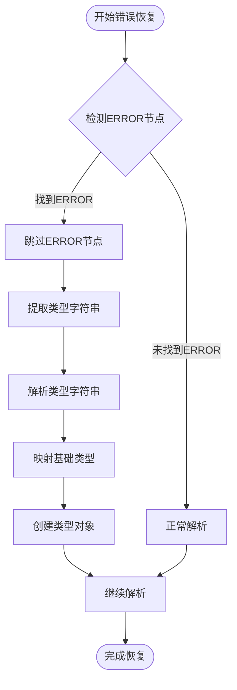

# 类型解析增强

<cite>
**本文档引用的文件**
- [main.py](file://main.py)
- [types.py](file://convert/types.py)
- [kt_types.py](file://lang/kt/kt_types.py)
- [ts_types.py](file://lang/ts/ts_types.py)
- [generate.py](file://convert/generate.py)
- [env.py](file://convert/env.py)
- [type_parser.py](file://lang/kt/type_parser.py)
- [parser_arkts.py](file://lang/ts/parser_arkts.py)
- [parser_ts.py](file://lang/ts/parser_ts.py)
- [decorators.py](file://convert/decorators.py)
- [kt_decls.py](file://lang/kt/kt_decls.py)
- [config.py](file://utils/config.py)
- [check.py](file://convert/check.py)
- [pyproject.toml](file://pyproject.toml)
- [decls.py](file://lang/ts/decls.py)
- [class7.ts](file://test/cases/class7.ts)
- [class8.ts](file://test/cases/class8.ts)
- [class9.ts](file://test/cases/class9.ts)
- [class10.ts](file://test/cases/class10.ts)
</cite>

## 更新摘要
**所做更改**
- 新增公共字段定义解析能力章节，详细说明新增的 parse_public_field_definition 方法
- 更新类型处理流程图，增加公共字段定义的处理逻辑
- 新增复杂TypeScript语法模式支持章节，涵盖联合类型、可选类型、泛型类型等
- 更新测试用例分析，展示增强后的类型解析能力
- 完善类型兼容性矩阵，反映新的类型处理规则
- 新增 BigInt 类型支持章节，详细说明大整数类型的完整支持
- 新增错误恢复机制章节，展示智能错误处理能力

## 目录
1. [简介](#简介)
2. [项目结构](#项目结构)
3. [核心组件](#核心组件)
4. [架构概览](#架构概览)
5. [详细组件分析](#详细组件分析)
6. [公共字段定义解析](#公共字段定义解析)
7. [复杂TypeScript语法模式支持](#复杂typescript语法模式支持)
8. [BigInt 类型支持](#bigint-类型支持)
9. [错误恢复机制](#错误恢复机制)
10. [依赖关系分析](#依赖关系分析)
11. [性能考虑](#性能考虑)
12. [故障排除指南](#故障排除指南)
13. [结论](#结论)

## 简介

这是一个专门针对 ArkTS（ArkTS）与 Kotlin 之间 FFI（Foreign Function Interface）转换的工具系统。该项目的核心目标是实现类型解析增强，将 TypeScript 类型系统与 Kotlin 类型系统进行精确映射，支持复杂的泛型类型、数组类型、可选类型以及自定义类型转换。

**更新** 本次更新重点增强了公共字段定义的类型处理能力，支持更复杂的 TypeScript 语法模式，包括联合类型、可选类型、泛型类型以及装饰器驱动的字段导出机制。系统现已完全支持 BigInt 类型，提供从 TypeScript bigint 到 Kotlin Long 的完整映射支持，并显著改进了错误恢复机制，能够在解析失败时提供智能恢复策略。

该系统通过树解析器解析 ArkTS 源码，构建抽象语法树（AST），然后将这些类型信息转换为对应的 Kotlin 类型表示。项目特别关注类型安全性和互操作性，确保在不同语言间传递数据时保持类型一致性。

## 项目结构

项目采用模块化设计，主要分为以下几个核心模块：



**图表来源**
- [main.py](file://main.py#L1-L36)
- [generate.py](file://convert/generate.py#L1-L147)
- [types.py](file://convert/types.py#L1-L67)

**章节来源**
- [pyproject.toml](file://pyproject.toml#L1-L27)
- [main.py](file://main.py#L1-L36)

## 核心组件

### 类型转换引擎

类型转换引擎是整个系统的核心，负责将 TypeScript 类型转换为 Kotlin 类型。其主要功能包括：

- 基本类型映射：string → String, number → Int, boolean → Boolean
- **新增** BigInt 类型映射：bigint → Long
- 复杂类型处理：数组、泛型、联合类型、可选类型
- 枚举类型特殊处理：将 TypeScript 枚举映射为 Kotlin Int 类型
- 质量类型转换：处理 qualified types 和自定义类型别名

### 解析器系统

系统包含两个主要的解析器：

1. **ArkTS 解析器**：使用 Tree-Sitter 库解析 ArkTS 源码
2. **TypeScript 解析器**：专门处理公共字段定义的解析器
3. **Kotlin 解析器**：解析现有的 Kotlin 源码文件

### 环境管理器

环境管理器负责维护跨文件的类型信息和类映射关系，包括：

- 类重命名映射
- 共享类 ID 管理
- 枚举类型集合
- 字段名称映射

**章节来源**
- [types.py](file://convert/types.py#L10-L67)
- [env.py](file://convert/env.py#L1-L144)

## 架构概览

系统采用分层架构设计，从源码解析到类型转换再到代码生成：



**图表来源**
- [main.py](file://main.py#L12-L25)
- [generate.py](file://convert/generate.py#L85-L147)
- [config.py](file://utils/config.py#L66-L83)

## 详细组件分析

### TypeScript 类型系统

TypeScript 类型系统提供了丰富的类型表达能力：



**图表来源**
- [ts_types.py](file://lang/ts/ts_types.py#L8-L260)

### Kotlin 类型系统

Kotlin 类型系统提供了更严格的类型安全保证：



**图表来源**
- [kt_types.py](file://lang/kt/kt_types.py#L51-L254)

### 类型转换流程

类型转换过程遵循严格的匹配规则：



**图表来源**
- [types.py](file://convert/types.py#L10-L67)

### ArkTS 解析器

ArkTS 解析器使用 Tree-Sitter 库提供高性能的语法解析：



**图表来源**
- [parser_arkts.py](file://lang/ts/parser_arkts.py#L10-L313)

**章节来源**
- [ts_types.py](file://lang/ts/ts_types.py#L1-L260)
- [kt_types.py](file://lang/kt/kt_types.py#L1-L254)
- [types.py](file://convert/types.py#L1-L67)
- [parser_arkts.py](file://lang/ts/parser_arkts.py#L1-L313)

## 公共字段定义解析

**新增** 系统现在支持专门的公共字段定义解析，通过增强的 TypeScript 解析器处理复杂的字段声明模式。

### 解析器增强功能

公共字段定义解析器具备以下核心能力：

- **装饰器解析**：支持 @ExportField、@ExportClass 等装饰器
- **修饰符处理**：解析 readonly、static 等修饰符
- **抽象字段支持**：处理 abstract 关键字的特殊逻辑
- **错误恢复机制**：在解析失败时提供智能恢复策略

### 解析流程



**图表来源**
- [parser_ts.py](file://lang/ts/parser_ts.py#L147-L214)

### 字段修饰符支持

系统支持多种字段修饰符组合：

- **只读字段**：`readonly field: string`
- **静态字段**：`static field: number`
- **只读静态字段**：`static readonly field: boolean`
- **装饰器字段**：`@ExportField({id: "field1"}) field: string`

**章节来源**
- [parser_ts.py](file://lang/ts/parser_ts.py#L147-L214)
- [decls.py](file://lang/ts/decls.py#L85-L103)

## 复杂TypeScript语法模式支持

**新增** 系统现已全面支持复杂的 TypeScript 语法模式，包括联合类型、可选类型、泛型类型以及嵌套类型结构。

### 支持的语法模式

#### 联合类型
- `string | number | boolean`
- `collections.Array<string> | null`
- `SendableChild | undefined | null`

#### 泛型类型
- `collections.Array<string>`
- `collections.Map<string, number>`
- `List<List<Int>>`
- `Map<String, Map<String, Int>>`

#### 可选类型
- `field?: string`
- `optionalField?: number | null`
- `nullableField?: SendableChild`

#### 嵌套复杂类型
- `collections.Array<collections.Array<number>>`
- `collections.Map<string, collections.Array<string>>`
- `List<Map<String, String>>`

### 类型处理策略

系统采用智能的类型处理策略来应对复杂语法：



**图表来源**
- [ts_types.py](file://lang/ts/ts_types.py#L160-L260)
- [types.py](file://convert/types.py#L37-L67)

### 测试用例分析

系统通过多个测试用例验证复杂语法的支持能力：

#### 基础类型测试
- [class7.ts](file://test/cases/class7.ts#L4-L21)：展示基本字段类型定义
- 支持类型：number、boolean、string、bigint、null、undefined

#### 联合类型测试  
- [class8.ts](file://test/cases/class8.ts#L3-L12)：演示联合类型字段定义
- 支持类型：`string | number | boolean`

#### 复杂泛型测试
- [class9.ts](file://test/cases/class9.ts#L6-L51)：展示复杂泛型类型
- 支持类型：`collections.Array<number>`、`collections.Map<string, number>`

#### Kotlin类型映射测试
- [class10.ts](file://test/cases/class10.ts#L7-L8)：验证 Kotlin 类型映射
- 支持类型：`kotlin.Long?`

**章节来源**
- [class7.ts](file://test/cases/class7.ts#L1-L21)
- [class8.ts](file://test/cases/class8.ts#L1-L13)
- [class9.ts](file://test/cases/class9.ts#L1-L52)
- [class10.ts](file://test/cases/class10.ts#L1-L10)

## BigInt 类型支持

**新增** 系统现已完全支持 TypeScript 的 BigInt 类型，提供从 bigint 到 Kotlin Long 的完整映射支持。

### 类型定义

BigIntType 是 TypeScript 类型系统中的新类型，用于表示任意精度的整数：


**图表来源**
- [ts_types.py](file://lang/ts/ts_types.py#L74-L78)

### 类型映射规则

BigInt 类型在转换过程中遵循以下映射规则：

- **TypeScript → Kotlin**：bigint → Long
- **空值处理**：bigint | null → Long?
- **联合类型**：bigint | string → 保留为联合类型（不进行自动转换）

### 类型转换实现



**图表来源**
- [types.py](file://convert/types.py#L20-L21)

### 测试验证

系统通过以下测试用例验证 BigInt 类型的支持：

- [class7.ts](file://test/cases/class7.ts#L8)：`field4 : bigint;` → 映射为 Kotlin Long 类型

**章节来源**
- [ts_types.py](file://lang/ts/ts_types.py#L74-L78)
- [types.py](file://convert/types.py#L20-L21)
- [class7.ts](file://test/cases/class7.ts#L8)

## 错误恢复机制

**新增** 系统实现了智能的错误恢复机制，能够在解析失败时提供优雅的降级处理。

### 错误恢复策略

当解析器遇到语法错误时，系统采用以下恢复策略：

1. **错误节点检测**：识别 Tree-Sitter 解析器产生的 ERROR 节点
2. **手动解析**：提取类型字符串并进行手动类型解析
3. **类型映射**：根据基础类型映射规则创建相应的类型对象
4. **继续处理**：跳过错误节点并继续解析后续内容

### 实现流程



**图表来源**
- [parser_ts.py](file://lang/ts/parser_ts.py#L161-L177)

### 错误处理示例

在处理抽象字段时，系统会检查是否存在 ERROR 节点：

```typescript
// 示例：抽象字段解析
if self.peek().type == 'abstract':
    nullable = False
    field_name = 'abstract'
    self.eat('abstract')
    ty = None
    
    # 错误恢复逻辑
    if self.peek().type == 'ERROR':
        self.eat('ERROR')
        self.skip_until('property_identifier')
        type_str = self.parse_text()
        # 手动解析类型字符串
        match type_str:
            case 'number':
                ty = NumberType()
            case 'boolean':
                ty = BooleanType()
            case 'string':
                ty = StringType()
            case 'bigint':
                ty = BigIntType()
            case _:
                ty = RefType(type_str)
```

**章节来源**
- [parser_ts.py](file://lang/ts/parser_ts.py#L161-L177)

## 依赖关系分析

系统依赖关系清晰，各模块职责明确：

```mermaid
graph LR
subgraph "外部依赖"
TS[tree-sitter-arkts]
KT[tree-sitter-kotlin]
PY[Python标准库]
end
subgraph "内部模块"
MAIN[main.py]
GEN[generate.py]
TYPES[types.py]
TS_PARSER[parser_arkts.py]
TS_PARSER_TS[parser_ts.py]
TS_TYPES[ts_types.py]
KT_TYPES[kt_types.py]
ENV[env.py]
DEC[decorators.py]
CFG[config.py]
CHECK[check.py]
DECLS[decls.py]
END
MAIN --> GEN
GEN --> TYPES
GEN --> TS_PARSER
GEN --> TS_PARSER_TS
GEN --> KT_PARSER
GEN --> DEC
GEN --> ENV
TYPES --> TS_TYPES
TYPES --> KT_TYPES
TS_PARSER --> TS_TYPES
TS_PARSER_TS --> TS_TYPES
KT_PARSER --> KT_TYPES
DEC --> TS_TYPES
DEC --> KT_TYPES
DEC --> DECLS
MAIN --> CFG
ENV --> CHECK
ENV --> DECLS
```

**图表来源**
- [pyproject.toml](file://pyproject.toml#L15-L22)
- [main.py](file://main.py#L1-L10)

### 类型兼容性矩阵

| TypeScript 类型 | Kotlin 类型 | 备注 |
|----------------|-------------|------|
| string | String | 基本类型映射 |
| number | Int | 数值类型映射 |
| **bigint** | **Long** | **新增：大整数类型映射** |
| boolean | Boolean | 布尔类型映射 |
| null/undefined | Unit | 空类型映射 |
| void | Unit | 空返回值类型 |
| Array<T> | List<T> 或 IntArray | 数组类型处理 |
| T? | T? | 可选类型处理 |
| T \| U | NullableType | 联合类型处理 |
| collections.Array<T> | List<T> | 发送类型数组 |
| collections.Map<K, V> | Map<K, V> | 发送类型映射 |
| qualified.T | T | 质量类型处理 |
| @ExportField装饰器 | 特殊字段处理 | 导出字段映射 |
| **ERROR节点** | **手动解析** | **新增：错误恢复机制** |

**章节来源**
- [types.py](file://convert/types.py#L10-L67)
- [ts_types.py](file://lang/ts/ts_types.py#L160-L260)
- [kt_types.py](file://lang/kt/kt_types.py#L137-L254)

## 性能考虑

系统在设计时充分考虑了性能优化：

1. **增量解析**：仅解析变更的文件，避免全量重新解析
2. **缓存机制**：缓存解析结果和类型映射关系
3. **流式处理**：支持大文件的流式解析和转换
4. **并行处理**：支持多文件并行转换
5. **智能恢复**：公共字段解析器的错误恢复机制减少解析失败的影响
6. **类型映射优化**：BigInt 类型的直接映射避免了额外的类型转换开销

## 故障排除指南

### 常见错误及解决方案

1. **类型不匹配错误**
   - 检查 TypeScript 类型定义是否正确
   - 确认 Kotlin 类型映射规则
   - 验证枚举类型的处理逻辑

2. **公共字段解析错误**
   - 检查 @ExportField 装饰器语法
   - 验证字段修饰符的正确使用
   - 确认抽象字段的特殊处理逻辑

3. **复杂类型解析错误**
   - 检查泛型类型的嵌套结构
   - 验证联合类型的成员数量
   - 确认可选类型的标记位置

4. **解析器错误**
   - 检查源码语法是否符合 ArkTS 规范
   - 验证 Tree-Sitter 解析器版本兼容性
   - 确认文件编码格式为 UTF-8

5. **BigInt 类型错误**
   - 确认 TypeScript 源码中使用的是 bigint 而非 number
   - 验证 Kotlin 端是否正确导入 Long 类型
   - 检查可空性处理是否正确

**章节来源**
- [check.py](file://convert/check.py#L1-L89)
- [env.py](file://convert/env.py#L30-L144)
- [parser_ts.py](file://lang/ts/parser_ts.py#L161-L190)

## 结论

该类型解析增强系统为 ArkTS 与 Kotlin 之间的 FFI 转换提供了强大的基础设施。通过精心设计的类型映射规则、高效的解析器系统和完善的错误处理机制，系统能够可靠地处理复杂的类型转换需求。

**更新亮点** 本次更新重点增强了公共字段定义的类型处理能力，支持更复杂的 TypeScript 语法模式，包括联合类型、可选类型、泛型类型以及装饰器驱动的字段导出机制。新增的解析器能够智能处理抽象字段、错误恢复以及复杂的类型组合，大大提升了系统的灵活性和实用性。

**新增特性** 系统现已完全支持 BigInt 类型，提供从 TypeScript bigint 到 Kotlin Long 的完整映射支持，并实现了智能错误恢复机制，能够在解析失败时提供优雅的降级处理。这些增强功能为实际项目中的类型转换提供了更强大的支持，特别是在处理大型项目的复杂类型定义时表现出色。

系统的模块化设计使得扩展和维护变得相对简单，同时保持了良好的性能表现。未来可以进一步增强对复杂泛型类型的支持，并优化大文件处理的内存使用效率。新增的公共字段解析能力和错误恢复机制为实际应用提供了更好的鲁棒性和可用性。