# 表达式解析系统

<cite>
**本文档引用的文件**
- [main.py](file://main.py)
- [generate.py](file://convert/generate.py)
- [decls.py](file://convert/decls.py)
- [types.py](file://convert/types.py)
- [parser.py](file://lang/parser.py)
- [parser_ts.py](file://lang/ts/parser_ts.py)
- [kt_parser.py](file://lang/kt/kt_parser.py)
- [env.py](file://convert/env.py)
- [config.py](file://utils/config.py)
- [decls.py](file://lang/ts/decls.py)
- [decorators.py](file://convert/decorators.py)
- [class7.ts](file://test/cases/class7.ts)
- [class8.ts](file://test/cases/class8.ts)
- [class9.ts](file://test/cases/class9.ts)
- [class10.ts](file://test/cases/class10.ts)
- [class11.ts](file://test/cases/class11.ts)
- [enum0.ts](file://test/cases/enum0.ts)
- [pyproject.toml](file://pyproject.toml)
</cite>

## 更新摘要
**所做更改**
- 增强了装饰器值提取功能，支持复杂参数结构和嵌套装饰器参数
- 改进了g_get_decorator_value函数以支持MapValue类型的参数提取
- 新增了UnaryExpressionValue类支持一元表达式参数
- 扩展了装饰器参数解析能力，支持更复杂的表达式类型
- 增强了装饰器值提取的健壮性和灵活性

## 目录
1. [简介](#简介)
2. [项目结构](#项目结构)
3. [核心组件](#核心组件)
4. [架构概览](#架构概览)
5. [详细组件分析](#详细组件分析)
6. [依赖关系分析](#依赖关系分析)
7. [性能考虑](#性能考虑)
8. [故障排除指南](#故障排除指南)
9. [结论](#结论)

## 简介

表达式解析系统是一个基于Tree-Sitter语法解析器的跨语言转换工具，专门用于将ArkTS（Ark TypeScript）代码转换为Kotlin代码。该系统支持装饰器驱动的类型映射、属性转换器生成以及FFI（Foreign Function Interface）集成。

**更新** 系统在最近的更新中显著增强了装饰器值提取功能，支持复杂参数结构和嵌套装饰器参数。新增的g_get_decorator_value函数能够处理MapValue类型的装饰器参数，并通过UnaryExpressionValue类支持一元表达式参数。这一改进使得装饰器参数提取更加灵活和强大，能够处理各种复杂的参数结构。

**新增功能** 系统现已支持：
- 复杂参数结构的装饰器值提取
- 嵌套装饰器参数的解析和处理
- 一元表达式参数的支持
- MapValue类型的参数提取
- 更灵活的装饰器参数访问机制

系统的核心功能包括：
- ArkTS到Kotlin的双向类型转换
- 装饰器解析和处理
- 属性getter/setter转换器生成
- FFI上下文集成
- 多模块项目支持
- 增强的注释处理能力
- 一元表达式支持
- 复杂装饰器参数提取

## 项目结构

项目采用模块化设计，主要分为以下几个核心模块：

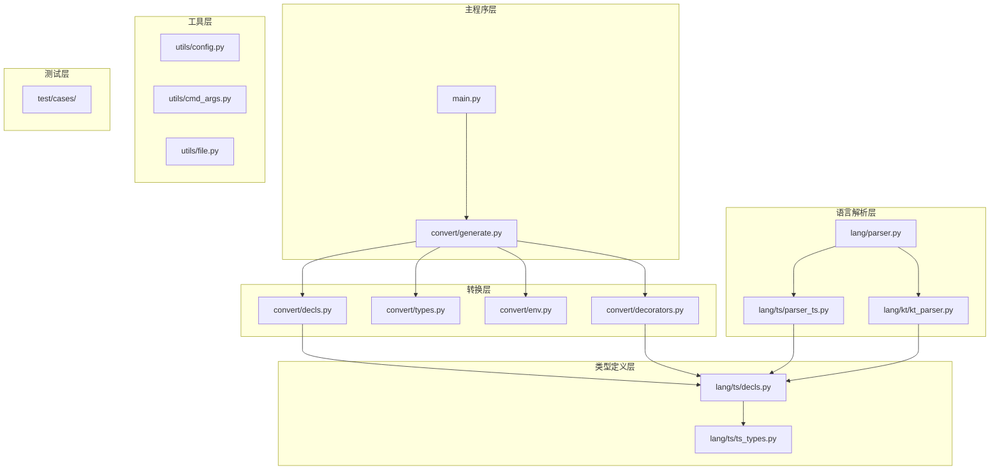

**图表来源**
- [main.py](file://main.py#L1-L36)
- [generate.py](file://convert/generate.py#L1-L146)
- [parser.py](file://lang/parser.py#L1-L81)
- [decorators.py](file://convert/decorators.py#L1-L41)

**章节来源**
- [pyproject.toml](file://pyproject.toml#L1-L27)
- [main.py](file://main.py#L1-L36)

## 核心组件

### 主要组件概述

系统包含以下核心组件：

1. **主入口组件**：负责命令行参数解析和模块处理流程控制
2. **转换引擎**：执行ArkTS到Kotlin的代码转换
3. **解析器层**：提供ArkTS和Kotlin语法解析能力，包括增强的注释处理和一元表达式支持
4. **类型系统**：管理跨语言类型映射和转换规则
5. **环境管理**：维护装饰器信息和命名映射关系
6. **装饰器处理层**：专门处理装饰器参数提取和解析

### 组件交互流程

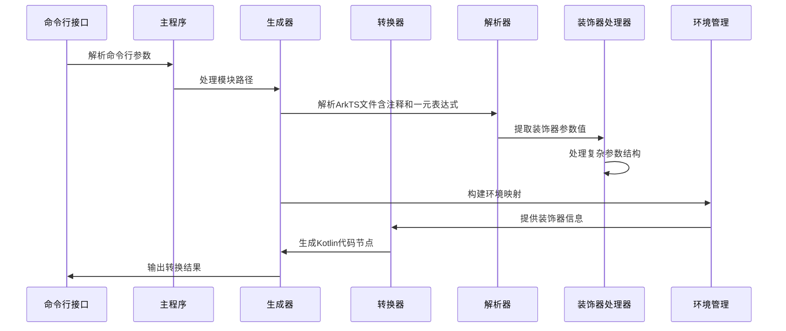

**图表来源**
- [main.py](file://main.py#L12-L25)
- [generate.py](file://convert/generate.py#L85-L146)

**章节来源**
- [main.py](file://main.py#L12-L25)
- [generate.py](file://convert/generate.py#L85-L146)

## 架构概览

系统采用分层架构设计，每层都有明确的职责分工：

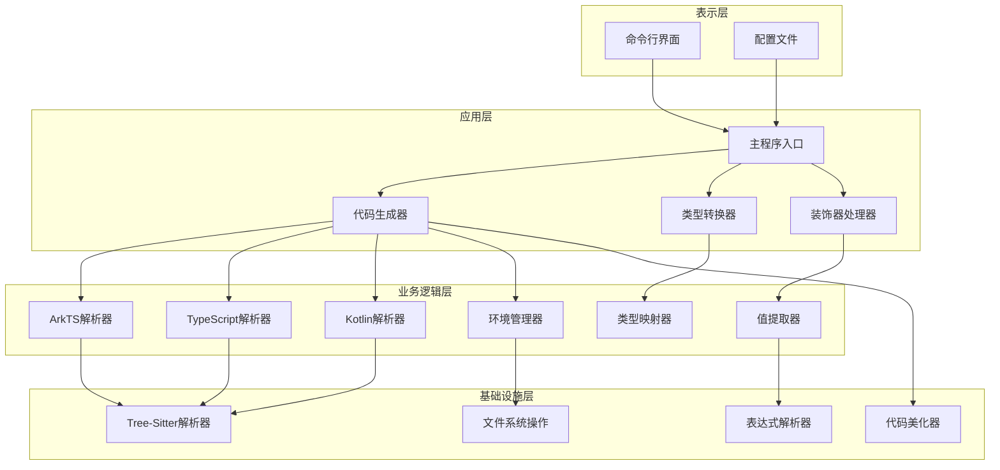

**图表来源**
- [main.py](file://main.py#L1-L36)
- [generate.py](file://convert/generate.py#L1-L146)
- [env.py](file://convert/env.py#L1-L140)
- [decorators.py](file://convert/decorators.py#L1-L41)

## 详细组件分析

### 主程序组件分析

主程序作为系统的入口点，负责协调整个转换流程：

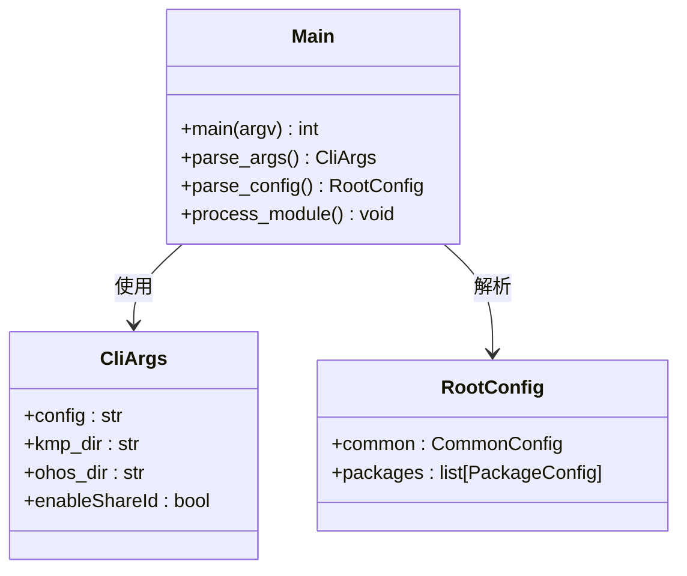

**图表来源**
- [main.py](file://main.py#L12-L35)

**章节来源**
- [main.py](file://main.py#L12-L35)

### 代码生成器组件分析

代码生成器是系统的核心转换引擎：

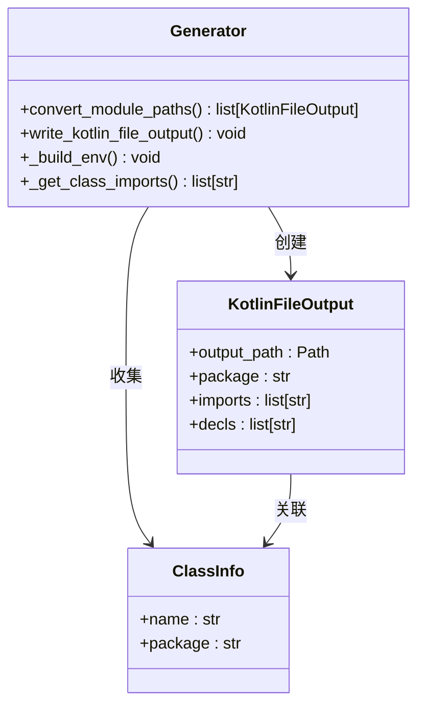

**图表来源**
- [generate.py](file://convert/generate.py#L45-L146)

**章节来源**
- [generate.py](file://convert/generate.py#L45-L146)

### 类型转换器组件分析

类型转换器负责处理复杂的类型映射关系：

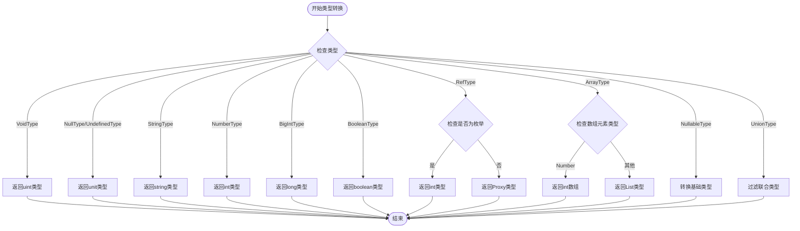

**图表来源**
- [types.py](file://convert/types.py#L10-L67)

**章节来源**
- [types.py](file://convert/types.py#L10-L67)

### 属性转换器组件分析

属性转换器处理ArkTS和Kotlin之间的数据转换：

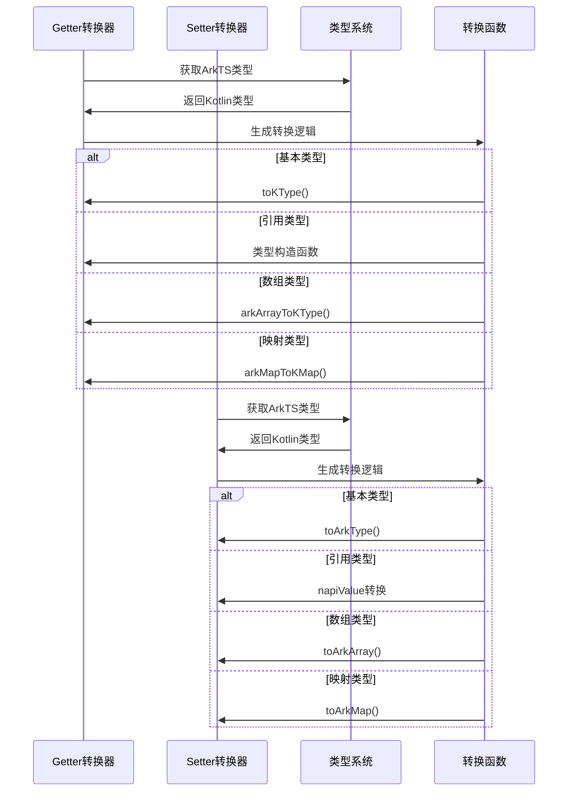

**图表来源**
- [decls.py](file://convert/decls.py#L22-L178)

**章节来源**
- [decls.py](file://convert/decls.py#L22-L178)

### 解析器组件分析

解析器层提供语法解析能力，包括增强的注释处理和一元表达式支持：

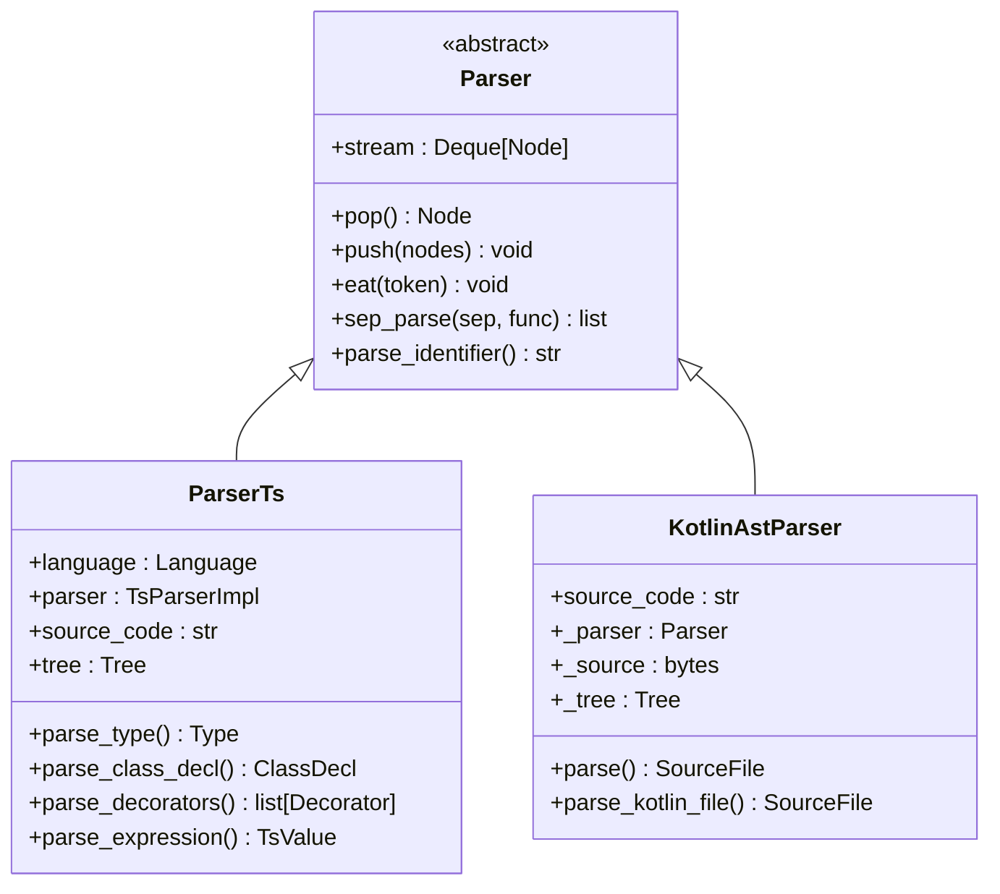

**更新** ParserTs增强了表达式解析能力，特别是对注释和一元表达式的处理更加稳健。新增的`skip_comments()`方法提供了统一的注释跳过机制，UnaryExpressionValue类支持一元运算符的解析。

**图表来源**
- [parser.py](file://lang/parser.py#L8-L81)
- [parser_ts.py](file://lang/ts/parser_ts.py#L43-L91)
- [kt_parser.py](file://lang/kt/kt_parser.py#L229-L284)

**章节来源**
- [parser.py](file://lang/parser.py#L8-L81)
- [parser_ts.py](file://lang/ts/parser_ts.py#L43-L91)
- [kt_parser.py](file://lang/kt/kt_parser.py#L229-L284)

### 装饰器处理组件分析

**更新** 装饰器处理层是本次更新的重点，专门处理复杂参数结构和嵌套装饰器参数：

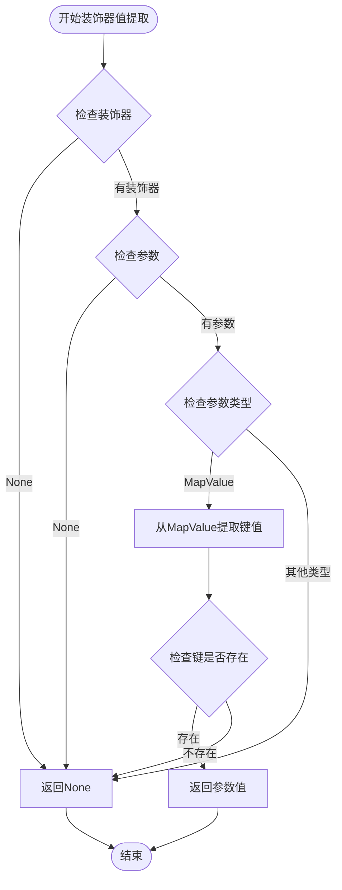

**更新** 新增了复杂的装饰器值提取流程，通过g_get_decorator_value函数支持MapValue类型的参数提取。该函数能够处理嵌套的装饰器参数结构，通过UnaryExpressionValue类支持一元表达式参数的解析和提取。

**图表来源**
- [decls.py](file://lang/ts/decls.py#L52-L57)
- [decorators.py](file://convert/decorators.py#L21-L31)

**章节来源**
- [decls.py](file://lang/ts/decls.py#L52-L57)
- [decorators.py](file://convert/decorators.py#L21-L31)

### 环境管理器组件分析

环境管理器负责维护装饰器信息和命名映射：

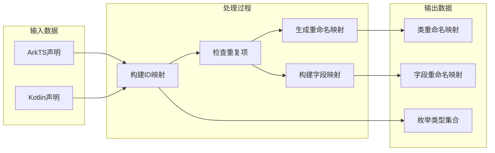

**图表来源**
- [env.py](file://convert/env.py#L30-L140)

**章节来源**
- [env.py](file://convert/env.py#L30-L140)

### 表达式解析器组件分析

**更新** 表达式解析器是本次更新的重点，专门处理包含注释和一元表达式的复杂表达式：

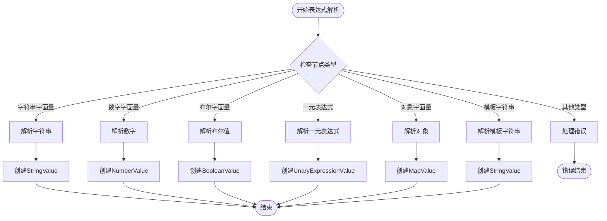

**更新** 新增了注释处理流程和一元表达式处理流程，确保在解析表达式时能够正确处理一元运算符。通过UnaryExpressionValue类支持一元运算符的解析，为装饰器参数提取提供了更强大的表达式支持。

**图表来源**
- [parser_ts.py](file://lang/ts/parser_ts.py#L43-L67)

**章节来源**
- [parser_ts.py](file://lang/ts/parser_ts.py#L43-L67)

### 枚举解析器组件分析

**更新** 枚举解析器在处理注释和一元表达式方面有了显著改进：

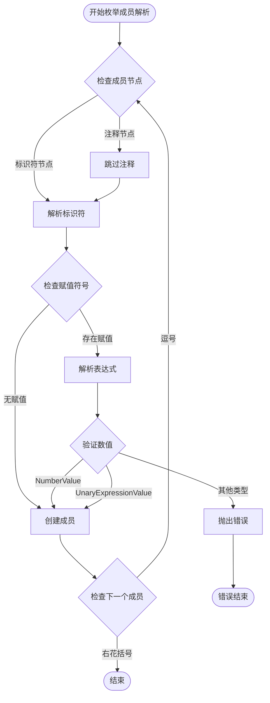

**更新** 新增了注释处理步骤和一元表达式处理步骤，确保在解析枚举成员时能够正确处理一元运算符。通过`isinstance(item, NumberValue) or isinstance(item, UnaryExpressionValue)`支持一元表达式的数值转换。

**图表来源**
- [parser_ts.py](file://lang/ts/parser_ts.py#L223-L232)

**章节来源**
- [parser_ts.py](file://lang/ts/parser_ts.py#L223-L232)

## 依赖关系分析

系统使用Tree-Sitter作为语法解析后端，支持多种编程语言：

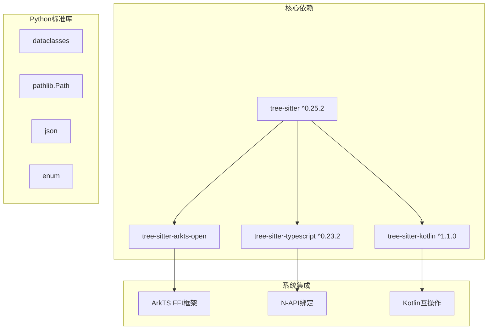

**图表来源**
- [pyproject.toml](file://pyproject.toml#L15-L22)

**章节来源**
- [pyproject.toml](file://pyproject.toml#L15-L22)

## 性能考虑

系统在设计时考虑了以下性能优化策略：

1. **增量解析**：使用Tree-Sitter的增量解析能力，避免全量重新解析
2. **缓存机制**：对解析结果和转换规则进行缓存
3. **流式处理**：支持大文件的流式处理，减少内存占用
4. **并行处理**：多模块并行处理提升整体性能
5. **注释预处理**：优化注释节点的跳过机制，减少不必要的解析开销
6. **一元表达式缓存**：对解析的一元表达式进行缓存，避免重复解析
7. **装饰器值提取优化**：通过MapValue的直接访问机制提升参数提取性能
8. **复杂参数结构处理**：优化嵌套装饰器参数的解析效率

**更新** 新增了装饰器值提取优化和复杂参数结构处理机制，通过高效的MapValue访问和一元表达式解析优化提升整体性能。g_get_decorator_value函数提供了O(1)时间复杂度的参数提取，其中n是装饰器参数数量。

## 故障排除指南

### 常见错误类型及解决方案

| 错误类型 | 错误码 | 描述 | 解决方案 |
|---------|--------|------|----------|
| 重复ID错误 | 1003 | 同包名下类名重复 | 检查装饰器中的name或自动生成的Proxy名称 |
| 重复ID错误 | 1004 | ShareClass ID重复 | 确保每个ShareClass ID唯一 |
| 重复字段ID | 2002 | 字段名称重复 | 检查装饰器中的name属性 |
| 重复字段ID | 2003 | 字段ID重复 | 确保每个字段的ShareField ID唯一 |
| 注释解析错误 | 3001 | 注释格式不正确 | 检查注释语法和格式 |
| 表达式解析错误 | 3002 | 表达式包含非法字符 | 验证表达式语法 |
| 枚举注释错误 | 3003 | 枚举成员注释位置错误 | 确保注释位于枚举成员标识符之前 |
| 一元表达式错误 | 3004 | 一元运算符解析失败 | 检查一元运算符的语法正确性 |
| 枚举一元表达式错误 | 3005 | 枚举中的一元表达式无效 | 确保一元表达式能转换为整数值 |
| 装饰器参数提取错误 | 3006 | 装饰器参数无法提取 | 检查装饰器参数的键名和类型 |
| 复杂参数结构错误 | 3007 | 嵌套装饰器参数解析失败 | 验证装饰器参数的嵌套结构 |

### 调试建议

1. **启用详细日志**：通过命令行参数增加调试信息输出
2. **检查配置文件**：验证JSON配置格式正确性
3. **验证语法**：确保ArkTS和Kotlin源码语法正确
4. **检查依赖**：确认所有Tree-Sitter语法包正确安装
5. **注释验证**：特别注意注释格式的正确性
6. **使用测试文件**：参考`test/cases/class7.ts`等测试文件验证装饰器参数提取
7. **一元表达式测试**：验证一元运算符在装饰器参数中的正确使用
8. **复杂参数结构测试**：参考`test/cases/class8.ts`等测试文件验证嵌套参数处理
9. **MapValue参数测试**：参考`test/cases/class9.ts`等测试文件验证复杂参数结构

**章节来源**
- [env.py](file://convert/env.py#L45-L133)

## 结论

表达式解析系统是一个功能完整、架构清晰的跨语言转换工具。系统通过模块化设计实现了高度的可扩展性和可维护性，支持复杂的类型转换和装饰器处理。

**更新** 最新的更新显著增强了表达式解析系统的稳健性和功能性，特别是在处理包含注释、一元表达式和复杂参数结构的装饰器时表现更加可靠。这一改进通过优化注释处理机制、新增一元表达式支持和增强装饰器值提取功能，提升了整体TypeScript代码解析的质量和稳定性。

**新增功能亮点**：
- 统一的注释跳过机制，通过`skip_comments()`方法实现
- 智能注释处理逻辑，防止注释干扰枚举成员解析
- 一元表达式支持，通过UnaryExpressionValue类实现
- 增强的装饰器值提取功能，支持MapValue类型的参数提取
- 复杂参数结构处理，支持嵌套装饰器参数
- 增强的错误恢复机制，提高解析稳定性
- 优化的性能表现，减少注释和复杂参数处理开销

系统的主要优势包括：
- 完整的ArkTS到Kotlin转换支持
- 灵活的装饰器驱动配置
- 高效的语法解析和代码生成
- 良好的错误处理和调试支持
- 可扩展的架构设计
- 增强的注释处理能力
- 一元表达式支持
- 复杂装饰器参数提取功能

未来可以考虑的功能增强包括：更完善的错误恢复机制、更多的类型转换选项、以及更好的IDE集成支持。同时，装饰器值提取功能和复杂参数结构处理的持续优化将继续提升系统的整体稳定性和功能性。