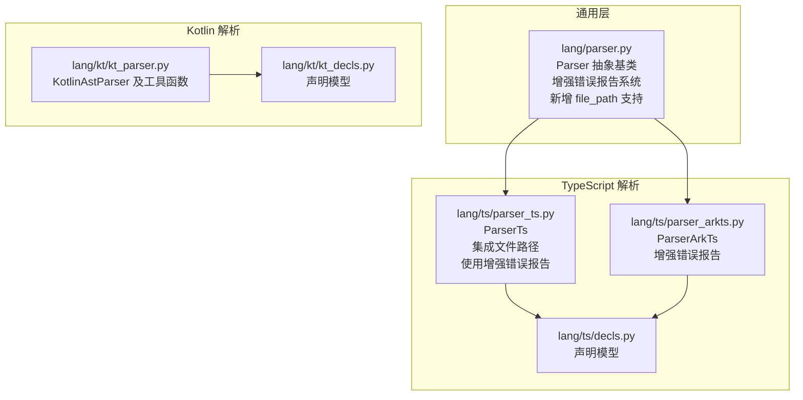
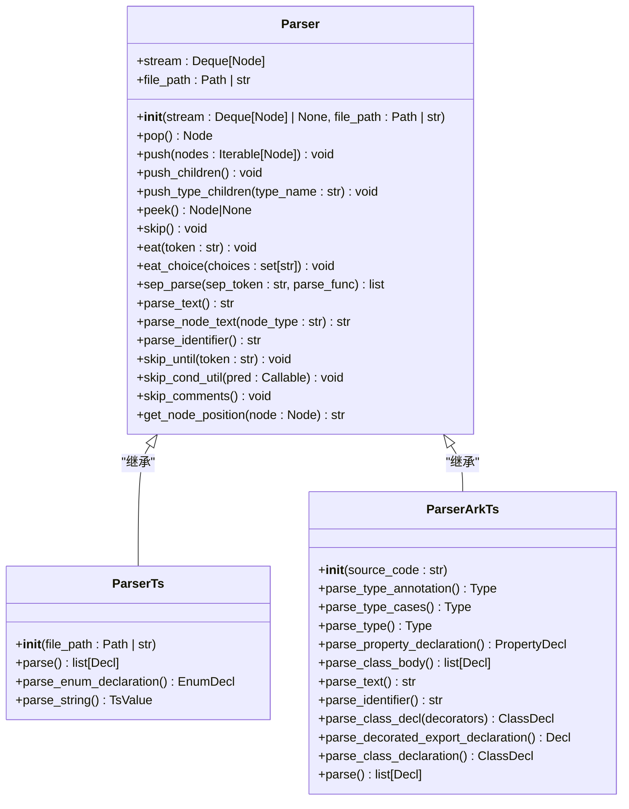
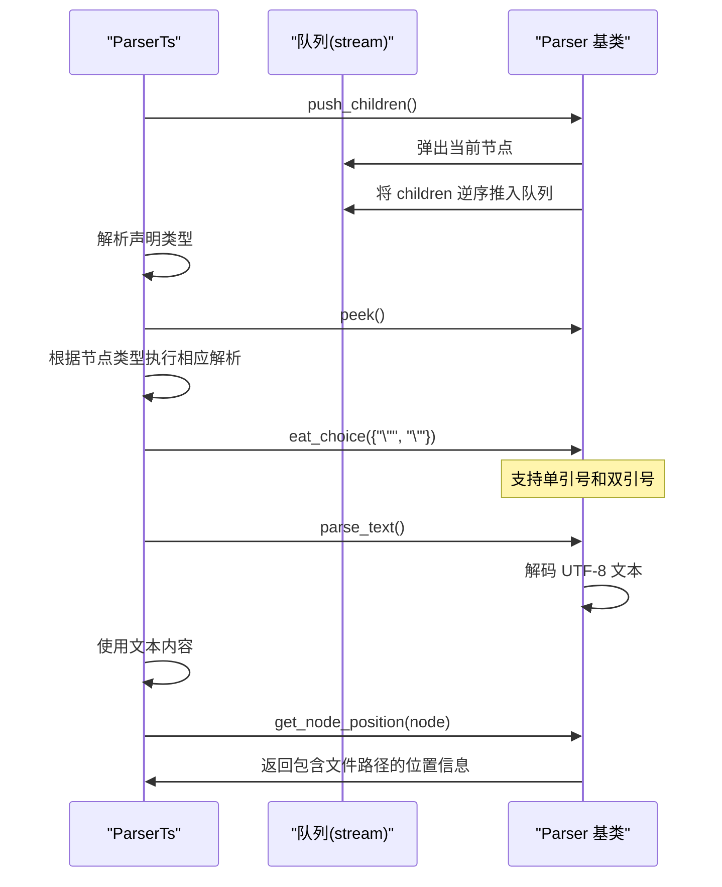
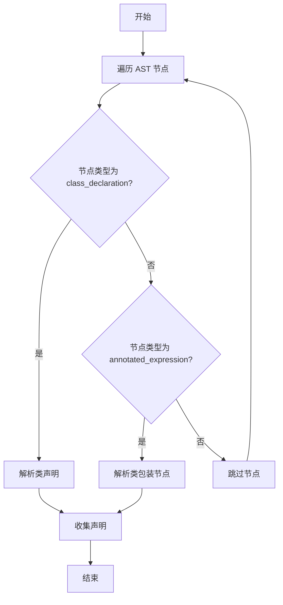
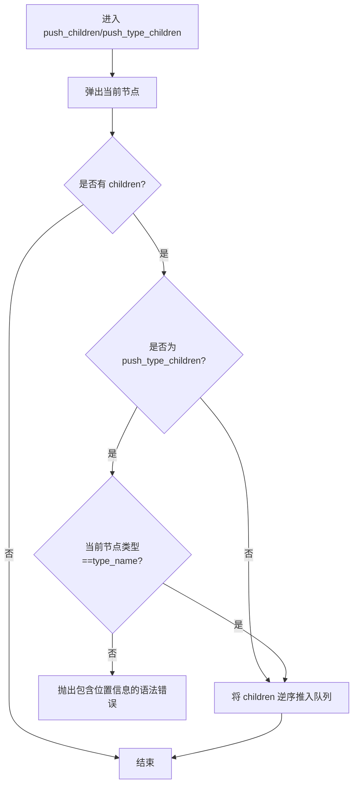
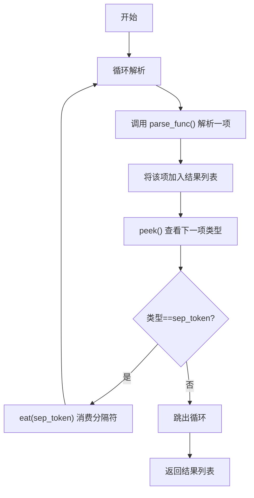
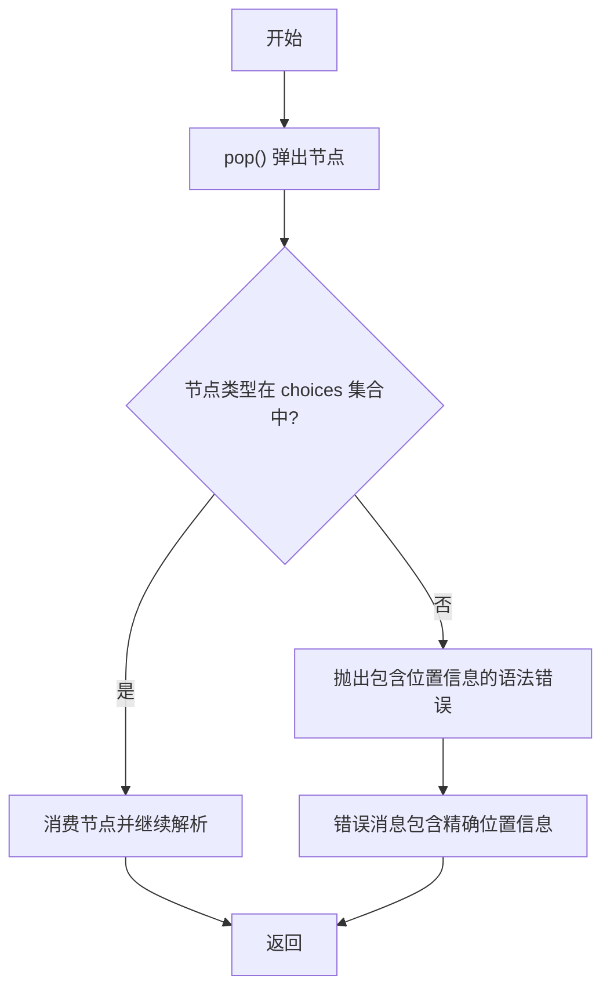
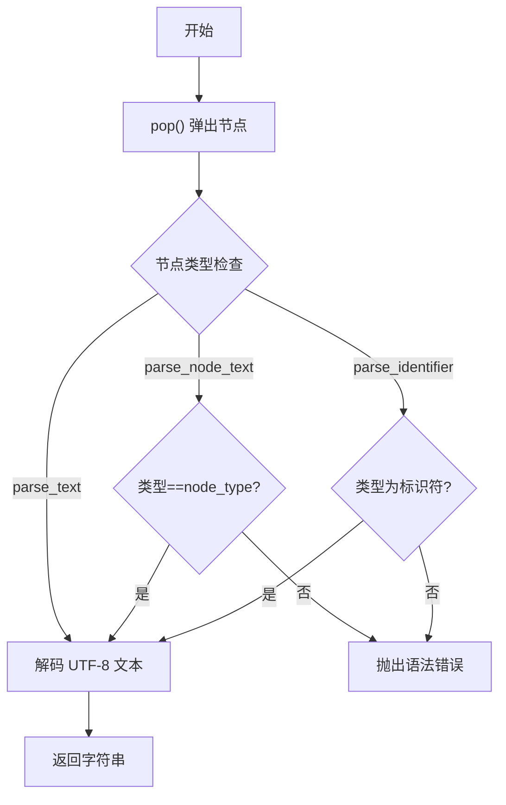
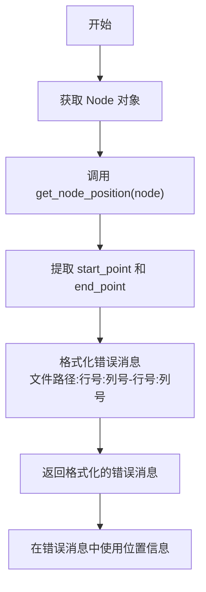
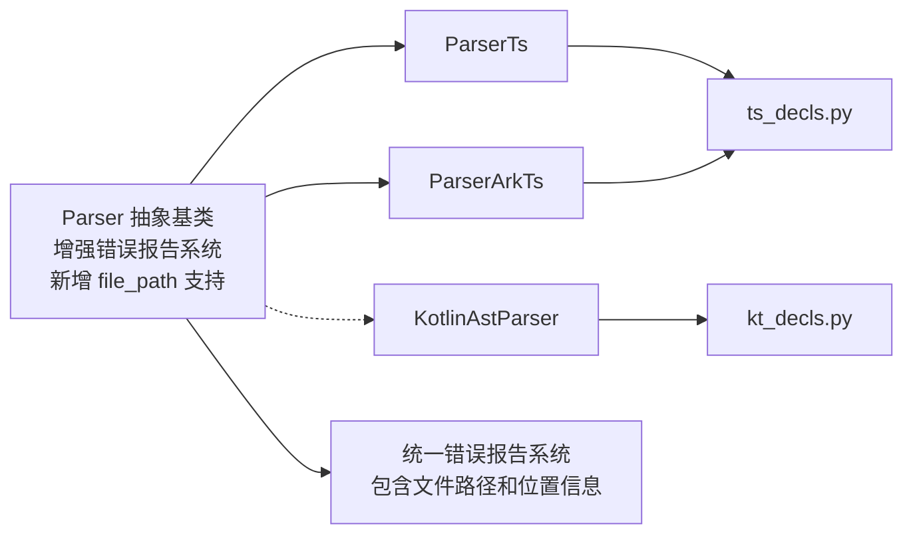

# 抽象解析器基类

<cite>
**本文引用的文件**
- [lang/parser.py](file://lang/parser.py)
- [lang/ts/parser_ts.py](file://lang/ts/parser_ts.py)
- [lang/kt/kt_parser.py](file://lang/kt/kt_parser.py)
- [lang/ts/decls.py](file://lang/ts/decls.py)
- [lang/kt/kt_decls.py](file://lang/kt/kt_decls.py)
</cite>

## 更新摘要
**变更内容**
- 新增 file_path 参数支持，允许在解析器初始化时传入文件路径
- 增强 get_node_position() 方法，现在返回包含文件路径和精确行列位置的详细错误信息
- 所有错误消息现在自动包含文件路径和位置信息，显著提升错误报告的详细程度
- 改进的错误消息格式：`"文件路径:行号:列号-行号:列号"`
- 统一的错误报告系统，所有解析器共享相同的位置信息格式

## 目录
1. [简介](#简介)
2. [项目结构](#项目结构)
3. [核心组件](#核心组件)
4. [架构总览](#架构总览)
5. [详细组件分析](#详细组件分析)
6. [依赖关系分析](#依赖关系分析)
7. [性能考量](#性能考量)
8. [故障排查指南](#故障排查指南)
9. [结论](#结论)
10. [附录](#附录)

## 简介
本文件聚焦于抽象解析器基类 Parser 的设计与实现，系统阐述其在流式解析中的作用、双端队列的使用策略、以及语法树节点处理机制。重点解释以下核心方法的工作原理与协作方式：
- pop() 弹出操作
- push() 推送操作
- push_children() 与 push_type_children() 的节点处理差异
- peek() 预览功能
- eat() 标记匹配
- eat_choice() 多选择标记匹配
- sep_parse() 分隔符解析
- parse_text() 文本提取
- parse_identifier() 标识符提取
- get_node_position() 位置信息获取
- parse_node_text() 节点文本提取

同时给出继承与扩展该基类的实践范式、增强的错误处理机制与最佳实践建议，并通过 TypeScript 与 Kotlin 解析器的具体实现展示这些方法如何协同完成高效语法解析。

**更新** Parser 抽象基类现已集成增强的错误报告系统，新增 file_path 参数支持文件路径传递，get_node_position() 方法提供包含文件路径和精确行列位置的详细错误信息。所有错误消息现在自动包含位置信息，显著提升了调试体验和错误定位精度。

## 项目结构
该项目采用按语言分层的模块化组织方式，Parser 抽象基类位于通用层，具体语言解析器（如 TypeScript 和 Kotlin）分别在各自子目录中实现。

**图表来源**
- [lang/parser.py](file://lang/parser.py#L8-L18)
- [lang/ts/parser_ts.py](file://lang/ts/parser_ts.py#L13-L21)
- [lang/kt/kt_parser.py](file://lang/kt/kt_parser.py#L1-L284)

**章节来源**
- [lang/parser.py](file://lang/parser.py#L1-L108)
- [lang/ts/parser_ts.py](file://lang/ts/parser_ts.py#L1-L449)
- [lang/kt/kt_parser.py](file://lang/kt/kt_parser.py#L1-L284)

## 核心组件
Parser 抽象基类提供面向"流"的解析能力，核心思想是将语法树节点序列化为双端队列，通过一系列受控的读取与回退操作完成递归下降解析。其关键特性如下：
- 流式输入：以双端队列承载待消费的节点流，支持从左端弹出、从右端插入。队列元素类型为 tree_sitter.Node，提供类型安全的节点处理。
- 文件路径支持：构造函数接受 file_path 参数，用于在错误报告中提供文件上下文信息。
- 节点级操作：提供 push_children()/push_type_children() 将子节点重新推入队列，实现"展开-消费-回滚"的语义。
- 标记匹配：eat() 用于严格匹配当前节点类型，失败时抛出包含位置信息的语法错误；eat_choice() 支持多种有效令牌类型的单次匹配，提供更灵活的消费机制。
- 分隔符解析：sep_parse() 以分隔符为界循环解析列表项，简化重复结构的处理。
- 预览与跳过：peek() 仅查看不消费；skip() 消费但不保留值。
- 文本提取：parse_text() 提取当前节点的文本内容；parse_identifier() 提取标识符文本并进行类型验证；parse_node_text() 提取指定类型节点的文本内容。
- 位置信息：get_node_position() 提供精确的节点位置信息，包含文件路径、起始点和结束点坐标。

**更新** 新增的 file_path 参数支持允许在解析器初始化时传入文件路径，get_node_position() 方法现在返回包含文件路径和精确行列位置的详细错误信息。所有错误消息现在自动包含位置信息，显著提升了调试体验和错误定位精度。

**章节来源**
- [lang/parser.py](file://lang/parser.py#L15-L17)

## 架构总览
Parser 基类与具体语言解析器之间的关系如下：

**图表来源**
- [lang/parser.py](file://lang/parser.py#L8-L18)
- [lang/ts/parser_ts.py](file://lang/ts/parser_ts.py#L13-L21)

## 详细组件分析

### Parser 抽象基类
- 设计理念
  - 以"流"为核心：将语法树节点序列化为双端队列，统一了从 AST 中抽取节点的方式。
  - 低耦合高内聚：只持有 stream 和 file_path，其余解析逻辑由子类实现，便于扩展不同语言的解析策略。
  - 类型安全：使用具体的 Node 类型而非泛型参数，确保所有操作都在 tree_sitter.Node 上进行。
  - 实用性增强：新增 parse_text()、parse_identifier()、parse_node_text() 和 eat_choice() 方法，提供专门的文本提取功能和灵活的令牌消费机制。
  - 错误报告增强：所有错误消息现在包含 get_node_position() 提供的精确位置信息，包含文件路径。
- 数据结构
  - stream: 双端队列，元素类型为 tree_sitter.Node，代表 Tree-Sitter 语法树节点。
  - file_path: 文件路径，用于在错误报告中提供文件上下文信息。
- 关键方法详解
  - pop(): 从队列左侧弹出一个 Node 元素，作为当前消费单元。
  - push(nodes): 将一组 Node 节点按逆序从右侧推入队列，保持原有顺序不变，实现"回退"和"重放"。
  - push_children(): 弹出当前节点，将其 children 作为新节点序列推入队列，常用于"展开子树"。
  - push_type_children(type_name): 在 push_children() 基础上增加类型校验，若当前节点类型不匹配则抛出包含位置信息的语法错误。
  - peek(): 返回队列头部元素（若为空返回 None），用于前瞻判断。
  - skip(): 消费当前节点但不保留其值，若节点类型为 ERROR 则抛出包含位置信息的语法错误。
  - eat(token): 匹配当前节点类型是否为 token，否则抛出包含位置信息的语法错误。
  - eat_choice(choices): 匹配当前节点类型是否在 choices 集合中，否则抛出包含位置信息的语法错误，提供更灵活的令牌消费机制。
  - sep_parse(sep_token, parse_func): 以 sep_token 为分隔符循环调用 parse_func，收集结果，直至不再遇到分隔符为止。
  - parse_text(): 提取当前节点的文本内容，解码为 UTF-8 字符串。
  - parse_node_text(node_type): 提取指定类型节点的文本内容，进行类型验证并解码为 UTF-8 字符串。
  - parse_identifier(): 提取当前节点的标识符文本，进行类型验证并解码为 UTF-8 字符串。
  - get_node_position(node): 返回节点的精确位置信息，包含文件路径、起始点和结束点坐标。

**更新** 新增的 file_path 参数支持允许在解析器初始化时传入文件路径，get_node_position() 方法现在返回包含文件路径和精确行列位置的详细错误信息。所有错误消息现在自动包含位置信息，显著提升了调试体验和错误定位精度。

**章节来源**
- [lang/parser.py](file://lang/parser.py#L15-L17)

### TypeScript 解析器（ParserTs）
- 继承关系
  - ParserTs 继承自 Parser，构造时将树根节点的 children 序列化为双端队列，作为初始流，并传入文件路径。
- 方法协作示例
  - 解析导出声明：通过 push_children 展开节点，识别各种声明类型并进行相应处理。
  - 解析枚举声明：使用 push_children 展开节点，解析枚举名称和成员列表。
  - 解析装饰器：先展开节点，再检查"@"符号，必要时解析参数列表。
  - 解析字符串字面量：使用 eat_choice() 方法灵活匹配单引号和双引号，提高解析鲁棒性。
  - 文本提取：使用 parse_text() 提取字符串字面量和数字字面量的文本内容。
  - 错误报告：使用 get_node_position() 提供精确的错误位置信息，包含文件路径。
- 错误处理
  - 当类型或标记不匹配时，抛出包含位置信息的语法错误，便于快速定位问题。

**图表来源**
- [lang/ts/parser_ts.py](file://lang/ts/parser_ts.py#L13-L21)
- [lang/ts/parser_ts.py](file://lang/ts/parser_ts.py#L22-L27)

**章节来源**
- [lang/ts/parser_ts.py](file://lang/ts/parser_ts.py#L1-L449)

### Kotlin 解析器（KotlinAstParser）
- 作用
  - 使用 Tree-Sitter Kotlin 语言生成 AST，遍历节点并提取类声明、属性声明等结构。
- 与 Parser 的关系
  - KotlinAstParser 不直接继承 Parser，而是通过工具函数与类型解析器配合，完成 Kotlin 类型字符串到内部类型的转换。
- 典型流程
  - 遍历树节点，识别 class_declaration 或特殊包装节点（如 annotated_expression）。
  - 提取修饰符、注解、成员等信息，构建声明对象。
  - 对类型字符串使用独立的类型解析器进行解析。

**图表来源**
- [lang/kt/kt_parser.py](file://lang/kt/kt_parser.py#L160-L200)

**章节来源**
- [lang/kt/kt_parser.py](file://lang/kt/kt_parser.py#L1-L284)

### 节点处理差异：push_children() vs push_type_children()
- push_children()
  - 弹出当前节点，将其 children 作为新序列推入队列，不做类型校验。
  - 适用于已知当前节点类型且无需额外校验的场景。
- push_type_children(type_name)
  - 在 push_children() 基础上增加类型校验：若当前节点类型不等于 type_name，则抛出包含位置信息的语法错误。
  - 适用于需要强约束的上下文，例如"必须是 union_type 才能继续解析"。

**图表来源**
- [lang/parser.py](file://lang/parser.py#L27-L36)

**章节来源**
- [lang/parser.py](file://lang/parser.py#L27-L36)

### 分隔符解析 sep_parse() 的工作流
sep_parse() 是处理重复结构（如逗号分隔的表达式列表、联合类型成员）的关键工具。其典型流程如下：

**图表来源**
- [lang/parser.py](file://lang/parser.py#L57-L66)

**章节来源**
- [lang/parser.py](file://lang/parser.py#L57-L66)

### 灵活令牌消费：eat_choice() 方法
- 设计目的
  - 提供更灵活的令牌消费机制，支持多种有效令牌类型的单次操作。
  - 减少重复的类型检查代码，提高解析器的可读性和维护性。
  - 增强解析系统的鲁棒性，能够优雅处理多种等价的令牌形式。
- 工作原理
  - 弹出当前节点，检查其类型是否在给定的 choices 集合中。
  - 若匹配成功，正常继续解析；若不匹配，抛出包含位置信息的语法错误。
  - 支持任意数量的有效令牌类型，只需在集合中指定即可。
- 典型应用场景
  - 字符串字面量：支持单引号和双引号两种形式的字符串字面量。
  - 标识符类型：支持 identifier、property_identifier 和 type_identifier 等多种标识符变体。
  - 操作符选择：在多种等价操作符中选择合适的处理方式。
- 使用示例
  - 字符串字面量解析：`self.eat_choice({"\"", "\'"})` 支持单引号和双引号。
  - 标识符解析：在多个标识符类型中统一处理。

**图表来源**
- [lang/parser.py](file://lang/parser.py#L51-L55)

**章节来源**
- [lang/parser.py](file://lang/parser.py#L51-L55)

### 文本提取方法：parse_text()、parse_node_text() 与 parse_identifier()
- parse_text()
  - 弹出当前节点，提取其文本内容并解码为 UTF-8 字符串。
  - 适用于字符串字面量、数字字面量、标识符等文本内容的提取。
- parse_node_text(node_type)
  - 弹出当前节点，验证其类型是否为 node_type，然后提取文本内容。
  - 提供额外的类型安全检查，确保获取的是指定类型的节点文本。
- parse_identifier()
  - 弹出当前节点，验证其类型为 'identifier'、'property_identifier' 或 'type_identifier'，然后提取文本内容。
  - 提供额外的类型安全检查，确保获取的是有效的标识符。

**图表来源**
- [lang/parser.py](file://lang/parser.py#L68-L82)

**章节来源**
- [lang/parser.py](file://lang/parser.py#L68-L82)

### 位置信息获取：get_node_position()
- 功能描述
  - get_node_position() 方法返回节点的精确位置信息，包含文件路径、起始点和结束点坐标。
  - 返回值为字符串格式：`"文件路径:起始行:起始列-结束行:结束列"`，其中行和列从 1 开始计数。
- 错误报告增强
  - 所有语法错误现在包含 get_node_position() 提供的位置信息。
  - 提供更精确的错误定位，便于开发者快速找到问题所在。
  - 错误消息格式：`"文件路径:行号:列号-行号:列号"`，便于与编辑器和 IDE 集成。
- 典型应用场景
  - 类型不匹配错误：显示期望类型和实际类型的精确位置。
  - 标记匹配失败：显示期望标记和实际标记的位置。
  - ERROR 节点检测：显示错误节点的精确位置。
  - 自定义错误报告：在其他解析器中使用位置信息提供更友好的错误提示。

**图表来源**
- [lang/parser.py](file://lang/parser.py#L99-L106)

**章节来源**
- [lang/parser.py](file://lang/parser.py#L99-L106)

## 依赖关系分析
- Parser 与 ParserTs
  - ParserTs 继承 Parser 并在其基础上实现语言特定的解析逻辑，二者通过 push_children()/push_type_children()/sep_parse()/parse_text()/get_node_position()/eat_choice() 等方法紧密协作。
  - ParserTs 特别使用 eat_choice() 方法处理字符串字面量的灵活令牌消费，并通过 file_path 参数提供文件上下文。
- Parser 与 ParserArkTs
  - ParserArkTs 继承 Parser 并专注于 ArkTS 语法的解析，同样使用相同的节点处理机制，包括新增的 parse_identifier() 和 parse_node_text() 方法。
- Parser 与 KotlinAstParser
  - KotlinAstParser 不直接继承 Parser，但其工具函数与类型解析器共同完成 Kotlin 类型字符串解析，与 Parser 的节点处理思想一致（即通过队列控制消费顺序）。
- 类型系统
  - TypeScript 与 Kotlin 各自维护一套类型体系（ts_types.py、kt_types.py），Parser 本身不关心具体类型细节，仅负责节点流的管理与消费。
- 错误报告系统
  - 所有解析器现在共享统一的错误报告机制，通过 get_node_position() 提供精确的位置信息。
  - 增强的错误消息包含详细的上下文信息，显著提升了调试体验。
  - 错误消息格式统一为：`"文件路径:行号:列号-行号:列号"`，便于工具集成。

**图表来源**
- [lang/parser.py](file://lang/parser.py#L8-L18)
- [lang/ts/parser_ts.py](file://lang/ts/parser_ts.py#L13-L21)

**章节来源**
- [lang/parser.py](file://lang/parser.py#L8-L18)
- [lang/ts/parser_ts.py](file://lang/ts/parser_ts.py#L13-L21)

## 性能考量
- 双端队列的选择
  - popleft() 与 extendleft(reversed(...)) 的组合确保了 O(1) 的弹出与回退成本，适合频繁的"展开-消费-回退"模式。
- 避免不必要的拷贝
  - push() 通过 reversed(seq) 一次性反转并 extendleft，减少多次 insert 的开销。
- 分隔符解析的线性复杂度
  - sep_parse() 在最坏情况下线性扫描剩余节点，结合合理的前瞻与早停条件可有效降低常数因子。
- 类型安全的优势
  - 使用具体的 Node 类型减少了类型检查的开销，编译器可以更好地优化代码。
- 文本提取的效率
  - parse_text()、parse_node_text() 和 parse_identifier() 方法提供了专门的文本提取功能，避免了重复的类型检查和解码操作。
- 位置信息的开销
  - get_node_position() 方法提供精确的位置信息，但开销极小，通常不会成为性能瓶颈。
  - 文件路径字符串格式化开销很小，仅在错误发生时才产生。
- 错误报告的性能影响
  - 增强的错误报告系统仅在发生错误时才产生额外的计算开销，正常解析过程中几乎无性能影响。
  - 文件路径字符串格式化操作非常轻量，不会影响解析性能。
- eat_choice() 方法的性能
  - 使用集合查找（O(1) 平均时间复杂度）进行令牌类型匹配，性能优异。
  - 相比多次单独的类型检查，eat_choice() 可以显著减少代码重复和分支判断。
- 语言解析器的优化建议
  - 在 ParserArkTs 中，尽量使用 push_type_children 进行强约束，减少后续错误恢复成本。
  - 对于高频路径（如类型解析），可考虑缓存中间结果或复用解析器状态。
  - 合理使用 parse_identifier() 和 parse_node_text() 进行文本提取，确保类型安全的同时提高解析效率。
  - 充分利用 get_node_position() 提供的精确位置信息，优化错误报告和调试体验。
  - 在使用 eat_choice() 时，确保 choices 集合包含了所有可能的有效令牌类型，避免遗漏导致的解析失败。
  - 正确设置 file_path 参数，确保错误报告包含正确的文件上下文信息。

## 故障排查指南
- 常见错误类型
  - 语法错误：当 eat()、eat_choice() 或 push_type_children() 的类型校验失败时抛出，包含精确的位置信息。
  - 未预期的标记：在类型解析或表达式解析中遇到非预期节点类型。
  - Node 类型错误：当期望特定类型的 Node 但实际得到其他类型时。
  - 标识符错误：当 parse_identifier() 遇到非标识符类型的节点时抛出。
  - ERROR 节点：当解析器遇到语法树中的 ERROR 节点时抛出。
- 定位技巧
  - 在关键位置打印当前队列状态（或节点类型序列），确认消费顺序是否符合预期。
  - 对于 sep_parse()，检查分隔符是否被正确消费，以及循环终止条件是否合理。
  - 使用 Node 的 type 属性进行调试输出，确认节点类型匹配。
  - 对于文本提取，检查节点的 text 属性是否存在以及编码是否正确。
  - 利用 get_node_position() 提供的精确位置信息，快速定位错误发生的具体位置。
  - 对于 eat_choice() 相关错误，检查 choices 集合是否包含了所有可能的有效令牌类型。
  - 检查 file_path 参数是否正确传入，确保错误报告包含正确的文件路径。
- 最佳实践
  - 明确区分"展开"与"消费"：push_children()/push_type_children() 仅负责将子节点推入队列，真正的解析逻辑在后续 pop() 中完成。
  - 使用 eat() 进行严格的类型匹配，使用 eat_choice() 进行灵活的多选择匹配，避免隐式容错导致的后续解析偏差。
  - 对于复杂结构，优先使用 sep_parse() 统一处理重复部分，减少手写循环带来的遗漏。
  - 利用 Node 类型的安全性，在编译时发现类型相关的问题。
  - 合理使用 parse_text()、parse_node_text() 和 parse_identifier() 方法，确保文本提取的正确性和类型安全性。
  - 充分利用 get_node_position() 提供的精确位置信息，优化错误报告和调试体验。
  - 在使用 eat_choice() 时，确保 choices 集合完整且准确，避免遗漏导致的解析失败。
  - 正确设置 file_path 参数，确保错误报告包含正确的文件上下文信息。
- 错误消息解读
  - 新的错误消息格式：`"文件路径:行号:列号-行号:列号"`，其中位置信息格式为 `文件路径:起始行:起始列-结束行:结束列`。
  - 行列坐标从 1 开始计数，便于与编辑器和 IDE 集成。
  - 文件路径包含完整的绝对路径信息，便于精确定位源文件。
  - 位置信息格式：`"文件路径:起始行:起始列-结束行:结束列"`，每个点包含 `(row, column)` 坐标。
- 错误报告格式
  - 类型不匹配错误：`"Expected type {type_name}, but got {node.type}, parser at: {file_path}:{start_row+1}:{start_column+1}-{end_row+1}:{end_column+1}"`
  - 标记匹配失败：`"Expected token {token}, but got {node.type}, parser at: {file_path}:{start_row+1}:{start_column+1}-{end_row+1}:{end_column+1}"`
  - 多选择匹配失败：`"Expected one of {choices}, but got {node.type}, parser at: {file_path}:{start_row+1}:{start_column+1}-{end_row+1}:{end_column+1}"`
  - 标识符错误：`"Expected identifier, but got {i.type}, parser at: {file_path}:{start_row+1}:{start_column+1}-{end_row+1}:{end_column+1}"`

**章节来源**
- [lang/parser.py](file://lang/parser.py#L34-L54)
- [lang/parser.py](file://lang/parser.py#L99-L106)
- [lang/ts/parser_ts.py](file://lang/ts/parser_ts.py#L60-L61)

## 结论
Parser 抽象基类通过"流+双端队列"的设计，为多语言解析提供了统一而灵活的基础设施。其核心方法在"展开-消费-回退"模式下协同工作，既能保证解析的确定性，又能提升可扩展性。新增的 file_path 参数支持和增强的错误报告系统进一步提升了系统的实用性和可维护性。TypeScript 解析器展示了如何利用这些方法实现类型系统与声明结构的高效解析，而 Kotlin 解析器则体现了与 Parser 思想一致的节点遍历与类型字符串解析策略。

**更新** 通过新增 file_path 参数支持和增强的错误报告系统，Parser 基类现在提供了更强大和灵活的错误定位能力。get_node_position() 方法返回包含文件路径和精确行列位置的详细错误信息，所有错误消息现在自动包含位置信息，显著提升了开发体验。这些改进在保持原有性能优势的同时，大大增强了系统的可用性和可维护性。

遵循本文的使用范式与最佳实践，可以更稳健地扩展新的语言解析器，并获得更好的错误报告体验。

## 附录

### 使用示例：如何继承与扩展 Parser
- 基本步骤
  - 继承 Parser，构造时传入由语言 AST 根节点 children 构成的双端队列和文件路径。
  - 在解析入口处使用 push_children()/push_type_children() 展开当前节点。
  - 使用 eat() 严格匹配关键字或分隔符，使用 eat_choice() 进行灵活的多选择匹配。
  - 使用 sep_parse() 处理重复结构。
  - 使用 skip() 快速跳过不需要的子节点。
  - 使用 parse_text() 提取文本内容，使用 parse_identifier() 提取标识符，使用 parse_node_text() 提取指定类型节点的文本。
  - 使用 get_node_position() 获取精确的位置信息用于错误报告。
- 示例参考
  - TypeScript 解析器中对类型注解、联合类型、属性声明、装饰器与对象字面量的处理，均可视为继承 Parser 的典型用法。
  - ArkTS 解析器展示了更复杂的类型系统解析，包括联合类型、数组类型、泛型类型等的处理。
  - 新增的 parse_text()、parse_identifier()、parse_node_text() 和 eat_choice() 方法在各种解析场景中都有广泛应用。
  - get_node_position() 方法在所有解析器中都可用于提供精确的错误位置信息。
- 新增方法的最佳实践
  - 使用 eat_choice() 替代重复的类型检查代码，提高解析器的可读性和维护性。
  - 在使用 eat_choice() 时，确保 choices 集合完整且准确，避免遗漏导致的解析失败。
  - 结合 get_node_position() 提供精确的位置信息，优化错误报告和调试体验。
  - 正确设置 file_path 参数，确保错误报告包含正确的文件上下文信息。
  - 利用增强的错误报告系统，提供更详细的错误定位信息。

**更新** 新的类型系统现在更加严格，所有操作都基于 tree_sitter.Node 类型，提供了更好的类型安全保障。新增的 file_path 参数支持和增强的错误报告能力进一步简化了解析器的实现，所有错误消息现在包含精确的位置信息，显著提升了系统的可用性和可维护性。

**章节来源**
- [lang/ts/parser_ts.py](file://lang/ts/parser_ts.py#L13-L21)
- [lang/parser.py](file://lang/parser.py#L51-L106)