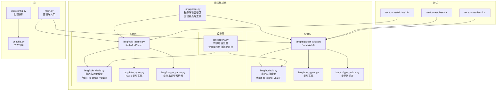
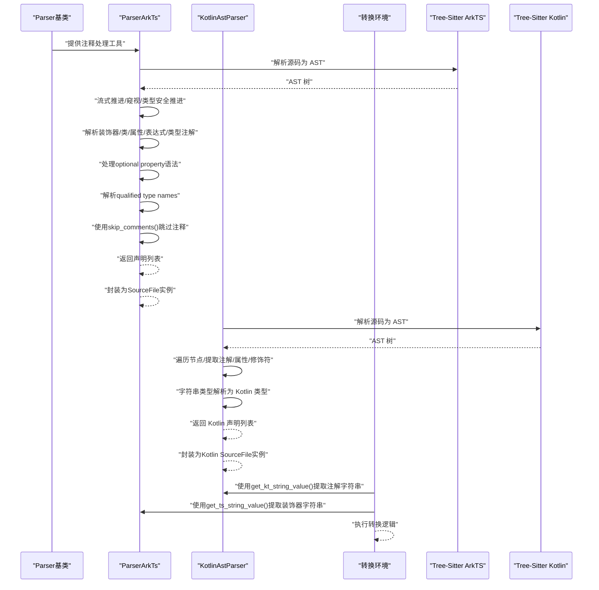
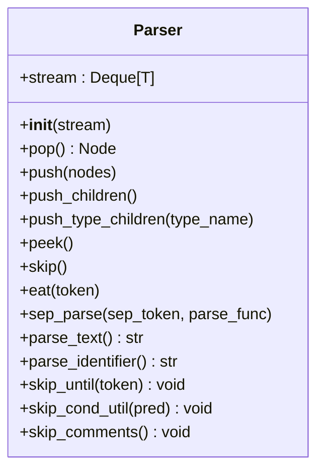
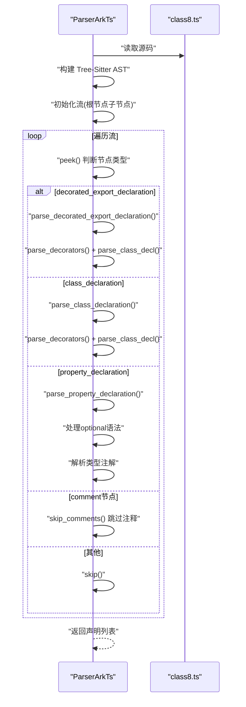
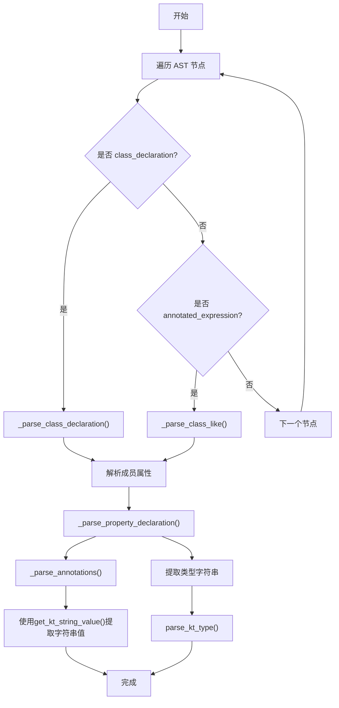
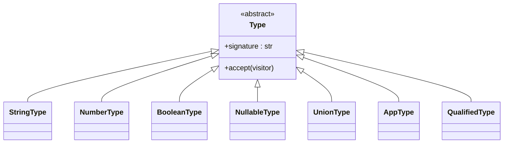
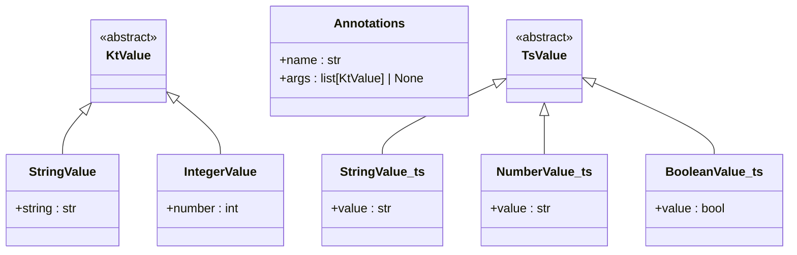
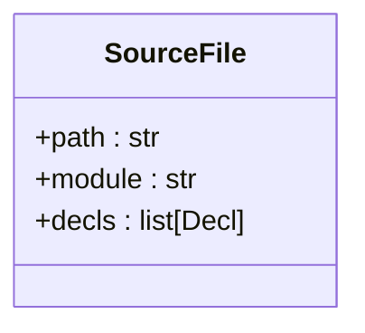
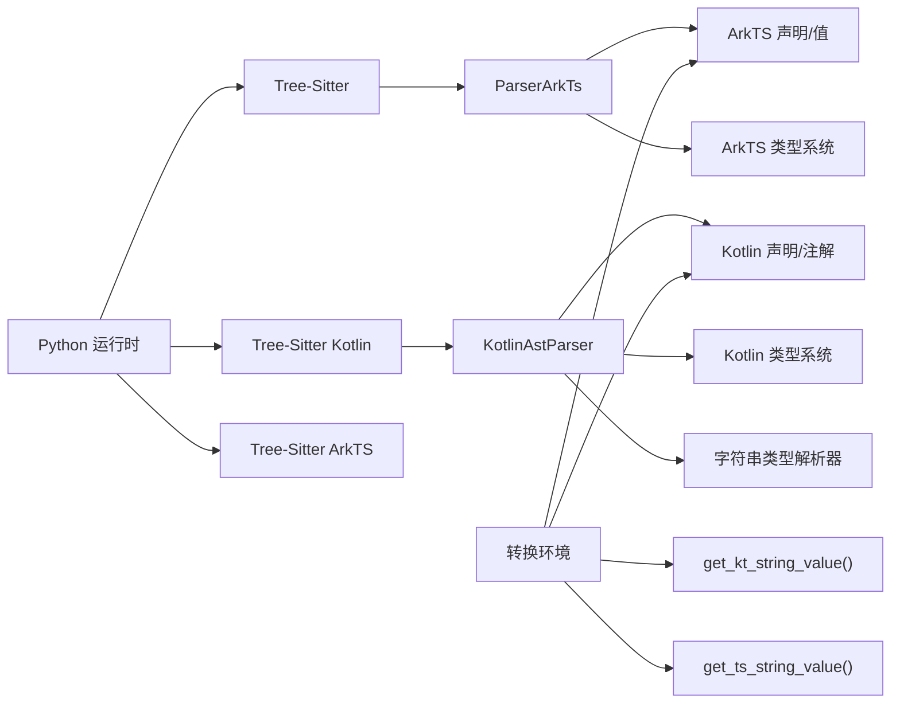

# 语言解析系统

<cite>
**本文档引用的文件**
- [lang/parser.py](file://lang/parser.py)
- [lang/ts/parser_arkts.py](file://lang/ts/parser_arkts.py)
- [lang/ts/decls.py](file://lang/ts/decls.py)
- [lang/ts/ts_types.py](file://lang/ts/ts_types.py)
- [lang/ts/type_visitor.py](file://lang/ts/type_visitor.py)
- [lang/kt/kt_parser.py](file://lang/kt/kt_parser.py)
- [lang/kt/kt_decls.py](file://lang/kt/kt_decls.py)
- [lang/kt/kt_types.py](file://lang/kt/kt_types.py)
- [lang/kt/type_parser.py](file://lang/kt/type_parser.py)
- [convert/env.py](file://convert/env.py)
- [pyproject.toml](file://pyproject.toml)
- [test/cases/class8.ts](file://test/cases/class8.ts)
- [test/cases/class7.ts](file://test/cases/class7.ts)
- [test/cases/kt/class2.kt](file://test/cases/kt/class2.kt)
- [utils/config.py](file://utils/config.py)
- [utils/file.py](file://utils/file.py)
- [main.py](file://main.py)
</cite>

## 更新摘要
**所做变更**
- 在抽象解析器基类中添加了 `skip_comments()` 工具函数，改进注释处理机制
- 新增了条件跳过工具函数 `skip_cond_util()` 和 `skip_until()`，提供更灵活的节点跳过能力
- 增强了流式解析器的注释过滤能力，支持自动跳过注释节点
- **新增** 优化Kotlin注解字符串值处理，新增`get_kt_string_value()`函数，提升注解解析的类型安全性
- **新增** 新增`get_ts_string_value()`函数，提供ArkTS装饰器字符串值的安全提取
- **更新** `convert/env.py`中使用新的字符串值提取函数，替代直接的类型检查

## 目录
1. [引言](#引言)
2. [项目结构](#项目结构)
3. [核心组件](#核心组件)
4. [架构总览](#架构总览)
5. [详细组件分析](#详细组件分析)
6. [依赖分析](#依赖分析)
7. [性能考虑](#性能考虑)
8. [故障排查指南](#故障排查指南)
9. [结论](#结论)
10. [附录](#附录)

## 引言
本文件面向"语言解析系统"的设计与实现，聚焦于抽象解析器基类的设计原则与通用模式，以及两类具体解析器：基于 Tree-Sitter 的 ArkTS 解析器与 Kotlin 解析器。文档将深入阐释：
- 抽象解析器基类的流式解析模型与节点操作方法，**新增** 包括注释处理工具函数
- ArkTS 解析器的装饰器解析机制、类型推断与声明类型处理，包括增强的optional property语法支持和qualified type names处理
- Kotlin 解析器的注解解析、类型系统映射与属性声明处理，**新增** 包含优化的注解字符串值处理机制
- 两类解析器之间的协作关系与数据流转过程
- **新增** 类型安全的字符串值提取函数，提升注解解析的可靠性
- 性能优化策略与扩展开发指南

**更新** 本版本反映了以下重要变更：
- 在抽象解析器基类中新增 `skip_comments()` 工具函数，提供专门的注释跳过功能
- 新增 `skip_cond_util()` 和 `skip_until()` 方法，增强条件跳过和注释处理能力
- parse_arkts_file函数现在返回完整的SourceFile实例，而非简单的声明列表
- ArkTS解析器增强了optional property语法支持（字段名后的?符号）
- 新增了qualified type names（限定类型名）解析功能
- **新增** 优化Kotlin注解字符串值处理，新增`get_kt_string_value()`函数，提供类型安全的字符串提取
- **新增** 新增`get_ts_string_value()`函数，提供ArkTS装饰器字符串值的安全提取
- **更新** `convert/env.py`中使用新的字符串值提取函数，提升代码的类型安全性

## 项目结构
仓库采用按语言分层的模块化组织方式，核心目录如下：
- lang/parser.py：抽象解析器基类，提供统一的流式解析接口和注释处理工具
- lang/ts/*：ArkTS 解析器与类型系统，包含增强的optional property和qualified type names支持
- lang/kt/*：Kotlin 解析器与类型系统，**新增** 包含优化的注解字符串值处理
- convert/env.py：转换环境管理，**更新** 使用新的字符串值提取函数
- test/cases/*：ArkTS 与 Kotlin 的示例源码
- utils/*：配置解析与文件扫描工具

**图表来源**
- [lang/parser.py](file://lang/parser.py#L8-L84)
- [lang/ts/parser_arkts.py](file://lang/ts/parser_arkts.py#L10-L18)
- [lang/ts/decls.py](file://lang/ts/decls.py#L60-L64)
- [lang/kt/kt_parser.py](file://lang/kt/kt_parser.py#L230-L260)
- [lang/kt/kt_decls.py](file://lang/kt/kt_decls.py#L59-L63)
- [convert/env.py](file://convert/env.py#L64-L66)
- [utils/config.py](file://utils/config.py#L45-L84)
- [utils/file.py](file://utils/file.py#L7-L32)
- [main.py](file://main.py#L34-L39)

## 核心组件
- 抽象解析器基类 Parser：提供基于双端队列的流式解析能力，支持弹出、推入、窥视、跳过、按类型安全推进等操作；**新增** 包含注释处理工具函数，为子类提供统一的节点流管理、错误提示和注释过滤能力。
- ArkTS 解析器 ParserArkTs：基于 Tree-Sitter ArkTS 语言，解析装饰器、类声明、属性声明、表达式与类型注解，产出 ArkTS 声明与类型对象。**更新** 现在支持optional property语法（字段名后的?符号）和qualified type names解析。
- Kotlin 解析器 KotlinAstParser：基于 Tree-Sitter Kotlin 语言，解析注解、修饰符、属性声明与类体成员，使用字符串类型解析器生成 Kotlin 类型对象。**更新** 现在使用优化的注解字符串值处理机制。
- 类型系统：ArkTS 与 Kotlin 各自定义了类型体系与访问者，用于表示基础类型、泛型应用、可空类型、限定类型等，并提供类型判定与归一化辅助函数。
- **新增** SourceFile类：作为解析结果的容器，包含文件路径、模块信息和声明列表，提供统一的数据结构以便后续处理。
- **新增** 字符串值提取函数：`get_kt_string_value()`和`get_ts_string_value()`提供类型安全的字符串值提取，避免重复的类型检查代码。

**章节来源**
- [lang/parser.py](file://lang/parser.py#L8-L84)
- [lang/ts/parser_arkts.py](file://lang/ts/parser_arkts.py#L10-L18)
- [lang/ts/decls.py](file://lang/ts/decls.py#L60-L64)
- [lang/kt/kt_parser.py](file://lang/kt/kt_parser.py#L230-L260)
- [lang/kt/kt_decls.py](file://lang/kt/kt_decls.py#L59-L63)

## 架构总览
系统以"抽象解析器 + 语言特定解析器 + 类型系统"为核心，通过 Tree-Sitter 生成 AST，再由解析器将 AST 节点转换为领域模型（声明、类型、注解/装饰器）。ArkTS 与 Kotlin 的解析器共享抽象基类的流式操作语义，但各自实现不同的语法解析逻辑与类型建模。**更新** 现在ArkTS解析器返回完整的SourceFile实例，包含文件元数据和声明列表。**新增** 字符串值提取函数提供了统一的类型安全字符串访问接口。

**图表来源**
- [lang/parser.py](file://lang/parser.py#L83-L84)
- [lang/ts/parser_arkts.py](file://lang/ts/parser_arkts.py#L10-L18)
- [lang/kt/kt_parser.py](file://lang/kt/kt_parser.py#L230-L260)
- [lang/kt/kt_decls.py](file://lang/kt/kt_decls.py#L59-L63)
- [lang/ts/decls.py](file://lang/ts/decls.py#L41-L45)

## 详细组件分析

### 抽象解析器基类 Parser 设计
- 流式接口：提供 pop/push/peek/skip/eat/sep_parse 等方法，统一处理节点流；push_children 与 push_type_children 提供按类型安全推进的能力。
- **新增** 注释处理工具：`skip_comments()` 方法专门用于跳过注释节点，`skip_cond_util()` 提供条件跳过功能，`skip_until()` 支持跳过直到指定节点类型。
- 错误处理：在类型不匹配或符号不匹配时抛出语法错误，便于定位解析异常。
- 扩展性：子类仅需构建初始节点流（如根节点子节点），即可复用通用的推进与窥视逻辑。

**图表来源**
- [lang/parser.py](file://lang/parser.py#L8-L84)

**章节来源**
- [lang/parser.py](file://lang/parser.py#L8-L84)

### ArkTS 解析器（ParserArkTs）增强功能
- 初始化与树构建：使用 Tree-Sitter ArkTS 语言加载器与解析器，将源码解析为 Tree，再将根节点子节点放入流中。
- 装饰器解析：识别装饰器节点，支持带参数的装饰器调用，参数表达式解析为 ArkTS 值对象。
- **增强** optional property语法支持：在属性声明解析过程中，识别字段名后的?符号，将其转换为可空类型（NullableType）。
- **新增** qualified type names处理：支持解析限定类型名（如collections.Array），通过QualifiedType表示，包含限定符列表和基础类型。
- **新增** 注释处理优化：利用 `skip_comments()` 方法自动跳过注释节点，提高解析效率和准确性。
- 类与属性声明：解析 class 声明与属性声明，属性类型通过 type_annotation 递归解析为类型对象。
- 表达式解析：支持字符串字面量、数值字面量、布尔字面量与对象字面量，参数逗号分隔解析。
- 类型系统集成：类型解析覆盖基础类型、联合类型、泛型应用、限定类型等，配合类型访问者进行后续处理。

**图表来源**
- [lang/ts/parser_arkts.py](file://lang/ts/parser_arkts.py#L267-L283)
- [lang/parser.py](file://lang/parser.py#L83-L84)

**更新** 关键增强点：
- optional property语法：在`parse_property_declaration`方法中，当遇到'?'符号时，将属性类型包装为`NullableType`
- qualified type names：在`parse_type`方法中新增'qualified_type'分支，支持解析限定类型名
- 注释处理：新增`skip_comments()`方法，专门处理注释节点跳过逻辑

**章节来源**
- [lang/ts/parser_arkts.py](file://lang/ts/parser_arkts.py#L10-L18)
- [lang/ts/decls.py](file://lang/ts/decls.py#L60-L64)
- [lang/ts/ts_types.py](file://lang/ts/ts_types.py#L1-L281)
- [lang/ts/type_visitor.py](file://lang/ts/type_visitor.py#L1-L32)
- [test/cases/class8.ts](file://test/cases/class8.ts#L1-L13)
- [test/cases/class7.ts](file://test/cases/class7.ts#L1-L216)

### Kotlin 解析器（KotlinAstParser）
- 注解解析：从修饰符中提取注解节点，构造 Annotations 对象；支持无参与带参注解，参数字符串字面量解析为 KtValue。**更新** 现在使用优化的注解字符串值处理机制。
- 属性声明：解析 val/var 修饰符、变量名与类型；类型通过字符串类型解析器转换为 Kotlin 类型对象。
- 类声明：收集类名、注解与成员（属性），兼容 expect/actual 的包装节点。
- 字符串类型解析：词法分析后递归下降解析限定类型、泛型应用与后缀可空/数组标记，生成 Kotlin 类型对象。

**图表来源**
- [lang/kt/kt_parser.py](file://lang/kt/kt_parser.py#L239-L260)
- [lang/kt/kt_parser.py](file://lang/kt/kt_parser.py#L102-L135)
- [lang/kt/type_parser.py](file://lang/kt/type_parser.py#L92-L151)
- [lang/kt/kt_decls.py](file://lang/kt/kt_decls.py#L59-L63)

**章节来源**
- [lang/kt/kt_parser.py](file://lang/kt/kt_parser.py#L1-L284)
- [lang/kt/kt_decls.py](file://lang/kt/kt_decls.py#L1-L51)
- [lang/kt/kt_types.py](file://lang/kt/kt_types.py#L1-L191)
- [lang/kt/type_parser.py](file://lang/kt/type_parser.py#L1-L152)
- [test/cases/kt/class2.kt](file://test/cases/kt/class2.kt#L1-L22)

### 类型系统与访问者模式
- ArkTS 类型系统：定义基础类型、可空类型、联合类型、泛型应用、限定类型等，提供类型签名与访问者接口，便于后续转换与判定。
- Kotlin 类型系统：定义基础类型、可空类型、数组类型、泛型应用、限定类型等，提供类型判定与名称提取工具函数。
- 访问者：ArkTS 提供类型访问者接口，便于对不同类型的类型对象执行差异化处理。

**图表来源**
- [lang/ts/ts_types.py](file://lang/ts/ts_types.py#L8-L281)

**章节来源**
- [lang/ts/ts_types.py](file://lang/ts/ts_types.py#L1-L281)
- [lang/kt/kt_types.py](file://lang/kt/kt_types.py#L1-L191)
- [lang/ts/type_visitor.py](file://lang/ts/type_visitor.py#L1-L32)

### **新增** 字符串值提取函数设计
- **新增** `get_kt_string_value()`函数：从Kotlin解析的注解值中提取字符串，提供类型安全的字符串访问
- **新增** `get_ts_string_value()`函数：从ArkTS解析的装饰器值中提取字符串，提供类型安全的字符串访问
- 类型安全：两个函数都包含类型检查，确保传入的参数是相应的字符串值类型，否则抛出TypeError异常
- 统一接口：提供一致的字符串值提取接口，简化上层代码的类型检查逻辑

**图表来源**
- [lang/kt/kt_decls.py](file://lang/kt/kt_decls.py#L20-L37)
- [lang/ts/decls.py](file://lang/ts/decls.py#L9-L35)

**章节来源**
- [lang/kt/kt_decls.py](file://lang/kt/kt_decls.py#L59-L63)
- [lang/ts/decls.py](file://lang/ts/decls.py#L41-L45)

### **新增** 转换环境中的字符串值提取使用
- **更新** `convert/env.py`中使用新的字符串值提取函数，替代直接的类型检查代码
- 提升代码可读性和类型安全性：使用`get_kt_string_value()`和`get_ts_string_value()`函数
- 减少重复代码：统一的字符串值提取逻辑，避免在多个地方重复编写类型检查代码

**章节来源**
- [convert/env.py](file://convert/env.py#L64-L66)
- [convert/env.py](file://convert/env.py#L176-L178)
- [convert/env.py](file://convert/env.py#L197-L199)

### **新增** SourceFile类设计
- **更新** 作为解析结果的统一容器，包含文件路径、模块信息和声明列表
- 提供结构化的数据格式，便于后续处理和转换
- 与Kotlin解析器的SourceFile结构类似，但字段名称略有差异

**图表来源**
- [lang/ts/decls.py](file://lang/ts/decls.py#L75-L79)

**章节来源**
- [lang/ts/decls.py](file://lang/ts/decls.py#L75-L79)
- [lang/kt/kt_decls.py](file://lang/kt/kt_decls.py#L14-L18)

## 依赖分析
- 外部依赖：通过 Poetry 管理，包含 Python 运行时、typing-extensions 与 Tree-Sitter 及其 ArkTS/Kotlin 语言绑定。
- 内部依赖：ArkTS/Kotlin 解析器均继承自抽象解析器基类，ArkTS 解析器依赖声明与类型模块，Kotlin 解析器依赖注解与类型模块及字符串类型解析器。**新增** 转换环境依赖字符串值提取函数。

**图表来源**
- [pyproject.toml](file://pyproject.toml#L15-L21)
- [lang/ts/parser_arkts.py](file://lang/ts/parser_arkts.py#L1-L10)
- [lang/kt/kt_parser.py](file://lang/kt/kt_parser.py#L1-L19)
- [convert/env.py](file://convert/env.py#L1-L10)

**章节来源**
- [pyproject.toml](file://pyproject.toml#L1-L26)

## 性能考虑
- AST 遍历顺序：Kotlin 解析器采用深度优先遍历收集类定义，避免重复扫描；建议在大规模源码场景下保持线性时间复杂度。
- 类型解析路径：ArkTS 类型解析采用分层递归，优先匹配基础类型与联合类型，减少回溯；**更新** qualified type names解析增加了额外的类型解析开销，但提供了更精确的类型信息。
- **新增** optional property处理：在属性解析时增加可空类型包装，性能影响较小，但提高了类型安全性。
- **新增** 注释处理优化：`skip_comments()` 方法提供高效的注释节点跳过功能，减少不必要的节点处理，提升整体解析性能。
- 流式解析：Parser 的 push/push_type_children 与 sep_parse 提供高效的节点推进与分隔解析，避免频繁拷贝与重建流。
- I/O 与文件扫描：工具模块提供按扩展名递归扫描，建议在批量处理时结合多进程或异步 I/O 以提升吞吐。
- **更新** SourceFile封装：将声明列表封装为SourceFile实例，提供了更好的数据组织结构，但增加了轻微的对象创建开销。
- **新增** 字符串值提取优化：`get_kt_string_value()`和`get_ts_string_value()`函数提供了统一的类型检查逻辑，减少了重复代码，提升了代码的可维护性。

## 故障排查指南
- 装饰器/注解缺失：ArkTS 装饰器必须以 @ 开头且可带参数；Kotlin 注解位于修饰符中。若解析失败，检查源码中装饰器/注解语法是否符合 Tree-Sitter 语法。
- **更新** optional property语法：确保'?'符号紧随字段名，且类型注解正确。如果出现解析错误，请检查字段声明语法。
- **新增** qualified type names解析：限定类型名应该使用点号分隔的完整限定符，如'collections.Array'。如果解析失败，请检查限定符的正确性和类型名称的有效性。
- **新增** 注释处理问题：如果注释导致解析异常，检查是否正确使用了 `skip_comments()` 方法。注释节点应该被自动跳过，不应影响解析流程。
- 类型解析异常：ArkTS 类型注解可能包含联合类型、泛型应用与限定类型；Kotlin 类型字符串需满足限定类型、泛型与后缀可空/数组规则。若报错，核对类型字符串与解析器支持范围。
- 节点类型不匹配：Parser 的 push_type_children 会在类型不匹配时抛出语法错误。请确认当前节点类型与预期一致。
- **更新** SourceFile返回值：现在parse_arkts_file函数返回SourceFile实例，而不是简单的声明列表。在使用时需要访问`.decls`属性获取声明列表。
- 文件路径问题：示例脚本中硬编码了测试文件路径，实际使用时应确保路径正确或通过配置工具动态获取。
- **新增** 字符串值提取异常：如果使用`get_kt_string_value()`或`get_ts_string_value()`函数时抛出TypeError异常，检查传入的参数类型是否为相应的字符串值类型。
- **新增** 转换环境问题：在`convert/env.py`中使用字符串值提取函数时，确保注解参数确实包含字符串值，避免类型不匹配的异常。

**章节来源**
- [lang/ts/parser_arkts.py](file://lang/ts/parser_arkts.py#L96-L112)
- [lang/kt/kt_parser.py](file://lang/kt/kt_parser.py#L93-L99)
- [lang/parser.py](file://lang/parser.py#L30-L35)
- [lang/ts/parser_arkts.py](file://lang/ts/parser_arkts.py#L285-L291)
- [lang/kt/kt_decls.py](file://lang/kt/kt_decls.py#L59-L63)
- [lang/ts/decls.py](file://lang/ts/decls.py#L41-L45)

## 结论
该语言解析系统以抽象解析器基类为核心，统一了两类语言解析器的流式推进与节点操作语义；ArkTS 解析器侧重装饰器与类型注解的解析，**更新** 现已增强optional property语法支持和qualified type names处理；Kotlin 解析器侧重注解与属性声明的解析，并通过字符串类型解析器桥接 Kotlin 的类型系统。**更新** 现在ArkTS解析器返回完整的SourceFile实例，提供了更好的数据结构组织。**新增** 注释处理工具函数进一步提升了系统的健壮性和性能。**新增** 字符串值提取函数提供了类型安全的字符串访问接口，提升了代码的可维护性和可靠性。系统具备良好的扩展性与可维护性，适合进一步拓展到更多语言与更复杂的类型系统。

## 附录

### 示例：ArkTS 装饰器与属性解析流程增强
- 源码示例：class8.ts 包含 ExportClass 与 ExportField 装饰器，以及联合类型的属性声明。**更新** 包含optional property语法（field1?: string | number | boolean）。
- 解析步骤：ParserArkTs 读取源码 → 构建 AST → 初始化流 → 遍历节点 → 解析装饰器与类声明 → 解析属性类型注解 → **新增** 处理optional语法 → **新增** 解析qualified type names → **新增** 使用skip_comments()跳过注释 → 返回声明列表 → **更新** 封装为SourceFile实例。

**章节来源**
- [test/cases/class8.ts](file://test/cases/class8.ts#L1-L13)
- [lang/ts/parser_arkts.py](file://lang/ts/parser_arkts.py#L267-L283)
- [lang/ts/parser_arkts.py](file://lang/ts/parser_arkts.py#L96-L112)
- [lang/ts/parser_arkts.py](file://lang/ts/parser_arkts.py#L71-L76)
- [lang/ts/decls.py](file://lang/ts/decls.py#L75-L79)

### 示例：Kotlin 注解与属性解析流程
- 源码示例：class2.kt 包含 ShareClass、ShareField 等注解，以及 kotlin.Int? 类型的属性。
- 解析步骤：KotlinAstParser 读取源码 → 构建 AST → 遍历节点 → 提取注解 → 解析属性修饰符与类型 → 字符串类型解析 → **新增** 使用get_kt_string_value()提取注解字符串值 → 返回声明列表 → 封装为Kotlin SourceFile实例。

**章节来源**
- [test/cases/kt/class2.kt](file://test/cases/kt/class2.kt#L1-L22)
- [lang/kt/kt_parser.py](file://lang/kt/kt_parser.py#L239-L260)
- [lang/kt/type_parser.py](file://lang/kt/type_parser.py#L92-L151)
- [lang/kt/kt_decls.py](file://lang/kt/kt_decls.py#L59-L63)

### 示例：字符串值提取函数使用
- **新增** ArkTS装饰器字符串值提取：使用`get_ts_string_value()`函数从装饰器参数中提取字符串值
- **新增** Kotlin注解字符串值提取：使用`get_kt_string_value()`函数从注解参数中提取字符串值
- **新增** 类型安全保证：两个函数都包含类型检查，确保传入的参数是相应的字符串值类型

**章节来源**
- [lang/ts/decls.py](file://lang/ts/decls.py#L41-L45)
- [lang/kt/kt_decls.py](file://lang/kt/kt_decls.py#L59-L63)
- [convert/env.py](file://convert/env.py#L64-L66)

### 工具：配置与文件扫描
- 配置解析：解析 JSON 配置中的公共输出目录、导入列表与包级 ArkTS 源码目录。
- 文件扫描：按扩展名递归扫描 ArkTS/TS 文件，返回绝对路径集合。

**章节来源**
- [utils/config.py](file://utils/config.py#L45-L84)
- [utils/file.py](file://utils/file.py#L7-L32)

### **新增** 主程序使用示例
- **更新** main.py展示了如何使用新的SourceFile返回值：parse_arkts_file返回SourceFile实例，需要通过`.decls`属性获取声明列表
- 支持批量处理ArkTS文件，将所有解析结果合并到一个列表中

**章节来源**
- [main.py](file://main.py#L34-L39)

### **新增** 注释处理工具函数使用指南
- `skip_comments()`：专门用于跳过注释节点，适用于需要忽略注释内容的解析场景
- `skip_cond_util()`：提供条件跳过功能，支持自定义跳过条件
- `skip_until()`：跳过直到遇到指定类型的节点，常用于跳过特定语法结构

**章节来源**
- [lang/parser.py](file://lang/parser.py#L71-L84)

### **新增** 字符串值提取函数使用指南
- **新增** `get_kt_string_value()`：从Kotlin注解值中提取字符串，提供类型安全的字符串访问
- **新增** `get_ts_string_value()`：从ArkTS装饰器值中提取字符串，提供类型安全的字符串访问
- **新增** 类型检查：两个函数都会检查传入参数的类型，确保是相应的字符串值类型
- **新增** 异常处理：如果传入的参数不是期望的类型，会抛出TypeError异常

**章节来源**
- [lang/kt/kt_decls.py](file://lang/kt/kt_decls.py#L59-L63)
- [lang/ts/decls.py](file://lang/ts/decls.py#L41-L45)