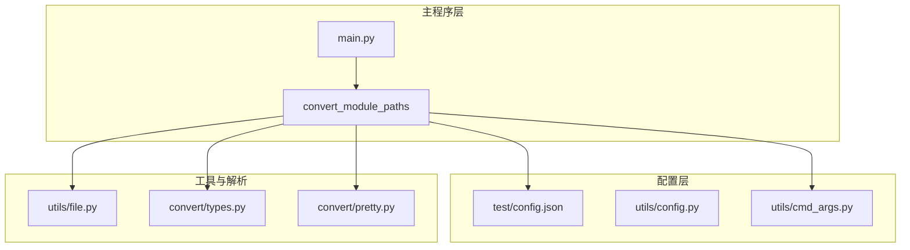
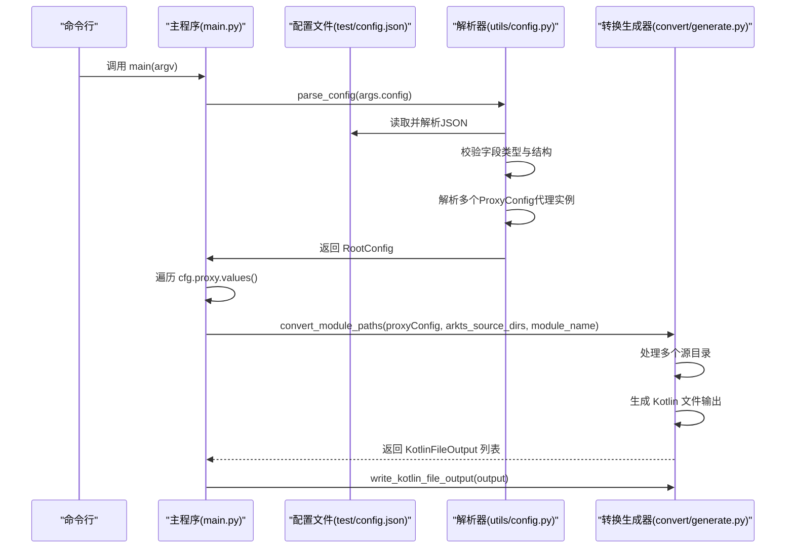
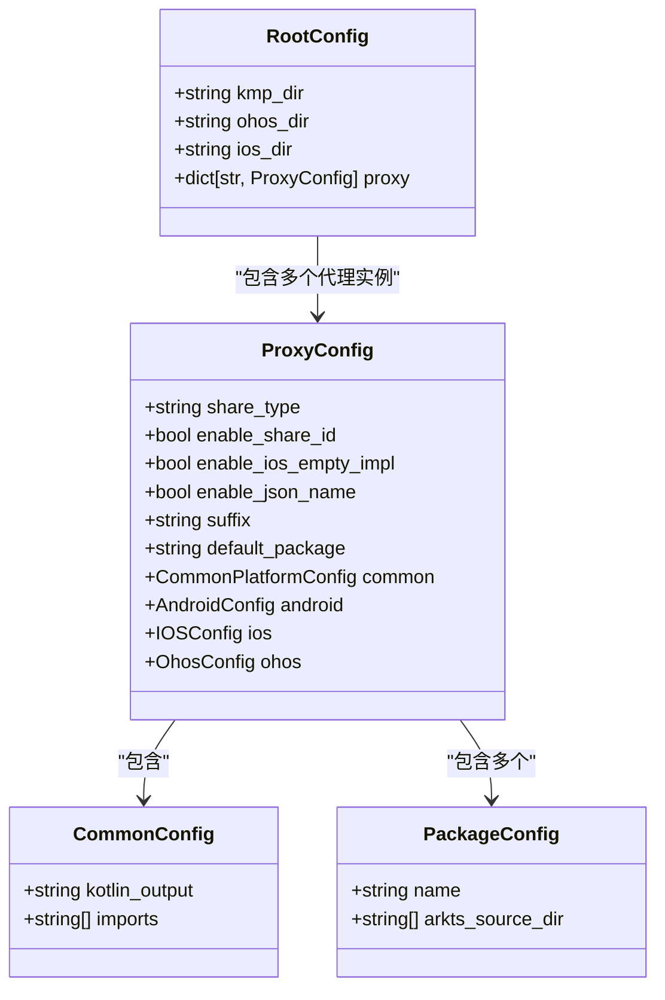
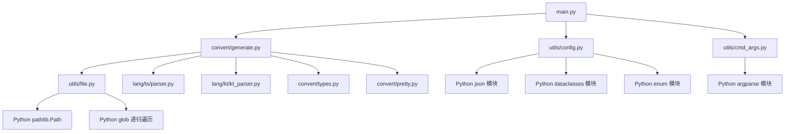

# 多包管理配置

<cite>
**本文档引用的文件**
- [main.py](file://main.py)
- [convert/generate.py](file://convert/generate.py)
- [utils/config.py](file://utils/config.py)
- [utils/cmd_args.py](file://utils/cmd_args.py)
- [utils/file.py](file://utils/file.py)
- [test/config.json](file://test/config.json)
- [convert/types.py](file://convert/types.py)
- [convert/pretty.py](file://convert/pretty.py)
</cite>

## 更新摘要
**变更内容**
- 新架构：通过ProxyConfig统一管理多个包的配置，支持平台特定的包映射
- 新增多代理配置支持，每个代理配置独立管理其包集合
- 增强平台特定配置：Android、iOS、OHOS平台的独立配置管理
- 更新主程序流程，支持循环处理多个代理配置及其包
- 完善多包项目的配置示例和最佳实践

## 目录
1. [简介](#简介)
2. [项目结构](#项目结构)
3. [核心组件](#核心组件)
4. [架构总览](#架构总览)
5. [详细组件分析](#详细组件分析)
6. [依赖关系分析](#依赖关系分析)
7. [性能考虑](#性能考虑)
8. [故障排除指南](#故障排除指南)
9. [结论](#结论)
10. [附录](#附录)

## 简介
本文件面向需要在多包环境中管理 ArkTS 源码目录与包级配置的开发者，系统性阐述如何通过新的ProxyConfig架构统一管理多个包的配置，支持平台特定的包映射。文档详细说明了如何在proxy配置中定义多个代理实例，每个代理实例包含独立的Android、iOS、OHOS平台配置和包集合，以及在复杂多包场景下的依赖关系处理与导入路径管理。新架构以仓库中的配置解析器与示例配置为基础，提供可操作的配置策略、最佳实践与调试技巧。

**更新** 新架构引入了ProxyConfig统一管理模式，通过代理配置隔离不同平台和业务场景的包管理需求，支持更复杂的多包项目配置。

## 项目结构
该项目采用模块化组织，核心与配置解析位于 utils 子目录，语言解析器位于 lang 子目录，转换生成逻辑位于 convert 子目录，测试样例位于 test 子目录。与多包配置直接相关的关键文件如下：
- 主程序入口：main.py
- 转换生成器：convert/generate.py
- 配置文件：test/config.json
- 配置解析器：utils/config.py
- 命令行参数解析：utils/cmd_args.py
- 文件收集工具：utils/file.py
- 类型转换器：convert/types.py
- 代码美化器：convert/pretty.py

**图表来源**
- [main.py](file://main.py#L12-L25)
- [convert/generate.py](file://convert/generate.py#L85-L146)
- [utils/config.py](file://utils/config.py#L66-L83)
- [utils/cmd_args.py](file://utils/cmd_args.py#L16-L62)
- [utils/file.py](file://utils/file.py#L7-L32)
- [convert/types.py](file://convert/types.py#L1-L67)
- [convert/pretty.py](file://convert/pretty.py#L4-L21)

**章节来源**
- [main.py](file://main.py#L1-L36)
- [convert/generate.py](file://convert/generate.py#L1-L146)
- [utils/config.py](file://utils/config.py#L1-L104)

## 核心组件
- 配置数据模型
  - RootConfig：顶层配置容器，包含通用配置与代理配置字典
  - ProxyConfig：代理配置容器，包含共享类型、平台配置和包列表
  - CommonConfig：通用配置，包含 Kotlin 输出目录与导入列表
  - PackageConfig：包级配置，包含包名与 ArkTS 源码目录数组
  - 平台配置：AndroidConfig、IOSConfig、OhosConfig分别管理各平台配置
- 转换生成器
  - convert_module_paths：核心转换函数，按代理配置处理多个 ArkTS 源目录
  - KotlinFileOutput：Kotlin 文件输出数据结构
  - write_kotlin_file_output：文件写入处理器
- 配置解析器
  - parse_config：从 JSON 解析配置，校验字段类型并构造数据模型
  - _parse_format：解析新格式配置文件，支持代理配置
  - main：命令行入口，打印解析结果用于验证
- 文件收集工具
  - get_files：递归收集指定扩展名的 ArkTS/TS 文件，支持文件或目录输入

**更新** 新架构引入了ProxyConfig作为核心配置容器，统一管理多个代理实例，每个代理实例包含独立的平台配置和包集合，实现了更精细的包管理控制。

**章节来源**
- [utils/config.py](file://utils/config.py#L9-L25)
- [utils/config.py](file://utils/config.py#L66-L83)
- [convert/generate.py](file://convert/generate.py#L45-L146)
- [utils/file.py](file://utils/file.py#L7-L32)

## 架构总览
下图展示了新的ProxyConfig架构与包管理的整体流程：配置文件被解析为RootConfig，其中包含多个ProxyConfig代理实例，每个代理实例管理其独立的平台配置和包集合，随后通过convert_module_paths函数按代理配置处理多个 ArkTS 源目录。

**图表来源**
- [main.py](file://main.py#L16-L23)
- [utils/config.py](file://utils/config.py#L130-L133)
- [convert/generate.py](file://convert/generate.py#L92-L162)

## 详细组件分析

### 配置数据模型与解析流程
- 数据模型
  - RootConfig(kmp_dir, ohos_dir, ios_dir, proxy)
  - ProxyConfig(share_type, enable_share_id, enable_ios_empty_impl, enable_json_name, suffix, default_package, common, android, ios, ohos)
  - CommonConfig(kotlin_output, imports)
  - PackageConfig(name, arkts_source_dir)
- 解析流程
  - 读取 JSON 并校验根对象为字典
  - 校验 kmp.dir、ohos.dir、ios.dir 等顶层字段
  - 解析 proxy 对象，为每个代理实例创建 ProxyConfig
  - 校验 shareType 字段必须为 "proxy" 或 "copy"
  - 解析各平台配置（common、android、ios、ohos）
  - 解析 ohos.packages，支持对象格式的包配置
  - 返回 RootConfig 实例

**图表来源**
- [utils/config.py](file://utils/config.py#L66-L71)
- [utils/config.py](file://utils/config.py#L53-L64)
- [utils/config.py](file://utils/config.py#L9-L25)

**章节来源**
- [utils/config.py](file://utils/config.py#L66-L71)
- [utils/config.py](file://utils/config.py#L124-L293)
- [utils/config.py](file://utils/config.py#L66-L83)

### 转换生成器与多包处理
- convert_module_paths 函数
  - 接收 ProxyConfig、包的源目录列表和模块名称
  - 从配置中获取项目路径和输出模式
  - 将相对路径转换为绝对路径，支持多个源目录
  - 递归收集所有 ArkTS 文件，包括 .ets 和 .ts 扩展名
  - 解析 Kotlin 源文件，建立环境映射
  - 根据输出模式生成单文件或项目结构的 Kotlin 代码
- KotlinFileOutput 数据结构
  - 包含输出路径、包名、导入语句和声明节点
  - 支持单文件模式和项目模式两种输出格式

**更新** 新架构下，convert_module_paths 函数接收 ProxyConfig 作为第一个参数，能够直接访问代理配置中的平台特定设置，实现了更精细的包管理控制。

**章节来源**
- [convert/generate.py](file://convert/generate.py#L92-L162)
- [convert/generate.py](file://convert/generate.py#L45-L63)

### 代理配置结构与命名规则
- proxy 字段为键值对集合，每个键代表一个代理实例名称
- 代理实例名称建议遵循以下规则：
  - 使用稳定且唯一的标识符，避免特殊字符
  - 在多代理场景中保持一致性，便于区分不同平台或业务场景
  - 支持使用描述性名称，如 "har_demo_example1"、"business_module_v2"
- 每个代理实例包含：
  - shareType：共享类型，必须为 "proxy" 或 "copy"
  - enableShareId：启用共享ID标志
  - enableIosEmptyImpl：启用iOS空实现标志
  - enableJsonName：启用JSON名称标志
  - suffix：后缀，默认为 "Proxy"
  - defaultPackage：默认包名
  - 平台配置：common、android、ios、ohos 各自独立配置

**更新** 新增了代理配置的概念，每个代理实例可以独立管理其平台配置和包集合，支持不同的共享策略和平台特定设置。

**章节来源**
- [test/config.json](file://test/config.json#L5-L41)
- [utils/config.py](file://utils/config.py#L133-L144)

### 平台特定配置与包映射
- 平台配置结构
  - AndroidConfig：包含 Android 平台的源码目录配置
  - IOSConfig：包含 iOS 平台的通用配置
  - OhosConfig：包含 OHOS 平台的通用配置和包列表
- 包映射机制
  - 每个代理实例独立管理其包集合
  - 支持对象格式的包配置：{"包名": {"arktsSrcDir": [...]} }
  - 支持命名空间包名（如 "@kmp/basic_ability"）
  - 包名与源码目录的映射关系由代理实例维护
- 平台特定设置
  - shareType 控制包的共享策略
  - enableShareId 控制共享ID的生成
  - enableIosEmptyImpl 控制iOS空实现的生成
  - enableJsonName 控制JSON名称的处理

**更新** 新架构引入了平台特定配置，每个代理实例可以独立配置不同平台的包映射和处理策略，支持复杂的多平台多包管理场景。

**章节来源**
- [test/config.json](file://test/config.json#L23-L33)
- [utils/config.py](file://utils/config.py#L242-L278)

### ArkTS 源码目录配置与多目录支持机制
- arktsSrcDir 数组的每个元素代表一个源码目录
- 多目录支持意味着可以将同一包的源码分布在不同位置，便于模块化与复用
- 在实际使用中，可通过文件收集工具递归扫描这些目录，提取 ArkTS/TS 文件进行进一步处理
- 支持多种文件扩展名：.ets 和 .ts
- 目录路径相对于 ohos_dir 配置进行解析

**更新** 新架构下，源码目录配置更加灵活，每个代理实例可以独立配置其包的源码目录，支持复杂的目录组织结构。

**章节来源**
- [test/config.json](file://test/config.json#L29-L32)
- [utils/file.py](file://utils/file.py#L7-L32)
- [convert/generate.py](file://convert/generate.py#L96-L102)

### 包间依赖关系与导入路径管理
- 依赖关系通常通过包名与导入路径共同体现
- 在新的代理配置架构中，包依赖关系在代理实例级别进行管理
- 每个代理实例维护其独立的包集合和导入路径
- 建议：
  - 将公共依赖统一维护在 common.import 中，减少重复配置
  - 包名与导入路径前缀保持一致，便于定位与排查
  - 在多代理场景中，优先使用代理实例到包的映射，避免硬编码路径
  - 不同代理实例之间可以配置不同的导入策略
- 转换过程中自动处理类导入依赖，确保生成的 Kotlin 代码具有正确的导入语句

**更新** 新架构下，包间依赖关系在代理实例级别进行管理，每个代理实例可以独立配置其包的依赖关系和导入策略。

**章节来源**
- [test/config.json](file://test/config.json#L24-L27)
- [test/config.json](file://test/config.json#L28-L33)
- [convert/generate.py](file://convert/generate.py#L121-L162)

### 复杂多包场景配置示例与最佳实践
- 示例结构
  - proxy 下定义多个代理实例，每个代理实例拥有独立的平台配置和包集合
  - 支持命名空间包名（如 "@kmp/basic_ability"）
  - common.import 统一声明常用导入项
  - 不同代理实例可以配置不同的共享策略和平台特定设置
- 最佳实践
  - 为每个代理实例分配明确的职责边界，如业务模块、基础能力等
  - 合理拆分 arktsSrcDir，按功能域或模块划分目录
  - 使用稳定的代理实例名称，避免频繁变更导致的配置混乱
  - 在 CI 中加入配置校验步骤，确保字段类型与结构正确
  - 利用代理实例的独立配置能力，为不同平台提供定制化的包管理方案
  - 根据业务需求选择合适的 shareType（"proxy" 或 "copy"）

**更新** 新架构支持更复杂的多包场景，每个代理实例可以独立配置其平台特定的包管理策略，适用于大型多平台项目。

**章节来源**
- [test/config.json](file://test/config.json#L5-L41)
- [convert/generate.py](file://convert/generate.py#L92-L162)

### 调试技巧
- 使用命令行入口验证配置
  - 运行解析器主函数，输出 kmp_dir、ohos_dir、ios_dir 与各代理实例的配置
  - 检查代理实例的数量和名称是否正确
  - 验证各平台配置和包集合的解析结果
- 常见问题定位
  - 字段类型错误：shareType 应为 "proxy" 或 "copy"；kotlinOut 应为字符串；import 应为字符串数组；arktsSrcDir 应为字符串数组
  - 结构缺失：proxy 或 ohos.packages 缺失会导致解析失败
  - 路径无效：ArkTS 文件收集阶段若路径不存在会抛出异常
  - 代理实例处理错误：检查代理实例的遍历和包处理逻辑
- 转换过程调试
  - 监控输出模式选择（SingleFile vs Project）
  - 检查代理实例级别的包处理是否正确
  - 验证类导入依赖是否正确生成
  - 验证 Kotlin 文件输出路径是否符合预期

**更新** 新架构下增加了代理实例级别的调试技巧，包括代理实例遍历和平台特定配置的验证。

**章节来源**
- [utils/config.py](file://utils/config.py#L320-L358)
- [utils/file.py](file://utils/file.py#L23-L24)
- [convert/generate.py](file://convert/generate.py#L112-L162)

## 依赖关系分析
- 配置解析依赖
  - JSON 解析与字段校验：依赖 Python 内置 json 与类型检查函数
  - 数据模型：依赖 dataclasses 提供的冻结数据类
  - 代理配置：依赖枚举类型 OutputMode 和嵌套的数据类结构
- 转换生成器依赖
  - 文件收集：依赖 pathlib.Path 与 utils.file.get_files
  - 语言解析：依赖 lang.ts.parser 和 lang.kt.kt_parser
  - 类型转换：依赖 convert.types.to_default_kt_type
  - 代码美化：依赖 convert.pretty.pretty_print_kt_node
- 工具依赖
  - 文件收集：依赖 pathlib.Path 与 glob 递归遍历
- 命令行参数解析
  - 参数验证：确保配置文件存在且为有效文件

**更新** 新架构下，转换生成器依赖于 ProxyConfig 的平台特定配置，能够根据代理实例的不同设置进行相应的包处理。

**图表来源**
- [main.py](file://main.py#L1-L36)
- [convert/generate.py](file://convert/generate.py#L1-L18)
- [utils/config.py](file://utils/config.py#L1-L104)
- [utils/file.py](file://utils/file.py#L1-L32)
- [utils/cmd_args.py](file://utils/cmd_args.py#L1-L49)

**章节来源**
- [main.py](file://main.py#L1-L36)
- [convert/generate.py](file://convert/generate.py#L1-L162)
- [utils/config.py](file://utils/config.py#L1-L367)
- [utils/file.py](file://utils/file.py#L1-L32)
- [utils/cmd_args.py](file://utils/cmd_args.py#L1-L49)

## 性能考虑
- 配置解析
  - JSON 解析与字段校验的时间复杂度近似 O(n)，n 为配置项数量
  - 多代理场景下，代理实例数量增加会线性增加解析时间
  - 代理实例的嵌套配置解析增加了额外的计算开销
- 转换生成器性能
  - 多代理处理：需要遍历所有代理实例和包，时间复杂度与代理实例数和包数成正比
  - 多目录处理：convert_module_paths 需要遍历所有源目录，时间复杂度与文件总数成正比
  - 文件收集优化：通过扩展名过滤减少不必要的文件扫描
  - 内存使用：大量文件同时解析可能占用较多内存
- 文件收集
  - 递归遍历目录的时间复杂度与文件总数成正比
  - 可通过限制扩展名集合与合理划分目录层级降低开销
- 建议
  - 在大型项目中，合理规划代理实例数量，避免过度细分
  - 使用缓存策略避免重复扫描相同目录
  - 合理设置输出模式，单文件模式适合小项目，项目模式适合大型多包项目
  - 为不同代理实例配置合理的包集合，避免不必要的包处理

**更新** 新架构下，性能考虑增加了代理实例级别的处理开销，需要在代理实例数量和包集合规模之间找到平衡。

**章节来源**
- [convert/generate.py](file://convert/generate.py#L92-L162)
- [utils/file.py](file://utils/file.py#L7-L32)
- [utils/config.py](file://utils/config.py#L130-L133)

## 故障排除指南
- 字段类型错误
  - 现象：解析时报错，提示期望某类型但得到其他类型
  - 排查：确认 shareType、kotlinOut、import、arktsSrcDir 的类型是否符合要求
  - 特别注意：shareType 必须为 "proxy" 或 "copy"
- 结构缺失
  - 现象：解析失败或返回空值
  - 排查：确认 proxy 与 ohos.packages 是否存在且为对象
- 路径无效
  - 现象：文件收集阶段抛出文件未找到异常
  - 排查：确认 arktsSrcDir 中的路径存在且可访问
- 代理实例处理错误
  - 现象：代理实例遍历或包处理失败
  - 排查：检查代理实例的名称解析、包集合处理和转换过程
- 导入路径不匹配
  - 现象：生成的目标代码缺少必要的导入
  - 排查：核对 common.import 与包内声明的依赖是否一致
- 输出模式问题
  - 现象：生成的 Kotlin 文件路径不符合预期
  - 排查：检查 kotlinOut 配置和输出模式选择逻辑
- 平台配置错误
  - 现象：平台特定配置不生效
  - 排查：确认各平台配置的正确性和代理实例的平台映射

**更新** 新架构下增加了代理实例级别的故障排除指南，包括代理实例遍历、平台配置和包处理的调试方法。

**章节来源**
- [utils/config.py](file://utils/config.py#L141-L144)
- [utils/file.py](file://utils/file.py#L23-L24)
- [convert/generate.py](file://convert/generate.py#L112-L162)

## 结论
通过新的ProxyConfig架构，项目实现了对多包 ArkTS 源码目录的统一管理和灵活配置。新增的代理配置机制提供了真正的多平台多包项目支持，能够按代理实例处理多个 ArkTS 源目录，实现了复杂的多包依赖关系管理。合理的代理实例命名、清晰的平台配置与严格的字段校验，是保证多包项目可维护性的关键。结合本文提供的最佳实践与调试技巧，可在复杂多平台多包场景中高效地完成配置与开发工作。

**更新** 本版本文档重点突出了ProxyConfig架构带来的新特性，强调了统一管理多个包配置的能力，支持平台特定的包映射和多代理实例的精细化管理。

## 附录
- 相关文件路径参考
  - 主程序入口：main.py
  - 转换生成器：convert/generate.py
  - 配置文件：test/config.json
  - 配置解析器：utils/config.py
  - 命令行参数解析：utils/cmd_args.py
  - 文件收集工具：utils/file.py
  - 类型转换器：convert/types.py
  - 代码美化器：convert/pretty.py
- 新增功能特性
  - 代理配置管理：通过 ProxyConfig 实现统一管理
  - 多代理实例支持：每个代理实例独立管理包集合
  - 平台特定配置：Android、iOS、OHOS平台的独立配置
  - 命名空间包名支持：如 "@kmp/basic_ability"
  - 自动依赖处理：包间导入依赖的自动管理
  - 多目录源码支持：同一包内多个源目录的合并处理
  - 共享策略配置：支持 "proxy" 和 "copy" 两种共享模式