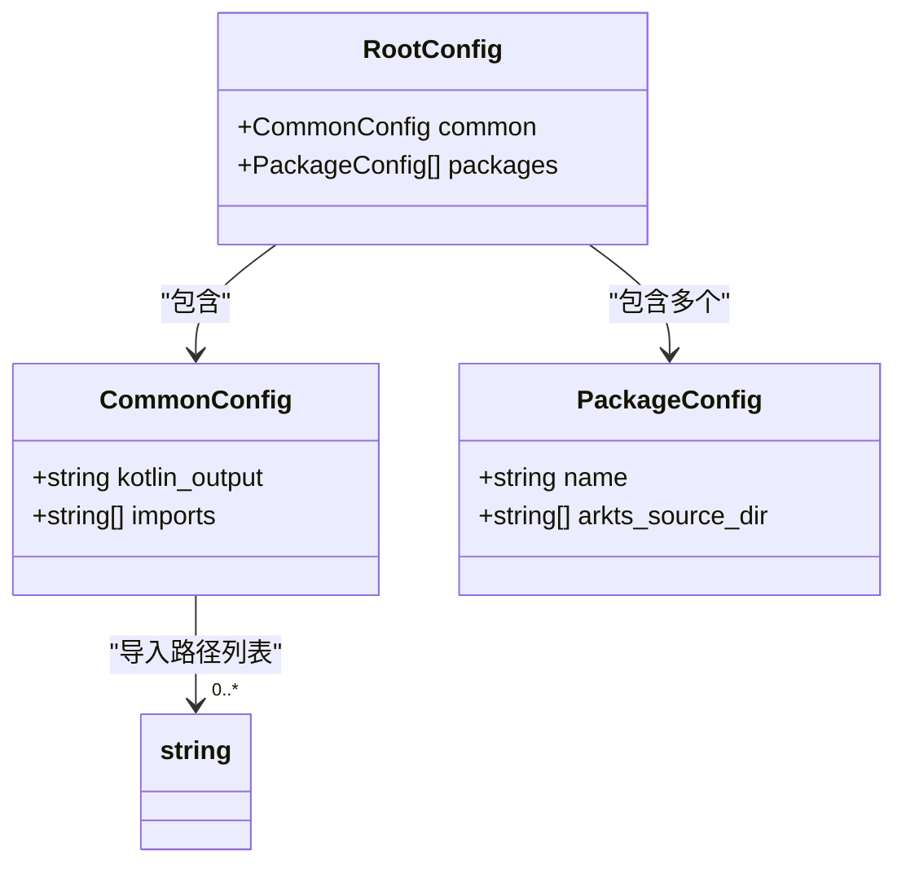
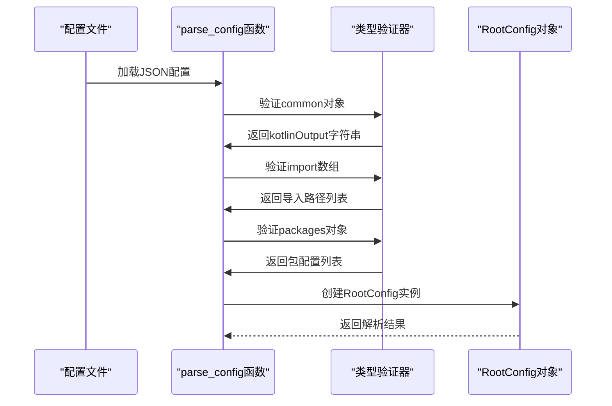
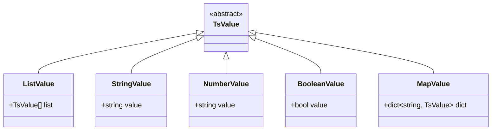
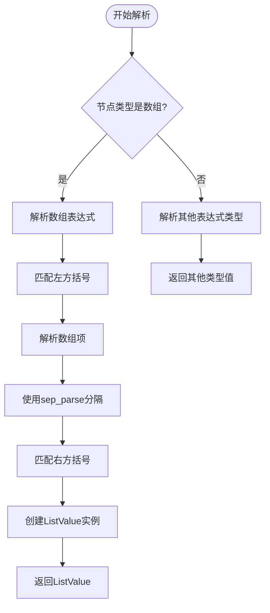
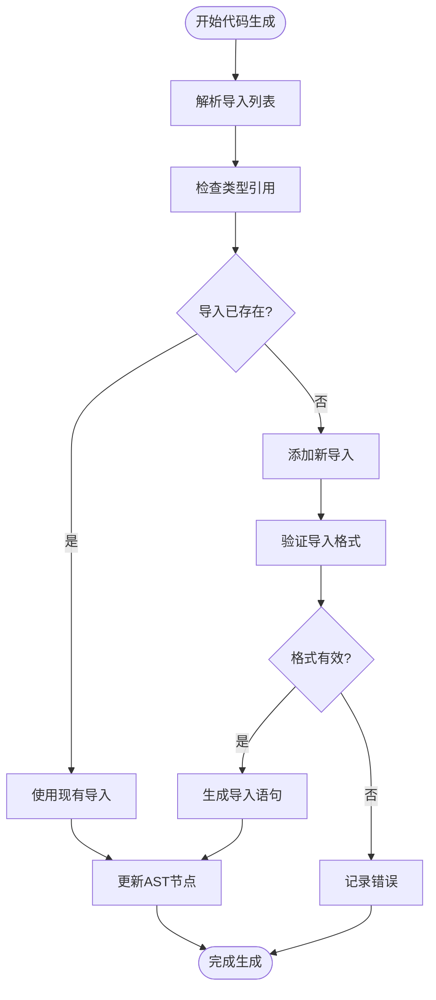
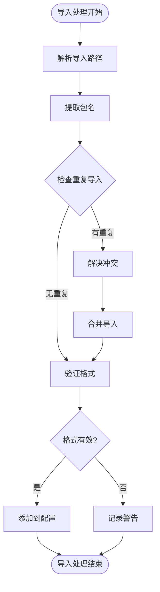

# 导入列表配置

<cite>
**本文档引用的文件**
- [utils/config.py](file://utils/config.py)
- [test/config.json](file://test/config.json)
- [pyproject.toml](file://pyproject.toml)
- [utils/file.py](file://utils/file.py)
- [lang/kt/kt_types.py](file://lang/kt/kt_types.py)
- [lang/ts/ts_types.py](file://lang/ts/ts_types.py)
- [lang/ts/decls.py](file://lang/ts/decls.py)
- [lang/ts/parser_ts.py](file://lang/ts/parser_ts.py)
- [convert/decorators.py](file://convert/decorators.py)
- [test/cases/class0.ts](file://test/cases/class0.ts)
- [test/cases/class8.ts](file://test/cases/class8.ts)
- [test/cases/class9.ts](file://test/cases/class9.ts)
- [test/cases/class12.ts](file://test/cases/class12.ts)
</cite>

## 更新摘要
**所做更改**
- 新增数组导入支持和ListValue类型说明
- 添加ExportClass装饰器custom_import参数的配置方法
- 更新导入路径格式要求和命名规范
- 增强导入列表对代码生成的影响说明
- 完善导入冲突处理方法和最佳实践
- 新增自定义导入功能增强说明

## 目录
1. [简介](#简介)
2. [项目结构](#项目结构)
3. [核心组件](#核心组件)
4. [架构概览](#架构概览)
5. [详细组件分析](#详细组件分析)
6. [依赖关系分析](#依赖关系分析)
7. [性能考虑](#性能考虑)
8. [故障排除指南](#故障排除指南)
9. [结论](#结论)
10. [附录](#附录)

## 简介

本文档详细说明了项目中导入列表配置的配置方法、使用场景和最佳实践。导入列表配置位于CommonConfig类的imports字段中，用于定义代码生成过程中需要导入的类型和模块。该配置直接影响生成的Kotlin代码的导入语句，确保生成的代码能够正确引用所需的类型和库。

**更新** 项目现已支持自定义导入系统增强，包括数组导入支持和ListValue类型，以及ExportClass装饰器的custom_import参数配置。新增的自定义导入功能通过装饰器参数解析实现，支持复杂的导入配置需求。

项目采用Python实现，通过JSON配置文件驱动代码生成流程。导入列表配置支持多种类型的导入路径格式，包括系统库、第三方库和自定义模块的完整限定名。

## 项目结构

项目采用模块化设计，主要包含以下核心目录：

```mermaid
graph TB
subgraph "配置层"
CFG[utils/config.py]
JSON[test/config.json]
END
subgraph "语言解析层"
TS_LANG[lang/ts/]
KT_LANG[lang/kt/]
END
subgraph "工具层"
FILE_UTILS[utils/file.py]
PYPROJECT[pyproject.toml]
END
subgraph "测试层"
TEST_CASES[test/cases/]
END
CFG --> JSON
CFG --> TS_LANG
CFG --> KT_LANG
FILE_UTILS --> CFG
TEST_CASES --> TS_LANG
```

**图表来源**
- [utils/config.py](file://utils/config.py#L1-L84)
- [test/config.json](file://test/config.json#L1-L27)

**章节来源**
- [utils/config.py](file://utils/config.py#L1-L84)
- [pyproject.toml](file://pyproject.toml#L1-L26)

## 核心组件

### CommonConfig类结构

CommonConfig是导入列表配置的核心数据结构，包含以下关键字段：



**图表来源**
- [utils/config.py](file://utils/config.py#L9-L25)

### 配置解析流程

配置解析过程遵循严格的验证和转换流程：



**图表来源**
- [utils/config.py](file://utils/config.py#L45-L61)

**章节来源**
- [utils/config.py](file://utils/config.py#L9-L61)

## 架构概览

导入列表配置在整个代码生成架构中扮演着关键角色：

```mermaid
graph TB
subgraph "配置输入层"
JSON_CONFIG[test/config.json]
CLI_ARGS[命令行参数]
END
subgraph "配置处理层"
CONFIG_PARSER[配置解析器]
VALIDATOR[类型验证器]
END
subgraph "代码生成层"
IMPORT_PROCESSOR[导入处理器]
CODE_GENERATOR[代码生成器]
OUTPUT_WRITER[输出写入器]
END
subgraph "类型系统层"
TS_TYPES[TypeScript类型系统]
KT_TYPES[Kotlin类型系统]
END
JSON_CONFIG --> CONFIG_PARSER
CLI_ARGS --> CONFIG_PARSER
CONFIG_PARSER --> VALIDATOR
VALIDATOR --> IMPORT_PROCESSOR
IMPORT_PROCESSOR --> CODE_GENERATOR
CODE_GENERATOR --> OUTPUT_WRITER
TS_TYPES --> CODE_GENERATOR
KT_TYPES --> CODE_GENERATOR
```

**图表来源**
- [utils/config.py](file://utils/config.py#L45-L61)
- [lang/ts/ts_types.py](file://lang/ts/ts_types.py#L1-L280)
- [lang/kt/kt_types.py](file://lang/kt/kt_types.py#L1-L191)

## 详细组件分析

### 导入路径格式要求

导入路径必须遵循以下格式规范：

#### 基本格式要求
- **完全限定名**: 必须使用完整的Java/Kotlin包名格式
- **点分隔符**: 使用英文点号进行层级分隔
- **通配符支持**: 支持星号(*)通配符导入整个包
- **长度限制**: 单个导入路径长度不超过255字符

#### 命名规范
- **包名**: 全部小写，使用点号分隔
- **类名**: 遵循驼峰命名法，首字母大写
- **接口名**: 遵循驼峰命名法，首字母大写
- **常量名**: 全部大写，单词间下划线分隔

### 数组导入支持和ListValue类型

**新增** 项目现已支持数组导入和ListValue类型，允许在装饰器参数中使用数组形式的导入配置。

#### ListValue类型支持
ListValue类提供了对数组表达式的解析和存储能力：



**图表来源**
- [lang/ts/decls.py](file://lang/ts/decls.py#L9-L35)

#### 数组导入配置示例
```json
{
  "common": {
    "kotlinOutput": "output/path",
    "import": [
      "kotlin.io.*",
      "kotlin.text.*",
      "java.util.*",
      "java.lang.*"
    ]
  }
}
```

### ExportClass装饰器的custom_import参数

**新增** ExportClass装饰器现支持custom_import参数，允许为特定类指定自定义导入路径。

#### custom_import参数配置
```typescript
@ExportClass({
  name: "ClassName0", 
  package: 'bd.dy', 
  custom_import: ["abc.def", "bcd.def"]
})
class Foo {
  a: number;
}
```

#### 装饰器参数解析
装饰器解析器支持多种参数类型，包括：
- 字符串值：`name: "ClassName0"`
- 数组值：`custom_import: ["abc.def", "bcd.def"]`
- 对象值：`{ name: "SendableParent", package: "com.abc.def" }`

#### 数组表达式解析机制
TypeScript解析器通过以下机制支持数组表达式：



**图表来源**
- [lang/ts/parser_ts.py](file://lang/ts/parser_ts.py#L66-L71)

**章节来源**
- [test/cases/class12.ts](file://test/cases/class12.ts#L1-L4)
- [lang/ts/parser_ts.py](file://lang/ts/parser_ts.py#L66-L71)
- [lang/ts/decls.py](file://lang/ts/decls.py#L32-L35)

### 标准导入路径配置示例

#### 系统库导入
```json
{
  "common": {
    "kotlinOutput": "output/path",
    "import": [
      "kotlin.io.*",
      "kotlin.text.*",
      "java.util.*",
      "java.lang.*"
    ]
  }
}
```

#### 第三方库导入
```json
{
  "common": {
    "kotlinOutput": "output/path",
    "import": [
      "kotlinx.cinterop.*",
      "kotlinx.coroutines.*",
      "com.fasterxml.jackson.module.kotlin.*"
    ]
  }
}
```

#### 自定义模块导入
```json
{
  "common": {
    "kotlinOutput": "output/path",
    "import": [
      "com.company.project.model.*",
      "com.company.project.service.UserService",
      "com.company.project.utils.StringUtils"
    ]
  }
}
```

#### 带自定义导入的类配置
```json
{
  "common": {
    "kotlinOutput": "output/path",
    "import": [
      "com.company.project.model.*",
      "com.company.project.service.UserService",
      "com.company.project.utils.StringUtils"
    ]
  }
}
```

**章节来源**
- [test/config.json](file://test/config.json#L1-L27)
- [test/cases/class12.ts](file://test/cases/class12.ts#L1-L4)

### 导入列表对代码生成的影响

导入列表直接影响代码生成的以下方面：

#### 类型引用生成
导入列表中的类型会在生成的代码中自动添加相应的导入语句：



**图表来源**
- [utils/config.py](file://utils/config.py#L50-L52)

#### 模块依赖管理
导入列表帮助管理系统级的模块依赖关系，确保生成的代码能够正确编译。

**章节来源**
- [utils/config.py](file://utils/config.py#L45-L61)

### 导入冲突处理方法

#### 冲突检测机制
当导入列表中出现重复或冲突的导入时，系统会执行以下处理流程：



#### 解决策略
1. **去重处理**: 自动移除重复的导入路径
2. **通配符优化**: 将多个具体导入合并为通配符导入
3. **格式标准化**: 统一导入路径的大小写和格式
4. **依赖分析**: 分析导入之间的依赖关系，避免循环引用

**章节来源**
- [utils/config.py](file://utils/config.py#L27-L43)

## 依赖关系分析

### 导入配置的依赖链

```mermaid
graph TB
subgraph "配置依赖"
COMMON_CONFIG[CommonConfig.imports]
ROOT_CONFIG[RootConfig]
PACKAGE_CONFIG[PackageConfig]
END
subgraph "类型系统依赖"
TS_TYPES[TypeScript类型系统]
KT_TYPES[Kotlin类型系统]
TYPE_VISITOR[类型访问器]
END
subgraph "文件系统依赖"
FILE_UTILS[文件工具]
PATH_LIB[路径库]
END
COMMON_CONFIG --> TS_TYPES
COMMON_CONFIG --> KT_TYPES
ROOT_CONFIG --> COMMON_CONFIG
PACKAGE_CONFIG --> FILE_UTILS
FILE_UTILS --> PATH_LIB
TYPE_VISITOR --> TS_TYPES
TYPE_VISITOR --> KT_TYPES
```

**图表来源**
- [utils/config.py](file://utils/config.py#L9-L25)
- [utils/file.py](file://utils/file.py#L1-L32)

### 外部依赖集成

项目对外部依赖的集成主要体现在以下几个方面：

1. **Tree-Sitter解析器**: 用于解析TypeScript和Kotlin源码
2. **类型系统库**: 提供类型推断和验证功能
3. **文件系统工具**: 支持递归文件扫描和路径处理

**章节来源**
- [pyproject.toml](file://pyproject.toml#L15-L21)

## 性能考虑

### 导入处理性能优化

导入列表配置在性能方面的考虑主要包括：

#### 配置解析优化
- **延迟加载**: 只在需要时解析导入配置
- **缓存机制**: 缓存已解析的导入路径
- **增量更新**: 支持部分配置的增量更新

#### 内存使用优化
- **不可变数据结构**: 使用frozen dataclass减少内存占用
- **字符串池化**: 对重复的导入路径进行池化处理
- **按需分配**: 动态分配内存以适应不同规模的导入列表

#### 并发处理
- **多线程解析**: 支持并发解析多个配置文件
- **异步I/O**: 异步读取配置文件，提高响应速度

## 故障排除指南

### 常见配置错误

#### JSON格式错误
**问题**: 导入列表不是有效的JSON数组
**解决方案**: 确保导入列表使用方括号包围，每个元素用逗号分隔

#### 类型验证错误
**问题**: 导入路径包含非字符串元素
**解决方案**: 检查导入列表中的每个元素是否都是字符串类型

#### 路径格式错误
**问题**: 导入路径不符合Java/Kotlin包命名规范
**解决方案**: 确保导入路径使用正确的点分隔符和命名约定

#### 数组导入解析错误
**问题**: ListValue类型解析失败
**解决方案**: 检查数组表达式格式，确保使用正确的方括号语法

#### 装饰器参数解析错误
**问题**: custom_import参数无法正确解析
**解决方案**: 确保数组表达式格式正确，检查装饰器参数的嵌套结构

### 调试方法

#### 启用调试模式
```bash
python utils/config.py debug/config.json
```

#### 日志输出
配置解析器会输出详细的解析信息，包括：
- 已识别的导入路径数量
- 验证失败的导入项
- 处理过程中的中间状态

**章节来源**
- [utils/config.py](file://utils/config.py#L64-L79)

## 结论

导入列表配置是项目架构中的关键组件，它不仅定义了代码生成所需的外部依赖，还直接影响生成代码的质量和可维护性。通过合理的配置管理和冲突处理机制，可以确保生成的代码具有良好的结构和清晰的依赖关系。

**更新** 新增的自定义导入系统增强了项目的灵活性，支持数组导入和ExportClass装饰器的custom_import参数，使得导入配置更加丰富和实用。通过ListValue类型和数组表达式解析，系统能够处理复杂的导入配置需求，为开发者提供了更强大的定制能力。

建议在实际使用中：
1. 建立标准化的导入路径命名规范
2. 定期审查和优化导入列表
3. 建立导入冲突的预防机制
4. 制定导入配置的版本控制策略
5. 充分利用custom_import参数实现更精细的导入控制
6. 合理使用数组导入来简化复杂的导入配置

## 附录

### 最佳实践清单

#### 导入配置最佳实践
- **组织性**: 按功能模块组织导入路径
- **一致性**: 保持导入路径格式的一致性
- **最小化**: 只导入必要的类型和模块
- **可维护性**: 使用有意义的包名和类名
- **性能**: 合理使用通配符导入，避免过度导入

#### 常见问题解决方案
- **导入缺失**: 检查导入路径的正确性和完整性
- **类型冲突**: 使用限定名避免类型歧义
- **编译错误**: 确保导入的库版本兼容
- **数组导入问题**: 验证ListValue类型的正确解析
- **装饰器参数问题**: 检查custom_import参数的格式和嵌套结构

### 配置示例参考

完整的配置示例可以在测试配置文件中找到，展示了各种类型的导入路径配置方法，包括新增的custom_import参数使用示例。

**章节来源**
- [test/config.json](file://test/config.json#L1-L27)
- [test/cases/class12.ts](file://test/cases/class12.ts#L1-L4)