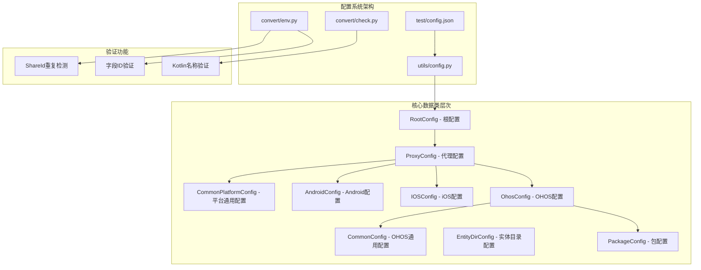
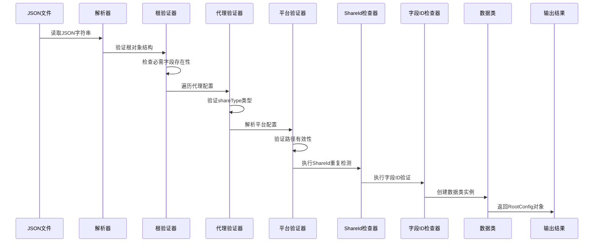
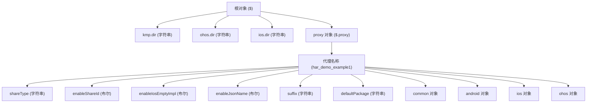
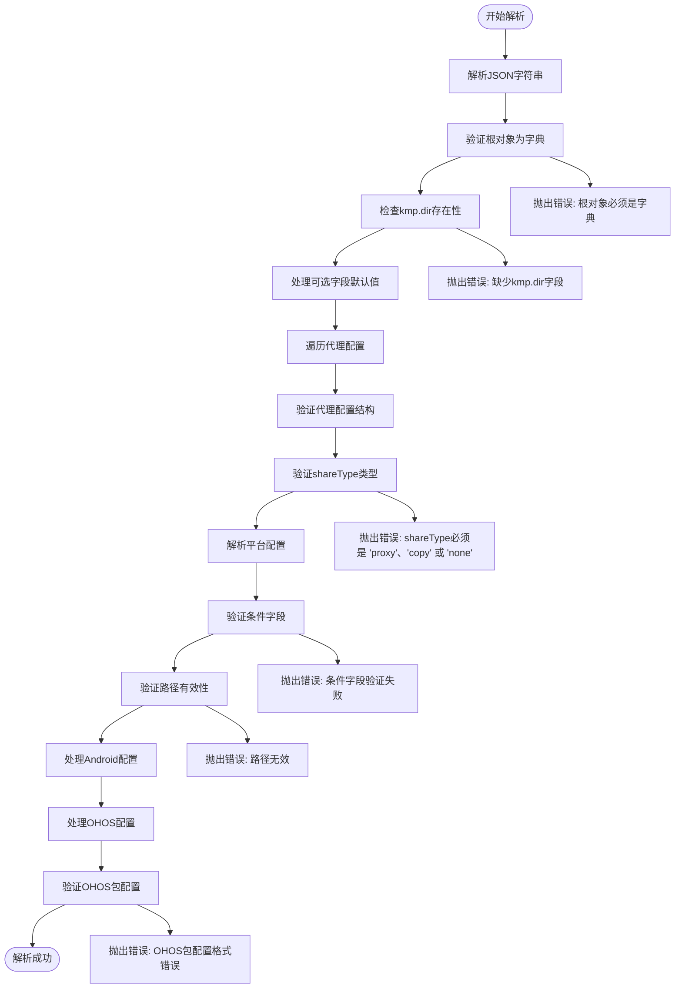
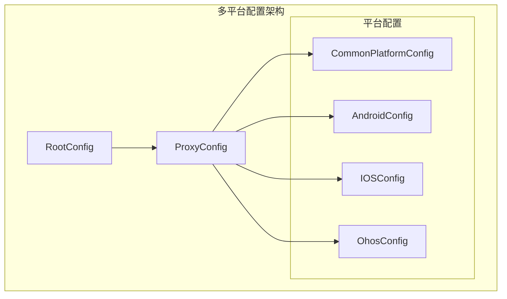
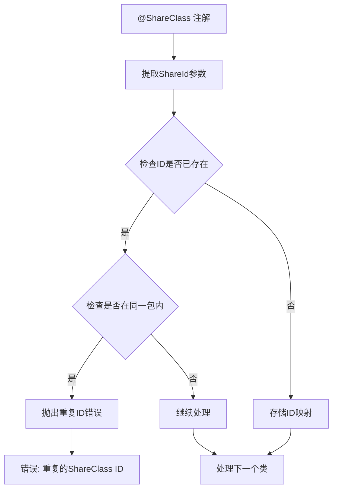
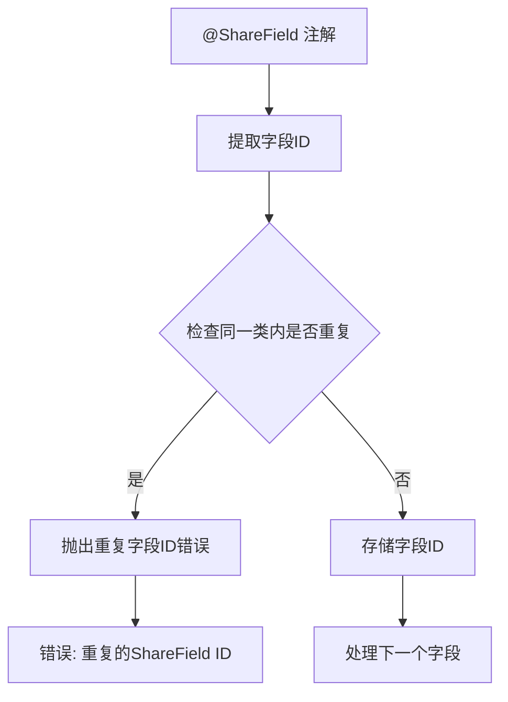
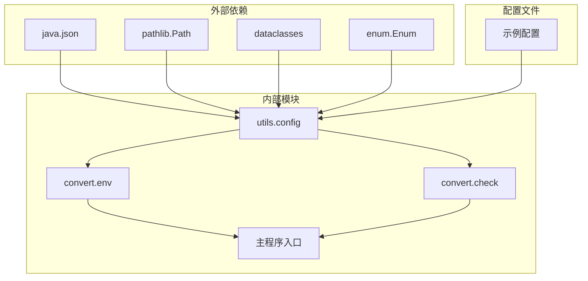

# 配置文件格式规范

<cite>
**本文档引用的文件**
- [utils/config.py](file://utils/config.py)
- [test/config.json](file://test/config.json)
- [convert/env.py](file://convert/env.py)
- [convert/check.py](file://convert/check.py)
- [pyproject.toml](file://pyproject.toml)
</cite>

## 更新摘要
**变更内容**
- 更新 shareType 字段支持 'none' 选项的说明
- 新增条件验证逻辑的详细说明：kotlinOut 仅在 shareType='proxy' 时有效，entityDir 仅在 shareType='copy' 时有效，enableIosEmptyImpl 需要 enableShareId=true 才能激活
- 更新配置验证规则和错误处理机制的描述
- 更新配置文件示例以反映新的 shareType 选项

## 目录
1. [简介](#简介)
2. [项目结构](#项目结构)
3. [核心配置类](#核心配置类)
4. [架构概览](#架构概览)
5. [详细组件分析](#详细组件分析)
6. [多平台配置详解](#多平台配置详解)
7. [配置验证增强功能](#配置验证增强功能)
8. [依赖关系分析](#依赖关系分析)
9. [性能考虑](#性能考虑)
10. [故障排除指南](#故障排除指南)
11. [结论](#结论)

## 简介

本文件规范定义了Python ArkTS FFI Kotlin转换工具的全新配置文件格式。该工具通过解析JSON配置文件来指导ArkTS到Kotlin的跨平台代码转换过程。新版本配置系统采用多代理架构，支持同时为Android、iOS、OHOS等多个平台生成代理代码，具备强大的配置灵活性和验证能力。

## 项目结构

新版本配置系统采用模块化设计，位于`utils/config.py`文件中，包含七个核心数据类用于描述完整的配置结构：



**图表来源**
- [utils/config.py](file://utils/config.py#L9-L71)
- [convert/env.py](file://convert/env.py#L25-L55)
- [convert/check.py](file://convert/check.py#L5-L89)
- [test/config.json](file://test/config.json#L1-L41)

**章节来源**
- [utils/config.py](file://utils/config.py#L1-L366)
- [pyproject.toml](file://pyproject.toml#L1-L26)

## 核心配置类

### RootConfig（根配置）

RootConfig是配置文件的顶层容器，定义了项目的基础设置：

| 字段名 | 类型 | 必需性 | 描述 |
|--------|------|--------|------|
| kmp_dir | String | 必需 | KMP（Kotlin Multiplatform Mobile）项目根目录路径 |
| ohos_dir | String | 可选 | OpenHarmony项目根目录路径，默认为空字符串 |
| ios_dir | String | 可选 | iOS项目根目录路径，默认为空字符串 |
| proxy | Dict[String, ProxyConfig] | 可选 | 代理配置字典，默认为空字典 |

### ProxyConfig（代理配置）

ProxyConfig定义单个代理的完整配置，支持多平台生成：

| 字段名 | 类型 | 必需性 | 描述 |
|--------|------|--------|------|
| share_type | String | 必需 | 代理类型，只能是 "proxy"、"copy" 或 "none" |
| enable_share_id | Boolean | 可选 | 启用ShareId功能，默认false |
| enable_ios_empty_impl | Boolean | 可选 | iOS空实现支持，默认false |
| enable_json_name | Boolean | 可选 | JSON名称支持，默认false |
| suffix | String | 可选 | 代理类后缀，默认"Proxy" |
| default_package | String | 可选 | 默认包名，默认空字符串 |
| common | CommonPlatformConfig | 必需 | 平台通用配置 |
| android | AndroidConfig | 可选 | Android平台配置 |
| ios | IOSConfig | 可选 | iOS平台配置 |
| ohos | OhosConfig | 必需 | OHOS平台配置 |

### CommonPlatformConfig（平台通用配置）

定义跨平台共享的配置参数：

| 字段名 | 类型 | 必需性 | 描述 |
|--------|------|--------|------|
| kotlin_out | String | 可选 | Kotlin输出目录路径，默认空字符串 |
| entity_dir | EntityDirConfig | 可选 | 实体目录配置 |

### CommonConfig（OHOS通用配置）

OHOS平台的通用配置参数：

| 字段名 | 类型 | 必需性 | 描述 |
|--------|------|--------|------|
| kotlin_output | String | 必需 | Kotlin源码输出目录路径 |
| imports | List[String] | 可选 | 导入语句列表，默认空列表 |

### PackageConfig（包级配置）

定义特定包的配置参数：

| 字段名 | 类型 | 必需性 | 描述 |
|--------|------|--------|------|
| name | String | 必需 | 包名称（作为packages字典的键） |
| arkts_source_dir | List[String] | 必需 | ArkTS源码目录列表 |

### AndroidConfig（Android配置）

Android平台的特定配置：

| 字段名 | 类型 | 必需性 | 描述 |
|--------|------|--------|------|
| src_dir | List[String] | 可选 | 源码目录列表，默认空列表 |

### IOSConfig（iOS配置）

iOS平台的特定配置：

| 字段名 | 类型 | 必需性 | 描述 |
|--------|------|--------|------|
| common | CommonPlatformConfig | 必需 | iOS平台通用配置 |

### EntityDirConfig（实体目录配置）

定义实体代码的目录结构：

| 字段名 | 类型 | 必需性 | 描述 |
|--------|------|--------|------|
| common_main | List[String] | 可选 | commonMain目录列表，默认空列表 |
| ohos_arm64_main | List[String] | 可选 | ohosArm64Main目录列表，默认空列表 |

**章节来源**
- [utils/config.py](file://utils/config.py#L9-L71)

## 架构概览

新配置解析系统采用分层架构设计，支持复杂的多平台配置：



**图表来源**
- [utils/config.py](file://utils/config.py#L124-L293)
- [convert/env.py](file://convert/env.py#L25-L55)
- [convert/check.py](file://convert/check.py#L5-L89)

## 详细组件分析

### 配置文件语法结构

新配置文件采用严格的JSON格式，具有以下层次结构：



**图表来源**
- [test/config.json](file://test/config.json#L1-L41)
- [utils/config.py](file://utils/config.py#L124-L293)

### 字段详细说明

#### kmp_dir 字段
- **类型**: String
- **作用**: 指定KMP（Kotlin Multiplatform Mobile）项目根目录路径
- **格式要求**: 
  - 必须是有效的文件系统路径
  - 支持相对路径和绝对路径
  - 路径分隔符使用正斜杠或双反斜杠
- **示例**: `"/Users/bd/xieyutian/test_case/kt"`

#### ohos_dir 字段
- **类型**: String
- **作用**: 指定OpenHarmony项目根目录路径
- **格式要求**: 
  - 可选字段，默认为空字符串
  - 支持相对路径和绝对路径
- **示例**: `"/Users/bd/xieyutian/test_case/ohos"`

#### ios_dir 字段
- **类型**: String
- **作用**: 指定iOS项目根目录路径
- **格式要求**: 
  - 可选字段，默认为空字符串
  - 支持相对路径和绝对路径

#### proxy 字段
- **类型**: Dict[String, ProxyConfig]
- **作用**: 定义多个代理的配置，键为代理名称，值为对应的ProxyConfig对象
- **格式要求**:
  - 键必须是字符串类型的代理名称
  - 值必须是ProxyConfig对象
  - 支持任意数量的代理配置

#### shareType 字段
- **类型**: String
- **作用**: 指定代理类型，控制代码生成行为
- **取值范围**: "proxy"、"copy" 或 "none"
- **格式要求**:
  - 必填字段
  - 必须是上述三个值之一
- **示例**: `"proxy"`
- **条件验证**:
  - 当 shareType='proxy' 时，kotlinOut 字段有效
  - 当 shareType='copy' 时，entityDir 字段有效
  - 当 shareType='none' 时，不进行代理代码生成

#### enableShareId 字段
- **类型**: Boolean
- **作用**: 启用ShareId功能，支持跨平台对象共享
- **格式要求**:
  - 可选字段，默认false
  - 仅在shareType为"proxy"时生效

#### enableIosEmptyImpl 字段
- **类型**: Boolean
- **作用**: 启用iOS空实现支持
- **格式要求**:
  - 可选字段，默认false
  - **条件验证**: 仅在 enableShareId=true 时有效

#### enableJsonName 字段
- **类型**: Boolean
- **作用**: 启用JSON名称支持
- **格式要求**:
  - 可选字段，默认false

#### suffix 字段
- **类型**: String
- **作用**: 指定代理类的后缀名称
- **格式要求**:
  - 可选字段，默认"Proxy"
- **示例**: `"KMP"`

#### defaultPackage 字段
- **类型**: String
- **作用**: 指定默认包名
- **格式要求**:
  - 可选字段，默认空字符串
- **示例**: `"com.bd.kmp.infra.ffi.demo"`

#### common 字段
- **类型**: Object
- **作用**: 定义平台通用配置
- **子字段**:
  - `kotlinOut`: Kotlin输出目录路径（仅在 shareType='proxy' 时有效）
  - `entityDir`: 实体目录配置（仅在 shareType='copy' 时有效）

#### android 字段
- **类型**: Object
- **作用**: 定义Android平台配置
- **子字段**:
  - `srcDir`: 源码目录列表（仅在shareType为"proxy"时有效）

#### ios 字段
- **类型**: Object
- **作用**: 定义iOS平台配置
- **子字段**:
  - `common`: iOS平台通用配置

#### ohos 字段
- **类型**: Object
- **作用**: 定义OHOS平台配置
- **子字段**:
  - `common`: OHOS通用配置
  - `packages`: 包配置（可选）

**章节来源**
- [utils/config.py](file://utils/config.py#L124-L293)
- [test/config.json](file://test/config.json#L1-L41)

### 数据类型约束

新配置系统对数据类型实施严格验证：



**图表来源**
- [utils/config.py](file://utils/config.py#L295-L318)
- [utils/config.py](file://utils/config.py#L124-L293)

**章节来源**
- [utils/config.py](file://utils/config.py#L295-L318)

### 配置文件示例

以下是一个完整的多平台配置文件示例，展示了所有支持的字段和格式：

```json
{
  "kmp.dir": "/Users/bd/xieyutian/test_case/kt",
  "ohos.dir": "/Users/bd/xieyutian/test_case/ohos",
  "ios.dir": "",
  "proxy": {
    "har_demo_example1": {
      "shareType": "proxy",
      "enableShareId": true,
      "enableIosEmptyImpl": true,
      "enableJsonName": true,
      "suffix": "KMP",
      "defaultPackage": "com.bd.kmp.infra.ffi.demo",
      "android": {
        "srcDir": ["./src/androidMain/kotlin"]
      },
      "common": {
        "kotlinOut": "./src/commonMain/kotlin/auto_gen_ffi_proxy_example1",
        "entityDir": {
          "commonMain": ["./src/commonMain/kotlin/auto_gen_ffi_proxy_example1"],
          "ohosArm64Main": ["./src/ohosArm64Main/kotlin/auto_gen_ffi_proxy_example1"]
        }
      },
      "ohos": {
        "common": {
          "kotlinOut": "./demo/har_demo/src/ohosArm64Main/kotlin/auto_gen_ffi_proxy_example1",
          "import": ["bigint.test.BigIntTestInterfaceCommon"]
        },
        "packages": {
          "@kmp/basic_ability": {
            "arktsSrcDir": [""]
          }
        }
      },
      "ios": {
        "common": {
          "kotlinOut": "./demo/har_demo/src/ohosArm64Main/kotlin/auto_gen_ffi_proxy_example2"
        }
      }
    }
  }
}
```

**章节来源**
- [test/config.json](file://test/config.json#L1-L41)

## 多平台配置详解

### 平台配置架构

新配置系统支持多平台并行配置，每个平台都有独立的配置结构：



**图表来源**
- [utils/config.py](file://utils/config.py#L21-L63)

### 平台特定配置

#### Android平台配置

Android配置仅在shareType为"proxy"时有效：

| 字段名 | 类型 | 必需性 | 描述 |
|--------|------|--------|------|
| srcDir | List[String] | 可选 | Android源码目录列表，默认空列表 |

#### iOS平台配置

iOS配置支持独立的通用配置：

| 字段名 | 类型 | 必需性 | 描述 |
|--------|------|--------|------|
| common | CommonPlatformConfig | 必需 | iOS平台通用配置 |

#### OHOS平台配置

OHOS配置包含通用配置和包配置：

| 字段名 | 类型 | 必需性 | 描述 |
|--------|------|--------|------|
| common | CommonConfig | 必需 | OHOS通用配置 |
| packages | List[PackageConfig] | 可选 | 包配置列表，默认空列表 |

**章节来源**
- [utils/config.py](file://utils/config.py#L27-L63)

## 配置验证增强功能

### ShareId重复检测功能

系统实现了增强的ShareId重复检测功能，确保ShareClass注解的ID在整个包内唯一：



**图表来源**
- [convert/env.py](file://convert/env.py#L46-L55)

### 字段ID验证功能

系统还实现了字段ID验证功能，确保ShareField注解的ID在同一个类内唯一：



**图表来源**
- [convert/env.py](file://convert/env.py#L131-L138)

### Kotlin名称验证功能

系统包含完整的Kotlin名称验证功能，确保生成的代码符合Kotlin语言规范：

| 验证类型 | 规则 | 错误代码 | 示例 |
|----------|------|----------|------|
| 类名验证 | 非空、非关键字、以字母或下划线开头、仅含字母数字下划线 | 1001 | `FooClass` ✓, `class` ✗ |
| 包名验证 | 非空、不以点开头或结尾、无连续点号、各段非空且符合规则 | 1002 | `com.example` ✓, `..` ✗ |
| 字段名验证 | 非空、支持反引号包裹、符合标识符规则 | 2001 | `fieldName` ✓, ``field` `` ✓ |

**章节来源**
- [convert/check.py](file://convert/check.py#L5-L89)
- [convert/env.py](file://convert/env.py#L46-L55)
- [convert/env.py](file://convert/env.py#L131-L138)

## 依赖关系分析

新配置系统与其他项目组件的关系：



**图表来源**
- [utils/config.py](file://utils/config.py#L1-L7)
- [convert/env.py](file://convert/env.py#L1-L5)
- [convert/check.py](file://convert/check.py#L1-L4)
- [pyproject.toml](file://pyproject.toml#L15-L21)

**章节来源**
- [pyproject.toml](file://pyproject.toml#L15-L21)

## 性能考虑

新配置解析系统采用以下优化策略：

1. **延迟加载**: 配置文件仅在需要时读取和解析
2. **类型检查**: 在解析过程中进行即时类型验证，避免后续处理中的类型错误
3. **内存效率**: 使用不可变数据类（frozen=True）减少内存占用
4. **快速失败**: 发现错误立即抛出异常，避免不必要的处理
5. **增量验证**: ShareId和字段ID验证在解析过程中实时执行，提高错误发现效率
6. **条件解析**: 仅在需要时解析特定平台配置，减少不必要的计算
7. **条件字段验证**: 根据 shareType 动态验证相关字段，提高验证效率

## 故障排除指南

### 常见错误类型

1. **JSON语法错误**
   - 症状: 解析JSON时抛出异常
   - 解决方案: 检查JSON文件的语法正确性

2. **字段类型错误**
   - 症状: 抛出"Expected X at Y"错误
   - 解决方案: 确保字段类型与预期一致

3. **缺少必需字段**
   - 症状: 抛出字段不存在错误
   - 解决方案: 添加缺失的必需字段

4. **shareType类型错误**
   - 症状: 抛出"shareType必须是 'proxy'、'copy' 或 'none'"错误
   - 解决方案: 确保shareType字段值为"proxy"、"copy"或"none"

5. **条件字段验证失败**
   - 症状: 抛出条件字段验证错误
   - 解决方案: 检查字段与 shareType 的匹配关系

6. **OHOS包配置格式错误**
   - 症状: 抛出"ohos.packages必须是数组或对象"错误
   - 解决方案: 检查OHOS包配置的格式

7. **ShareId重复错误**
   - 症状: 抛出"[Error 1004] Duplicate ShareClass ID"错误
   - 解决方案: 确保同一包内的ShareClass ID唯一

8. **字段ID重复错误**
   - 症状: 抛出"[Error 2003] Duplicate ShareField ID"错误
   - 解决方案: 确保同一类内的ShareField ID唯一

9. **路径无效**
   - 症状: 文件系统操作失败
   - 解决方案: 检查路径的有效性和可访问性

### 调试建议

1. 使用最小化配置文件进行测试
2. 逐步添加配置项以定位问题
3. 验证路径的相对性和绝对性
4. 检查导入语句的正确性
5. 确保ShareId和字段ID的唯一性
6. 验证Kotlin名称符合语言规范
7. 检查多平台配置的兼容性
8. 特别注意 shareType 与相关字段的匹配关系

**章节来源**
- [utils/config.py](file://utils/config.py#L295-L318)
- [convert/env.py](file://convert/env.py#L46-L55)
- [convert/env.py](file://convert/env.py#L131-L138)
- [convert/check.py](file://convert/check.py#L5-L89)

## 结论

本配置文件格式规范定义了ArkTS到Kotlin转换工具的全新多平台配置系统。通过引入ProxyConfig、OhosConfig、AndroidConfig、IOSConfig等新数据结构，系统实现了强大的跨平台代码生成能力。

新架构提供了清晰的层次结构和灵活的配置选项，支持同时为Android、iOS、OHOS等多个平台生成代理代码。增强的验证功能进一步提升了系统的健壮性，防止了配置错误导致的运行时问题。

七个核心配置类（RootConfig、ProxyConfig、CommonPlatformConfig、CommonConfig、AndroidConfig、IOSConfig、OhosConfig）形成了完整的配置体系，满足了复杂项目的多平台开发需求。新增的条件验证功能使得配置文件不仅能够准确描述转换需求，还能在解析阶段就发现潜在的问题，显著提高了整个转换流程的可靠性和用户体验。

**更新要点**:
- shareType 现在支持 'none' 选项，表示不生成代理代码
- 新增条件验证逻辑，确保字段与 shareType 的正确匹配
- kotlinOut 字段仅在 shareType='proxy' 时有效
- entityDir 字段仅在 shareType='copy' 时有效
- enableIosEmptyImpl 需要 enableShareId=true 才能激活