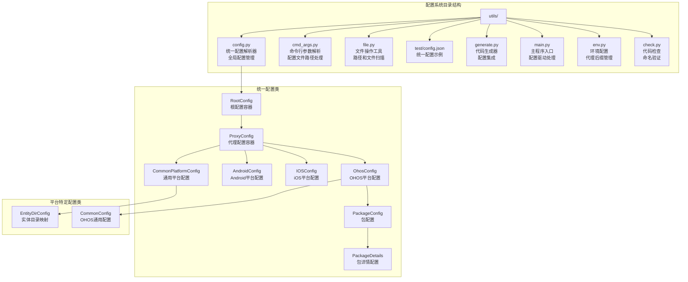
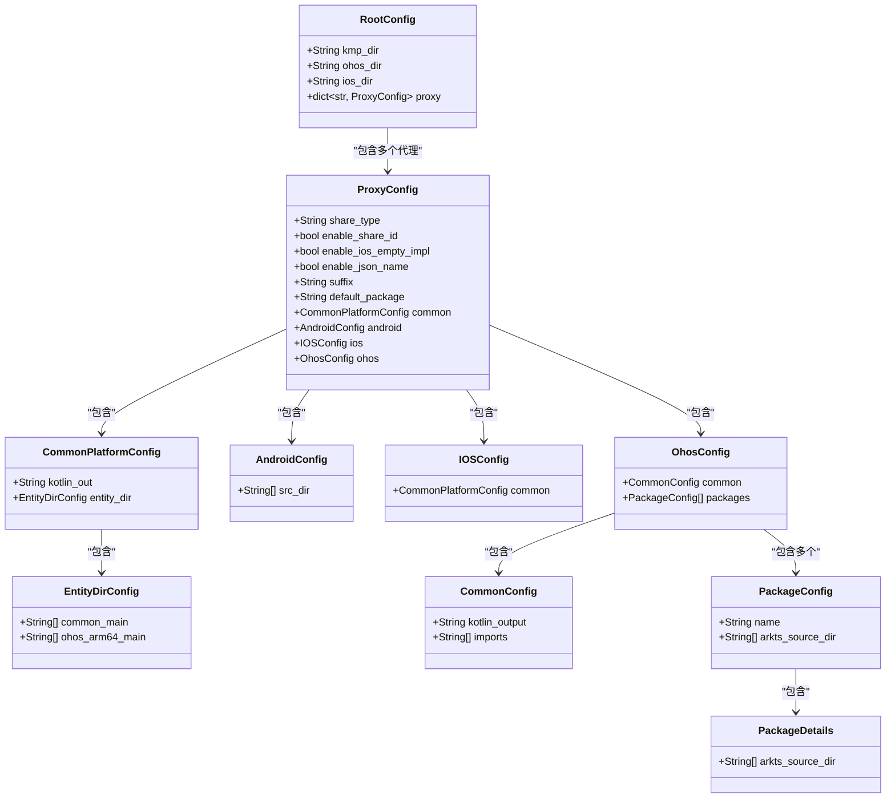
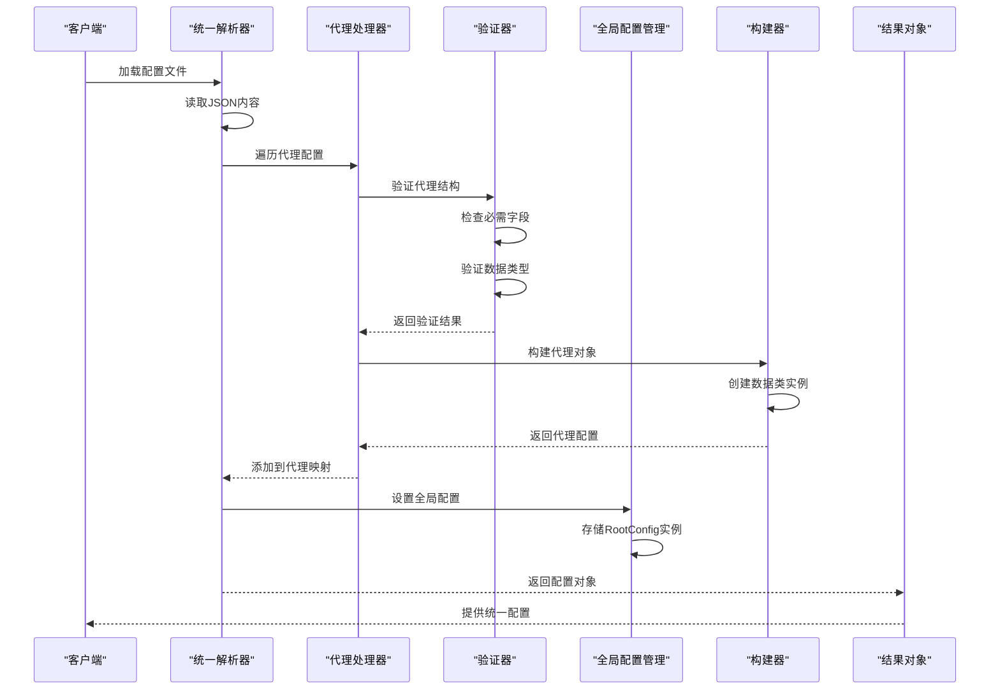
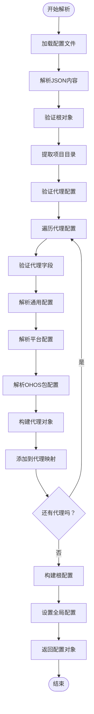
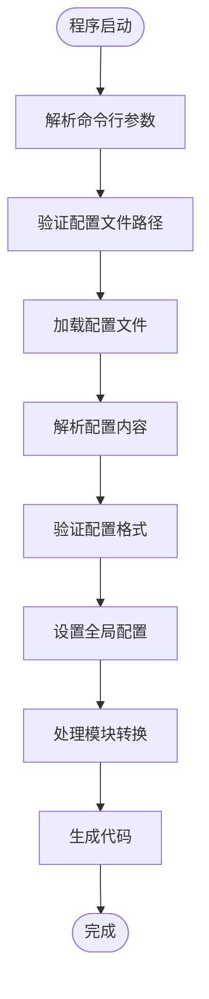

# 配置系统详解

<cite>
**本文档引用的文件**
- [utils/config.py](file://utils/config.py)
- [test/config.json](file://test/config.json)
- [convert/generate.py](file://convert/generate.py)
- [main.py](file://main.py)
- [utils/cmd_args.py](file://utils/cmd_args.py)
- [utils/file.py](file://utils/file.py)
- [convert/env.py](file://convert/env.py)
- [convert/check.py](file://convert/check.py)
</cite>

## 更新摘要
**变更内容**
- 更新代理类型枚举：`shareType` 选项从 `"none"` 更改为 `"basic"`
- 增强配置验证机制，支持新的代理类型选项
- 更新配置参数参考，反映代理类型的最新状态
- 更新配置文件示例，展示新的代理类型使用方法
- 更新最佳实践指南，包含新的代理类型使用建议

## 目录
1. [简介](#简介)
2. [项目结构](#项目结构)
3. [核心组件](#核心组件)
4. [架构概览](#架构概览)
5. [详细组件分析](#详细组件分析)
6. [配置参数参考](#配置参数参考)
7. [配置验证机制](#配置验证机制)
8. [配置文件示例](#配置文件示例)
9. [最佳实践指南](#最佳实践指南)
10. [故障排除指南](#故障排除指南)
11. [结论](#结论)

## 简介

配置系统是一个现代化的统一配置文件驱动系统，专为管理 ArkTS 到 Kotlin FFI 转换而设计。系统通过单一 JSON 配置文件定义代理配置、平台特定设置和包管理策略，支持 Android、iOS、OHOS 等多个平台的统一配置管理。

**重大架构升级**：系统已从实验性的多代理配置系统迁移到统一配置文件方法，移除了复杂的多代理配置解析逻辑，简化为单一配置文件驱动。新的配置系统提供了更简洁、更可靠的配置管理方式，同时保持了强大的功能性和扩展性。

**从命令行参数驱动转向配置文件驱动**：系统现在完全依赖配置文件进行初始化和配置管理，通过命令行参数指定配置文件路径，然后由配置解析器处理所有配置细节。

## 项目结构

配置系统位于项目的 `utils` 目录中，主要包含以下文件：



**图表来源**
- [utils/config.py](file://utils/config.py#L66-L71)
- [utils/config.py](file://utils/config.py#L52-L63)
- [utils/config.py](file://utils/config.py#L21-L50)
- [convert/env.py](file://convert/env.py#L33-L40)

**章节来源**
- [utils/config.py](file://utils/config.py#L1-L366)
- [test/config.json](file://test/config.json#L1-L41)
- [main.py](file://main.py#L1-L33)

## 核心组件

配置系统由八个核心组件组成，采用统一配置文件架构设计，每个组件代表配置系统的一个特定方面。

### 统一配置架构



**图表来源**
- [utils/config.py](file://utils/config.py#L66-L71)
- [utils/config.py](file://utils/config.py#L52-L63)
- [utils/config.py](file://utils/config.py#L21-L50)

### 代理配置层次结构

统一配置系统采用分层设计，从根配置到具体代理配置的层次关系如下：

1. **RootConfig**: 根配置容器，包含项目级配置和代理映射
2. **ProxyConfig**: 代理配置容器，代表一个独立的配置实例
3. **CommonPlatformConfig**: 通用平台配置，适用于所有平台
4. **平台特定配置**: AndroidConfig、IOSConfig、OhosConfig
5. **平台特定子配置**: CommonConfig、EntityDirConfig、PackageConfig
6. **包配置详情**: PackageDetails，提供包配置的详细信息
7. **全局配置管理**: 提供全局状态管理和访问接口

**章节来源**
- [utils/config.py](file://utils/config.py#L66-L71)
- [utils/config.py](file://utils/config.py#L52-L63)
- [utils/config.py](file://utils/config.py#L21-L50)

## 架构概览

配置系统的工作流程包括配置文件读取、统一解析、数据验证、全局配置管理和对象构建五个主要阶段。**统一配置文件方法**确保配置系统能够处理单一配置文件，同时支持多代理配置的灵活性。



**图表来源**
- [utils/config.py](file://utils/config.py#L124-L293)
- [utils/config.py](file://utils/config.py#L75-L83)

## 详细组件分析

### 统一配置管理系统

**重大架构升级**：系统现在包含一个统一配置管理系统，支持单一配置文件驱动的多代理配置处理，每个代理代表独立的配置需求。

#### 代理配置管理器

```mermaid
classDiagram
class RootConfig {
+String kmp_dir
+String ohos_dir
+String ios_dir
+dict~str, ProxyConfig~ proxy
}
class ProxyConfig {
+String share_type
+bool enable_share_id
+bool enable_ios_empty_impl
+bool enable_json_name
+String suffix
+String default_package
+CommonPlatformConfig common
+AndroidConfig android
+IOSConfig ios
+OhosConfig ohos
}
note for RootConfig : "kmp_dir : Kotlin项目目录\nohos_dir : OHOS项目目录\nios_dir : iOS项目目录\nproxy : 代理配置映射"
note for ProxyConfig : "share_type : 代理类型(proxy/copy/basic)\nenable_share_id : 启用共享ID\nenable_ios_empty_impl : 启用iOS空实现\nenable_json_name : 启用JSON名称\nsuffix : 代理后缀\ndefault_package : 默认包名"
```

**统一配置特点**：
- `kmp_dir`: Kotlin Multiplatform 项目根目录
- `ohos_dir`: OHOS 项目根目录  
- `ios_dir`: iOS 项目根目录
- `proxy`: 代理配置字典，键为代理名称，值为代理配置实例

#### 代理类型和配置访问模式

系统支持三种代理类型和配置访问模式：

1. **代理类型**：
   - `proxy`: 共享代理配置，支持 Android 源码目录配置
   - `copy`: 复制代理配置，独立的配置实例
   - `basic`: 基础代理配置，无共享功能的简化配置

2. **配置访问模式**：
   - 直接访问：通过 `parse_config()` 返回的 RootConfig 实例
   - 全局访问：通过 `get_config()` 全局函数访问已设置的配置

**章节来源**
- [utils/config.py](file://utils/config.py#L66-L71)
- [utils/config.py](file://utils/config.py#L52-L63)
- [main.py](file://main.py#L16-L24)

### 统一配置解析器实现

统一配置解析器是整个系统的核心，负责将单一 JSON 配置转换为统一类型安全的数据结构。

#### 解析流程



**图表来源**
- [utils/config.py](file://utils/config.py#L124-L293)

#### 关键验证函数

系统实现了六个核心验证函数来确保配置数据的完整性：

1. **_expect_dict**: 验证对象类型
2. **_expect_list**: 验证数组类型  
3. **_expect_str**: 验证字符串类型
4. **_expect_bool**: 验证布尔类型
5. **_expect_int**: 验证整数类型
6. **_expect_float**: 验证浮点类型

这些函数在发现类型不匹配时会抛出详细的错误信息，包含错误位置和期望类型。

**章节来源**
- [utils/config.py](file://utils/config.py#L85-L106)
- [utils/config.py](file://utils/config.py#L124-L293)

### 平台特定配置系统

**新增功能**：系统现在包含完整的平台特定配置系统，支持 Android、iOS、OHOS 平台的统一配置。

#### 平台配置架构

```mermaid
classDiagram
class CommonPlatformConfig {
+String kotlin_out
+EntityDirConfig entity_dir
}
class AndroidConfig {
+String[] src_dir
}
class IOSConfig {
+CommonPlatformConfig common
}
class OhosConfig {
+CommonConfig common
+PackageConfig[] packages
}
class EntityDirConfig {
+String[] common_main
+String[] ohos_arm64_main
}
class CommonConfig {
+String kotlin_output
+String[] imports
}
class PackageConfig {
+String name
+String[] arkts_source_dir
}
class PackageDetails {
+String[] arkts_source_dir
}
note for CommonPlatformConfig : "kotlin_out : 通用Kotlin输出路径\nentity_dir : 实体目录映射"
note for EntityDirConfig : "common_main : 通用主目录映射\nohos_arm64_main : OHOS ARM64主目录映射"
note for CommonConfig : "kotlin_output : OHOS Kotlin输出路径\nimports : 导入声明列表"
```

**平台配置特点**：
- `CommonPlatformConfig`: 适用于所有平台的通用配置
- `AndroidConfig`: Android 特定配置，包含源码目录映射
- `IOSConfig`: iOS 特定配置，包含通用平台配置
- `OhosConfig`: OHOS 特定配置，包含通用配置和包列表
- `PackageDetails`: 包配置详情，提供包的详细源码目录信息

#### 实体目录映射系统

**新增功能**：系统现在包含实体目录映射系统，支持将通用目录映射到平台特定目录。

实体目录映射允许开发者将通用目录结构映射到平台特定的目录结构，例如：
- `commonMain` → `ohosArm64Main`
- 支持多对多映射关系

#### 包配置格式支持

**更新**：系统现在支持两种包配置格式：

1. **对象格式**：`{"pkg_name": {"arktsSrcDir": [...]}, ...}`
2. **数组格式**：`[{"name": "pkg_name", "arktsSrcDir": [...]}]`

这种灵活性使得配置文件可以根据需要选择最适合的格式。

**章节来源**
- [utils/config.py](file://utils/config.py#L21-L50)
- [utils/config.py](file://utils/config.py#L190-L211)
- [utils/config.py](file://utils/config.py#L257-L277)

### 输出模式枚举

**保持不变**：系统继续包含输出模式枚举，用于智能选择代码生成策略。

#### OutputMode 枚举

```mermaid
classDiagram
class OutputMode {
<<enumeration>>
+SingleFile
+Project
}
note for OutputMode : "SingleFile : 输出到单个.kt文件\nProject : 输出到项目目录结构"
```

**输出模式检测逻辑**：
- 如果 `kotlin_output` 以 `.kt` 结尾，则使用 `SingleFile` 模式
- 否则使用 `Project` 模式

#### 代码生成器集成

生成器根据输出模式执行不同的代码生成策略：

1. **SingleFile 模式**：将所有类转换为单个 Kotlin 文件
2. **Project 模式**：为每个包生成独立的 Kotlin 文件

**章节来源**
- [utils/config.py](file://utils/config.py#L108-L122)
- [convert/generate.py](file://convert/generate.py#L116-L151)

### 配置类设计

每个配置类都使用 `frozen=True` 和 `slots=True` 参数优化内存使用和性能。

#### 根配置类

根配置类包含以下字段：
- `kmp_dir`: Kotlin Multiplatform 项目根目录
- `ohos_dir`: OHOS 项目根目录
- `ios_dir`: iOS 项目根目录
- `proxy`: 代理配置映射

#### 代理配置类

代理配置类包含以下字段：
- `share_type`: 代理类型（"proxy"、"copy" 或 "basic"）
- `enable_share_id`: 启用共享 ID 功能
- `enable_ios_empty_impl`: 启用 iOS 空实现
- `enable_json_name`: 启用 JSON 名称映射
- `suffix`: 代理类后缀
- `default_package`: 默认包名
- `common`: 通用平台配置
- `android`: Android 平台配置
- `ios`: iOS 平台配置
- `ohos`: OHOS 平台配置

#### 平台特定配置类

平台特定配置类包含以下字段：
- `CommonPlatformConfig`: 通用平台配置
- `AndroidConfig`: Android 源码目录列表
- `IOSConfig`: iOS 通用配置
- `OhosConfig`: OHOS 通用配置和包列表

#### 包配置类

**更新**：包配置类现在包含 `PackageDetails` 作为其子配置：

- `PackageConfig`: 包配置，包含包名和 ArkTS 源码目录
- `PackageDetails`: 包详情，包含 ArkTS 源码目录列表

**章节来源**
- [utils/config.py](file://utils/config.py#L66-L71)
- [utils/config.py](file://utils/config.py#L52-L63)
- [utils/config.py](file://utils/config.py#L21-L50)

### 代理后缀管理系统

**新增功能**：系统现在包含完整的代理后缀管理系统，支持动态设置和获取代理后缀。

#### 代理后缀配置

```mermaid
classDiagram
class ConvertCache {
+String suffix
+dict class_rename_map
+set ts_enum_type_set
+dict kt_name_class_map
+dict kt_shared_class_field_name_map
+dict kt_id_class_map
+dict kt_class_rename_map
+dict real_obj_and_proxy_obj_name_map
}
class Env {
+ConvertCache cache
+ProxyConfig config
}
class SuffixManager {
+set_suffix(str) -> None
+get_suffix() -> str
}
note for ConvertCache : "suffix : 代理类后缀\n支持类重命名和共享类处理"
note for SuffixManager : "set_suffix : 设置代理后缀\nget_suffix : 获取代理后缀"
```

**代理后缀特点**：
- `suffix`: 代理类后缀，默认值为 "Proxy"
- `set_suffix`: 设置代理后缀的全局函数
- `get_suffix`: 获取当前代理后缀的全局函数

#### 代理后缀在代码生成中的应用

代理后缀在代码生成过程中发挥重要作用：

1. **类重命名**: 当 `enableShareId` 为 false 时，类名会自动加上后缀
2. **共享类处理**: 当 `enableShareId` 为 true 时，共享类会根据后缀进行重命名
3. **包名验证**: 后缀会影响类名的验证和冲突检查

**章节来源**
- [convert/env.py](file://convert/env.py#L33-L40)
- [convert/env.py](file://convert/env.py#L67-L125)

## 配置参数参考

### 根配置结构

| 字段名 | 类型 | 必需 | 描述 | 默认值 |
|--------|------|------|------|--------|
| kmp.dir | String | 是 | Kotlin Multiplatform 项目根目录 | - |
| ohos.dir | String | 否 | OHOS 项目根目录 | "" |
| ios.dir | String | 否 | iOS 项目根目录 | "" |
| proxy | Object | 否 | 代理配置映射 | {} |

### 代理配置参数

| 字段名 | 类型 | 必需 | 描述 | 默认值 |
|--------|------|------|------|--------|
| shareType | String | 是 | 代理类型："proxy"、"copy" 或 "basic" | - |
| enableShareId | Boolean | 否 | 启用共享 ID 功能 | false |
| enableIosEmptyImpl | Boolean | 否 | 启用 iOS 空实现 | false（仅在enableShareId为true时有效） |
| enableJsonName | Boolean | 否 | 启用 JSON 名称映射 | false |
| suffix | String | 否 | 代理类后缀 | "Proxy" |
| defaultPackage | String | 否 | 默认包名 | "" |
| android | Object | 否 | Android 源码目录配置 | - |
| common | Object | 是 | 通用平台配置 | - |
| ios | Object | 否 | iOS 平台配置 | - |
| ohos | Object | 是 | OHOS 平台配置 | - |

### 通用平台配置参数

| 字段名 | 类型 | 必需 | 描述 | 默认值 |
|--------|------|------|------|--------|
| kotlinOut | String | 否 | 通用 Kotlin 输出路径 | "" |
| entityDir | Object | 否 | 实体目录映射配置 | - |

### 实体目录映射参数

| 字段名 | 类型 | 必需 | 描述 | 默认值 |
|--------|------|------|------|--------|
| commonMain | Array[String] | 否 | 通用主目录映射列表 | [] |
| ohosArm64Main | Array[String] | 否 | OHOS ARM64 主目录映射列表 | [] |

### Android 平台配置参数

| 字段名 | 类型 | 必需 | 描述 | 默认值 |
|--------|------|------|------|--------|
| srcDir | Array[String] | 否 | Android 源码目录列表 | [] |

### iOS 平台配置参数

| 字段名 | 类型 | 必需 | 描述 | 默认值 |
|--------|------|------|------|--------|
| common | Object | 否 | iOS 通用配置 | - |

### OHOS 平台配置参数

| 字段名 | 类型 | 必需 | 描述 | 默认值 |
|--------|------|------|------|--------|
| common | Object | 是 | OHOS 通用配置 | - |
| packages | Object | 否 | 包配置映射 | - |

### OHOS 通用配置参数

| 字段名 | 类型 | 必需 | 描述 | 默认值 |
|--------|------|------|------|--------|
| kotlinOut | String | 是 | OHOS Kotlin 输出路径 | - |
| import | Array[String] | 否 | 导入声明列表 | [] |

### 包配置参数

**更新**：包配置现在支持两种格式：

#### 对象格式
| 字段名 | 类型 | 必需 | 描述 | 默认值 |
|--------|------|------|------|--------|
| arktsSrcDir | Array[String] | 否 | ArkTS 源码目录列表 | [] |

#### 数组格式
| 字段名 | 类型 | 必需 | 描述 | 默认值 |
|--------|------|------|------|--------|
| name | String | 是 | 包名 | - |
| arktsSrcDir | Array[String] | 否 | ArkTS 源码目录列表 | [] |

### 全局配置管理参数

| 函数名 | 参数类型 | 返回类型 | 描述 |
|--------|----------|----------|------|
| set_config | RootConfig | None | 设置全局配置实例 |
| get_config | None | RootConfig | 获取全局配置实例，未初始化时抛出异常 |
| set_suffix | String | None | 设置代理后缀 |
| get_suffix | None | String | 获取代理后缀 |

### 配置文件格式规范

配置文件必须遵循以下 JSON 结构：

```json
{
  "kmp.dir": "string",
  "ohos.dir": "string",
  "ios.dir": "string",
  "proxy": {
    "proxyName": {
      "shareType": "proxy|copy|basic",
      "enableShareId": boolean,
      "enableIosEmptyImpl": boolean,
      "enableJsonName": boolean,
      "suffix": "string",
      "defaultPackage": "string",
      "android": {
        "srcDir": ["string", "string", ...]
      },
      "common": {
        "kotlinOut": "string",
        "entityDir": {
          "commonMain": ["string", "string", ...],
          "ohosArm64Main": ["string", "string", ...]
        }
      },
      "ios": {
        "common": {
          "kotlinOut": "string"
        }
      },
      "ohos": {
        "common": {
          "kotlinOut": "string",
          "import": ["string", "string", ...]
        },
        "packages": {
          "packageName": {
            "arktsSrcDir": ["string", "string", ...]
          }
        }
      }
    }
  }
}
```

**章节来源**
- [test/config.json](file://test/config.json#L1-L41)
- [utils/config.py](file://utils/config.py#L124-L293)

## 配置验证机制

### 统一验证系统

配置系统实现了严格的统一验证机制，确保配置文件的结构和数据类型正确。

#### 验证规则

1. **根对象验证**: 确保根对象是 JSON 对象
2. **必需字段验证**: 检查所有必需字段是否存在
3. **类型强制验证**: 强制验证每个字段的数据类型
4. **枚举值验证**: 验证枚举字段的取值范围
5. **数组元素验证**: 验证数组中每个元素的类型
6. **代理映射验证**: 验证代理配置的完整性和一致性

#### 错误定位机制

验证错误包含详细的错误位置信息，格式为：
- `Expected object at $.proxy['proxyName'].common`
- `Expected string at $.proxy['proxyName'].shareType`
- `Expected array at $.proxy['proxyName'].ohos.packages`

这种错误格式帮助开发者快速定位配置问题。

**章节来源**
- [utils/config.py](file://utils/config.py#L85-L106)
- [utils/config.py](file://utils/config.py#L136-L143)

### 错误处理策略

系统采用统一的错误处理策略：

1. **明确的错误消息**: 提供包含位置信息的详细错误描述
2. **类型安全**: 使用 Python 类型注解确保编译时类型检查
3. **不可变性**: 所有配置对象都是冻结的，防止意外修改
4. **内存优化**: 使用 `slots=True` 减少内存占用
5. **全局状态保护**: 全局配置未初始化时提供清晰的错误提示
6. **代理独立验证**: 每个代理配置独立验证，互不影响

**章节来源**
- [utils/config.py](file://utils/config.py#L1-L366)

### 条件参数应用机制

**更新**：系统现在支持基于 `shareType` 值的条件参数应用机制，增强了配置的灵活性和安全性。

#### 条件参数验证逻辑

1. **shareType 验证**：严格限制为 "proxy"、"copy"、"basic" 三选一
2. **enableShareId 条件应用**：仅在 `enableShareId` 为 true 时验证 `enableIosEmptyImpl`
3. **kotlinOut 条件应用**：仅当 `shareType` 为 "proxy" 时有效
4. **entityDir 条件应用**：仅当 `shareType` 为 "copy" 时有效
5. **android 配置条件应用**：仅当 `shareType` 为 "proxy" 时有效

#### 条件参数默认值处理

- `enableShareId`: 默认值为 false
- `enableIosEmptyImpl`: 当 `enableShareId` 为 true 时才验证，否则默认 false
- `enableJsonName`: 默认值为 false
- `suffix`: 默认值为 "Proxy"
- `defaultPackage`: 默认值为空字符串
- `kotlinOut`: 当 `shareType` 为 "proxy" 时才有效，否则默认 ""

**章节来源**
- [utils/config.py](file://utils/config.py#L136-L143)
- [utils/config.py](file://utils/config.py#L145-L157)
- [utils/config.py](file://utils/config.py#L183-L188)
- [utils/config.py](file://utils/config.py#L190-L210)
- [utils/config.py](file://utils/config.py#L232-L239)

### 配置文件驱动架构

**新增**：系统现在完全基于配置文件驱动，移除了命令行参数的直接依赖。

#### 配置文件驱动流程



**配置文件驱动特点**：
- 命令行参数仅用于指定配置文件路径
- 配置文件包含所有必要的配置信息
- 全局配置管理器负责配置的生命周期
- 代码生成器通过全局配置访问配置信息

**章节来源**
- [main.py](file://main.py#L12-L24)
- [utils/cmd_args.py](file://utils/cmd_args.py#L13-L35)
- [utils/config.py](file://utils/config.py#L294-L317)

## 配置文件示例

### 基础统一配置示例

以下是一个完整的统一配置文件示例：

```json
{
  "kmp.dir": "/Users/bd/xieyutian/test_case/kt",
  "ohos.dir": "/Users/bd/xieyutian/test_case/ohos",
  "ios.dir": "",
  "proxy": {
    "har_demo_example1": {
      "shareType": "proxy",
      "enableShareId": true,
      "enableIosEmptyImpl": true,
      "enableJsonName": true,
      "suffix": "KMP",
      "defaultPackage": "com.bd.kmp.infra.ffi.demo",
      "android": {
        "srcDir": ["./src/androidMain/kotlin"]
      },
      "common": {
        "kotlinOut": "./src/commonMain/kotlin/auto_gen_ffi_proxy_example1",
        "entityDir": {
          "commonMain": ["./src/commonMain/kotlin/auto_gen_ffi_proxy_example1"],
          "ohosArm64Main": ["./src/ohosArm64Main/kotlin/auto_gen_ffi_proxy_example1"]
        }
      },
      "ohos": {
        "common": {
          "kotlinOut": "./demo/har_demo/src/ohosArm64Main/kotlin/auto_gen_ffi_proxy_example1",
          "import": ["bigint.test.BigIntTestInterfaceCommon"]
        },
        "packages": {
          "@kmp/basic_ability": {
            "arktsSrcDir": [""]
          }
        }
      },
      "ios": {
        "common": {
          "kotlinOut": "./demo/har_demo/src/ohosArm64Main/kotlin/auto_gen_ffi_proxy_example2"
        }
      }
    }
  }
}
```

### 多代理统一配置示例

支持配置多个代理实例的复杂场景：

```json
{
  "kmp.dir": "/path/to/kmp/project",
  "ohos.dir": "/path/to/ohos/project",
  "ios.dir": "/path/to/ios/project",
  "proxy": {
    "android_proxy": {
      "shareType": "proxy",
      "suffix": "AndroidProxy",
      "android": {
        "srcDir": ["./src/androidMain/kotlin"]
      },
      "common": {
        "kotlinOut": "./src/commonMain/kotlin/android_generated"
      },
      "ohos": {
        "common": {
          "kotlinOut": "./src/ohosArm64Main/kotlin/android_generated"
        },
        "packages": {
          "android_package": {
            "arktsSrcDir": ["./packages/android_package/src"]
          }
        }
      }
    },
    "ios_proxy": {
      "shareType": "copy",
      "suffix": "IosProxy",
      "common": {
        "kotlinOut": "./src/commonMain/kotlin/ios_generated",
        "entityDir": {
          "commonMain": ["./src/commonMain/kotlin/ios_generated"],
          "ohosArm64Main": ["./src/ohosArm64Main/kotlin/ios_generated"]
        }
      },
      "ohos": {
        "common": {
          "kotlinOut": "./src/ohosArm64Main/kotlin/ios_generated"
        },
        "packages": {
          "ios_package": {
            "arktsSrcDir": ["./packages/ios_package/src"]
          }
        }
      }
    },
    "basic_proxy": {
      "shareType": "basic",
      "suffix": "BasicProxy",
      "common": {
        "kotlinOut": "./src/commonMain/kotlin/basic_generated"
      },
      "ohos": {
        "common": {
          "kotlinOut": "./src/ohosArm64Main/kotlin/basic_generated"
        },
        "packages": {
          "basic_package": {
            "arktsSrcDir": ["./packages/basic_package/src"]
          }
        }
      }
    }
  }
}
```

### 单代理配置示例

使用单代理配置的简化场景：

```json
{
  "kmp.dir": "/Users/bd/xieyutian/test_case/kt",
  "ohos.dir": "/Users/bd/xieyutian/test_case/ohos",
  "proxy": {
    "simple_proxy": {
      "shareType": "copy",
      "suffix": "SimpleProxy",
      "common": {
        "kotlinOut": "./src/commonMain/kotlin/generated",
        "entityDir": {
          "commonMain": ["./src/commonMain/kotlin/generated"],
          "ohosArm64Main": ["./src/ohosArm64Main/kotlin/generated"]
        }
      },
      "ohos": {
        "common": {
          "kotlinOut": "./src/ohosArm64Main/kotlin/generated",
          "import": ["com.example.generated.*"]
        },
        "packages": {
          "example_package": {
            "arktsSrcDir": ["./packages/example_package/src"]
          }
        }
      }
    }
  }
}
```

### 包配置格式示例

**更新**：展示两种包配置格式的支持：

#### 对象格式
```json
{
  "ohos": {
    "packages": {
      "@kmp/basic_ability": {
        "arktsSrcDir": ["./packages/basic_ability/src"]
      }
    }
  }
}
```

#### 数组格式
```json
{
  "ohos": {
    "packages": [
      {
        "name": "@kmp/basic_ability",
        "arktsSrcDir": ["./packages/basic_ability/src"]
      }
    ]
  }
}
```

**章节来源**
- [test/config.json](file://test/config.json#L1-L41)

## 最佳实践指南

### 统一配置组织

1. **代理命名规范**: 使用有意义的代理名称，如 `android_proxy`、`ios_proxy`、`basic_proxy`
2. **代理类型选择**: 
   - 使用 `proxy` 类型处理需要共享配置的场景
   - 使用 `copy` 类型处理完全独立的配置场景
   - 使用 `basic` 类型处理无共享功能的基础配置场景
3. **配置继承策略**: 合理利用 `common` 配置进行配置复用
4. **平台特定配置**: 为不同平台提供专门的配置优化

### 实体目录映射最佳实践

1. **目录映射策略**: 建立清晰的目录映射关系
2. **多对多映射**: 充分利用多对多映射能力
3. **路径规范化**: 使用相对路径和绝对路径的合理组合
4. **平台差异处理**: 考虑不同平台的目录结构差异

### 输出模式选择

**单文件输出模式适用场景**：
- 小型项目或原型开发
- 需要集中管理生成的代码
- 简化的项目结构需求

**项目输出模式适用场景**：
- 大型多包项目
- 需要按包组织生成的代码
- 标准的项目结构要求

### 全局配置管理最佳实践

1. **初始化顺序**: 确保在使用任何配置之前先调用 `parse_config()` 初始化全局配置
2. **错误处理**: 在访问全局配置时处理未初始化的异常情况
3. **代理遍历**: 使用 `cfg.proxy.values()` 遍历所有代理配置
4. **配置共享**: 在多个模块之间共享配置时使用全局访问接口

### 性能优化建议

1. **最小化代理数量**: 避免创建过多不必要的代理实例
2. **合理组织包结构**: 避免过深的嵌套目录结构
3. **缓存配置结果**: 在频繁访问配置时考虑缓存机制
4. **优化包配置**: 合理分配包的源码目录，避免重复扫描

### 安全考虑

1. **敏感信息保护**: 不要在配置文件中存储敏感信息
2. **权限控制**: 确保配置文件的读取权限适当
3. **输入验证**: 始终验证外部输入的配置文件
4. **路径安全**: 验证输出路径的安全性，防止路径遍历攻击

### 条件参数应用最佳实践

**更新**：基于 `shareType` 的条件参数应用机制提供了更精细的配置控制。

1. **shareType 选择**: 根据实际需求选择合适的代理类型
2. **条件参数验证**: 确保条件参数的正确应用和验证
3. **默认值处理**: 理解各参数的默认值行为
4. **配置兼容性**: 确保不同代理类型之间的配置兼容性

### 代理后缀管理最佳实践

**新增功能**：代理后缀管理系统提供了灵活的类名重命名能力。

1. **后缀命名规范**: 使用清晰、有意义的后缀名称
2. **后缀一致性**: 在整个项目中保持后缀的一致性
3. **后缀长度控制**: 避免使用过长的后缀影响代码可读性
4. **后缀冲突避免**: 确保后缀不会与其他标识符产生冲突

### 配置文件驱动最佳实践

**新增**：基于配置文件驱动的架构提供了更好的可维护性和可扩展性。

1. **配置文件组织**: 将配置文件与项目结构相匹配
2. **环境变量集成**: 在配置文件中使用环境变量进行环境适配
3. **配置继承**: 使用基础配置文件和环境特定配置文件的组合
4. **版本控制**: 将配置文件纳入版本控制系统
5. **配置验证**: 在 CI/CD 流程中加入配置文件验证步骤

### 包配置格式选择最佳实践

**更新**：根据项目需求选择合适的包配置格式。

1. **对象格式适用场景**：
   - 包名简单且唯一的场景
   - 配置文件需要简洁明了的场景
   - 包数量较少的项目

2. **数组格式适用场景**：
   - 需要明确包名标识的场景
   - 配置文件需要更清晰结构的场景
   - 包数量较多或需要详细配置的项目

3. **格式迁移**: 可以在不同格式之间自由切换，系统会自动处理兼容性

### 代理类型选择最佳实践

**更新**：基于最新的代理类型支持，提供更准确的选择指导。

1. **proxy 类型适用场景**：
   - 需要共享配置和 Android 源码目录配置的复杂项目
   - 需要高级功能和完整配置支持的场景
   - 需要跨平台共享代理配置的项目

2. **copy 类型适用场景**：
   - 需要完全独立配置的项目
   - 需要实体目录映射的场景
   - 需要平台特定配置的项目

3. **basic 类型适用场景**：
   - 需要基础代理功能的简单项目
   - 不需要共享配置和 Android 源码目录的场景
   - 追求简洁配置的项目

4. **类型迁移**: 可以根据项目需求在不同类型之间迁移，系统会自动处理兼容性

## 故障排除指南

### 常见配置错误

#### JSON 格式错误

**症状**: 解析器抛出 JSON 解析异常
**解决方案**:
1. 使用在线 JSON 验证工具检查语法
2. 确保所有字符串都用双引号包围
3. 检查是否有尾随逗号

#### 代理配置错误

**症状**: 代理配置验证失败
**解决方案**:
1. 检查 `shareType` 字段的取值是否为 "proxy"、"copy" 或 "basic"
2. 确保必需的代理字段都存在
3. 验证代理名称的唯一性

#### 类型不匹配错误

**症状**: 验证器抛出类型错误异常
**解决方案**:
1. 检查字段类型是否正确
2. 确保数组包含正确的元素类型
3. 验证字符串路径的有效性

#### 缺失必需字段

**症状**: 验证器报告缺少必需字段
**解决方案**:
1. 确保所有必需字段都存在
2. 检查字段名称拼写是否正确
3. 验证配置文件结构完整性

#### 全局配置未初始化错误

**症状**: 访问全局配置时抛出未初始化异常
**解决方案**:
1. 确保先调用 `parse_config()` 初始化配置
2. 检查配置文件路径是否正确
3. 验证配置文件格式是否正确

#### 代理遍历错误

**症状**: 代理遍历时出现异常
**解决方案**:
1. 检查 `cfg.proxy` 是否为空
2. 确保代理名称的正确性
3. 验证代理配置的完整性

#### 条件参数应用错误

**更新**：基于 `shareType` 的条件参数应用错误。

**症状**: 条件参数验证失败或默认值应用错误
**解决方案**:
1. 检查 `shareType` 字段的正确性
2. 验证条件参数的依赖关系
3. 确认条件参数的默认值行为
4. 检查参数在不同 `shareType` 下的有效性

#### 代理后缀管理错误

**新增功能**：代理后缀管理系统特有的错误。

**症状**: 代理后缀设置或获取失败
**解决方案**:
1. 检查 `set_suffix` 函数的参数类型
2. 验证 `get_suffix` 函数的返回值
3. 确保后缀设置在代码生成前完成
4. 检查后缀是否符合命名规范

#### 配置文件驱动错误

**新增**：配置文件驱动架构特有的错误。

**症状**: 配置文件路径错误或配置文件加载失败
**解决方案**:
1. 检查命令行参数中的配置文件路径
2. 验证配置文件的存在性和可读性
3. 确保配置文件具有正确的 JSON 格式
4. 检查配置文件的权限设置

#### 包配置格式错误

**更新**：新增的包配置格式验证错误。

**症状**: 包配置格式验证失败
**解决方案**:
1. 检查 `ohos.packages` 字段的类型
2. 确保对象格式的键为包名
3. 验证数组格式中每个元素的 `name` 字段
4. 检查 `arktsSrcDir` 数组的格式和内容

#### 代理类型验证错误

**更新**：基于最新的代理类型验证错误。

**症状**: 代理类型验证失败
**解决方案**:
1. 检查 `shareType` 字段的取值是否为 "proxy"、"copy" 或 "basic"
2. 确保代理类型值的正确性和一致性
3. 验证不同代理类型下的参数有效性
4. 检查代理类型与配置参数的兼容性

### 调试技巧

1. **启用详细日志**: 在开发环境中启用详细的错误日志
2. **逐步验证**: 逐个字段验证配置的有效性
3. **单元测试**: 为配置解析器编写单元测试
4. **代理测试**: 测试不同代理配置的行为
5. **全局状态监控**: 监控全局配置的状态变化
6. **多代理调试**: 使用 `_print_config()` 函数调试多代理配置
7. **条件参数调试**: 验证不同 `shareType` 下的参数应用
8. **代理后缀调试**: 使用 `set_suffix/get_suffix` 函数调试后缀管理
9. **配置文件驱动调试**: 验证配置文件加载和解析流程
10. **包配置格式调试**: 验证对象格式和数组格式的兼容性
11. **代理类型调试**: 验证不同代理类型的配置行为

**章节来源**
- [utils/config.py](file://utils/config.py#L85-L106)
- [utils/config.py](file://utils/config.py#L320-L358)

## 结论

配置系统通过重大架构升级，从实验性的多代理配置系统迁移到统一配置文件方法，为 ArkTS 到 Kotlin 的 FFI 转换提供了现代化、统一且强大的配置管理方案。**统一配置文件方法**使得系统能够通过单一配置文件处理多代理配置，**平台特定配置**支持 Android、iOS、OHOS 等平台的统一定制，而**实体目录映射系统**提供了灵活的目录结构管理能力。

系统的主要优势包括：

1. **统一配置文件方法**: 通过单一配置文件处理多代理配置
2. **代理类型多样化**: 支持 "proxy"、"copy"、"basic" 三种代理类型
3. **平台特定配置**: 为不同平台提供专门的配置优化
4. **实体目录映射**: 支持灵活的目录结构映射关系
5. **类型安全**: 使用 Python 数据类确保运行时类型安全
6. **严格验证**: 完整的配置验证机制防止配置错误
7. **智能模式检测**: 自动识别输出模式，简化配置过程
8. **全局状态管理**: 提供统一的配置访问接口
9. **清晰结构**: 分层的配置架构便于理解和维护
10. **易于扩展**: 模块化的设计支持功能扩展
11. **包配置灵活性**: 支持对象格式和数组格式两种包配置方式
12. **代理后缀管理**: 提供动态设置和获取代理后缀的能力
13. **配置文件驱动**: 完全基于配置文件的架构设计

**更新**：本次重大架构升级显著增强了配置系统的现代化程度，从实验性的多代理配置系统迁移到统一配置文件方法，移除了复杂的多代理配置解析逻辑，简化为单一配置文件驱动。新增的代理类型（"proxy"、"copy"、"basic"）支持更灵活的配置场景，实体目录映射系统提供了更强大的目录结构管理能力。**条件参数应用机制**基于 `shareType` 值的精确控制，确保配置的灵活性和安全性。**配置文件驱动架构**提供了更好的可维护性和可扩展性，通过命令行参数指定配置文件路径，然后由配置解析器处理所有配置细节。**代理后缀管理系统**提供了灵活的类名重命名能力，支持动态设置和获取代理后缀。**包配置格式支持**增加了配置的灵活性，支持对象格式和数组格式两种方式。**代理类型验证机制**确保了代理类型的正确性和一致性，为开发者提供了更清晰的配置指导。这些改进使得配置系统更加健壮、灵活和易于使用，能够更好地适应各种复杂的项目需求。