# 配置验证与错误处理

<cite>
**本文档引用的文件**
- [utils/config.py](file://utils/config.py)
- [convert/check.py](file://convert/check.py)
- [convert/env.py](file://convert/env.py)
- [convert/decls.py](file://convert/decls.py)
- [test/config.json](file://test/config.json)
- [pyproject.toml](file://pyproject.toml)
- [utils/file.py](file://utils/file.py)
- [lang/kt/kt_parser.py](file://lang/kt/kt_parser.py)
- [lang/parser.py](file://lang/parser.py)
- [test/cases/class1.ts](file://test/cases/class1.ts)
- [test/cases/class0.ts](file://test/cases/class0.ts)
</cite>

## 更新摘要
**变更内容**
- **iOS Kotlin 输出路径修正**：test/config.json 中 iOS Kotlin 输出路径从 ohosArm64Main 修正为 iosMain，影响配置验证逻辑
- **新增 basic shareType 支持**：支持三种 shareType（"proxy"、"copy"、"basic"）的配置验证
- **条件字段验证机制**：基于 shareType 的 enableShareId、enableIosEmptyImpl、enableJsonName 条件验证
- **路径验证规则增强**：commonMain 必须包含 'commonMain'、ohosArm64Main 必须包含 'ohosArm64Main'、**iOS kotlinOut 必须包含 'iosMain'**、Android srcDir 必须包含 'androidMain'、ohos.common.kotlinOut 必须包含 'ohosArm64Main'
- **类型安全检查增强**：更严格的类型验证和错误处理机制
- **字段未找到和ShareId验证从警告升级为ValueError异常**
- **改进了错误处理机制**，增强了调试信息和统一的错误代码格式
- **新增了字段名验证系统**，包含字段名验证错误(2001)、重复字段ID错误(2003)等错误处理机制
- **新增了增强的包名/类名验证功能**，支持Kotlin关键字检查和命名规范验证
- **新增了重复检测机制**，包括字段ID重复检测和类名重复检测
- **完善了ShareId冲突检测机制**，支持包级别的重复检查
- **新增了字段ID查找和验证的错误处理机制**
- **优化了警告系统**，将部分警告升级为明确的异常处理
- **新增具体的错误代码**：[Error 2004]、[Error 1007]、[Error 1008]、[Error 1009]
- **严格的配置验证机制**：从警告升级为ValueError异常

## 目录
1. [简介](#简介)
2. [项目结构](#项目结构)
3. [核心组件](#核心组件)
4. [架构概览](#架构概览)
5. [详细组件分析](#详细组件分析)
6. [依赖关系分析](#依赖关系分析)
7. [性能考虑](#性能考虑)
8. [故障排除指南](#故障排除指南)
9. [结论](#结论)

## 简介

本文件专注于配置验证与错误处理机制的详细分析，重点涵盖以下方面：
- `parse_config` 函数中的验证逻辑和错误检查机制
- `_expect_dict`、`_expect_list`、`_expect_str` 等验证函数的实现原理和使用方法
- **新增** 三种 shareType（"proxy"、"copy"、"basic"）的配置验证支持
- **新增** 条件字段验证机制，基于 shareType 的 enableShareId、enableIosEmptyImpl、enableJsonName 验证
- **更新** 路径验证规则，确保各种路径包含特定关键词，**特别关注 iOS Kotlin 输出路径验证**
- **新增** 字段名验证系统，包含字段名验证错误(2001)、重复字段ID错误(2003)等错误处理机制
- **新增** 增强的包名/类名验证功能，支持Kotlin关键字检查和命名规范验证
- **新增** 重复检测机制，包括字段ID重复检测和类名重复检测
- **新增** ShareId冲突检测机制，支持包级别的重复检查
- **新增** 字段ID查找和验证的错误处理机制
- **更新** 字段未找到和ShareId验证从警告升级为ValueError异常
- **更新** 提供更精确的错误代码和调试信息
- 配置文件解析过程中的异常处理和错误信息格式
- 常见配置错误的诊断方法和修复建议
- 配置验证的边界情况和特殊场景处理
- 错误恢复策略和配置文件的健壮性设计

该系统采用完善的验证架构，包含多层次的类型验证、命名规范检查、重复检测机制和路径验证规则，确保配置文件的正确性和系统的稳定性。

## 项目结构

该项目是一个多语言转换工具，主要包含以下模块：

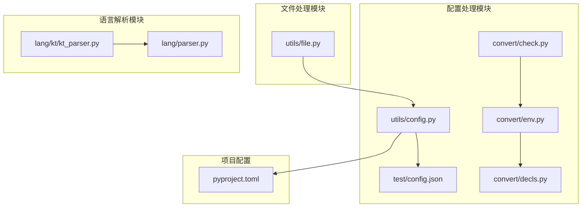
```mermaid
graph TB
subgraph "配置处理模块"
Config[utils/config.py]
TestCfg[test/config.json]
Check[convert/check.py]
Env[convert/env.py]
Decls[convert/decls.py]
end
subgraph "文件处理模块"
FileUtil[utils/file.py]
end
subgraph "语言解析模块"
KtParser[lang/kt/kt_parser.py]
ParserBase[lang/parser.py]
end
subgraph "项目配置"
PyProj[pyproject.toml]
end
Config --> TestCfg
Config --> PyProj
Check --> Env
Env --> Decls
FileUtil --> Config
KtParser --> ParserBase
```

**图表来源**
- [utils/config.py](file://utils/config.py#L1-L104)
- [convert/check.py](file://convert/check.py#L1-L89)
- [convert/env.py](file://convert/env.py#L1-L140)
- [test/config.json](file://test/config.json#L1-L41)
- [pyproject.toml](file://pyproject.toml#L1-L26)

**章节来源**
- [utils/config.py](file://utils/config.py#L1-L104)
- [convert/check.py](file://convert/check.py#L1-L89)
- [convert/env.py](file://convert/env.py#L1-L140)
- [pyproject.toml](file://pyproject.toml#L1-L26)

## 核心组件

### 配置数据模型

系统定义了三个核心数据类来表示配置结构：

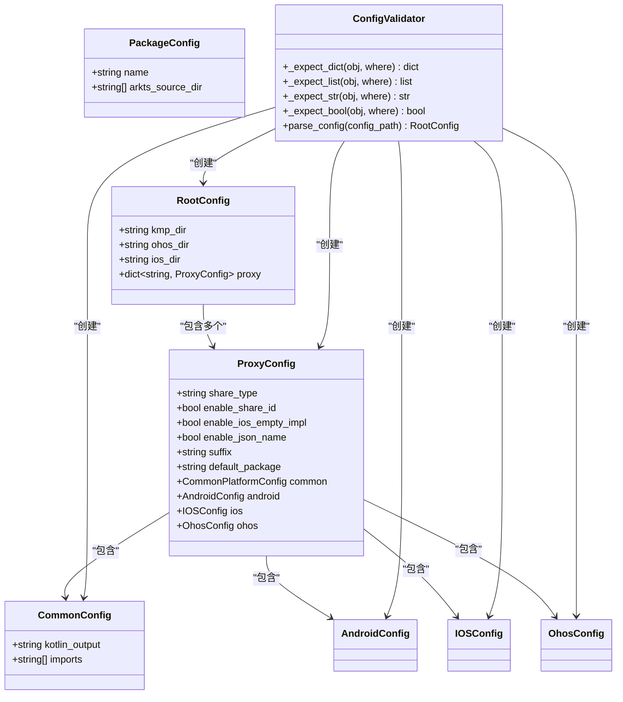
```mermaid
classDiagram
class CommonConfig {
+string kotlin_output
+string[] imports
}
class PackageConfig {
+string name
+string[] arkts_source_dir
}
class RootConfig {
+string kmp_dir
+string ohos_dir
+string ios_dir
+dict~string, ProxyConfig~ proxy
}
class ProxyConfig {
+string share_type
+bool enable_share_id
+bool enable_ios_empty_impl
+bool enable_json_name
+string suffix
+string default_package
+CommonPlatformConfig common
+AndroidConfig android
+IOSConfig ios
+OhosConfig ohos
}
class ConfigValidator {
+_expect_dict(obj, where) dict
+_expect_list(obj, where) list
+_expect_str(obj, where) str
+_expect_bool(obj, where) bool
+parse_config(config_path) RootConfig
}
RootConfig --> ProxyConfig : "包含多个"
ProxyConfig --> CommonConfig : "包含"
ProxyConfig --> AndroidConfig : "包含"
ProxyConfig --> IOSConfig : "包含"
ProxyConfig --> OhosConfig : "包含"
ConfigValidator --> RootConfig : "创建"
ConfigValidator --> ProxyConfig : "创建"
ConfigValidator --> CommonConfig : "创建"
ConfigValidator --> AndroidConfig : "创建"
ConfigValidator --> IOSConfig : "创建"
ConfigValidator --> OhosConfig : "创建"
```

**图表来源**
- [utils/config.py](file://utils/config.py#L9-L25)
- [utils/config.py](file://utils/config.py#L52-L64)
- [convert/check.py](file://convert/check.py#L1-L89)
- [convert/env.py](file://convert/env.py#L16-L28)

### 验证函数体系

系统提供了四个核心验证函数来确保配置数据的类型正确性：

| 函数名 | 功能描述 | 参数类型 | 返回类型 | 错误处理 |
|--------|----------|----------|----------|----------|
| `_expect_dict` | 验证对象是否为字典类型 | `object, where: str` | `dict` | 抛出 `ValueError` |
| `_expect_list` | 验证对象是否为列表类型 | `object, where: str` | `list` | 抛出 `ValueError` |
| `_expect_str` | 验证对象是否为字符串类型 | `object, where: str` | `str` | 抛出 `ValueError` |
| `_expect_bool` | 验证对象是否为布尔类型 | `object, where: str` | `bool` | 抛出 `ValueError` |

### shareType 配置验证

系统支持三种 shareType 配置模式：

| shareType | 功能描述 | enableShareId | enableIosEmptyImpl | enableJsonName | 有效字段 |
|-----------|----------|---------------|-------------------|----------------|----------|
| "proxy" | 代理模式，支持ShareId和iOS空实现 | 可选 | 条件可选 | 可选 | android、common、ios、ohos |
| "copy" | 复制模式，支持实体目录配置 | 默认False | 默认False | 默认False | common.entityDir、ohos |
| "basic" | 基础模式，最简配置 | 默认False | 默认False | 默认False | common、ohos |

### 增强的命名验证系统

系统新增了完善的命名验证功能，包含以下验证函数：

| 函数名 | 功能描述 | 参数类型 | 返回类型 | 错误处理 | 错误代码 |
|--------|----------|----------|----------|----------|----------|
| `check_kotlin_class_name` | 验证Kotlin类名合法性 | `str` | `None` | 抛出 `ValueError` | 1001 |
| `check_kotlin_package_name` | 验证Kotlin包名合法性 | `str` | `None` | 抛出 `ValueError` | 1002 |
| `check_kotlin_field_name` | 验证Kotlin字段名合法性 | `str` | `None` | 抛出 `ValueError` | 2001

**章节来源**
- [utils/config.py](file://utils/config.py#L27-L54)
- [utils/config.py](file://utils/config.py#L103-L106)
- [convert/check.py](file://convert/check.py#L1-L89)
- [convert/env.py](file://convert/env.py#L16-L28)

## 架构概览

配置解析系统采用完善的验证架构，从顶层到具体的字段验证：

```mermaid
sequenceDiagram
participant Client as "调用者"
participant Parser as "parse_config"
participant Validator as "验证函数"
participant NameValidator as "命名验证器"
participant JSON as "JSON解析器"
participant Model as "数据模型"
Client->>Parser : 调用 parse_config(config_path)
Parser->>JSON : 解析JSON文件
JSON-->>Parser : 返回原始数据
Parser->>Validator : _expect_dict(data, "$")
Validator-->>Parser : 返回根对象
Parser->>Validator : _expect_str(root.get("kmp.dir"), "$.kmp.dir")
Validator-->>Parser : 验证kmp.dir
Parser->>Validator : _expect_str(root.get("ohos.dir"), "$.ohos.dir")
Validator-->>Parser : 验证ohos.dir
Parser->>Validator : _expect_str(root.get("ios.dir"), "$.ios.dir")
Validator-->>Parser : 验证ios.dir
Parser->>Validator : _expect_dict(root.get("proxy"), "$.proxy")
Validator-->>Parser : 返回proxy对象
loop 遍历代理配置
Parser->>Validator : _expect_dict(proxy_val, f"$.proxy[{proxy_name!r}]")
Validator-->>Parser : 返回代理对象
Parser->>Validator : _expect_str(share_type_raw, f"$.proxy[{proxy_name!r}].shareType")
Validator-->>Parser : 验证shareType值
Parser->>Validator : _expect_bool(enable_share_id_value, f"$.proxy[{proxy_name!r}].enableShareId")
Validator-->>Parser : 条件验证enableShareId
Parser->>Validator : _expect_bool(enable_ios_empty_impl_value, f"$.proxy[{proxy_name!r}].enableIosEmptyImpl")
Validator-->>Parser : 条件验证enableIosEmptyImpl
Parser->>Validator : _expect_bool(enable_json_name_value, f"$.proxy[{proxy_name!r}].enableJsonName")
Validator-->>Parser : 条件验证enableJsonName
Parser->>Validator : _expect_str(suffix_value, f"$.proxy[{proxy_name!r}].suffix")
Validator-->>Parser : 验证suffix
Parser->>Validator : _expect_str(default_package_value, f"$.proxy[{proxy_name!r}].defaultPackage")
Validator-->>Parser : 验证defaultPackage
Parser->>Validator : _expect_dict(common_obj, f"$.proxy[{proxy_name!r}].common")
Validator-->>Parser : 验证common对象
Parser->>Validator : _expect_str(kotlin_out_data, f"$.proxy[{proxy_name!r}].common.kotlinOut")
Validator-->>Parser : 验证kotlinOut路径包含"commonMain"
Parser->>Validator : _expect_dict(entity_dir_data, f"$.proxy[{proxy_name!r}].common.entityDir")
Validator-->>Parser : 验证entityDir对象
Parser->>Validator : _expect_list(common_main_data, f"$.proxy[{proxy_name!r}].common.entityDir.commonMain")
Validator-->>Parser : 验证commonMain列表
Parser->>Validator : _expect_str(path, f"$.proxy[{proxy_name!r}].common.entityDir.commonMain[*]")
Validator-->>Parser : 验证路径包含"commonMain"
Parser->>Validator : _expect_list(ohos_arm64_main_data, f"$.proxy[{proxy_name!r}].common.entityDir.ohosArm64Main")
Validator-->>Parser : 验证ohosArm64Main列表
Parser->>Validator : _expect_str(path, f"$.proxy[{proxy_name!r}].common.entityDir.ohosArm64Main[*]")
Validator-->>Parser : 验证路径包含"ohosArm64Main"
Parser->>Validator : _expect_dict(ios_obj, f"$.proxy[{proxy_name!r}].ios")
Validator-->>Parser : 验证ios对象
Parser->>Validator : _expect_dict(ios_common_obj, f"$.proxy[{proxy_name!r}].ios.common")
Validator-->>Parser : 验证ios.common对象
Parser->>Validator : _expect_str(ios_kotlin_out, f"$.proxy[{proxy_name!r}].ios.common.kotlinOut")
Validator-->>Parser : 验证ios.kotlinOut包含"iosMain"
Parser->>Validator : _expect_dict(android_obj, f"$.proxy[{proxy_name!r}].android")
Validator-->>Parser : 验证android对象
Parser->>Validator : _expect_list(src_dirs, f"$.proxy[{proxy_name!r}].android.srcDir")
Validator-->>Parser : 验证srcDir列表
Parser->>Validator : _expect_str(src_dir, f"$.proxy[{proxy_name!r}].android.srcDir[*]")
Validator-->>Parser : 验证路径包含"androidMain"
Parser->>Validator : _expect_dict(ohos_common_obj, f"$.proxy[{proxy_name!r}].ohos.common")
Validator-->>Parser : 验证ohos.common对象
Parser->>Validator : _expect_str(kotlin_output, f"$.proxy[{proxy_name!r}].ohos.common.kotlinOut")
Validator-->>Parser : 验证ohos.kotlinOut包含"ohosArm64Main"
Parser->>Validator : _expect_list(import_data, f"$.proxy[{proxy_name!r}].ohos.common.import")
Validator-->>Parser : 验证imports列表
Parser->>Validator : _expect_str(import_item, f"$.proxy[{proxy_name!r}].ohos.common.import[*]")
Validator-->>Parser : 验证imports项
Parser->>Model : 创建数据模型实例
Model-->>Parser : 返回RootConfig
Parser-->>Client : 返回配置结果
```

**图表来源**
- [utils/config.py](file://utils/config.py#L318-L341)

## 详细组件分析

### parse_config 函数详解

`parse_config` 是整个配置验证系统的核心函数，负责执行完整的配置解析和验证流程：

#### 主要验证步骤

1. **文件读取和JSON解析**
   - 使用 `Path` 对象处理文件路径
   - 通过 `json.loads` 解析JSON内容
   - 设置UTF-8编码确保国际化支持

2. **根对象验证**
   - 验证顶层必须是字典对象
   - 验证必需字段 `kmp.dir` 存在
   - 处理可选字段的默认值（`ohos.dir`、`ios.dir`、`proxy`）

3. **代理配置验证**
   - 验证 `proxy` 字段存在且为字典
   - 遍历每个代理配置，验证其结构完整性
   - 对每个代理配置的 `shareType` 进行严格验证

4. **shareType 条件验证**
   - **"proxy" 模式**：验证所有条件字段（`enableShareId`、`enableIosEmptyImpl`、`enableJsonName`）
   - **"copy" 模式**：仅验证 `common.entityDir` 字段
   - **"basic" 模式**：仅验证基本配置字段

5. **路径验证规则**
   - 验证 `commonMain` 路径必须包含 "commonMain"
   - 验证 `ohosArm64Main` 路径必须包含 "ohosArm64Main"
   - **验证 iOS `kotlinOut` 路径必须包含 "iosMain"**（**更新**：这是本次变更的关键点）
   - 验证 Android `srcDir` 路径必须包含 "androidMain"
   - 验证 ohos `kotlinOut` 路径必须包含 "ohosArm64Main"

#### 错误定位机制

系统使用层次化的路径标识符来提供精确的错误位置信息：

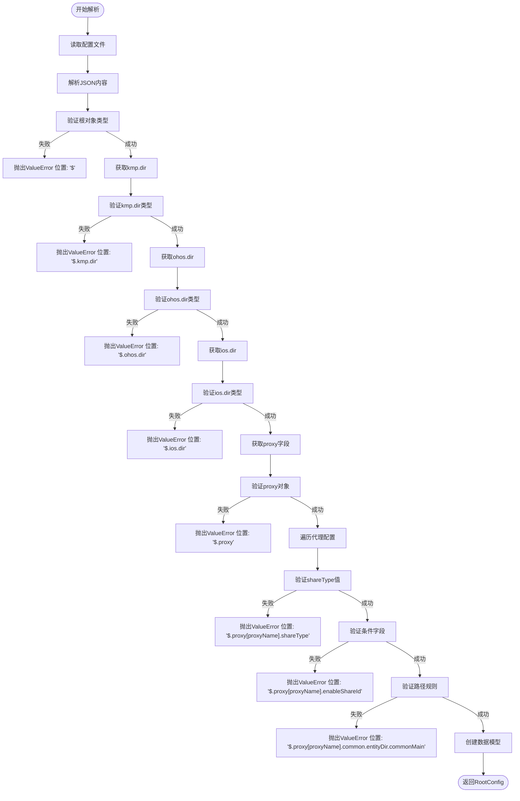
```mermaid
flowchart TD
Start([开始解析]) --> ReadFile["读取配置文件"]
ReadFile --> ParseJSON["解析JSON内容"]
ParseJSON --> ValidateRoot["验证根对象类型"]
ValidateRoot --> |失败| Error1["抛出ValueError 位置: '$'"]
ValidateRoot --> |成功| GetKmpDir["获取kmp.dir"]
GetKmpDir --> ValidateKmpDir["验证kmp.dir类型"]
ValidateKmpDir --> |失败| Error2["抛出ValueError 位置: '$.kmp.dir'"]
ValidateKmpDir --> |成功| GetOhosDir["获取ohos.dir"]
GetOhosDir --> ValidateOhosDir["验证ohos.dir类型"]
ValidateOhosDir --> |失败| Error3["抛出ValueError 位置: '$.ohos.dir'"]
ValidateOhosDir --> |成功| GetIosDir["获取ios.dir"]
GetIosDir --> ValidateIosDir["验证ios.dir类型"]
ValidateIosDir --> |失败| Error4["抛出ValueError 位置: '$.ios.dir'"]
ValidateIosDir --> |成功| GetProxy["获取proxy字段"]
GetProxy --> ValidateProxy["验证proxy对象"]
ValidateProxy --> |失败| Error5["抛出ValueError 位置: '$.proxy'"]
ValidateProxy --> |成功| IterateProxies["遍历代理配置"]
IterateProxies --> ValidateShareType["验证shareType值"]
ValidateShareType --> |失败| Error6["抛出ValueError 位置: '$.proxy[proxyName].shareType'"]
ValidateShareType --> |成功| ValidateConditionalFields["验证条件字段"]
ValidateConditionalFields --> |失败| Error7["抛出ValueError 位置: '$.proxy[proxyName].enableShareId'"]
ValidateConditionalFields --> |成功| ValidatePathRules["验证路径规则"]
ValidatePathRules --> |失败| Error8["抛出ValueError 位置: '$.proxy[proxyName].common.entityDir.commonMain'"]
ValidatePathRules --> |成功| CreateModel["创建数据模型"]
CreateModel --> End([返回RootConfig])
```

**图表来源**
- [utils/config.py](file://utils/config.py#L318-L341)

**章节来源**
- [utils/config.py](file://utils/config.py#L318-L341)

### shareType 条件验证机制

系统实现了基于 shareType 的条件字段验证机制：

#### shareType 类型验证

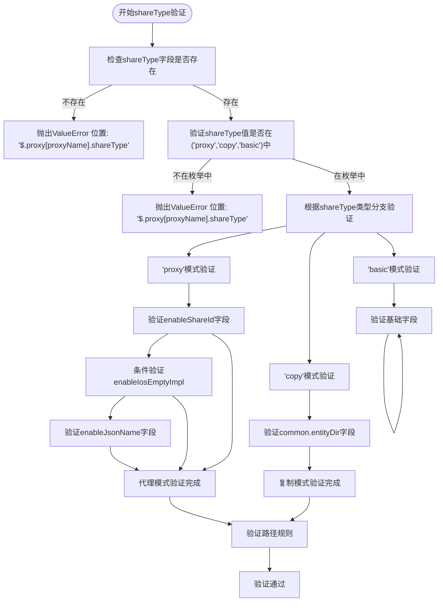
```mermaid
flowchart TD
Start([开始shareType验证]) --> CheckRequired["检查shareType字段是否存在"]
CheckRequired --> |不存在| Error1000["抛出ValueError 位置: '$.proxy[proxyName].shareType'"]
CheckRequired --> |存在| ValidateEnum["验证shareType值是否在('proxy','copy','basic')中"]
ValidateEnum --> |不在枚举中| Error1001["抛出ValueError 位置: '$.proxy[proxyName].shareType'"]
ValidateEnum --> |在枚举中| SwitchShareType["根据shareType类型分支验证"]
SwitchShareType --> ProxyMode["'proxy'模式验证"]
SwitchShareType --> CopyMode["'copy'模式验证"]
SwitchShareType --> BasicMode["'basic'模式验证"]
ProxyMode --> EnableShareId["验证enableShareId字段"]
EnableShareId --> EnableIosEmptyImpl["条件验证enableIosEmptyImpl"]
EnableIosEmptyImpl --> EnableJsonName["验证enableJsonName字段"]
CopyMode --> EntityDir["验证common.entityDir字段"]
BasicMode --> BasicValidation["验证基础字段"]
EnableShareId --> ProxyValidation["代理模式验证完成"]
EnableIosEmptyImpl --> ProxyValidation
EnableJsonName --> ProxyValidation
EntityDir --> CopyValidation["复制模式验证完成"]
BasicValidation --> BasicValidation
ProxyValidation --> PathValidation["验证路径规则"]
CopyValidation --> PathValidation
PathValidation --> Success["验证通过"]
```

**图表来源**
- [utils/config.py](file://utils/config.py#L136-L171)

#### 条件字段验证规则

| 字段名 | shareType="proxy" | shareType="copy" | shareType="basic" | 验证规则 |
|--------|------------------|------------------|------------------|----------|
| `enableShareId` | 可选，布尔值 | 默认False | 默认False | 仅在proxy模式下有效 |
| `enableIosEmptyImpl` | 条件可选，布尔值 | 默认False | 默认False | 仅在proxy模式且enableShareId=true时有效 |
| `enableJsonName` | 可选，布尔值 | 默认False | 默认False | 仅在proxy模式下有效 |
| `suffix` | 可选，字符串 | 无 | 无 | 仅在proxy模式下有效 |
| `defaultPackage` | 可选，字符串 | 无 | 无 | 仅在proxy模式下有效 |
| `android` | 可选，对象 | 无 | 无 | 仅在proxy模式下有效 |
| `common.entityDir` | 可选，对象 | 仅在copy模式下有效 | 无 | 仅在copy模式下验证 |
| `ios` | 可选，对象 | 无 | 无 | 仅在proxy模式下有效 |
| `ohos` | 必需，对象 | 必需，对象 | 必需，对象 | 所有模式均验证 |

**章节来源**
- [utils/config.py](file://utils/config.py#L136-L171)

### 路径验证规则

系统实现了严格的路径验证规则，确保各种路径包含特定关键词：

#### 路径验证规则

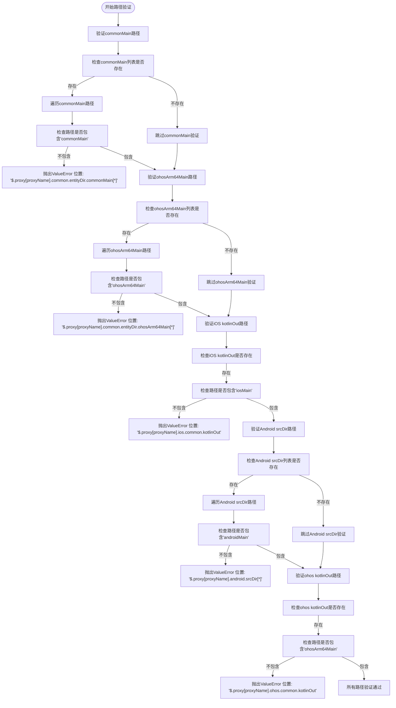
```mermaid
flowchart TD
Start([开始路径验证]) --> ValidateCommonMain["验证commonMain路径"]
ValidateCommonMain --> CheckCommonMain["检查commonMain列表是否存在"]
CheckCommonMain --> |存在| IterateCommonMain["遍历commonMain路径"]
CheckCommonMain --> |不存在| SkipCommonMain["跳过commonMain验证"]
IterateCommonMain --> CheckCommonMainContains["检查路径是否包含'commonMain'"]
CheckCommonMainContains --> |不包含| ErrorCommonMain["抛出ValueError 位置: '$.proxy[proxyName].common.entityDir.commonMain[*]'"]
CheckCommonMainContains --> |包含| ValidateOhosArm64Main["验证ohosArm64Main路径"]
ValidateOhosArm64Main --> CheckOhosArm64Main["检查ohosArm64Main列表是否存在"]
CheckOhosArm64Main --> |存在| IterateOhosArm64Main["遍历ohosArm64Main路径"]
CheckOhosArm64Main --> |不存在| SkipOhosArm64Main["跳过ohosArm64Main验证"]
IterateOhosArm64Main --> CheckOhosArm64MainContains["检查路径是否包含'ohosArm64Main'"]
CheckOhosArm64MainContains --> |不包含| ErrorOhosArm64Main["抛出ValueError 位置: '$.proxy[proxyName].common.entityDir.ohosArm64Main[*]'"]
CheckOhosArm64MainContains --> |包含| ValidateIosKotlinOut["验证iOS kotlinOut路径"]
ValidateIosKotlinOut --> CheckIosKotlinOut["检查iOS kotlinOut是否存在"]
CheckIosKotlinOut --> |存在| CheckIosKotlinOutContains["检查路径是否包含'iosMain'"]
CheckIosKotlinOutContains --> |不包含| ErrorIosKotlinOut["抛出ValueError 位置: '$.proxy[proxyName].ios.common.kotlinOut'"]
CheckIosKotlinOutContains --> |包含| ValidateAndroidSrcDir["验证Android srcDir路径"]
ValidateAndroidSrcDir --> CheckAndroidSrcDir["检查Android srcDir列表是否存在"]
CheckAndroidSrcDir --> |存在| IterateAndroidSrcDir["遍历Android srcDir路径"]
CheckAndroidSrcDir --> |不存在| SkipAndroidSrcDir["跳过Android srcDir验证"]
IterateAndroidSrcDir --> CheckAndroidSrcDirContains["检查路径是否包含'androidMain'"]
CheckAndroidSrcDirContains --> |不包含| ErrorAndroidSrcDir["抛出ValueError 位置: '$.proxy[proxyName].android.srcDir[*]'"]
CheckAndroidSrcDirContains --> |包含| ValidateOhosKotlinOut["验证ohos kotlinOut路径"]
ValidateOhosKotlinOut --> CheckOhosKotlinOut["检查ohos kotlinOut是否存在"]
CheckOhosKotlinOut --> |存在| CheckOhosKotlinOutContains["检查路径是否包含'ohosArm64Main'"]
CheckOhosKotlinOutContains --> |不包含| ErrorOhosKotlinOut["抛出ValueError 位置: '$.proxy[proxyName].ohos.common.kotlinOut'"]
CheckOhosKotlinOutContains --> |包含| Success["所有路径验证通过"]
SkipCommonMain --> ValidateOhosArm64Main
SkipOhosArm64Main --> ValidateIosKotlinOut
SkipAndroidSrcDir --> ValidateOhosKotlinOut
```

**图表来源**
- [utils/config.py](file://utils/config.py#L203-L270)

#### 路径验证规则详情

| 配置路径 | 必需性 | 验证规则 | 错误位置 |
|----------|--------|----------|----------|
| `common.entityDir.commonMain[*]` | 可选 | 路径必须包含 "commonMain" | `$.proxy[proxyName].common.entityDir.commonMain[*]` |
| `common.entityDir.ohosArm64Main[*]` | 可选 | 路径必须包含 "ohosArm64Main" | `$.proxy[proxyName].common.entityDir.ohosArm64Main[*]` |
| `ios.common.kotlinOut` | 可选 | 路径必须包含 "iosMain" | `$.proxy[proxyName].ios.common.kotlinOut` |
| `android.srcDir[*]` | 可选 | 路径必须包含 "androidMain" | `$.proxy[proxyName].android.srcDir[*]` |
| `ohos.common.kotlinOut` | 必需 | 路径必须包含 "ohosArm64Main" | `$.proxy[proxyName].ohos.common.kotlinOut` |

**更新** **iOS 路径验证规则修正**：根据 test/config.json 的实际变更，iOS Kotlin 输出路径现在必须包含 "iosMain" 而不是 "ohosArm64Main"。这一变更确保了 iOS 平台的 Kotlin 代码输出路径正确性。

**章节来源**
- [utils/config.py](file://utils/config.py#L203-L270)
- [test/config.json](file://test/config.json#L34-L38)

### 增强的命名验证系统

系统新增了完善的命名验证功能，包含以下三个核心验证函数：

#### 类名验证规则

`check_kotlin_class_name` 函数提供了全面的Kotlin类名验证：

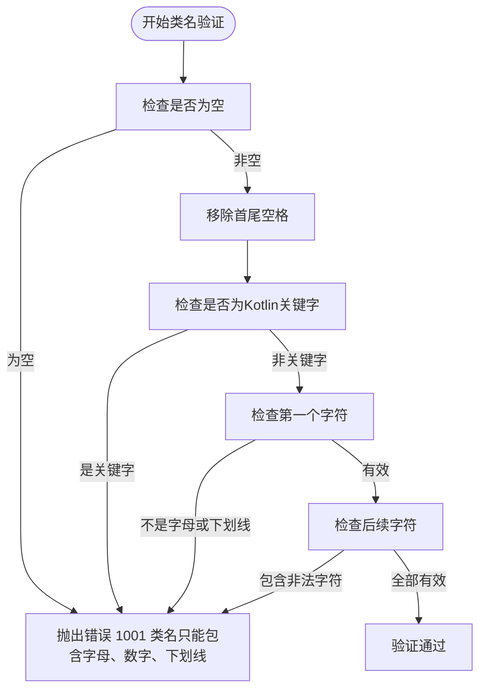
```mermaid
flowchart TD
Start([开始类名验证]) --> CheckEmpty["检查是否为空"]
CheckEmpty --> |为空| Error1001["抛出错误 1001 类名不能为空"]
CheckEmpty --> |非空| StripSpace["移除首尾空格"]
StripSpace --> CheckKeyword["检查是否为Kotlin关键字"]
CheckKeyword --> |是关键字| Error1001["抛出错误 1001 类名不能为Kotlin关键字"]
CheckKeyword --> |非关键字| CheckFirstChar["检查第一个字符"]
CheckFirstChar --> |不是字母或下划线| Error1001["抛出错误 1001 类名必须以字母或下划线开头"]
CheckFirstChar --> |有效| CheckRestChars["检查后续字符"]
CheckRestChars --> |包含非法字符| Error1001["抛出错误 1001 类名只能包含字母、数字、下划线"]
CheckRestChars --> |全部有效| Success["验证通过"]
```

**图表来源**
- [convert/check.py](file://convert/check.py#L5-L24)

#### 包名验证规则

`check_kotlin_package_name` 函数提供了严格的Kotlin包名验证：

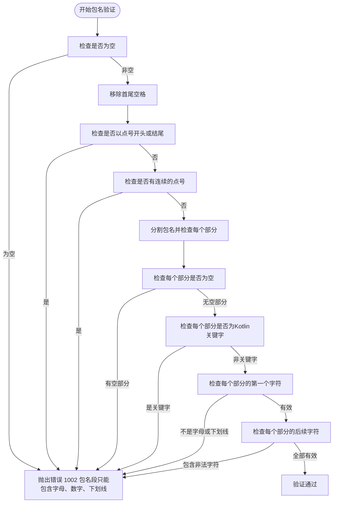
```mermaid
flowchart TD
Start([开始包名验证]) --> CheckEmpty["检查是否为空"]
CheckEmpty --> |为空| Error1002["抛出错误 1002 包名不能为空"]
CheckEmpty --> |非空| StripSpace["移除首尾空格"]
StripSpace --> CheckDotStartEnd["检查是否以点号开头或结尾"]
CheckDotStartEnd --> |是| Error1002["抛出错误 1002 包名不能以点号开头或结尾"]
CheckDotStartEnd --> |否| CheckConsecutiveDots["检查是否有连续的点号"]
CheckConsecutiveDots --> |是| Error1002["抛出错误 1002 包名不能包含连续的点号"]
CheckConsecutiveDots --> |否| SplitParts["分割包名并检查每个部分"]
SplitParts --> CheckPartEmpty["检查每个部分是否为空"]
CheckPartEmpty --> |有空部分| Error1002["抛出错误 1002 包名包含空段"]
CheckPartEmpty --> |无空部分| CheckPartKeyword["检查每个部分是否为Kotlin关键字"]
CheckPartKeyword --> |是关键字| Error1002["抛出错误 1002 包名段不能为Kotlin关键字"]
CheckPartKeyword --> |非关键字| CheckPartFirstChar["检查每个部分的第一个字符"]
CheckPartFirstChar --> |不是字母或下划线| Error1002["抛出错误 1002 包名段必须以字母或下划线开头"]
CheckPartFirstChar --> |有效| CheckPartRestChars["检查每个部分的后续字符"]
CheckPartRestChars --> |包含非法字符| Error1002["抛出错误 1002 包名段只能包含字母、数字、下划线"]
CheckPartRestChars --> |全部有效| Success["验证通过"]
```

**图表来源**
- [convert/check.py](file://convert/check.py#L26-L60)

#### 字段名验证规则

`check_kotlin_field_name` 函数提供了灵活的Kotlin字段名验证：

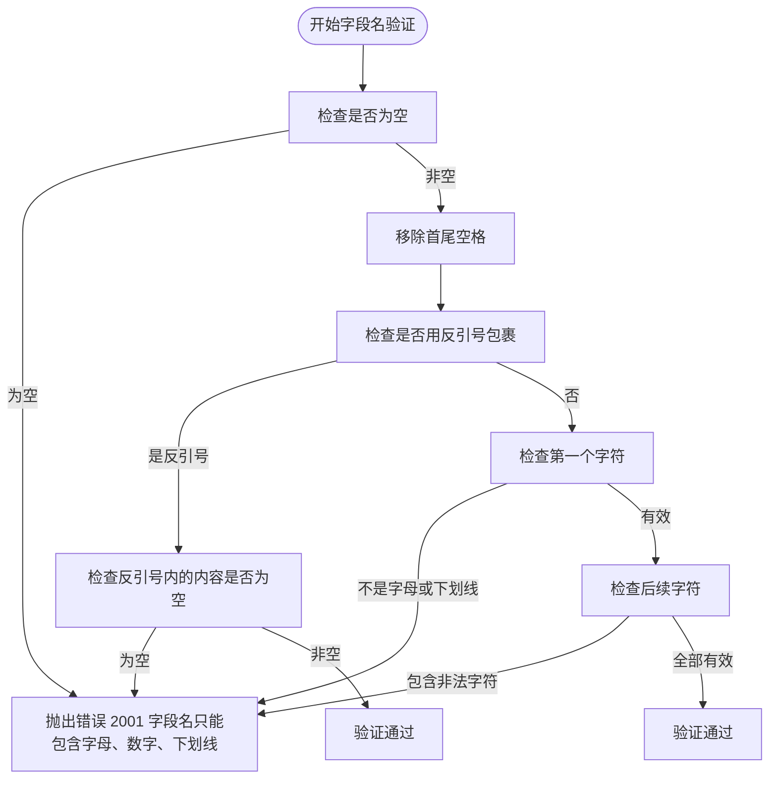
```mermaid
flowchart TD
Start([开始字段名验证]) --> CheckEmpty["检查是否为空"]
CheckEmpty --> |为空| Error2001["抛出错误 2001 字段名不能为空"]
CheckEmpty --> |非空| StripSpace["移除首尾空格"]
StripSpace --> CheckBackticks["检查是否用反引号包裹"]
CheckBackticks --> |是反引号| CheckEmptyInBackticks["检查反引号内的内容是否为空"]
CheckEmptyInBackticks --> |为空| Error2001["抛出错误 2001 反引号内的字段名不能为空"]
CheckEmptyInBackticks --> |非空| ReturnSuccess["验证通过"]
CheckBackticks --> |否| CheckFirstChar["检查第一个字符"]
CheckFirstChar --> |不是字母或下划线| Error2001["抛出错误 2001 字段名必须以字母或下划线开头"]
CheckFirstChar --> |有效| CheckRestChars["检查后续字符"]
CheckRestChars --> |包含非法字符| Error2001["抛出错误 2001 字段名只能包含字母、数字、下划线"]
CheckRestChars --> |全部有效| Success["验证通过"]
```

**图表来源**
- [convert/check.py](file://convert/check.py#L62-L88)

**章节来源**
- [convert/check.py](file://convert/check.py#L1-L89)

### 重复检测机制

系统实现了多层次的重复检测机制，确保配置的唯一性和一致性：

#### ShareId 冲突检测

`get_id_and_name_class_map` 函数实现了ShareId的包级别冲突检测：

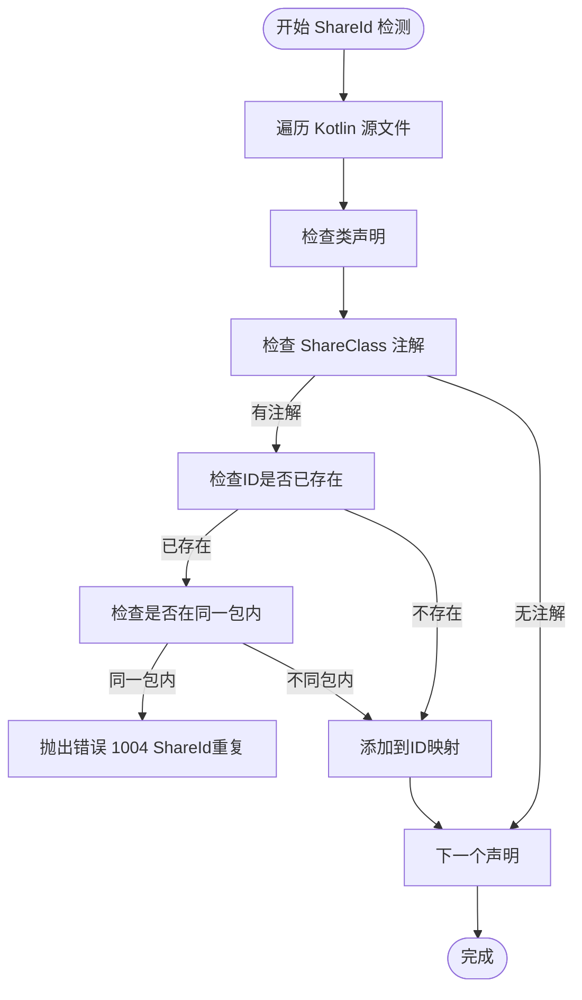
```mermaid
flowchart TD
Start([开始 ShareId 检测]) --> LoopSfs["遍历 Kotlin 源文件"]
LoopSfs --> CheckDecls["检查类声明"]
CheckDecls --> CheckShareClass["检查 ShareClass 注解"]
CheckShareClass --> |有注解| CheckIdExists["检查ID是否已存在"]
CheckIdExists --> |已存在| CheckSamePackage["检查是否在同一包内"]
CheckSamePackage --> |同一包内| Error1004["抛出错误 1004 ShareId重复"]
CheckSamePackage --> |不同包内| AddToMap["添加到ID映射"]
CheckIdExists --> |不存在| AddToMap
CheckShareClass --> |无注解| NextDecl["下一个声明"]
AddToMap --> NextDecl
NextDecl --> End([完成])
```

**图表来源**
- [convert/env.py](file://convert/env.py#L30-L51)

#### 字段ID重复检测

`get_kt_shared_class_field_name_map` 函数实现了字段ID的类内重复检测：

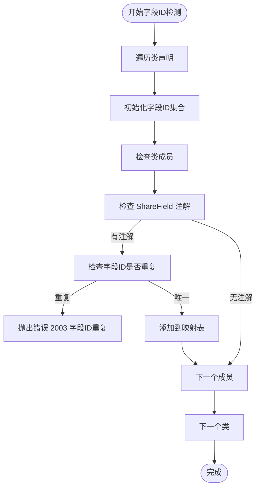
```mermaid
flowchart TD
Start([开始字段ID检测]) --> LoopClasses["遍历类声明"]
LoopClasses --> InitUsedIds["初始化字段ID集合"]
InitUsedIds --> CheckMembers["检查类成员"]
CheckMembers --> CheckShareField["检查 ShareField 注解"]
CheckShareField --> |有注解| CheckFieldId["检查字段ID是否重复"]
CheckFieldId --> |重复| Error2003["抛出错误 2003 字段ID重复"]
CheckFieldId --> |唯一| AddToMap["添加到映射表"]
CheckShareField --> |无注解| NextMember["下一个成员"]
AddToMap --> NextMember
NextMember --> NextClass["下一个类"]
NextClass --> End([完成])
```

**图表来源**
- [convert/env.py](file://convert/env.py#L114-L134)

#### 类名重复检测

`get_class_rename_map` 函数实现了同包内类名的重复检测：

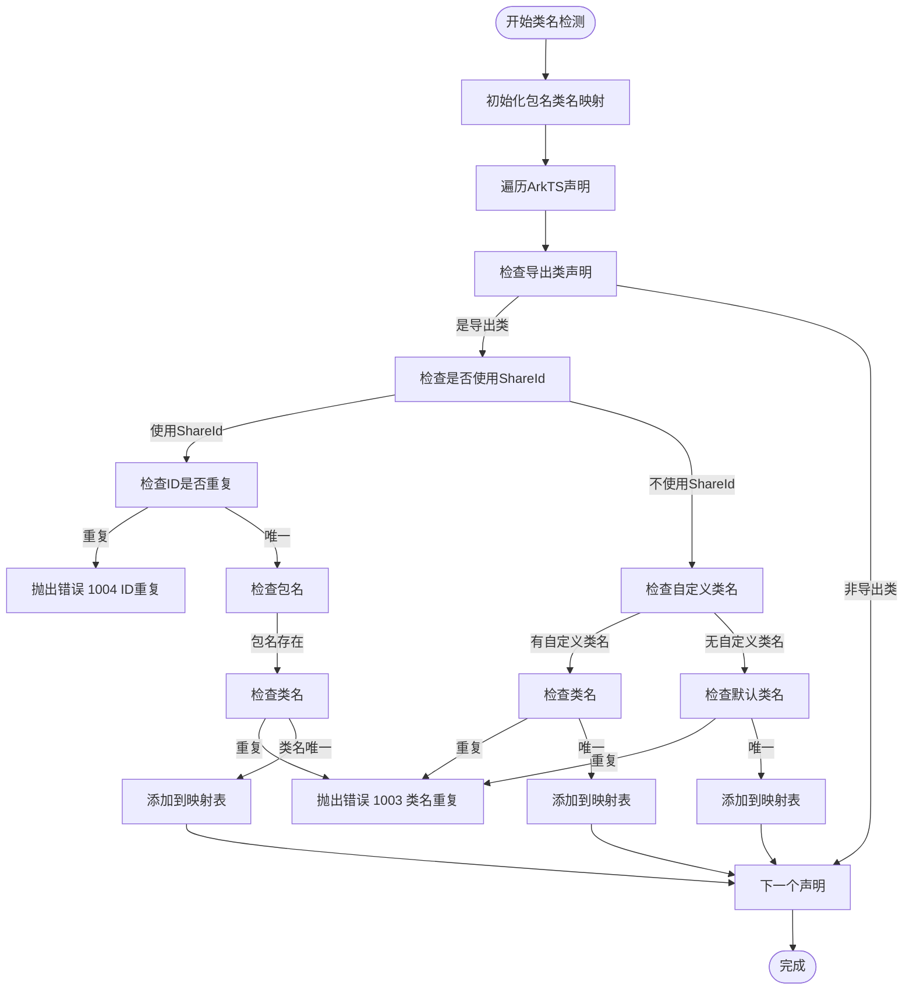
```mermaid
flowchart TD
Start([开始类名检测]) --> InitClassNames["初始化包名类名映射"]
InitClassNames --> LoopDecls["遍历ArkTS声明"]
LoopDecls --> CheckExportClass["检查导出类声明"]
CheckExportClass --> |是导出类| CheckId["检查是否使用ShareId"]
CheckId --> |使用ShareId| CheckIdExists["检查ID是否重复"]
CheckIdExists --> |重复| Error1004["抛出错误 1004 ID重复"]
CheckIdExists --> |唯一| CheckPackageName["检查包名"]
CheckPackageName --> |包名存在| CheckClassName["检查类名"]
CheckClassName --> |重复| Error1003["抛出错误 1003 类名重复"]
CheckClassName --> |类名唯一| AddToMap["添加到映射表"]
CheckId --> |不使用ShareId| CheckCustomName["检查自定义类名"]
CheckCustomName --> |有自定义类名| CheckClassName2["检查类名"]
CheckClassName2 --> |重复| Error1003["抛出错误 1003 类名重复"]
CheckClassName2 --> |唯一| AddToMap2["添加到映射表"]
CheckCustomName --> |无自定义类名| CheckDefaultName["检查默认类名"]
CheckDefaultName --> |重复| Error1003["抛出错误 1003 类名重复"]
CheckDefaultName --> |唯一| AddToMap3["添加到映射表"]
CheckExportClass --> |非导出类| NextDecl["下一个声明"]
AddToMap --> NextDecl
AddToMap2 --> NextDecl
AddToMap3 --> NextDecl
NextDecl --> End([完成])
```

**图表来源**
- [convert/env.py](file://convert/env.py#L53-L108)

**章节来源**
- [convert/env.py](file://convert/env.py#L30-L139)

### 字段名验证与重复检测系统

系统实现了完善的字段名验证和重复检测功能：

#### 字段信息获取

`get_prop_info` 函数提供了字段信息的获取和验证：

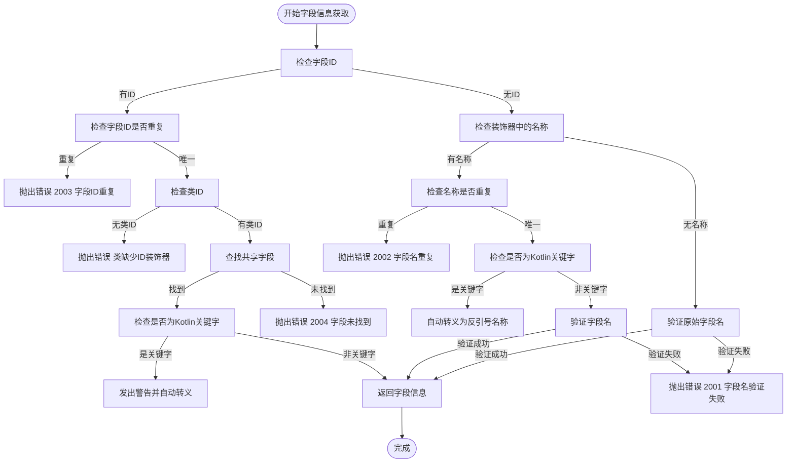
```mermaid
flowchart TD
Start([开始字段信息获取]) --> CheckFieldId["检查字段ID"]
CheckFieldId --> |有ID| CheckFieldIdDup["检查字段ID是否重复"]
CheckFieldIdDup --> |重复| Error2003["抛出错误 2003 字段ID重复"]
CheckFieldIdDup --> |唯一| CheckClassId["检查类ID"]
CheckClassId --> |无类ID| ErrorClassId["抛出错误 类缺少ID装饰器"]
CheckClassId --> |有类ID| CheckSharedField["查找共享字段"]
CheckSharedField --> |找到| CheckKeyword["检查是否为Kotlin关键字"]
CheckKeyword --> |是关键字| WarnKeyword["发出警告并自动转义"]
CheckKeyword --> |非关键字| ReturnInfo["返回字段信息"]
CheckSharedField --> |未找到| Error2004["抛出错误 2004 字段未找到"]
CheckFieldId --> |无ID| CheckNameInDeco["检查装饰器中的名称"]
CheckNameInDeco --> |有名称| CheckNameDup["检查名称是否重复"]
CheckNameDup --> |重复| Error2002["抛出错误 2002 字段名重复"]
CheckNameDup --> |唯一| CheckKeyword2["检查是否为Kotlin关键字"]
CheckKeyword2 --> |是关键字| EscapeName["自动转义为反引号名称"]
CheckKeyword2 --> |非关键字| ValidateName["验证字段名"]
CheckNameInDeco --> |无名称| ValidateName2["验证原始字段名"]
ValidateName --> |验证失败| Error2001["抛出错误 2001 字段名验证失败"]
ValidateName2 --> |验证失败| Error2001["抛出错误 2001 字段名验证失败"]
ValidateName --> |验证成功| ReturnInfo
ValidateName2 --> |验证成功| ReturnInfo
ReturnInfo --> End([完成])
```

**图表来源**
- [convert/decls.py](file://convert/decls.py#L187-L238)

#### 错误处理机制改进

**更新** 字段未找到和ShareId验证从警告升级为ValueError异常：

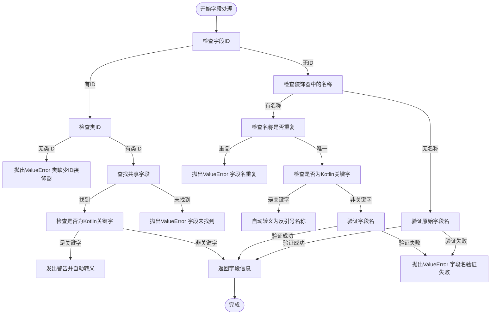
```mermaid
flowchart TD
Start([开始字段处理]) --> CheckFieldId["检查字段ID"]
CheckFieldId --> |有ID| CheckClassId["检查类ID"]
CheckClassId --> |无类ID| ErrorClassId["抛出ValueError 类缺少ID装饰器"]
CheckClassId --> |有类ID| CheckSharedField["查找共享字段"]
CheckSharedField --> |找到| CheckKeyword["检查是否为Kotlin关键字"]
CheckKeyword --> |是关键字| WarnKeyword["发出警告并自动转义"]
CheckKeyword --> |非关键字| ReturnInfo["返回字段信息"]
CheckSharedField --> |未找到| Error2004["抛出ValueError 字段未找到"]
CheckFieldId --> |无ID| CheckNameInDeco["检查装饰器中的名称"]
CheckNameInDeco --> |有名称| CheckNameDup["检查名称是否重复"]
CheckNameDup --> |重复| Error2002["抛出ValueError 字段名重复"]
CheckNameDup --> |唯一| CheckKeyword2["检查是否为Kotlin关键字"]
CheckKeyword2 --> |是关键字| EscapeName["自动转义为反引号名称"]
CheckKeyword2 --> |非关键字| ValidateName["验证字段名"]
CheckNameInDeco --> |无名称| ValidateName2["验证原始字段名"]
ValidateName --> |验证失败| Error2001["抛出ValueError 字段名验证失败"]
ValidateName2 --> |验证失败| Error2001["抛出ValueError 字段名验证失败"]
ValidateName --> |验证成功| ReturnInfo
ValidateName2 --> |验证成功| ReturnInfo
ReturnInfo --> End([完成])
```

**图表来源**
- [convert/decls.py](file://convert/decls.py#L213-L257)

#### 警告系统

系统实现了智能的警告系统，用于处理Kotlin关键字字段名：

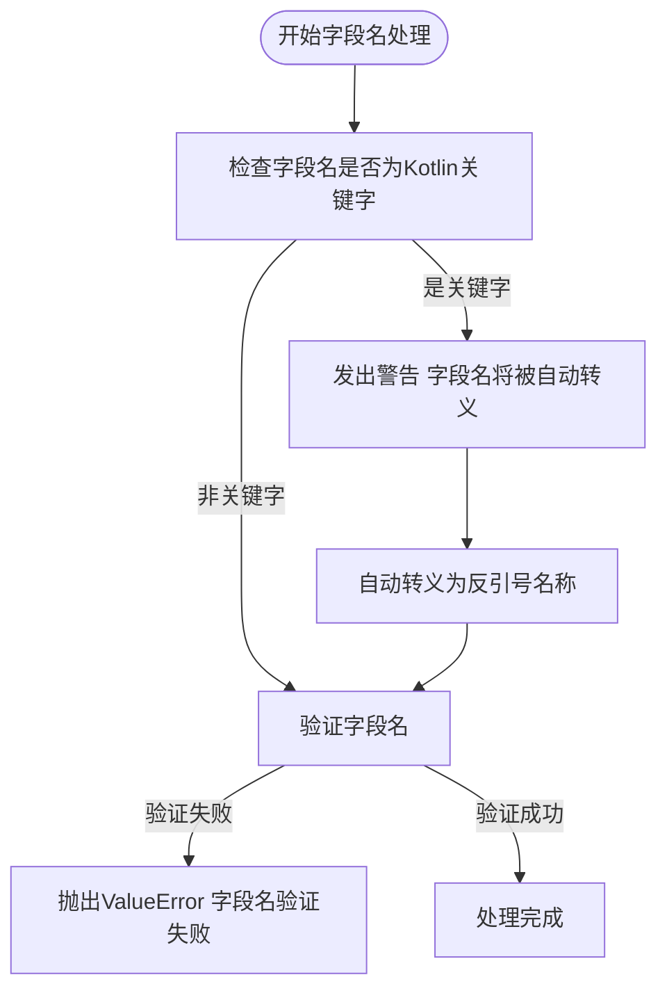
```mermaid
flowchart TD
Start([开始字段名处理]) --> CheckKeyword["检查字段名是否为Kotlin关键字"]
CheckKeyword --> |是关键字| WarnKeyword["发出警告 字段名将被自动转义"]
WarnKeyword --> EscapeName["自动转义为反引号名称"]
CheckKeyword --> |非关键字| ValidateName["验证字段名"]
EscapeName --> ValidateName
ValidateName --> |验证失败| Error2001["抛出ValueError 字段名验证失败"]
ValidateName --> |验证成功| Success["处理完成"]
```

**图表来源**
- [convert/decls.py](file://convert/decls.py#L199-L205)

**章节来源**
- [convert/decls.py](file://convert/decls.py#L187-L238)

### 验证函数实现原理

#### _expect_dict 函数

该函数实现了字典类型的严格验证：

```mermaid
flowchart TD
StartDict([_expect_dict调用]) --> CheckType{"检查对象类型"}
CheckType --> |isinstance(obj, dict)| ReturnObj["返回原对象"]
CheckType --> |不是字典| RaiseError["抛出ValueError"]
RaiseError --> ErrorMsg["错误信息格式: Expected object at {where}, got {type(obj).__name__}"]
ErrorMsg --> EndDict([结束])
ReturnObj --> EndDict
```

**图表来源**
- [utils/config.py](file://utils/config.py#L85-L88)

#### _expect_list 函数

列表类型验证遵循相同的模式：

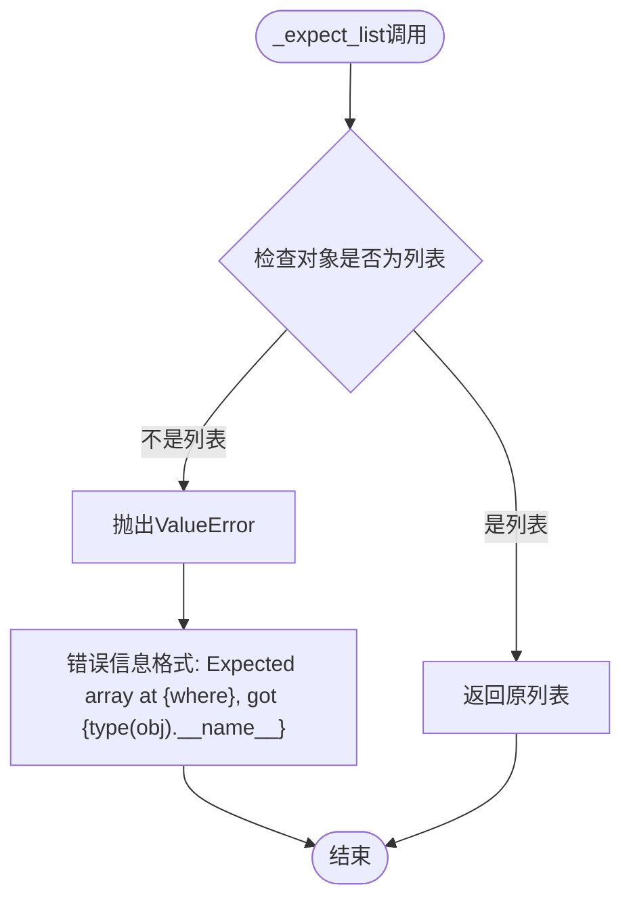
```mermaid
flowchart TD
StartList([_expect_list调用]) --> CheckListType{"检查对象是否为列表"}
CheckListType --> |是列表| ReturnList["返回原列表"]
CheckListType --> |不是列表| RaiseListError["抛出ValueError"]
RaiseListError --> ListErrorMsg["错误信息格式: Expected array at {where}, got {type(obj).__name__}"]
ListErrorMsg --> EndList([结束])
ReturnList --> EndList
```

**图表来源**
- [utils/config.py](file://utils/config.py#L91-L94)

#### _expect_str 函数

字符串类型验证同样保持一致性：

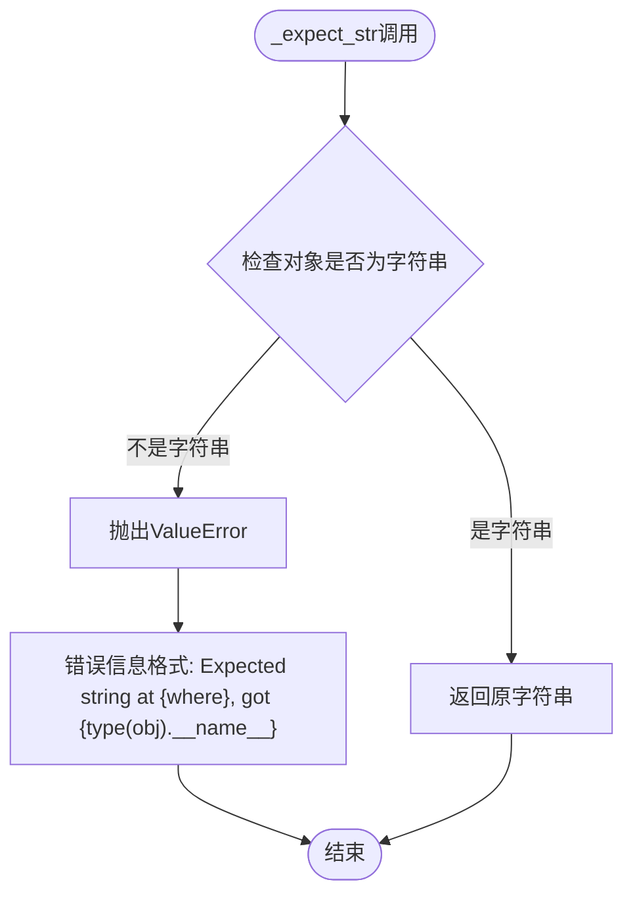
```mermaid
flowchart TD
StartStr([_expect_str调用]) --> CheckStrType{"检查对象是否为字符串"}
CheckStrType --> |是字符串| ReturnStr["返回原字符串"]
CheckStrType --> |不是字符串| RaiseStrError["抛出ValueError"]
RaiseStrError --> StrErrorMsg["错误信息格式: Expected string at {where}, got {type(obj).__name__}"]
StrErrorMsg --> EndStr([结束])
ReturnStr --> EndStr
```

**图表来源**
- [utils/config.py](file://utils/config.py#L97-L100)

#### _expect_bool 函数

布尔类型验证遵循相同的模式：

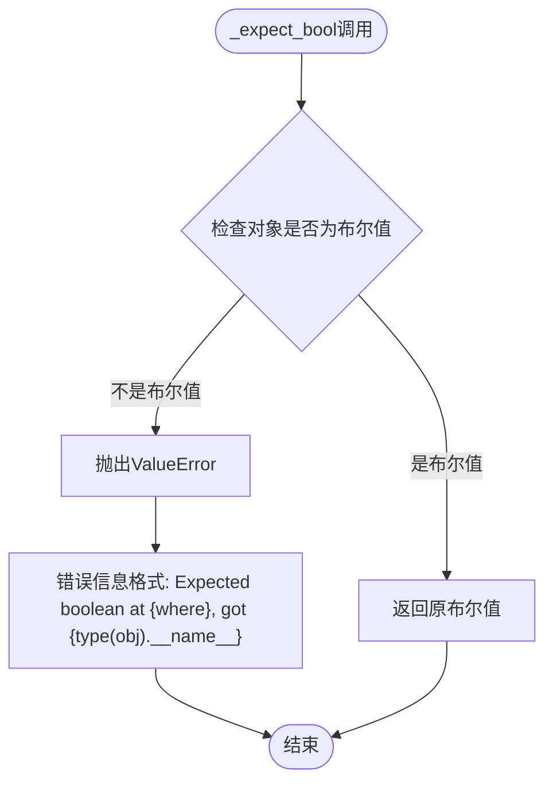
```mermaid
flowchart TD
StartBool([_expect_bool调用]) --> CheckBoolType{"检查对象是否为布尔值"}
CheckBoolType --> |是布尔值| ReturnBool["返回原布尔值"]
CheckBoolType --> |不是布尔值| RaiseBoolError["抛出ValueError"]
RaiseBoolError --> BoolErrorMsg["错误信息格式: Expected boolean at {where}, got {type(obj).__name__}"]
BoolErrorMsg --> EndBool([结束])
ReturnBool --> EndBool
```

**图表来源**
- [utils/config.py](file://utils/config.py#L103-L106)

**章节来源**
- [utils/config.py](file://utils/config.py#L85-L106)

### 错误处理机制

#### 异常类型和层次

系统采用了完善的异常处理机制，包含多种错误代码：


```mermaid
graph TB
subgraph "Python内置异常"
ValueError[ValueError]
TypeError[TypeError]
FileNotFoundError[FileNotFoundError]
end
subgraph "配置验证异常"
ConfigError[配置验证错误]
end
subgraph "命名验证错误"
ClassError[类名错误 1001]
PackageError[包名错误 1002]
FieldError[字段名错误 2001]
end
subgraph "重复检测错误"
DuplicateClassError[类名重复 1003]
DuplicateIdError[ID重复 1004]
DuplicateFieldIdError[字段ID重复 2003]
end
subgraph "ShareId相关错误"
ShareIdNotAllowedError[ShareId不允许 1007]
ShareIdNotFoundError[ShareId未找到 1008]
ShareIdConflictError[ShareId冲突 1004]
end
subgraph "配置格式错误"
ConfigFormatError[配置格式错误 1009]
end
ConfigError --> ValueError
ConfigError --> TypeError
ConfigError --> FileNotFoundError
ClassError --> ValueError
PackageError --> ValueError
FieldError --> ValueError
DuplicateClassError --> ValueError
DuplicateIdError --> ValueError
DuplicateFieldIdError --> ValueError
ShareIdNotAllowedError --> ValueError
ShareIdNotFoundError --> ValueError
ShareIdConflictError --> ValueError
ConfigFormatError --> ValueError
```

**图表来源**
- [utils/config.py](file://utils/config.py#L25-L26)
- [convert/check.py](file://convert/check.py#L1-L89)
- [convert/env.py](file://convert/env.py#L44-L49)

#### 错误信息格式规范

**更新** 所有验证错误都遵循统一的格式规范：

```
[Error {code}] {错误描述}
```

错误代码分类：
- **1001**: 类名验证错误
- **1002**: 包名验证错误  
- **1003**: 类名重复错误
- **1004**: ShareId/ID重复错误
- **1007**: ShareId不允许错误
- **1008**: ShareId未找到错误
- **1009**: 配置格式错误（id和name/package同时指定）
- **2001**: 字段名验证错误
- **2002**: 字段名重复错误
- **2003**: 字段ID重复错误
- **2004**: 字段ID查找错误

**章节来源**
- [convert/check.py](file://convert/check.py#L1-L89)
- [convert/env.py](file://convert/env.py#L44-L49)

### 边界情况处理

#### 空值和缺失字段处理

系统对各种边界情况进行严格处理：

1. **空字符串处理**：字符串字段允许为空字符串
2. **None值处理**：使用 `get()` 方法获取字段时，如果不存在返回 `None`
3. **空列表处理**：导入列表和源码目录列表可以为空
4. **键名验证**：包配置的键名作为字典的键直接使用
5. **shareType 默认值**：对于 "copy" 和 "basic" 模式，条件字段使用默认值 False

#### 类型转换和兼容性

- **整数到字符串**：配置系统不进行隐式类型转换
- **布尔值处理**：布尔值在JSON中保持原样
- **Unicode支持**：使用UTF-8编码确保国际化支持

#### Kotlin 关键字处理

**更新** 系统实现了智能的Kotlin关键字处理机制：

1. **字段名关键字检查**：自动检测并警告Kotlin关键字字段名
2. **自动转义机制**：将关键字字段名自动转义为反引号形式
3. **保留关键字列表**：包含完整的Kotlin关键字集合
4. **字段未找到处理**：从警告升级为ValueError异常

#### 字段名验证边界情况

系统处理了多种字段名验证的特殊场景：
- **反引号包裹的字段名**：支持反引号包裹的字段名，但要求内部不能为空
- **空反引号内容检查**：防止空的反引号字段名
- **字段ID优先级处理**：优先使用装饰器中的字段ID
- **警告系统增强**：提供详细的错误信息和修复建议
- **ShareId验证改进**：从警告升级为ValueError异常

#### shareType 条件验证边界情况

系统处理了多种 shareType 条件验证的特殊场景：
- **条件字段默认值**：在 "copy" 和 "basic" 模式下，条件字段使用默认值 False
- **enableIosEmptyImpl 条件验证**：仅在 enableShareId 为 True 时验证
- **路径验证范围**：仅在相应模式下验证对应的路径字段

#### 路径验证边界情况

系统处理了多种路径验证的特殊场景：
- **路径包含检查**：使用 "in" 操作符检查路径是否包含特定关键词
- **空列表跳过验证**：如果路径列表不存在，则跳过验证
- **路径格式灵活性**：允许路径包含其他字符，只要包含必需关键词即可
- **iOS 路径验证修正**：**更新** iOS 路径现在必须包含 "iosMain" 而不是 "ohosArm64Main"

**章节来源**
- [utils/config.py](file://utils/config.py#L66-L83)
- [utils/config.py](file://utils/config.py#L136-L171)
- [utils/config.py](file://utils/config.py#L203-L270)
- [convert/check.py](file://convert/check.py#L1-L89)
- [convert/env.py](file://convert/env.py#L1-L140)

## 依赖关系分析

### 模块间依赖

```mermaid
graph TB
subgraph "核心配置模块"
ConfigPy[utils/config.py]
TestJson[test/config.json]
end
subgraph "验证模块"
CheckPy[convert/check.py]
EnvPy[convert/env.py]
DeclsPy[convert/decls.py]
end
subgraph "辅助工具模块"
FilePy[utils/file.py]
end
subgraph "语言解析模块"
KtParserPy[lang/kt/kt_parser.py]
ParserBasePy[lang/parser.py]
end
subgraph "外部依赖"
JsonLib[json模块]
PathLib[pathlib.Path]
DataclassLib[dataclasses]
SysLib[sys模块]
TreeSitter[tree-sitter-kotlin]
TreeSitterArts[tree-sitter-arkts-open]
end
ConfigPy --> JsonLib
ConfigPy --> PathLib
ConfigPy --> DataclassLib
ConfigPy --> SysLib
ConfigPy --> TestJson
CheckPy --> TreeSitter
CheckPy --> TreeSitterArts
EnvPy --> CheckPy
EnvPy --> DeclsPy
DeclsPy --> CheckPy
FilePy --> PathLib
KtParserPy --> ParserBasePy
KtParserPy --> JsonLib
KtParserPy --> PathLib
```

**图表来源**
- [utils/config.py](file://utils/config.py#L1-L7)
- [convert/check.py](file://convert/check.py#L1-L4)
- [convert/env.py](file://convert/env.py#L1-L4)
- [convert/decls.py](file://convert/decls.py#L1-L20)
- [utils/file.py](file://utils/file.py#L1-L32)
- [lang/kt/kt_parser.py](file://lang/kt/kt_parser.py#L1-L8)

### 外部依赖管理

项目使用 Poetry 进行依赖管理，主要依赖包括：

- **Python 3.13+**：运行时环境要求
- **typing-extensions**：类型注解扩展
- **tree-sitter**：通用解析器框架
- **tree-sitter-kotlin**：Kotlin语言支持
- **tree-sitter-arkts-open**：ArkTS语言支持

**章节来源**
- [pyproject.toml](file://pyproject.toml#L15-L21)

## 性能考虑

### 内存使用优化

1. **延迟加载**：配置文件仅在需要时读取和解析
2. **不可变数据结构**：使用 `frozen=True` 的数据类确保内存安全
3. **生成器表达式**：列表推导式用于高效的数据处理
4. **字段名缓存**：字段名唯一性检查结果的缓存机制
5. **重复检测缓存**：ShareId和类名重复检测结果的缓存
6. **警告系统优化**：智能警告系统减少不必要的警告
7. **路径验证优化**：使用简单的字符串包含检查而非正则表达式

### 时间复杂度分析

- **整体复杂度**：O(n)，其中 n 是配置文件中元素的总数
- **空间复杂度**：O(n)，用于存储解析后的配置数据
- **验证复杂度**：O(1) 每个字段的验证操作
- **类名映射构建**：O(m) 其中 m 是声明的数量
- **ShareId 映射构建**：O(k) 其中 k 是字段数量
- **重复检测复杂度**：O(p) 其中 p 是重复检测的项目数
- **路径验证复杂度**：O(q) 其中 q 是路径数量

### 缓存策略

系统实现了多层缓存机制：
- **字段名映射缓存**：缓存类字段名映射结果
- **ShareId映射缓存**：缓存ShareId到类的映射
- **重复检测缓存**：缓存重复检测结果
- **警告信息缓存**：缓存警告信息以避免重复输出
- **路径验证缓存**：缓存路径验证结果

## 故障排除指南

### 常见配置错误及解决方案

#### JSON语法错误

**问题症状**：
- 解析JSON时抛出 `JSONDecodeError`
- 文件路径无效或权限不足

**诊断方法**：
1. 验证JSON文件的语法正确性
2. 检查文件是否存在和可读
3. 确认文件编码为UTF-8

**修复建议**：
- 使用在线JSON验证工具检查语法
- 确保文件末尾没有多余的逗号
- 检查转义字符的正确性

#### shareType 配置错误

**问题症状**：
- 抛出 `ValueError` 异常
- 错误信息显示 shareType 必须是 'proxy' 、 'copy' 或 'basic'

**可能原因**：
1. shareType 字段值不在允许的枚举范围内
2. shareType 字段缺失
3. shareType 字段类型不正确

**诊断方法**：
1. 检查代理配置中的 shareType 字段
2. 验证 shareType 的值是否为 "proxy"、"copy" 或 "basic"
3. 确认 shareType 字段类型为字符串

**修复建议**：
- 将 shareType 设置为 "proxy"、"copy" 或 "basic" 中的一个
- 确保 shareType 字段存在且为字符串类型
- 遵循正确的配置格式

#### 条件字段验证错误

**问题症状**：
- 抛出 `ValueError` 异常
- 错误信息显示条件字段验证失败

**可能原因**：
1. enableShareId 字段类型不正确
2. enableIosEmptyImpl 字段在不满足条件时被设置
3. enableJsonName 字段类型不正确

**诊断方法**：
1. 检查 shareType 是否为 "proxy"
2. 验证 enableShareId 是否为布尔值
3. 确认 enableIosEmptyImpl 的设置是否满足 enableShareId=True 的条件

**修复建议**：
- 确保 enableShareId 为布尔值
- 当 enableShareId=False 时，不要设置 enableIosEmptyImpl
- 确保 enableJsonName 为布尔值

#### 路径验证错误

**问题症状**：
- 抛出 `ValueError` 异常
- 错误信息显示路径必须包含特定关键词

**可能原因**：
1. commonMain 路径不包含 "commonMain"
2. ohosArm64Main 路径不包含 "ohosArm64Main"
3. **iOS kotlinOut 路径不包含 "iosMain"**（**更新**：这是本次变更的关键点）
4. Android srcDir 路径不包含 "androidMain"
5. ohos.common.kotlinOut 路径不包含 "ohosArm64Main"

**诊断方法**：
1. 检查各路径配置是否包含必需关键词
2. 验证路径格式是否正确
3. 确认路径指向的目录是否存在

**修复建议**：
- 在 commonMain 路径中包含 "commonMain"
- 在 ohosArm64Main 路径中包含 "ohosArm64Main"
- **在 iOS kotlinOut 路径中包含 "iosMain"**（**更新**：这是本次变更的关键点）
- 在 Android srcDir 路径中包含 "androidMain"
- 在 ohos.common.kotlinOut 路径中包含 "ohosArm64Main"

#### 类型验证错误

**问题症状**：
- 抛出 `ValueError` 异常
- 错误信息显示类型不匹配

**诊断方法**：
1. 查看错误信息中的位置标识符
2. 对比配置文件中对应字段的实际类型
3. 检查字段名称拼写

**修复建议**：
- 确保 `kmp.dir`、`ohos.dir`、`ios.dir` 为字符串类型
- 确保 `proxy` 为对象类型
- 检查包配置的键名格式

#### 结构完整性错误

**问题症状**：
- 配置文件缺少必需字段
- 包配置结构不完整

**诊断方法**：
1. 对照配置数据模型检查字段完整性
2. 验证嵌套结构的正确性
3. 检查数组元素的类型一致性

**修复建议**：
- 添加缺失的必需字段
- 确保每个包都有完整的配置结构
- 验证数组中每个元素的类型

### 命名验证错误

#### 错误 1001：Kotlin 类名验证错误

**问题症状**：
- 抛出 `ValueError` 异常
- 错误信息包含 `Class name cannot be empty` 或 `Class name must start with a letter or underscore`

**可能原因**：
1. 类名为空或只包含空白字符
2. 类名为Kotlin关键字
3. 类名以数字开头
4. 类名包含非法字符

**诊断方法**：
1. 检查装饰器中的类名配置
2. 验证类名是否为Kotlin关键字
3. 确认类名符合命名规范

**修复建议**：
- 使用有效的类名，避免使用Kotlin关键字
- 确保类名以字母或下划线开头
- 只使用字母、数字、下划线字符
- 移除类名前后的空白字符

#### 错误 1002：Kotlin 包名验证错误

**问题症状**：
- 抛出 `ValueError` 异常
- 错误信息包含 `Package name cannot be empty` 或 `Package name cannot start or end with a dot`

**可能原因**：
1. 包名为空或只包含空白字符
2. 包名以点号开头或结尾
3. 包名包含连续的点号
4. 包名包含空段
5. 包名段为Kotlin关键字
6. 包名段以数字开头
7. 包名段包含非法字符

**诊断方法**：
1. 检查装饰器中的包名配置
2. 验证包名格式是否正确
3. 确认包名段是否为Kotlin关键字

**修复建议**：
- 使用有效的包名格式，避免以点号开头或结尾
- 确保包名不包含连续的点号
- 避免使用Kotlin关键字作为包名段
- 确保包名段以字母或下划线开头
- 只使用字母、数字、下划线字符
- 移除包名前后的空白字符

#### 错误 2001：Kotlin 字段名验证错误

**问题症状**：
- 抛出 `ValueError` 异常
- 错误信息包含 `Field name cannot be empty` 或 `Field name must start with a letter or underscore`

**可能原因**：
1. 字段名为空或只包含空白字符
2. 字段名以数字开头
3. 字段名包含非法字符
4. 反引号包裹的字段名为空

**诊断方法**：
1. 检查装饰器中的字段名配置
2. 验证字段名格式是否正确
3. 检查反引号包裹的字段名格式

**修复建议**：
- 使用有效的字段名，避免使用Kotlin关键字
- 确保字段名以字母或下划线开头
- 只使用字母、数字、下划线字符
- 如果使用反引号包裹，确保内部内容不为空
- 移除字段名前后的空白字符

### 重复检测错误

#### 错误 1003：类名冲突错误

**问题症状**：
- 抛出 `ValueError` 异常
- 错误信息包含 `Duplicate class name` 或 `Class names must be unique within the same package`

**可能原因**：
1. 同一包内存在重复的类名
2. 同一包内同时使用自定义类名和默认类名生成的相同名称
3. ShareId映射产生的代理类名重复

**诊断方法**：
1. 检查同一包内的类声明
2. 验证类名生成逻辑
3. 确认ShareId映射的唯一性

**修复建议**：
- 为重复的类指定不同的自定义类名
- 避免使用可能生成相同默认类名的装饰器配置
- 检查ShareId映射，确保类名唯一性

#### 错误 1004：ShareId 冲突错误

**问题症状**：
- 抛出 `ValueError` 异常
- 错误信息包含 `Duplicate ShareClass ID` 或 `Duplicate id`

**可能原因**：
1. 同一包内存在重复的ShareId
2. 同一项目中存在重复的ID
3. ShareId在不同包中重复定义

**诊断方法**：
1. 检查所有 Kotlin 源文件中的 ShareId
2. 验证 ShareId 的唯一性
3. 确认 ShareId 与类名的对应关系

**修复建议**：
- 修改重复的 ShareId
- 使用唯一的 ShareId
- 确保 ShareId 的语义正确性
- 避免跨包重复使用相同的ShareId

#### 错误 2003：字段ID重复错误

**问题症状**：
- 抛出 `ValueError` 异常
- 错误信息包含 `Duplicate field_id` 或 `ShareField IDs must be unique within the same class`

**可能原因**：
1. 同一类内存在重复的字段ID
2. 同一类内同时使用装饰器中的字段ID和共享字段映射
3. 字段ID与普通字段名冲突

**诊断方法**：
1. 检查类的字段声明
2. 验证字段ID的唯一性
3. 确认字段ID生成逻辑

**修复建议**：
- 为重复的字段指定不同的ID
- 避免同时使用装饰器中的字段ID和共享字段映射
- 确保字段ID在整个类中唯一
- 避免字段ID与普通字段名冲突

### 字段ID查找错误

#### 错误 2004：字段ID查找错误

**问题症状**：
- 抛出 `ValueError` 异常
- 错误信息包含 `Field with id '{field_id}' not found`

**可能原因**：
1. 字段ID在共享字段映射中不存在
2. 类ID配置不正确
3. 字段ID与类ID不匹配

**诊断方法**：
1. 检查装饰器中的字段ID配置
2. 验证类ID是否正确
3. 确认字段ID与类ID的对应关系

**修复建议**：
- 确保字段ID在共享字段映射中存在
- 检查类ID配置的正确性
- 确保字段ID与类ID匹配

### ShareId相关错误

#### 错误 1007：ShareId不允许错误

**问题症状**：
- 抛出 `ValueError` 异常
- 错误信息包含 `ShareId is not allowed for this class`

**可能原因**：
1. 类启用了ShareId但配置不允许
2. ShareId配置与类装饰器冲突

**诊断方法**：
1. 检查类装饰器中的ShareId配置
2. 验证ShareId启用状态
3. 确认配置文件中的ShareId设置

**修复建议**：
- 检查类装饰器配置
- 确保ShareId启用状态与配置一致
- 验证ShareId配置的有效性

#### 错误 1008：ShareId未找到错误

**问题症状**：
- 抛出 `ValueError` 异常
- 错误信息包含 `ShareId {id_val} not found`

**可能原因**：
1. ShareId在Kotlin类映射中不存在
2. ShareId配置不正确
3. Kotlin类声明缺失

**诊断方法**：
1. 检查ShareId配置
2. 验证Kotlin类声明
3. 确认ShareId映射的完整性

**修复建议**：
- 确保ShareId在Kotlin类映射中存在
- 检查ShareId配置的正确性
- 验证Kotlin类声明的完整性

### 配置格式错误

#### 错误 1009：配置格式错误

**问题症状**：
- 抛出 `ValueError` 异常
- 错误信息包含 `id and name/package are not allowed to be specified at the same time`

**可能原因**：
1. 同时设置了 id 和 name 或 package 装饰器
2. 配置格式不符合规范

**诊断方法**：
1. 检查类装饰器配置
2. 确认装饰器使用方式
3. 验证配置格式

**修复建议**：
- 避免同时使用 id 和 name/package 装饰器
- 选择合适的装饰器配置方式
- 遵循配置格式规范

### 错误恢复策略

#### 优雅降级

**更新** 系统采用"失败即停止"的策略，确保配置的完整性和一致性。虽然这可能导致部分功能不可用，但避免了部分配置导致的系统不稳定。

#### 错误信息优化

**更新** 为了提高调试效率，系统提供了：
- 具体的位置信息（使用JSON路径语法）
- 明确的类型对比信息
- 清晰的错误描述
- 详细的错误代码分类
- 智能的警告系统

#### 最佳实践建议

1. **配置文件备份**：修改前先备份原始配置
2. **渐进式修改**：一次只修改一个字段进行测试
3. **使用配置模板**：参考提供的示例配置文件
4. **定期验证**：在集成新配置后进行验证
5. **shareType 选择**：根据需求选择合适的shareType模式
6. **条件字段设置**：正确设置条件字段的值
7. **路径格式规范**：确保路径包含必需关键词
8. **ShareId 管理**：确保 ShareId 在整个项目中唯一
9. **类名规范**：遵循 Kotlin 类名规范
10. **包名规范**：遵循 Kotlin 包名规范
11. **字段ID管理**：确保字段ID在整个项目中唯一
12. **关键字处理**：避免使用Kotlin关键字作为标识符
13. **重复检测**：定期检查配置中的重复项
14. **iOS 路径验证**：**更新** 确保 iOS Kotlin 输出路径包含 "iosMain"

**章节来源**
- [utils/config.py](file://utils/config.py#L39-L54)
- [utils/config.py](file://utils/config.py#L136-L171)
- [utils/config.py](file://utils/config.py#L203-L270)
- [convert/check.py](file://convert/check.py#L1-L89)
- [convert/env.py](file://convert/env.py#L44-L49)

## 结论

本配置验证与错误处理系统展现了完善的工程实践：

### 设计优势

1. **类型安全**：严格的类型验证确保配置的正确性
2. **命名规范**：完善的命名验证确保代码质量
3. **重复检测**：多层次的重复检测确保配置唯一性
4. **智能警告**：警告系统提供友好的错误提示
5. **错误分类**：清晰的错误代码分类便于问题定位
6. **一致性**：统一的错误处理机制和格式规范
7. **可维护性**：模块化的架构支持功能扩展
8. **扩展性**：完善的验证体系支持未来功能扩展
9. **shareType 支持**：支持三种配置模式，满足不同需求
10. **条件验证**：基于 shareType 的智能验证
11. **路径验证**：严格的路径验证确保文件结构正确
12. **错误恢复**：失败即停止的策略确保系统稳定性

### 改进亮点

1. **新增 basic shareType 支持**：扩展了配置模式的选择
2. **条件字段验证机制**：基于 shareType 的智能验证
3. **路径验证规则增强**：确保各种路径包含必需关键词
4. **字段未找到和ShareId验证升级**：将多个警告升级为明确的ValueError异常
5. **错误处理机制改进**：提供更精确的错误代码和调试信息
6. **验证机制完善**：新增了字段ID查找和验证的错误处理机制
7. **错误代码标准化**：统一的错误代码格式便于问题追踪
8. **边界情况处理**：增强了对各种边界情况的处理能力
9. **警告系统优化**：智能警告系统减少不必要的警告
10. **配置格式验证**：新增了配置格式的验证机制
11. **iOS 路径验证修正**：**更新** iOS Kotlin 输出路径现在必须包含 "iosMain"

### 应用价值

该系统为多语言转换工具提供了可靠的配置管理基础，确保了工具的稳定性和可预测性。其完善的验证体系和错误处理机制可以作为其他配置管理系统的参考模板。

**更新** 新增的 shareType 支持、条件字段验证机制、路径验证规则和增强的命名验证功能显著提升了系统的健壮性和可靠性。通过多层次的验证和智能的错误处理，系统能够及时发现和报告配置问题，为开发者提供清晰的指导和修复建议。

**更新** 特别是 iOS 路径验证规则的修正，确保了 iOS 平台的 Kotlin 代码输出路径正确性，这对于多平台开发项目的配置管理至关重要。这一变更体现了系统对实际使用场景的积极响应和持续改进。

**章节来源**
- [utils/config.py](file://utils/config.py#L294-L317)
- [convert/check.py](file://convert/check.py#L1-L89)
- [convert/env.py](file://convert/env.py#L42-L164)
- [convert/decls.py](file://convert/decls.py#L213-L257)
- [test/config.json](file://test/config.json#L34-L38)