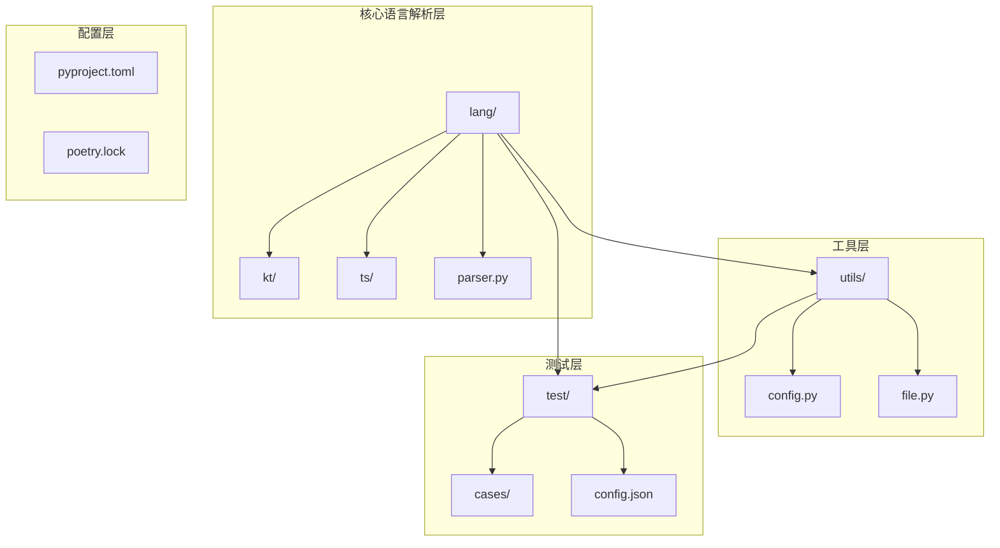
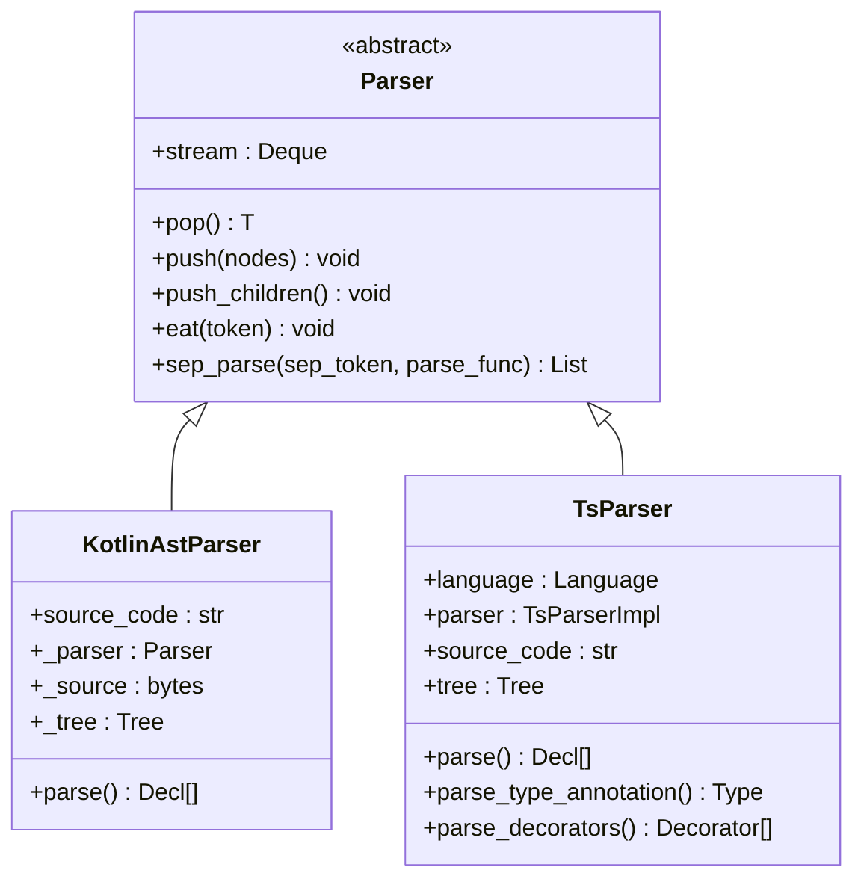
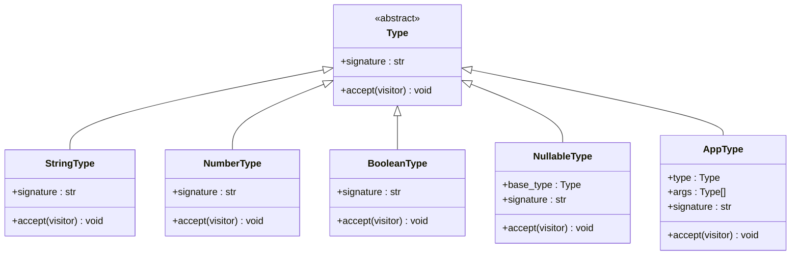
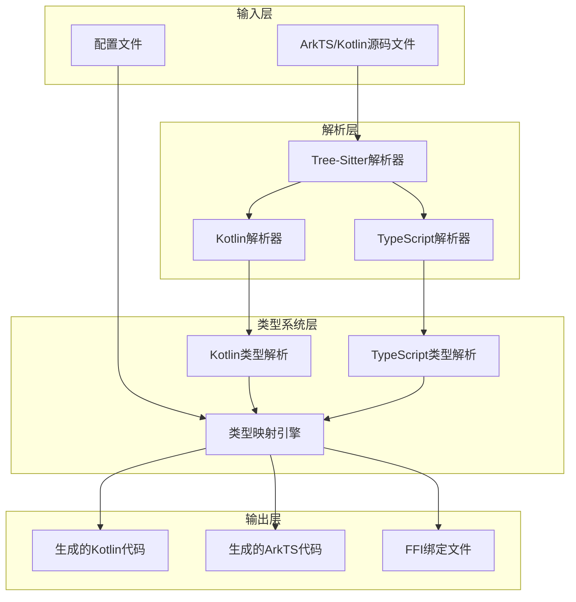
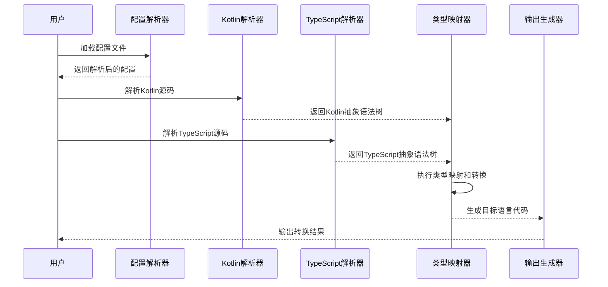
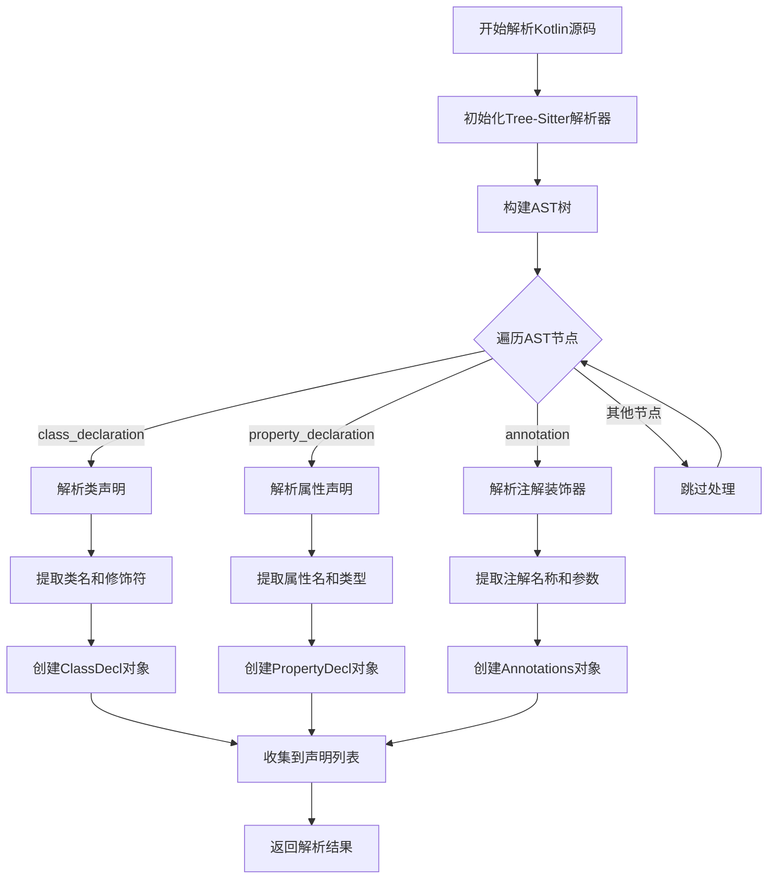
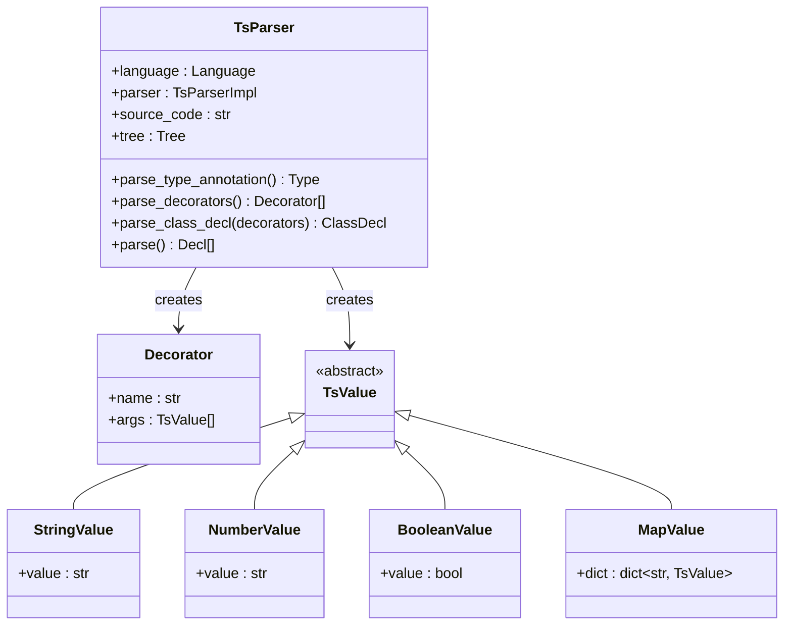
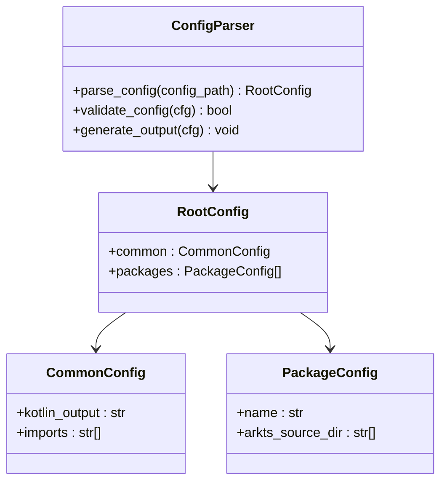
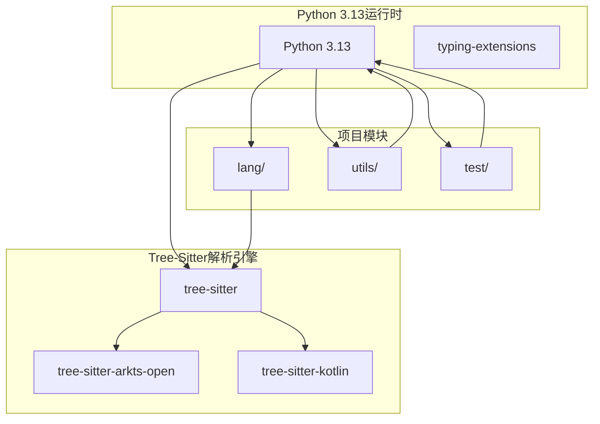
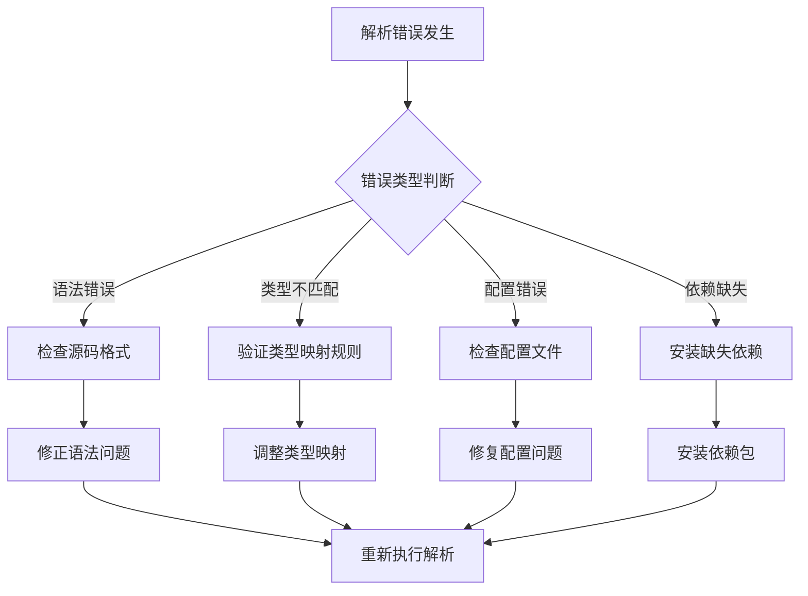

# 项目概述

<cite>
**本文档引用的文件**
- [pyproject.toml](file://pyproject.toml)
- [lang/parser.py](file://lang/parser.py)
- [lang/kt/kt_parser.py](file://lang/kt/kt_parser.py)
- [lang/ts/parser.py](file://lang/ts/parser.py)
- [lang/kt/kt_decls.py](file://lang/kt/kt_decls.py)
- [lang/ts/decls.py](file://lang/ts/decls.py)
- [lang/kt/type_parser.py](file://lang/kt/type_parser.py)
- [lang/ts/ts_types.py](file://lang/ts/ts_types.py)
- [utils/config.py](file://utils/config.py)
- [test/config.json](file://test/config.json)
- [test/cases/kt/class0.kt](file://test/cases/kt/class0.kt)
- [test/cases/class0.ts](file://test/cases/class0.ts)
</cite>

## 目录
1. [引言](#引言)
2. [项目结构](#项目结构)
3. [核心组件](#核心组件)
4. [架构概览](#架构概览)
5. [详细组件分析](#详细组件分析)
6. [依赖分析](#依赖分析)
7. [性能考虑](#性能考虑)
8. [故障排除指南](#故障排除指南)
9. [结论](#结论)

## 引言

Python ArkTS FFI Kotlin项目是一个创新的跨语言开发工具，旨在为ArkTS（Ark TypeScript）和Kotlin之间建立自动化的FFI（Foreign Function Interface）转换桥梁。该项目解决了现代移动应用开发中的一个关键挑战：如何在不同编程语言之间无缝传递数据和调用函数。

### 项目核心目标

该项目的核心目标是实现以下功能：
- **自动化FFI转换**：将ArkTS和Kotlin之间的函数接口进行自动转换
- **装饰器/注解解析**：准确解析和处理两种语言的装饰器和注解系统
- **类型系统映射**：建立两个语言复杂类型系统的精确对应关系
- **跨平台支持**：支持HarmonyOS等多平台的FFI需求

### 技术架构概述

项目采用分层架构设计，通过Tree-Sitter语法解析引擎提供强大的语言解析能力，结合Python 3.13的现代化特性，构建了一个高效、可扩展的跨语言转换系统。

## 项目结构

项目采用模块化组织方式，主要包含以下核心目录：



**图表来源**
- [pyproject.toml](file://pyproject.toml#L8-L12)
- [lang/parser.py](file://lang/parser.py#L1-L57)
- [utils/config.py](file://utils/config.py#L1-L84)

### 目录结构详解

- **lang/**：包含所有语言特定的解析器和类型定义
  - **kt/**：Kotlin语言解析器和类型系统
  - **ts/**：ArkTS/TypeScript语言解析器和类型系统
  - **parser.py**：通用解析器基类

- **utils/**：工具函数和配置管理
  - **config.py**：配置文件解析和验证
  - **file.py**：文件操作工具

- **test/**：测试用例和配置
  - **cases/**：各种语言的示例代码
  - **config.json**：项目配置文件

**章节来源**
- [pyproject.toml](file://pyproject.toml#L8-L12)
- [lang/parser.py](file://lang/parser.py#L1-L57)
- [utils/config.py](file://utils/config.py#L1-L84)

## 核心组件

### 语言解析器架构

项目实现了两个主要的语言解析器，每个都基于Tree-Sitter语法解析引擎：



**图表来源**
- [lang/parser.py](file://lang/parser.py#L8-L57)
- [lang/kt/kt_parser.py](file://lang/kt/kt_parser.py#L199-L235)
- [lang/ts/parser.py](file://lang/ts/parser.py#L25-L237)

### 类型系统映射

项目建立了两个语言复杂的类型系统映射机制：



**图表来源**
- [lang/ts/ts_types.py](file://lang/ts/ts_types.py#L8-L280)
- [lang/kt/type_parser.py](file://lang/kt/type_parser.py#L68-L151)

**章节来源**
- [lang/parser.py](file://lang/parser.py#L8-L57)
- [lang/kt/kt_parser.py](file://lang/kt/kt_parser.py#L1-L242)
- [lang/ts/parser.py](file://lang/ts/parser.py#L1-L237)
- [lang/ts/ts_types.py](file://lang/ts/ts_types.py#L1-L280)

## 架构概览

### 整体系统架构



**图表来源**
- [lang/kt/kt_parser.py](file://lang/kt/kt_parser.py#L199-L235)
- [lang/ts/parser.py](file://lang/ts/parser.py#L25-L237)
- [utils/config.py](file://utils/config.py#L45-L61)

### 数据流处理流程



**图表来源**
- [utils/config.py](file://utils/config.py#L45-L61)
- [lang/kt/kt_parser.py](file://lang/kt/kt_parser.py#L209-L230)
- [lang/ts/parser.py](file://lang/ts/parser.py#L219-L231)

## 详细组件分析

### Kotlin解析器组件

Kotlin解析器是项目的核心组件之一，负责解析Kotlin源码并提取结构化信息：



**图表来源**
- [lang/kt/kt_parser.py](file://lang/kt/kt_parser.py#L130-L149)
- [lang/kt/kt_parser.py](file://lang/kt/kt_parser.py#L94-L127)

#### 关键特性分析

1. **装饰器解析能力**：能够准确解析Kotlin的注解系统，包括带参数和不带参数的注解
2. **类型推断支持**：支持多种Kotlin类型，包括可空类型、泛型类型和数组类型
3. **expect/actual语法支持**：特殊处理Kotlin的expect/actual语法结构
4. **错误处理机制**：提供详细的解析错误信息和异常处理

**章节来源**
- [lang/kt/kt_parser.py](file://lang/kt/kt_parser.py#L1-L242)
- [lang/kt/kt_decls.py](file://lang/kt/kt_decls.py#L1-L51)

### TypeScript解析器组件

TypeScript解析器负责处理ArkTS和TypeScript源码，提供装饰器解析和类型系统支持：



**图表来源**
- [lang/ts/parser.py](file://lang/ts/parser.py#L25-L237)
- [lang/ts/decls.py](file://lang/ts/decls.py#L27-L57)

#### 装饰器解析机制

TypeScript解析器实现了强大的装饰器解析功能：

1. **装饰器识别**：准确识别以@符号开头的装饰器声明
2. **参数解析**：支持字符串、数字、布尔值和对象字面量参数
3. **嵌套装饰器**：支持多个装饰器的组合使用
4. **类型安全**：确保装饰器参数的类型正确性

**章节来源**
- [lang/ts/parser.py](file://lang/ts/parser.py#L179-L199)
- [lang/ts/decls.py](file://lang/ts/decls.py#L27-L31)

### 类型系统映射引擎

类型映射引擎是项目的核心创新点，负责在不同语言的类型系统之间建立精确的对应关系：

```mermaid
flowchart LR
subgraph "Kotlin类型系统"
A[Int]
B[String]
C[List<T>>
D[Map<K,V>]
E[Nullable<T>]
end
subgraph "TypeScript类型系统"
F[number]
G[string]
H[T[]]
I,{K,V}>
J,T | null>
end
subgraph "映射规则"
K[A--F]
L[B--G]
M[C--H]
N[D--I]
O[E--J]
end
A --> K
B --> L
C --> M
D --> N
E --> O
```

**图表来源**
- [lang/kt/type_parser.py](file://lang/kt/type_parser.py#L149-L151)
- [lang/ts/ts_types.py](file://lang/ts/ts_types.py#L66-L280)

#### 类型映射策略

1. **基础类型映射**：整数、字符串、布尔值等基础类型的直接映射
2. **泛型类型处理**：通过AppType和QualifiedType处理复杂的泛型结构
3. **可空类型处理**：通过NullableType处理可空类型的安全转换
4. **集合类型映射**：数组、列表、映射等集合类型的精确对应

**章节来源**
- [lang/kt/type_parser.py](file://lang/kt/type_parser.py#L68-L151)
- [lang/ts/ts_types.py](file://lang/ts/ts_types.py#L127-L280)

### 配置管理系统

配置管理系统提供了灵活的项目配置和管理能力：



**图表来源**
- [utils/config.py](file://utils/config.py#L9-L61)

**章节来源**
- [utils/config.py](file://utils/config.py#L1-L84)
- [test/config.json](file://test/config.json#L1-L27)

## 依赖分析

### 技术栈依赖关系

项目采用了现代化的技术栈，各组件之间的依赖关系如下：



**图表来源**
- [pyproject.toml](file://pyproject.toml#L15-L21)

### 外部依赖管理

项目使用Poetry进行依赖管理，确保了依赖关系的清晰和可维护性：

| 依赖包 | 版本要求 | 用途 |
|--------|----------|------|
| python | ^3.13 | 主要运行时环境 |
| typing-extensions | ^4.12.2 | 类型提示增强 |
| tree-sitter | ^0.25.2 | 通用语法解析 |
| tree-sitter-arkts-open | ^0.1.7 | ArkTS/TypeScript解析 |
| tree-sitter-kotlin | ^1.1.0 | Kotlin解析 |

**章节来源**
- [pyproject.toml](file://pyproject.toml#L15-L21)

## 性能考虑

### 解析性能优化

项目在设计时充分考虑了性能优化：

1. **增量解析**：利用Tree-Sitter的增量解析能力，避免重复解析整个文件
2. **缓存机制**：实现AST树的缓存，减少重复解析开销
3. **流式处理**：采用流式解析方式，支持大文件的高效处理
4. **内存管理**：优化数据结构，减少内存占用

### 并发处理能力

项目具备良好的并发处理能力：
- 支持多文件并行解析
- 可扩展的类型映射引擎
- 异步配置加载机制

## 故障排除指南

### 常见问题及解决方案

#### 解析错误处理



#### 错误诊断步骤

1. **检查源码格式**：确保Kotlin和TypeScript源码符合语法规则
2. **验证类型映射**：确认自定义类型是否正确映射
3. **检查配置文件**：验证配置文件的完整性和正确性
4. **更新依赖版本**：确保所有依赖包都是最新版本

**章节来源**
- [lang/kt/kt_parser.py](file://lang/kt/kt_parser.py#L16-L18)
- [lang/kt/type_parser.py](file://lang/kt/type_parser.py#L18-L20)

## 结论

Python ArkTS FFI Kotlin项目代表了跨语言开发领域的重要进展。通过集成Tree-Sitter语法解析引擎、实现复杂的类型系统映射和提供灵活的配置管理，该项目为现代移动应用开发提供了强有力的工具支持。

### 主要成就

1. **技术创新**：成功实现了ArkTS和Kotlin之间的自动化FFI转换
2. **架构设计**：采用了模块化、可扩展的架构设计
3. **工具完善**：提供了完整的配置管理和错误处理机制
4. **性能优化**：实现了高效的解析和转换算法

### 应用前景

该项目在以下场景具有广泛的应用价值：
- HarmonyOS应用开发
- 跨平台移动应用开发
- 多语言混合项目
- FFI绑定生成工具

通过持续的优化和扩展，该项目有望成为跨语言开发领域的标准工具之一。